第2章


# Clojureの優れたエディタであるEmacsの使用方法

Clojureを使いこなすための旅では、エディタが最も身近な味方になります。私はEmacsでの作業を強くお勧めしますが、もちろん、あなたが望むエディタを使用することも可能です。この章のEmacsの徹底的な指示に従わない場合、または別のエディタを使用する場合、少なくともREPLで動作するようにエディタをセットアップするためにいくつかの時間を投資することは価値があります。私が推奨し、コミュニティで高く評価されている2つの代替ツールは `Cursive` と `Nightcode` です。

Emacsを推薦する理由は、Clojure REPLとの緊密な統合を提供し、書きながら即座にコードを試すことを可能にするからです。このような緊密なフィードバックループは、Clojureを学習している間や、後に本当のClojureプログラムを書くときに役立つでしょう。Emacsはまた、どんなLisp方言でも扱うことができます。実際、EmacsはEmacs Lisp (elisp)と呼ばれるLisp方言で記述されています。

この章の終わりには、あなたのEmacsのセットアップは図2-1のようになっていることでしょう。

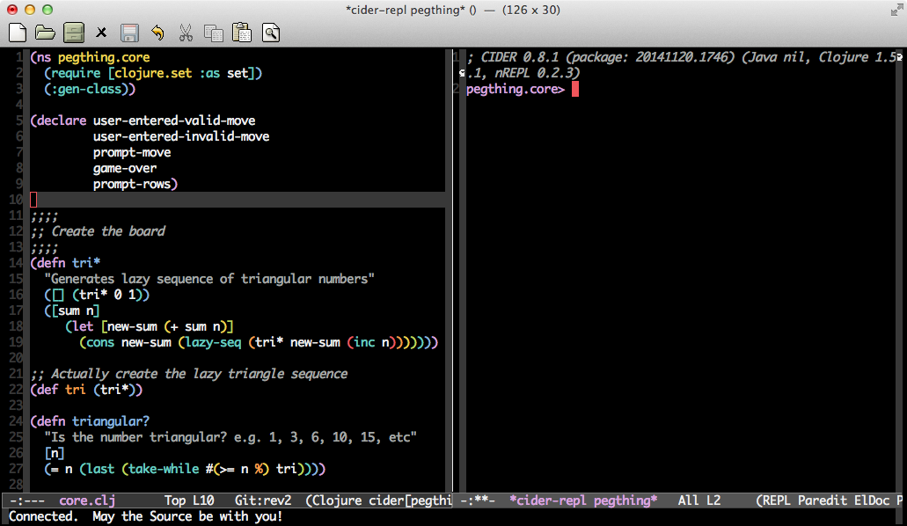


図2-1: Clojureで作業するための典型的なEmacsの設定---一方はコード、もう一方はREPL


まず、Emacsをインストールし、新しい人にやさしいEmacsの設定をします。次に、ファイルの開き方、編集、保存の仕方、キーバインディングを使ったEmacsの操作方法など、基本的なことを学びます。最後に、Clojureコードを実際に編集し、REPLと対話する方法を学びます。

## インストール

Emacsの最新のメジャーバージョンであるEmacs 24を使用する必要があります。

- **OS X** Macアプリとしてvanilla Emacsを*<http://emacsformacosx.com>*からインストールします。Aquamacsのような他のオプションは、Emacsをより「Macらしく」するためのものですが、標準のEmacsとあまりにも異なる設定をしているため、Emacsマニュアルを使用したりチュートリアルに従ったりすることが難しく、長い目で見れば問題です。
- **Ubuntu** *<https://launchpad.net/~cassou/+archive/emacs>* にある説明に従ってください。
- **Windows** *<http://ftp.gnu.org/gnu/emacs/windows/>* にバイナリがあります。最新版をダウンロードして解凍した後、Emacs の実行ファイルを *binrunemacs.exe* で実行できます。

Emacsをインストールした後、Emacsを開いてください。図2-2のような画面が表示されるはずです。

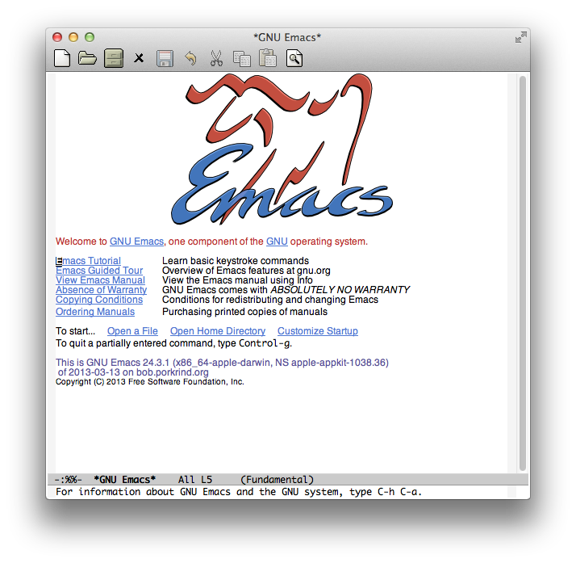


図2-2：Emacsを初めて開いたときの画面


Emacsのカルト集団へようこそ! あなたはRichard Stallmanの誇りです!

## 設定方法

EmacsをClojure用に設定するために必要なすべてのファイルのリポジトリを作成しました。<https://github.com/flyingmachine/emacs-for-clojure/archive/book1.zip>で利用可能です。

注意: これらのツールは常に更新されているので、もし以下の手順がうまくいかない場合や、最新の設定を使いたい場合は、<https://github.com/flyingmachine/emacs-for-clojure/>にある手順を読んでください。

以下の手順で、既存のEmacsの設定を削除し、Clojureに適した設定をインストールします。

1.  Emacsを終了します。
2.  *\~/.emacs* や *\~/.emacs.d* があれば、それらを削除する。(Windows ユーザーの場合、emacs ファイルは *C:\\Users\\your_user_name\\AppData\\Roaming\\* に保存されているはずだ。だから、例えば、*C:\\Users\\jason\\AppData\\Roaming\\.emacs.d*を削除してください。） これは、Emacsが設定ファイルを探す場所であり、これらのファイルやディレクトリを削除することで、まっさらな状態からスタートすることができます。
3. Emacsの設定ファイルのzipファイルをダウンロードし、解凍してください。 中身は *emacs-for-clojure-book1* というフォルダになっているはずです。`mv path/to/emacs-for-clojure-book1 \~/.emacs.d` を実行します。
4. Emacsを開く。

Emacsを開くと、Emacsが有用なパッケージを大量にダウンロードするため、多くの活動が見られるかもしれません。活動が停止したら、Emacsを終了して、もう一度開いてください。(何も表示されなくても大丈夫です!) Emacsを終了して再起動してください)。そうすると、図2-3のようなウィンドウが表示されるはずです。

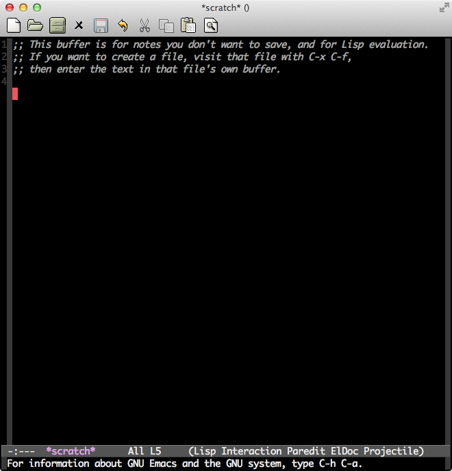


図2-3: インストール後の Emacs の外観


さて、すべての設定が終わったので、Emacs の使い方を学びましょう!

## Emacs のエスケープハッチ

面白いことをやる前に、Emacs の重要なキーバインドを知っておく必要があります。`ctrl`-G. このキーバインディングはあなたが実行しようとしているEmacsのコマンドを終了させます。ですから、うまくいかないときは、`ctrl`を押しながら、Gを押して、もう一度試してみてください。これはEmacsを閉じたり、作業を失ったりするのではなく、現在の動作をキャンセルするだけです。

## Emacsバッファ

すべての編集はEmacsの*buffer*で行われます。Emacsを最初に起動したとき、`*scratch*`という名前のバッファが開かれています。Emacs は図 2-4 に示すように，常にウィンドウの下部に現在のバッファの名前を表示し ます．

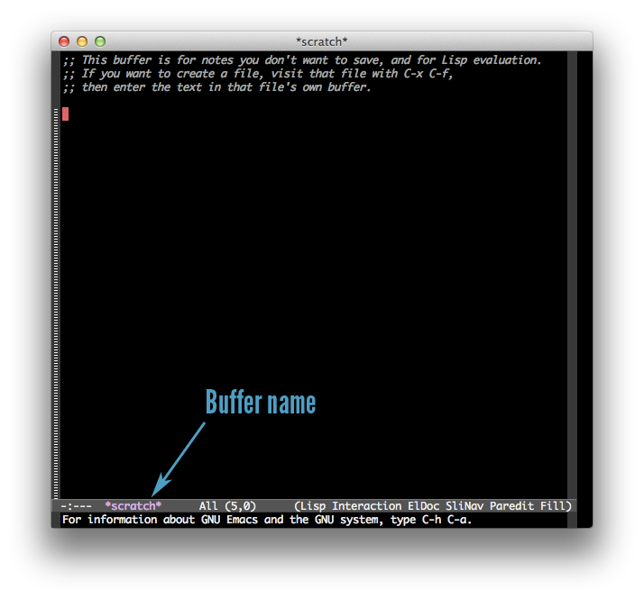


図 2-4: Emacs は常にカレントバッファの名前を表示します。


デフォルトでは、` *scratch* `バッファは括弧とインデントをLispの開発には最適ですが、プレーンテキストを書くには不都合な方法で処理します。予期せぬことが起きないように、新しいバッファを作成して遊んでみましょう。バッファを作るには、次のようにします。

1.  `ctrl` を押しながら X キーを押します。
2.  `ctrl` を離します。
3.  Bを押す。

同じシーケンスをよりコンパクトに表現することができます。**C-x b**.

このキーシーケンスを実行した後，図2-5に示すように，アプリケーションの下部にプロンプトが表示されます．

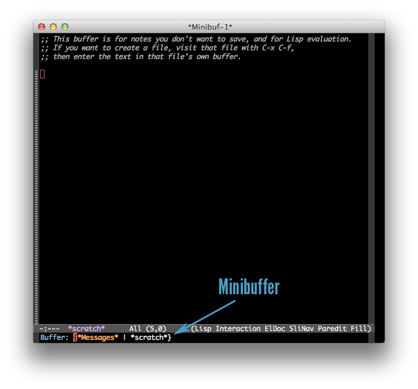のようになります．


図2-5: ミニバッファはEmacsが入力を求めるプロンプトを表示する場所です。


この領域は *minibuffer* と呼ばれ、Emacs が入力を求める場所です。今現在はバッファの名前を尋ねています。すでに開いているバッファの名前を入力することもできますし、新しいバッファの名前を入力することもできます。`emacs-fun-times` と入力し、`enter` を押します。これで完全に空のバッファが表示され、文字入力を開始できるようになります。キーはほとんど期待通りに動くことがわかると思います。文字は入力したとおりに表示されます。上、下、左、右の矢印キーは思ったとおりに動いてくれますし、`enter`で改行されます。

また、突然 Unix の髭を生やしたり、ビルケンシュトックを履くこともありません (元々履いていた場合は別ですが)。このことは、Emacs を使うことに対する長引く不安を和らげるのに役立つはずです。いじり終わったら、**C-x k enter** とタイプしてバッファを*kill*してください。(意外かもしれませんが、Emacsは実に暴力的で、*kill*という言葉を十分に使います)。

これで `emacs-fun-times` バッファは削除され、`*scratch*` バッファに戻ったはずです。一般に、新しいバッファは **C-x b** で好きなだけ作ることができます。また、同じコマンドでバッファを素早く切り替えることができます。この方法で新しいバッファを作成した場合、ファイルとして保存するまではメモリ上にのみ存在します。バッファは必ずしもファイルによってバックアップされているわけではなく、バッファを作成しても必ずしもファイルが作成されるわけではありません。バッファは必ずしもファイルによってバックアップされているわけではありませんし、 バッファを作成したからといって必ずしもファイルが作成されるわけではありません。

## ファイルを操作する

Emacsでファイルを開くためのキーバインドは **C-x C-f** です。XとFの両方を押すときは、`ctrl`を押しながらでないといけないことに注意してください。Emacsの見え方と操作方法をカスタマイズする*\~/.emacs.d/customizations/ui.el*に移動してください。Emacsはファイルをファイル名と同じ名前の新しいバッファに開きます。37行目まで進み、先頭のセミコロンを外してコメントを解除してみましょう。このように表示されます。


```
(setq initial-frame-alist '((top . 0) (left . 0) (width . 120) (height . 80)))
```


次に `width` と `height` の値を変更します。これはアクティブウィンドウの寸法を *characters* 単位で設定するものです。これらの値を変更することで、Emacsのウィンドウを起動するたびに一定の大きさで開くように設定できます。最初は80と20のような小さな値で試してみてください。


```
(setq initial-frame-alist '((top . 0) (left . 0) (width . 80) (height . 20)))
```


ここで、以下のキーバインドでファイルを保存してください。**C-x C-s**. Emacs の下部に `Wrote /Users/snuffleupagus/``.emacs.d/customizations/ui.el` のようなメッセージが表示されるはずです。また、他のアプリケーションで使っているキーバインド(例えば `ctrl`-S や `cmd`-S) を使ってバッファを保存してみることもできます。ダウンロードしたEmacsの設定によってそれができるはずですが、もしできなくても大した問題ではありません。

ファイルを保存したら、Emacsを終了して、もう一度起動してください。きっと、とても小さくなっていることでしょう 図2-6の私の例を見てください。

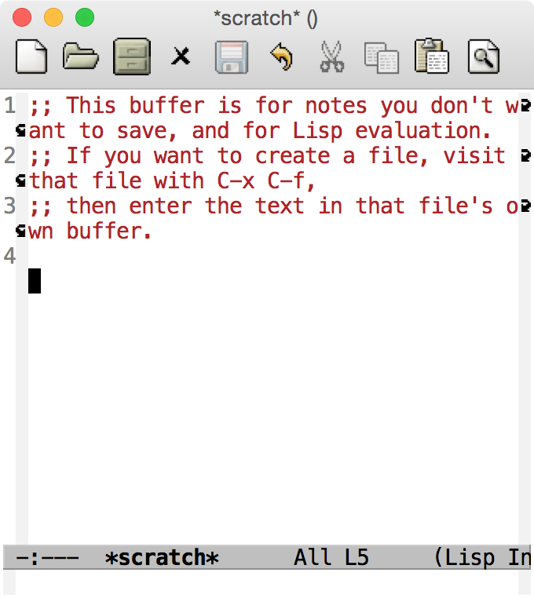{width="300"}


図2-6：Emacsを開くたびに高さと幅を設定するように設定することができます。


Emacsが好みの大きさで起動するまで、同じプロセスを何度か繰り返します。あるいは、これらの行をもう一度コメントアウトして終了します（その場合、Emacsはデフォルトの幅と高さで開かれます）。 *ui.el*の編集が終わったら、**C-x k**でそのバッファを閉じます。 いずれにせよ、Emacsでの最初のファイルの保存は完了です! もし何かおかしなことが起こったら、`"Configuration" on page 13` の指示に従って、Emacsを再び動作させることができます。

新しいファイルを作りたい場合は、 **C-x C-f** を使って、新しいファイルのパスをminibufferに入力するだけです。バッファを保存すると同時に、Emacsはバッファの内容を入力されたパスにファイルを作成します。

おさらいしましょう。

1.  Emacsでは、編集はバッファ*.*で行われます。
2.  バッファに切り替えるには、**C-x b** を使い、ミニバッファ*.* にバッファ名を入力します。
3.  新しいバッファを作成するには、**C-x b** を使って、新しいバッファ名を入力します。
4.  ファイルを開くには、**C-x C-f**を使用して、ファイルに移動してください。
5.  バッファをファイルに保存するには、**C-x C-s**を使用します。
6.  新しいファイルを作成するには、**C-x C-f**を使用して、新しいファイルのパスを入力します。 バッファを保存すると、Emacsはファイルシステム上にファイルを作成します。

## キーバインドとモード

あなたはすでに長い道のりを歩んできました。Emacsをごく基本的なエディタのように使えるようになりました。これはサーバでEmacsを使う必要がある場合や、Emacsオタクとペアになることを強いられた場合に役立つはずです。

しかし、本当に生産的になるためには、キーバインディングに関するいくつかの*重要な*詳細を知っておくと便利です（ハッハッハ！）。次に、Emacsのモードについて説明します。その後、コアとなる用語をいくつか取り上げ、超便利なキーバインドをたくさん紹介します。

### EmacsはLispインタープリタである

キーバインディングという言葉は、Emacsがキーストロークをコマンドにバインドすることに由来しており、コマンドは単なるelisp関数です(ここでは、*コマンド*と*関数*を同じ意味で使用します)。例えば、**C-x b** は `switch-to-buffer` という関数に束縛されます。同様に、**C-x C-s** は `save-file` に束縛されています。

しかし，Emacsはさらにその上を行きます．**f**や**a**のような単純なキー操作でさえも、関数、この場合は `self-insert-command`, 編集中のバッファに文字を追加するコマンドに束縛されています。

Emacsの観点からは、すべての関数は同じように作られており、 `save-file`のようなコア関数でさえも、すべての関数を再定義することができます。おそらくコア関数を再定義したいとは思わないでしょうが、再定義は可能です。

関数を再定義することができるのは、Emacsがそのコアにおいて、たまたまコード編集機能をロードしているLispインタプリタである*だけ*からです。Emacsのほとんどはelispで書かれているので、Emacsの観点からは `save-file`はただの関数で、`switch-to-buffer`や他のほとんどすべてのコマンドと同じように実行することができます。それだけでなく、あなたが作った関数はビルトイン関数と同じように扱われます。Emacsでelispを実行し、その実行中にEmacsを変更することも可能です。

強力なプログラミング言語を使ってEmacsを自由に変更できることが、Emacsの柔軟性であり、私のような人間がEmacsに夢中になる理由なのです。確かに、表面的には複雑な部分も多く、習得には時間がかかります。しかし、Emacsの根底にあるのはLispのエレガントなシンプルさと、それに付随する無限のいじりやすさなのです。このいじりやすさは、単に関数を作ったり再定義したりするだけではありません。キーバインディングを作成したり、再定義したり、削除したりすることも可能です。キーバインディングは、キーストロークと関数を関連付けるルックアップテーブルのエントリに過ぎず、そのルックアップテーブルは完全に変更可能なのです。

また、特定のキーバインディングを使わずに、 **M-x** `function-name` を使ってコマンドを実行することもできます (例えば、 **M-x** `save-buffer` など)。*M*は*meta*の略で、最近のキーボードにはないキーですが、WindowsやLinuxでは `alt` に、Macでは `option` にマッピングされています。**M-x**は`smex`コマンドを実行し、実行する他のコマンドの名前を入力するよう促します。

キーバインドと機能を理解したところで、モードとは何か、どのように機能するかを理解しましょう。

### モード

Emacs *モード* はキーバインディングと関数のコレクションで、さまざまな種類のファイルを編集するときに生産性を高めるためにパッケージ化されています。(モードはEmacsにシンタックスハイライトの方法を教えるようなこともしますが、それは二次的な重要性であり、ここでは取り上げません)。

例えば、Clojureファイルを編集しているとき、Clojureモードをロードしたいと思うでしょう。今、私はMarkdownファイルを書いていて、Markdownモードを使用しています。Markdownモードには、Markdownでの作業に特化した便利なキーバインディングがたくさんあります。Clojureを編集するとき、Clojure固有のキーバインディングのセットを持つことがベストです。例えば、**C-c C-k**は現在のバッファをREPLにロードしてコンパイルします。

モードには2つの種類があります。*メジャー*モードと*マイナー*モードです。MarkdownモードとClojureモードはメジャーモードです。メジャーモードは通常ファイルを開いたときにEmacsが設定しますが、例えば **M-x** `clojure-mode` や **M-x** `major-mode` のように、関連するEmacsコマンドを実行して明示的にモードを設定することも可能です。一度にアクティブになるメジャーモードは1つだけです．

メジャーモードは特定のファイルタイプや言語に対してEmacsを特化させるのに対し、マイナーモードは通常、ファイルタイプに関係なく有用な機能を提供します。例えば、abbrevモードは「あらかじめ定義された略語の定義に基づいてテキストを自動的に展開する」（Emacsマニュアル^[1.](#footnote-5680-1){#footnote-5680-1-backlink .footnote-link}^ による）モードです。複数のマイナーモードを同時にアクティブにすることができます。

どのモードがアクティブになっているかは、図2-7に示すように、*mode line*で確認することができます。

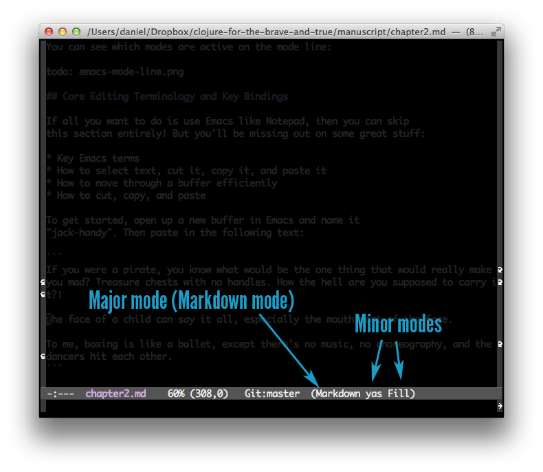


図2-7: モードラインはどのモードがアクティブであるかを示します。


ファイルを開いたときにEmacsがメジャーモードをロードしていない場合、そのモードが存在する可能性があります。そのパッケージをダウンロードする必要があります。そういえば ... ...

### パッケージのインストール

多くのモードは*パッケージ*として配布されています。これはパッケージリポジトリに格納されているelispファイルのバンドルに過ぎません。この章の最初にインストールしたEmacs 24では，パッケージの参照とインストールが非常に簡単にできます．**M-x** `package-list-packages` を実行すると、利用可能なほとんどのパッケージが表示されます。パッケージのインストールは **M-x** `package-install` で行えます。

また、自分で作ったelispファイルやインターネットで見つけたファイルを読み込んで、Emacsをカスタマイズすることもできます。「Emacs入門」(*<http://www.masteringemacs.org/articles/2010/10/04/beginners-guide-to-emacs/>*)の一番下の「新しいパッケージのロード」の項にカスタマイズしたものをロードする方法がよく書かれています。

## 編集のコアとなる用語とキーバインド

Emacsをテキストエディタのように使いたいだけなら、このセクションは読み飛ばしてもかまいません。しかし、あなたはいくつかの素晴らしいものを見逃してしまうでしょう。このセクションでは、Emacs の主要な用語、テキストの選択、カット、コピー、ペーストの方法、テキストの選択、カット、コピー、ペーストの方法（私が何をしたかわかりますか？ ははは！）、バッファの中を効率的に移動する方法について説明します。

まず始めに、Emacsで新しいバッファを開き、*jack-handy*という名前を付けます。 そして、以下のJack Handyの引用を入力します。


```
If you were a pirate, you know what would be the one thing that would
really make you mad? Treasure chests with no handles. How the hell are
you supposed to carry it?!

The face of a child can say it all, especially the mouth part of the
face.

To me, boxing is like a ballet, except there's no music, no
choreography, and the dancers hit each other.
```


この例では、このセクションのナビゲーションと編集を試してみてください。

### ポイント

Emacs のバッファに赤とオレンジの長方形が表示されているのがわかると思います。これは *カーソル* であり、*ポイント* をグラフィカルに表現したものです。ポイントはすべての魔法が起こる場所です。ポイントにテキストを挿入し、ほとんどの編集コマンドはポイントとの関係で行われます。また、カーソルは文字の上にあるように見えますが、ポイントは実際にはその文字と前の文字の間に位置しています。

例えば、*If you were a pirate*の*f*の上にカーソルを置くとします。 ポイントは、*I*と*f*の間にあります。ここで、**C-k**を使うと、*f*から先の文字がすべて消えます。**C-k** は `kill-line` というコマンドを実行し、現在の行のポイント以降のすべてのテキストを *kill* します (killについては後で詳しく説明します)。この変更は **C-/** で元に戻せます。 また、元に戻すには通常のOSのキーバインドを試してみてください。

### 移動

他のエディタと同じように矢印キーでポイントを移動できますが、表2-1に示すように多くのキーバインディングでより効率的に移動できます。

1.  表 2-1: テキストを移動するためのキーバインディング

  Keys        Description
  ----------- ----------------------------------------------------------------------------------------------------
  **C-a**     行頭へ移動する。
  **M-m**     その行の最初の非空白文字に移動する。
  **C-e**     行末に移動する。
  **C-f**     1文字前に移動する。
  **C-b**     後ろに1文字移動
  **M-f**     1語進める（よく使います）。
  **M-b**     1語後退（これもよく使う）
  **C-s**     正規表現で現在のバッファにあるテキストを検索し、そのテキストに移動する。
              もう一度**C-s**を押すと、次のマッチに移動します。
  **C-r**     **C-s**と同じですが、逆方向の検索をします。
  **M-\<**    バッファの先頭に移動します。
  **M-\>**    バッファの終端に移動します。
  **M-g g**   行に移動します。

これらのキーバインドをあなたの*ジャックハンディ*バッファで試してみてください。

### リージョンによる選択

Emacsでは、テキストを*選択*することはありません。**C-spc** ([ctrl]{.Keycap}-spacebar) で*マーク*を設定することで、*リージョン*を作成するのです。そして、ポイントを移動すると、マークとポイントの間がすべてリージョンになります。基本的には[shift]{.Keycap}-selecting textとよく似ています。

例えば、あなたの*ジャックハンディ*バッファで次のようにしてください。

1.  ファイルの先頭に移動する。
2.  **C-spc** を使用します。
3.  **M-f**を2回使用します。If you*を囲むようにハイライトされた領域が表示されます。
4.  バックスペースを押してください。これで*If you*が削除されるはずです。

Shiftキーでテキストを選択する代わりにマークを使用すると、マークを設定した後にEmacsのすべての移動コマンドを自由に使用することができるという点が優れています。例えば、マークを設定した後、**C-s** を使ってバッファ内の何百行も下のテキストを検索することができます。そうすると、非常に大きなリージョンができ、小指で `shift` を押しながら力を入れる必要はありません。

リージョンはまた、操作をバッファの限られた範囲に限定することもできます。これを試してみてください。

1.  *The face of a child can say it all* を包含するリージョンを作成します。
2.  **M-x** [replace-string]{.LiteralBold} を使って、*face* を *head* に置き換えます。

これは、デフォルトの動作であるポイント以降のバッファ全体ではなく、現在の領域内で置換を実行します。

### キリングとキルリング

ほとんどのアプリケーションでは、テキストを*カット*することができますが、これは軽い暴力です。また、コピーやペーストも可能です。カットとコピーは選択範囲をクリップボードに追加し、ペーストはクリップボードの内容を現在のアプリケーションにコピーします。Emacsでは、殺人的なアプローチをとり、リージョンを*kill*して、*kill ring*に追加します。何キロバイトものテキストを廃棄していることを考えると、*大胆*かつ*たくましく*感じませんか？次に、最も最近殺されたテキストをポイントに挿入して、*ヤンク*することができます。また、実際に殺すことなく、テキストをキルリングに*コピー*することもできます。

なぜ、このような病的な用語をわざわざ使うのでしょうか？まず第一に、Emacsで物を殺すという話を聞いても怖くならないようにするためです。しかし、もっと重要なことは、Emacsは典型的なカット/コピー/ペーストのクリップボード機能セットではできない作業を可能にしてくれることです。

Emacsは複数のテキストブロックをキルリングに保存し、それらを循環させることができます。この機能は、ずっと前に削除したテキストを呼び出すことができるため、非常に便利です。では、実際に使ってみましょう。

1.  最初の行にある *Treasure* という単語の上にリージョンを作成します。
2.  `kill-ring-save`コマンドにバインドされている**M-w**を使用します。一般に、**M-w** はコピーに似ています。一般に、**M-w**はコピーと同じで、バッファから削除することなく、キルリングにリージョンを追加します。
3.  ポイントを最後の行の *choreography* という単語に移動します。
4.  **M-d** を使います。これは `kill-word` コマンドにバインドされています。これで*choreography*がkill ringに追加され、バッファから削除されます。
5.  **C-y** を使ってください。これは今殺したテキスト、*choreography*を引っ張り出し、ポイントに挿入します。
6.  **M-y**を使用します。choreography*を削除し、次のアイテムであるTreasure*をヤンクします。

表2-2に、キル／ヤンクの便利なキーバインドを示します。

1.  表2-2：キルとヤンクのキーバインディング テキスト

  Keys      Description
  --------- ----------------------------------------
  **C-w**   リージョンをキルする。
  **M-w**   リージョンをキルリングにコピーします。
  **C-y**   ヤンク
  **M-y**   ヤンク後、キルリングを循環させます。
  **M-d**   ワードの削除
  **C-k**   行の削除

### 編集とヘルプ

表2-3は、文字間や文字拡大を行う際に知っておくと便利な編集用キーバインドをいくつか示しています。

1.  表2-3：その他の便利な編集キーバインディング

  Keys       Description
  ---------- ---------------------------------------------------------------------------------------
  **Tab**    行をインデントする。
  **C-j**    改行とインデント。[enter]{.KeycapBox} の後に [tab]{.KeycapBox} を続けるのと同じ。
  **M-/**    Hippie expand; ポイントの前にあるテキストの可能な拡張を循環させる。
  **M-\\**   ポイントの周りのすべてのスペースとタブを削除する。(私はこれをよく使う)。

また、Emacsには優れたビルトインヘルプがあります。表2-4に示す2つのキーバインディングが役に立ちます。

1.  表2-4：内蔵ヘルプのキーバインディング

  Keys                        Description
  --------------------------- ------------------------------------------------------------------------------------------------------------------------------------
  **C-h k** **key-binding**   キーバインディングに束縛された関数を記述します。
                              これを動作させるには、**C-h k**と入力した後に、
                              実際にキーシーケンスを実行します。
  **C-h f**                   機能を説明する。

ヘルプテキストは新しい*ウィンドウ*に表示されますが、この概念については後ほど説明します。今のところ、ヘルプウィンドウは **C-x o q** を押して閉じることができます。

## ClojureでEmacsを使う

次に、Clojureアプリケーションを効率的に開発するためのEmacsの使い方を説明します。Emacsに接続したREPLプロセスの起動方法と、Emacsのウィンドウの操作方法を学びます。次に、式の評価、ファイルのコンパイル、および他の便利なタスクを実行するための便利なキーバインディングを網羅します。最後に、Clojureのエラーを処理する方法を紹介し、Lispスタイルの言語でコードを書いたり編集したりするのに便利なオプションのマイナーモードであるPareditの機能をいくつか紹介します。

もしあなたがClojureのコードを掘り下げ始めたいのであれば、先に読み飛ばしてください!  後でいつでも戻ることができます。

### REPLを起動しましょう!

第1章で学んだように、REPLはClojureコードを対話的に書き、実行することを可能にします。REPLはプロンプトを表示し、入力を読み、評価し、結果を表示し、プロンプトに戻るループをする実行中のClojureプログラムです。第1章では、ターミナルウィンドウで `lein repl` と入力してREPLを開始しました。この章では、Clojureで直接REPLを起動します。

EmacsとREPLを接続するには、*<https://github.com/clojure-emacs/cider/>*にあるEmacs packageCIDERを使用します。この章の前の設定手順に従えば、すでにインストールされているはずですが、 **M-x** `package-install` を実行して `cider` と入力し、 `enter` を押すことによってインストールすることもできます。

CIDERを使うとEmacsの中でREPLを起動することができ、REPLをより効率的に操作するためのキーバインディングを提供します。さっそくREPLセッションを始めてみましょう。Emacsを使って、第1章で作成したファイル *clojure-noob/src/clojure_noob/core.clj* を開いてください。次に、**M-x** `cider-jack-in` を使ってください。これはREPLを起動し、あなたが対話できる新しいバッファを作成します。しばらく待つと (1分以内)、図2-8のようなものが見えてくるはずです。

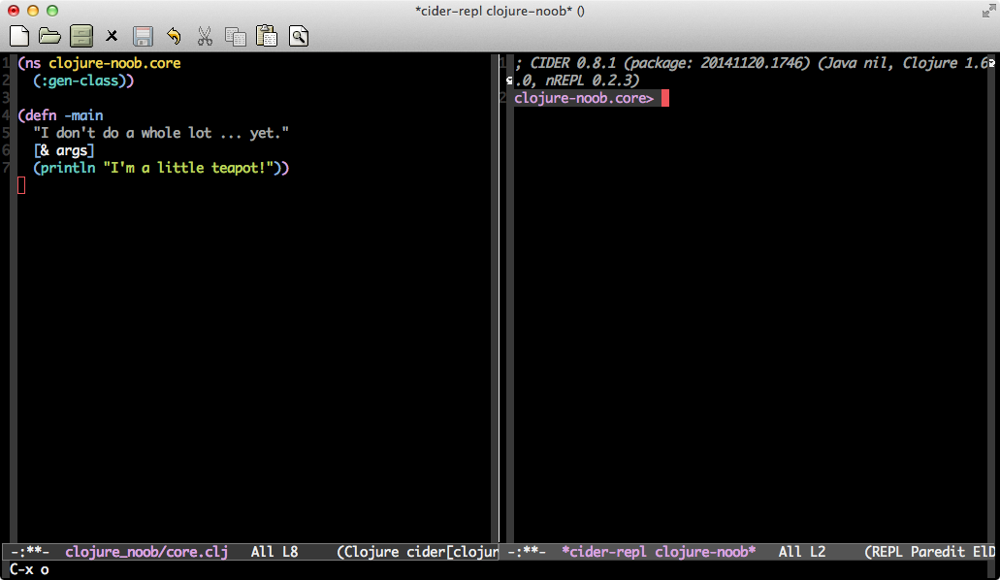


図 2-8: M-x `cider-jack-in` を実行した後の Emacs の様子


左側で *core.clj* ファイルを開き、右側で REPL を実行しています。Emacsがこのように半分に分かれているのを見たことがなくても、心配しないでください。Emacsがどのようにウィンドウを分割しているかについては、後ほど説明します。その間に、REPLでいくつかのコードを評価してみてください。次の太字の行を入力してみてください。`Enter`を押したときにREPLに表示されるはずの結果は、それぞれの行の後に表示されています。この時点では、コードについては心配しないでください。次の章でこれらの関数をすべてカバーします。


```
(+ 1 2 3 4)
; => 10
(map inc [1 2 3 4])
; => (2 3 4 5)
(reduce + [5 6 100])
; => 111
```


かなり気が利いていますね! このREPLは最初の章で`lein repl`を使ったのと同じように使うことができます。さらにいろいろなことができますが、その前に、画面分割したEmacsで作業する方法を説明します。

### 間奏曲 Emacsのウィンドウとフレーム

Emacsがフレームとウィンドウをどのように扱うか、そしてウィンドウに関連する便利なキーバインディングについて説明します。すでにEmacsのウィンドウに慣れている人は、このセクションを飛ばしてもかまいません。

Emacsは1802年頃に作られたので、あなたが使っている用語とは少し違います。通常*ウィンドウ*と呼ばれるものを、Emacsは*フレーム*と呼び、フレームは複数の*ウィンドウ*に分割することができます。複数のウィンドウに分割することで、一度に複数のバッファを表示することができます。あなたはすでに `cider-jack-in` を実行したときに、これが起こるのを見ました (図 2-9 を参照)。

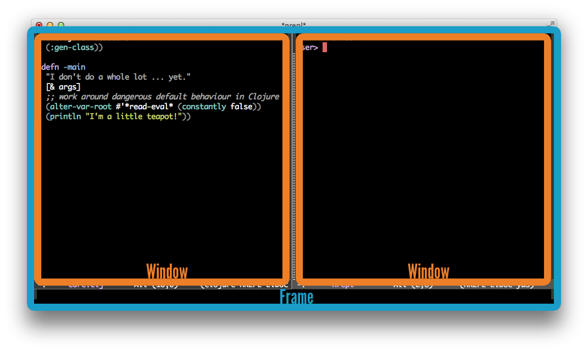


図 2-9: Emacs では、フレームはウィンドウを含んでいます。


表2-5は、フレームとウィンドウを操作するためのいくつかのキーバインディングを示しています。

1.  表2-5: Emacsウィンドウのキーバインディング

  Keys        Description
  ----------- ---------------------------------------------------------------------------------------------------------------------------------------------------
  **C-x o**   カーソルを別のウィンドウに切り替える。
              ClojureファイルとREPLを切り替えるには、これを試してみてください。
  **C-x 1**   他のウィンドウをすべて削除し、フレーム内に現在のウィンドウだけを残します。
              これによってバッファが閉じられることはありませんし、作業も失われることはありません。
  **C-x 2**   分割フレームを上下に配置。
  **C-x 3**   フレームを左右に分割
  **C-x 0**   現在のウィンドウを削除

Emacsのウィンドウキーバインディングを試してみることをお勧めします。例えば、Clojureファイルのある左側のウィンドウにカーソルを置いて、 **C-x 1** を使ってみてください。他のウィンドウは消え、Clojureのコードだけが見えるはずです。次に以下のようにします。

- C-x 3** を使って、ウィンドウを再び横に分割します。
- C-x o** を使って、右のウィンドウに切り替えます。
- C-x b** `cider-repl` を使って、右のウィンドウの CIDER バッファに切り替えます。

少し実験したら、前の画像のように、左側にClojureコード、右側にCIDERバッファの2つの横並びのウィンドウを含むようにEmacsをセットアップしてください。もし、ウィンドウとフレームについてもっと学びたいのであれば、Emacsのマニュアルにたくさんの情報があります: *<http://www.gnu.org/software/emacs/manual/html_node/elisp/Windows.html#Windows>* を参照してください。

Emacsのウィンドウを操作できるようになったので、Clojureの開発キーバインディングを学ぶ時間です!

### 便利なキーバインディングのコーナコピア

EmacsをClojureプロジェクトに使用する真の力を明らかにするいくつかのキーバインディングを学ぶ準備が整いました。これらのコマンドは、わずかなキーストロークでコードを評価、調整、コンパイル、実行することができます。まず、式を素早く評価する方法について説明します。

*core.clj*の一番下に、以下を追加してください。


```
(println "Cleanliness is next to godliness")
```


ここで **C-e** を使って行末に移動し、**C-x C-e** を使ってください。図 2-10 に示すように、`Cleanliness is next to godliness` というテキストが CIDER バッファに表示されるはずです。

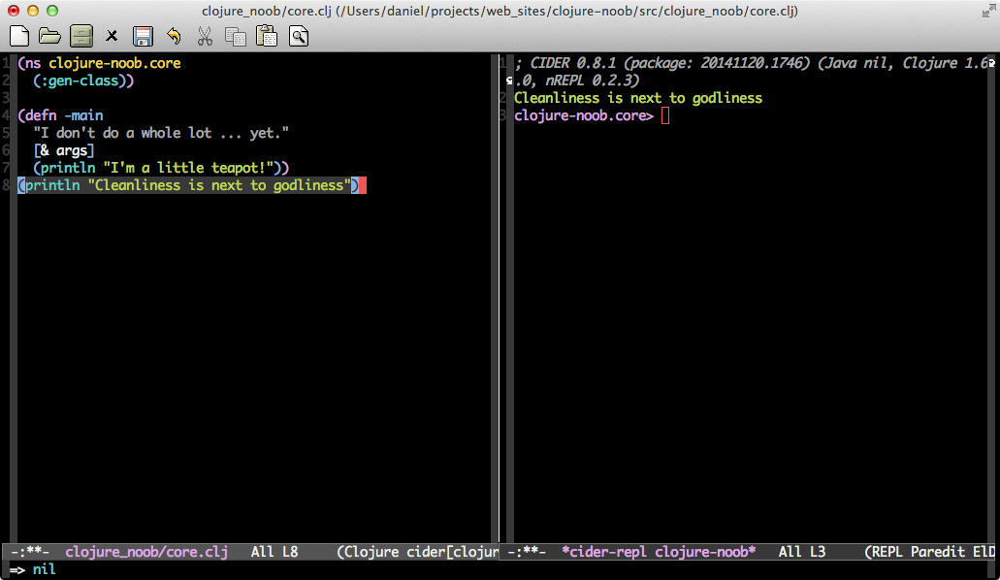


図 2-10: REPL で別のバッファからコードを即座に評価する


キーバインド **C-x C-e** はコマンド `cider-eval-last-expression` を実行します。その名前が示すように、このコマンドは直前の式を REPL に送り、REPL はその式を評価します。また、**C-u C-x C-e** も試すことができ、これは point の後に評価結果を表示します。

では、第1章で書いた `-main` 関数を実行して、私たちが小さなティーポットであることを世間に知らせましょう。

*core.clj*バッファでは、**C-c M-n M-n**を使用してください。このキーバインドにより、名前空間が現在のファイルの先頭にリストされている名前空間に設定されます。したがって、右側のウィンドウのプロンプトは現在 `clojure-noob.core>` と表示されるはずです。名前空間についてまだ詳しく説明していませんが、今は名前空間が名前の衝突を避けるための組織的なメカニズムであることを知っていれば十分です。次に、プロンプトに `(-main)` と入力してください。REPL は `I'm a little teapot!` と表示するはずです。

では、新しい関数を作って実行してみましょう。*core.clj*の一番下に、以下を追加してください。


```
(defn train
  []
  (println "Choo choo!"))
```


終了したら、ファイルを保存し、**C-c C-k** を使ってREPLセッション内で現在のファイルをコンパイルしてください。(REPLがあなたの変更を認識するためには、あなたのコードをコンパイルする必要があります。) これで、REPLで `(train)` を実行すると、`Choo choo!` がエコーバックされます。

REPLの中で、**C-↑** ([ctrl]{.Keycap} + 上矢印キー)を試してみてください。**C-↑**と**C-↓**は、REPLに評価を依頼したすべてのClojure式を含む、REPLの履歴を循環します。

Macユーザーへの注意：OS Xのデフォルトでは、**C-↑**、*C-↓**、**C-←**、*C-→**はMission Controlコマンドにマッピングされます。Macのキーバインドを変更するには、システム環境設定を開き、キーボード[4]{.MenuArrow}Shortcuts[4]{.MenuArrow}Mission Controlを選択してください。

最後に、次のことを試してみてください。

1.  REPLプロンプトで [(-main]{.LiteralBold} と入力します。閉じ括弧がないことに注意してください。
2.  **C-enter**を押す。

CIDERは括弧を閉じ、式を評価するはずである。これはCIDERが多くの括弧を処理するために提供するちょっとした便利な機能である。

CIDERはまた、Clojureを学んでいるときに便利ないくつかのキーバインディングを持っています。**C-c C-d C-d**を押すと、ポイントしているシンボルのドキュメントが表示され、非常に時間の節約になります。ドキュメントを見終わったら、**q**を押してドキュメントバッファを閉じてください。 キーバインド **M-.** はポイントしたシンボルのソースコードに移動し、**M-,** は元のバッファとポジションに戻ります。最後に、**C-c C-d C-a**は、関数名とドキュメントを横断して任意のテキストを検索することができます。これは、関数名を正確に覚えていないときに、その関数を見つけるのに最適な方法です。

CIDER README (*<https://github.com/clojure-emacs/cider/>*) にはキーバインディングの包括的なリストがあり、時間をかけて学ぶことができますが、今のところ、表2-6と表2-7に今説明したキーバインディングの要約が含まれています。

1.  表2-6: Clojureバッファーキーバインディング

  Keys              Description
  ----------------- ------------------------------------------------------------------------------------
  **C-c M-n M-n**   現在のバッファのネームスペースに切り替える。
  **C-x C-e**       ポイント直前の式を評価する。
  **C-c C-k**       現在のバッファをコンパイルする。
  **C-c C-d C-d**   ポイント下のシンボルのドキュメントを表示する
  **M-. and M-,**   ポイント下のシンボルのソースコードに移動し、元のバッファに戻る
  **C-c C-d C-a**   アプロプロス検索：関数名とドキュメントを横断して任意のテキストを検索します。

1.  表 2-7：CIDER バッファーキーバインディング

  Keys           Description
  -------------- ---------------------------------
  **C-↑, C-↓**   REPL の履歴を循環させる。
  **C-enter**    括弧を閉じて評価する。

### エラーの扱い方

このセクションでは、Emacs がエラーに対してどのように反応し、どのようにエラーから回復して楽しい道を進むことができるかを見るために、いくつかのバグがあるコードを書きます。これは REPL バッファと *core.clj* バッファの両方で行います。まずREPLから始めましょう。プロンプトで `(map)` とタイプして `enter` を押してください。図2-11のようなものが表示されるはずです。

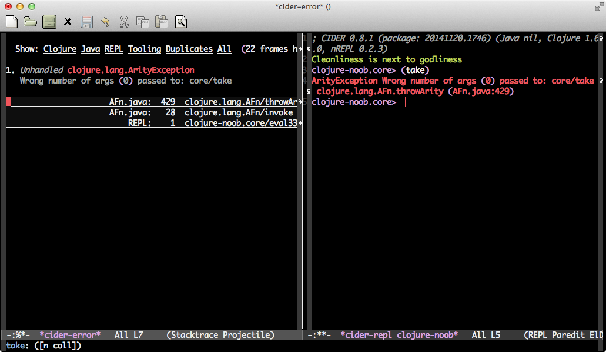


図2-11: これはREPLで悪いコードを実行したときに起こることです。


REPLバッファに `ArityException` エラーメッセージを表示し、左ウィンドウを狂人の戯言のようなテキストで埋め尽くします。これらの怒号は *スタックトレース* で、実際に例外をスローした関数と、どの関数が *その* 関数を呼び出したかを、関数呼び出しのスタックを下って表示します。

Clojureのスタックトレースは、始めたばかりの頃は解読するのが難しいかもしれませんが、しばらくすると、そこから有用な情報を得ることができるようになります。CIDER はスタックトレースをフィルタリングできるようにすることで、例外の原因をゼロにできるように、ノイズを減らす手助けをします。 `*cider-error*`バッファの2行目には、Clojure, Java, REPL, Tooling, Duplicates, and Allというフィルタがあります。各オプションをクリックすると、そのフィルタが有効になります。また、各スタックトレース行をクリックすると、対応するソースコードにジャンプすることができます。

ここでは、左のウィンドウのスタックトレースを閉じる方法を説明します。

1.  **C-x o** を使ってウィンドウを切り替えます。
2.  **q** を押すと、スタックトレースが終了し、CIDERに戻ります。

もし、もう一度エラーを見たい場合は、`*cider-error*` バッファに切り替えます。ファイルをコンパイルしようとしたときにも、エラーメッセージが表示されることがあります。これを見るには、*core.clj* バッファに行き、バグのあるコードを書いて、コンパイルしてください。

1.  `(map)` を末尾に追加する。
2.  **C-c C-k** を使ってコンパイルする。

先ほどと同じような `*cider-error*` バッファが表示されるはずです。もう一度、スタックトレースを閉じるために **q** を押してください。

### Paredit

Clojureバッファでコードを書いているとき、いくつかの予期せぬことが起こっていることに気づいたかもしれません。例えば、左括弧を入力するたびに、すぐに右括弧が挿入されます。

これは*paredit-mode*というLispの大量の括弧を負債から資産に変えるマイナーモードのおかげです。Pareditはすべての括弧、二重引用符、ブラケットを確実に閉じますので、あの忌まわしい負担から解放されます。

また、Pareditはキーバインディングを提供し、すべての括弧によって作られた構造を簡単に操作し、変更することができます。次のセクションでは、最も便利なキーバインディングについて説明しますが、*<https://github.com/georgek/paredit-cheatsheet/blob/master/paredit-cheatsheet.pdf>*（チートシートでは、赤いパイプがポイントを表しています）に包括的なチートシートがあるので、それをチェックすることもできます。

ただし、慣れないうちはpareditが時に煩わしく感じられるかもしれません。時間をかけて学ぶ価値は十二分にあると思いますが、**M-x** `paredit-mode` でいつでもモードをオン・オフにすることができます。

次のセクションでは、最も便利なキーバインドを紹介します。

#### ラッピングとスラーピング

*Wrapping* はポイント以降の式を括弧で囲みます。 *スラーピング*は、閉じ括弧を動かして、次の式を右側に含めます。たとえば、次のように始めるとします。


```
(+ 1 2 3 4)
```


で、これを手に入れたいと考えています。


```
(+ 1 (* 2 3) 4)
```


`2` をラップして、アスタリスクを追加し、`3` をスルリと入れることができます。まず、プレースポイントですが、ここでは縦のパイプで表現しています、`|`です。


```
(+ 1 |2 3 4)
```


次に、**M-(**、*paredit-wrap-round*のバインディングをタイプすると、このような結果が得られます。


```
(+ 1 (|2) 3 4)
```


アスタリスクとスペースを追加する。


```
(+ 1 (* |2) 3 4)
```


3`をスラスラ入れるには、**C-→**を押してください。


```
(+ 1 (* |2 3) 4)
```


これにより、矢印キーを押しながらポイントを移動するような貴重な時間を無駄にすることなく、括弧の追加や拡張を簡単に行えるようになりました。

#### バーフィング

先ほどの例で、誤って 4 を口にしてしまったとします。これを解除するには(*barfing*)、カーソル(`|`)を括弧の中の任意の位置に置きます。


```
(+ 1 (|* 2 3 4))
```


次に、**C-←**を使用します。


```
(+ 1 (|* 2 3) 4)
```


ジャーン! これで、括弧を自由に伸縮させる方法がわかりましたね。

#### ナビゲーション

Lispの方言で書いていると、しばしばこのような式を使うことがあります。


```
(map (comp record first)
     (d/q '[:find ?post
            :in $ ?search
            :where
            [(fulltext $ :post/content ?search)
             [[?post ?content]]]]
          (db/db)
          (:q params)))
```


この種の式では、ある部分式から次の部分式に素早くジャンプするのが便利です。もし、point を開き括弧の直前に置くと、**C-M-f** は閉じ括弧に移動します。 同様に、pointが閉じ括弧の直後にある場合、**C-M-b**は開き括弧に移動します。

表2-8は、今学んだpareditのキーバインドをまとめたものです。

1.  表2-8：Pareditのキーバインディング

  Keys                                   Description
  -------------------------------------- --------------------------------------------------------------------------
  **M-x** [paredit-mode]{.LiteralBold}   Paredit モードを切り替える。
  **M-(**                                ポイント以降の式を括弧で囲む(paredit-wrap-round)。
  **C-**[→]{.char-style-override-2}      Slurp; 閉じた括弧を右に移動して、次の式を含むようにします。
  **C-**[←]{.char-style-override-2}      Barf; 閉じた括弧を左に移動し、最後の式を除外する。
  **C-M-f**, **C-M-b**                   開閉括弧に移動する。

## 学習を続ける

Emacsは最も長い歴史を持つエディタの一つであり、その信奉者はしばしば狂信的なまでにEmacsに熱中します。最初は使いにくいかもしれませんが、使い続ければ一生かけて十分報われるでしょう。

Emacsを開くと、いつもインスピレーションを受ける。まるで職人が工房に入るように、目の前に可能性が広がっているのを感じる。パッケージやキーバインドなど、自分にぴったりと合うように進化してきた環境の心地よさを感じながら、日々、アイデアを実現しています。

Emacsの旅を続ける上で、これらのリソースはあなたの助けになるでしょう。

- *The Emacs Manual*は素晴らしい、包括的な指示を提供します。 毎朝、時間をかけて読んでください。PDFをダウンロードして、外出先でも読めます。*<http://www.gnu.org/software/emacs/manual/html_node/emacs/index.html#Top>*.
- *Emacs Reference Card*は便利なチートシートです。*<http://www.ic.unicamp.br/~helio/disciplinas/MC102/Emacs_Reference_Card.pdf>*.
- Mickey Petersenによる*Mastering Emacs*は、入手可能なEmacsのリソースの中で最も優れたものの1つです。リーディングガイドから始めましょう。*<http://www.masteringemacs.org/reading-guide/>*.
- より視覚的に関心のある人には、手描きの「Emacsの学び方」をお勧めします。Sacha Chuaによる "A Beginner's Guide to Emacs 24 or Later "です。*<http://sachachua.com/blog/wp-content/uploads/2013/05/How-to-Learn-Emacs8.png>*.
- 内蔵のチュートリアルは **C-h t** を押すだけです。

## まとめ

ふぅー! あなたは多くの分野をカバーしました。EmacsのLispインタプリタとしての本性を知ることができたと思います。キーバインディングは elisp の関数を実行するためのショートカットとして機能し、モードはキーバインディングと関数の集合体です。バッファ、ウィンドウ、リージョン、キル、ヤンクをマスターし、Emacsを自在に操る方法を身につけました。最後に、CIDERとpareditを使用してClojureを簡単に操作する方法を学びました。 このように苦労して得たEmacsの知識があれば、いよいよClojureを本格的に学び始める時が来ました!


[1](#footnote-5680-1-backlink){#footnote-5680-1 .footnote-anchor}
*<http://www.gnu.org/software/emacs/manual/html_node/emacs/Minor-Modes.html>*.


