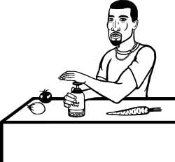
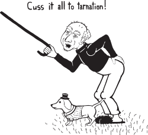
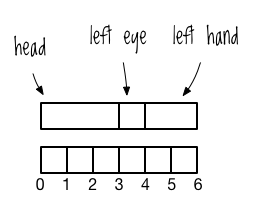

第3章


# やること Clojureクラッシュコース

Clojureで実際に*物を*する方法を学ぶ時が来た! 熱いぜ!  Clojureの素晴らしい並行処理サポートやその他の素晴らしい機能を耳にしたことがあるでしょうが、Clojureの最も顕著な特徴はLispであることです。この章では、このLispの核となる要素である構文、関数、データについて学びます。 これらは、Clojureで問題を表現し、解決するための強固な基礎を与えてくれます。

この基礎を築いた後、あなたは超重要なコードを書くことができるようになります。最後のセクションでは、ホビットのモデルを作成し、ランダムな場所にそれをヒットする関数を書くことによって、すべてを結びつけます。超! 重要!

この章を読み進めるにあたり、REPLにサンプルを打ち込んで実行することをお勧めします。新しい言語でのプログラミングは技術であり、ヨーデルやシンクロナイズドスイミングと同じように、練習しないと身につかないのです。ちなみに、「*シンクロナイズド* *スイミング* *フォー* *ヨーデル* *フォー* *ブレイブ* *アンド* *トゥルー*」は、2020年8月に出版される予定です。ご期待ください。

## 構文

Clojureの構文はシンプルです。他のLispと同様に、統一された構造、少数の特殊な演算子、そしてLispが生まれたマサチューセッツ工科大学の地下に隠された括弧の鉱山から届けられた括弧の絶え間ない供給が採用されています。

### フォーム

すべての Clojure コードは、統一された構造で書かれています。Clojureは2種類の構造を認識します。

- データ構造のリテラル表現（数値、文字列、マップ、ベクターなど）。
- 操作

有効なコードを参照するために *フォーム* という用語を使用します。また、Clojureのフォームを参照するために*式*を使うことがあります。しかし、あまり用語にとらわれないでください。Clojureは値を生成するためにすべてのフォームを*評価*します。これらのリテラル表現はすべて有効なフォームです。


```
1
"a string"
["a" "vector" "of" "strings"]
```


もちろん、自由形式のリテラルがコードに含まれることはほとんどありません。なぜなら、リテラルはそれ自体では実際には何もできないからです。その代わり、リテラルは操作の中で使用します。操作とは、物事を *行う* 方法のことです。すべての操作は、*開き括弧*、*演算子*、*オペランド*、*閉じ括弧*という形式を取ります。


```
(operator operand1 operand2 ... operandn)
```


カンマがないことに注意してください。Clojureはオペランドを区切るために空白を使いますが、カンマは空白として扱います。以下は操作の例です。


```
(+ 1 2 3)
; => 6

(str "It was the panda " "in the library " "with a dust buster")
; => "It was the panda in the library with a dust buster"
```


{.right}

最初の操作では、演算子 `+` がオペランド `1`, `2`, `3` を足し算します。2 番目の操作では、演算子 `str` が 3 つの文字列を連結して新しい文字列を生成します。どちらも有効な形式です。ここで、閉じ括弧がないので、フォームではないものを紹介します。


```
(+
```


Clojureの構造的な統一性は、おそらくあなたが慣れ親しんでいるものとは異なるでしょう。他の言語では、異なる演算は演算子とオペランドに依存して異なる構造を持つかもしれません。例えば、JavaScriptでは、infix記法、ドット演算子、括弧の寄せ集めを採用しています。


```
1 + 2 + 3
"It was the panda ".concat("in the library ", "with a dust buster")
```


Clojureの構造は、それに比べて非常にシンプルで一貫しています。どの演算子を使おうが、どのようなデータを操作しようが、その構造は同じです。

### 制御フロー

ここでは3つの基本的な制御フロー演算子を見てみましょう。`if`, `do`, `when` です。この本の中ではもっと多くの演算子が登場しますが、まずはこの3つから始めましょう。

#### if

これは `if` 式の一般的な構造です。


```
(if boolean-form
  then-form
  optional-else-form)
```


ブール・フォームとは、真偽値を評価するフォームに過ぎません。次の節で真偽判定について学びます。 ここにいくつかの `if` の例があります。


```
(if true
  "By Zeus's hammer!"
  "By Aquaman's trident!")
; => "By Zeus's hammer!"

(if false
  "By Zeus's hammer!"
  "By Aquaman's trident!")
; => "By Aquaman's trident!"
```


最初の例では、ブール・フォームが真値である `true` と評価されるので `"By Zeus's hammer!" ` を返し、2番目の例では、ブール・フォームが偽値である `false` と評価されるので `"By Aquaman's trident!" ` を返します。

また、 `else` ブランチを省略することもできます。もし、そうしてブール式が偽の場合、Clojureは次のように `nil` を返します。


```
(if false
  "By Odin's Elbow!")
; => nil
```


`if` はオペランドを `then` および `else` ブランチに関連付けるために、オペランドの位置を使用していることに注意してください。その結果、各ブランチは1つのフォームしか持つことができません。これは多くの言語と異なる点です。 例えば、Rubyではこのように書くことができます。


```
if true
  doer.do_thing(1)
  doer.do_thing(2)
else
  other_doer.do_thing(1)
  other_doer.do_thing(2)
end
```


この明らかな制限を回避するために、`do`演算子を使用することができます。

#### do

`do` 演算子を使うと、複数のフォームを括弧で *wrap* *up* して、それぞれを実行することができます。REPL で以下を試してみてください。


```
(if true
  (do (println "Success!")
      "By Zeus's hammer!")
  (do (println "Failure!")
      "By Aquaman's trident!"))
; => Success!
; => "By Zeus's hammer!"
```


この演算子を使うと、`if`式の分岐のそれぞれで複数のことを行うことができます。この場合、2つのことが起こります。`Success!` が REPL に表示され、 `"` Zeus's hammer!`"` が `if` 式の全体の値として返されます。

#### when

`when` 演算子は `if` と `do` を組み合わせたようなものですが、`else` ブランチがありません。以下はその例です。


```
(when true
  (println "Success!")
  "abra cadabra")
; => Success!
; => "abra cadabra"
```


ある条件が真のときに複数の処理を行い、その条件が偽のときは常に `nil` を返したい場合は `when` を使う。

#### nil, true, false, 真偽, 等式, ブール式

Clojure には `true` と `false` という値があります。`nil` は Clojure では *値* がないことを示すのに使われます。ある値が `nil` であるかどうかは、適切な名前の `nil?` 関数で確認することができます。


```
(nil? 1)
; => false

(nil? nil)
; => true
```


`nil` と `false` の両方は論理的な偽を表すのに使われ、それ以外の値は論理的に真であることを表します。*Truthy* と *falsey* は、 `if` に渡される最初の式のようなブール式の中で、値がどのように扱われるかを示しています。


```
(if "bears eat beets"
  "bears beets Battlestar Galactica")
; => "bears beets Battlestar Galactica"

(if nil
  "This won't be the result because nil is falsey"
  "nil is falsey")
; => "nil is falsey"
```


最初の例では、文字列 `"bears eat beets"` は真で、`if` 式は `"bears beets Battlestar Galactica"` と評価されるものとします。2番目の例では、nilの値をfalseyとして表示しています。

Clojureの等式演算子は `=` です。


```
(= 1 1)
; => true

(= nil nil)
; => true

(= 1 2)
; => false
```


他の言語では、異なる型の値を比較する場合、異なる演算子を使う必要があるものもあります。例えば、文字列のために作られたある種の特別な文字列の等式演算子を使わなければならないかもしれません。しかし、Clojureの組み込みデータ構造を使用する場合、等質性をテストするためにそのような奇妙で退屈なものは必要ありません。

Clojureはブール演算子 `or` と `and` を使用します。`or` は最初の真偽値か最後の値を返します。また、 `and` は最初の偽の値か、偽の値がない場合は最後の真偽値を返します。まず、`or`について見てみましょう。


```
(or false nil :large_I_mean_venti :why_cant_I_just_say_large)
; => :large_I_mean_venti

(or (= 0 1) (= "yes" "no"))
; => false

(or nil)
; => nil
```


最初の例では、戻り値は `:large_I_mean_venti` で、これは最初の真の値であるからです。2つ目の例では、真の値が存在しないので、 `or` は最後の値である `false` を返します。最後の例では、再び真の値は存在せず、 `or` は最後の値である `nil` を返します。では、次に `and` について見てみましょう。


```
(and :free_wifi :hot_coffee)
; => :hot_coffee

(and :feelin_super_cool nil false)
; => nil
```


最初の例では、`and`は最後の真の値である `:hot_coffee` を返します。2番目の例では、 `and` は最初の偽の値である `nil` を返します。

### def による値の命名

Clojureでは、名前と値を *束縛* するために `def` を使用します。


```
(def failed-protagonist-names
  ["Larry Potter" "Doreen the Explorer" "The Incredible Bulk"])

failed-protagonist-names
; => ["Larry Potter" "Doreen the Explorer" "The Incredible Bulk"]
```


{.right}

この場合、`failed-protagonist-names`という名前を3つの文字列を含むベクターにバインドしています（ベクターについては `"Vectors" on page 45` で学びます）。

他の言語では、値を *変数* に *代入* していると言いますが、私は *束縛* という言葉を使っていることに注意してください。他の言語では、同じ変数に複数の値を代入することが推奨されています。

例えば、Rubyでは、一つの変数に複数の代入を行い、その値を積み上げていきます。


```
severity = :mild
error_message = "OH GOD! IT'S A DISASTER! WE'RE "
if severity == :mild
  error_message = error_message + "MILDLY INCONVENIENCED!"
else
  error_message = error_message + "DOOOOOOOMED!"
end
```


Clojureでも同じようなことをしたくなるかもしれません。


```
(def severity :mild)
(def error-message "OH GOD! IT'S A DISASTER! WE'RE ")
(if (= severity :mild)
  (def error-message (str error-message "MILDLY INCONVENIENCED!"))
  (def error-message (str error-message "DOOOOOOOMED!")))
```


しかし、このように名前に関連する値を変更すると、どの値が名前に関連するのか、なぜその値が変更されたのかを知ることが難しくなるため、プログラムの動作を理解することが難しくなります。Clojureには変更を扱うための一連のツールがあり、それについては第10章で学びます。Clojureを学ぶと、名前と値の関連付けを変更する必要がほとんどないことに気づくでしょう。ここに、先のコードを書くことができる一つの方法があります。


```
(defn error-message
  [severity]
  (str "OH GOD! IT'S A DISASTER! WE'RE "
       (if (= severity :mild)
         "MILDLY INCONVENIENCED!"
         "DOOOOOOOMED!")))

(error-message :mild)
; => "OH GOD! IT'S A DISASTER! WE'RE MILDLY INCONVENIENCED!"
```


ここでは、 `error-message` という関数を作成し、 `severity` という 1 つの引数を受け取って、どの文字列を返すかを決定します。 そして、深刻度を `:mild` にして関数を呼び出します。関数の作り方については、 `"Functions" on page 48` で学びます。それまでは、 `def` を定数を定義するように扱ってください。次の数章では、関数型プログラミングのパラダイムを取り入れることで、この明らかな制限をどのように扱うかを学びます。

## データ構造

Clojureには、ほとんどの場合使用することになるデータ構造がいくつかあります。もしあなたがオブジェクト指向のバックグラウンドを持っているならば、ここで紹介する一見基本的な型でどれだけのことができるかに驚かれることでしょう。

Clojureのデータ構造はすべて不変です。つまり、その場で変更することはできないのです。例えば、Rubyでは、失敗した主人公の名前をインデックス0に再割り当てするために、次のようにすることができます。


```
failed_protagonist_names = [
  "Larry Potter",
  "Doreen the Explorer",
  "The Incredible Bulk"
]
failed_protagonist_names[0] = "Gary Potter"

failed_protagonist_names
# => [
#   "Gary Potter",
#   "Doreen the Explorer",
#   "The Incredible Bulk"
# ]
```


Clojureにはこれに相当するものがありません。Clojureがなぜこのように実装されたかについては第10章で詳しく説明しますが、今はそんな哲学的なことは抜きにして、物事を行う方法だけを学ぶのも楽しいものです。さて、Clojureで数字を見てみましょう。

### 数字

Clojureはかなり洗練された数値のサポートを持っています。私はつまらない技術的な詳細（強制や伝染など）についてあまり時間を費やさないようにします。もし退屈な詳細に興味があるなら、*http://clojure.org/data_structures#Data%20Structures-Numbers*にあるドキュメントをチェックしてみてください。Clojureは、あなたが投げかけるほとんどすべてのものを快く処理してくれるということだけで十分です。

とりあえず、私たちは整数と浮動小数点数で作業します。また、Clojureが直接表現できる分数も扱います。以下はそれぞれ、整数、浮動小数点数、分数です。


```
93
1.2
1/5
```


### 文字列

文字列はテキストを表す。この名前は、古代フェニキア人がある日、糸にまつわる事故からアルファベットを発明したことに由来しています。以下は、文字列リテラルの例です。


```
"Lord Voldemort"
"\"He who must not be named\""
"\"Great cow of Moscow!\" - Hermes Conrad"
```


{.right}

Clojureは文字列を区切るのに二重引用符しか使えないことに注意してください。 例えば `'Lord Voldemort'` は有効な文字列ではありません。また、Clojureは文字列の挿入をしないことにも注意してください。Clojureは `str` 関数で文字列の連結を行うだけです。


```
(def name "Chewbacca")
(str "\"Uggllglglglglglglglll\" - " name)
; => "Uggllglglglglglglglll" - Chewbacca
```


### マップ

マップは、他の言語における辞書やハッシュに似ています。ある値を他の値と関連付ける方法です。Clojureの2種類のマップはハッシュ・マップとソート・マップです。ここではより基本的なハッシュ・マップだけを扱います。マップ・リテラルの例をいくつか見てみましょう。ここに空のマップがあります。


```
{}
```


この例では、 `:first-name` と `:last-name` がキーワードになります (次のセクションで説明します)。


```
{:first-name "Charlie"
 :last-name "McFishwich"}
```


ここでは、`"string-key"` と `+` 関数を関連付けています。


```
{"string-key" +}
```


マップは入れ子にすることができます。


```
{:name {:first "John" :middle "Jacob" :last "Jingleheimerschmidt"}}
```


マップの値は、文字列、数値、マップ、ベクトル、関数など、どのような型でも良いことに注意してください。Clojureは気にしません!

マップリテラルを使う以外に、 `hash-map` 関数を使用してマップを作成することができます。


```
(hash-map :a 1 :b 2)
; => {:a 1 :b 2}
```


マップの値を調べるには、 `get` 関数を使用します。


```
(get {:a 0 :b 1} :b)
; => 1

(get {:a 0 :b {:c "ho hum"}} :b)
; => {:c "ho hum"}
```


これらの例では、 `get` に与えられたマップの `:b` キーの値を尋ねています。最初のケースでは `1` が返され、2番目のケースではネストしたマップ `{:c "ho hum"}` が返されます。

`get`はキーが見つからなければ`nil`を返す。また、`"unicorns?"`のようなデフォルト値を返すこともできる：


```
(get {:a 0 :b 1} :c)
; => nil

(get {:a 0 :b 1} :c "unicorns?")
; => "unicorns?"
```


`get-in` 関数を使用すると、ネストされたマップの値を調べることができます。


```
(get-in {:a 0 :b {:c "ho hum"}} [:b :c])
; => "ho hum"
```


マップ内の値を調べるもう一つの方法は、マップをキーを引数とする関数のように扱うことである。


```
({:name "The Human Coffeepot"} :name)
; => "The Human Coffeepot"
```


マップのもう一つのクールな点は、キーワードを関数として使ってその値を調べることです。これは次のテーマであるキーワードにつながります。

### キーワード

Clojureキーワードは、それらがどのように使用されるかを見ることによって、最もよく理解されます。前のセクションで見たように、それらは主にマップのキーとして使われます。 以下はキーワードの例です。


```
:a
:rumplestiltsken
:34
:_?
```


キーワードは、データ構造中の対応する値を検索する関数として使用することができる。例えば、`:a` をマップから検索することができる。


```
(:a {:a 1 :b 2 :c 3})
; => 1
```


以下と同等である。


```
(get {:a 1 :b 2 :c 3} :a)
; => 1
```


`get` と同様に、デフォルト値を指定することができる。


```
(:d {:a 1 :b 2 :c 3} "No gnome knows homes like Noah knows")
; => "No gnome knows homes like Noah knows"
```


キーワードを関数として使用することは、とても簡潔であり、真のClojuristは常にこれを行います。あなたもそうしてください。

### ベクター

vector は配列に似ていて、0 インデックスのコレクションです。 たとえば、次のようなベクター・リテラルがあります。


```
[3 2 1]
```


ここでは、ベクトルの0番目の要素を返しています。


```
(get [3 2 1] 0)
; => 3
```


ここにもインデックスによる取得の例があります。


```
(get ["a" {:name "Pugsley Winterbottom"} "c"] 1)
; => {:name "Pugsley Winterbottom"}
```


ベクターの要素はどのような型でもよく、型を混ぜることもできることがおわかりいただけると思います。また、マップの値を調べるときに使用するのと同じ `get` 関数を使用していることに注意してください。

ベクターは `vector` 関数で作成することができます。


```
(vector "creepy" "full" "moon")
; => ["creepy" "full" "moon"]
```


`conj` 関数を使用すると、ベクトルに要素を追加することができます。要素は、ベクトルの *末尾* に追加されます。


```
(conj [1 2 3] 4)
; => [1 2 3 4]
```


ベクターだけがシーケンスを格納する方法ではなく、Clojureには*リスト*もあります。

### リスト

リストは値の線形コレクションであるという点で、ベクトルに似ています。しかし、いくつかの違いがあります。例えば、 `get` でリストの要素を取得することはできません。リストリテラルを書くには、要素を括弧で囲み、先頭にシングルクォートをつければよい。


```
'(1 2 3 4)
; => (1 2 3 4)
```


REPL がリストを出力するとき、シングルクォートが含まれていないことに注意してください。なぜこのようなことが起こるのかについては、後の第7章で触れることにします。 リストから要素を取得したい場合は、 `nth` 関数を使用します。


```
(nth '(:a :b :c) 0)
; => :a

(nth '(:a :b :c) 2)
; => :c
```


この本では性能について詳しく説明しません。なぜなら、言語に慣れるまで性能に注目することは有益ではないと思うからです。しかし、 `nth` を使ってリストから要素を取り出すのは、 `get` を使ってベクトルから要素を取り出すよりも遅いということを知っておくと良いでしょう。これは、Clojureがリストの *n* 番目の要素に到達するために *n* 個の要素をすべて横断しなければならないのに対して、ベクトルの要素にインデックスでアクセスするにはせいぜい数ホップしかかからないからです。

リストの値は任意の型を持つことができ、 `list` 関数を使用してリストを作成することができます。


```
(list 1 "two" {3 4})
; => (1 "two" {3 4})
```


リストの*先頭*に要素が追加されます。


```
(conj '(1 2 3) 4)
; => (4 1 2 3)
```


リストを使うべきときと、ベクターを使うべきときとは？経験則から言うと、シーケンスの先頭に簡単に項目を追加する必要がある場合やマクロを書く場合は、リストを使うべきです。それ以外の場合は、ベクターを使うべきです。より深く学ぶことで、どのような場合にリストを使うべきかがわかってくるでしょう。

### セット

セットはユニークな値のコレクションです。Clojureには2種類のセットがあります：ハッシュ・セットとソート・セットです。ハッシュ・セットの方がよく使われるので、ハッシュ・セットに焦点を当てます。以下はハッシュ・セットのリテラル表記です。


```
#{"kurt vonnegut" 20 :icicle}
```


また、セットを作成するために `hash-set` を使用することもできる。


```
(hash-set 1 1 2 2)
; => #{1 2}
```


ある値の複数のインスタンスがセット内で一意となることに注意してください。したがって、1つの `1` と 1つの `2` が残ります。もし、すでにその値を含んでいるセット（次のコードでは `:b` など）に値を追加しようとしても、その値は1つしかありません。


```
(conj #{:a :b} :b)
; => #{:a :b}
```


また、 `set` 関数を使用すると、既存のベクターや リストからセットを作成することができます。


```
(set [3 3 3 4 4])
; => #{3 4}
```


セットの所属を確認するには、 `contains?` 関数を使用するか、 `get` を使用するか、セットを引数にした関数としてキーワードを使用します。関数の `contains?` は `true` または `false` を返しますが、 `get` やキーワード検索は値が存在すればその値を返し、存在しなければ `nil` を返します。

以下は `contains?` の使用方法です。


```
(contains? #{:a :b} :a)
; => true

(contains? #{:a :b} 3)
; => false

(contains? #{nil} nil)
; => true
```


キーワードの使い方はこんな感じです。


```
(:a #{:a :b})
; => :a
```


そして、`get`の使い方は次の通りです。


```
(get #{:a :b} :a)
; => :a

(get #{:a nil} nil)
; => nil

(get #{:a :b} "kurt vonnegut")
; => nil
```


セット内に `nil` が含まれるかどうかを調べるために `get` を使用すると、常に `nil` が返されるので、混乱することに注意してください。セットの構成要素に特化してテストする場合は、 `contains?` の方がよいかもしれません。

### 簡略化

ここまでのデータ構造の扱いには、新しい型やクラスを作成する方法の説明が含まれていないことにお気づきかもしれません。その理由は、Clojureのシンプルさを強調することで、組み込みのデータ構造に最初に手を伸ばすことを推奨しているからです。

もしあなたがオブジェクト指向のバックグラウンドを持っているならば、このアプローチは奇妙で後ろ向きだと思うかもしれません。しかし、あなたのデータが有用で理解しやすいものであるためには、クラスと緊密にバンドルされる必要がないことがわかるでしょう。Clojuristに愛される格言に、Clojureの哲学をほのめかすものがあります。

> 10個のデータ構造に10個の関数があるより、1個のデータ構造に100個の関数がある方が良い。
>---アラン・パーリス

Clojureの哲学のこの側面については、これからの章で詳しく学びます。今は、基本的なデータ構造に固執することでコードの再利用性を高める方法に注目してください。

これでClojureデータ構造入門を終わります。次は、関数とデータ構造の使い方を学びましょう。

## 関数

Lispsに熱狂する理由の1つは、これらの言語が複雑な動作をするプログラムを構築できるにもかかわらず、主要な構成要素である関数が非常にシンプルであることです。このセクションでは、Lisp関数の美しさと優雅さについて説明します。

- 関数の呼び出し
- 関数はマクロや特殊な書式とどう違うのか
- 関数の定義
- 匿名関数
- 関数の戻り値

### 関数の呼び出し

さて、ここまでで関数の呼び出しの例をたくさん見てきたと思います。


```
(+ 1 2 3 4)
(* 1 2 3 4)
(first [1 2 3 4])
```


すべての Clojure の操作は同じ構文であることを忘れないでください：開き括弧、演算子、オペランド、閉じ括弧。*関数* *呼び出し* は、演算子が関数または *関数* *式* (関数を返す式)である操作の別の用語にすぎません。

これにより、かなり面白いコードを書くことができます。以下は、`+` (加算) 関数を返す関数式です。


```
(or + -)
; => #<core$_PLUS_ clojure.core$_PLUS_@76dace31>
```


その戻り値は加算関数の文字列表現である。 `or` の戻り値は最初の真の値であり、ここでは加算関数が真の値であるため、加算関数が返される。また、この式を別の式の演算子として使用することもできる。


```
((or + -) 1 2 3)
; => 6
```


`(or + -)` は `+` を返すので、この式は `1`, `2`, `3` の和として評価され、 `6` が返されます。

以下は、それぞれ `6` を返す、もう2つの有効な関数呼び出しです。


```
((and (= 1 1) +) 1 2 3)
; => 6

((first [+ 0]) 1 2 3)
; => 6
```


最初の例では、`and`の戻り値は最初の偽の値か最後の真値である。この場合、 `+` は最後の真の値なので返され、引数 `1 2 3` に適用されて `6` が返される。2番目の例では、`first`の戻り値はシーケンスの最初の要素であり、この場合は `+` である。

しかし、数値や文字列は関数ではないので、これらは有効な関数呼び出しではありません。


```
(1 2 3 4)
("test" 1 2 3)
```


これらをREPLで実行すると、次のようなものが得られます。


```
ClassCastException java.lang.String cannot be cast to clojure.lang.IFn
user/eval728 (NO_SOURCE_FILE:1)
```


Clojureを使い続けていると、このエラーを何度も目にすることになるはずです。*\<x\>* *cannot* *be* *cast* *to* *clojure.lang.IFn* は、何かを関数として使おうとしているが、そうでないことを意味しています。

関数の柔軟性は、関数式で終わりません!  構文的には、関数はどんな式でも引数として取ることができます—*他*の*関数*を含めて。関数を引数に取ったり、関数を返したりできる関数は、高階関数と呼ばれます。高階関数を持つプログラミング言語は、*一級* *関数*をサポートしていると言われています。なぜなら、数値やベクトルなどの身近なデータ型を扱うのと同じように、関数を値として扱えるからです。

例えば、 `map` 関数（map データ構造と混同しないように）を見てみましょう。`map` はコレクションの各メンバーに関数を適用して、新しいリストを作成します。ここでは、 `inc` 関数は数値を 1 だけ増加させます。


```
(inc 1.1)
; => 2.1

(map inc [0 1 2 3])
; => (1 2 3 4)
```


(引数としてベクトルを与えても、 `map` はベクトルを返さないことに注意してください。その理由は4章で学びます。今のところ、これは大丈夫で期待されていることだと信じてください)。

Clojureの一級関数のサポートは、一級関数のない言語よりも強力な抽象化を構築することを可能にします。この種のプログラミングに馴染みのない人は、関数をデータ・インスタンスに対する操作を一般化するためのものだと考えてください。例えば、`+`関数は特定の数に対する足し算を抽象化する。

これに対して、Clojure（およびすべてのLisp）では、プロセスを汎化する関数を作成することができます。例えば、 `map` は任意のコレクションに関数---任意の関数---を適用して、コレクションを変換する処理を一般化することができます。

関数呼び出しについて知っておくべき最後の詳細は、Clojureは関数に渡す前にすべての関数引数を再帰的に評価することです。以下は、Clojureが、引数も関数呼び出しである関数呼び出しをどのように評価するかです。


```
(+ (inc 199) (/ 100 (- 7 2)))
(+ 200 (/ 100 (- 7 2))) ; evaluated "(inc 199)"
(+ 200 (/ 100 5)) ; evaluated (- 7 2)
(+ 200 20) ; evaluated (/ 100 5)
220 ; final evaluation
```


関数呼び出しは評価プロセスを開始し、すべてのサブフォームは `+` 関数を適用する前に評価されます。

### 関数呼び出し、マクロ呼び出し、特殊な書式

前のセクションで、関数呼び出しは関数式を演算子として持つ式であることを学びました。他の2種類の式は、*マクロ呼び出し*と*特殊形式*です。特殊形式はすでに定義式と `if` 式を見ました。

マクロ呼び出しと特殊形式については、第 7 章ですべて学ぶことができます。今のところ、特殊形式を「特別」にしている主な特徴は、関数呼び出しと違って、 *それらは* *常に* *すべての* *オペランドを* *評価する* *わけではない* ということです。

例えば、`if`を考えてみましょう。これはその一般的な構造です。


```
(if boolean-form
  then-form
  optional-else-form)
```


ここで、次のような「if」文があったとします。


```
(if good-mood
  (tweet walking-on-sunshine-lyrics)
  (tweet mopey-country-song-lyrics))
```


明らかに、このような`if`式では、Clojureは2つのブランチのうち1つだけを評価したいのです。もしClojureが `tweet` 関数呼び出しの両方を評価したら、あなたのTwitterフォロワーはとても混乱することになるでしょう。

特殊形式を区別するもう一つの特徴は、関数への引数として使用できないことです。一般的に、特殊フォームは関数で実装できないClojureのコア機能を実装します。 Clojureにはほんの一握りの特殊形式しかなく、これほど豊かな言語がこれほど小さな構成要素のセットで実装されていることは非常に驚くべきことです。

マクロはオペランドを関数呼び出しとは異なる方法で評価するという点で、特殊なフォームと似ていますし、関数の引数として渡すこともできません。しかし、この回り道はもう十分長くなってしまいました。

### 関数の定義

関数の定義は 5 つの主要な部分から構成されています。

- `defn`
- 関数名
- 関数を説明する docstring (オプション)
- 括弧で囲まれたパラメータ
- 関数本体

以下は、関数定義の例と、その関数の呼び出しの例です。


```
➊ (defn too-enthusiastic
➋   "Return a cheer that might be a bit too enthusiastic"
➌   [name]
➍   (str "OH. MY. GOD! " name " YOU ARE MOST DEFINITELY LIKE THE BEST "
  "MAN SLASH WOMAN EVER I LOVE YOU AND WE SHOULD RUN AWAY SOMEWHERE"))

(too-enthusiastic "Zelda")
; => "OH. MY. GOD! Zelda YOU ARE MOST DEFINITELY LIKE THE BEST MAN SLASH WOMAN EVER I LOVE YOU AND WE SHOULD RUN AWAY SOMEWHERE"
```


➊で `too-enthusiastic` が関数名で、それに続いて ➋ で説明的な docstring が指定されています。パラメータである `name` は ➌ で与えられ、 ➍ の関数本体はパラメータを受け取り、その名の通り-ちょっと熱狂的すぎるかもしれない歓声を返します。

docstring、パラメータ、関数本体について詳しく見ていきましょう。

#### Docstring

*docstring*は、コードを記述し、文書化するのに便利な方法です。REPLで `(doc ` fn-name `)` --- 例えば `(doc map)` のようにすると、その関数のdocstringを見ることができます。docstringは、コードのドキュメントを生成するツールを使用する場合にも利用されます。

#### パラメータとアリティ

Clojureの関数は、0個以上のパラメータで定義できます。関数に渡す値は *引数* と呼ばれ、引数は任意の型にすることができます。パラメータの数は関数の*アリティ*です。 以下は、異なるアリティを持つ関数定義です。


```
(defn no-params
  []
  "I take no parameters!")
(defn one-param
  [x]
  (str "I take one parameter: " x))
(defn two-params
  [x y]
  (str "Two parameters! That's nothing! Pah! I will smoosh them "
  "together to spite you! " x y))
```


これらの例では、 `no-params` が 0-arity の関数、 `one-param` が 1-arity の関数、そして `two-params` が 2-arity の関数となります。

また、関数はアリティのオーバーロードもサポートしています。これは、アリティに応じて異なる関数本体が実行されるように関数を定義できることを意味します。以下は、複数のアリティを持つ関数定義の一般的な形式です。 各アリティの定義は括弧で囲まれ、引数リストを持っていることに注意してください。


```
(defn multi-arity
  ;; 3-arity arguments and body
  ([first-arg second-arg third-arg]
     (do-things first-arg second-arg third-arg))
  ;; 2-arity arguments and body
  ([first-arg second-arg]
     (do-things first-arg second-arg))
  ;; 1-arity arguments and body
  ([first-arg]
     (do-things first-arg)))
```


アリティのオーバーローディングは、引数のデフォルト値を提供する一つの方法です。次の例では、 `chop-type` パラメータのデフォルトの引数は `"karate"` となります。


```
(defn x-chop
  "Describe the kind of chop you're inflicting on someone"
  ([name chop-type]
     (str "I " chop-type " chop " name "! Take that!"))
  ([name]
     (x-chop name "karate")))
```


2つの引数で `x-chop` を呼び出すと、この関数は多重アリティ関数でない場合と同じように動作します。


```
(x-chop "Kanye West" "slap")
; => "I slap chop Kanye West! Take that!"
```


{.right}

引数をひとつだけ指定して `x-chop` を呼び出すと、実際には第二引数 `"karate"` を指定して `x-chop` 自体が呼び出されます。


```
(x-chop "Kanye East")
; => "I karate chop Kanye East! Take that!"
```


このように関数を自分自身の言葉で定義するのは珍しいと思われるかもしれません。 もしそうなら、素晴らしいことです。あなたは新しい方法を学んでいるのです。

また、それぞれのアリティに全く関係のないことをさせることもできます。


```
(defn weird-arity
  ([]
     "Destiny dressed you this morning, my friend, and now Fear is
     trying to pull off your pants. If you give up, if you give in,
     you're gonna end up naked with Fear just standing there laughing
     at your dangling unmentionables! - the Tick")
  ([number]
     (inc number)))
```


0-arityの本体は賢い引用句を返し、1-arityの本体は数値をインクリメントする。たいていの場合、このような関数を書きたくはないだろう。なぜなら、まったく関係のない2つの関数本体があると混乱するからだ。

Clojureでは、"これらの引数の残りを次の名前のリストに入れる "というように、*restパラメータ*を含むことによって可変アリティ関数を定義することもできます。restパラメータは➊のようにアンパサンド(`&`)で示されます。

{.right}


```
(defn codger-communication
  [whippersnapper]
  (str "Get off my lawn, " whippersnapper "!!!"))

(defn codger
➊   [& whippersnappers]
  (map codger-communication whippersnappers))

(codger "Billy" "Anne-Marie" "The Incredible Bulk")
; => ("Get off my lawn, Billy!!!"
      "Get off my lawn, Anne-Marie!!!"
      "Get off my lawn, The Incredible Bulk!!!")
```


ご覧のように、可変アリティ関数に引数を与えると、引数はリストとして扱われます。restパラメータと通常のパラメータを混ぜることはできますが、restパラメータは最後に来なければなりません。


```
(defn favorite-things
  [name & things]
  (str "Hi, " name ", here are my favorite things: "
       (clojure.string/join ", " things)))

(favorite-things "Doreen" "gum" "shoes" "kara-te")
; => "Hi, Doreen, here are my favorite things: gum, shoes, kara-te"
```


最後に、Clojureにはより洗練されたパラメーター定義の方法があり、 *デストラクチャリング* という名前で、独自のサブセクションを持つにふさわしいものです。

#### デストラクチャリング

デストラクチャリングの基本的な考え方は、コレクション内の値に名前を簡潔に結合できるようにすることです。基本的な例を見てみましょう。


```
;; Return the first element of a collection
(defn my-first
  [[first-thing]] ; first-thingはベクトル内にあることに注意
  first-thing)

(my-first ["oven" "bike" "war-axe"])
; => "oven"
```


ここでは、 `my-first` 関数はシンボル `first-thing` を引数として渡されたベクトルの最初の要素に関連付けます。シンボル `first-thing` をベクトル内に配置することで、 `my-first` にこれを行うように指示します。

このベクトルはClojureに対して、「おい！この関数はリストやベクトルを引数として受け取るんだぞ！」という大きな看板のようなものです。私のために引数の構造を分解して、引数の異なる部分に意味のある名前を関連付けることで、私の人生を楽にしてください！" と言っているようなものです。ベクトルやリストを再構築する場合、好きなだけ多くの要素に名前を付けることができますし、restパラメータも使用できます。


```
(defn chooser
  [[first-choice second-choice & unimportant-choices]]
  (println (str "Your first choice is: " first-choice))
  (println (str "Your second choice is: " second-choice))
  (println (str "We're ignoring the rest of your choices. "
                "Here they are in case you need to cry over them: "
                (clojure.string/join ", " unimportant-choices))))

(chooser ["Marmalade", "Handsome Jack", "Pigpen", "Aquaman"])
; => Your first choice is: Marmalade
; => Your second choice is: Handsome Jack
; => We're ignoring the rest of your choices. Here they are in case \
     you need to cry over them: Pigpen, Aquaman
```


ここでは、残りのパラメータ `unimportant-choices` は、1番目と2番目の選択肢の後に、ユーザーが追加でいくつでも選択できるように処理します。

マップをデストラクチャすることもできます。パラメータとしてベクトルを提供することでClojureにベクトルやリストのデストラクチャを指示するのと同じように、パラメータとしてマップを提供することでマップをデストラクチャします：


```
(defn announce-treasure-location
➊   [{lat :lat lng :lng}]
  (println (str "Treasure lat: " lat))
  (println (str "Treasure lng: " lng)))

(announce-treasure-location {:lat 28.22 :lng 81.33})
; => Treasure lat: 28.22
; => Treasure lng: 81.33
```


ここで、➊の行をもう少し詳しく見てみましょう。これはClojureに「ヨー！Clojure！頑張って、名前 `lat` とキー `:lat` に対応する値を関連付けてくれ。同じことを `lng` と `:lng` にもしてくれ、いいね？" と言っているようなものです。

キーワードをマップから切り離したいということはよくあるので、そのための短い構文があります。これは前の例と同じ結果になります。


```
(defn announce-treasure-location
  [{:keys [lat lng]}]
  (println (str "Treasure lat: " lat))
  (println (str "Treasure lng: " lng)))
```


キーワード `:as` を使用すると、オリジナルのマップの引数へのアクセスを保持することができます。次の例では、`treasure-location` を使ってオリジナルのマップにアクセスしています。


```
(defn receive-treasure-location
  [{:keys [lat lng] :as treasure-location}]
  (println (str "Treasure lat: " lat))
  (println (str "Treasure lng: " lng))

  ;; これにより、自分の船の新しい座標が入力されると思われます。
  (steer-ship! treasure-location))
```


一般的に、リスト、マップ、セット、またはベクトル内の値と名前をどのように関連付けるかをClojureに指示することを、デストラクチャリングと考えることができます。さて、実際に何かを行う関数の部分、つまり関数本体です！

#### 関数本体

関数本体は、あらゆる種類のフォームを含むことができます。Clojureは自動的に最後に評価されたフォームを返します。この関数本体には3つのフォームが含まれており、関数を呼び出すと最後のフォームである `"joe"` が吐き出されます。


```
(defn illustrative-function
  []
  (+ 1 304)
  30
  "joe")

(illustrative-function)
; => "joe"
```


次に、`if` 式を使った別の関数本体です。


```
(defn number-comment
  [x]
  (if (> x 6)
    "Oh my gosh! What a big number!"
    "That number's OK, I guess"))

(number-comment 5)
; => "That number's OK, I guess"

(number-comment 7)
; => "Oh my gosh! What a big number!"
```


#### すべての関数は等しく作られる

最後に、Clojureには特権的な関数がありません。また、 `+` もただの関数、 `-` もただの関数、 `inc` と `map` もただの関数である。これらは、あなたが自分で定義した関数よりも優れていません。だから、彼らに口答えをさせないようにしましょう!

もっと重要なのは、この事実がClojureの根本的なシンプルさを示すのに役立つということです。ある意味、Clojureは非常に間抜けです。関数を呼び出すと、Clojureはただ"`map`? もちろん、何でもいいです! これを適用して先に進みます" と言うだけです。関数が何であるか、どこから来たかは気にせず、すべての関数を同じように扱います。Clojureの核心は、足し算、掛け算、マッピングについて、大きな違いを与えることはありません。ただ、関数を適用することだけを考えています。

Clojureでプログラミングを続けるうちに、このシンプルさが理想的であることがわかるでしょう。異なる関数を扱うための特別なルールやシンタックスを気にする必要はありません。それらはすべて同じように動作します!

### 匿名関数

Clojureでは、関数は名前を持つ必要がありません。実際、あなたは常に*匿名*関数を使うことになります。なんて神秘的なんでしょう! 匿名関数を作るには2つの方法があります。1つ目は `fn` フォームを使う方法です。


```
(fn [param-list]
  function body)
```


見た目は `defn` とよく似ていますね。いくつか例を挙げてみましょう。


```
(map (fn [name] (str "Hi, " name))
     ["Darth Vader" "Mr. Magoo"])
; => ("Hi, Darth Vader" "Hi, Mr. Magoo")

((fn [x] (* x 3)) 8)
; => 24
```


`fn` は `defn` とほぼ同じように扱うことができます。パラメータリストと関数本体は全く同じように動作します。引数のデストラクチャリングやrestパラメータなども使用できます。匿名関数に名前を関連付けることもできますし、これは驚くことではありません (驚くことだとしたら、 ... 驚き!)。


```
(def my-special-multiplier (fn [x] (* x 3)))
(my-special-multiplier 12)
; => 36
```


Clojureは匿名関数を作成する、よりコンパクトな方法も提供しています。匿名関数は以下のような感じです。


```
#(* % 3)
```


おっ、変な感じだな。その奇妙に見える関数を適用してください。


```
(#(* % 3) 8)
; => 24
```


以下は、mapの引数として匿名関数を渡す例である。


```
(map #(str "Hi, " %)
     ["Darth Vader" "Mr. Magoo"])
; => ("Hi, Darth Vader" "Hi, Mr. Magoo")
```


この奇妙に見える匿名関数の書き方は、*reader* *macros* と呼ばれる機能によって可能になります。それについては、第7章ですべて学びます。今は、この匿名関数の使い方だけ覚えておけばOKです。

この構文は確かにコンパクトですが、少し奇妙でもあることがおわかりいただけると思います。分解してみましょう。この種の匿名関数は、ハッシュマーク `#` が前に付いていることを除けば、関数呼び出しとよく似ています。


```
;; Function call
(* 8 3)

;; Anonymous function
#(* % 3)
```


この類似性によって、この匿名関数を適用したときに何が起こるかをより迅速に確認することができます。「ああ、これは引数を3倍するんだな」と。

もうお分かりかもしれませんが、パーセント記号、`%`は関数に渡される引数を示しています。もし匿名関数が複数の引数を取る場合は、このように区別することができます。`%1`、`%2`、`%3`、といった具合です。`%`は `%1` と同じ意味です。


```
(#(str %1 " and " %2) "cornbread" "butter beans")
; => "cornbread and butter beans"
```


また、restパラメータを `%&` で渡すこともできます。


```
(#(identity %&) 1 "blarg" :yip)
; => (1 "blarg" :yip)
```


この場合、restパラメータにidentity関数を適用しています。 identityは与えられた引数を変更することなく返します。restパラメータはリストとして格納されているので、関数アプリケーションはすべての引数のリストを返します。

単純な匿名関数を書く必要がある場合は、このスタイルを使うのが視覚的にコンパクトで最適です。一方、より長く、より複雑な関数を書く場合は、簡単に読めなくなる可能性があります。そのような場合は、`fn`を使用してください。

### 関数の戻り値

ここまでで、関数が他の関数を返すことができることがわかったと思います。返された関数は *closures* であり、関数が作られたときにスコープ内にあったすべての変数にアクセスできることを意味します。以下は標準的な例です。


```
(defn inc-maker
  "Create a custom incrementor"
  [inc-by]
  #(+ % inc-by))

(def inc3 (inc-maker 3))

(inc3 7)
; => 10
```


ここで、`inc-by` はスコープ内にあるので、返された関数が `inc-maker` の外部で使用された場合でも、それにアクセスすることができます。

## 全てまとめると

{.right}

よし！今こそ、あなたの新しい知識を崇高な目的のために使うときです。ホビットを殴るには、まずその体の部位をモデル化します。体の各部位には、その部位に当たる可能性を示す相対的な大きさが表示されます。繰り返しを避けるために、ホビットのモデルには *左* *足*、*左* *耳* などの項目だけを入れます。したがって、モデルを完全に対称化し、*右*の足*、*右*の耳*などを作成する関数が必要になります。最後に、体のパーツを順次処理し、ヒットしたものをランダムに選択する関数を作成します。その過程で、いくつかの新しいClojureツールについて学びます。`let` 式、ループ、正規表現です。お楽しみに

### シャイアの次のトップモデル

ホビットのモデルとして、陽気さや茶目っ気といったホビットの特徴を排除し、ホビットの小さな体だけに注目することにします。 これがホビットのモデルだ。


```
(def asym-hobbit-body-parts [{:name "head" :size 3}
                             {:name "left-eye" :size 1}
                             {:name "left-ear" :size 1}
                             {:name "mouth" :size 1}
                             {:name "nose" :size 1}
                             {:name "neck" :size 2}
                             {:name "left-shoulder" :size 3}
                             {:name "left-upper-arm" :size 3}
                             {:name "chest" :size 10}
                             {:name "back" :size 10}
                             {:name "left-forearm" :size 3}
                             {:name "abdomen" :size 6}
                             {:name "left-kidney" :size 1}
                             {:name "left-hand" :size 2}
                             {:name "left-knee" :size 2}
                             {:name "left-thigh" :size 4}
                             {:name "left-lower-leg" :size 3}
                             {:name "left-achilles" :size 1}
                             {:name "left-foot" :size 2}])
```


これは、マップのベクターである。各マップには、体の部位の名前と、相対的な大きさが書かれています。(目が頭の3分の1の大きさなのはアニメキャラだけだと思いますが、まあいいや)

ホビットの右側がないのが目立つ。これを直そう。 リスト3-1は、これまでで最も複雑なコードで、新しいアイデアもいくつか紹介されています。でも心配しないでください、これから詳しく調べますから。


```
(defn matching-part
  [part]
  {:name (clojure.string/replace (:name part) #"^left-" "right-")
   :size (:size part)})

(defn symmetrize-body-parts
  "Expects a seq of maps that have a :name and :size"
  [asym-body-parts]
  (loop [remaining-asym-parts asym-body-parts
         final-body-parts []]
    (if (empty? remaining-asym-parts)
      final-body-parts
      (let [[part & remaining] remaining-asym-parts]
        (recur remaining
               (into final-body-parts
                     (set [part (matching-part part)])))))))
```


3-1. 関数 `matching-part` と `symmetrize-body-parts` について

`asym-hobbit-body-parts` に対して関数 `symmetrize-body-parts` を呼び出すと、完全に対称なホビットが得られます。


```
(symmetrize-body-parts asym-hobbit-body-parts)
; => [{:name "head", :size 3}
      {:name "left-eye", :size 1}
      {:name "right-eye", :size 1}
      {:name "left-ear", :size 1}
      {:name "right-ear", :size 1}
      {:name "mouth", :size 1}
      {:name "nose", :size 1}
      {:name "neck", :size 2}
      {:name "left-shoulder", :size 3}
      {:name "right-shoulder", :size 3}
      {:name "left-upper-arm", :size 3}
      {:name "right-upper-arm", :size 3}
      {:name "chest", :size 10}
      {:name "back", :size 10}
      {:name "left-forearm", :size 3}
      {:name "right-forearm", :size 3}
      {:name "abdomen", :size 6}
      {:name "left-kidney", :size 1}
      {:name "right-kidney", :size 1}
      {:name "left-hand", :size 2}
      {:name "right-hand", :size 2}
      {:name "left-knee", :size 2}
      {:name "right-knee", :size 2}
      {:name "left-thigh", :size 4}
      {:name "right-thigh", :size 4}
      {:name "left-lower-leg", :size 3}
      {:name "right-lower-leg", :size 3}
      {:name "left-achilles", :size 1}
      {:name "right-achilles", :size 1}
      {:name "left-foot", :size 2}
      {:name "right-foot", :size 2}]
```


このコードを分解してみましょう

### let

リスト3-1の大量のクレイジーなコードの中に、 `(let ...)` という構造の一形態が見えます。`let` の理解を深めるために、1つずつ例を挙げていきましょう。そして、すべてのピースに慣れた後で、プログラムの完全な例を調べてみましょう。

`let` は名前と値をバインドします。`let` は *let* *it* *be* の略と考えることができます。これはプログラミングに関する美しいビートルズの歌でもあります。 以下はその例です。


```
(let [x 3]
  x)
; => 3

(def dalmatian-list
  ["Pongo" "Perdita" "Puppy 1" "Puppy 2"])
(let [dalmatians (take 2 dalmatian-list)]
  dalmatians)
; => ("Pongo" "Perdita")
```


最初の例では、名前 `x` を値 `3` に束縛しています。2つ目の例では、 `dalmatians` という名前を `(take 2 dalmatian-list)` という式の結果、つまり `("Pongo" "Perdita") ` というリストと結びつけています。 また、 `let` は新しい *スコープ* を導入します。


```
(def x 0)
(let [x 1] x)
; => 1
```


ここでは、まず `def` を使用して、名前 `x` を値 `0` に束縛します。次に、 `let` によって新しいスコープを作成し、そこに `x` という名前を `1` という値に束縛します。私は、スコープとは何かが参照する文脈のことだと考えています。例えば、"please clean up these butts" というフレーズでは、 *butts* は産科病棟で働いているのか、それともタバコメーカーの大会の清掃スタッフなのかによって異なる意味を持ちます。 このコードでは、「グローバルなコンテキストでは `x` を `0` にしたいが、この `let` 式のコンテキストでは `1` にするべきだ」と言っていることになります。

既存のバインディングを `let` バインディングで参照することができます。


```
(def x 0)
(let [x (inc x)] x)
; => 1
```


この例では、 `(inc x)` の `x` は、 `(def x 0)` によって生成されたバインディングを参照しています。その結果得られる値は `1` で、これが `let` によって作られた新しいスコープ内で `x` という名前に束縛されます。`let` フォームの範囲内では、 `x` は `0` ではなく `1` を参照します。

関数と同じように、 `let` でもrestパラメータを使用することができます。


```
(let [[pongo & dalmatians] dalmatian-list]
  [pongo dalmatians])
; => ["Pongo" ("Perdita" "Puppy 1" "Puppy 2")]
```


`let` フォームの値は、その本体の中で最後に評価されるフォームであることに注意してください。`let` フォームは `"Calling Functions" on page 48` で紹介したすべてのデストラクチャリングルールに従います。この例では、 `[pongo & dalmatians]` が `dalmatian-list` を再構築し、文字列 `"Pongo"` を名前 `pongo` に、残りのダルメシアンのリストを `dalmatians` にバインドしています。ベクター `[pongo dalmatians]` は `let` の最後の式なので、 `let` フォームの値となります。

`let` フォームの主な用途は2つあります。まず、名前を付けることで分かりやすくなります。次に、式を一度だけ評価し、その結果を再利用することができます。これは、ネットワークAPIの呼び出しのような高価な関数の呼び出しの結果を再利用する必要がある場合に特に重要です。また、式に副作用がある場合にも重要です。

何が起こっているかを正確に理解するために、対称化関数の `let` フォームをもう一度見てみましょう。


```
(let [[part & remaining] remaining-asym-parts]
  (recur remaining
         (into final-body-parts
               (set [part (matching-part part)]))))    
```


このコードはClojureに、「新しいスコープを作成します。その中で、 `part` を `remaining-asym-parts` の最初の要素に関連付けます。その中で、 `remaining` を `remaining-asym-parts` の残りの要素に関連付けます。」 とClojureに伝えます。

`let` 式の本体については、次のセクションで `recur` の意味について学びます。関数呼び出し


```
(into final-body-parts
  (set [part (matching-part part)]))
```


まず、Clojureに「`set`関数を使って、`part`とそれにマッチするパーツからなるセットを作成します。そして、関数 `into` を使用して、そのセットの要素をベクター `final-body-parts` に追加します。" と Clojure に伝えます。ここでセットを作成するのは、 `part` と `(matching-part part)` が同じものである場合があるため、 `final-body-parts` にユニークな要素を追加するためです。これは、次の正規表現のセクションで説明します。以下は簡単な例です。


```
(into [] (set [:a :a]))
; => [:a]
```


まず、 `(set [:a :a])` は集合 `#{:a}` を返します。集合には重複する要素は含まれないからです。そして、 `(into [] #{:a})` はベクトル `[:a]` を返します。

`let` に戻ります。`part` が `let` の本文中で何度も使用されていることに注意してください。もし、 `part` や `remaining` という名前を使わずに、オリジナルの式を使ったら、大変なことになりますね! 以下はその例です。


```
(recur (rest remaining-asym-parts)
       (into final-body-parts
             (set [(first remaining-asym-parts) (matching-part (first remaining-asym-parts))])))
```


そこで、`let`は値のローカル名を導入する便利な方法であり、コードの簡略化に役立ちます。

### loop

この `symmetrize-body-parts` 関数では、Clojure で再帰処理を行うための別の方法である `loop` を使っています。簡単な例を見てみましょう。


```
(loop [iteration 0]
  (println (str "Iteration " iteration))
  (if (> iteration 3)
    (println "Goodbye!")
    (recur (inc iteration))))
; => Iteration 0
; => Iteration 1
; => Iteration 2
; => Iteration 3
; => Iteration 4
; => Goodbye!
```


最初の行、`loop [iteration 0]` はループを開始し、初期値を持つバインディングを導入しています。ループの最初のパスでは、 `iteration` の値は 0 です。次に、短いメッセージを表示します。そして、`iteration`の値をチェックする。もし、この値が3より大きければ、Goodbyeと言うべき時である。そうでなければ、`recur`する。これはあたかも `loop` が `iteration` というパラメータを持つ無名関数を作成し、 `recur` が `(inc iteration)` という引数を渡してそれ自身の中からその関数を呼び出すことができるかのようなものである。

実際には、通常の関数定義を使用することでも、同じことを実現できます。


```
(defn recursive-printer
  ([]
     (recursive-printer 0))
  ([iteration]
     (println iteration)
     (if (> iteration 3)
       (println "Goodbye!")
       (recursive-printer (inc iteration)))))
(recursive-printer)
; => Iteration 0
; => Iteration 1
; => Iteration 2
; => Iteration 3
; => Iteration 4
; => Goodbye!
```


しかし、見ての通り、これは少し冗長です。また、 `loop` の方がはるかにパフォーマンスが良い。今回のシンメトリな関数では、 `loop` を使って、非対称なボディパーツのリストの各要素を調べてみよう。

### 正規表現

*正規表現* は、テキストに対してパターンマッチを行うためのツールです。 正規表現のリテラル表記は、ハッシュマークの後に引用符で式を囲みます。


```
#"regular-expression"
```


リスト3-1の関数 `matching-part` では、 `clojure.string/replace` が `#"^left-"` という正規表現を用いて、 `"left-"` から始まる文字列にマッチし、 `"left-"` を `"right-"` に置き換えています。カラット`^` は、正規表現が `"left-"` というテキストが文字列の先頭にある場合にのみマッチすることを示すもので、これにより `"cleft-chin"` のようなものがマッチしないことを保証しています。これは、文字列が正規表現で記述されたパターンにマッチするかどうかをチェックし、マッチしたテキストを返すか、マッチしない場合は `nil` を返します。


```
(re-find #"^left-" "left-eye")
; => "left-"

(re-find #"^left-" "cleft-chin")
; => nil

(re-find #"^left-" "wongleblart")
; => nil
```


ここでは、正規表現を使って `"left-"` を `"right-"` に置き換える `matching-part` の例をいくつか紹介します。


```
(defn matching-part
  [part]
  {:name (clojure.string/replace (:name part) #"^left-" "right-")
   :size (:size part)})
(matching-part {:name "left-eye" :size 1})
; => {:name "right-eye" :size 1}]

(matching-part {:name "head" :size 3})
; => {:name "head" :size 3}]
```


名前 `"head"` がそのまま返されることに注意。

### シンメトライザー

さて、完全な対称器に戻り、より詳細に解析してみましょう。


```
(def asym-hobbit-body-parts [{:name "head" :size 3}
                             {:name "left-eye" :size 1}
                             {:name "left-ear" :size 1}
                             {:name "mouth" :size 1}
                             {:name "nose" :size 1}
                             {:name "neck" :size 2}
                             {:name "left-shoulder" :size 3}
                             {:name "left-upper-arm" :size 3}
                             {:name "chest" :size 10}
                             {:name "back" :size 10}
                             {:name "left-forearm" :size 3}
                             {:name "abdomen" :size 6}
                             {:name "left-kidney" :size 1}
                             {:name "left-hand" :size 2}
                             {:name "left-knee" :size 2}
                             {:name "left-thigh" :size 4}
                             {:name "left-lower-leg" :size 3}
                             {:name "left-achilles" :size 1}
                             {:name "left-foot" :size 2}])


(defn matching-part
  [part]
  {:name (clojure.string/replace (:name part) #"^left-" "right-")
   :size (:size part)})

➊ (defn symmetrize-body-parts
  "Expects a seq of maps that have a :name and :size"
  [asym-body-parts]
➋   (loop [remaining-asym-parts asym-body-parts 
         final-body-parts []]
➌     (if (empty? remaining-asym-parts) 
      final-body-parts
➍       (let [[part & remaining] remaining-asym-parts] 
➎         (recur remaining 
               (into final-body-parts
                     (set [part (matching-part part)])))))))
```


`symmetrize-body-parts`関数（➊で始まる）は，関数型プログラミングでよく使われる一般的な戦略を採用しています．シーケンス（この場合は，体の部位とその大きさのベクター）が与えられると，この関数はシーケンスを連続的に *head* と *tail* に分割します．そして、headを処理し、それを結果に加え、再帰を使ってtailで処理を継続する。

本体部分のループ処理は ➋ から始まります。シーケンスの末尾は `remaining-asym-parts` に束縛される。最初は、関数に渡された完全なシーケンスである `asym-body-parts` にバインドされます。また、結果シーケンスである `final-body-parts` も作成されます。その初期値は空のベクトルです。

もし ➎ の時点で `remaining-asym-parts` が空であれば、シーケンス全体を処理したことになり、その結果である `final-body-parts` を返すことができます。 そうでない場合は、➍の時点で、リストを先頭の `part` と末尾の `remaining` に分割します。

このリストはループを繰り返すたびに1要素ずつ短くなり、 `(into)` 式で対称化されたボディパーツのベクターが作成されます。

このようなプログラミングに慣れていない人は、このコードを理解するのに時間がかかるかもしれません。しかし、頑張ってください。何が起こっているのか理解できれば、100万ドルの価値があるように感じられるはずだ!

### reduce によるより良い対称化

シーケンス内の各要素を処理し、結果を生成するパターンは非常に一般的なので、 `reduce` と呼ばれる組み込み関数が存在します。以下は簡単な例です。


```
;; sum with reduce
(reduce + [1 2 3 4])
; => 10
```


これは、Clojureにこうしろというようなものです。


```
(+ (+ (+ 1 2) 3) 4)
```


`reduce` 関数は次のような手順で動作します。

1.  与えられた関数を、シーケンスの最初の2つの要素に適用する。 これは `(+ 1 2)` から来ている。
2.  シーケンスの結果と次の要素に、与えられた関数を適用する。この場合、ステップ1の結果は `3` であり、数列の次の要素も `3` です。したがって、最終的な結果は「`(+ 3 3)`」となります。
3.  シーケンスの残りのすべての要素に対してステップ 2 を繰り返します。

また、 `reduce` はオプションで初期値を指定することができます。ここでは、初期値として `15` を指定します。


```
(reduce + 15 [1 2 3 4])
```


初期値を指定すると、 `reduce` はシーケンスの最初の 2 つの要素ではなく、初期値とシーケンスの最初の要素に与えられた関数を適用して開始します。

注意すべき点は、これらの例では `reduce` は `[1 2 3 4]` という要素のコレクションを受け取って、1つの数値を返していることです。 プログラマはよく `reduce` をこのように使用しますが、 `symmetrize-body-parts` で行おうとしているように、 `reduce` を使用して、最初に受け取ったコレクションよりもさらに大きなコレクションを返すことができます。`reduce` は、 "コレクションを処理して、結果を構築する" というタスクを抽象化するもので、返される結果のタイプについては関知しない。どのように `reduce` が動作するのかをさらに理解するために、実装の方法の1つを以下に示します。


```
(defn my-reduce
  ([f initial coll]
   (loop [result initial
          remaining coll]
     (if (empty? remaining)
       result
       (recur (f result (first remaining)) (rest remaining)))))
  ([f [head & tail]]
   (my-reduce f head tail)))
```


私たちのシンメトライザーを次のように再実装することができます。


```
(defn better-symmetrize-body-parts
  "Expects a seq of maps that have a :name and :size"
  [asym-body-parts]
  (reduce (fn [final-body-parts part]
            (into final-body-parts (set [part (matching-part part)])))
          []
          asym-body-parts))
```


素晴らしい! `reduce` を使用する利点としてすぐにわかることは、全体的に書くコードが少なくなるということです。`reduce` に渡す無名関数は、要素の処理と結果の生成だけに焦点を当てます。その理由は、 `reduce` がどの要素が処理されたかを追跡し、最終結果を返すか再帰的に処理するかを決定する低レベルの機械を処理してくれるからです。

また、 `reduce` を使用することで、より表現力が豊かになります。もし、あなたのコードの読者が `loop` に遭遇したら、すべてのコードを読まないと、ループが何をしているのか正確にはわからないでしょう。しかし、 `reduce` を見れば、そのコードの目的がコレクションの要素を処理して結果を作ることだとすぐにわかるでしょう。

最後に、 `reduce` プロセスを他の関数を引数として受け取る関数に抽象化することで、プログラムはよりコンポーザブルになる。 例えば、 `reduce` 関数を他の関数に引数として渡すことができる。また、 `symmetrize-body-parts` のより一般的なバージョン、例えば `expand-body-parts` を作成することもできます。これは体のパーツのリストに加え、 *expander* 関数を取ることができ、ホビット以外のモデルも作ることができます。例えば、目や足の数を増やすことができるスパイダーエキスパンダーを持つことができます。私は邪悪なので、それを書くのはあなたに任せます。

### ホビットの暴力

これぞまさにClojure for the Brave and True! あなたの仕事の締めくくりとして、ホビットのどの部分がヒットしたかを判断する関数がここにあります。


```
(defn hit
  [asym-body-parts]
  (let [sym-parts (➊better-symmetrize-body-parts asym-body-parts)
        ➋body-part-size-sum (reduce + (map :size sym-parts))
        target (rand body-part-size-sum)]
    ➌(loop [[part & remaining] sym-parts
           accumulated-size (:size part)]
      (if (> accumulated-size target)
        part
        (recur remaining (+ accumulated-size (:size (first remaining))))))))
```


`hit` は、非対称な体のパーツのベクトルを受け取り、それを➊で対称化し、➋でそのパーツの大きさを合計することで動作します。一旦サイズを合計すると、1から`body-part-size-sum`までの各数値が体の部位に対応するようになる。1が左目、2、3、4が頭に対応するかもしれない。このため、（この範囲から乱数を選んで）体の一部を叩くと、特定の体の一部が叩かれる可能性は、体の一部のサイズに依存することになるのです。





図 3-1: 体の部位は数字の範囲に対応し、ターゲットがその範囲に入ればヒットする。


最後に、これらの数字のうち1つをランダムに選び、➌で `loop` を使って、その数字に対応する体のパーツを探して返す。 このループは、これまでチェックしたパーツの累積サイズを記録し、累積サイズが目標値より大きいかどうかをチェックすることで実現しています。私はこの処理を、番号のついた枠を並べて体のパーツを並べるようにイメージしています。パーツを並べたら、"まだ目標に達していないか？"と自分に問いかけます。そうすれば、今並べたパーツが当たったことになります。そうでなければ、そのまま並べ続けます。

例えば、図3-1のように、「頭」「左目」「左手」のパーツを並べたとする。最初のパーツである頭を取った後、累積サイズが3である。累積サイズが目標値を超えたら体のパーツがヒットするので、目標値が3以下なら頭がヒットしたことになる。同様に、左手もターゲットが4以上6以下であればヒットします。

以下は `hit` 関数の実行例である。


```
(hit asym-hobbit-body-parts)
; => {:name "right-upper-arm", :size 3}

(hit asym-hobbit-body-parts)
; => {:name "chest", :size 10}

(hit asym-hobbit-body-parts)
; => {:name "left-eye", :size 1}
```


なんてことだ、あの哀れなホビット！この怪物め！

## まとめ

この章では Clojure でどのように何かを *する* かについて、一通り説明しました。文字列、数値、マップ、キーワード、ベクトル、リスト、セットを使って情報を表現する方法と、これらの表現に `def` と `let` で名前を付ける方法を知っていただきました。また、関数がいかに柔軟であるか、そしてどのように自分自身の関数を作成するかについても学びました。また、Clojureの統一された構文や、プリミティブなデータ型に対する大規模な関数ライブラリの使用を重視するなど、Clojureのシンプルさの哲学も紹介しました。

第4章ではClojureのコア関数の詳細な検証を行い、第5章では関数型プログラミングのマインドセットについて解説します。 この章ではClojureコードの書き方を紹介しましたが、次の2章ではClojureを*うまく*書く方法を紹介します。

この時点で、私は全身全霊を込めて、コードを書き始めることをお勧めします。Clojureの知識を固めるのに、これ以上の方法はありません。 Clojure Cheat Sheet (*<http://clojure.org/api/cheatsheet>*) は、この章でカバーするデータ構造を操作するすべての組み込み関数をリストした素晴らしい参考文献です。

以下の演習は、あなたの脳を本当にくすぐるでしょう。もし、新しいスキルをさらに試したいのであれば、*<http://www.projecteuler.net/>*にあるProject Euler challengeを試してみてください。また、4Clojure (*<http://www.4clojure.com/problems/>*) もチェックしてみてください。これは、あなたの知識をテストするために設計されたClojure問題のオンラインセットです。何か書いてみてください!

## 練習問題

これらの演習は、あなたのClojureの知識をテストし、より多くのClojure関数を学ぶための楽しい方法であることを意図しています。最初の3つはこの章で紹介された情報だけで完了できますが、最後の3つはこれまでカバーされていない関数を使う必要があります。 もっとコードを書きたい、Clojureの標準ライブラリを探検したい、そう思っている人は最後の3つに挑戦してみてください。もし、この演習が難しすぎると感じたら、4章と5章を読んだ後に再検討してみてください---ずっと簡単だと分かるでしょう。

1.  `str`、`vector`、`list`、`hash-map`、`hash-set` 関数を使用する。
2.  数値を受け取り、それに100を足す関数を書きなさい。
3.  関数 `inc-maker` と全く同じように動作する関数 `dec-maker` を書きましょう（ただし、引き算はできません）。

    ```
    (def dec9 (dec-maker 9))
    (dec9 10)
    ; => 1
    ```
4.  戻り値がセットであることを除いて、 `map` のように動作する関数 `mapset` を書きます。

    ```
    (mapset inc [1 1 2 2])
    ; => #{2 3}
    ```
5.  放射状の対称性を持つ奇妙な宇宙人を扱うことを除いて、 `symmetrize-body-parts` と似たような関数を作成する。 2つの目、腕、足などの代わりに、5つある。
6.  `symmetrize-body-parts` と練習問題 5 で作成した関数を一般化する関数を作成してください。新しい関数は、体のパーツのコレクションと、追加する一致する体のパーツの数を取る必要があります。もしあなたが Lisp 言語や関数型プログラミングに全く慣れていないのなら、 これをどのように行うかはおそらく明らかではないでしょう。もし行き詰まったら、次の章に進んで、後でこの問題を再検討してください。


