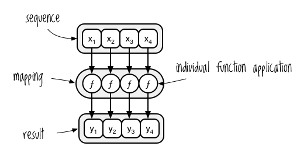
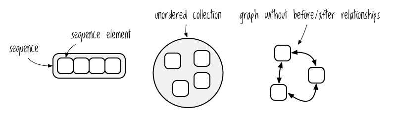
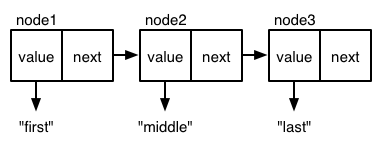

第4章


# コアファンクションの深層

もしあなたが私のような、悩めるティーンエイジャー中心の準ソープオペラ「ヴァンパイア・ダイアリーズ」の大ファンなら、主人公のエレナが色白で謎めいた恋人の行動に疑問を持ち始めるエピソードを覚えていることだろう。「膝をすりむいたとき、なぜ彼は一瞬にして跡形もなく消えてしまったのか」「指を傷つけたとき、なぜ彼の顔はグロテスクな死の仮面に変わってしまったのか」などなど。

もしあなたがClojureのコア関数で遊び始めたら、同じような疑問を持つかもしれません。「なぜ `map` はベクトルを渡したのにリストを返したのか?" とか "どうして `reduce` は私のマップをベクターのリストのように扱うのか?" といったようなことです。(Clojureでは、少なくとも17歳の深遠な恐怖を永遠に考え続けることから解放されます。）

この章ではClojureの深く、暗く、血に飢えた、超自然的なものを学ぶことができる。 つまり、この章ではClojureの基本概念である抽象化へのプログラミングとシーケンスとコレクションの抽象化について学ぶことができる。また、" 遅延シーケンス " についても学びます。この章では、今まで使ったことのない関数のドキュメントを読み、それらを試したときに何が起こっているかを理解するために必要な基礎を身につけます。

{.right}

次に、最もよく使う関数をより多く経験することになります。関数 `map`、`reduce`、`into`、`conj`、`concat`、`some`、`filter`、`take`、`drop` 、 `sort`、`sort-by` 、 `identity` でリストやベクター、マップ、セットなどの扱い方を学習していきます。 また、 `apply`, `partial`, `complement` を用いて新しい関数を作成する方法についても学びます。これらの情報は、Clojureのやり方で物事を行う方法を理解するのに役立ちます。また、自分のコードを書いたり、他の人のプロジェクトを読んで学習したりするための強固な基礎を与えてくれます。

最後に、吸血鬼データのCSVをパースしてクエリし、あなたの故郷にどんなノスフェラトゥが潜んでいるかを判断する方法を学びます。

## 抽象化へのプログラミング

抽象化へのプログラミングを理解するために、Clojureと、その原則を念頭に置いて作られていない言語を比較してみよう： Emacs Lisp (elisp)だ。elispでは、`mapcar`関数を使って新しいリストを導き出すことができます。これはClojureで`map`を使う方法と似ています。しかし、elispでハッシュマップ(Clojureのマップデータ構造に似ている)をマップしたい場合は `maphash` 関数を使う必要がある。言い換えると、elispでは*map*操作を実装するために2つの異なるデータ構造固有の関数を使用しますが、Clojureでは1つしか使用しません。また、Clojureではマップに対して `reduce` を呼び出すことができるが、elispではハッシュマップをreduceする関数は提供されていない。

Clojure は `map` と `reduce` 関数を、特定のデータ構造ではなく *シーケンスの抽象化* の観点から定義しているからである。 データ構造がシーケンス操作のコアとなる関数 (`first`, `rest`, `cons`, これについては後で詳しく説明します) に対応する限り、 `map`, `reduce` やその他のシーケンス関数と自由に連動することができるのです。これはClojuristsが抽象化するプログラミングを意味し、Clojure哲学の中心的な考え方です。

私は、抽象化とは操作の名前付きコレクションだと考えています。あるオブジェクトに対して抽象化の操作をすべて実行できれば、そのオブジェクトは抽象化のインスタンスになります。プログラミング以外でも、このように考えています。例えば、「電池」という抽象概念には、「導電性の媒体を陽極と陰極に接続する」という操作があり、その操作の出力は「電流」です。電池がリチウムでできていようが、ジャガイモでできていようが関係ない。*電池*を定義する一連の操作に反応する限り、それは電池なのです。

同様に、`map`はリスト、ベクター、セット、マップがどのように実装されているかには関心がありません。それらにシーケンス操作を実行できるかどうかだけを気にします。抽象化されたプログラミングを理解するために、 `map` がどのようにシーケンス抽象化の観点で定義されているかを見てみましょう。

### リスト、ベクター、セット、マップをシーケンスとして扱う

プログラミング言語、あるいはプログラミング全体から独立した `map` 操作について考えてみると、その本質的な動作は、 *y*[1]{.Subscript} = *ƒ*(*x*[1]{.Subscript}), *y*[2]{.Subscript} = *ƒ*(*x*[2]{.Subscript}), ... という関数を使って既存のシーケンス *x* から新しいシーケンス *y* を導出することである。 *y*[n]{.Subscript-Italic} = *ƒ*(*x*[n]{.Subscript-Italic}) です。図4-1は、マッピングをシーケンスに適用した場合の視覚化の方法を示している。

{.figure}


図4-1：マッピングの可視化


ここでいう「シーケンス」とは、例えば順序のないコレクションやノード間に*前後*の関係のないグラフとは対照的に、線形順序で編成された要素のコレクションを指す。図4-2は、他の2つのコレクションとは対照的に、シーケンスをどのように視覚化するかを示している。

{.figure}


図4-2：シーケンシャルコレクションとノンシーケンシャルコレクション


このマッピングとシーケンスの説明には、リスト、ベクター、または他の具体的なデータ構造についての言及がありません。Clojureはできるだけ抽象的な用語で考え、プログラミングできるように設計されており、データ構造の抽象化の観点で関数を実装することでこれを実現しています。この場合、 `map` はシーケンスの抽象化の観点から定義される。会話では、 `map` や `reduce` などのシーケンス関数は *シーケンスを取る*、あるいは *seq* を*取る* と言うでしょう。 実際、Clojuristは通常*sequence*の代わりに*seq*を使い、シーケンシャルな操作を行う関数を指すために*seq functions*や*the seq library*といった用語を使用します。*sequence* と *seq* のどちらを使っても、問題のデータ構造がシーケンスとして扱われ、実際の心情がどうであるかはこの文脈では重要でないことを示していることになります。

シーケンスのコア関数である `first`、`rest`、`cons` がデータ構造上で動作する場合、そのデータ構造はシーケンスの抽象化を *実装* していると言うことができます。リスト、ベクター、セット、マップはすべてシーケンスの抽象化を実装しているので、ここで示すように `map` と一緒に動作します。


```
(defn titleize
  [topic]
  (str topic " for the Brave and True"))

(map titleize ["Hamsters" "Ragnarok"])
; => ("Hamsters for the Brave and True" "Ragnarok for the Brave and True")

(map titleize '("Empathy" "Decorating"))
; => ("Empathy for the Brave and True" "Decorating for the Brave and True")

(map titleize #{"Elbows" "Soap Carving"})
; => ("Elbows for the Brave and True" "Soap Carving for the Brave and True")

(map #(titleize (second %)) {:uncomfortable-thing "Winking"})
; => ("Winking for the Brave and True")
```


最初の 2 つの例は、 `map` がベクターとリストに対して同じように動作することを示しています。3つ目の例は、 `map` がソートされていない集合に対して動作することを示しています。4つ目の例では、無名関数の引数がマップであるため、タイトル付けをする前に `second` を呼び出す必要があります。 その理由はすぐに説明しますが、まずはシーケンスの抽象化を定義している3つの関数を見てみましょう。

### first, rest, and cons

{.right}

このセクションでは、リンクリストと3つのコア関数(`first`, `rest`, そして `cons`)を実装するために、JavaScriptにちょっと寄り道してみましょう。この3つのコア関数が実装された後、それらを使って `map` を構築する方法を紹介します。

ポイントは、Clojureにおけるseqの抽象化と、リンクリストの具体的な実装の違いを理解することです。あるデータ構造がどのように実装されているかは重要ではありません。データ構造に対してseq関数を使う場合、Clojureが尋ねるのは "それを`first`, `rest`, `cons`できるのか？" だけです。もし答えがイエスなら、そのデータ構造でseqライブラリを使うことができます。

リンクリストでは、ノードは直線的な順序でリンクされます。以下は、JavaScriptでどのように作成するかです。このスニペットでは、`next`はリストの最後のノードなので、nullです。


```
var node3 = {
  value: "last",
  next: null
};
```


このスニペットでは、`node2`の `next` は `node3` を指し、`node1`の `next` は `node2` を指します。これは「リンクリスト」の「リンク」です。


```
var node2 = {
  value: "middle",
  next: node3
};

var node1 = {
  value: "first",
  next: node2
};
```


図式的には、図4-3のようにこのリストを表すことができる。

{.figure}


図 4-3: リンクリスト


リンクリストでは、3つの核となる関数を実行することができる。`first`, `rest`, そして `cons` です。`first` はリクエストされたノードの値を返し、 `rest` はリクエストされたノード以降の残りの値を返し、 `cons` は与えられた値を持つ新しいノードをリストの先頭に追加する。これらを実装した後は、その上に `map`、`reduce`、`filter` などの seq 関数を実装することができる。

以下のコードでは、JavaScript のノードの例で、 `first`, `rest`, `cons` をどのように実装して使用するか、また、特定のノードを返したり新しいリストを導出するためにそれらをどのように使用するかを示しています。`first` と `rest` のパラメータは *node* という名前であることに注意してください。これは、"*list* の最初の要素を取得するのではないのか?" といった混乱があるかもしれません。なぜなら、リストの要素に対して、一度に1つのノードを操作するからです!


```
var first = function(node) {
  return node.value;
};

var rest = function(node) {
  return node.next;
};

var cons = function(newValue, node) {
  return {
    value: newValue,
    next: node
  };
};

first(node1);
// => "first"

first(rest(node1));
// => "middle"

first(rest(rest(node1)));
// => "last"

var node0 = cons("new first", node1);
first(node0);
// => "new first"

first(rest(node0));
// => "first"
```


前述したように、 `map` は `first`、`rest`、`cons` という形で実装することができる。


```
var map = function (list, transform) {
  if (list === null) {
    return null;
  } else {
    return cons(transform(first(list)), map(rest(list), transform));
  }
}
```


この関数は、リストの最初の要素を変換し、リストの残りの要素に対して、最後（null）に達するまで自分自身を再び呼び出します。 では、実際に動かしてみましょう。この例では、 `node1` で始まるリストをマッピングして、各ノードの値に文字列 `" mapped!"` を付加した新しいリストを返しています。そして、最初のノードの値を返すために `first` を使っています。


```
first(
  map(node1, function (val) { return val + " mapped!"})
);

// => "first mapped!"
```


つまり、 `map` は完全に `cons`, `first`, `rest` で実装されているので、どんなデータ構造を渡しても、 `cons`, `first`, `rest` がそのデータ構造で動作する限り、動作するのです。

以下は、配列の場合の動作である。


```
var first = function (array) {
  return array[0];
}

var rest = function (array) {
  var sliced = array.slice(1, array.length);
  if (sliced.length == 0) {
    return null;
  } else {
    return sliced;
  }
}

var cons = function (newValue, array) {
  return [newValue].concat(array);
}


var list = ["Transylvania", "Forks, WA"];
map(list, function (val) { return val + " mapped!"})
// => ["Transylvania mapped!", "Forks, WA mapped!"]
```


このコードでは、 `first`, `rest`, `cons` をJavaScriptの配列関数で定義しています。一方、 `map` は `first`, `rest`, `cons` という名前の関数を参照し続けるので、今度は `array` に対して動作するようになります。 つまり、 `first`, `rest`, `cons` を実装するだけで、前述のたくさんの関数と一緒に `map` を自由に使えるようになるわけです。

### 間接的な抽象化

この時点では、`first`のような関数がどのように異なるデータ構造で動作できるのかという問題がまだ残っているので、私はただ道を蹴っているだけだと反論するかもしれません。Clojureは2つの形式の間接参照を使用して、これを行います。プログラミングでは、*間接参照*は言語が採用するメカニズムの総称で、1つの名前が複数の関連した意味を持つことができるようにするものです。この場合、`first`という名前は、データ構造に特化した複数の意味を持ちます。間接参照は、抽象化を可能にするものである。

*ポリモーフィズム*はClojureが間接参照を提供する1つの方法です。詳細は省きますが、基本的に、ポリモーフィック関数は、与えられた引数の型に基づいて、異なる関数本体にディスパッチします。(これは多重アリティ関数が提供する引数の数によって異なる関数本体にディスパッチするのとそれほど違いはありません)。

`注` Clojureには多相ディスパッチを定義するための2つの構造があります：ホストプラットフォームの[interface]{.EmphasisNote}構造とプラットフォームに依存しない[protocols]{.EmphasisNote}構造です。しかし、まだ始めたばかりで、これらがどのように機能するかを理解する必要はないでしょう。プロトコルは第13章で扱います。

シーケンスに関して言えば、Clojureはまた、一種の軽量な型変換を行うことで間接化を行い、抽象化の関数で動作するデータ構造を生成します。Clojureがシーケンスを期待するとき、例えば `map`, `first`, `rest`, または `cons` を呼び出すとき、問題のデータ構造で `seq` 関数を呼び出し、 `first`, `rest`, そして `cons` を可能にするデータ構造を取得します。


```
(seq '(1 2 3))
; => (1 2 3)

(seq [1 2 3])
; => (1 2 3)

(seq #{1 2 3})
; => (1 2 3)

(seq {:name "Bill Compton" :occupation "Dead mopey guy"})
; => ([:name "Bill Compton"] [:occupation "Dead mopey guy"])
```


ここで、2つの注目すべき詳細があります。まず、 `seq` は常にリストのように見える値を返します。この値は *sequence* または *seq* と呼ばれます。2つ目は、マップの seq は2つの要素を持つキーと値のベクトルで構成されていることです。そのため、 `map` はマップをベクターのリストのように扱います。このことは `"Bill Compton"` の例で見ることができます。この例を特に指摘したいのは、意外と混乱するかもしれないからです。私が最初にClojureを使い始めたとき、そうでした。これらの基本的なメカニズムを知っていれば、人間性を保とうとする男性吸血鬼がよく見せるような、フラストレーションや一般的なモヤモヤ感から解放されるでしょう。

seqをマップに戻すには、 `into` を使って結果を空のマップに貼り付けます(後で `into` を詳しく見てみましょう)。


```
(into {} (seq {:a 1 :b 2 :c 3}))
; => {:a 1, :c 3, :b 2}
```


そのため、Clojure のシーケンス関数は引数に `seq` を使用します。シーケンス関数はシーケンス抽象化の観点から、 `first`, `rest`, `cons` を使って定義されています。データ構造がシーケンスの抽象化を実装している限り、 `reduce`, `filter`, `distinct`, `group-by` などのスーパースター関数を含む、広範な seq ライブラリを使用することができる。

ここで言えることは、データ構造で何が*できるか*ということに焦点を当て、その実装をできる限り無視することが強力だということです。実装はそれ自体、ほとんど重要ではありません。 実装はあくまで手段なのです。一般に、抽象化したプログラミングは、データ構造がどのように実装されているかに関係なく、異なるデータ構造上の関数のライブラリを使用できるようにすることで、力を発揮することができます。

## Seq関数の例

Clojureのseqライブラリは、いつも使うような便利な関数でいっぱいです。Clojureのシーケンス抽象化について深く理解したところで、これらの関数を詳しく見ていきましょう。もしあなたがLispや関数型プログラミングに慣れていないなら、これらの例は驚きと喜びを与えてくれるでしょう。

### map

今までたくさんの `map` の例を見てきましたが、このセクションでは `map` が2つの新しいタスク、複数のコレクションを引数として取ることと、関数のコレクションを引数として取ることを紹介します。また、よくある `map` のパターンである、キーワードをマッピング関数として使用することにも注目です。

今までのところ、`map` が一つのコレクションを操作する例しか見ていないはずです。 次のコードでは、コレクションはベクター `[1 2 3]` です。


```
(map inc [1 2 3])
; => (2 3 4)
```


しかし、 `map` に複数のコレクションを与えることもできます。以下は、その方法を示す簡単な例です。


```
(map str ["a" "b" "c"] ["A" "B" "C"])
; => ("aA" "bB" "cC")
```


あたかも `map` が次のような処理を行うかのようです。


```
(list (str "a" "A") (str "b" "B") (str "c" "C"))
```


{.right}

複数のコレクションを `map` に渡した場合、最初のコレクションの要素 (`["a" "b" "c"]`) がマッピング関数 (`str`) の第1引数に、2番目のコレクションの要素 (`["A" "B" "C"]`) が第2引数に、というように渡されていくことになります。マッピング関数は、 `map` に渡すコレクションの数と同じ数の引数を取ることができることを確認してください。

次の例は、あなたが人間の消費を抑えようとする吸血鬼である場合に、この機能をどのように使用するかを示しています。2つのベクトルがあり、1つは人間の摂取量をリットルで表し、もう1つは過去4日間の生き物の摂取量を表しています。`unify-diet-data` 関数は、人間と生き物の両方の摂食に関する 1 日分のデータを取り、2 つを 1 つのマップに統合します。


```
(def human-consumption   [8.1 7.3 6.6 5.0])
(def critter-consumption [0.0 0.2 0.3 1.1])
(defn unify-diet-data
  [human critter]
  {:human human
   :critter critter})

(map unify-diet-data human-consumption critter-consumption)
; => ({:human 8.1, :critter 0.0}
      {:human 7.3, :critter 0.2}
      {:human 6.6, :critter 0.3}
      {:human 5.0, :critter 1.1})
```


よくぞ人間を寝かせてくれた!

もうひとつ `map` でできる楽しいことは、関数のコレクションを渡すことだ。例えば、異なる数値の集まりに対して一連の計算を行いたい場合に、このような使い方ができる。


```
(def sum #(reduce + %))
(def avg #(/ (sum %) (count %)))
(defn stats
  [numbers]
  (map #(% numbers) [sum count avg]))

(stats [3 4 10])
; => (17 3 17/3)

(stats [80 1 44 13 6])
; => (144 5 144/5)
```


この例では、 `stats` 関数が関数のベクトルを反復処理し、それぞれの関数を `numbers` に適用しています。

さらに、Clojuristはしばしば `map` を使用して、マップデータ構造のコレクションからキーワードに関連付けられた値を取得します。 キーワードは関数として使うことができるので、これを簡潔に行うことができます。 以下はその例です。


```
(def identities
  [{:alias "Batman" :real "Bruce Wayne"}
   {:alias "Spider-Man" :real "Peter Parker"}
   {:alias "Santa" :real "Your mom"}
   {:alias "Easter Bunny" :real "Your dad"}])

(map :real identities)
; => ("Bruce Wayne" "Peter Parker" "Your mom" "Your dad")
```


(もし5歳なら、深くお詫び申し上げます)。

### reduce

第3章では、 `reduce` がどのようにシーケンスの各要素を処理して結果を構築するかを示しました。このセクションでは、あまり知られていないかもしれませんが、他の使い方をいくつか紹介します。

最初の使い方は、マップの値を変換して、同じキーで値が更新された新しいマップを生成することです。


```
(reduce (fn [new-map [key val]]
          (assoc new-map key (inc val)))
        {}
        {:max 30 :min 10})
; => {:max 31, :min 11}
```


この例では、 `reduce` は `{:max 30 :min 10}` という引数を `([:max 30] [:min 10])` のような一連のベクトルとして扱います。そして、空のマップ (第 2 引数) から始めて、第 1 引数の無名関数を使用してマップを構築します。あたかも `reduce` がこのような処理を行うかのようです。


```
(assoc (assoc {} :max (inc 30))
       :min (inc 10))
```


関数 `assoc` は 3 つの引数、マップ、キー、および値をとります。 これは、与えられたキーと与えられた値を *関連付け* することによって、与えられたマップから新しいマップを導出します。例えば、 `(assoc {:a 1} :b 2)` は `{:a 1 :b 2}` を返します。

もう一つの `reduce` の使い方は、マップのキーをその値に基づいてフィルタリングすることです。次の例では、匿名関数はキーと値のペアの値が 4 よりも大きいかどうかをチェックします。マップ `{:human 4.1 :critter 3.9}` において、3.9 は 4 より小さいので、 `:critter` キーとその値 3.9 はフィルタリングされて除外されます。


```
(reduce (fn [new-map [key val]]
          (if (> val 4)
            (assoc new-map key val)
            new-map))
        {}
        {:human 4.1
         :critter 3.9})
; => {:human 4.1}
```


ここでの要点は、 `reduce` は最初に見たときよりも柔軟な関数であるということです。seqable データ構造から新しい値を導き出したいときはいつでも、 `reduce` は通常、必要なことを行うことができるだろう。もし、あなたの髪を吹き飛ばすような練習をしたいのなら、 `reduce` を使って `map` を実装してみてください。そして、この章の後半で `filter` と `some` について読んだ後に、同じことを行ってみてください。

### take, drop, take-while, and drop-while

`take` と `drop` はどちらも 2 つの引数をとります： 数値とシーケンスです。 `take` はシーケンスの最初の `n` 要素を返し、 `drop` はシーケンスの最初の `n` 要素を取り除いたものを返します。


```
(take 3 [1 2 3 4 5 6 7 8 9 10])
; => (1 2 3)

(drop 3 [1 2 3 4 5 6 7 8 9 10])
; => (4 5 6 7 8 9 10)
```


その従兄弟にあたる `take-while` と `drop-while` はもう少し興味深いものです。 それぞれ、*述語関数* (返り値が真か偽かで評価される関数) を受け取り、take や drop をいつ停止するかを決定します。例えば、あなたの「食べ物」日記のエントリーを表すベクトルがあったとしよう。各エントリには月と日、そして何を食べたかが書かれている。スペースを確保するため、いくつかのエントリだけを記載することにする。


```
(def food-journal
  [{:month 1 :day 1 :human 5.3 :critter 2.3}
   {:month 1 :day 2 :human 5.1 :critter 2.0}
   {:month 2 :day 1 :human 4.9 :critter 2.1}
   {:month 2 :day 2 :human 5.0 :critter 2.5}
   {:month 3 :day 1 :human 4.2 :critter 3.3}
   {:month 3 :day 2 :human 4.0 :critter 3.8}
   {:month 4 :day 1 :human 3.7 :critter 3.9}
   {:month 4 :day 2 :human 3.7 :critter 3.6}])
```


`take-while` を使用すると、1月と2月のデータのみを取得することができます。 `take-while` は与えられたシーケンス (この場合は `food-journal`) をトラバースし、各要素に述語関数を適用していきます。

この例では、無名関数 `#(< (:month %) 3)` を使って、ジャーナルエントリの月が範囲外であるかどうかをテストしています。


```
(take-while #(< (:month %) 3) food-journal)
; => ({:month 1 :day 1 :human 5.3 :critter 2.3}
      {:month 1 :day 2 :human 5.1 :critter 2.0}
      {:month 2 :day 1 :human 4.9 :critter 2.1}
      {:month 2 :day 2 :human 5.0 :critter 2.5})
```


`take-while` が最初の March エントリに到達すると、無名関数は `false` を返し、 `take-while` はそれまでにテストしたすべての要素のシーケンスを返します。

`drop-while` でも同じ考え方が適用されます。ただし、1つの要素が true とテストされるまで、要素を削除し続けます。


```
(drop-while #(< (:month %) 3) food-journal)
; => ({:month 3 :day 1 :human 4.2 :critter 3.3}
      {:month 3 :day 2 :human 4.0 :critter 3.8}
      {:month 4 :day 1 :human 3.7 :critter 3.9}
      {:month 4 :day 2 :human 3.7 :critter 3.6})
```


`take-while`と`drop-while`を併用することで、2月と3月だけのデータを取得することができます。


```
(take-while #(< (:month %) 4)
            (drop-while #(< (:month %) 2) food-journal))
; => ({:month 2 :day 1 :human 4.9 :critter 2.1}
      {:month 2 :day 2 :human 5.0 :critter 2.5}
      {:month 3 :day 1 :human 4.2 :critter 3.3}
      {:month 3 :day 2 :human 4.0 :critter 3.8})
```


この例では、 `drop-while` を使用して 1 月のエントリを削除し、その結果に対して `take-while` を使用して、最初の 4 月のエントリに到達するまでエントリを取得し続けています。

### filter and some

述語関数が真となるシーケンスのすべての要素を返すには、`filter`を使用します。人間の消費量が 5 リットル未満であるジャーナルエントリーを以下に示します。


```
(filter #(< (:human %) 5) food-journal)
; => ({:month 2 :day 1 :human 4.9 :critter 2.1}
      {:month 3 :day 1 :human 4.2 :critter 3.3}
      {:month 3 :day 2 :human 4.0 :critter 3.8}
      {:month 4 :day 1 :human 3.7 :critter 3.9}
      {:month 4 :day 2 :human 3.7 :critter 3.6})
```


先ほどの `take-while` や `drop-while` の例で、なぜ `filter` を使わなかったのかと不思議に思うかもしれません。確かに、 `filter` はそのような場合にも使用できます。ここでは、 `take-while` の例と同じように、1月と2月のデータを取得します。


```
(filter #(< (:month %) 3) food-journal)
; => ({:month 1 :day 1 :human 5.3 :critter 2.3}
      {:month 1 :day 2 :human 5.1 :critter 2.0}
      {:month 2 :day 1 :human 4.9 :critter 2.1}
      {:month 2 :day 2 :human 5.0 :critter 2.5})
```


この使い方は全く問題ありませんが、`filter`はすべてのデータを処理してしまう可能性があり、必ずしも必要ではありません。食べ物日記はすでに日付順にソートされているので、 `take-while` が不要なデータを調べることなく、欲しいデータを返してくれることが分かっています。 したがって、 `take-while` はより効率的です。

コレクションに、述語関数が真とする値が含まれているかどうかを知りたいことがよくあります。これを行うのが `some` 関数で、述語関数が返す最初の真偽値（ `false` や `nil` 以外の値）を返します。


```
(some #(> (:critter %) 5) food-journal)
; => nil

(some #(> (:critter %) 3) food-journal)
; => true
```


5 リットル以上を消費した食料日記はありませんが、3 リットル以上を消費した食料日記は少なくとも 1 つあります。2 番目の例の戻り値は `true` であり、真の値を生成した実際のエントリーではないことに注意してください。これは、 無名関数 `#(> (:critter %) 3)` が `true` または `false` を返すからです。ここでは、そのエントリーを返す方法を説明します。


```
(some #(and (> (:critter %) 3) %) food-journal)
; => {:month 3 :day 1 :human 4.2 :critter 3.3}
```


ここでは、少し変わった無名関数が `and` を使って、まず条件 `(> (:critter %) 3)` が真かどうかをチェックし、条件が本当に真であるときにエントリを返します。

### sort と sort-by

`sort` を使用すると、要素を昇順にソートすることができます。


```
(sort [3 1 2])
; => (1 2 3)
```


これは、ある関数（時には *キー関数* と呼ばれることもあります）をシーケンスの要素に適用し、それが返す値を使ってソート順を決定することができるものです。次の例は *<http://clojuredocs.org/>* から引用したもので、 `count` がキー関数となっています。


```
(sort-by count ["aaa" "c" "bb"])
; => ("c" "bb" "aaa")
```


もし `sort` を使ってソートしていたなら、要素はアルファベット順にソートされ、 `("aaa" "bb" "c")` が返されるはずです。なぜなら、 `count` でソートしているので、 `"c"` のカウントは 1、 `"bb"` は 2、そして `"aaa"` は 3 だったからです。

### concat

最後に、`concat`は、あるシーケンスのメンバーを別のシーケンスの最後に単純に追加します。


```
(concat [1 2] [3 4])
; => (1 2 3 4)
```


## Lazy Seqs

先ほど見たように、`map` はまず渡されたコレクションに対して `seq` を呼び出します。しかし、これが全てではありません。`map` や `filter` を含む多くの関数は、 *遅延 seq* を返します。遅延 seq とは、アクセスするまでメンバが計算されない seq のことです。seq のメンバを計算することを *realizing* と呼びます。必要なときまで計算を遅らせることは、プログラムをより効率的にし、無限列を構築することができるという驚くべき利点があります。

### 遅延Seqの効率の良さを実証する

遅延seqの動作を見るために、あなたが吸血鬼を特定することを目的とした現代のタスクフォースの一員であることを仮定してみましょう。あなたの諜報員は、あなたの街で活動中の吸血鬼は一人だけで、容疑者のリストは100万人に絞られていると教えてくれた。上司は100万人の社会保障番号のリストを渡して、"さっさと片付けろ、マクフィッシュウィッチ！"と怒鳴る。

ありがたいことに、あなたはヴァンパイア識別のための最新機器であるヴァンプマティック3000コンピュターを持っている。この吸血鬼狩り技術のソースコードは独占されているので、このタスクを実行するのにかかる時間をシミュレートするために、スタブアウトしてみました。ここに吸血鬼データベースのサブセットがある。


```
(def vampire-database
  {0 {:makes-blood-puns? false, :has-pulse? true  :name "McFishwich"}
   1 {:makes-blood-puns? false, :has-pulse? true  :name "McMackson"}
   2 {:makes-blood-puns? true,  :has-pulse? false :name "Damon Salvatore"}
   3 {:makes-blood-puns? true,  :has-pulse? true  :name "Mickey Mouse"}})

(defn vampire-related-details
  [social-security-number]
  (Thread/sleep 1000)
  (get vampire-database social-security-number))

(defn vampire?
  [record]
  (and (:makes-blood-puns? record)
       (not (:has-pulse? record))
       record))

(defn identify-vampire
  [social-security-numbers]
  (first (filter vampire?
                 (map vampire-related-details social-security-numbers))))
```


関数 `vampire-related-details` があり、データベースからエントリを検索するのに1秒かかる。次に、 `vampire?` という関数があり、これは吸血鬼テストに合格した場合はレコードを返し、そうでない場合は `false` を返す。最後に、 `identify-vampire` は社会保障番号とデータベースのレコードを対応付け、吸血鬼であることを示す最初のレコードを返します。

これらの関数を実行するのにかかる時間を示すために、 `time` オペレーションを使用することができます。time` を使用した場合、コードは `time` を使用しなかった場合と全く同じように動作しますが、1つだけ例外があります。以下はその例です。


```
(time (vampire-related-details 0))
; => "Elapsed time: 1001.042 msecs"
; => {:name "McFishwich", :makes-blood-puns? false, :has-pulse? true}
```


最初の行は、与えられた操作にかかった時間（この場合、1,001.042ミリ秒）である。2行目は戻り値で、この場合はデータベースのレコードです。戻り値は `time` を使わなかった場合と全く同じです。

遅延のない `map` の実装では、まず `social-security-numbers` のすべてのメンバーに `vampire-related-details` を適用してから、その結果を `filter` に渡す必要があります。100万人の容疑者がいるわけですから、100万秒、つまり12日かかることになり、その頃には街の半分が死んでいることでしょう! もちろん、もし吸血鬼が最後の一人であることが判明した場合、遅延バージョンではまだそれだけの時間がかかりますが、少なくともそうならない可能性は十分にあります。

`map` は遅延バージョンなので、マップされた要素にアクセスするまで、 `vampire-related-details` を社会保障番号に実際に適用することはない。実際、 `map` はほとんど即座に値を返します。


```
(time (def mapped-details (map vampire-related-details (range 0 1000000))))
; => "Elapsed time: 0.049 msecs"
; => #'user/mapped-details
```


この例では、 `range` は 0 から 999,999 までの整数からなる遅延シーケンスを返します。そして、 `map` は `mapped-details` という名前に関連付けられた遅延シーケンスを返します。`map` は `range` が返す要素に `vampire-related-details` を実際に適用していないので、この処理にはほとんど時間がかかりません - 確かに12日以下です。

遅延 seq は、シーケンスの要素をどのように実現するかのレシピと、これまでに実現された要素の2つの部分から構成されていると考えることができます。`map` を使用したとき、それが返す遅延シーケンスにはまだ実現されていない要素が含まれていますが、その要素を生成するためのレシピは持っています。未実現の要素にアクセスしようとするたびに、遅延 seq は要求された要素を生成するためにそのレシピを使用します。

先ほどの例では、`mapped-details`は未実現の要素です。いったん `mapped-details` のメンバーにアクセスしようとすると、そのレシピを使って要求された要素を生成し、1秒あたりのデータベース検索コストが発生します。


```
(time (first mapped-details))
; => "Elapsed time: 32030.767 msecs"
; => {:name "McFishwich", :makes-blood-puns? false, :has-pulse? true}
```


この操作には約32秒かかっています。100万秒よりはずっとましですが、それでも予想より31秒多くかかっています。結局のところ、一番最初の要素にアクセスしようとしているだけなので、1秒しかかからないはずなのです。

32秒かかった理由は、Clojureが遅延シーケンスを*チャンク*して、Clojureが要素を実現しなければならないときはいつでも、次の要素のいくつかを同様に先取りして実現することを意味します。この例では、あなたは `mapped-details` の一番最初の要素だけが欲しかったのですが、Clojure は次の31個の要素も先に用意しました。Clojureがこれを行うのは、ほとんどの場合、より良いパフォーマンスにつながるからです。

ありがたいことに、遅延 seq 要素は一度だけ実現すればいいのです。`mapped-details` の最初の要素に再びアクセスしても、ほとんど時間はかかりません。


```
(time (first mapped-details))
; => "Elapsed time: 0.022 msecs"
; => {:name "McFishwich", :makes-blood-puns? false, :has-pulse? true}
```


この知識で、吸血鬼のデータベースを効率よく調べ、牙を剥いた犯人を見つけることができる。


```
(time (identify-vampire (range 0 1000000)))
"Elapsed time: 32019.912 msecs"
; => {:name "Damon Salvatore", :makes-blood-puns? true, :has-pulse? false}
```


だからデイモンはあんなに不気味なダジャレを言うんだ!

### 無限のシーケンス

遅延シーケンスが提供するクールで便利な機能のひとつに、無限シーケンスを構築する能力があります。今までは、ベクトルやリストの終端から生成された遅延シーケンスだけを扱ってきました。しかし、Clojureには無限シーケンスを作成するための関数がいくつか用意されています。無限シーケンスを作成する簡単な方法の1つは `repeat` で、この関数は渡された引数をすべてのメンバーとするシーケンスを作成します。


```
(concat (take 8 (repeat "na")) ["Batman!"])
; => ("na" "na" "na" "na" "na" "na" "na" "na" "Batman!")
```


この場合、すべての要素が文字列 `"na"` である無限シーケンスを作成し、それを使ってノスタルジーを刺激するかしないかのシーケンスを作成します。

また、 `repeatedly` を使用すると、与えられた関数を呼び出して、シーケンスの各要素を生成することができます。


```
(take 3 (repeatedly (fn [] (rand-int 10))))
; => (1 4 0)
```


ここでは、 `repeatedly` が返す遅延シーケンスは、0 から 9 の間のランダムな整数を返す匿名関数 `(fn [] (rand-int 10))` を呼び出して、すべての新しい要素を生成しています。REPL でこれを実行すると、ほとんどの場合、結果はこれとは異なるものになるでしょう。

遅延 seq のレシピでは、終点を指定する必要はありません。遅延 seq を実現する `first` や `take` といった関数は、seq の次に何が来るのかを知る術がありません。そして、seq が要素を提供し続ければ、それを受け取り続けるだけになってしまいます。これは、自分で無限列を作ってみればわかることです。


```
(defn even-numbers
  ([] (even-numbers 0))
  ([n] (cons n (lazy-seq (even-numbers (+ n 2))))))

(take 10 (even-numbers))
; => (0 2 4 6 8 10 12 14 16 18)
```


この例は再帰を使用しているため、少し頭が痛くなります。この例では、 `cons` が与えられたリストに要素を追加した新しいリストを返すということを覚えておくとよいでしょう。


```
(cons 0 '(2 4 6))
; => (0 2 4 6)
```


(ちなみに、Lispプログラマは `cons` 関数を使うとき、これを *consing* と呼びます)。

`even-numbers` では、次の要素のためのレシピ (関数) を含む遅延リスト (完全に実現されたリストとは対照的) を考えています。

そして、これで遅延シーケンスがカバーされました。さて、これでシーケンスの抽象化について知るべきことはすべてわかったと思います。

## コレクションの抽象化

コレクション抽象化はシーケンス抽象化と密接に関係しています。Clojureのコアとなるデータ構造（ベクター、マップ、リスト、セット）はすべて、この2つの抽象化に参加しています。

シーケンス抽象はメンバを個別に操作しますが、コレクション抽象はデータ構造を全体として操作します。例えば、コレクション関数 `count`、`empty?`、`every?` は個々の要素についてではなく、全体について操作します。


```
(empty? [])
; => true

(empty? ["no!"])
; => false
```


実際問題として、「よし、自分！」と意識することはほとんどないでしょう。今、あなたはコレクション全体を扱っているのです。コレクションを抽象化して考えよう！"と意識することはほとんどないでしょう。それでも、自分が使っている関数やデータ構造の根底にあるこれらの概念を知っておくことは有用です。

ここで、よく使われるコレクション関数である `into` と `conj` を見てみましょう。

### into

コレクション関数の中で最も重要な関数の1つが `into` です。ご存知のように、多くの seq 関数は元のデータ構造ではなく、seq を返します。おそらく、戻り値を元の値に変換したいと思うでしょうが、 `into` を使えばそれが可能です。


```
(map identity {:sunlight-reaction "Glitter!"})
; => ([:sunlight-reaction "Glitter!"])

(into {} (map identity {:sunlight-reaction "Glitter!"}))
; => {:sunlight-reaction "Glitter!"}
```


ここで、`map`関数は、マップデータ構造を与えられた後に、シーケンシャルデータ構造を返し、seqをマップに変換して戻します。

これは、他のデータ構造でも同様に動作する。


```
(map identity [:garlic :sesame-oil :fried-eggs])
; => (:garlic :sesame-oil :fried-eggs)

(into [] (map identity [:garlic :sesame-oil :fried-eggs]))
; => [:garlic :sesame-oil :fried-eggs]
```


ここでは、最初の行で `map` が seq を返し、2 行目で `into` を使用して結果をベクトルに戻しています。

次の例では、2 つの同じエントリを持つベクトルから始めて、 `map` がそれをリストに変換し、 `into` を使用して値をセットに貼り付けます。


```
(map identity [:garlic-clove :garlic-clove])
; => (:garlic-clove :garlic-clove)

(into #{} (map identity [:garlic-clove :garlic-clove]))
; => #{:garlic-clove}
```


セットはユニークな値だけを含むので、セットには1つの値だけが含まれて終わります。

また、 `into` の第一引数は空である必要はありません。ここでは、最初の例で `into` を使ってマップに要素を追加する方法を示し、2番目の例でベクトルに要素を追加する方法を示しています。


```
(into {:favorite-emotion "gloomy"} [[:sunlight-reaction "Glitter!"]])
; => {:favorite-emotion "gloomy" :sunlight-reaction "Glitter!"}

(into ["cherry"] '("pine" "spruce"))
; => ["cherry" "pine" "spruce"]
```


そしてもちろん、両方の引数が同じ型であることも可能です。この次の例では、両方の引数がマップであるのに対し、前の例ではすべて異なる型の引数を持っています。これは期待通りに動作し、2番目のマップの要素が1番目のマップに追加された新しいマップを返します。


```
(into {:favorite-animal "kitty"} {:least-favorite-smell "dog"
                                  :relationship-with-teenager "creepy"})
; => {:favorite-animal "kitty"
      :relationship-with-teenager "creepy"
      :least-favorite-smell "dog"}
```


もし `into` が就職の面接で自分の強みを聞かれたら、「2つのコレクションを取って、2番目のコレクションから1番目のコレクションにすべての要素を追加するのが得意です」と言うだろう。

### conj

`conj` もコレクションに要素を追加しますが、その方法は少し異なります。


```
(conj [0] [1])
; => [0 [1]]
```


おっとっと! ベクター `[1]` 全体を `[0]` に追加したように見えます。これを `into` と比較してみましょう。


```
(into [0] [1])
; => [0 1]
```


以下は、`conj`で同じことをする方法です。


```
(conj [0] 1)
; => [0 1]
```


数値 1 はスカラー値 (単数、コレクションではない) として渡されるのに対して、 `into` の第2引数はコレクションでなければならないことに注意してください。

`conj` で追加する要素はいくつでも与えることができるし、マップのような他のコレクションに追加することもできる。


```
(conj [0] 1 2 3 4)
; => [0 1 2 3 4]

(conj {:time "midnight"} [:place "ye olde cemetarium"])
; => {:place "ye olde cemetarium" :time "midnight"}
```


`conj` と `into` は非常に似ているので、 `conj` を `into` の観点から定義することもできます。


```
(defn my-conj
  [target & additions]
  (into target additions))

(my-conj [0] 1 2 3)
; => [0 1 2 3]
```


このようなパターンはそれほど珍しいことではありません。同じことをする2つの関数をよく見かけますが、一方はレストパラメータ (`conj`) を受け取り、一方はシーク可能なデータ構造 (`into`) を受け取ります。

## 関数 関数

Clojureの引数として関数を受け取り、値として関数を返す機能を利用することを学ぶのは、慣れるまでは本当に楽しいことです。

Clojureの2つの関数、 `apply` と `partial` は、関数を受け取り、*かつ*返すので、特に奇妙に見えるかもしれません。この2つの関数の奇妙さを解きほぐしてみましょう。

### apply

`apply` は seqable データ構造を展開し、残りをパラメータとする関数に渡すことができるようにします。例えば、 `max` は任意の数の引数を取り、すべての引数の中で最大のものを返します。 以下は、最大の数を見つける方法である。


```
(max 0 1 2)
; => 2
```


しかし、ベクトルの最大の要素を見つけたい場合はどうしたらよいでしょうか？ベクトルを `max` に渡すことはできません。


```
(max [0 1 2])
; => [0 1 2]
```


なぜなら、 `max` は渡されたすべての引数の中で最大のものを返すからです。この場合、引数として数値を渡すのではなく、比較したいすべての数値を含むベクトルを渡しているだけだからです。 このような場合には `apply` が最適です。


```
(apply max [0 1 2])
; => 2
```


`apply` を使うことで、あたかも `(max 0 1 2)` を呼び出したかのようにすることができます。このように、コレクションの要素を分解して、別の引数として関数に渡すために `apply` を使うことがよくあります。

先ほど、 `conj` を `into` という言葉で定義したのを覚えていますか？さて、 `apply` を使って、 `conj` の観点から `into` を定義することもできます。


```
(defn my-into
  [target additions]
  (apply conj target additions))

(my-into [0] [1 2 3])
; => [0 1 2 3]
```


この `my-into` の呼び出しは、 `(conj [0] 1 2 3)` を呼び出すことと同じです。

### partial

`partial` は関数と任意の数の引数を取ります。そして、新しい関数を返します。返された関数を呼び出すと、元の関数を、与えられた元の引数と新しい引数で呼び出します。

以下はその例である。


```
(def add10 (partial + 10))
(add10 3) 
; => 13
(add10 5) 
; => 15

(def add-missing-elements
  (partial conj ["water" "earth" "air"]))

(add-missing-elements "unobtainium" "adamantium")
; => ["water" "earth" "air" "unobtainium" "adamantium"]
```


つまり、 `add10` を呼び出すと、元の関数と引数 (`+ 10`) が呼び出され、 `add10` を呼び出したときの引数が追加されるのです。どのように `partial` が動作するかを明確にするために、以下のように定義することができます。


```
(defn my-partial
  [partialized-fn & args]
  (fn [& more-args]
    (apply partialized-fn (into args more-args))))

(def add20 (my-partial + 20))
(add20 3) 
; => 23
```


この例では、 `add20` の値は `my-partial` が返す無名関数である。無名関数はこのように定義される。


```
(fn [& more-args]
  (apply + (into [20] more-args)))
```


一般的には、同じ関数と引数の組み合わせを多くの異なるコンテキストで繰り返していることがわかったときに、 partial を使用したいと思うでしょう。 このおもちゃの例では、 `partial` を使ってロガーを特殊化し、 `warn` 関数を作成する方法を示しています。


```
(defn lousy-logger
  [log-level message]
  (condp = log-level
    :warn (clojure.string/lower-case message)
    :emergency (clojure.string/upper-case message)))

(def warn (partial lousy-logger :warn))

(warn "Red light ahead")
; => "red light ahead"
```


ここで `(warn "Red light ahead")` を呼び出すと、 `(lousy-logger :warn "Red light ahead")` を呼び出すのと同じになります。

### complement

先ほど、100万人の中から一人の吸血鬼を見つけるために `identify-vampire` という関数を作りました。もし、すべての人間を見つける関数を作りたかったらどうだろう？おそらく、アンデッドの捕食者でないことに感謝するカードを送りたいのだろう。ここにその方法がある。


```
(defn identify-humans
  [social-security-numbers]
  (filter #(not (vampire? %))
          (map vampire-related-details social-security-numbers)))
```


`filter` の最初の引数、 `#(not (vampire? %))` を見てください。ブール関数の *complement* (否定) を求めることはよくあることなので、そのための関数 `complement` が用意されています。


```
(def not-vampire? (complement vampire?))
(defn identify-humans
  [social-security-numbers]
  (filter not-vampire?
          (map vampire-related-details social-security-numbers)))
```


以下は、`complement`を実装する方法です。


```
(defn my-complement
  [fun]
  (fn [& args]
    (not (apply fun args))))

(def my-pos? (complement neg?))
(my-pos? 1)  
; => true

(my-pos? -1) 
; => false
```


見てわかるように、`complement`は地味な関数です。この関数はちょっとしたことをするだけで、しかもそれがうまくいく。`complement` によって `not-vampire?` 関数を作るのは簡単で、コードを読めば誰でもその意図を理解することができます。

これは何テラバイトものデータをMapReduceしてくれるわけではありませんが、高階関数のパワーを実証しています。高階関数は、いくつかの言語では不可能な方法で、ユーティリティ関数のライブラリを構築することを可能にする。これらのユーティリティ関数を使えば、あなたの生活はもっと楽になる。

## FWPDのためのヴァンパイア・データ解析プログラム

すべてをまとめるために、ワシントン州フォークス警察（FWPD）のための洗練された吸血鬼データ分析プログラムの始まりの部分を書いてみよう。

FWPDは*CSV* *(カンマ区切り値)*と呼ばれる新しいデータベース技術を持っている。あなたの仕事は、この最先端のCSVを解析し、吸血鬼の可能性があるかどうかを分析することです。そのためには容疑者の*キラキラ指数*でフィルタリングする。容疑者の吸血鬼度を0から10で予測する。10代の少女が開発したものだ。さあ、あなたのツールのために新しいLeiningenプロジェクトを作成してください。


```
lein new app fwpd
```


新しい*fwpd*ディレクトリの下に、*suspects.csv*という名前のファイルを作成し、以下のような内容を入力します。


```
Edward Cullen,10
Bella Swan,0
Charlie Swan,0
Jacob Black,3
Carlisle Cullen,6
```


さて、いよいよ *fwpd/src/fwpd/core.clj* ファイルを構築して、あなたの手を汚すときが来ました。新しいREPLセッションを開始することをお勧めします。Emacsでは、*fwpd/src/fwpd/core.clj*を開いて、**M-x** `cider-restart` を実行すれば、これを行うことができます。REPLが起動したら、*core.clj*の内容を削除し、次のように追加します。


```
(ns fwpd.core)
(def filename "suspects.csv")
```


最初の行は名前空間を確立し、2行目は作成したCSVを参照しやすくするためのものです。ファイルをコンパイルして(Emacsでは **C-c C-k**) これを実行すれば、REPLで簡単にサニティ・チェックを行うことができます。


```
(slurp filename)
; => "Edward Cullen,10\nBella Swan,0\nCharlie Swan,0\nJacob Black,3\nCarlisle Cullen,6"
```


もし `slurp` 関数が前の文字列を返さない場合は、*core.clj* を開いたまま REPL セッションを再開してみてください。

次に、*core.clj* にこれを追加します。


```
➊ (def vamp-keys [:name :glitter-index])

➋ (defn str->int
  [str]
  (Integer. str))

➌ (def conversions {:name identity
                  :glitter-index str->int})

➍ (defn convert
  [vamp-key value]
  ((get conversions vamp-key) value))
```


最終的には `{:name "Edward Cullen" :glitter-index 10}` のようなマップを作成することになりますが、そのために必要な定義が以下になります。まず、 `vamp-keys` ➊はバンパイアマップを作成するために使用するキーのベクトルである。次に、関数 `str->int` ➋は文字列を整数に変換する。マップ `conversions` ➌は変換関数と各ヴァンパイアキーを関連付ける。名前を変換する必要は全くないので、その変換関数は `identity` となり、渡された引数を返すだけです。glitterのインデックスは整数に変換されるので、その変換関数は `str->int` である。最後に、 `convert` 関数 ➍ は vamp key と value を受け取り、変換後の値を返します。以下はその例である。


```
(convert :glitter-index "3")
; => 3
```


では、これをファイルに追加してください。


```
(defn parse
  "Convert a CSV into rows of columns"
  [string]
  (map #(clojure.string/split % #",")
       (clojure.string/split string #"\n")))
```


`parse` 関数は文字列を受け取り、まず改行文字で文字列を分割して文字列の集合を作成します。次に、文字列の連続をマップして、それぞれをコンマ文字で分割します。CSVに対して `parse` を実行してみてください。


```
(parse (slurp filename))
; => (["Edward Cullen" "10"] ["Bella Swan" "0"] ["Charlie Swan" "0"]
      ["Jacob Black" "3"] ["Carlisle Cullen" "6"])
```


次のコードでは、seq of vectorをVampキーと組み合わせて、マップを作成します。


```
(defn mapify
  "Return a seq of maps like {:name \"Edward Cullen\" :glitter-index 10}"
  [rows]
  (map (fn [unmapped-row]
         (reduce (fn [row-map [vamp-key value]]
                   (assoc row-map vamp-key (convert vamp-key value)))
                 {}
                 (map vector vamp-keys unmapped-row)))
       rows))
```


この関数では、`map` が `["Bella Swan" 0]` のような各行 - ベクトル - を、上記の "`reduce`" の最初の例と同様の方法で、`reduce` を用いてマップに変換しています。まず、`map` は `([:name "Bella Swan"] [:glitter-index 0])` のようなキーと値のペアの seq を作成します。次に、 `reduce` が `row-map` に vamp キーと変換された vamp 値を関連付けることでマップを構築します。以下は、マップ化された最初の行です。


```
(first (mapify (parse (slurp filename))))
; => {:glitter-index 10, :name "Edward Cullen"}
```


最後に、この `glitter-filter` 関数を追加します。


```
(defn glitter-filter
  [minimum-glitter records]
  (filter #(>= (:glitter-index %) minimum-glitter) records))
```


これは完全にマップ化されたVampire記録を受け取り、 `:glitter-index` が指定された `minimum-glitter` よりも小さいものをフィルタリングするものである。


```
(glitter-filter 3 (mapify (parse (slurp filename))))
({:name "Edward Cullen", :glitter-index 10}
 {:name "Jacob Black", :glitter-index 3}
 {:name "Carlisle Cullen", :glitter-index 6})
```


ほらね！自警団になる夢に一歩近づいたね！怪しげな連中を一網打尽にするんだ!

## まとめ

この章では、Clojureが抽象化へのプログラミングに重点を置いていることを学びました。シーケンスの抽象化はシーケンスの個々の要素に対する操作を扱い、seq関数はしばしばその引数をseqに変換して遅延seqを返します。遅延評価は、必要なときまで計算を遅らせることで性能を向上させる。もうひとつの抽象化機能であるコレクション抽象化機能は、データ構造を全体として扱うものです。最後に、最も重要なことは、「太陽の光でキラキラしている人を信用してはいけない」ということです。

## エクササイズ

あなたが今持っている吸血鬼分析プログラムは、すでに他のどの市場よりも何十年も進んでいます。しかし、どうすればもっと良くなるのでしょうか？私は次のことを試してみることをお勧めします。

1.  きらめきフィルタの結果を名前のリストにしてみる。
2. 関数 `append` を書いて、新しい容疑者を容疑者リストに追加する。
3.  `validate` という関数を書いて、 `append` の際に `:name` と `:glitter-index` が存在することを確認します。この関数は、 `conversions` のようなバリデーション関数へのキーワードマップと、バリデートするレコードの2つの引数を受け取ります。
4.  マップのリストを受け取って、それを CSV 文字列に変換する関数を書きます。`clojure.string/join`関数を使用する必要があります。

がんばってね、McFishwich!

