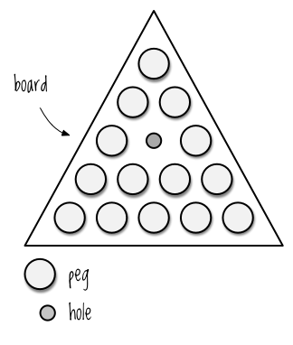
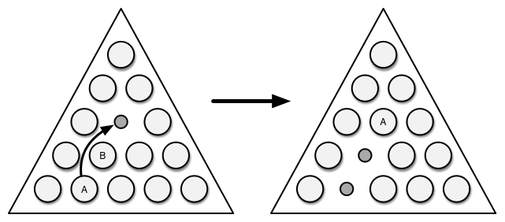
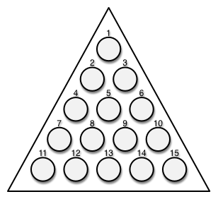
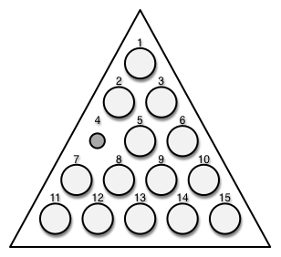

Chapter 5


# 関数型プログラミング

これまで、Clojure が提供するツール（不変のデータ構造、関数、抽象化など）に精通することに重点を置いてきました。 この章では、これらのツールを最大限に活用する方法で、プログラミングタスクについて考える方法を学びます。この章では、これまでの経験を新しい関数型プログラミングの考え方に統合していきます。

この章では、純粋関数とは何か、なぜ有用なのか、不変データ構造の扱い方、なぜ不変データ構造が可変データ構造より優れているのか、データと関数を分離することでより強力かつ柔軟になるのか、なぜ小さなデータ抽象化集合に対してプログラミングすることが強力なのか、といった核となる概念について学びます。これらの知識をすべて脳みそに叩き込めば、問題解決へのアプローチがまったく新しくなるはずです。

これらのトピックを学んだ後、アメリカ中のクラッカーバレルレストランで見られる古代の神秘的な精神鍛錬装置に触発されて、端末ベースのゲームを書くことによって、学んだことすべてを活用することができるようになります。ペグ・シング!

## 純粋関数。純粋関数とは何か、そしてなぜか

`println` と `rand` を除いて、今まで使ってきた関数はすべて純粋関数でした。何が純粋関数なのか、そしてなぜそれが重要なのか。関数は2つの条件を満たせば純粋な関数となります。

- 同じ引数を与えたら常に同じ結果を返す。これは「参照透過性（referential transparency）」と呼ばれ、プログラミング用語集に追加してもいいくらいです。
- 副作用がないこと。例えば、外部からアクセスできるミュータブルオブジェクトを変更したり、ファイルに書き込んだりすることで、関数自身の外部で観察可能な変更を加えることができません。

このような性質により、関数は完全に分離され、システムの他の部分に影響を与えることができないので、プログラムを推論することが容易になります。なぜなら、関数は完全に分離されており、システムの他の部分に影響を与えることができないからです。関数を使うとき、「この関数を呼び出したら何が壊れるだろうか」と自問する必要はありません。また、関数には一貫性があります。同じ引数を渡したのに返り値が違うということは決して起こらないので、なぜそのようなことが起こるのかを考える必要はありません。

純粋な関数は、算数のように安定していて、問題がありません（最後に2つの数字を足すのに悩んだのはいつですか）。純粋関数は算数のように安定していて問題がなく、プログラムの基礎として自信を持って使える、機能の巨大な小さなレンガなのです。ここでは、参照透過と副作用の欠如について詳しく説明し、それらがどのようなもので、どのように役に立つかを見ていきましょう。

### 純粋関数は参照透過的

純粋関数は、同じ引数で呼ばれても同じ結果を返すように、1）自分自身の引数と2）不変の値だけに依存して戻り値を決定します。例えば、数学的な関数は参照元を持たない。

```
(+ 1 2)
; => 3
```

関数が不変の値に依存している場合、それは参照透過的である。文字列 `", Daniel-san"` は不変であるので、以下の関数も参照透過である。

```
(defn wisdom
  [words]
  (str words ", Daniel-san"))

(wisdom "Always bathe on Fridays")
; => "Always bathe on Fridays, Daniel-san"
```

これに対して、以下の関数は同じ引数で同じ結果を得ることはできないので、参照透過性はない。 乱数発生器に依存する関数は、参照透過であるはずがない。

```
(defn year-end-evaluation
  []
  (if (> (rand) 0.5)
    "You get a raise!"
    "Better luck next year!"))
```


関数がファイルから読み込む場合、ファイルの内容が変更される可能性があるため、参照透過的ではありません。次の関数 `analyze-file` は参照透過ではありませんが、関数 `analysis` は参照透過です。


```
(defn analyze-file
  [filename]
  (analysis (slurp filename)))

(defn analysis
  [text]
  (str "Character count: " (count text)))
```


参照透過な関数を使用する場合、関数の戻り値に影響を与える可能性のある外部条件を考慮する必要がありません。これは、関数が複数の場所で使用される場合や、関数呼び出しの連鎖の中で深くネストされている場合に特に重要なことです。 どちらの場合も、外部条件の変更によってコードが壊れることはないので安心です。

もう一つの考え方は、現実はほとんど参照透過的であるということだ。重力を関数と考えれば、重力はその関数を2つの物体に対して呼び出したときの戻り値である。 したがって、次にプログラミングの面接を受けるときには、面接官の机の上にあるものをすべて叩き落として、関数型プログラミングの知識を証明することができる（これは、コレクションに対して関数を適用する方法を知っていることも証明することになる）。

### 純粋な関数には副作用がない

副作用とは、与えられたスコープ内で名前と値の関連性を変更することです。以下はJavaScriptでの例です。


```
var haplessObject = {
  emotion: "Carefree!"
};

var evilMutator = function(object){
  object.emotion = "So emo :'(";
}

evilMutator(haplessObject);
haplessObject.emotion;
// => "So emo :'("
```


もちろん、プログラムには何らかの副作用があるはずです。ディスクに書き込むと、ファイル名とディスクセクタの集まりの関連性が変化したり、モニタのピクセルのRGB値が変化したり、などなど。そうでなければ、実行する意味がない。

しかし、副作用は、コード内の名前が何を参照しているのかが不明確になるため、潜在的に有害です。このため、ある名前とある値がどのように関連づけられたのかを追跡することが非常に難しく、プログラムのデバッグが困難になります。副作用のない関数を呼び出す場合は、入力と出力の関係だけを考えればいいのです。システムに波及する他の変化について心配する必要はない。

一方、副作用のある関数は、その関数を呼び出したときに世界がどのような影響を受けるかを考えなければならないので、頭の中のブドウへの負担が大きくなります。それだけでなく、副作用のある関数に依存するすべての関数がこの心配に感染し、プログラムを構築する際に特別な注意と配慮を必要とする別の要素になってしまいます。

RubyやJavaScriptのような言語を使った経験がある人なら、この問題にぶつかったことがあるのではないだろうか。オブジェクトの属性が変化し、その原因がわからなくなる。そして、自分のコンピュータを窓から捨ててしまったので、新しいコンピュータを買わなければならない。オブジェクト指向設計の本を読んだことがある人なら、このような理由から、状態を管理し、副作用を減らすための戦略について多くの文章が書かれていることをご存知でしょう。

これらの理由から、あなたのコードで副作用の使用を制限する方法を探すのは良いアイデアです。幸運なことに、Clojureは副作用を制限するために非常に長い道のりを歩むことによって、あなたの仕事を簡単にします---そのコアデータ構造はすべてイミュータブルです。あなたがどんなに頑張っても、その場で変更することはできません! しかし、もしあなたがイミュータブルなデータ構造に馴染みがなければ、お気に入りのツールを奪われたように感じるかもしれません。副作用がないのに、どうやって*何かをする*ことができるのでしょうか？それが、次のセクションの目的です。どうですか、この話は？え？

## Immutable Data Structures（不変のデータ構造）と共に生きる

不変のデータ構造は、あなたのコードが副作用を持たないことを保証します。 このことは、あなたが今心から知っているように、良いことです。しかし、副作用なしで何かを成し遂げるにはどうしたらよいのでしょうか？

### for/whileの代わりに再帰を使う

JavaScriptでこのようなことを書いたことがある人は手を挙げてください。


```
var wrestlers = getAlligatorWrestlers();
var totalBites = 0;
var l = wrestlers.length;

for(var i=0; i < l; i++){
  totalBites += wrestlers[i].timesBitten;
}
```


あるいは、これだ


```
var allPatients = getArkhamPatients();
var analyzedPatients = [];
var l = allPatients.length;

for(var i=0; i < l; i++){
  if(allPatients[i].analyzed){
    analyzedPatients.push(allPatients[i]);
  }
}
```

どちらの例も、ループ内の変数 `i` とループ外の変数 (最初の例では `totalBites` 、2番目の例では `analyzedPatients`) に副作用を与えていることに注意してください。副作用をこのように使うこと、つまり内部変数を変更することは、ほとんど無害です。プログラムの他の場所から受け取ったオブジェクトを変更するのとは対照的に、新しい値を作成することになります。

{.right}

しかし、Clojureのコアデータ構造は、このような無害な変異さえも許しません。では、代わりに何ができるでしょうか？まず、 `map` と `reduce` を使って簡単に前述の作業を行うことができるという事実を無視します。このような状況、あるコレクションに対して繰り返し処理を行い、結果を作成します。突然変異に代わる機能として再帰があります。

最初の例、合計を作るところを見てみましょう。Clojureには代入演算子がありません。新しいスコープを作らずに、新しい値を名前に関連付けることはできません。

```
(def great-baby-name "Rosanthony")
great-baby-name
; => "Rosanthony"

(let [great-baby-name "Bloodthunder"]
  great-baby-name)
; => "Bloodthunder"

great-baby-name
; => "Rosanthony"
```

この例では、まずグローバルスコープで `great-baby-name` という名前を `"Rosanthony"` にバインドしています。次に、新しいスコープを `let` で作成します。そのスコープでは、 `great-baby-name` を `"Bloodthunder"` にバインドします。Clojureが `let` 式の評価を終えると、グローバルスコープに戻り、` great-baby-name` は再び `"Rosanthony"` と評価されます。

Clojureでは、この明らかな制限を再帰で回避することができます。 次の例は、再帰的な問題解決への一般的なアプローチを示しています。

```
(defn sum
➊   ([vals] (sum vals 0)) 
  ([vals accumulating-total]
➋      (if (empty? vals)  
       accumulating-total
       (sum (rest vals) (+ (first vals) accumulating-total)))))
```


この関数は、処理するコレクション (`vals`) とアキュムレータ (`accumulating-total`) の2つの引数を取り、アリティのオーバーローディング（第3章で説明）を使用して、➊の時の `accumulating-total` にデフォルト値 `0` を指定します。

すべての再帰的解法と同様に、この関数も処理中の引数を基本条件と照らし合わせてチェックします。この場合、 ➋ の時点で `vals` が空であるかどうかをチェックします。もしそうなら、コレクション内のすべての要素を処理したことがわかるので、 `accumulating-total` を返します。

もし `vals` が空でなければ、まだ処理途中であることを意味します。そこで、 `sum` を再帰的に呼び出し、2つの引数を渡します。すなわち、 `(rest vals)` で vals の *tail* を、 `(+ (first vals) accumulating-total)` で `vals` の最初の要素と累計の合計を渡します。このようにして、 `accumulating-total` を積み上げると同時に、 `vals` をベースケースである空のコレクションになるまで減らしていきます。

再帰的な関数呼び出しが繰り返されるたびに区切ると、次のようになります。


```
(sum [39 5 1]) ; single-arity body calls two-arity body
(sum [39 5 1] 0)
(sum [5 1] 39)
(sum [1] 44)
(sum [] 45) ; base case is reached, so return accumulating-total
; => 45
```


`sum` を再帰的に呼び出すたびに、 `vals` と `accumulating-total` が異なる値にバインドされた新しいスコープが作成されます。これらはすべて、元々関数に渡された値を変更したり、内部で変異を実行する必要がないためです。このように、変異を行わなくても、うまくいくことがあります。

パフォーマンス上の理由から再帰処理を行う場合は、一般的に `recur` を使用する必要があることに注意してください。Clojureは末尾呼び出しの最適化を提供しないからです。(詳しくはこのURLを見てください。*<http://en.wikipedia.org/wiki/Tail_call>*.) では、`recur`でどうやるかというと、こんな感じです。


```
(defn sum
  ([vals]
     (sum vals 0))
  ([vals accumulating-total]
     (if (empty? vals)
       accumulating-total
       (recur (rest vals) (+ (first vals) accumulating-total)))))
```


小さなコレクションを再帰的に操作するのであれば、`recur`を使うことはそれほど重要ではありません。
しかし、コレクションに何千、何百万もの値が含まれている場合は、スタックオーバーフローでプログラムが吹き飛ばされないように `recur ` を使う必要があります。

最後にもう一つ。ちょっと待てよ、もし何千もの中間値を作ってしまったらどうするんだ？ガベージコレクションとかで、プログラムがおかしくならないの？

いい質問だ、鷹揚な読者諸君! 答えはノーだ。その理由は、Clojureのイミュータブルなデータ構造は、裏では*構造共有*を使用して実装されているからです。これはGitのようなものです。もっと知りたいなら、この素晴らしい記事を読んでください。*<http://hypirion.com/musings/understanding-persistent-vector-pt-1>*.

### 属性変異の代わりに関数合成を使う

変異を使うのに慣れているもうひとつの方法は、オブジェクトの最終的な状態を構築することです。次のRubyの例では、 `GlamourShotCaption` オブジェクトは変異を利用して、入力の最後のスペースを削除し、 `"lol"` を大文字にすることで、入力をきれいにしています。


```
class GlamourShotCaption
  attr_reader :text
  def initialize(text)
    @text = text
    clean!
  end

  private
  def clean!
    text.trim!
    text.gsub!(/lol/, "LOL")
  end
end

best = GlamourShotCaption.new("My boa constrictor is so sassy lol!  ")
best.text
; => "My boa constrictor is so sassy LOL!"
```


このコードでは、`GlamourShotCaption` クラスが、グラマーショットのキャプションをきれいにする方法についての知識をカプセル化しています。`GlamourShotCaption` オブジェクトを生成する際に、インスタンス変数にテキストを代入し、それを徐々に変化させます。

リスト 5-1 は、Clojure でこれをどのように行うかを示しています。


```
(require '[clojure.string :as s])
(defn clean
  [text]
  (s/replace (s/trim text) #"lol" "LOL"))

(clean "My boa constrictor is so sassy lol!  ")
; => "My boa constrictor is so sassy LOL!"
```


1.  5-1. 関数の合成でグラマーショットのキャプションを修正する。


最初の行では、文字列関数ライブラリにアクセスするために `require` を使っています (この関数と関連する概念については、第6章で説明します)。 それ以外は、簡単なコードです。変異は必要ありません。オブジェクトを徐々に変化させるのではなく、 `clean` 関数は不変の値である `text` を純粋な関数である `s/trim` に渡して動作します。この関数は不変の値 (`"My boa constrictor is so sassy lol!"`; string の最後のスペースが切り取られている) を返します。この値は次に純粋な関数 `s/replace` に渡され、別の不変の値 (`"My boa constrictor is so sassy LOL!"`) が返されます。

このように関数を組み合わせて、ある関数の戻り値を別の関数の引数として渡すことを *関数合成* と呼びます。 実は、これは再帰を使った前の例とあまり変わりません。再帰は関数の結果を別の関数に渡し続けるので、たまたま同じ関数であっただけなのです。一般に、関数型プログラミングでは、より単純な関数を組み合わせて、より複雑な関数を作ることが奨励されています。

この比較から、オブジェクト指向プログラミング（OOP）の限界も見えてきます。オブジェクト指向では、クラスの主な目的の1つは、プライベートなデータの不要な変更から保護することです。 また、メソッドとクラスを緊密に結合しなければならないので、メソッドの再利用性が制限されます。Rubyの例では、`clean!` メソッドを再利用するために余分な作業をしなければなりません。Clojureでは、 `clean` はどんな文字列に対しても動作します。a) 関数とデータを切り離し、b) 小さな抽象化されたセットに対してプログラミングすることで、より再利用可能でコンポーザブルなコードに仕上がります。つまり、再利用可能なコードになるのです。

オブジェクト指向と関数型コードの書き方の違いは、単に実用的な問題だけでなく、この2つの考え方の深い違いを示唆しています。プログラミングは、自分の意図する目的のためにデータを操作することです（それが何についてでもと言える限りにおいて）。オブジェクト指向では、データをオブジェクトに変換して、それが正しく見えるようになるまで突き刺すのです。 その過程で、よほど注意深く保存しない限り、元のデータは永遠に失われてしまいます。一方、関数型プログラミングでは、データを不変のものと考え、既存のデータから新しいデータを導き出す。この間、元のデータは安全に保たれたままです。先のClojureの例では、元のキャプションが変更されることはありません。これは、数字を足したときに安全であるのと同じで、4を足して7になるようなことはありません。

一度、不変のデータ構造を使うことに自信を持てば、どんな汚いコードがあなたの貴重な可変変数に手をつけるか心配する必要がなくなるので、さらに自信を持てるようになります。素晴らしいことです。

## 純粋な関数でできること

既存のデータから新しいデータを導き出すのと同じように、既存の関数から新しい関数を導き出すことができます。新しい関数を作成するための関数、 `partial` はすでに見てきました。このセクションでは、参照透過性、不変性、またはその両方に依存する 2 つの関数、 `comp` と `memoize` を紹介します。

### comp

前のセクションで行ったように、純粋な関数を合成することは常に安全です。なぜなら、入出力の関係だけを気にすればよいからです。関数の合成は非常に一般的なので、Clojureは任意の数の関数の合成から新しい関数を作成するための関数、 `comp` を提供します。以下は簡単な例です。


```
((comp inc *) 2 3)
; => 7
```


ここでは、 `inc` と `*` 関数を合成して無名関数を作成しています。そして、この関数を引数 `2` と `3` に即座に適用します。この関数は数字の2と3を掛け合わせ、その結果をインクリメントします。数学の表記法を使うと、一般的に、関数 *f*[1], *f*[2], \...*f*[n] に対して `comp` を使用すると、 *g*(*x*[1], *x*[2], \… *x*[n]) と *f*[1]( *f*[2]( *f*[n](*x*[1], *x*[2],\... *x*[n])) に相当する新しい関数 *g* が作られると言うことになるでしょう。） ここで注意しなければならないのは、最初に適用される関数---ここに示したコードでは`*`はいくつでも引数を取ることができますが、残りの関数は引数を1つだけ取ることができなければならないことです。

以下は、ロールプレイングゲームでキャラクターの属性を取得するために `comp` を使用する例を示しています。

```
(def character
  {:name "Smooches McCutes"
   :attributes {:intelligence 10
                :strength 4
                :dexterity 5}})
(def c-int (comp :intelligence :attributes))
(def c-str (comp :strength :attributes))
(def c-dex (comp :dexterity :attributes))

(c-int character)
; => 10

(c-str character)
; => 4

(c-dex character)
; => 5
```


この例では、キャラクターの属性を調べるための関数を 3 つ作成しました。`comp` を使う代わりに、各属性に対して次のような記述をすればよかったのです。


```
(fn [c] (:strength (:attributes c)))
```


しかし、 `comp` はより少ないコードでより多くの意味を伝えることができるため、よりエレガントです。`comp` を見ると、結果として得られる関数の目的が、よく知られた方法で既存の関数を結合することであることがすぐにわかります。

もし、合成したい関数の1つが複数の引数を取る必要がある場合はどうするのでしょうか？それは、無名関数でくくるのです。次の例では、あなたのキャラクターが持っている呪文スロットの数を知能属性に基づいて計算しています。

```
(defn spell-slots
  [char]
  (int (inc (/ (c-int char) 2))))

(spell-slots character)
; => 6
```


まず、知能を2で割って、1を足して、それから `int` 関数を使って切り捨てます。同じことを `comp` で行うには、次のようにします。

```
(def spell-slots-comp (comp int inc #(/ % 2) c-int))
```

2で割るために必要なのは、割り算を無名関数でラップすることでした。

Clojureの `comp` 関数は、任意の数の関数を合成することができます。どのように行うかのヒントを得るために、2つの関数だけを合成する実装を以下に示します。

```
(defn two-comp
  [f g]
  (fn [& args]
    (f (apply g args))))
```


このコードを評価して、 `two-comp` を使って2つの関数を合成してみることをお勧めします! また、Clojureの `comp` 関数を再実装して、任意の数の関数を合成できるようにすることも試してみてください。

### memoize

純粋関数でできるもうひとつのクールなことは、Clojureが特定の関数呼び出しの結果を記憶するように、それらをメモ化することです。これは、先に学んだように、純粋な関数が参照透過的であるためにできることです。例えば、 `+` は参照透過です。


```
(+ 3 (+ 5 8))
```


with


```
(+ 3 13)
```


or


```
16
```


となり、プログラムは同じ動作をするようになります。

メモ化では、関数に渡された引数と関数の戻り値を保存することで、参照透明性を利用することができます。そうすれば、後から同じ引数で関数を呼び出しても、すぐにその結果を返すことができます。これは、特に実行に時間がかかる関数に有効です。例えば、この未記憶の関数では、1秒後に結果が返される。

```
(defn sleepy-identity
  "Returns the given value after 1 second"
  [x]
  (Thread/sleep 1000)
  x)
(sleepy-identity "Mr. Fantastico")
; => "Mr. Fantastico" after 1 second

(sleepy-identity "Mr. Fantastico")
; => "Mr. Fantastico" after 1 second
```

しかし、 `memoize` を使って `sleepy-identity` のメモ化された新しいバージョンを作成すると、最初の呼び出しだけが1秒間待機し、それ以降の関数呼び出しはすべてすぐに戻ります。

```
(def memo-sleepy-identity (memoize sleepy-identity))
(memo-sleepy-identity "Mr. Fantastico")
; => "Mr. Fantastico" after 1 second

(memo-sleepy-identity "Mr. Fantastico")
; => "Mr. Fantastico" immediately
```

カッコイイ! 今後、 `memo-sleepy-identity` は `"Mr. Fantastico"` と共に呼び出された場合、最初の1秒のコストは発生しません。この実装は、計算量の多い関数や、ネットワークへのリクエストを行う関数に有効です。

## Peg Thing

いよいよその時が来ました。これまでに学んだ、不変のデータ構造、遅延シーケンス、純粋関数、再帰など、すべてを駆使してPeg Thingの端末実装を構築する時がやってきました! そうすることで、これらの概念や技術を組み合わせてより大きな問題を解決する方法を理解することができます。最も重要なことは、OOPのようにオブジェクトを変異させることなく、プレイヤーの一挙手一投足から生じる変化をモデル化する方法を学ぶことができることです。

ゲームを作るには、まず、ゲームの仕組みと、プログラムの起動方法と再生方法を学びます。次に、コードの構成について説明します。 最後に、各関数について説明します。

Peg Thing の完全なコードリポジトリは *<https://www.nostarch.com/clojure/>* で見ることができます。

### Playing

前述の通り、Peg Thingは古くから伝わる心を研ぎ澄ます秘密道具をモチーフにしており、現在はCracker Barrel社が配布しています。

このゲームをご存じない方のために、その仕組みを説明しましょう。図5-1のように、ペグで埋め尽くされた穴からなる三角形のボードでスタートし、1つの穴にはペグが1本欠けている状態です。




図5-1：「Peg Thing」の初期設定


このゲームの目的は、できるだけ多くのペグを取り除くことです。これは、ペグを飛び越えることによって行われます。図 5-2 では、ペグ A がペグ B を飛び越えて空いた穴に入り、ペグ B を盤面から取り除くことができる。




図 5-2: ペグをジャンプさせて盤面から取り外す。


Peg Thing を起動するには、コードをダウンロードし、ターミナルで *pegthing* ディレクトリに移動して `lein run` を実行します。以下のようなプロンプトが表示されます。

```
Get ready to play Peg Thing!
How many rows? [5]
```


ここで盤面の行数を入力することができますが、デフォルトでは `5` が使用されます。もし5行にしたい場合は、[enter]を押してください（そうでなければ、数字をタイプして[enter]を押してください）。すると、このように表示されます。


```
Here's your board:
       a0
      b0 c0
    d0 e0 f0
   g0 h0 i0 j0
 k0 l0 m0 n0 o0
Remove which peg? [e]
```


それぞれの文字が盤面の位置を示しています。数字の「0」（青であるべきですが、そうでない場合は大したことはありません）は、その位置が埋まっていることを示します。ゲームプレイを始める前に、1つのペグが空でなければならないので、プロンプトは最初に取り除くべきペグの位置を入力するように求めます。 デフォルトは中央の `e` ですが、他のペグを選ぶこともできます。 ペグを取り除くと、このように表示されます。

```
Here's your board:
       a0
      b0 c0
    d0 e- f0
   g0 h0 i0 j0
 k0 l0 m0 n0 o0
Move from where to where? Enter two letters:
```

`e` の位置には `-` というダッシュが付いていることに注意してください (これは赤であるべきですが、そうでないとしても大したことではありません)。ダッシュはそのポジションが空であることを示しています。移動するには、*拾い*たいペグの位置の後に、それを置きたい空の位置の位置を入力します。例えば、`le`と入力すると、このようになります。

```
Here's your board:
       a0
      b0 c0
    d0 e0 f0
   g0 h- i0 j0
 k0 l- m0 n0 o0
Move from where to where? Enter two letters:
```

図5-2のルールに従って、あなたはペグを `l` から `e` に移動し、`h` を飛び越えてそのペグを取り除きました。このゲームでは、移動可能な手がなくなるまで移動を促し続け、そこで再度プレイを促します。

### コード構成

このプログラムでは、大きく分けて4つのタスクを処理する必要があり、ソースコードもそれに合わせて、それぞれのタスクに対応する機能をまとめて構成しています。

1.  新しい盤面の作成
2.  プレイヤーの移動結果を含む盤面を返す
3.  盤面のテキスト表現
4.  ユーザーインタラクションの処理

構成について、もう2点。まず、コードは2つのレイヤーからなる基本的な*アーキテクチャ*、または概念的な構成を持っています。一番上の層は、ユーザーとのインタラクションを処理するための関数で構成されています。これらの関数は、プログラムのすべての副作用を生成し、盤面を表示し、プレーヤーのインタラクションのためのプロンプトを提示します。この層の関数は、新しい盤面を作り、手を打ち、テキスト表示をするために、下の層の関数を使用しますが、下の層の関数は上の層の関数を全く使用しません。これだけ小さなプログラムでも、ちょっとしたアーキテクチャがコードを扱いやすくしてくれるのです。

次に、タスクをできるだけ小さな関数に分解し、それぞれが小さな、理解しやすいタスクを1つずつこなすようにしました。この関数の中には、他の関数が1つだけ使っているものもあります。こうすることで、それぞれの小さなタスクに名前を付け、コードの意図をより明確に表現できるようになるからです。

しかし、すべてのアーキテクチャの前に、これがあります。


```
(ns pegthing.core
  (require [clojure.set :as set])
  (:gen-class))

(declare successful-move prompt-move game-over query-rows)
```


ここにある関数については、第6章で詳しく説明します。もし、何が起こっているのか気になるなら、簡単に説明すると、 `(``require ``[``clojure``.set :as set])` は `clojure.set` 名前空間の関数を簡単に使えるようにし、 `(:gen-class)` はコマンドラインからプログラムを実行できるようにし、 `(declare successful-move prompt-move game-over query-rows)` では定義する前にこれらの名前を関数から参照することができるようにしています。まだよくわからない場合は、すぐに説明しますので信じてください。

### 盤面の作成

盤面を表現するために使用するデータ構造は、盤面を表示したり、プレーヤーが有効な手を打ったかどうかをチェックしたり、実際に手を打ったり、ゲームが終わったかどうかをチェックすることを容易にするものでなければなりません。これらの作業を可能にするために、様々な方法で盤面を構成することができます。この場合、各局面に対応する数値キーとその位置の接続に関する情報を含む値を持つマップを使用して盤面を表現することになります。マップはまた、行の総数を格納する `:rows` キーも含みます。図 5-3 は、各ポジションが番号付けされたボードを示しています。



図 5-3: 番号付きペグボード

これを表現するために作られたデータ構造がこちらです。

```
{1  {:pegged true, :connections {6 3, 4 2}},
 2  {:pegged true, :connections {9 5, 7 4}},
 3  {:pegged true, :connections {10 6, 8 5}},
 4  {:pegged true, :connections {13 8, 11 7, 6 5, 1 2}},
 5  {:pegged true, :connections {14 9, 12 8}},
 6  {:pegged true, :connections {15 10, 13 9, 4 5, 1 3}},
 7  {:pegged true, :connections {9 8, 2 4}},
 8  {:pegged true, :connections {10 9, 3 5}},
 9  {:pegged true, :connections {7 8, 2 5}},
 10 {:pegged true, :connections {8 9, 3 6}},
 11 {:pegged true, :connections {13 12, 4 7}},
 12 {:pegged true, :connections {14 13, 5 8}},
 13 {:pegged true, :connections {15 14, 11 12, 6 9, 4 8}},
 14 {:pegged true, :connections {12 13, 5 9}},
 15 {:pegged true, :connections {13 14, 6 10}},
 :rows 5}
```

ゲームをプレイするとき、各ポジションは文字で表現されるのに、なぜここでは数字で表現されるのか、不思議に思うかもしれません。内部表現に数字を使うことで、検証と手を打つときに、ボードレイアウトのいくつかの数学的特性を利用することができます。一方、文字は、1文字分のスペースしか取らないので、表示には適しています。いくつかの変換関数が ["Rendering and Printing the Board" on page 120](#Anchor-19) でカバーされています。

データ構造では、各ポジションは次のようなマップと関連付けられています。

```
{:pegged true, :connections {6 3, 4 2}}
```

`:pegged` の意味は明確で、そのポジションにペグがあるかどうかを表します。`:connections` はもう少し不可解なものです。これは、それぞれのキーが *合法的な目的地* を示し、それぞれの値が *飛び越える* ことになるポジションを示すマップです。例えば、ポジション1のペグは、ポジション3を超えてポジション6へジャンプすることができます。これは逆説的に見えるかもしれませんが、後で手の検証の実装を見るときに、その根拠を知ることができます。

さて、盤面を表す最終的なマップがどのようなものであるべきかがわかったので、このマップを実際にプログラム内で構築する関数を調べ始めることができます。各ポジションとそれがペグであるかどうかを表現するために、ミュータブルなステートを無造作に割り当てるだけではありません。 その代わりに、入れ子になった再帰的な関数呼び出しを使って、最終的なボードの位置を一つ一つ構築していくのです。これは、先ほどのグラマーショットのキャプションを作成する方法と似ています。
を得ることができます。

このセクションの最初のいくつかの式は、三角形を扱います。三角数は最初の*n*個の自然数の足し算で生成されます。最初の三角数は1、2番目は3（1＋2）、3番目は6（1＋2＋3）、・・・となります。これらの数は、盤面の各行末の位置番号とうまく一致します。これは、非常に便利な性質であることがわかるでしょう。まず、関数 `tri*` を定義します。この関数は三角形の数の遅延列を作成することができます。


```
(defn tri*
  "Generates lazy sequence of triangular numbers"
  ([] (tri* 0 1))
  ([sum n]
     (let [new-sum (+ sum n)]
       (cons new-sum (lazy-seq (tri* new-sum (inc n)))))))
```


この仕組みを簡単に説明すると、引数を指定せずに `tri*` を呼ぶと、再帰的に `(tri* 0 1)` が呼び出されます。これは、 `new-sum` を要素とする遅延リストを返すもので、この場合、 `1` と評価されます。この遅延リストには、4章で説明したように、次の要素が要求されたときにそれを生成するためのレシピが含まれています。

次の式は `tri*` を呼び出し、実際に遅延シーケンスを生成して `tri` にバインドします。

```
(def tri (tri*))
```

実際に動作することを確認することができます。

```
(take 5 tri)
; => (1 3 6 10 15)
```


そして、次のいくつかの関数は、三角数列に対して操作を行います。`triangular?` は、引数が `tri` の遅延シーケンスに含まれるかどうかを調べます。これは、 `take-while` を使って、最後の要素が引数以下の三角数である三角数列を作成することで動作します。そして、その最後の要素と引数を比較する。

```
(defn triangular?
  "Is the number triangular? e.g. 1, 3, 6, 10, 15, etc"
  [n]
  (= n (last (take-while #(>= n %) tri))))
(triangular? 5) 
; => false

(triangular? 6) 
; => true
```

次に、`row-tri`ですが、これは行番号を受け取って、その行の末尾にある三角形の番号を出します。

```
(defn row-tri
  "The triangular number at the end of row n"
  [n]
  (last (take n tri)))
(row-tri 1) 
; => 1

(row-tri 2) 
; => 3

(row-tri 3) 
; => 6
```

最後に、 `row-num` があります。これは盤面の位置を取り、その位置が属する行を返します。

```
(defn row-num
  "Returns row number the position belongs to: pos 1 in row 1,
  positions 2 and 3 in row 2, etc"
  [pos]
  (inc (count (take-while #(> pos %) tri))))
(row-num 1) 
; => 1
(row-num 5) 
; => 3
```

その後に来る `connect` は、2つのポジションの間で実際に相互接続を形成するために使用されます。

```
(defn connect
  "Form a mutual connection between two positions"
  [board max-pos pos neighbor destination]
  (if (<= destination max-pos)
    (reduce (fn [new-board [p1 p2]]
              (assoc-in new-board [p1 :connections p2] neighbor))
            board
            [[pos destination] [destination pos]])
    board))

(connect {} 15 1 2 4)
; => {1 {:connections {4 2}}
      4 {:connections {1 2}}}
```

最初に `connect` が行うことは、目的地が実際に盤上の位置であるかどうかを、それが盤の最大位置より小さいかどうかで確認することです。例えば、5つの列がある場合、最大位置は15です。しかし、ゲームボードを作成すると、`connect`関数が `(connect {} 15 7 16 22)` のような引数で呼ばれることになります。 `connect` の最初にある `if` 文は、あなたのプログラムがそのような無茶な接続を許さないことを確認し、あなたが愚かなことをするように頼んだときに単に変更されていない盤面を返します。

次に、 `connect` は `reduce` を使って再帰的にボードの最終的な状態を構築していきます。この例では、ネストしたベクトル `[[1 4] [4 1]]` に対してreduceを行っています。これは、 `pos` と `destination` (1 と 4) の両方が互いの接続を指すように更新されたボードを返すことができるようにするものです。

`reduce` に渡される匿名関数は、これまで見たことがない `assoc-in` という関数を使用しています。`get-in` という関数はネストされたマップの値を調べることができますが、 `assoc-in` は指定されたネストで与えられた値を持つ新しいマップを返すことができます。以下にいくつかの例を示します。

```
(assoc-in {} [:cookie :monster :vocals] "Finntroll")
; => {:cookie {:monster {:vocals "Finntroll"}}}

(get-in {:cookie {:monster {:vocals "Finntroll"}}} [:cookie :monster])
; => {:vocals "Finntroll"}

(assoc-in {} [1 :connections 4] 2)
; => {1 {:connections {4 2}}}
```


これらの例では、提供されたすべてのキーを収容するために、新しいネストされたマップが作成されていることがわかります。

さて、これで2つの位置を接続する方法ができましたが、そもそもプログラムはどのように接続する2つの位置を選択すればよいのでしょうか？これは `connect-right`, `connect-down-left`, `connect-down-right` によって処理されます。

```
(defn connect-right
  [board max-pos pos]
  (let [neighbor (inc pos)
        destination (inc neighbor)]
    (if-not (or (triangular? neighbor) (triangular? pos))
      (connect board max-pos pos neighbor destination)
      board)))

(defn connect-down-left
  [board max-pos pos]
  (let [row (row-num pos)
        neighbor (+ row pos)
        destination (+ 1 row neighbor)]
    (connect board max-pos pos neighbor destination)))

(defn connect-down-right
  [board max-pos pos]
  (let [row (row-num pos)
        neighbor (+ 1 row pos)
        destination (+ 2 row neighbor)]
    (connect board max-pos pos neighbor destination)))
```


これらの関数はそれぞれ、ボードの最大位置とボードの位置を取り、ちょっとした三角計算を使って `connect` にどの数字を送り込むか決定します。例えば、 `connect-down-left` はポジション 1 とポジション 4 を接続しようとします。なぜ `connect-left`, `connect-up-left`, `connect-up-right` という関数が定義されていないかというと、既存の関数がこれらのケースをカバーしているからです。4が6に対して*右から接続*し、6が4に対して*左から接続*する場合、 `connect` は相互接続が確立されたボードを返します。

```
(connect-down-left {} 15 1)
; => {1 {:connections {4 2}
      4 {:connections {1 2}}}}

(connect-down-right {} 15 3)
; => {3  {:connections {10 6}}
      10 {:connections {3 6}}}
```


最初の例では、 `connect-down-left` は最大位置が15の空のボードを取り、1の位置とその下と左の位置の間の相互接続で構成された新しいボードを返します。`connect``-down-right` は似たようなもので、3の位置とその下と右の位置の相互接続を持つボードを返します。

次の関数 `add-pos` は興味深いもので、実際に *関数* のベクトルを減らして、順番に適用して結果の盤面を構築していきます。しかし、最初に、ペグが与えられた位置にあることを示すために、盤面を更新します。

```
(defn add-pos
  "Pegs the position and performs connections"
  [board max-pos pos]
  (let [pegged-board (assoc-in board [pos :pegged] true)]
    (reduce (fn [new-board connection-creation-fn]
              (connection-creation-fn new-board max-pos pos))
            pegged-board
            [connect-right connect-down-left connect-down-right])))

(add-pos {} 15 1)
{1 {:connections {6 3, 4 2}, :pegged true}
 4 {:connections {1 2}}
 6 {:connections {1 3}}}
```

この関数はまず `pegged-board` というバインディングで、"位置 X の盤面にペグを追加する" と言っているようなものなんだ。そして、`reduce`で、「位置Xに新しいペグを持つ盤面を取り、位置Xを有効で右向きの位置に接続しようとする。その操作の結果の盤面をとって、位置Xを有効な左下の位置に接続しようとします。最後に、*その*操作の結果のボードを取り、位置Xを有効な右下がりの位置につなげてみてください。その結果の碁盤を返す。」。

このような関数の削減は、関数を構成するもう一つの方法です。 例として、リスト5-1（[103ページ](#Anchor-20)）の `clean` 関数の別の定義方法を紹介します。

```
(defn clean
  [text]
  (reduce (fn [string string-fn] (string-fn string))
          text
          [s/trim #(s/replace % #"lol" "LOL")]))
```

この `clean` の再定義では、最初の関数である `s/trim` を最初の文字列に適用し、次の関数である匿名関数 `#(s/replace % #"lol" "LOL")` を結果に適用して、関数ベクトルを減らします。

関数のコレクションを減らすというのは頻繁に使うテクニックではありませんが、たまに使うと便利ですし、関数型プログラミングの多用途性を示しています。

ボード作成関数の中で最後に紹介するのは `new-board` です。

```
(defn new-board
  "Creates a new board with the given number of rows"
  [rows]
  (let [initial-board {:rows rows}
        max-pos (row-tri rows)]
    (reduce (fn [board pos] (add-pos board max-pos pos))
            initial-board
            (range 1 (inc max-pos)))))
```

このコードではまず、初期の空の盤面を作成し、最大位置を取得します。5つの行を使用すると仮定すると、最大位置は15になります。次に、この関数は `(range 1 (inc max-pos))` を使って、1から15までの数字のリスト、つまり、盤面の位置を取得します。最後に、このポジションのリストに対してリダクションを行います。リダクションの各反復は `(add-pos board max-pos pos)` を呼び出します。これは、先に見たように、既存の盤面を受け取り、その位置を追加した新しい盤面を返します。

### Moving Pegs

次のセクションのコードでは、ペグの移動を検証し、実行します。多くの関数 (`pegged?`, `remove-peg`, `place-peg`, `move-peg`) はシンプルで、説明不要のワンライナーになっています。

```
(defn pegged?
  "Does the position have a peg in it?"
  [board pos]
  (get-in board [pos :pegged]))

(defn remove-peg
  "Take the peg at given position out of the board"
  [board pos]
  (assoc-in board [pos :pegged] false))

(defn place-peg
  "Put a peg in the board at given position"
  [board pos]
  (assoc-in board [pos :pegged] true))

(defn move-peg
  "Take peg out of p1 and place it in p2"
  [board p1 p2]
  (place-peg (remove-peg board p1) p2))
```

このコードがいかにきちんとしたものであるか、少し時間をおいて評価してみましょう。オブジェクト指向のプログラムでは通常ここでミューテイションが行われ ます。しかし、これらはすべて純粋な関数であり、見事に仕事をこなしてくれます。また、これらの小さな関数を使うためにクラスのオーバーヘッドを必要としないことも気に入っています。このようなプログラミングをすると、何となく軽快な感じがします。

次は `valid-moves` です。

```
(defn valid-moves
  "Return a map of all valid moves for pos, where the key is the
  destination and the value is the jumped position"
  [board pos]
  (into {}
        (filter (fn [[destination jumped]]
                  (and (not (pegged? board destination))
                       (pegged? board jumped)))
                (get-in board [pos :connections]))))
```

このコードは与えられたポジションの接続をそれぞれ調べ、移動先のポジションが空であるかどうか、ジャンプしたポジションにペグがあるかどうかをテストします。これを実際に見るには、4つのポジションが空の盤面を作成します。

```
(def my-board (assoc-in (new-board 5) [4 :pegged] false))
```

図5-4にその盤面の様子を示します。



図5-4: 4のポジションが空白のペグボード

この盤面では、1、6、11、13のポジションは有効な手を持ちますが、それ以外は有効ではありません。

```
(valid-moves my-board 1)  ; => {4 2}
(valid-moves my-board 6)  ; => {4 5}
(valid-moves my-board 11) ; => {4 7}
(valid-moves my-board 5)  ; => {}
(valid-moves my-board 8)  ; => {}
```

なぜ `valid-moves` がセットやベクトルではなくマップを返すのか不思議に思うかもしれません。その理由は、マップを返すことで、特定の手が有効かどうかをチェックするために、目的地の位置を簡単に調べることができるからです。これは `valid-move?` (次の関数) が行っていることです。

```
(defn valid-move?
  "Return jumped position if the move from p1 to p2 is valid, nil
  otherwise"
  [board p1 p2]
  (get (valid-moves board p1) p2))
  
(valid-move? my-board 8 4) ; => nil
(valid-move? my-board 1 4) ; => 2
```


`Valid-move?`はマップから移動先の位置を検索し、次にジャンプしたペグの位置を返していることに注意してください。これは `valid-moves` がマップを返すことのもう一つの良い利点です。なぜなら、マップから取得したジャンプした位置は、まさに次の関数 `make-move` に渡したいものだからです。時間をかけてリッチなデータ構造を構築すると、便利な操作を簡単に実行できるようになります。

```
(defn make-move
  "Move peg from p1 to p2, removing jumped peg"
  [board p1 p2]
  (if-let [jumped (valid-move? board p1 p2)]
    (move-peg (remove-peg board jumped) p1 p2)))
```

`if-let` は「もし式が真の値として評価されたら、 `let` 式でできるのと同じようにその値を名前に束縛する」と言うための気の利いた方法である。そうでなければ、もし `else` 節を指定したなら、その `else` 節を実行し、もし `else` 節を指定しなかったなら、 `nil` を返す。" という気の利いた表現です。この場合、テスト式は `(valid-move? board p1 p2)` であり、結果が真であれば `jumped` という名前に代入していることになります。これが `move-peg` の呼び出しで使用され、新しい盤面を返します。`else` 節を指定しないので、もし移動が有効でなければ、式全体の戻り値は `nil` となります。

最後に、関数 `can-move? は、最初に着手可能なペグポジションを見つけることによって、ゲームが終わったかどうかを判断するために使用されます。

```
(defn can-move?
  "Do any of the pegged positions have valid moves?"
  [board]
  (some (comp not-empty (partial valid-moves board))
        (map first (filter #(get (second %) :pegged) board))))
```

この関数名の最後にあるクエスチョンマークは、この関数が*述語関数*であり、ブール式で使用するための関数であることを示しています。*述語*は述語論理から取ったもので、文が真か偽かを決定することに関係するものです。(組み込みの述語関数として、`empty?` や `every?` などの関数をすでに見てきたと思います)。

`can-move?`は `(map first (filter #(get (second %) :pegged) board))` ですべてのペグポジションのシーケンスを取得することによって動作します。これをさらに分解して、 `filter` と `map` 関数の呼び出しについて説明します。 `filter` は seq 関数なので、マップである `board` を 2 要素ベクトル (*tuples* とも呼ばれます) からなる seq に変換し、以下のような形になります。

```
([1 {:connections {6 3, 4 2}, :pegged true}]
 [2 {:connections {9 5, 7 4}, :pegged true}])
```

タプルの最初の要素はポジション番号で、2番目の要素はそのポジションの情報です。次に `filter` は匿名関数 `#(get (second %) :pegged)` をこれらのタプルに適用して、ポジションの情報が現在ペグを収納していないことを示すタプルをフィルタリングします。最後に、結果は `map` に渡されます。`map` は各タプルに対して `first` を呼び出して、タプルからポジション番号だけを取得します。

ペグのポジション番号のシーケンスを取得したら、それぞれに対して述語関数を呼び出して、真の値を返す最初のポジションを探します。述語関数は `(``comp not-empty (``partial valid-moves board))` で生成されます。このアイデアは、まず、あるポジションに対するすべての有効手のマップを返し、次にそのマップが空であるかどうかをテストすることです。

まず、 `(partial valid-moves board)` という式は `valid-moves` から無名関数を導出します。最初の引数である `board` には `partial` を使用します (これは `valid-moves` を呼ぶたびに同じ盤面を使用するためです)。この新しい関数はポジションを受け取り、現在の盤面でのすべての有効な手のマップを返すことができます。

次に、 `comp` を使用して、この関数と `not-empty` を合成します。この関数は、与えられたコレクションが空の場合は `true` を返し、そうでない場合は `false` を返すという、自明なものです。

このコードで最も興味深いのは、関数の連鎖を使って新しい関数を導き出すのと同じように、新しいデータを導き出すために関数の連鎖を使っていることです。第3章で、Clojureは関数をデータとして扱い、関数は関数を引数として受け取り、それを返すことができることを学びました。その機能がなぜ楽しくて便利なのかがわかるといいのですが。

### 盤面の描画と出力

盤面表示の部分と印刷の部分の最初のいくつかの式は、単に定数を定義しているだけです。


```
(def alpha-start 97)
(def alpha-end 123)
(def letters (map (comp str char) (range alpha-start alpha-end)))
(def pos-chars 3)
```


バインディング `alpha-start` と `alpha-end` は、文字 *a* から *z* に対応する数値の開始と終了を設定するものである。これらを使って `letters` の seq を構築します。`char` は整数に適用されると、その整数に対応する文字を返し、 `str` は `char` を文字列に変換します。`pos-chars` は関数 `row-padding` によって使用され、各行の先頭にどれだけのスペースを追加するかを決定します。次のいくつかの定義、 `ansi-styles`, `ansi`, `colorize` は色のついたテキストをターミナルに出力します。

関数 `render-pos`, `row-positions`, `row-padding`, `render-row` は盤面を表現するための文字列を作成します。

```
(defn render-pos
  [board pos]
  (str (nth letters (dec pos))
       (if (get-in board [pos :pegged])
         (colorize "0" :blue)
         (colorize "-" :red))))

(defn row-positions
  "Return all positions in the given row"
  [row-num]
  (range (inc (or (row-tri (dec row-num)) 0))
         (inc (row-tri row-num))))

(defn row-padding
  "String of spaces to add to the beginning of a row to center it"
  [row-num rows]
  (let [pad-length (/ (* (- rows row-num) pos-chars) 2)]
    (apply str (take pad-length (repeat " ")))))

(defn render-row
  [board row-num]
  (str (row-padding row-num (:rows board))
       (clojure.string/join " " (map (partial render-pos board) 
                                     (row-positions row-num)))))
```


下から上に向かって作業すると、 `render-row` がその上の関数をそれぞれ呼び出して、与えられた行の文字列表現を返していることがわかります。また、 `(map (partial render-pos board) (row-positions row-num))` という式に注目してください。これは、先に示した `can-move?` 関数のように、1つまたは複数の引数を埋めて同じ関数を複数回適用することで、partialの良い使用例を示しています。

また、 `render-pos` は各ポジションを識別するために数字ではなく文字を使っていることに注意してください。これは、盤面が表示されるときに少しスペースを節約することができます。なぜなら、5列の盤面を表現するために、各位置に1文字しか使えないからです。

最後に、 `print-board` は単に `doseq` で各行番号を反復処理し、その行の文字列表現を表示します。

```
(defn print-board
  [board]
  (doseq [row-num (range 1 (inc (:rows board)))]
    (println (render-row board row-num))))
```

`doseq` を使用するのは、コレクションの要素に対して副作用のある操作 (ターミナルへの出力など) を行いたい場合です。`doseq` のすぐ後にあるベクトルは、コレクション内のすべての要素を一度に 1 つずつ名前にバインドして操作する方法について説明しています。この例では、1から5までの数字（5つの行があると仮定）を `row-num` という名前に割り当てて、それぞれの行を表示できるようにしています。

盤面を表示することは、技術的には*インタラクション*に該当しますが、ここではレンダリング関数と一緒に紹介したいと思います。最初にこのゲームを書き始めたとき、`print-board`関数は盤面の文字列表現も生成していました。しかし、今では `print-board` はすべてのレンダリングを純粋な関数に委ね、コードの理解を容易にし、不純な関数の表面積を減少させています。

### プレイヤーとのインタラクション

次の関数はプレイヤーとのインタラクションを処理するものです。まず、`letter->pos`があります。これは文字（プレーヤーがポジションを表示したり識別したりする方法です）を対応するポジション番号に変換するものです。

```
(defn letter->pos
  "Converts a letter string to the corresponding position number"
  [letter]
  (inc (- (int (first letter)) alpha-start)))
```

次に、ヘルパー関数 `get-input` を使用すると、プレイヤーの入力を読み取って消去することができます。また、デフォルト値を指定することもでき、プレイヤーが何も入力せずに `enter` を押した場合に使用されます。

```
(defn get-input
  "Waits for user to enter text and hit enter, then cleans the input"
  ([] (get-input nil))
  ([default]
     (let [input (clojure.string/trim (read-line))]
       (if (empty? input)
         default
         (clojure.string/lower-case input)))))
```

次の関数 `characters-as-strings` は `prompt-move` が使用する小さなヘルパー関数で、文字列を受け取って、アルファベット以外の入力をすべて破棄した文字のコレクションを返します。

```
(characters-as-strings "a   b")
; => ("a" "b")

(characters-as-strings "a   cb")
; => ("a" "c" "b")
```

次に、`prompt-move`がプレイヤーの入力を読み、それに基づいて動作する。

```
(defn prompt-move
  [board]
  (println "\nHere's your board:")
  (print-board board)
  (println "Move from where to where? Enter two letters:")
  (let [input (map letter->pos (characters-as-strings (get-input)))]
    (if-let [new-board (make-move➊ board (first input) (second input))]
      (user-entered-valid-move new-board)
      (user-entered-invalid-move board))))
```

➊で、`make-move` はプレイヤーの移動が無効であった場合には `nil` を返し、その情報を使って `user-entered-invalid-move` 関数でプレイヤーのミスを知らせます。修正されていない盤面を `user-entered-invalid-move` に渡すと、プレーヤーに再び盤面を見せるように指示することができます。以下は関数の定義です。

```
(defn user-entered-invalid-move
  "Handles the next step after a user has entered an invalid move"
  [board]
  (println "\n!!! That was an invalid move :(\n")
  (prompt-move board))
```


しかし、その動きが有効であれば、`new-board`は `user-entered-valid-move` に渡され、まだ動きがある場合には `prompt-move` に制御が戻されます。

```
(defn user-entered-valid-move
  "Handles the next step after a user has entered a valid move"
  [board]
  (if (can-move? board)
    (prompt-move board)
    (game-over board)))
```

盤面作成関数では、不変のデータ構造を使用して値を構築するために再帰がどのように使用されるかを見ました。同じことがここでも起こっています。ただ、2つの相互に再帰的な関数といくつかのユーザー入力が関わっています。変更可能な属性は見当たらない

ゲームが終わるとどうなるのでしょうか？こうなります。

```
(defn game-over
  "Announce the game is over and prompt to play again"
  [board]
  (let [remaining-pegs (count (filter :pegged (vals board)))]
    (println "Game over! You had" remaining-pegs "pegs left:")
    (print-board board)
    (println "Play again? y/n [y]")
    (let [input (get-input "y")]
      (if (= "y" input)
        (prompt-rows)
        (do
          (println "Bye!")
          (System/exit 0))))))
```

ここで起こっていることは、ゲームがあなたの成績を伝え、最終的な盤面を表示し、もう一度プレイするように促すということです。*y*を選択すると、ゲームは `prompt-rows` を呼び出し、最後の関数のセット、新しいゲームを開始するための関数をもたらします。

```
(defn prompt-empty-peg
  [board]
  (println "Here's your board:")
  (print-board board)
  (println "Remove which peg? [e]")
  (prompt-move (remove-peg board (letter->pos (get-input "e")))))

(defn prompt-rows
  []
  (println "How many rows? [5]")
  (let [rows (Integer. (get-input 5))
        board (new-board rows)]
    (prompt-empty-peg board)))
```

ゲームを開始するには `prompt-rows` を使い、何列目を含むかプレイヤーの入力を得ます。次に、`prompt-empty-peg`に制御を移し、プレーヤーがどのペグを最初に取り除くかゲームに指示できるようにします。そこからは、プログラムが手がなくなるまでプロンプトを出します。

このプログラムの副作用はすべて比較的無害ですが（やっていることはプロンプトとプリントだけです）、このように独自の関数に隔離することは関数型プログラミングのベストプラクティスです。 一般に、関数型プログラミングでは、 参照透過的で副作用のない機能を特定し、その部分を独自の関数に格納することで、より多くの利益を得ることができます。これらの関数は、プログラムの無関係な部分に奇妙なバグを引き起こす可能性がありません。また、複雑なステートオブジェクトに依存することなく、渡された引数だけに依存するので、REPLでのテストや開発が容易になります。

## まとめ

純粋関数は参照透過で副作用がなく、推論しやすい関数です。Clojureを最大限に活用するために、不純な関数は最小限に抑えるようにしましょう。不変の世界では、`for`/`while`ループの代わりに再帰を使い、突然変異の連続の代わりに関数合成を使います。純粋な関数は、関数合成関数やメモ化のような強力なテクニックを可能にします。また、純粋関数はとても楽しいものです。

## 演習

関数型プログラミングのスキルを向上させる最良の方法の1つは、既存の関数を実装してみることです。そのために、以下の演習のほとんどは、あなたが実装するための関数を提案しますが、そこで停止しないでください; Clojureチートシート(*<http://clojure.org/cheatsheet/>*)を見て、より多くを選んでください!

1.  あなたは `(comp :intelligence :attributes)` を使って、あるキャラクターの知能を返す関数を作りました。新しい関数 `attr` を作って、 `(attr : intelligence)` のように呼び出して、同じことができるようにしましょう。
2. `comp` 関数を実装します。
3. `assoc-in` 関数を実装する。ヒント: `assoc` 関数を使用して、そのパラメータを `[m [k & ks] v]` として定義します。
4. `update-in` 関数を調べて使用する。
5. `update-in` を実装する。


