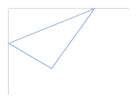
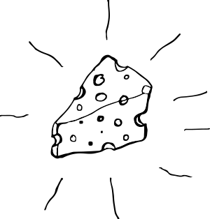

Chapter 6


# プロジェクトの整理 ある司書の物語

私たちの中には、メルビルという名の司書が住んでいます。これは、整理術を楽しむ幻想的な生き物です。日夜、メルビルはあなたのコードベースに秩序をもたらすことを切望しています。幸いなことに、Clojureは、混沌の力に対する絶え間ない闘いで、このホムンクルスを助けるために特別に設計されたツールのスイートを提供します。

これらのツールは、関連する関数とデータをグループ化することによって、コードの整理を助けます。また、名前の衝突を防いでくれるので、間違って他の人のコードを上書きしたり、その逆をしたりすることがありません。これらのツールの使い方を学びながら、サスペンスとミステリーの物語に参加し、一生に一度の大事件を解決してください。この物語が終わるころには、次のことが理解できるようになるでしょう。

- `def` が何をするのか
- 名前空間とは何か、そしてどのように使うか。
- 名前空間とファイルシステムの関係


- `refer`、`alias`、`require`、`use`、`ns` の使用方法
- ファイルシステムを使ってClojureプロジェクトを整理する方法

まず、Clojureの組織システムのハイレベルな概要から説明します。このシステムはライブラリとよく似た働きをします。メルビルは興奮で震えています!

## 図書館に見立てたプロジェクト

現実世界の図書館は、本、雑誌、DVDなどのオブジェクトのコレクションを保管しています。図書館には蔵書管理システムがあり、蔵書の番号を知ることで、その蔵書を手に入れることができます。

もちろん、人間が本やDVDの番号を即座に知ることはできない。そこで図書館では、本のタイトルと所蔵先の情報を関連付けて記録し、それを検索するためのツールを提供している。コンピュータがなかった昔、図書館にはカードカタログがあり、本のタイトルや著者名、住所（デューイ十進数や 米国議会図書館の番号）などが書かれた紙のカードがキャビネットにぎっしりと並んでいた。

例えば、「ダ・ヴィンチ・コード」を探すには、タイトルカタログ（タイトル順に並んだカード）を探し、正しいカードを見つけるまで閲覧する。 そのカードには、住所 *813.54* （デューイ十進分類法を使用している場合）が記載されており、図書館をナビゲートして 「ダ・ヴィンチ・コード」のある棚を見つけ、生涯の文学的または憎しみに満ちた読書の冒険をすることになります。

Clojureで同じような設定を想像するのは便利です。私はClojureを、（データ構造や関数のような）オブジェクトを膨大な数の棚に保存していると考えています。人間は、オブジェクトがどの棚に格納されているのかを直感的に知ることはできません。その代わりに、Clojureに識別子を与えて、オブジェクトを取り出すのに利用するのです。

これを成功させるために、Clojureは識別子と棚のアドレスの間の関連付けを維持する必要があります。これは、*名前空間*を使用することで行います。名前空間は、カードカタログのように、人に優しい*シンボル*と*var*として知られる棚のアドレスへの参照との間のマップを含みます。

技術的には、名前空間は `clojure.lang.Namespace` 型のオブジェクトで、Clojureのデータ構造と同じように操作することができます。例えば、現在の名前空間は `*ns*` で参照することができ、その名前は `(ns-name *ns*)` で取得することができます。


```
(ns-name *ns*)
; => user
```


例えば、REPL を起動したとき、あなたは `user` 名前空間にいます(ここで見ての通りです)。プロンプトには `user=>` のように現在の名前空間が表示されます。

現在の名前空間という考え方は、複数の名前空間を持つことができることを意味し、実際にClojureでは好きなだけ名前空間を作ることができます（技術的には、作成できる名前の数に上限があるかもしれませんが）。Clojureのプログラムでは、あなたは常に名前空間の*中に*います。

シンボルについては、あなたは今までずっと気づかずに使ってきました。例えば、`(map inc [1 2])` と書くと、`map` と `inc` は両方ともシンボルです。シンボルはClojureのデータ型ですが、次の章でしっかり説明します。今のところ、知っておくべきことは、Clojure に `map` のようなシンボルを与えると、現在の名前空間から対応する var を見つけて、棚のアドレスを取得し、その棚からオブジェクトを取得します - この場合、 `map` が参照している関数がそうです。もし、シンボルそのものを使いたいだけで、シンボルが参照しているものを使いたくない場合は、シンボルを引用しなければなりません。Clojureのフォームをquoteすると、Clojureはそれを評価せず、データとして扱います。次のいくつかの例は、フォームをQuoteするとどうなるかを示しています。


```
➊ inc
; => #<core$inc clojure.core$inc@30132014>

➋ 'inc
; => inc

➌ (map inc [1 2])
; => (2 3)

➍ '(map inc [1 2])
; => (map inc [1 2])
```


REPL で `inc` を ➊ で評価すると、`inc` が参照している関数のテキスト表現が出力されます。次に、 `inc` を ➋ で quote するので、結果は `inc` というシンボルになります。次に、おなじみの `map` アプリケーションを ➌ で評価し、おなじみの結果を得ます。その後、リストデータ構造全体を ➍ でクオートすると、 `map` シンボル、 `inc` シンボル、およびベクトルを含む未評価のリストが得られます。

さて、Clojureの体系についてわかったところで、その使い方を見てみましょう。

## def によるオブジェクトの保存

Clojure でオブジェクトを保存するための主要なツールは `def` です。`defn` のような他のツールは、フードの下で `def` を使用します。以下はdefの動作例である。


```
(def great-books ["East of Eden" "The Glass Bead Game"])
; => #'user/great-books

great-books
; => ["East of Eden" "The Glass Bead Game"]
```


このコードはClojureに伝えるものです。

1.  現在の名前空間のマップを `great-books` と var の間の関連付けで更新します。
2. 空いているストレージ棚を見つけます。
3. `["East of Eden" "The Glass Bead Game"]` をその棚に格納する。
4. 棚のアドレスをvarに書き込む。
5. var を返す（この場合、`#'user/great-books`）。

この処理は var のインターン(*interning*)と呼ばれます。 名前空間のシンボルとインターン先の var のマップを操作するには、 `ns-interns` を使用します。以下は、インターンされたvarのマップを取得する方法です。


```
(ns-interns *ns*)
; => {great-books #'user/great-books}
```


特定の var を取得するには、 `get` 関数を使用します。


```
(get (ns-interns *ns*) 'great-books)
; => #'user/great-books
```


`(``ns-map *ns*)`[,] を評価することで、名前空間がシンボルを与えられたときに var を検索するために使用する完全なマップを得ることもできます[.] `(ns-map *ns*) ` を使うと、ここでは出力しませんが、非常に大きなマップが得られます、試してみてください!

`#'user/great-books` は var の *reader form* です。 reader form については 7 章でもっと詳しく説明します。今のところ、 `#'` を使用すると、その後に続くシンボルに対応する var を使用できることを知っておいてください。 `#'user/great-books` では、 `user` 名前空間内のシンボル `great-books` に関連する var を使用できます。var を `deref` して、それが指すオブジェクトを取得することができます。


```
(deref #'user/great-books)
; => ["East of Eden" "The Glass Bead Game"]
```


これはClojureに "varから棚番号を取得し、その棚番号に行き、その上にあるものを取ってきて、それを私に渡せ！"と言っているようなものです。

しかし、通常はシンボルを使うだけです。


```
great-books
; => ["East of Eden" "The Glass Bead Game"]
```


これはClojureに「great-booksに関連するvarを取得し、そのダメなJacksonをderefせよ」と言うようなものです。

ここまではいい感じでしょう？さて、気を引き締めてください。この牧歌的な組織の楽園がひっくり返ろうとしているのですから! 同じシンボルでもう一度 `def` を呼び出してください。


```
(def great-books ["The Power of Bees" "Journey to Upstairs"])
great-books
; => ["The Power of Bees" "Journey to Upstairs"]
```


varは新しいベクターのアドレスに更新されました。カードカタログのカードの住所に白抜きを使って、新しい住所を書き込んだようなものです。その結果、Clojure に最初のベクトルを見つけるように要求することができなくなりました。これは *名前衝突* と呼ばれます。カオスだ!  アナーキー!

他のプログラミング言語でこれを経験したことがあるかもしれません。JavaScriptは有名ですし、Rubyでも同じことが起こります。意図せず自分のコードを上書きしてしまう可能性があり、またサードパーティのライブラリが自分のコードを上書きしないという保証もないので、問題です。 メルビルは恐怖に慄いています! 幸いなことに、Clojureでは好きなだけ名前空間を作ることができるので、このような衝突を避けることができます。

## 名前空間の作成と切り替え

Clojureには名前空間を作成するための3つのツールがあります。関数 `create-ns`, 関数 `in-ns`, そしてマクロ `ns` です。 Clojure のファイルではほとんど `ns` マクロを使用しますが、多くのツールを組み合わせているので、他のツールについて説明した後に理解するのが簡単なので、数ページにわたって説明するのを控えます。

`create-ns` はシンボルを受け取り、その名前の名前空間を作成します。


```
user=> (create-ns 'cheese.taxonomy)
; => #<Namespace cheese.taxonomy>
```


返された名前空間は、関数呼び出しの引数として使用することができます。


```
user=> (ns-name (create-ns 'cheese.taxonomy))
; => cheese-taxonomy
```


実際には、おそらくコードの中で `create-ns` を使うことはないでしょう。名前空間を作成して、その中に移動しないのはあまり便利ではないからです。リスト6-1に示すように、名前空間が存在しない場合は `in-ns` を使用して、名前空間を作成し、そこに移動するからです。


```
user=> (in-ns 'cheese.analysis)
; => #<Namespace cheese.analysis>
```


1.  6-1. `in-ns` を使って名前空間を作成し、そこに移動する

REPL のプロンプトが `cheese.analysis>` になっていることに注意してください。これは、先ほど作成した新しい名前空間に本当にいることを示しています。これで、 `def` を使用すると、指定したオブジェクトが `cheese.analysis` 名前空間に格納されます。

しかし、他の名前空間の関数やデータを使いたい場合はどうすればよいでしょうか。そのためには、 *完全修飾* シンボルを使用します。一般的な形式は `namespace/name` です。


```
cheese.analysis=> (in-ns 'cheese.taxonomy)
cheese.taxonomy=> (def cheddars ["mild" "medium" "strong" "sharp" "extra sharp"])
cheese.taxonomy=> (in-ns 'cheese.analysis)

cheese.analysis=> cheddars
; => Exception: Unable to resolve symbol: cheddars in this context
```


これは新しい名前空間 `cheese.taxonomy` を作成し、その名前空間で `cheddars` を定義し、その後 `cheese.analysis` 名前空間に切り替えます。`cheese.analysis` の中から `cheese.taxonomy` 名前空間の `cheddars` を参照しようとすると例外が発生しますが、完全修飾シンボルを使用すればうまくいきます。


```
cheese.analysis=> cheese.taxonomy/cheddars
; => ["mild" "medium" "strong" "sharp" "extra sharp"]
```


このような完全修飾されたシンボルを入力するのは、すぐに厄介なことになる。例えば、私が非常にせっかちな学者で、記号論、つまりチーズに関連するシンボルの研究を専門としているとする。

突然、考えうる限りの最悪の事態が起こったのだ。世界中で、神聖で歴史的に重要なチーズが行方不明になっているのだ。ウィスコンシン州のスタンダード・チェダー：消えた! ツタンカーメンのチーズの壺：盗まれた! トリノのチーズ: デマのチーズにすり替えられた! といった具合に、なぜか世界が大混乱に陥る恐れがあるのです! もちろん、チーズ研究家として、この謎を解くことは名誉なことである。その一方で、イルミナティやフリーメイソン、そしてフット団に追われているのだ。

私は学者なので、この謎を解決するために、私の知る限り最高の方法で、図書館に向かい、クソほども研究する。 私の信頼できる助手、Clojureが私に同行する。名前空間から名前空間へと奔走しながら、私はClojureに叫んで、次から次へと物を渡してもらう。

しかしClojureはちょっと間抜けで、私が何を指しているのか理解するのに苦労しています。`user` ネームスペースの中から、"`join` をくれ！"と叫びます。 `join` をくれ！"---口から唾が飛び出す。 "`RuntimeException: Unable to resolve symbol: join`," Clojureはそれに対して泣き言を言った。" brieの愛のために、ただ`clojure.string/join`を私に渡してください！" 私は言い返すと、Clojureは私が探していた関数を忠実に渡してくれた。

私の声は嗄れました。私はClojureに、完全修飾シンボルを毎回使うことなく、どのオブジェクトを取得するかを伝える方法が必要です。

幸運なことに、Clojureは `refer` と `alias` ツールを提供してくれて、より簡潔に叫ぶことができるようになりました。

### refer

`refer` を使用すると、他の名前空間のオブジェクトを参照する方法を細かく制御することができます。新しい REPL セッションを立ち上げて、次のようにしてみてください。REPLでこのように名前空間を弄るのは良いのですが、Clojureファイルをこのようにしたくないということを覚えておいてください。ファイルを構成する正しい方法は `"Real Project Organization" ページ 133` でカバーされています。


```
user=> (in-ns 'cheese.taxonomy)
cheese.taxonomy=> (def cheddars ["mild" "medium" "strong" "sharp" "extra sharp"])
cheese.taxonomy=> (def bries ["Wisconsin" "Somerset" "Brie de Meaux" "Brie de Melun"])
cheese.taxonomy=> (in-ns 'cheese.analysis)
cheese.analysis=> (clojure.core/refer 'cheese.taxonomy)
cheese.analysis=> bries
; => ["Wisconsin" "Somerset" "Brie de Meaux" "Brie de Melun"]

cheese.analysis=> cheddars
; => ["mild" "medium" "strong" "sharp" "extra sharp"]
```


このコードでは、`cheese.taxonomy` 名前空間とその中に2つのベクトルを作成します。また、その中に `cheddars` と `bries` という 2 つのベクトルを作成しています。そして、 `cheese.analysis` という新しい名前空間を作成し、そこに移動しています。名前空間シンボルを指定して `refer` を呼び出すと、完全修飾シンボルを使用せずに、対応する名前空間のオブジェクトを参照することができるようになります。これは、現在の名前空間のシンボル/オブジェクトマップを更新することによって行われます。このように新しいエントリを見ることができます。


```
cheese.analysis=> (clojure.core/get (clojure.core/ns-map clojure.core/*ns*) 'bries)
; => #'cheese.taxonomy/bries

cheese.analysis=> (clojure.core/get (clojure.core/ns-map clojure.core/*ns*) 'cheddars)
; => #'cheese.taxonomy/cheddars
```


まるでClojureのような

1.  `cheese.taxonomy` 名前空間に対して `ns-interns` を呼び出す。
2.  現在の名前空間の `ns-map` とマージする。
3.  その結果を現在の名前空間の新しい `ns-map` とする

`refer` を呼び出す際に、 `:only`, `:exclude`, `:rename` というフィルタを渡すこともできる。名前が示すように、 `:only` と `:exclude` は、現在の名前空間の `ns-map` にマージされるシンボルとvarのマッピングを制限します。`:rename` を使用すると、マージされる var に異なるシンボルを使用することができます。もし、先ほどの例を修正して `:only` を使用した場合は、以下のようになります。


```
cheese.analysis=> (clojure.core/refer 'cheese.taxonomy :only ['bries])
cheese.analysis=> bries
; => ["Wisconsin" "Somerset" "Brie de Meaux" "Brie de Melun"]
cheese.analysis=> cheddars 
; => RuntimeException: Unable to resolve symbol: cheddars
```


そして、`:exclude`の動作は以下の通りです。


```
cheese.analysis=> (clojure.core/refer 'cheese.taxonomy :exclude ['bries])
cheese.analysis=> bries
; => RuntimeException: Unable to resolve symbol: bries
cheese.analysis=> cheddars 
; => ["mild" "medium" "strong" "sharp" "extra sharp"]
```


最後に、`:rename`の例を示します。


```
cheese.analysis=> (clojure.core/refer 'cheese.taxonomy :rename {'bries 'yummy-bries})
cheese.analysis=> bries
; => RuntimeException: Unable to resolve symbol: bries
cheese.analysis=> yummy-bries
; => ["Wisconsin" "Somerset" "Brie de Meaux" "Brie de Melun"]
```


これらの最後の例では、 `clojure.core/ns-map` や `clojure.core/refer` などの `clojure.core` にあるすべてのオブジェクトの完全修飾名を使用しなければならないことに注意してください。`user` 名前空間では、その必要はありませんでした。これは、REPLが自動的に `user` ネームスペース内の `clojure.core` を参照するからです。新しい名前空間を作るときに `(clojure.core/refer-clojure)` を評価することで、生活を楽にすることができます。これは clojure.core 名前空間を参照するので、これからはこれを使うことにします。 例では `clojure.core/refer` を見る代わりに、 `refer` だけを見ることになります。

もうひとつ注目すべきは、関数やデータを名前空間間でどのように整理するかについて、完全な自由が与えられていることです。このため、関連する関数やデータを同じ名前空間にまとめておくことができます。

時には、ある関数を同じ名前空間内の他の関数からだけ利用できるようにしたい場合があります。Clojure では、 `defn-` を使って *private* な関数を定義することができます。


```
(in-ns 'cheese.analysis)
;; Notice the dash after "defn"
(defn- private-function
  "Just an example function that does nothing"
  [])
```


この関数を別の名前空間から呼び出したり、参照しようとすると、Clojureは例外をスローします。これは➊と➋でコードを評価するとわかります。


```
cheese.analysis=> (in-ns 'cheese.taxonomy)
cheese.taxonomy=> (clojure.core/refer-clojure)
➊ cheese.taxonomy=> (cheese.analysis/private-function)
➋ cheese.taxonomy=> (refer 'cheese.analysis :only ['private-function])
```


ご覧のように、たとえ明示的に `refer` したとしても、関数を private にしたために他の名前空間からその関数を使用することはできません。 (巧妙にやろうと思えば、 `@#'some/private-var` という難解な構文を使ってプライベート変数にアクセスすることはできますが、そんなことをしたい人はほとんどいないでしょう)。

### alias

`refer` と比較して、 `alias` は比較的シンプルです。この機能は、完全修飾されたシンボルを使用するために、名前空間名を短縮できるようにするだけです。


```
cheese.analysis=> (clojure.core/alias 'taxonomy 'cheese.taxonomy)
cheese.analysis=> taxonomy/bries
; => ["Wisconsin" "Somerset" "Brie de Meaux" "Brie de Melun"]
```


このコードでは、 `cheese.taxonomy` 名前空間の呼び出しシンボルを、より短いエイリアス `taxonomy` で使用することができます。

`refer` と `alias` は、現在の名前空間の外にあるオブジェクトを参照するための2つの基本的なツールです。これらは REPL 開発のための素晴らしい補助ツールです。

しかし、プログラム全体を REPL で作成することはあまりないでしょう。次のセクションでは、ファイルシステム上にソースコードが存在する実際のプロジェクトを編成するために知っておく必要があるすべてのことを説明します。

## 実際のプロジェクト編成

Clojureのシステム構成要素について説明したので、実際のプロジェクトでそれらをどのように使用するかを紹介します。ファイルパスと名前空間名の関係について説明し、 `require` と `use` を使ってファイルをロードする方法を説明し、 `ns` を使って名前空間を設定する方法を紹介します。

### ファイルパスと名前空間名の関係

一石二鳥（あるいは一粒で二度おいしい）のために、名前空間についてもっと詳しく説明し、その一方で、チーズ泥棒の場所をマッピングして、厄介な国際的チーズ泥棒を捕まえる作業をします。以下を実行してください。


```
lein new app the-divine-cheese-code
```


これで、次のようなディレクトリ構造になるはずです。


```
| .gitignore
| doc
| | intro.md
| project.clj
| README.md
| resources
| src
| | the_divine_cheese_code
| | | core.clj
| test
| | the_divine_cheese_code
| | | core_test.clj
```


さて、*src/the_divine_cheese_code/core.clj* を開いてみてください。最初の行にこんなのがあるはずです。


```
(ns the-divine-cheese-code.core
  (:gen-class))
```


`ns` は Clojure 内で名前空間を作成し、管理するための基本的な方法です。 近日中に完全に説明します。今のところ、この行はリスト6-1で使用した `in-ns` 関数と非常によく似ていることだけは知っておいてください。これは名前空間が存在しない場合に作成し、それに切り替えます。また、12章では `(:gen-class) ` をより詳しく説明します。

名前空間の名前は `the-divine-cheese-code.core` です。Clojureでは、名前空間名と名前空間が宣言されているファイルのパスは、以下の規約に従って一対一で対応します。

- (ここでやったように) `lein` を使ってディレクトリを作成した場合、ソースコードのルートはデフォルトで *src* になります。
- 名前空間名の中のダッシュは、ファイルシステムのアンダースコアに対応します。つまり、`the-divine-cheese-code` はファイルシステム上では *the_divine_cheese_code* にマップされます。
- 名前空間名のピリオド (`.`) の前にあるコンポーネントは、ディレクトリに対応する。例えば、`the-divine-cheese-code.core`は名前空間名なので、*the_divine_cheese_code*はディレクトリに相当する。
- 名前空間の最後のコンポーネントは、拡張子が *.clj* のファイルに対応します。`core` は *core.clj* にマップされます。

あなたのプロジェクトには、もう一つ名前空間があります。それは `the-divine-cheese-code.visualization.svg` です。そのためのファイルを作成してください。


```
mkdir src/the_divine_cheese_code/visualization
touch src/the_divine_cheese_code/visualization/svg.clj
```


ファイルシステムのパスはこれらの規則に沿っていることに注意してください。名前空間とファイルシステムの関係を理解したところで、 `require` と `use` について見てみましょう。

### Requiring and Using Namespaces

`the-divine-cheese-code.core` 名前空間のコードは、 `the-divine-cheese-code.visualization.svg` 名前空間の関数を使用して、SVG マークアップを作成することになります。`svg` の関数を使用するには、 `core` がそれを *require* しなければなりません。その前に、*svg.clj* にいくつかのコードを追加してみましょう。このような感じにしましょう（後でもっと追加します）。


```
(ns the-divine-cheese-code.visualization.svg)

(defn latlng->point
  "Convert lat/lng map to comma-separated string" 
  [latlng]
  (str (:lat latlng) "," (:lng latlng)))

(defn points
  [locations]
  (clojure.string/join " " (map latlng->point locations)))
```


これは `latlng->point` と `points` という2つの関数を定義しており、緯度/経度座標のシーケンスを点の文字列に変換するために使用します。このコードを *core.clj* ファイルから使用するには、 `require` する必要があります。この場合、 `(require 'the-divine-cheese``-code.visualization.svg)` を呼び出すと、Clojure は対応するファイルを読み込んで評価します。このファイルを評価することで、 `the-divine-cheese-code.visualization.svg` 名前空間を作成し、その中で関数 `latlng->point` と `points` を定義しているのです。プロジェクトのディレクトリに *svg.clj* というファイルがあっても、Clojure はプロジェクトの実行時に自動的にそれを評価しません; あなたはそれを使いたいことを明示的に Clojure に伝えなければなりません。

名前空間を要求した後、関数を参照するために完全修飾名を使用する必要がないように、 *refer* することができます。`the-divine-cheese-code.visualization.svg` を require して、 `heists` seq を追加して、 *core.clj* がリストと一致するようにします。


```
(ns the-divine-cheese-code.core)
;; Ensure that the SVG code is evaluated
(require 'the-divine-cheese-code.visualization.svg)
;; Refer the namespace so that you don't have to use the 
;; fully qualified name to reference svg functions
(refer 'the-divine-cheese-code.visualization.svg)

(def heists [{:location "Cologne, Germany"
              :cheese-name "Archbishop Hildebold's Cheese Pretzel"
              :lat 50.95
              :lng 6.97}
             {:location "Zurich, Switzerland"
              :cheese-name "The Standard Emmental"
              :lat 47.37
              :lng 8.55}
             {:location "Marseille, France"
              :cheese-name "Le Fromage de Cosquer"
              :lat 43.30
              :lng 5.37}
             {:location "Zurich, Switzerland"
              :cheese-name "The Lesser Emmental"
              :lat 47.37
              :lng 8.55}
             {:location "Vatican City"
              :cheese-name "The Cheese of Turin"
              :lat 41.90
              :lng 12.45}])

(defn -main
  [& args]
  (println (points heists)))
```


これで、heist の場所を指定することができ、 `visualization.svg` 名前空間から関数を使用することができます。`main` 関数は `points` 関数を `heists` に適用するだけです。プロジェクトを `lein run` で実行すると、このように表示されます。


```
50.95,6.97 47.37,8.55 43.3,5.37 47.37,8.55 41.9,12.45
```


万歳！発酵豆腐を盗んだ犯人に一歩近づいたぞ! `the-divine-cheese-code.visualization.svg` の読み込みに成功しました。

`require` の詳細は実は少し複雑なのですが、実用的には `require` はClojureに次のことを伝えると考えることができます。

1.  既にこのシンボル (`the-divine-cheese-code.visualization.svg`) で `require` を呼び出していた場合は何もしません。
2.  そうでなければ、このシンボルに対応するファイルを、133ページの「ファイルパスと名前空間名の関係」で説明したルールを使って探します。この場合、Clojureは `src/the_divine_cheese_code/visualization/svg.clj` を見つけます。

そのファイルの内容を読み、評価します。Clojure はファイルがそのパスに対応する名前空間を宣言していることを期待します（私たちのファイルはそうなっています）。

また、 `require` では、 `:as` や `alias` を使用して、名前空間のエイリアスを作成することができます。これは


```
(require '[the-divine-cheese-code.visualization.svg :as svg])
```


はこれに相当します。


```
(require 'the-divine-cheese-code.visualization.svg)
(alias 'svg 'the-divine-cheese-code.visualization.svg)
```


これでエイリアスされた名前空間を使うことができるようになりました。


```
(svg/points heists)
; => "50.95,6.97 47.37,8.55 43.3,5.37 47.37,8.55 41.9,12.45"
```


Clojure は別のショートカットを提供します。`require` と `refer` を別々に呼び出す代わりに、 `use` という関数がその両方を行います。プロダクションコードで `use` を使用するのは好ましくないが、REPLで実験しているときに、いくつかの関数をすぐに使いたいときに便利である。 例えば、こんな感じです。


```
(require 'the-divine-cheese-code.visualization.svg)
(refer 'the-divine-cheese-code.visualization.svg)
```


はこれに相当します。


```
(use 'the-divine-cheese-code.visualization.svg)
```


`use` は `require` と同じように名前空間のエイリアスを作成することができます。 これは


```
(require 'the-divine-cheese-code.visualization.svg)
(refer 'the-divine-cheese-code.visualization.svg)
(alias 'svg 'the-divine-cheese-code.visualization.svg)
```


はリスト6-2のコードと同等で、関数呼び出しでエイリアスの名前空間が使用されていることも示しています。


```
(use '[the-divine-cheese-code.visualization.svg :as svg])
(= svg/points points)
; => true

(= svg/latlng->point latlng->point)
; => true
```


1.  6-2. 名前空間の使用とエイリアスの両方を使用すると便利なことがあります。

名前空間はすでに `use` によって参照されている (これにより、 `svg/points` ではなく `points` を呼び出すことができる) ので、ここで `use` を使って名前空間を別名にすることは冗長に思えるかもしれない。しかし、特定の状況では、 `use` が `refer` と同じオプション (`:only`, `:exclude`, `:as`, `:rename`) を受け付けるので便利です。シンボルの参照を省略したときに、 `use` を使って名前空間のエイリアスを作成することができます。このように使うことができます。


```
(require 'the-divine-cheese-code.visualization.svg)
(refer 'the-divine-cheese-code.visualization.svg :as :only ['points])
```


あるいは、リスト6-3の `use` フォームを使うこともできます (このリストには、関数を呼び出す方法の例も含まれています)。


```
(use '[the-divine-cheese-code.visualization.svg :as svg :only [points]])
(refer 'the-divine-cheese-code.visualization.svg :as :only ['points])
(= svg/points points)
; => true

;; We can use the alias to reach latlng->point
svg/latlng->point
; This doesn't throw an exception

;; But we can't use the bare name
latlng->point
; This does throw an exception!
```


1.  名前空間の使用後にエイリアスを使用すると、除外したシンボルを参照することができます。

REPLでリスト6-3を試してみて、 `latlng->point` が例外をスローしない場合、リスト6-2で `latlng->point` を参照したからです。 リスト6-3のように動作させるためには、REPLセッションを再起動する必要があります。

ここでの要点は、 `require` と `use` はファイルを読み込み、オプションで `alias` や `refer` を使って名前空間を指定することです。Clojureプログラムを書いたり、他の人が書いたコードを読んでいると、さらに多くの `require` と `use` の書き方に出会うかもしれません。その時は、ClojureのAPIドキュメント (*<http://clojure.org/libs/>*) を読んで、何が起こっているかを理解するのが賢明でしょう。しかし、これまでに学んだ `require` と `use` は、あなたのニーズの95.3%をカバーするはずです。

### The ns Macro

さて、いよいよ `ns` マクロを見てみましょう。これまでに説明したツール—`in-ns`, `refer`, `alias`, `require`, そして `use`-- は、REPL で使用するときに最もよく使用されるものです。ソースコードのファイルでは、これまで説明したツールを簡潔に使用でき、その他の便利な機能を提供する `ns` マクロを通常使用します。このセクションでは、1つの `ns` 呼び出しがどのように `require`、`use`、`in-ns`、`alias`、`refer` を組み込むことができるのかについて学びます。

`ns` が行う便利なタスクの1つは、デフォルトで `clojure.core` 名前空間を参照することです。そのため、 `clojure.core/println` という完全修飾名を使用せずに、 `the-divine-cheese-code.core` 内から `println` を呼び出すことができるようになります。

`clojure-core`から何を参照するかは、 `:refer-clojure` で制御できます。このオプションは `refer` と同じオプションを取ります。


```
(ns the-divine-cheese-code.core
  (:refer-clojure :exclude [println]))
```


もしこれを *divine_cheese_code.core.clj* の先頭で呼ぶと、コードが壊れてしまうので、 `-main` 関数の中で `clojure.core/println` を使わざるを得なくなります。

`ns` 内では、 `(:``refer-clojure)` という形式は *reference* と呼ばれます。これはあなたにとって奇妙に見えるかもしれません。このreferenceは関数呼び出しなのでしょうか？マクロか？ これは何なのでしょうか？第7章で、その基礎となる仕組みについてもっと学びます。今のところ、各参照がどのように関数呼び出しに対応するかを理解する必要があります。例えば、前のコードはこれと同等です。


```
(in-ns 'the-divine-cheese-code.core)
(refer 'clojure.core :exclude ['println])
```


`ns` の中では、6種類のリファレンスが可能である。

-   `(:refer-clojure)`
-   `(:require)`
-   `(:use)`
-   `(:import)`
-   `(:load)`
-   `(:gen-class)`

`(:import)` と `(:gen-class)` については 12 章で説明します。`(:load)`はめったに使われないので、ここでは取り上げません。

`(:require)`は `require` 関数とよく似た働きをします。例えば、こんな感じです。


```
(ns the-divine-cheese-code.core
  (:require the-divine-cheese-code.visualization.svg))
```


はこれに相当します。


```
(in-ns 'the-divine-cheese-code.core)
(require 'the-divine-cheese-code.visualization.svg)
```


`ns` 形式では (`in-ns` 関数呼び出しと違って) シンボルを `'` で引用する必要がないことに注意してください。`ns` の中では、シンボルを引用符で囲む必要はありません。

また、関数を呼び出すときと同じように、 `ns` 内で `require` するライブラリの名前を `alias` することができます。これは


```
(ns the-divine-cheese-code.core
  (:require [the-divine-cheese-code.visualization.svg :as svg]))
```


はこれに相当します。


```
(in-ns 'the-divine-cheese-code.core)
(require ['the-divine-cheese-code.visualization.svg :as 'svg])
```


以下のように、`(:require)`参照で複数のライブラリをrequireすることができます。これは


```
(ns the-divine-cheese-code.core
  (:require [the-divine-cheese-code.visualization.svg :as svg]
            [clojure.java.browse :as browse]))
```


はこれに相当します。


```
(in-ns 'the-divine-cheese-code.core)
(require ['the-divine-cheese-code.visualization.svg :as 'svg])
(require ['clojure.java.browse :as 'browse])
```


しかし、 `(:require)` リファレンスと `require` 関数の違いの1つは、リファレンスでは名前も参照できることです。 これは


```
(ns the-divine-cheese-code.core
  (:require [the-divine-cheese-code.visualization.svg :refer [points]]))
```


はこれに相当します。


```
(in-ns 'the-divine-cheese-code.core)
(require 'the-divine-cheese-code.visualization.svg)
(refer 'the-divine-cheese-code.visualization.svg :only ['points])
```


また、すべてのシンボルを参照することもできます（`:all`キーワードに注目）。


```
(ns the-divine-cheese-code.core
  (:require [the-divine-cheese-code.visualization.svg :refer :all]))
```


というのは、これをやるのと同じことです。


```
(in-ns 'the-divine-cheese-code.core)
(require 'the-divine-cheese-code.visualization.svg)
(refer 'the-divine-cheese-code.visualization.svg)
```


これはコードを要求したり、名前空間のエイリアスを作成したり、シンボルを参照したりするのに適した方法です。`(:use)`を使わないことを推奨しますが、使う可能性が高いので、どのように動作するかを知っておくとよいでしょう。このようなことはご存知でしょう。これです。


```
(ns the-divine-cheese-code.core
  (:use clojure.java.browse))
```


はこれを行う。


```
(in-ns 'the-divine-cheese-code.core)
(use 'clojure.java.browse)
```


これに対して


```
(ns the-divine-cheese-code.core
  (:use [clojure.java browse io]))
```


はこれを行う。


```
(in-ns 'the-divine-cheese-code.core)
(use 'clojure.java.browse)
(use 'clojure.java.io)
```


`use` に続けてベクターを指定すると、最初のシンボルを *base* として受け取り、その後に続く各シンボルに対して `use` を呼び出すことに注意してください。

なんてこった、これだ! これで `ns` をプロ並みに使えるようになりました。というのも、あの *voleur des fromages* (フランス語でこう言います) がまだ暴れまわっているのです! 覚えてますか？

## 泥棒を捕まえるために

パルメザンチーズを盗んだ犯人をこれ以上逃がすわけにはいかない! そろそろ、強盗の座標を元に線を引いてみようか! きっと何かが見えてくるはずだ!

各盗賊の座標（緯度）を使って、SVG画像の点と点を結んでいくんだ。しかし、与えられた座標で線を引くと、2つの理由で正しい形になりません。まず、緯度座標は南から北へ向かうのに対し、SVGのy座標は上から下へ向かって上昇する。つまり、座標を反転させないと、描画が逆さまになってしまいます。

次に、描画が非常に小さくなってしまうことです。それを解決するために、平行移動と拡大縮小をすることになる。図 6-1a のような図面を図 6-1b にするようなものである。





図6-1：緯度座標を反転、平行移動、拡大縮小してSVG画像にする。


正直なところ、これはすべて完全に恣意的なもので、もはやコード構成とは直接関係ありません。しかし、これは楽しいことで、皆さんも楽しくコードを見ていくことができると思います! あなたの *svg.clj* ファイルをリスト6-4と一致させましょう。


```
(ns the-divine-cheese-code.visualization.svg
  (:require [clojure.string :as s])
  (:refer-clojure :exclude [min max]))

➊ (defn comparator-over-maps
  [comparison-fn ks]
  (fn [maps]
➋     (zipmap ks
➌             (map (fn [k] (apply comparison-fn (map k maps)))
                 ks))))

➍ (def min (comparator-over-maps clojure.core/min [:lat :lng]))
(def max (comparator-over-maps clojure.core/max [:lat :lng]))
```


1.  6-3. マップ比較関数の構築

➊で `comparator-over-maps` 関数を定義します。ここが一番厄介なところなので、我慢してください。`comparator-over-maps` は関数を返す関数です。返される関数は、 `ks` パラメータで指定されたキーの値を、指定された比較関数である `comparison-fn` を使用して比較します。

`comparator-over-maps` を使用して、 `min` と `max` 関数 ➍ を作成し、それを使って描画の左上隅と右下隅を探します。ここでは、 `min` を実際に使用しています。


```
(min [{:a 1 :b 3} {:a 5 :b 0}])
; => {:a 1 :b 0}
```


`min` を呼び出すと、 `zipmap` が呼び出されます。これは 2 つの引数（両方とも seq）を受け取り、新しいマップを返します。最初の seq の要素がキーになり、2番目の seq の要素が値になります。


```
(zipmap [:a :b] [1 2])
; => {:a 1 :b 2}
```


このとき、 `zipmap` の最初の引数は `ks` なので、 `ks` の要素が返されるマップのキーとなる。第2引数は ➌ のマップ呼び出しの結果である。このマップコールが実際に比較を行います。

最後に、➍で `comparator-over-maps` を使って、比較関数を作成します。描画が矩形に内接すると考えると、 `min` は矩形の (0, 0) に最も近いコーナーで、 `max` はそこから最も遠いコーナーになります。

以下はコードの次の部分である。


```
 (defn translate-to-00
  [locations]
  (let [mincoords (min locations)]
    (map #(merge-with - % mincoords) locations)))

 (defn scale
  [width height locations]
  (let [maxcoords (max locations)
        ratio {:lat (/ height (:lat maxcoords))
               :lng (/ width (:lng maxcoords))}]
    (map #(merge-with * % ratio) locations)))
```


`translate-to-00`は 、位置の `min` を見つけて、それぞれの位置からその値を引くことによって動作します。これは `merge-with` を使用しており、次のように動作します。


```
(merge-with - {:lat 50 :lng 10} {:lat 5 :lng 5})
; => {:lat 45 :lng 5}
```


そして、関数 `scale` を定義します。この関数は、各点に最大緯度と最大経度および希望する高さと幅の比率を掛けます。

以下は、*svg.clj* の残りのコードです。


```
(defn latlng->point
  "Convert lat/lng map to comma-separated string" 
  [latlng]
  (str (:lat latlng) "," (:lng latlng)))

(defn points
  "Given a seq of lat/lng maps, return string of points joined by space"
  [locations]
  (s/join " " (map latlng->point locations)))

(defn line
  [points]
  (str "<polyline points=\"" points "\" />"))

(defn transform
  "Just chains other functions"
  [width height locations]
  (->> locations
       translate-to-00
       (scale width height)))

(defn xml
  "svg 'template', which also flips the coordinate system"
  [width height locations]
  (str "<svg height=\"" height "\" width=\"" width "\">"
       ;; These two <g> tags change the coordinate system so that
       ;; 0,0 is in the lower-left corner, instead of SVG's default
       ;; upper-left corner
       "<g transform=\"translate(0," height ")\">"
       "<g transform=\"rotate(-90)\">"
       (-> (transform width height locations)
           points
           line)
       "</g></g>"
       "</svg>"))
```


この関数はとても簡単です。これらは `{:lat x :lng y}` というマップを受け取り、SVG を作成できるように変換するだけです。 `latlng->point` は SVG マークアップで点を定義するために使用できる文字列を返します。`points` は、 `lat`/`lng` マップのシーケンスを、スペースで区切られたポイントの文字列に変換する。`line` は、スペースで区切られたすべての点列を結ぶ線の SVG マークアップを返します。 `transform` は指定された位置のシーケンスを受け取り、それらが点 (0, 0) から始まるように変換し、指定された幅と高さにスケーリングします。 最後に、 `xml` は与えられた位置を SVG で表示するためのマークアップを生成します。

*svg.clj* がすべてコード化されたので、今度は *core.clj* をこのようにします。


```
(ns the-divine-cheese-code.core
  (:require [clojure.java.browse :as browse]
            [the-divine-cheese-code.visualization.svg :refer [xml]])
  (:gen-class))

(def heists [{:location "Cologne, Germany"
              :cheese-name "Archbishop Hildebold's Cheese Pretzel"
              :lat 50.95
              :lng 6.97}
             {:location "Zurich, Switzerland"
              :cheese-name "The Standard Emmental"
              :lat 47.37
              :lng 8.55}
             {:location "Marseille, France"
              :cheese-name "Le Fromage de Cosquer"
              :lat 43.30
              :lng 5.37}
             {:location "Zurich, Switzerland"
              :cheese-name "The Lesser Emmental"
              :lat 47.37
              :lng 8.55}
             {:location "Vatican City"
              :cheese-name "The Cheese of Turin"
              :lat 41.90
              :lng 12.45}])

(defn url
  [filename]
  (str "file:///"
       (System/getProperty "user.dir")
       "/"
       filename))

(defn template
  [contents]
  (str "<style>polyline { fill:none; stroke:#5881d8; stroke-width:3}</style>"
       contents))

(defn -main
  [& args]
  (let [filename "map.html"]
    (->> heists
         (xml 50 100)
         template
         (spit filename))
    (browse/browse-url (url filename))))
```


ここでは、特に複雑なことは行っていません。`main` の中で `xml` と `template` 関数を使って描画を構築し、 `spit` で描画をファイルに書き込んで、 `browse/browse-url` でそれを開くというものです。今すぐ試してみてください。`lein run` を実行すると、図 6-2 のようなものが表示されるはずです。


図6-2：強盗パターンの最終的なSVG!


ちょっと待てよ ... ... ラムダに似てるな ... ... Clojureのロゴはラムダなんだ . ... なんてことだ! Clojure、ずっとあなただったのね!

## まとめ

この章では、多くのことを学びました。この時点で、あなたのプロジェクトを整理するために必要なすべてのツールを手に入れたはずです。名前空間はシンボルとvarの間のマップを組織すること、そしてvarはClojureオブジェクト（データ構造、関数など）への参照であることを理解しました。 `def` はオブジェクトを保存し、オブジェクトを指すシンボルとバーの間のマップを現在の名前空間に追加して更新します。`defn-` でプライベート関数を作成することができます。

Clojureでは `create-ns` で名前空間を作成することができるが、多くの場合、名前空間も切り替える `in-ns` を使用する方が便利である。これらの関数はおそらくREPLの中でしか使わないでしょう。REPLにいるときは、常に現在のネームスペースにいることになる。REPL ではなくファイルで名前空間を定義する場合は、 `ns` マクロを使用する必要があり、名前空間とファイルシステム上のパスは一対一の関係にあります。

他の名前空間のオブジェクトを参照するには、 `cheese.taxonomy/cheddars` のような完全修飾名を使用します。また、 `alias` を使用すると、完全修飾名を記述する際に、名前空間に対して短い名前を使用することができます。

`require` と `use` は名前空間が存在し、使用できることを確認します。また、オプションとして、対応する名前空間を `refer` と `alias` で指定することができます。ソースファイルの中で `require` と `use` を呼び出すには、 `ns` を使用する必要があります。*<https://gist.github.com/ghoseb/287710/>* は `ns` の使い方のすべての迷信を知るための素晴らしいリファレンスです。

最後に、そして最も重要なことですが、ズル賢くなるのは簡単なことではありません。

{.figure}


