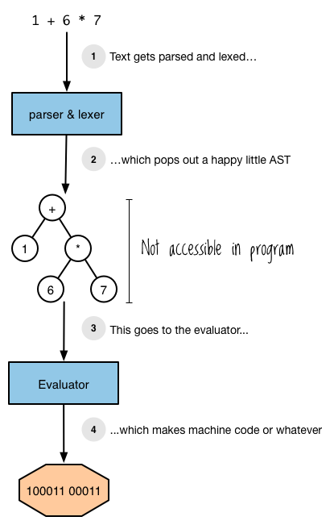
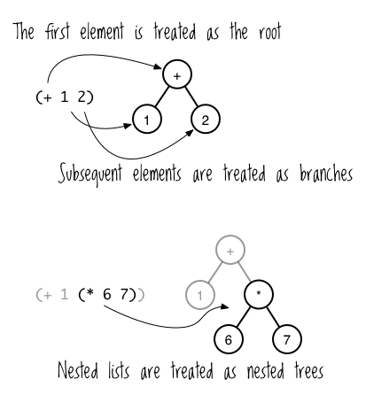
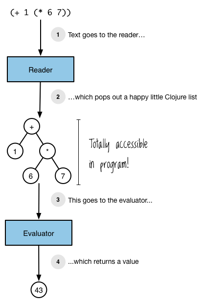
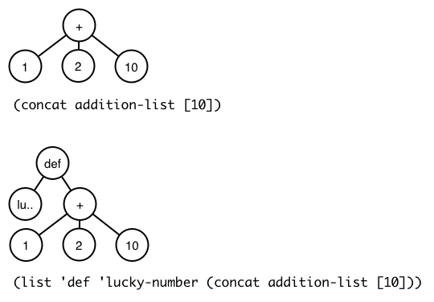
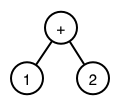
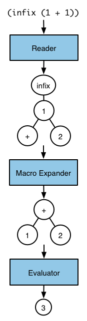

Chapter 7


# Clojureの錬金術。読み取り、評価、マクロ

哲学者の石は、生命の霊薬やバイアグラと並んで、錬金術の伝承で最もよく知られた標本の一つで、鉛を金に変える能力があると追求されています。しかし、Clojureには哲学者の石を単なるアクセサリーに見せる道具があります：*マクロ*です。

マクロは、任意の式を有効なClojureに変換することができますので、あなたのニーズに合わせて言語自体を拡張することができます。また、ローブを着た老紳士や婦人でなくても使うことができます。

このパワーのほんの一端を知るために、この些細なマクロを考えてみましょう。


```
(defmacro backwards
  [form]
  (reverse form))

(backwards (" backwards" " am" "I" str))
; => "I am backwards"
```


`backwards` マクロは、Clojure が `(" backwards" " am" "I" str)` という式を正常に評価できるようにします。この式は、式のオペランドを最初に表示しなければならないという Clojure の組み込み構文規則に従っていませんが、（言うまでもなく、式は逆順で書かれてはならないという規則です）。`backwards` がなければ、この式は何千年もの錬金術師が皮肉にも不死を達成するための不可能な手段を追求して一生を過ごすより難しい失敗をするでしょう。`backwards`を使えば、*あなた自身の構文を作りました！* あなたはClojureを拡張したので、好きなようにコードを書くことができます！* あなたはClojureを拡張したので、好きなようにコードを書くことができます！* `backwards` を使えば、*あなた自身の構文を作りました*。鉛を金に変えるよりも良いことだと思います!

この章では、あなた自身のマクロを書くために必要な概念的な基礎を提供します。Clojureの評価モデルの要素である*リーダー*、*評価者*、そして*マクロ拡張者*を説明します。これはClojure要素の周期表のようなものです。周期表がどのように原子の特性を明らかにするかを考えてみてください：同じ列の元素は同じ核電荷を持っているので、同じように振る舞います。 周期表とその基礎となる理論がなければ、かつての錬金術師と同じような立場になり、ランダムにものを混ぜて何が爆発するか見ていたことでしょう。しかし、元素を深く理解することで、なぜ物質が爆発するのかがわかり、意図的に物質を爆発させる方法を学ぶことができるのです。

## Clojureの評価モデルの概要

Clojureは（他のLispと同様に）他のほとんどの言語と異なる評価モデルを持っています：それは、テキストソースコードを*読み*、Clojureデータ構造を生成する2フェーズシステムを持っています。これらのデータ構造は、次に*評価*されます。Clojureはデータ構造を走査し、データ構造のタイプに基づいて、関数アプリケーションや変数ルックアップのようなアクションを実行します。例えば、Clojure がテキスト `(+ 1 2)` を読み込むと、結果はリストデータ構造で、最初の要素は `+` シンボルであり、その後に数字の 1 と 2 が続いています。このデータ構造はClojureの評価器に渡され、評価器は `+` に対応する関数を検索して、その関数を1と2に適用します。

このようにソースコード、データ、評価の関係を持つ言語を*ホモイコニック*と呼びます(ちなみに、消灯中に浴室の鏡の前で*ホモイコニック*と3回言うと、ジョン・マッカーシーの幽霊が現れ、あなたに括弧を手渡します。)。ホモイコニック言語は、コードをデータ構造の集合として推論し、プログラムで操作できるようにするものです。この文脈を理解するために、コンパイルの世界を旅してみよう。

プログラミング言語には、コンパイラやインタプリタが必要です。コンパイラは、ユーザーが書いたユニコード文字からなるコードを、機械命令や他のプログラミング言語のコードなど、別の何かに翻訳します。この過程で、コンパイラはプログラムを表すデータ構造である*AST（抽象構文木）*を構築します。ASTは*評価器*への入力と考えることができ、評価器はツリーを走査して機械語コードなどを出力する関数と考えることができる。

ここまでは、私がClojureについて説明したこととよく似ています。しかし、ほとんどの言語では、ASTのデータ構造はプログラミング言語の中でアクセスできません。プログラミング言語空間とコンパイラ空間は永遠に分離されており、両者は決して出会うことはありません。図7-1は、Lisp以外のプログラミング言語での式のコンパイル過程を可視化したものです。




図7-1: 非Lispプログラミング言語での評価


ClojureはLispであり、Lispは盗まれたタマゴより熱いので、Clojureは異なっています。Lispは、アクセスできない内部データ構造として表現されたASTを評価する代わりに、ネイティブのデータ構造を評価します。Clojureはまだ木構造を評価しますが、木はClojureリストを使用して構造化され、ノードはClojureの値です。

リストは木構造を構築するのに理想的です。リストの最初の要素はルートとして扱われ、後続の各要素は枝として扱われます。ネストされた木を作るには、図 7-2 に示すように、ネストされたリストを使用すればよいのです。




図7-2: リストは簡単に木として扱うことができる。


まず、Clojureの*リーダー*は、テキスト `(+ 1 (* 6 7))` をネストされたリストに変換します。(リーダーについては次のセクションで詳しく説明します。) そして、Clojureの評価器がそのデータを入力として受け取り、結果を生成します。(これはJava Virtual Machine ( JVM ) バイトコードもコンパイルしますが、それについては第12章で学びます。今は、概念的な評価モデルだけに注目することにする)。

これを踏まえて、図7-3はClojureの評価プロセスがどのようなものかを示しています。


S-式

Lispを使用していると、LispはS-式を評価すると説明する資料に出会うことがあります。この用語は、評価される実際のデータオブジェクトとそのデータを表現するソースコードの両方を指すのに使われることがあり、曖昧なのでここでは避けています。Lispの評価の2つの異なる要素（コードとデータ）に同じ用語を使用すると、重要なことが見えなくなってしまいます。s式の素晴らしい扱いについては、<http://www.gigamonkeys.com/book/syntax-and-semantics.html>をチェックしてください。





図 7-3: Clojure での評価


しかし、評価器は実際に入力がどこから来るかを気にしません; リーダーから来る必要はないのです。その結果、プログラムのデータ構造を `eval` で直接Clojureエバリュエータに送ることができます。 ご覧ください!


```
(def addition-list (list + 1 2))
(eval addition-list)
; => 3
```


その通りだ、ベイビー! あなたのプログラムはClojureのリストを評価しました。Clojureの評価ルールについては後で詳しく説明しますが、簡単に説明すると、次のようなことが起こります： Clojureがリストを評価したとき、 `addition-list` が参照しているリストを調べ、次に `+ `シンボルに対応する関数を調べ、そして `1` と `2` を引数としてその関数を呼び出し、 `3` を返しました。実行中のプログラムのデータ構造と評価器のデータ構造は同じ空間に存在し、Clojureのフルパワーとあなたが書いたすべてのコードを使用して、評価のためのデータ構造を構築することができます。


```
(eval (concat addition-list [10]))
; => 13

(eval (list 'def 'lucky-number (concat addition-list [10])))
; => #'user/lucky-number

lucky-number
; => 13
```


図7-4は、この2つの例で評価者に送ったリストです。




図 7-4: 評価したリスト


あなたのプログラムは、自分自身の評価器と直接対話し、自分自身の関数とデータを使って、実行中に自分自身を修正することができます。もう気が狂いそうですか？そうですね。でも、正気を保ってください、まだまだ学ぶべきことがありますから。

Clojureはホモイコニックです。リストを使って抽象的な構文木を表現し、Clojureのコードを書くときはリストのテキスト表現を書きます。あなたが書いたコードは、あなたが操作に慣れているデータ構造を表し、評価者はそれらのデータ構造を消費するので、あなたのプログラムをプログラム的に修正する方法について推論するのは簡単です。

マクロは、これらの操作を簡単に実行できるようにするものです。この章の残りの部分では、Clojureのリーダーおよび評価ルールを詳しく説明し、マクロがどのように機能するかを正確に理解できるようにします。

## The Reader

リーダーは、あなたがファイルに保存したり、REPLで入力したテキストソース・コードをClojureデータ構造に変換します。これは、Unicode 文字の人間の世界と、リスト、ベクトル、マップ、シンボル、その他のデータ構造の Clojure の世界の間の翻訳者のようなものです。このセクションでは、リーダと直接対話し、便利な機能である *リーダマクロ* が、どのようにコードをより簡潔に書くことができるかを学びます。

### Reading

reading を理解するために、まず Clojure が REPL で入力されたテキストをどのように処理するかを詳しく見てみましょう。まず、REPL はテキストを入力するように要求します。


```
user=>
```


そして、ちょっとしたテキストを入力するのです。たぶんこんな感じです。


```
user=> (str "To understand what recursion is," " you must first understand recursion.")
```


そのテキストは実際には単なる Unicode 文字の列ですが、Clojure データ構造の組み合わせを表すためのものです。このデータ構造のテキスト表現は *reader form* と呼ばれます。この例では、フォームはリストのデータ構造を表し、さらに `str` シンボルと2つの文字列という3つのフォームを含んでいます。

プロンプトにこれらの文字を入力して `enter` を押すと、そのテキストはリーダーに行きます（REPLは read-eval-print-loop の略であることを思い出してください）。Clojureは文字のストリームを読み、内部で対応するデータ構造を生成します。そして、データ構造を評価し、その結果のテキスト表現を表示します。


```
"To understand what recursion is, you must first understand recursion."
```


reading と評価 はそれぞれ独立に行うことができます。リーダーを直接操作する方法の1つは、 `read-string` 関数を使用することです。`read-string` は引数として文字列を受け取り、Clojure のリーダーを使って処理し、データ構造を返します。


```
(read-string "(+ 1 2)")
; => (+ 1 2)

(list? (read-string "(+ 1 2)"))
; => true

(conj (read-string "(+ 1 2)") :zagglewag)
; => (:zagglewag + 1 2)
```


最初の例では、 `read-string` はプラス記号と数字の 1 と 2 を含むリストの文字列表現を読み込んでいます。2つ目の例で証明されているように、戻り値は実際のリストである。最後の例では、 `conj` を使って、キーワードをリストの先頭に追加している。ここで重要なことは、読み込みと評価は互いに独立しているということです。テキストを評価することなく読むことができ、その結果を他の関数に渡すことができます。 また、必要であれば、結果を評価することもできます。


```
(eval (read-string "(+ 1 2)"))
; => 3
```


これまでのすべての例で、リーダー・フォームとそれに対応するデータ構造は一対一の関係になっています。ここでは、単純なリーダフォームとそれが表現するデータ構造が直接的に対応する例をさらに紹介する。

- リスト・リーダ・フォーム **()**
- **str** シンボル・リーダ・フォーム
-**\[1 2\]** 数字のリーダ・フォームを2つ含むベクトル・リーダ・フォーム
- **{:sound \"hoot\"}**  キーワード・リーダー・フォームと文字列リーダー・フォームを含むマップ・リーダー・フォーム

しかし、readerはテキストをデータ構造に変換する際に、より複雑な動作をさせることができます。例えば、無名関数を覚えていますか？


```
(#(+ 1 %) 3)
; => 4
```


では、試してみてください。


```
(read-string "#(+ 1 %)")
; => (fn* [p1__423#] (+ 1 p1__423#))
```


ワーオ! これは私たちが慣れ親しんだ一対一の対応付けではありません。`#(+ 1 %)` を読むと、なぜか `fn*` シンボルからなるリスト、シンボルを含むベクトル、そして3つの要素を含むリストが生成されます。何が起こったのでしょうか？

### Reader Macros

自分の質問に答えよう。リーダーは、`#(+ 1 %)` を変換するのに *リーダーマクロ* を使っている。リーダーマクロとは、テキストをデータ構造に変換するためのルールのセットです。これらのマクロは、省略されたリーダフォームを完全なフォームに展開するため、よりコンパクトな方法でデータ構造を表現することができるようになります。マクロは、`'`（シングルクォート）、`#`、`@` などの *マクロ文字* で指定されます。また、このマクロは後で説明するマクロとは全く別のものです。この2つを混同しないように、ここでは常に*リーダーマクロ*という完全な用語を使用してリーダーマクロを参照することにします。

例えば、引用符リーダーマクロがシングルクォート文字をどのように展開するかは、ここで見ることができます。


```
(read-string "'(a b c)")
; => (quote (a b c))
```


リーダーがシングルクォートに遭遇したとき、最初のメンバーがシンボル `quote` で、2番目のメンバーがシングルクォートに続くデータ構造であるリストに展開されます。リーダーマクロ `deref` は `@` 文字に対しても同じように動作します。


```
(read-string "@var")
; => (clojure.core/deref var)
```


リーダーマクロは、テキストを無視させるようなおかしなこともできます。セミコロンは、一行コメントリーダーマクロを指定します。


```
(read-string "; ignore!\n(+ 1 2)")
; => (+ 1 2)
```


そして、これがリーダーです。あなたの謙虚な仲間は、テキストをデータ構造に変換するのにひたすら努力します。さて、Clojureがこれらのデータ構造をどのように評価するか見てみましょう。

## The Evaluator


{.figure}


図 7-5: `(+ 1 2)` のデータ構造


Clojureの評価器は、データ構造を引数に取り、データ構造の型に対応したルールでデータ構造を処理し、結果を返す関数と考えることができます。シンボルを評価するために、Clojureはそのシンボルが何を参照しているかを調べます。リストを評価するために、Clojureはリストの最初の要素を見て、関数、マクロ、または特殊フォームを呼び出します。その他の値（文字列、数値、キーワードを含む）は、単にそれ自身に対して評価されます。

例えば、REPLで `(+ 1 2)` と入力したとします。図7-5は，評価器に送られるデータ構造の図を示しています．

これはリストなので、評価器はリストの最初の要素を評価することから始めます。最初の要素はプラス記号であり、評価器は対応する関数を返すことで解決します。リストの最初の要素が関数であるため、評価器は各オペランドを評価します。オペランド 1 と 2 はリストでもシンボルでもないため、自分自身に評価されます。次に、evaluator は 1 と 2 をオペランドとして加算関数を呼び出し、その結果を返します。

この章の残りの部分では、データ構造の種類ごとに評価器のルールをより詳細に説明します。評価器がどのように動作するかを示すために、各例を REPL で実行します。REPL では、まずテキストを読み取ってデータ構造を取得し、そのデータ構造を評価器に送信して、その結果をテキストとして出力することに留意してください。


データについて

この章でClojureがデータ構造をどのように評価するかについて書きますが、それは不正確です。技術的には、データ構造はリンクリストやB-treeなどのある種のコレクションを指しますが、筆者はシンボルや数値などのスカラー（単数、非コレクション）値を指す場合にもこの用語を使用します。データオブジェクトという言葉も考えましたが、オブジェクト指向プログラミングを示唆するものではありませんし、データだけを使うのも、データという概念と混同させるものではありません。というわけで、データ構造というわけです。もし、これを不快に思われたなら、ヴァンエム・デ・ボアスの木で考え抜かれた、千のお詫びを差し上げましょう。


### これらのものは自分自身に評価される

Clojure がリストやシンボルでないデータ構造を評価するときはいつでも、その結果はその データ構造そのものです。


```
true
; => true

false
; => false

{}
; => {}

:huzzah
; => :huzzah
```


空のリストも自分に評価する。


```
()
; => ()
```


### シンボル

プログラマとしての基本的な仕事のひとつは、名前と値を結びつけて抽象化することです。第3章では `def`, `let`, そして関数定義を使ってこれを行う方法を学びました。Clojureは関数、マクロ、データ、その他使えるものすべてに *シンボル* を使って名前を付け、 *解決* することでそれらを評価します。シンボルを解決するために、Clojureはあなたが作成したすべてのバインディングを走査し、第6章で学んだ名前空間マッピングでシンボルのエントリを探します。最終的に、シンボルは *value* または *特殊フォーム* - 基本的な動作を提供する組み込みのClojure演算子のどちらかに解決されます。

一般的に、Clojureはシンボルを次のように解決します。

1.  シンボルが特殊フォームを指定するかどうかを調べます。もしそうでなければ ... ...
2.  シンボルが局所的なバインディングに対応しているかどうかを調べます。そうでない場合 ... ...
3.  `def` によって導入された名前空間マッピングを探そうとする。もしそうでなければ ... ...
4.  例外を投げる

まず、シンボルが特殊な形に解決されることを見てみましょう。`if` のような特別な形式は、常に操作のコンテキストで使用されます。


```
(if true :a :b)
; => :a
```


この場合、`if` は特殊な形式であり、演算子として使用されています。 この文脈以外で特殊フォームを参照しようとすると、例外が発生します。


```
if
; => CompilerException java.lang.RuntimeException: Unable to resolve symbol: if in this context, compiling:(NO_SOURCE_PATH:0:0) 
```


次に、いくつかの局所的なバインディングを評価してみましょう。*局所バインディング* とは、シンボルと値の間の関連付けのうち、 `def` によって作成されたものではないものを指します。 次の例では、シンボル `x` は `let` を使って 5 に束縛されています。評価者が `x` を解決するとき、それは *シンボル* `x` を *値* 5 に解決する。


```
(let [x 5]
  (+ x 3))
; => 8
```


ここで、`x`から15への名前空間マッピングを作成すると、Clojureはそれに応じて解決する。


```
(def x 15)
(+ x 3)
; => 18
```


次の例では、 `x` は 15 にマップされていますが、 `let` を使って `x` と 5 のローカルバインディングを導入しています。そのため、 `x` は 5 に解決されます。


```
(def x 15)
(let [x 5]
  (+ x 3))
; => 8
```


バインディングは入れ子にすることができ、その場合、最も新しく定義されたバインディングが優先されます。


```
(let [x 5]
  (let [x 6]
    (+ x 3)))
; => 9
```


また、関数は局所的なバインディングを作成し、パラメータを関数本体の引数にバインドします。この次の例では、 `exclaim` が関数にマップされています。関数本体の中では、パラメータ名 `exclamation` が関数に渡された引数にバインドされています。


```
(defn exclaim
  [exclamation]
  (str exclamation "!"))

(exclaim "Hadoken")
; => "Hadoken!"
```


最後に、この最後の例では、`map` と `inc` は両方とも関数を参照しています。


```
(map inc [1 2 3])
; => (2 3 4)
```


Clojure がこのコードを評価するとき、まず `map` シンボルを評価し、対応する関数を探して、その引数に適用します。 シンボル `map` はマップ関数を参照しますが、関数そのものと混同しないでください。文字列 `"fried salad"` がデータ構造であるのと同じように、 `map` シンボルはやはりデータ構造ですが、関数そのものとは違います。


```
(read-string ("+"))
; => +

(type (read-string "+"))
; => clojure.lang.Symbol

(list (read-string "+") 1 2)
; => (+ 1 2)
```


これらの例では、データ構造としてプラス記号 `+` を操作しています。この記号が参照する足し算の関数と対話しているのではありません。これを評価すると、Clojure はその関数を検索して適用します。


```
(eval (list (read-string "+") 1 2))
; => 3
```


それ自体では、シンボルとその参照は実際には何も行いません。Clojureはリストを評価することで仕事を実行します。

### リスト

データ構造が空リストの場合、空リストとして評価されます。


```
(eval (read-string "()"))
; => ()
```


そうでない場合は、リストの最初の要素への*呼び出し*として評価される。 呼び出しの実行方法は、その最初の要素の性質に依存する。

#### 関数呼び出し

関数呼び出しを行う場合、各オペランドは完全に評価され、その後引数として関数に渡されます。この例では、`+` シンボルが関数に解決されます。


```
(+ 1 2)
; => 3
```


Clojure はリストの先頭が関数であることを認識し、リストの残りの要素の評価に進みます。オペランド1と2は両方とも自分自身に評価され、評価された後、Clojureはそれらに加算関数を適用します。

また、関数呼び出しをネストすることもできます。


```
(+ 1 (+ 2 3))
; => 6
```


第2引数がリストであっても、Clojureはここでも同じ処理に従います: `+` シンボルを探して、各引数を評価します。リスト `(+ 2 3)` を評価するために、Clojure は最初のメンバーを加算関数に解決して、各引数を評価するように進みます。このように、評価は再帰的に行われます。

#### 特殊フォーム

一般に、特別フォームは特別なものです。
関数では実装できないコアな振る舞いを実装しているからです。
一般に、特別フォームは、関数では実装できない中核的な動作を実装しているため、特別です。例えば


```
(if true 1 2)
; => 1
```


ここでは、シンボル `if` で始まるリストを評価するようにClojureに依頼します。 このシンボル `if` は `if` 特殊フォームに解決され、Clojure はオペランド `true`、`1`、`2` を使ってこの特殊フォームを呼び出します。

特殊なフォームは、通常の関数と同じ評価ルールに従うわけではありません。例えば、関数を呼び出すと、それぞれのオペランドが評価されます。しかし、 `if` では、各オペランドを評価する必要はありません。条件が真か偽かに応じて、特定のオペランドだけが評価されるようにしたいのです。

もうひとつの重要な特殊形式は `quote` です。リストがこのように表現されるのを見たことがあると思います。


```
'(a b c)
```


153ページの `"The Reader"` で見たように、これはリーダーマクロを呼び出すので、最終的にはこのようになります。


```
(quote (a b c))
```


通常、Clojureは`a`シンボルを解決しようとし、それがリストの最初の要素であることから、それを呼び出します。特殊フォーム `quote` は評価者に、 "通常のように次のデータ構造を評価する代わりに、データ構造そのものを返してくれ" と伝えます。この場合、シンボル `a`、`b`、`c` から構成されるリストができあがります。

`def`、`let`、`loop`、`fn`、`do`、`recur` も同様に特殊フォームである。なぜかというと、これらは関数と同じようには評価されないからです。例えば、通常はシンボルを評価するときに、そのシンボルを解決しますが、 `def` と `let` は明らかにそのように動作しません。シンボルを解決する代わりに、シンボルと値の間の関連付けを作成します。したがって、評価器は読者からデータ構造の組み合わせを受け取り、シンボルを解決して、それぞれのリストの先頭にある関数や特殊フォームを呼び出すことになるのです。しかし、それだけではありません! 関数や特殊フォームの代わりに*macro*をリストの先頭に置くこともでき、これにより残りのデータ構造がどのように評価されるかについて非常に大きな力を得ることができる。

### マクロ

うーん ... ... Clojureはデータ構造を評価します - 私たちがClojureプログラムで書き、操作するのと同じデータ構造です。もし、Clojureが評価するデータ構造を操作するためにClojureを使うことができたら、素晴らしいことだと思いませんか？そう、そうなんです! そして、どうでしょう？マクロでこれができるんです! 頭が爆発しそうですか？私は爆発しました!

マクロが何をするのか理解するために、いくつかのコードを見てみましょう。例えば、Clojureが演算子を最初に置く通常の表記法(`+ 1 1`)の代わりに、(`1 + 1`のような)infix表記法を読むようにする関数を書きたい場合を考えてみましょう。この例はマクロではありません。むしろ、infix記法を使用してコードを書き、Clojureを使用してそれを実際に実行するように変換できることを示すだけです。まず、infix加算を表すリストを作成します。


```
(read-string "(1 + 1)")
; => (1 + 1)
```


Clojureは、このリストを評価させようとすると例外を投げます。


```
(eval (read-string "(1 + 1)"))
; => ClassCastException java.lang.Long cannot be cast to clojure.lang.IFn
```


しかし、 `read-string` はリストを返すので、Clojure を使って、そのリストを *うまく* 評価できるものに再編成することができます。


```
(let [infix (read-string "(1 + 1)")]
  (list (second infix) (first infix) (last infix)))
; => (+ 1 1)
```


これを `eval` すると、期待通りに `2` が返されます。


```
(eval
 (let [infix (read-string "(1 + 1)")]
   (list (second infix) (first infix) (last infix))))
; => 2
```


これはクールですが、かなり不格好でもあります。そこでマクロの出番です。 マクロはClojureがリストを評価する前に、リストを操作する便利な方法を提供します。マクロは関数によく似ています: 関数がそうであるように、それらは引数を取り、値を返します。関数のようにClojureデータ構造で動作します。マクロがユニークで強力なのは、評価プロセスにうまく組み入れることができる点です。リーダー（reader）と評価（evaluator）の間で実行されるので、評価に渡す前に、リーダーが吐き出すデータ構造を操作し、それらのデータ構造を使用して変換することができます。

例を見てみよう。


```
(defmacro ignore-last-operand
  [function-call]
  (butlast function-call))

➊ (ignore-last-operand (+ 1 2 10))
; => 3

;; This will not print anything
(ignore-last-operand (+ 1 2 (println "look at me!!!")))
; => 3
```


➊で、マクロ `ignore-last-operand` はリスト `(+ 1 2 10)` を引数として受け取り、値 `13` では**ない ** とします。なぜなら、関数呼び出しは常に渡されたすべての引数を評価するので、関数がオペランドの1つに到達して、それを変更したり無視したりすることはできないからです。これに対して、マクロを呼び出すと、オペランドは評価されません。特に、シンボルは解決されず、シンボルとして渡されます。リストも評価されません。つまり、リストの最初の要素は関数、特殊フォーム、またはマクロとして呼び出されることはありません。むしろ、評価されないリストデータ構造が渡される。


{.figure}


図 7-6: `(infix (1 + 2))` の完全な評価プロセス


もう一つの違いは、関数が返すデータ構造は *評価されない* が、マクロが返すデータ構造は *評価される* ことである。マクロの戻り値を決定する処理は *マクロ展開* と呼ばれ、関数 `macroexpand` を使用すると、マクロが返すデータ構造が評価される前の状態を確認することができます。`macroexpand` に渡す形式はクォートしなければならないことに注意してください。


```
(macroexpand '(ignore-last-operand (+ 1 2 10)))
; => (+ 1 2)

(macroexpand '(ignore-last-operand (+ 1 2 (println "look at me!!!"))))
; => (+ 1 2)
```


見てわかるように、どちらの展開もリスト `(+ 1 2)` になります。このリストを評価すると、前の例と同じように、結果は `3` となります。

ちょっと面白いので、簡単な infix 表記をするためのマクロを紹介します。


```
(defmacro infix
  [infixed]
  (list (second infixed) 
        (first infixed) 
        (last infixed)))

(infix (1 + 2))
; => 3
```


このプロセス全体について考えるには，reading と evaluation の間の段階，すなわち *macro expansion* の段階を思い浮かべるのが最も良い方法である．図7-6は、`(infix (1 + 2))` の評価プロセス全体をどのように視覚化できるかを示しています。

そして、これがマクロの評価プロセスへの組み込み方法である。しかし、なぜこのようなことをしたいのでしょうか？それは、マクロによって `(1 + 2)` のような任意のデータ構造を、Clojure が評価できる `(+ 1 2)` というデータ構造に変換できるからです。つまり、Clojure を使って自分自身を拡張することができる*ので、好きなようにプログラムを書くことができるのです。つまり、マクロは構文的な抽象化*を可能にするのです。構文的抽象化というとちょっと抽象的な感じがしますが(笑)、少し探ってみましょう。

### 構文解析の抽象化と -> マクロ

Clojureのコードはネストした関数呼び出しの束で構成されていることがよくあります。例えば、私はあるプロジェクトで次のような関数を使用しています。


```
(defn read-resource
  "Read a resource into a string"
  [path]
  (read-string (slurp (clojure.java.io/resource path))))
```


この関数の本体を理解するには、一番内側の形式、この場合は `(clojure.java.io/resource path)` を見つけ、それから右から左へと外側に向かって、各関数の結果がどのように他の関数に渡されるかを確認する必要があります。この右から左への流れは、非Lispプログラマが慣れ親しんでいるものとは正反対です。Clojureで書くのに慣れてくると、このようなコードはだんだん理解しやすくなります。しかし、Clojureのコードをより馴染みのある、左から右、上から下の方法で読めるように翻訳したい場合、組み込みの `->` マクロを使用することができます。これは、*threading* または *stabby* マクロとしても知られています。これを使うと、前の関数を次のように書き換えることができます。


```
(defn read-resource
  [path]
  (-> path
      clojure.java.io/resource
      slurp
      read-string))
```


これは、内側の括弧から外側の括弧へではなく、上から下へ向かうパイプラインと読むことができます。まず、 `path` が `io/`resource` に渡され、その結果が `slurp` に渡され、最後にその結果が `read-string` に渡されます。

これら2つの `read-resource` の定義方法は完全に等価である。 しかし、私たちが慣れ親しんでいる方向である、上から下へアプローチできるため、2番目の方が理解しやすいかもしれません。また、`->`を使うことで括弧を省略することができるので、視覚的なノイズが少なくなります。これは、Clojureの組み込み構文とは異なるが、人間が理解するのに適した構文でコードを書くことができるため、*構文的抽象化*となります。鉛が金になるより良い!!!

## まとめ

この章では、Clojure の評価プロセスについて学びました。まず、リーダーがテキストをClojureのデータ構造に変換します。次に、マクロ展開器がこれらのデータ構造をマクロで変換し、あなたのカスタム構文を構文的に有効なデータ構造に変換します。最後に、これらのデータ構造はevaluatorに送られます。シンボルはその参照先に解決され、リストは関数、マクロ、特殊フォームの呼び出しになり、その他はそれ自体として評価されます。

このプロセスの最もクールな点は、Clojureを使用してそれ自身の構文を拡張できることです。Clojureはホモイコニックなので、このプロセスはより簡単です：そのテキストはデータ構造を表し、それらのデータ構造は抽象的な構文木を表し、構文を拡張するマクロを構築する方法についてより簡単に推論することができます。

これらの新しい概念を頭に入れたあなたは、私が約束したように、わざと物を爆発させる準備ができています。次の章では、マクロの書き方について必要なことをすべて教えます。靴下が脱げそうなので、しっかり持っていてください。

## 演習問題

この演習では、読解と評価に重点を置いています。第8章では、マクロの書き方に関する演習を行います。

1.  `list` 関数、クォート、そして `read-string` を使って、評価されたときにあなたのファーストネームと好きなSF映画を表示するリストを作ってみてください。
2. `(1 + 3 * 4 - 5)` のようなリストを受け取り、演算子の優先順位の規則を使って式を正しく評価するために、Clojure が必要とするリストに変換する infix 関数を作成する。


