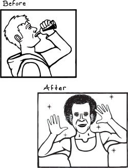

Chapter 8


# Writing Macros

When I was 18, I got a job as a night auditor at a hotel in Santa Fe, New Mexico, working four nights a week from 11 pm till 7 am. After a few months of this sleepless schedule, my emotions took on a life of their own. One night, at about

3 am, I was watching an infomercial for a product claiming to restore men's hair. As I watched the story of a formerly bald individual, I became overwhelmed with sincere joy. "At last!" my brain gushed. "This man has gotten the love and success he deserves! What an incredible product, giving hope to the hopeless!"

Since then I've found myself wondering if I could somehow re-create the emotional abandon and appreciation for life induced by chronic sleep deprivation. Some kind of potion, perhaps---a couple quaffs to unleash my inner Richard Simmons, but not for too long.

{.right}

Just as a potion would allow me to temporarily alter my fundamental nature, macros allow you to modify Clojure in ways that just aren't possible with other languages. With macros, you can extend Clojure to suit your problem space, building up the language.

In this chapter, you'll thoroughly examine how to write macros, starting with basic examples and moving up in complexity. You'll close by donning your make-believe cap and using macros to validate customer orders in your imaginary online potion store.

By the end of the chapter, you'll understand all the tools you'll use to write macros: quote, syntax quote, unquote, unquote splicing (aka the piñata tool), and gensym. You'll also learn about the dangers lying in wait for unsuspecting macro authors: double evaluation, variable capture, and macro infection.

## Macros Are Essential

Before you start writing macros, I want to help you put them in the proper context. Yes, macros are cooler than a polar bear's toenails, but you shouldn't think of macros as some esoteric tool you pull out when you feel like getting extra fancy with your code. In fact, macros allow Clojure to derive a lot of its built-in functionality from a tiny core of functions and special forms. Take `when`, for example. `when` has this general form:


```
(when boolean-expression
  expression-1
  expression-2
  expression-3
  ...
  expression-x)
```


You might think that `when` is a special form like `if`. Well guess what? It's not! In most other languages, you can only create conditional expressions using special keywords, and there's no way to create your own conditional operators. However, `when` is actually a macro.

In this macro expansion, you can see that `when` is implemented in terms of `if` and `do`:


```
(macroexpand '(when boolean-expression
                expression-1
                expression-2
                expression-3))
; => (if boolean-expression
       (do expression-1
           expression-2
           expression-3))
```


This shows that macros are an integral part of Clojure development---they're even used to provide fundamental operations.  Macros aren't reserved for exotic special cases; you should think of macro writing as just another tool in your tool satchel. As you learn to write your own macros, you'll see how they allow you to extend the language even further so that it fits the shape of your particular problem domain.

## Anatomy of a Macro

Macro definitions look much like function definitions. They have a name, an optional document string, an argument list, and a body. The body will almost always return a list. This makes sense because macros are a way of transforming a data structure into a form Clojure can evaluate, and Clojure uses lists to represent function calls, special form calls, and macro calls. You can use any function, macro, or special form within the macro body, and you call macros just like you would a function or special form.

As an example, here's our old friend the `infix` macro:


```
(defmacro infix
  "Use this macro when you pine for the notation of your childhood"
  [infixed]
  (list (second infixed) (first infixed) (last infixed)))
```


This macro rearranges a list into the correct order for infix notation.  Here's an example:


```
(infix (1 + 1))
; => 2
```


One key difference between functions and macros is that function arguments are fully evaluated before they're passed to the function, whereas macros receive arguments as unevaluated data. You can see this in the example. If you tried evaluating `(1 + 1)` on its own, you would get an exception. However, because you're making a macro call, the unevaluated list `(1 + 1)` is passed to `infix`. Then the macro can use `first`, `second`, and `last` to rearrange the list so Clojure can evaluate it:


```
(macroexpand '(infix (1 + 1)))
; => (+ 1 1)
```


By expanding the macro, you can see that `infix` rearranges `(1 + 1)` into `(+ 1 1)`. Handy!

You can also use argument destructuring in macro definitions, just like you can with functions:


```
(defmacro infix-2
  [[operand1 op operand2]]
  (list op operand1 operand2))
```


Destructuring arguments lets you succinctly bind values to symbols based on their position in a sequential argument. Here, `infix-2` takes a sequential data structure as an argument and destructures by position so the first value is named `operand1`, the second value is named `op`, and the third value is named `operand2` within the macro.

You can also create multiple-arity macros, and in fact the fundamental Boolean operations `and` and `or` are defined as macros. Here's `and`'s source code:


```
(defmacro and
  "Evaluates exprs one at a time, from left to right. If a form
  returns logical false (nil or false), and returns that value and
  doesn't evaluate any of the other expressions, otherwise it returns
  the value of the last expr. (and) returns true."
  {:added "1.0"}
  ([] true)
  ([x] x)
  ([x & next]
   `(let [and# ~x]
      (if and# (and ~@next) and#))))
```


There's a lot of stuff going on in this example, including the symbols `` ` `` and `~@`, which you'll learn about soon. What's important to realize for now is that there are three macro bodies here: a 0-arity macro body that always returns `true`, a 1-arity macro body that returns the operand, and an *n*-arity macro body that recursively calls itself.  That's right: macros can be recursive, and they also can use rest args (`& next` in the *n*-arity macro body), just like functions.

Now that you're comfortable with the anatomy of macros, it's time to strap yourself to your thinking mast Odysseus-style and learn to write macro bodies.

## Building Lists for Evaluation

Macro writing is all about building a list for Clojure to evaluate, and it requires a kind of inversion to your normal way of thinking. For one, you'll often need to quote expressions to get unevaluated data structures in your final list (we'll get back to that in a moment). More generally, you'll need to be extra careful about the difference between a *symbol* and its *value*.

### Distinguishing Symbols and Values

Say you want to create a macro that takes an expression and both prints and returns its value. (This differs from `println` in that `println` always returns `nil`.) You want your macro to return lists that look like this:


```
(let [result expression]
  (println result)
  result)
```


Your first version of the macro might look like this, using the `list` function to create the list that Clojure should evaluate:


```
 (defmacro my-print-whoopsie
  [expression]
  (list let [result expression]
        (list println result)
        result))
```


However, if you tried this, you'd get the exception `Can't take the value of a macro: #'clojure.core/let`. What's going on here?

The reason this happens is that your macro body tries to get the *value* that the *symbol* `let` refers to, whereas what you actually want to do is return the `let` symbol itself. There are other problems, too: you're trying to get the value of `result`, which is unbound, and you're trying to get the value of `println` instead of returning its symbol. Here's how you would write the macro to do what you want:


```
(defmacro my-print
  [expression]
  (list 'let ['result expression]
        (list 'println 'result)
        'result))
```


Here, you're quoting each symbol you want to use as a symbol by prefixing it with the single quote character, `'`. This tells Clojure to *turn off* evaluation for whatever follows, in this case preventing Clojure from trying to resolve the symbols and instead just returning the symbols. The ability to use quoting to turn off evaluation is central to writing macros, so let's give the topic its own section.

### Simple Quoting

You'll almost always use quoting within your macros to obtain an unevaluated symbol. Let's go through a brief refresher on quoting and then see how you might use it in a macro.

First, here's a simple function call with no quoting:


```
(+ 1 2)
; => 3
```


If we add `quote` at the beginning, it returns an unevaluated data structure:


```
(quote (+ 1 2))
; => (+ 1 2) 
```


Here in the returned list, `+` is a symbol. If we evaluate this plus symbol, it yields the plus function:


```
+
; => #<core$_PLUS_ clojure.core$_PLUS_@47b36583>
```


Whereas if we quote the plus symbol, it just yields the plus symbol:


```
(quote +)
; => +
```


Evaluating an unbound symbol raises an exception:


```
sweating-to-the-oldies
; => Unable to resolve symbol: sweating-to-the-oldies in this context
```


But quoting the symbol returns a symbol regardless of whether the symbol has a value associated with it:


```
(quote sweating-to-the-oldies)
; => sweating-to-the-oldies
```


The single quote character is a reader macro for `(quote `[x]{.LiteralItal}`)`:


```
'(+ 1 2)
; => (+ 1 2)

'dr-jekyll-and-richard-simmons
; => dr-jekyll-and-richard-simmons
```


You can see quoting at work in the `when` macro. This is `when`[']{.Default-Paragraph-Font}s actual source code:


```
(defmacro when
  "Evaluates test. If logical true, evaluates body in an implicit do."
  {:added "1.0"}
  [test & body]
  (list 'if test (cons 'do body)))
```


Notice that the macro definition quotes both `if` and `do`. That's because you want these symbols to be in the final list that `when` returns for evaluation. Here's an example of what that returned list might look like:


```
(macroexpand '(when (the-cows-come :home)
                (call me :pappy)
                (slap me :silly)))
; => (if (the-cows-come :home)
       (do (call me :pappy)
           (slap me :silly)))
```


Here's another example of source code for a built-in macro, this time for `unless`:


```
(defmacro unless
  "Inverted 'if'"
  [test & branches]
  (conj (reverse branches) test 'if))
```


Again, you have to quote `if` because you want the unevaluated symbol to be placed in the resulting list, like this one:


```
(macroexpand '(unless (done-been slapped? me)
                      (slap me :silly)
                      (say "I reckon that'll learn me")))
; => (if (done-been slapped? me)
       (say "I reckon that'll learn me")
       (slap me :silly))
```


In many cases, you'll use simple quoting like this when writing macros, but most often you'll use the more powerful syntax quote.

### Syntax Quoting

So far, you've seen macros that build up lists by using the `list` function to create a list along with `'` (quote), and functions that operate on lists like `first`, `second`, `last`, and so on. Indeed, you could write macros that way until the cows come home. Sometimes, though, it leads to tedious and verbose code.

Syntax quoting returns unevaluated data structures, similar to normal quoting. However, there are two important differences. One difference is that syntax quoting will return the *fully qualified* symbols (that is, with the symbol's namespace included). Let's compare quoting and syntax quoting.

Quoting does not include a namespace if your code doesn't include a namespace:


```
'+
; => +
```


Write out the namespace, and it'll be returned by normal quote:


```
'clojure.core/+
; => clojure.core/+
```


Syntax quoting will always include the symbol's full namespace:


```
`+
; => clojure.core/+
```


Quoting a list recursively quotes all the elements:


```
'(+ 1 2)
; => (+ 1 2)
```


Syntax quoting a list recursively syntax quotes all the elements:


```
`(+ 1 2)
; => (clojure.core/+ 1 2)
```


The reason syntax quotes include the namespace is to help you avoid name collisions, a topic covered in Chapter 6.

The other difference between quoting and syntax quoting is that the latter allows you to *unquote* forms using the tilde, `~`. It's kind of like kryptonite in that way: whenever Superman is around kryptonite, his powers disappear. Whenever a tilde appears within a syntax-quoted form, the syntax quote's power to return unevaluated, fully namespaced forms disappears. Here's an example:


```
`(+ 1 ~(inc 1))
; => (clojure.core/+ 1 2)
```


Because it comes after the tilde, `(inc 1) `is evaluated instead of being quoted. Without the unquote, syntax quoting returns the unevaluated form with fully qualified symbols:


```
`(+ 1 (inc 1))
; => (clojure.core/+ 1 (clojure.core/inc 1))
```


If you're familiar with string interpolation, you can think of syntax quoting/unquoting similarly. In both cases, you're creating a kind of template, placing a few variables within a larger, static structure. For example, in Ruby you can create the string `"Churn your butter, Jebediah!"` through concatenation:


```
name = "Jebediah"
"Churn your butter, " + name + "!"
```


or through interpolation:


```
"Churn your butter, #{name}!"
```


In the same way that string interpolation leads to clearer and more concise code, syntax quoting and unquoting allow you to create lists more clearly and concisely. Compare using the `list` function, shown first, with using syntax quoting:


```
(list '+ 1 (inc 1))
; => (+ 1 2)

`(+ 1 ~(inc 1))
; => (clojure.core/+ 1 2)
```


As you can see, the syntax-quote version is more concise. Also, its visual form is closer to the final form of the list, making it easier to understand.

## Using Syntax Quoting in a Macro

Now that you have a good handle on how syntax quoting works, take a look at the `code-critic` macro. You're going to write a more concise version using syntax quoting.


```
(defmacro code-critic
  "Phrases are courtesy Hermes Conrad from Futurama"
  [bad good]
  (list 'do
        (list 'println
              "Great squid of Madrid, this is bad code:"
              (list 'quote bad))
        (list 'println
              "Sweet gorilla of Manila, this is good code:"
              (list 'quote good))))

(code-critic (1 + 1) (+ 1 1))
; => Great squid of Madrid, this is bad code: (1 + 1)
; => Sweet gorilla of Manila, this is good code: (+ 1 1)
```


Just looking at all those tedious repetitions of `list` and single quotes makes me cringe. But if you rewrite `code-critic` using syntax quoting, you can make it sleek and concise:


```
(defmacro code-critic
  "Phrases are courtesy Hermes Conrad from Futurama"
  [bad good]
  `(do (println "Great squid of Madrid, this is bad code:"
                (quote ~bad))
       (println "Sweet gorilla of Manila, this is good code:"
                (quote ~good))))
```


In this case, you want to quote everything except for the symbols `good` and `bad`. In the original version, you have to quote each piece individ­ually and explicitly place it in a list in an unwieldy fashion, just to prevent those two symbols from being quoted. With syntax quoting, you can just wrap the entire `do` expression in a quote and simply unquote the two symbols that you want to evaluate.

And thus concludes the introduction to the mechanics of writing a macro!  Sweet sacred boa of Western and Eastern Samoa, that was a lot!

To sum up, macros receive unevaluated, arbitrary data structures as arguments and return data structures that Clojure evaluates. When defining your macro, you can use argument destructuring just like you can with functions and `let` bindings. You can also write multiple-arity and recursive macros.

Most of the time, your macros will return lists. You can build up the list to be returned by using `list` functions or by using syntax quoting. Syntax quoting usually leads to code that's clearer and more concise because it lets you create a template of the data structure you want to return that's easier to parse visually. Whether you use syntax quoting or plain quoting, it's important to be clear about the distinction between a symbol and the value it evaluates to when building up your list. And if you want your macro to return multiple forms for Clojure to evaluate, make sure to wrap them in a `do`.

## Refactoring a Macro and Unquote Splicing

That `code-critic` macro in the preceding section could still use some improvement. Look at the duplication! The two `println` calls are nearly identical. Let's clean that up. First, let's create a function to generate those `println` lists. Functions are easier to think about and play with than macros, so it's often a good idea to move macro guts to helper functions:


```
(defn criticize-code
  [criticism code]
  `(println ~criticism (quote ~code)))

(defmacro code-critic
  [bad good]
  `(do ~(criticize-code "Cursed bacteria of Liberia, this is bad code:" bad)
       ~(criticize-code "Sweet sacred boa of Western and Eastern Samoa, this is good code:" good)))
```


Notice how the `criticize-code` function returns a syntax-quoted list.  This is how you build up the list that the macro will return.

There's more room for improvement, though. The code still has multiple, nearly identical calls to a function. In a situation like this where you want to apply the same function to a collection of values, it makes sense to use a seq function like `map`:


```
(defmacro code-critic
  [bad good]
  `(do ~(map #(apply criticize-code %)
             [["Great squid of Madrid, this is bad code:" bad]
              ["Sweet gorilla of Manila, this is good code:" good]])))
```


This is looking a little better. You're mapping over each criticism/code pair and applying the `criticize-code `function to the pair. Let's try to run the code:


```
(code-critic (1 + 1) (+ 1 1))
; => NullPointerException
```


Oh no! That didn't work at all! What happened? The problem is that `map` returns a list, and in this case, it returned a list of `println` expressions. We just want the result of each `println` call, but instead, this code sticks both results in a list and then tries to evaluate that list.

In other words, as it's evaluating this code, Clojure gets to something like this:


```
(do
 ((clojure.core/println "criticism" '(1 + 1))
  (clojure.core/println "criticism" '(+ 1 1))))
```


then evaluates the first `println` call to give us this:


```
(do
 (nil
  (clojure.core/println "criticism" '(+ 1 1))))
```


and after evaluating the second `println` call, does this:


```
(do
 (nil nil))
```


This is the cause of the exception. `println` evaluates to `nil`, so we end up with something like `(nil nil)`. `nil` isn't callable, and we get a `NullPointerException`.

What an inconvenience! But as it happens, unquote splicing was invented precisely to handle this kind of situation. Unquote splicing is performed with `~@`. If you merely unquote a list, this is what you get:


```
`(+ ~(list 1 2 3))
; => (clojure.core/+ (1 2 3))
```


However, if you use unquote splicing, this is what you get:


```
`(+ ~@(list 1 2 3))
; => (clojure.core/+ 1 2 3)
```


Unquote splicing unwraps a seqable data structure, placing its contents directly within the enclosing syntax-quoted data structure. It's like the `~@` is a sledgehammer and whatever follows it is a piñata, and the result is the most terrifying and awesome party you've ever been to.

Anyway, if you use unquote splicing in your code critic, then everything will work great:


```
(defmacro code-critic
  [{:keys [good bad]}]
  `(do ~@(map #(apply criticize-code %)
              [["Sweet lion of Zion, this is bad code:" bad]
               ["Great cow of Moscow, this is good code:" good]])))

(code-critic (1 + 1) (+ 1 1))
; => Sweet lion of Zion, this is bad code: (1 + 1)
; => Great cow of Moscow, this is good code: (+ 1 1)
```


Woohoo! You've successfully extracted repetitive code into a function and made your macro code cleaner. Sweet guinea pig of Winnipeg, that is good code!

## Things to Watch Out For

Macros have a couple of sneaky gotchas that you should be aware of. In this section, you'll learn about some macro pitfalls and how to avoid them. I hope you haven't unstrapped yourself from your thinking mast.

### Variable Capture

*Variable capture* occurs when a macro introduces a binding that, unknown to the macro's user, eclipses an existing binding. For example, in the following code, a macro mischievously introduces its own `let` binding, and that messes with the code:


```
(def message "Good job!")
(defmacro with-mischief
  [& stuff-to-do]
  (concat (list 'let ['message "Oh, big deal!"])
          stuff-to-do))

(with-mischief
  (println "Here's how I feel about that thing you did: " message))
; => Here's how I feel about that thing you did: Oh, big deal!
```


The `println` call references the symbol `message`, which we think is bound to the string `"Good job!"`. However, the `with-mischief` macro has created a new binding for `message`.

Notice that this macro didn't use syntax quoting. Doing so would result in an exception:


```
(def message "Good job!")
(defmacro with-mischief
  [& stuff-to-do]
  `(let [message "Oh, big deal!"]
     ~@stuff-to-do))

(with-mischief
  (println "Here's how I feel about that thing you did: " message))
; Exception: Can't let qualified name: user/message
```


This exception is for your own good: syntax quoting is designed to prevent you from accidentally capturing variables within macros. If you want to introduce `let` bindings in your macro, you can use a *gensym*.  The `gensym` function produces unique symbols on each successive call:


```
(gensym)
; => G__655

(gensym)
; => G__658
```


You can also pass a symbol prefix:


```
(gensym 'message)
; => message4760

(gensym 'message)
; => message4763
```


Here's how you could rewrite `with-mischief` to be less mischievous:


```
(defmacro without-mischief
  [& stuff-to-do]
  (let [macro-message (gensym 'message)]
    `(let [~macro-message "Oh, big deal!"]
       ~@stuff-to-do
       (println "I still need to say: " ~macro-message))))

(without-mischief
  (println "Here's how I feel about that thing you did: " message))
; => Here's how I feel about that thing you did:  Good job!
; => I still need to say:  Oh, big deal! 
```


This example avoids variable capture by using `gensym` to create a new, unique symbol that then gets bound to `macro-message`. Within the syntax-quoted` let` expression, `macro-message` is unquoted, resolving to the gensym'd symbol. This gensym'd symbol is distinct from any symbols within `stuff-to-do`, so you avoid variable capture. Because this is such a common pattern, you can use an *auto-gensym*.  Auto-gensyms are more concise and convenient ways to use gensyms:


```
`(blarg# blarg#)
(blarg__2869__auto__ blarg__2869__auto__)

`(let [name# "Larry Potter"] name#)
; => (clojure.core/let [name__2872__auto__ "Larry Potter"] name__2872__auto__)
```


In this example, you create an auto-gensym by appending a hash mark (or *hashtag*, if you must insist) to a symbol within a syntax-quoted list.  Clojure automatically ensures that each instance of `x#` resolves to the same symbol within the same syntax-quoted list, that each instance of `y#` resolves similarly, and so on.

`gensym` and auto-gensym are both used all the time when writing macros, and they allow you to avoid variable capture.

### Double Evaluation

Another gotcha to watch out for when writing macros is *double evaluation*, which occurs when a form passed to a macro as an argument gets evaluated more than once. Consider the following:


```
(defmacro report
  [to-try]
  `(if ~to-try
     (println (quote ~to-try) "was successful:" ~to-try)
     (println (quote ~to-try) "was not successful:" ~to-try)))
     
;; Thread/sleep takes a number of milliseconds to sleep for
(report (do (Thread/sleep 1000) (+ 1 1)))
```


This code is meant to test its argument for truthiness. If the argument is truthy, it's considered successful; if it's falsey, it's unsuccessful. The macro prints whether or not its argument was successful. In this case, you would actually sleep for two seconds because `(Thread/sleep 1000)` gets evaluated twice: once right after `if` and again when `println` gets called. This happens because the code `(do (Thread/sleep 1000) (+ 1 1))` is repeated throughout the macro expansion. It's as if you'd written this:


```
(if (do (Thread/sleep 1000) (+ 1 1))
  (println '(do (Thread/sleep 1000) (+ 1 1))
           "was successful:"
           (do (Thread/sleep 1000) (+ 1 1)))
  
  (println '(do (Thread/sleep 1000) (+ 1 1))
           "was not successful:"
           (do (Thread/sleep 1000) (+ 1 1))))
```


"Big deal!" your inner example critic says. Well, if your code did something like transfer money between bank accounts, this would be a very big deal. Here's how you could avoid this problem:


```
(defmacro report
  [to-try]
  `(let [result# ~to-try]
     (if result#
       (println (quote ~to-try) "was successful:" result#)
       (println (quote ~to-try) "was not successful:" result#))))
```


By placing `to-try` in a `let` expression, you only evaluate that code once and bind the result to an auto-gensym'd symbol, `result#`, which you can now reference without reevaluating the `to-try` code.

### Macros All the Way Down

One subtle pitfall of using macros is that you can end up having to write more and more of them to get anything done. This is a consequence of the fact that macro expansion happens before evaluation.

For example, let's say you wanted to `doseq` using the `report` macro.  Instead of multiple calls to report:


```
(report (= 1 1))
; => (= 1 1) was successful: true

(report (= 1 2))
; => (= 1 2) was not successful: false
```


let's iterate:


```
(doseq [code ['(= 1 1) '(= 1 2)]]
  (report code))
; => code was successful: (= 1 1)
; => code was successful: (= 1 2)
```


The report macro works fine when we pass it functions individually, but when we use `doseq` to iterate `report` over multiple functions, it's a worthless failure. Here's what a macro expansion for one of the `doseq` iterations would look like:


```
(if
 code
 (clojure.core/println 'code "was successful:" code)
 (clojure.core/println 'code "was not successful:" code))
```


As you can see, `report` receives the unevaluated symbol `code` in each iteration; however, we want it to receive whatever `code` is bound to at evaluation time. But `report`, operating at macro expansion time, just can't access those values. It's like it has T. rex arms, with runtime values forever out of its reach.

To resolve this situation, we might write another macro, like this:


```
(defmacro doseq-macro
  [macroname & args]
  `(do
     ~@(map (fn [arg] (list macroname arg)) args)))

(doseq-macro report (= 1 1) (= 1 2))
; => (= 1 1) was successful: true
; => (= 1 2) was not successful: false
```


If you are ever in this situation, take some time to rethink your approach. It's easy to paint yourself into a corner, making it impossible to accomplish anything with run-of-the-mill function calls.  You'll be stuck having to write more macros instead. Macros are extremely powerful and awesome, and you shouldn't be afraid to use them.  They turn Clojure's facilities for working with data into facilities for creating new languages informed by your programming problems. For some programs, it's appropriate for your code to be like 90 percent macros.  As awesome as they are, they also add new composition challenges. They only really compose with each other, so by using them, you might be missing out on the other kinds of composition (functional, object-oriented) available to you in Clojure.

We've now covered all the mechanics of writing a macro. Pat yourself on the back! It's a pretty big deal!

To close out this chapter, it's finally time to put on your pretending cap and work on that online potion store I talked about at the very beginning of the chapter.

## Brews for the Brave and True

{.right}

At the beginning of this chapter, I revealed a dream: to find some kind of drinkable that, once ingested, would temporarily give me the power and temperament of an '80s fitness guru, freeing me from a prison of inhibition and self-awareness. I'm sure that someone somewhere will someday invent such an elixir, so we might as well get to work on a system for selling this mythical potion. Let's call this hypothetical concoction the *Brave and True Ale*. The name just came to me for no reason whatsoever.

Before the orders come *pouring* in (pun! high-five!), we'll need to have some validation in place. This section shows you a way to do this validation functionally and how to write the code that performs validations a bit more concisely using a macro you'll write called `if-valid`. This will help you understand a typical situation for writing your own macro. If you just want the macro definition, it's okay to skip ahead to `"`if-valid`" on page 182`.

### Validation Functions

To keep things simple, we'll just worry about validating the name and email for each order. For our store, I'm thinking we'll want to have those order details represented like this:


```
(def order-details
  {:name "Mitchard Blimmons"
   :email "mitchard.blimmonsgmail.com"})
```


This particular map has an invalid email address (it's missing the `@` symbol), so this is exactly the kind of order that our validation code should catch! Ideally, we want to write code that produces something like this:


```
(validate order-details order-details-validations)
; => {:email ["Your email address doesn't look like an email address."]}
```


That is, we want to be able to call a function, `validate`, with the data that needs validation and a definition for how to validate it. The result should be a map where each key corresponds to an invalid field, and each value is a vector of one or more validation messages for that field. The following two functions do the job.

Let's look at `order-details-validations` first. Here's how you could represent validations:


```
(def order-details-validations
  {:name
   ["Please enter a name" not-empty]

   :email
   ["Please enter an email address" not-empty

    "Your email address doesn't look like an email address"
    #(or (empty? %) (re-seq #"@" %))]})
```


This is a map where each key is associated with a vector of error message and validating function pairs. For example, `:name` has one validating function, `not-empty`; if that validation fails, you should get the `"Please enter a name"` error message.

Next, we need to write out the `validate` function. The `validate` function can be decomposed into two functions: one to apply validations to a single field and another to accumulate those error messages into a final map of error messages like `{:email ["Your email address doesn't look like an email address."]}`.  Here's a function called `error-messages-for` that applies validations to a single value:


```
(defn error-messages-for
  "Return a seq of error messages"
  [to-validate message-validator-pairs]
  (map first (filter #(not ((second %) to-validate))
                     (partition 2 message-validator-pairs))))
```


The first argument, `to-validate`, is the field you want to validate.  The second argument, `message-validator-pairs`, should be a seq with an even number of elements. This seq gets grouped into pairs with `(partition 2 message-validator-pairs)`. The first element of the pair should be an error message, and the second element of the pair should be a function (just like the pairs are arranged in `order-details-validations`). The `error-messages-for` function works by filtering out all error message and validation pairs where the validation function returns `true` when applied to `to-validate`. It then uses `map first` to get the first element of each pair, the error message. Here it is in action:


```
(error-messages-for "" ["Please enter a name" not-empty])
; => ("Please enter a name")
```


Now we need to accumulate these error messages in a map.

Here's the complete `validate` function, as well as the output when we apply it to our `order-details` and `order-details-validations`:


```
(defn validate
  "Returns a map with a vector of errors for each key"
  [to-validate validations]
  (reduce (fn [errors validation]
            (let [[fieldname validation-check-groups] validation
                  value (get to-validate fieldname)
                  error-messages (error-messages-for value validation-check-groups)]
              (if (empty? error-messages)
                errors
                (assoc errors fieldname error-messages))))
          {}
          validations))

(validate order-details order-details-validations)
; => {:email ("Your email address doesn't look like an email address")}
```


Success! This works by reducing over `order-details-validations` and associating the error messages (if there are any) for each key of `order-details` into a final map of error messages.

### if-valid

With our validation code in place, we can now validate records to our hearts' content! Most often, validation will look something like this:


```
(let [errors (validate order-details order-details-validations)]
  (if (empty? errors)
    (println :success)
    (println :failure errors)))
```


The pattern is to do the following:

1.  Validate a record and bind the result to `errors`
2.  Check whether there were any errors
3.  If there were, do the success thing, here `(println :success)`
4.  Otherwise, do the failure thing, here `(println :failure errors)`

I've actually used this validation code in real production websites. At first, I found myself repeating minor variations of the code over and over, a sure sign that I needed to introduce an abstraction that would hide the repetitive parts: applying the `validate` function, binding the result to some symbol, and checking whether the result is empty. To create this abstraction, you might be tempted to write a function like this:


```
(defn if-valid
  [record validations success-code failure-code]
  (let [errors (validate record validations)]
    (if (empty? errors)
      success-code
      failure-code)))
```


However, this wouldn't work, because `success-code` and `failure-code` would get evaluated each time. A macro would work because macros let you control evaluation. Here's how you'd use the macro:


```
(if-valid order-details order-details-validations errors
 (render :success)
 (render :failure errors))
```


This macro hides the repetitive details and helps you express your intention more succinctly. It's like asking someone to give you the bottle opener instead of saying, "Please give me the manual device for removing the temporary sealant from a glass container of liquid." Here's the implementation:


```
(defmacro if-valid
  "Handle validation more concisely"
  [to-validate validations errors-name & then-else]
  `(let [~errors-name (validate ~to-validate ~validations)]
     (if (empty? ~errors-name)
       ~@then-else)))
```


This macro takes four arguments: `to-validate`, `validations`, `errors-name`, and the rest argument `then-else`. Using `errors-name` like this is a new strategy. We want to have access to the errors returned by the `validate` function within the `then-else` statements.  To do this, we tell the macro what symbol it should bind the result to.  The following macro expansion shows how this works:


```
 (macroexpand
 '(if-valid order-details order-details-validations my-error-name
            (println :success)
            (println :failure my-error-name)))
(let*
 [my-error-name (user/validate order-details order-details-validations)]
 (if (clojure.core/empty? my-error-name)
  (println :success)
  (println :failure my-error-name)))
```


The syntax quote abstracts the general form of the `let/validate/if `pattern you saw earlier. Then we use unquote splicing to unpack the `if` branches, which were packed into the `then-else` rest argument.

That's pretty simple! After all this talk about macros and going through their mechanics in such detail, I bet you were expecting something more complicated. Sorry, friend. If you're having a hard time coping with your disappointment, I know of a certain drink that will help.

## Summary

In this chapter, you learned how to write your own macros. Macros are defined very similarly to functions: they have arguments, a docstring, and a body. They can use argument destructuring and rest args, and they can be recursive. Your macros will almost always return lists. You'll sometimes use `list` and `seq` functions for simple macros, but most of the time you'll use the syntax quote, `\``, which lets you write macros using a safe template.

When you're writing macros, it's important to keep in mind the distinction between symbols and values: macros are expanded before code is evaluated and therefore don't have access to the results of evaluation. Double evaluation and variable capture are two other subtle traps for the unwary, but you can avoid them through the judicious use of `let` expressions and gensyms.

Macros are fun tools that allow you to code with fewer inhibitions. By letting you control evaluation, macros give you a degree of freedom and expression that other languages simply don't allow. Throughout your Clojure journey, you'll probably hear people cautioning you against their use, saying things like "Macros are evil" and "You should never use macros." Don't listen to these prudes---at least, not at first! Go out there and have a good time. That's the only way you'll learn the situations where it's appropriate to use macros. You'll come out the other side knowing how to use macros with skill and panache.

## Exercises

1.  Write the macro `when-valid` so that it behaves similarly to `when`.  Here is an example of calling it:

    ```
    (when-valid order-details order-details-validations
     (println "It's a success!")
     (render :success))
    ```

    When the data is valid, the `println` and `render` forms should be evaluated, and `when-valid` should return `nil` if the data is invalid.
2.  You saw that `and` is implemented as a macro. Implement `or` as a macro.
3.  In Chapter 5 you created a series of functions (`c-int`, `c-str`, `c-dex`) to read an RPG character's attributes. Write a macro that defines an arbitrary number of attribute-retrieving functions using one macro call. Here's how you would call it:

    ```
    (defattrs c-int :intelligence
              c-str :strength
              c-dex :dexterity)
    ```

