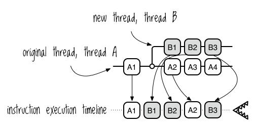
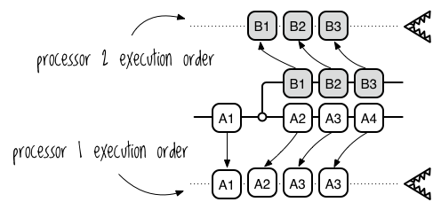
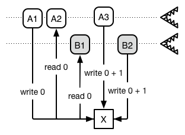
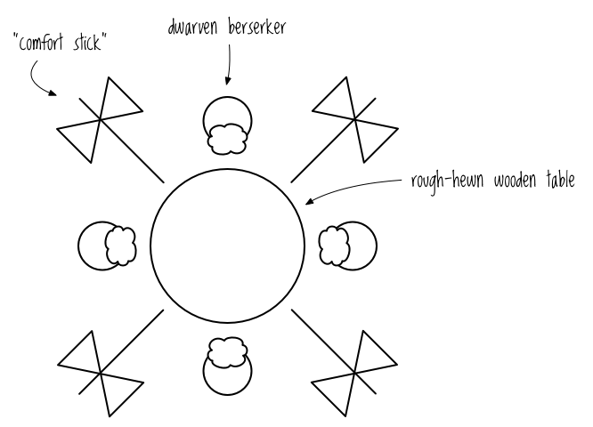
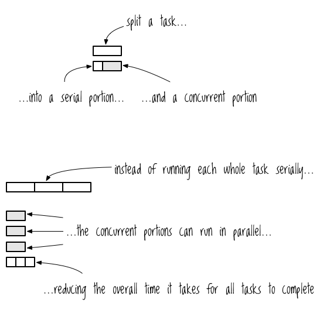

Chapter 9


# 並列・並行プログラミングの神技

もし私が荘園の領主で、あなたが私の跡取りだったら、13回目の名前の日にあなたを座らせて、こう言うでしょう。「コンピューターの世界は変わりつつあるんだ、お嬢さん。

「よく聞け。近年、CPUのクロックスピードはほとんど上がっていないが、デュアルコアやクアッドコアのコンピュータが一般的になってきた。物理法則は残酷で絶対的なものであり、クロックスピードを上げると指数関数的にパワーが必要になる。本場の優秀なエンジニアがこの限界を乗り越えることは、すぐにはできないだろう。したがって、1台のマシンのコア数が増えていく傾向は今後も続くでしょうし、プログラマは最新のハードウェアを最大限に活用する方法を知っていることが期待されます。

「この新しいパラダイムでプログラミングを学ぶことは、実に楽しく、魅力的なことです。しかし、注意しなければならないのは、危険も伴うということだ。同時に実行される複数のタスクを安全に管理するために、アプリケーションを構造化する神聖な技術である、「並列プログラミング」を学ばなければなりません。

「この技術については、まず並行処理と並列処理の概念の概要から学びます。次に、すべての開発者を悩ませる3つの悪魔、参照セル、相互排除、ドワーフのバーサーカーについて学びます。そして、あなたを助けてくれる3つの道具、「future」「promise」「delay」を学びます"。

そして、キーボードであなたの肩を叩いて、始める準備ができたことを知らせるのです。

## 並行処理と並列処理の概念

同時並行プログラミングには、ハードウェアからオペレーティングシステム、プログラミング言語ライブラリ、そしてあなたの心から湧き出るコードがエディタに載るまで、プログラム実行のあらゆるレベルで多くの厄介な詳細が関わっています。しかし、そのような細部に頭を悩ませる前に、このセクションでは、並行処理と並列処理にまつわるハイレベルな概念について説明したいと思います。

### 複数タスクの管理 vs. タスクの同時実行

*並行処理(concurrency)*とは、複数のタスクを同時に管理することです。 *タスク*は、単に「成し遂げなければならないこと」を意味し、ハードウェアやソフトウェアの実装に関することを意味するものではありません。レディー・ガガの「Telephone」という曲で、並行処理を説明することができます。ガガは歌います。

> I cannot text you with a drink in my hand, eh

ここでは、彼女は一つの仕事（飲むこと）しか管理できないと説明しています。彼女は、複数のタスクを管理できるという提案を真っ向から否定しています。 しかし、もし彼女がタスクを同時に処理しようと決めたら、彼女は歌うだろう。

> I will put down this drink to text you, then put my phone away and
> continue drinking, eh

この仮想世界では、レディー・ガガは飲酒とメールという2つの仕事をこなしています。しかし、彼女は同時に2つのタスクを実行しているわけではありません。 その代わりに、彼女は2つのタスクを切り替えている、つまり「インターリーブ」しているのです。ガガは、ある単語を入力した後、携帯電話を置き、飲み物を取って一口飲み、また携帯電話に戻って別の単語を入力することができます。

*並列処理(parallelism)*とは、複数のタスクを同時に実行することです。 もし、マダム・ガガが2つのタスクを同時に実行するとしたら、彼女は歌うだろう。

> I can text you with one hand while I use the other to drink, eh

並列性(parallelism)は並行性(concurrency)のサブクラスです。複数のタスクを同時に実行する前に、まず複数のタスクを管理する必要があります。

Clojureには、簡単に並列性を実現できる機能がたくさんあります。 レディガガシステムは複数の手で同時にタスクを実行することで並列性を実現していますが、コンピュータシステムは一般に複数のプロセッサで同時にタスクを実行することで並列性を実現します。

ここで重要なのは、並列性と*分散性*を区別することです。 分散コンピューティングとは、並列コンピューティングの特殊版で、プロセッサが異なるコンピュータにあり、タスクがネットワーク上のコンピュータに分散されるものです。レディ・ガガがビヨンセに "私が飲んでいる間、この人にメールを送ってください "と頼むようなものでしょう。Clojureでもライブラリを使えば分散プログラミングは可能ですが、本書では並列プログラミングのみを扱っており、ここでは同居するプロセッサのみを指して*並列*を使用することにします。もし分散プログラミングに興味があるなら、Kyle Kingsburyの*Call Me Maybe*シリーズを*https://aphyr.com/*でチェックしてみてください。

### ブロッキングと非同期タスク

並行(concurrent)プログラミングの主要な使用例の1つは、*ブロック化*された操作です。ブロッキングとは、単に操作が終了するのを待つことです。ファイルの読み込みやHTTPリクエストの終了待ちなど、I/O操作に関連して使われることが多いようです。レディー・ガガの例で検証してみましょう。

レディー・ガガが相手にメールを送った後、携帯電話を手に持って立ち止まり、返事を待つ間、何も飲まずに画面を見つめているとしたら、「次のテキストメッセージを読む」操作はブロックされ、これらのタスクは*同期*して実行されていると言えるでしょう。
その代わりに、携帯電話をしまい込んで、携帯電話が警告を発するまで飲むとします。
というタスクはブロックされていません。
タスクはブロックされないので、彼女はタスクを*非同期*に処理していると言えるでしょう。

### 並行(concurrent)プログラミングと並列(parallel)プログラミング

並行(concurrent)プログラミングと並列(parallel)プログラミングは、タスクを並列に実行できるサブタスクに分解し、プログラムが複数のタスクを同時に実行する際に発生するリスクを管理するための技術を指します。この章の残りの部分では、リスクはどちらもほぼ同じなので、この2つの用語を使い分けています。

これらのリスクをよりよく理解し、Clojureがどのようにそのリスクを回避するのに役立つか、Clojureで並行(concurrency)処理と並列(parallelism)処理がどのように実装されているかを見てみましょう。

## Clojureの実装。JVMスレッド

私は、コンピュータがどのようにタスク概念を実装するかも考慮せずに、一連の関連する操作を参照するために、抽象的な意味で*タスク*という用語を使用してきました。例えば、テキスト入力は一連の関連する操作からなるタスクで、飲み物を顔に注ぐ操作とは全く別物です。

Clojureでは、通常の、*連続した*コードを、一連のタスクと考えることができます。タスクは、JVM *スレッド*に配置することで、同時に実行できることを示します。

### スレッドって何？

と聞かれると、嬉しいですね スレッドとは、サブプログラムのことです。プログラムは多くのスレッドを持つことができ、各スレッドはプログラムの状態へのアクセスを共有しながら、独自の命令セットを実行する。


スレッド管理機能は、コンピュータの複数のレベルに存在することができます。例えば、オペレーティング・システムのカーネルは、一般的にスレッドを作成し、管理するためのシステムコールを提供します。JVMは、それ自身のプラットフォームに依存しないスレッド管理機能を提供し、ClojureプログラムはJVMで実行されるので、それらはJVMスレッドを使用します。JVMについては第12章で詳しく学びます。

スレッドは、一連の命令をつなぎ合わせた実際の物理的なスレッドの一部と考えることができます。私の中では、命令はマシュマロです。マシュマロは美味しいですから。プロセッサはこの命令を順番に実行していく。ワニはマシュマロが大好きなので、ワニが命令を食べるようなイメージです（本当です！）。つまり、プログラムの実行は、マシュマロの束が一列に並べられ、ワニがその列を移動しながら一つずつ食べていくようなものなのです。図9-1は、シングルコアプロセッサがシングルスレッドでプログラムを実行する場合のモデルです。


図 9-1：シングルスレッド・プログラムを実行するシングルコア・プロセッサー


スレッドは、タスクを同時に実行するために新しいスレッドを * 生成 * することができます。シングルプロセッサのシステムでは、プロセッサがスレッド間を行ったり来たりします（インターリーブ）。ここで、潜在的な並行処理の問題が発生する。プロセッサは各スレッドの命令を順番に実行しますが、スレッド間の切り替えをいつ行うかは保証されていません。

図9-2は、AとBという2つのスレッドと、それらの命令がどのように実行されるかを時系列で示したものである。スレッドBの命令は、スレッドAの命令と区別しやすいように影を付けています。




2つのスレッドを実行するシングルコアプロセッサ


これは命令の実行順序の1つに過ぎないことに注意してください。例えば、A1, A2, A3, B1, A4, B2, B3という順序で命令を実行することも可能でした。この場合、プログラムは「非決定論的」になってしまう。実行順序を知ることができないので、結果がどうなるかを事前に知ることができず、実行順序が異なれば結果も異なる可能性があるからです。

この例はインターリーブによるシングルプロセッサでの同時実行ですが、マルチコアシステムでは各コアにスレッドを割り当て、コンピュータが複数のスレッドを同時に実行できるようにします。 各コアは図9-3に示すように、そのスレッドの命令を順番に実行する。




2スレッド、2プロセッサ


シングルコアでのインターリーブと同様に、全体の実行順序が保証されないため、プログラムは非決定論的となる。2つ目のスレッドを追加すると、非決定論的なプログラムになり、3種類の問題の餌食になる可能性があります。

### 3人のゴブリン 参照セル、相互排他、ドワーフのバーサーカー

並行(concurrent)処理プログラミングには3つの中心的な課題があり、「*3つの並行処理ゴブリン*」とも呼ばれます。なぜこれらが怖いかというと、図9-3の画像のプログラムに表9-1の擬似命令が含まれていると想像してください。

1.  結果が非決定的なプログラムに対する命令

  ID   Instruction
  ---- -------------------
  A1   WRITE `X = 0`
  A2   READ `X`
  A3   WRITE `X = X + 1`
  B1   READ `X`
  B2   WRITE `X = X + 1`

もしプロセッサが A1, A2, A3, B1, B2 という順番に従うなら、 `X` の値は期待通り `2` となります。しかし、A1, A2, B1, A3, B2 の順番に従うと、図 9-4 でわかるように `X` の値は `1` になります。




参照セルと対話する2つのスレッド


これを *参照セル* 問題と呼ぶことにします（最初の Concurrency Goblin）。参照セル問題は、2つのスレッドが同じ場所を読み書きできて、その場所の値が読み書きの順序に依存する場合に発生します。

2番目のConcurrency Goblinは、*排他(mutual exclusion)*です。2つのスレッドが、それぞれファイルに呪文を書き込もうとしていると想像してください。ファイルへの排他的な書き込みアクセスを主張する方法がなければ、書き込み命令が交錯するため、呪文は文字化けしてしまいます。次の2つの呪文を考えてみてください。

> By the power invested in me by the state of California, I now pronounce you man and wife

> Thunder, lightning, wind, and rain, a delicious sandwich, I summon again

これらを排他制御せずにファイルに書き込むと、このようになる可能性があります。

> By the power invested in me by Thunder, lightning, wind, and rain, the state of California, I now pronounce you a delicious man sandwich, and wife I summon again

3つ目の並行処理ゴブリンは、私が「*ドワーフ・バーサーカー*問題（別名*デッドロック）」と呼ぶものです。4人のバーサーカーが荒削りの丸い木のテーブルを囲んでお互いを慰め合っていると想像してください。「自分が子供たちに対してよそよそしいのは分かっているが、どうやって子供たちとコミュニケーションを取ればいいのか分からない」と、一人が唸る。他の人たちはコーヒーを飲みながら、目じりにシワを寄せながら、なるほどと頷いている。

さて、誰もが知っているように、ドワーフのバーサーカーは、心地よいコーヒークラッチを終えるために、「慰めの棒」（両刃の戦斧）を手に取り、互いの背中を掻きむしるという儀式を行う。図9-5に示すように、ドワーフの各ペアの間に一本の戦斧が置かれる。

彼らの儀式は次のように進行する。

1.  左側の戦斧がある場合はそれを手に取る。
2.  可能であれば、*右*の戦斧を手に取る。
3.  "慰めの棒 "を力強く振って、隣人を慰める。
4.  両方の戦斧を離す。
5.  繰り返す。




ドワーフ・バーサーカーによる慰安用コーヒー・クラッチ


この儀式に従うと、すべてのドワーフの狂戦士が左の慰問棒を手に取り、右の慰問棒が使えるようになるのを待つ間、無限にブロックしてしまい、デッドロックになることが十分にあり得るのである。(ちなみに、この現象についてさらに調べたい場合は、通常*食事中の哲学者問題*と呼ばれますが、これはもっとつまらないシナリオです)。本書ではデッドロックについてあまり詳しく説明していませんが、その概念と用語を知っておくとよいでしょう。

並行(concurrent)処理プログラミングには魔物が潜んでいますが、適切なツールを使えば対処可能であり、楽しいものでさえあります。まずは正しいツールから見ていきましょう。

## Futures, Delays, and Promises

future、delay、promiseは並行(concurrent)プログラミングのための簡単で軽量なツールです。このセクションでは、それぞれがどのように機能するか、そして、参照セル並行処理ゴブリンと排他的相互処理並行処理ゴブリンを防御するためにそれらを一緒に使う方法について学びます。これらのツールはシンプルですが、並行処理のニーズを満たすのに大いに役立つことがおわかりいただけるでしょう。

これらのツールは、連続したコードで可能な以上の柔軟性を与えることによって、これを実現します。シリアルコードを書くときは、次の3つのイベントを束ねることになります。

- タスクの定義
- タスクの実行
- タスクの結果を要求する

例として、単純なAPIコールタスクを定義した仮想的なコードを見てみましょう。


```
(web-api/get :dwarven-beard-waxes)
```


Clojureはこのタスク定義に出会うと、すぐにそれを実行します。また、APIコールが終了するまでブロックして、結果を *今* 必要としています。並行(concurrent)プログラミングを学ぶことの一部は、これらの時系列の結合が必要でないときを識別することを学ぶことです。future、delay、promiseを使えば、タスクの定義、タスクの実行、結果の要求の3つを分離することができます。進め!

### Futures

Clojure では、*futures* を使ってタスクを定義し、結果をすぐに必要としない別のスレッドに配置することができます。未来は `future` マクロで作ることができます。REPLで試してみてください。


```
(future (Thread/sleep 4000)
        (println "I'll print after 4 seconds"))
(println "I'll print immediately")
```


`Thread/sleep` は現在のスレッドに、指定されたミリ秒の間、何もしないでじっとしているように指示します。通常、REPL で `Thread/sleep` を評価した場合、REPL のスリープが終了するまで他のステートメントを評価することができません; REPL を実行しているスレッドはブロックされます。しかし、 `future` は新しいスレッドを作成し、 `Thread/sleep` を含む、渡した各式を新しいスレッドに配置し、REPL のスレッドをブロックされずに実行することを可能にします。

future を使って、タスクを別のスレッドで実行し、そのことを忘れることもできますが、タスクの結果を使いたいことも多いでしょう。`future` 関数は、結果を要求するために使用できる参照値を返します。この参照はクリーニング屋さんがくれるチケットのようなもので、いつでもこれを使ってきれいなドレスを要求することができますが、ドレスがまだきれいでない場合は待つ必要があります。同じように、参照値を使って未来の結果を要求することができますが、未来が結果の計算を終えていなければ、待たされることになります。

未来の結果を要求することを *dereferencing* と呼び、 `deref` 関数か `@` リーダーマクロを使って行います。未来の結果の値は、そのボディで最後に評価された式の値です。future のボディは一度だけ実行され、その値はキャッシュされます。 次のようにしてみてください。


```
(let [result (future (println "this prints once")
                     (+ 1 1))]
  (println "deref: " (deref result))
  (println "@: " @result))
; => "this prints once"
; => deref: 2
; => @: 2
```


文字列 `"this prints once"` は、future を二度参照しても、実際には一度しか表示されないことに注意してください。これは、future のボディが一度だけ実行され、その結果である `2` がキャッシュされたことを示しています。

future の参照は、future の実行が終了していない場合は次のようにブロックされます。


```
(let [result (future (Thread/sleep 3000)
                     (+ 1 1))]
  (println "The result is: " @result)
  (println "It will be at least 3 seconds before I print"))
; => The result is: 2
; => It will be at least 3 seconds before I print
```


時には、futureを待つ時間に制限を設けたいことがあります。そのためには、 `deref` に待ち時間のミリ秒数を渡して、 `deref` がタイムアウトしたときに返す値を指定することができる。


```
(deref (future (Thread/sleep 1000) 0) 10 5)
; => 5
```


このコードは `deref` に、もし future が 10 ミリ秒以内に値を返さなかった場合は `5` という値を返すように指示しています。

最後に、 `realized?` を使って future が実行されたかどうかを確認することができます。


```
(realized? (future (Thread/sleep 1000)))
; => false

(let [f (future)]
  @f
  (realized? f))
; => true
```


futureは、プログラムに並行性を持たせるための非常にシンプルな方法です。

それ自体で、タスクを他のスレッドに振り分ける力を与え、プログラムをより効率的にすることができます。また、タスクの結果がいつ必要になるかを制御することで、プログラムをより柔軟に動作させることができます。

futureを参照することは、その結果が今すぐ必要であり、その結果が得られるまで評価を停止することを意味します。これが相互排他問題の解決にどのように役立つかは、すぐにわかるでしょう。また、結果を無視することもできます。例えば、futureを使ってログファイルに非同期で書き込むことができます。この場合、値を得るためにfutureを参照する必要はありません。

futuresが与えてくれる柔軟性は、とてもクールです。Clojureでは、タスクの定義と結果を要求することを、delayとpromiseで独立して扱うことも可能です。

### Delays

*delay* を使うと、タスクを実行したり、結果をすぐに要求したりすることなく、タスクを定義することができます。delayは、 `delay` を使って遅延を作成することができる。


```
(def jackson-5-delay
  (delay (let [message "Just call my name and I'll be there"]
           (println "First deref:" message)
           message)))
```


この例では、まだ `let` フォームを評価するように頼んでいないので、何も表示されません。delay を評価し、その結果を得るには、それをデリファレンスするか、 `force` を使用します。`force` は `deref` と同じように動作しますが、タスクの終了を待つのではなく、タスクを開始させるということをより明確に伝えることができます。


```
(force jackson-5-delay)
; => First deref: Just call my name and I'll be there
; => "Just call my name and I'll be there"
```


futureと同様、delayは一度だけ実行され、その結果はキャッシュされます。 それ以降のデリファレンスは、何も表示せずにJackson 5のメッセージを返します。


```
@jackson-5-delay
; => "Just call my name and I'll be there"
```


delayの使い方の1つは、関連するfutureのグループのうち、1つのfutureが終了した時点で文を発行することです。例えば、あなたのアプリが写真共有サイトに一連の写真をアップロードし、最初の写真がアップロードされるとすぐに所有者に通知する場合を考えてみましょう。


```
(def gimli-headshots ["serious.jpg" "fun.jpg" "playful.jpg"])
(defn email-user
  [email-address]
  (println "Sending headshot notification to" email-address))
(defn upload-document
  "Needs to be implemented"
  [headshot]
  true)
(let [notify (delay ➊(email-user "and-my-axe@gmail.com"))]
  (doseq [headshot gimli-headshots]
    (future (upload-document headshot)
            ➋(force notify))))
```


この例では、アップロードする写真のベクトル (`gimli-headshots`) と、2つの処理を実行するための関数 (`email-user` と `upload-document`) を定義しています。そして、 `let` を使って、 `notify` を delay にバインドします。delay のボディである `(email-user "and-my-axe@gmail.com")` ➊ は delay が作成された時点では評価されません。代わりに、 `doseq` フォームによって作成された future のいずれかが `(force notify)` ➋ を最初に評価したときに評価されます。`(force notify)` が3回評価されるとしても、 delay 本体は1回だけ評価されます。ギムリは最初の写真(headshot)がいつ使えるようになるかを知ることで、それを調整したり共有したりできるようになることに感謝することでしょう。また、彼はスパムを受けずに済むことに感謝し、あなたは彼のドワーフの怒りに直面せずに済むことに感謝することでしょう。

このテクニックは、排他的同時実行のゴブリン---一度に1つのスレッドだけが特定のリソースにアクセスできることを確認する問題---からあなたを保護するのに役立ちます。この例では、delayはメールサーバのリソースを保護します。delay の本体は一度だけ起動することが保証されているので、2 つのスレッドが同じメールを送信するような状況に陥ることはないでしょう。もちろん、どのスレッドも再びメールを送信するために delay を使うことはできません。しかし、この例のようなケースでは、完璧に機能します。

### Promises

*promise* を使うと、結果を生成するタスクやそのタスクがいつ実行されるかを定義することなく、結果を期待することを表現することができます。 `promise` を使って promise を作成し、 `deliver` を使って promise に結果を渡します。結果はデリファレンスで取得します。


```
(def my-promise (promise))
(deliver my-promise (+ 1 2))
@my-promise
; => 3
```


ここでは，まず promise を作成し，それに値を渡す．最後に、promiseをデリファレンスすることで、値を取得します。デリファレンスは結果を期待することを表現する方法です。もし、最初に値を送らずに `my-promise` をデリファレンスしようとすると、futureやdelayと同じように、プログラムはpromiseが送られるまでブロックされます。promiseに結果を渡すことができるのは一度だけです。

promiseの1つの使い方は，データの集まりの中で最初に満足のいく要素を見つけることです．例えば、オウムの鳴き声をジェームズ・アール・ジョーンズにするための材料を集めているとします。ジェームズ・アール・ジョーンズの声はこの世で最も滑らかなので、材料の1つは滑らかさの評価が97以上のプレミアムヤクバターです。予算は1ポンドで100ドル。

あなたは現代の魔術・オーニソロジーの実践者であり、ヤクバターの販売サイトをひとつひとつ見て回るよりも、あなたのニーズを満たす最初のヤクバターのURLを教えてくれるスクリプトを作成するのです。

以下のコードでは、いくつかのヤクバターの製品を定義し、APIコールを模擬する関数を作成し、製品が満足できるものかどうかをテストする別の関数を作成しています。


```
(def yak-butter-international
  {:store "Yak Butter International"
    :price 90
    :smoothness 90})
(def butter-than-nothing
  {:store "Butter Than Nothing"
   :price 150
   :smoothness 83})
;; This is the butter that meets our requirements
(def baby-got-yak
  {:store "Baby Got Yak"
   :price 94
   :smoothness 99})

(defn mock-api-call
  [result]
  (Thread/sleep 1000)
  result)

(defn satisfactory?
  "If the butter meets our criteria, return the butter, else return false"
  [butter]
  (and (<= (:price butter) 100)
       (>= (:smoothness butter) 97)
       butter))
```


このAPIコールは、実際の呼び出しにかかる時間をシミュレートするために、結果を返す前に1秒待機します。

同期的にサイトをチェックするのにかかる時間を示すために、 `some` を使ってコレクションの各要素に `satisfactory?` 関数を適用して、最初に真となる結果を返すか、何もなければ nil を返すことにします。 各サイトを同期的にチェックする場合、以下のコードが示すように、結果を得るために1サイトあたり1秒以上かかることがあります。


```
(time (some (comp satisfactory? mock-api-call)
            [yak-butter-international butter-than-nothing baby-got-yak]))
; => "Elapsed time: 3002.132 msecs"
; => {:store "Baby Got Yak", :smoothness 99, :price 94}
```


ここでは、 `comp` を使って関数の合成を行い、 `time` を使ってフォームの評価にかかった時間を表示しています。プロミスとフューチャーを使えば、各チェックを別々のスレッドで実行することができる。もし、あなたのコンピューターがマルチコアであれば、この方法で1秒程度に短縮できるかもしれません。


```
(time
 (let [butter-promise (promise)]
   (doseq [butter [yak-butter-international butter-than-nothing baby-got-yak]]
     (future (if-let [satisfactory-butter (satisfactory? (mock-api-call butter))]
               (deliver butter-promise satisfactory-butter))))
   (println "And the winner is:" @butter-promise)))
; => "Elapsed time: 1002.652 msecs"
; => And the winner is: {:store Baby Got Yak, :smoothness 99, :price 94}
```


この例では、まず `butter-promise` という名前のpromiseを作り、そのpromiseにアクセスできるfutureを3つ作ります。各 future のタスクはヤクバターサイトを評価し、満足できるものであればそのサイトのデータを promise に渡すことです。最後に `butter-promise` をデリファレンスして、サイトのデータが配送されるまでプログラムがブロックされるようにします。これはサイトの評価が並行して行われるためで、3秒ではなく1秒程度で終わります。結果の要求と実際の計算方法を切り離すことで、複数の計算を並行して行うことができ、時間を節約することができます。

これは、参照セル Concurrency Goblin から身を守る方法と見ることができます。promiseは一度しか書き込めないので、不確定な読み書きに起因するような矛盾した状態を防ぐことができます。

ヤクバターのどれもが満足のいくものでなかった場合はどうなるのか、疑問に思うかもしれません。もしそうなったら、デリファレンスは永遠にブロックされ、スレッドを縛り付けることになる。それを避けるために、タイムアウトを入れることができる。


```
(let [p (promise)]
  (deref p 100 "timed out"))
```


これは promise である `p` を生成し、それをデリファレンスしようとするものである。100という数字は `deref` に100ミリ秒待つように指示し、それまでに値がなければタイムアウト値である `"timed out"` を使用するように指示している。

最後に、promiseを使ってコールバックを登録することで、JavaScriptでおなじみの機能を実現することができることを述べておきます。JavaScriptのコールバックは、他のコードが終了したら非同期で実行されるべきコードを定義する方法です。Clojureでそれを行う方法は以下の通りです。


```
(let [ferengi-wisdom-promise (promise)]
  (future (println "Here's some Ferengi wisdom:" @ferengi-wisdom-promise))
  (Thread/sleep 100)
  (deliver ferengi-wisdom-promise "Whisper your way to success."))
; => Here's some Ferengi wisdom: Whisper your way to success.
```


この例では、すぐに実行を開始する future を作成しています。 しかし、future のスレッドは `ferengi-wisdom-promise` に値が届くのを待っているため、ブロックしています。100ミリ秒後に値を渡すと、futureの中の `println` ステートメントが実行されます。

future、delay、promiseはアプリケーションの並行処理を管理するための、シンプルで素晴らしい方法です。次のセクションでは、並行アプリケーションを制御するためのもう一つの楽しい方法を見ていきます。

### あなた自身のキューを制御する

これまで、future、delay、promise を組み合わせて、同時実行プログラムを少し安全にする簡単な方法をいくつか見てきました。このセクションでは、マクロを使ってfutureとpromiseを少し複雑な方法で組み合わせます。このコードは必ずしも使う必要はないかもしれませんが、このささやかなツールの力をもう少し見せてくれるでしょう。このマクロでは、実行時の論理とマクロ展開の論理を同時に頭の中に入れて、何が起こっているのかを理解することが必要です。

3つの並行(concurrency)処理ゴブリンに共通する特徴は、タスクが共有リソース（変数、プリンタ、ドワーフの戦斧）に非協調的に同時にアクセスすることです。もし、一度に1つのタスクだけがリソースにアクセスすることを確実にしたいなら、タスクのリソースアクセス部分を、連続的に実行されるキューに配置すればよいのです。ケーキを作るようなものです。あなたと友人は別々に材料（卵、小麦粉、イモリの目など）を取り出すことができますが、いくつかのステップは連続して実行する必要があります。オーブンに入れる前に、生地を準備しなければならないのだ。図 9-6 は、この戦略を示しています。




タスクを直列処理部分と並列処理部分に分けることで、安全にコードを効率化することができます。

キューイングマクロを実装するには、キューを発明した英国人に敬意を表することになります。キューを使うことで、イギリス人の習慣的な挨拶である「Ello, gov'na! Pip pip! Cheerio」（こんにちは）を正しい順番で伝えることができます。このデモでは大量の `sleep` を使用しますので、より簡潔に行うためのマクロを紹介します。


```
(defmacro wait
  "Sleep `timeout` seconds before evaluating body"
  [timeout & body]
  `(do (Thread/sleep ~timeout) ~@body))
```


このコードが行うことは、あなたが与えたどんなフォームでも受け取り、その前に `Thread/sleep` の呼び出しを挿入し、すべてを `do` で包むだけです。

リスト9-1のコードでは、タスクを並行処理部分と直列処理部分に分割しています。


```
(let [saying3 (promise)]
  (future (deliver saying3 (wait 100 "Cheerio!")))
  @(let [saying2 (promise)]
     (future (deliver saying2 (wait 400 "Pip pip!")))
➊      @(let [saying1 (promise)]
        (future (deliver saying1 (wait 200 "'Ello, gov'na!")))
        (println @saying1)
        saying1)
     (println @saying2)
     saying2)
  (println @saying3)
  saying3)
```


1.  9-1. `enqueue` マクロ呼び出しの展開

全体的な戦略は、各タスク（この場合、挨拶の一部を出力する）に対してpromiseを作成し、promiseに対して同時に計算された値を配信する対応するfutureを作成することです。これにより、どのpromiseもデリファレンスされる前にすべてのfutureが作成され、シリアライズされた部分が正しい順序で実行されることが保証されます。まず `saying1` の値が表示されます---`"'Ello, gov'na!"`-- 次に `saying2` の値、そして最後に `saying3` が表示されます。`let` ブロックで `saying1` を返し、 ➊ で `let` ブロックをデリファレンスすることで、コードが `saying2` に対して何かを行う前に `saying1` を完全に終了させることができ、このパターンは `saying2` と `saying3` でも同じように行われます。

`let` ブロックをデリファレンスするのは馬鹿馬鹿しいと思うかもしれませんが、そうすることでこのコードをマクロで抽象化することができるのです。なぜなら、前の例のようなコードを書くと、（イギリス人が言うように）頭がおかしくなりそうだからです。理想的には、リスト9-2で示されるようにマクロが動作することです。


```
(-> (enqueue ➊saying ➋(wait 200 "'Ello, gov'na!") ➌(println @saying))
   ➍(enqueue saying (wait 400 "Pip pip!") (println @saying))
    (enqueue saying (wait 100 "Cheerio!") (println @saying)))
```


1.  これは `enqueue` を使用する方法です。

このマクロでは、作成される promise に名前を付け➊、その promise を引き渡すための値をどのように導き出すかを定義し➋、その promise で何を行うかを定義します。このマクロは最初の引数として別の `enqueue` マクロ呼び出しを受け取ることもできますので、これをスレッド化することもできます➍。リスト9-3は `enqueue` マクロをどのように定義するかを示しています。`enqueue` を定義した後、リスト 9-2 のコードは、ネストされたすべての `let` 式を含むリスト 9-1 のコードに展開されます。


```
(defmacro enqueue
➊   ([q concurrent-promise-name concurrent serialized]
➋    `(let [~concurrent-promise-name (promise)]
      (future (deliver ~concurrent-promise-name ~concurrent))
➌       (deref ~q)
      ~serialized
      ~concurrent-promise-name))
➍   ([concurrent-promise-name concurrent serialized]
   `(enqueue (future) ~concurrent-promise-name ~concurrent ~serialized)))
```


1.  `enqueue` の実装

まず、このマクロがデフォルト値を提供するために 2 つのアリティを持っていることに注意してください。最初のアリティ ➊ は実際の作業が行われるところです。これはパラメータ `q` を持ちますが、2番目のアリティは持ちません。第2アリティ ➍ は `q` に値 `(future)` を与えて第1アリティを呼び出します。で、マクロはpromiseを作成するフォームを返し、その値をfutureで渡し、 `q` に与えられたフォームをデリファレンスし、シリアライズされたコードを評価し、最後にpromiseを返します。 `q` は通常、リスト9-2のように `enqueue` の別の呼び出しによって返される `let` 式をネストしたものになります。もし `q` に値が与えられなかったら、マクロは ➌ で `deref` が例外を引き起こさないように future を提供します。

さて、 `enqueue` マクロを書いたので、実行時間が短縮されるかどうか試してみましょう!


```
(time @(-> (enqueue saying (wait 200 "'Ello, gov'na!") (println @saying))
           (enqueue saying (wait 400 "Pip pip!") (println @saying))
           (enqueue saying (wait 100 "Cheerio!") (println @saying))))
; => 'Ello, gov'na!
; => Pip pip!
; => Cheerio!
; => "Elapsed time: 401.635 msecs"
```


「あっぱれ！」。挨拶は正しい順序で行われ、睡眠という「仕事」が同時進行で処理されていることが経過時間からわかります。

## まとめ

あなたのようなプログラマーにとって、並行処理(concurrent)や並列処理(parallel)プログラミングの技術を学ぶことは、最新のハードウェアで効率的に動作するプログラムを設計するために重要なことなのです。並行処理(concurrent)とは、プログラムが複数のタスクを実行する能力のことで、Clojureでは、タスクを別々のスレッドに配置することでこれを実現します。コンピュータが複数のCPUを持つ場合、プログラムは並列(parallel)に実行され、同時に複数のスレッドを実行することができます。

並行(concurrent)プログラミングは、参照セル、排他、デッドロックという3つの並行性リスクを管理するために使われるテクニックを指します。 Clojureは、これらのリスクを軽減するための3つの基本的なツール、future、delay、promiseを提供します。それぞれのツールは、タスクの定義、タスクの実行、タスクの結果の要求という3つのイベントを切り離すことができます。futureでは，タスクを定義してすぐに実行し，その結果を後で要求することも，決して要求しないこともできます．また、futureはその結果をキャッシュします。delayは、後で実行されないタスクを定義することができ、delayの結果はキャッシュされます。promiseは、結果を生成するタスクについて知ることなく、結果を要求することを表現することができます。promiseに値を渡すのは一度だけです。

次の章では、並行(concurrent)プログラミングの哲学的側面を探り、リスクを管理するためのより洗練されたツールについて学びます。

## 演習問題

1.  引数として文字列を受け取り、`slurp`関数を使ってBingとGoogleで検索する関数を書きなさい。あなたの関数は、検索によって返された最初のページの HTML を返すべきである。
2. 作成した関数を更新して、使用する検索エンジンからなる第二引数を取るようにします。
3.  検索語と検索エンジンを引数として取り、各検索エンジンの検索結果の最初のページの URL をベクトルで返す新しい関数を作成します。


