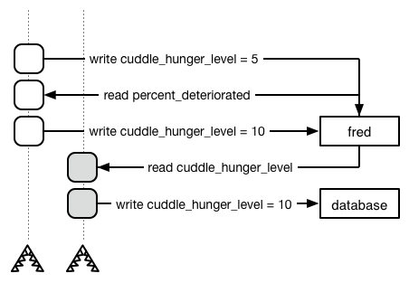
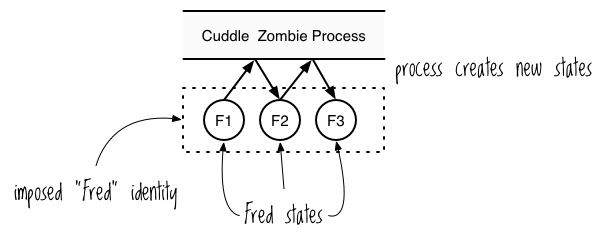

Chapter 10


# Clojureの形而上学。atom、ref、var、および抱きつきゾンビ

3つの並行(concurrency)処理ゴブリンはすべて同じ悪の穴から生み出されたものです。これは、第9章の参照セルに関する議論に見ることができます。2つのスレッドが協調せずに参照セルに変更を加えると、結果は予測不可能になります。

Rich Hickeyは、ミュータブルステートへの共有アクセスから発生する問題に特別に対処するためにClojureを設計しました。実際、Clojureは状態に関する非常に明確な概念を体現しており、ほとんどの一般的なプログラミング言語よりも本質的に並行(concurrency)処理を安全に行うことができます。それは、その*meta-freakin-physics*に至るまで安全です。

この章では、典型的なオブジェクト指向（OO）言語の形而上学と比較して、Clojureの基礎的な形而上学について学びます。 この哲学を学ぶことで、Clojureの残りの並行(concurrency)処理ツールである*atom*、*ref*、*var*参照型を扱うための準備ができます。 (Clojureには、さらに1つの参照型、*agents*がありますが、この本では扱いません)。これらの型はそれぞれ、状態を変更する操作を安全に同時に実行することを可能にします。また、状態を全く導入することなく、プログラムをより効率的にする簡単な方法についても学びます。

形而上学は、2つの基本的な質問に可能な限り広い意味で答えようとするものである。

- そこには何があるのか？
- それはどのようなものですか？

ClojureとOO言語の違いを引き出すために、抱きつきゾンビをモデル化する2つの異なる方法について説明します。通常のゾンビとは異なり、抱きつきゾンビはあなたの脳を食い尽くそうとはしません。それは、あなたをスプーンですくって、たぶんあなたの首の匂いを嗅ぎたいだけなのです。そのため、そのアンデッド、シャッフル、腐敗の状態は、より悲劇的なものとなっています。愛が欲しいだけなのに、どうして殺そうとするんだ？本当のモンスターは誰なんだ？

## オブジェクト指向の形而上学

OO形而上学では、抱きつきゾンビを世界に存在するオブジェクトとして扱います。このオブジェクトは時間とともに変化するプロパティを持ちますが、それでも単一の不変のオブジェクトとして扱われます。もしこれがゾンビの形而上学に対する全く明白で議論の余地のないアプローチのように思えるなら、おそらく哲学入門のクラスで椅子が存在することの意味や、そもそも何が椅子を椅子たらしめているのかについて何時間も議論したことがないのでしょうね。

厄介なのは、抱きつきゾンビが常に変化していることです。その身体は徐々に衰えていく。抱きつきたい欲求は、時間とともにますます強くなる。OO用語で言うと、抱きつきゾンビはMutable Stateを持つオブジェクトであり、その状態は常に変動していることになる。しかし、ゾンビがどんなに変化しても、私たちはそれを同じゾンビとして認識します。ここでは、Rubyで抱きつきゾンビをどのようにモデル化し、どのように対話するかについて説明します。


```
class CuddleZombie
  # attr_accessor is just a shorthand way for creating getters and
  # setters for the listed instance variables
  attr_accessor :cuddle_hunger_level, :percent_deteriorated

  def initialize(cuddle_hunger_level = 1, percent_deteriorated = 0)
    self.cuddle_hunger_level = cuddle_hunger_level
    self.percent_deteriorated = percent_deteriorated
  end
end

fred = CuddleZombie.new(2, 3)
fred.cuddle_hunger_level  # => 2
fred.percent_deteriorated # => 3

fred.cuddle_hunger_level = 3
fred.cuddle_hunger_level # => 3
```


1.  10-1. Ruby による抱きつきゾンビの動作のモデル化

この例では、抱きつきゾンビの `fred` を作成し、2つのアトリビュートを持つようにします。`cuddle_hunger_level` と `percent_deteriorated` です。`fred` は最初は `cuddle_hunger_level` が 2 だけですが、好きなように変更しても、古き良きフレッド、同じ抱っこゾンビのままです。この場合、`cuddle_hunger_level` を 3 に変更しました。


このオブジェクトは単なる空想の参照セルであることがわかるだろう。マルチスレッド環境では、同じように非決定的な結果に左右されます。例えば、2つのスレッドが `fred.cuddle_hunger_level = fred.cuddle_hunger_level + 1` のようにフレッドの空腹レベルを増加させようとすると、ちょうど "The Three Goblins" で `X` に書き込んだ2つのスレッドの例のように、増加分の1つが失われる可能性があります。193 ページの「3 つのゴブリン: 参照セル、排他的論理和、ドワーフの狂戦士」にある、 `X` に書き込む 2 つのスレッドの例と同じです。

別のスレッドで読み取りを行うだけであっても、プログラムは非決定的であることに変わりはありません。例えば、抱きつきゾンビの行動に関する研究をしているとします。ゾンビの空腹度が50%になったときにログを取りたいのですが、パフォーマンスを上げるためにリスト10-1のようなコードを使って、別のスレッドでこれを実行したいとします。


```
if fred.percent_deteriorated >= 50
  Thread.new { database_logger.log(fred.cuddle_hunger_level) }
end
```


1.  この Ruby のコードは同時実行には安全ではありません。

問題は、書き込みが実際に行われる前に、別のスレッドが `fred` を変更する可能性があることです。

例えば、図10-1は2つのスレッドが上から下に向かって実行されている様子を示しています。 この状況では、データベースに5を書き込むのが正しいのですが、代わりに10が書き込まれます。




図10-1：不整合な抱きつきゾンビのデータをログに残す


これは残念なことです。抱きつきゾンビの黙示録から回復しようとしているときに、データに一貫性がないのは困ります。 しかし、特定の瞬間のオブジェクトの状態を保持する方法はありません。

さらに、`cuddle_hunger_level` と `percent_deteriorated` を同時に変更するためには、特に注意しなければなりません。 なぜなら、別のスレッドが `fred` オブジェクトを `read` して、あなたが同時に変更しようとする2つの変更の間に、以下のように表示される可能性があるからです。


```
fred.cuddle_hunger_level = fred.cuddle_hunger_level + 1
# At this time, another thread could read fred's attributes and
# "perceive" fred in an inconsistent state unless you use a mutex
fred.percent_deteriorated = fred.percent_deteriorated + 1
```


これは相互排他問題の別バージョンです。オブジェクト指向プログラミング (OOP) では、*mutex* を使って手動でこの問題に対処することができます。これは、mutex の有効期間中は一度に一つのスレッドだけがリソース（この場合、`fred` オブジェクト）にアクセスできることを保証するものです。

オブジェクトが必ずしも安定していないという事実は、私たちがオブジェクトをプログラムの基本的な構成要素として扱うことを止めるものではありません。実際、これは OOP の長所と考えられています。状態がどのように変化しても、安定したインターフェースと対話すれば、すべてがその通りに動くのです。これは、私たちの直感的な感覚に合致しています。例えば、蝋の色が変わって、溶けて、敵の顔にかかったとしても、同じ蝋の物体だと思うでしょう。

また、OOPでは、オブジェクトは何かをするものです。オブジェクトは互いに作用し合い、プログラムの実行に伴って状態を変化させる。これも、私たちの直感的な感覚と同じで、オブジェクトが互いに作用し合うことで変化が生じます。例えば、PersonオブジェクトがDoorオブジェクトを押して、Houseオブジェクトの中に入っていく。

## Clojure 形而上学

Clojureの形而上学では、同じ抱きつきゾンビに2度出会うことはない、と言うでしょう。抱きつきゾンビは、その変異とは無関係に世界に存在する個別のものではありません：それは実際には*値*の連続です。

*値*という用語はClojuristによってよく使われますが、その具体的な意味は、あなたが慣れているものとは異なるかもしれません。値は、より大きなシステムの中で単一の分割不可能な単位または構成要素を形成するという意味で*原子*であり、不可分で、不変の、安定した実体である。数値は値である。15という数値が別の数値に変化することはありえない。15を足したり引いたりしても、15という数字が変わるわけではなく、別の数字になるだけです。Clojureのデータ構造もまた、不変なので値です。マップに対して `assoc` を使用する場合、元のマップを変更するのではなく、新しいマップを派生させます。

つまり、値は変化しませんが、値に *処理* を適用して新しい値を生成することができます。例えば、値*F1*から始めて、*F1*に*Cuddle Zombie*プロセスを適用して、値*F2*を生成するとします。そして、そのプロセスを値*F2*に適用して値*F3*を生成する、というように。

このことは、*同一性*の異なる概念につながる。OO形而上学のように変化するオブジェクトに固有のものとして同一性を理解するのではなく、Clojure形而上学は、時間の経過とともにプロセスによって生成される不変の値の連続に人間が押し付けるものとして同一性を解釈するのです。私たちはアイデンティティを指定するために*名前*を使用します。*Fred* という名前は、一連の個々の状態 *F1*, *F2*, *F3*, などに言及するのに便利な方法です。この観点からは、ミュータブルな状態というものは存在しない。 その代わり、状態とはある時点における同一性の値を意味する。

リッチ・ヒッキーは電話番号に例えて状態を説明している。 *アランの電話番号*は10回変わったが、我々は常にこれらの番号を同じ名前、*アランの電話番号*で呼ぶことにする。5年前のアランの電話番号と今日のアランの電話番号は異なる値であり、両者はアランの電話番号の同一性を示す2つの状態である。

これは、プログラムの中で、世界に関する情報を扱っていることを考えれば、納得がいく。情報が変わったと言うより、新しい情報を受け取ったと言うべきでしょう。金曜日の午後12時、抱きつきゾンビのフレッドは50％減衰した状態にありました。午後1時、彼は60％腐敗していました。これらは両方ともあなたが処理できる事実であり、新しい事実の導入は以前の事実を無効にするものではありません。フレッドの減衰が50%から60%に増加しても、午後12時に彼が50%の減衰状態であったことは依然として事実である。

図 10-2 は、値、プロセス、同一性、および状態をどのように可視化するかを示している。




図 10-2： 値、プロセス、同一性、状態


これらの値はお互いに作用しないし、変更することもできない。何もすることができない。変更は、a) プロセスが新しい値を生成し、b) 同一性を新しい値と関連付けることを選択した場合にのみ発生します。

この種の変更を処理するために、Clojure は *参照型* を使用します。参照型を使用すると、Clojure で同一性を管理できます。それを使って、アイデンティティに名前を付け、その状態を取得することができます。これらのうち最も単純なものである *atom* を見てみましょう。

## Atoms

Clojureのatom参照型は、関連する値のシーケンスに同一性を付与することを可能にします。以下は、その作成方法です。


```
(def fred (atom {:cuddle-hunger-level 0
                 :percent-deteriorated 0}))
```


これは新しい atom を作成し、それを `fred` という名前に束縛します。このアトムは値 `{:cuddle-hunger-level 0 :percent-deteriorated 0}` を*参照* しており、これが現在の状態であると言うことができます。

atomの現在の状態を得るには、そのatomをデリファレンス（参照外）します。以下はFredの現在の状態です。


```
@fred
; => {:cuddle-hunger-level 0, :percent-deteriorated 0}
```


futures、delay、promiseとは異なり、atom（あるいは他の参照型）のデリファレンスは決してブロックされません。futuresやdelay、promiseをデリファレンスするときは、「今すぐ値が必要なので、手に入るまで待ちます」と言っているようなものなので、その操作がブロックされるのは理に適っています。しかし、参照型をデリファレンスする場合は、「現在参照している値をください」と言っているようなものなので、何も待つ必要がないため、操作がブロックされないのは理にかなっています。

リスト10-1のRubyの例では、別のスレッドでログを取ろうとしている間に、オブジェクトのデータが変わってしまうことがありました。atomを使って状態を管理する場合は、各状態が不変なので、そのような危険はありません。以下は、`println`を使用してゾンビの状態をログに記録する方法です。


```
(let [zombie-state @fred]
  (if (>= (:percent-deteriorated zombie-state) 50)
    (future (println (:cuddle-hunger-level zombie-state)))))
```


リスト10-1のRubyの例の問題点は、ゾンビの2つのアトリビュートを読み込むのに2ステップかかり、その2ステップの間に他のスレッドがアトリビュートを変更する可能性があることです。しかし、atom を使用して immutable データ構造を参照することで、1 回の読み取りを実行するだけで、返されたデータ構造が他のスレッドによって変更されることはありません。

atomを更新して新しい状態を参照するようにするには、`swap!`を使用します。 アトムの値は不変であると言ったので、これは矛盾しているように見えるかもしれません。確かにそうです。しかし、今はアトムの *参照型* を使って、アトム値を参照する構文で作業しています。アトム値は変化しませんが、参照型は更新して新しい値を割り当てることができます。

`swap!` は引数としてアトムと関数を受け取ります。アトムの現在の状態に関数を適用して新しい値を生成し、アトムを更新してこの新しい値を参照する。そして、この新しい値を参照するようにアトムを更新します。新しい値も返されます。以下は、Fred の抱っこの空腹度を 1 つ上げる方法です。


```
(swap! fred
       (fn [current-state]
         (merge-with + current-state {:cuddle-hunger-level 1})))
; => {:cuddle-hunger-level 1, :percent-deteriorated 0}
```


`fred` をデリファレンスすると、新しい状態が返される。


```
@fred
; => {:cuddle-hunger-level 1, :percent-deteriorated 0}
```


Ruby と違って、`fred` が不整合な状態になることはありません。このように、空腹度と衰弱度を同時に更新することができるからです。


```
(swap! fred
       (fn [current-state]
         (merge-with + current-state {:cuddle-hunger-level 1
                                      :percent-deteriorated 1})))
; => {:cuddle-hunger-level 2, :percent-deteriorated 1}
```


このコードでは、引数として `current-state` をひとつだけ受け取る関数 `swap!` を渡しています。また、複数の引数を取る関数として `swap!` を渡すこともできます。例えば、ゾンビの状態と抱っこの空腹度を増加させる量の2つの引数を取る関数を作成することができます。


```
(defn increase-cuddle-hunger-level
  [zombie-state increase-by]
  (merge-with + zombie-state {:cuddle-hunger-level increase-by}))
```


それでは、`increase-cuddle-hunger-level`をゾンビの状態で実際に試してみましょう。


```
(increase-cuddle-hunger-level @fred 10)
; => {:cuddle-hunger-level 12, :percent-deteriorated 1}
```


このコードでは `swap!` を使用していないので、実際には `fred` は更新されないことに注意してください。 ここでは、結果を返す `increase-cuddle-``hunger``-level` という通常の関数呼び出しを行なっているに過ぎません。

ここで、引数を追加して `swap!` を呼び出すと、`@fred` がこのように更新されます。


```
(swap! fred increase-cuddle-hunger-level 10)
; => {:cuddle-hunger-level 12, :percent-deteriorated 1}

@fred
; => {:cuddle-hunger-level 12, :percent-deteriorated 1}
```


あるいは、Clojureの組み込み関数を使用して全体を表現することもできます。 `update-in` 関数は 3 つの引数を取ります: コレクション、更新する値を特定するためのベクトル、そしてその値を更新する関数です。さらに、 update 関数に渡される追加の引数を取ることもできます。以下はその例です。


```
(update-in {:a {:b 3}} [:a :b] inc)
; => {:a {:b 4}}

(update-in {:a {:b 3}} [:a :b] + 10)
; => {:a {:b 13}}
```


最初の例では、マップ `{:a {:b 3}}` を更新しています。Clojureはベクトル `[:a :b]` を使ってネストしたマップを走査します。`:a` はネストしたマップ `{:b 3}` を生成し、 `:b` は値 `3` を生成します。Clojureは `inc` 関数を `3` に適用し、 `3` を `4` に置き換えた新しいマップを返します。 2つ目の例も似たようなものです。唯一の違いは、加算関数を使っていることと、追加の引数として `10` を与えていることです。Clojureは最終的に `(+ 3 10)` を呼び出します。

以下は、Fred の状態を変更するために `update-in` 関数を使用する方法です。


```
(swap! fred update-in [:cuddle-hunger-level] + 10)
; => {:cuddle-hunger-level 22, :percent-deteriorated 1}
```


アトムを使うことで、過去の状態を保持することができる。アトムを参照して状態1を取得し、アトムを更新して状態2を作成しても、状態1を利用することができる。


```
(let [num (atom 1)
      s1 @num]
  (swap! num inc)
  (println "State 1:" s1)
  (println "Current state:" @num))
; => State 1: 1
; => Current state: 2
```


このコードは `num` という名前の atom を作り、その状態を取得し、その状態を更新し、そして過去の状態と現在の状態を表示します。過去の状態を保持できると言ったとき、私はあなたをだまそうとしていなかったので、あなたはあらゆる方法で私を信頼できることを示します-あなたの本当の名前も含めて、私はあなたを死の危険から救うためだけに口にすることを約束します。

これはすべて興味深く楽しいことですが、もし2つの別々のスレッドが `(swap! fred increase-cuddle-hunger-level 1)` を呼んだらどうなるでしょうか? リスト10-1のRubyの例のように、インクリメントの1つが失われる可能性はあるのでしょうか?

答えはノーです! `swap!` は *compare-and-set* セマンティクスを実装しており、内部で次のような処理をしています。

1.  atomの現在の状態を読み取る。
2. その状態に更新関数を適用する。
3. 次に、1.で読み込んだ値が atom の現在値と同じかどうかをチェックする。
4. もし同じなら、`swap!`は atomを更新し、ステップ2の結果を参照するようにする。
5. もし同じでなければ、`swap!`は再試行し、ステップ1から再びこの処理を行う。

このプロセスにより、スワップが失われることがなくなります。

`swap!` について注意すべき点は、atomの更新は同期的に行われ、そのスレッドをブロックすることです。例えば、更新関数が何らかの理由で `Thread/sleep 1000` を呼び出した場合、 `swap!` が完了するまでの少なくとも1秒間、スレッドはブロックされます。

時には、atomの現在値をチェックすることなく、atomを更新したいと思うこともあるでしょう。例えば、抱きつきゾンビの空腹度や劣化度をゼロに戻す血清を開発することがあります。そのような場合は、`reset!`関数を使用します。


```
(reset! fred {:cuddle-hunger-level 0
              :percent-deteriorated 0})
```


そして、これがatomの中核的な機能をすべてカバーします! 要約すると、atomはClojureの状態の概念を実装しています。atomによって、一連の不変な値に識別子を付与することができます。比較と設定の機能によって、参照セルと排他問題の解決策を提供します。また、過去の状態がその場で変化することを心配することなく、作業することができる。

これらの中核的な機能に加えて、atomは他の参照型と2つの機能を共有している。アトムには*監視*と*検証*の両方を付けることができる。では、それらについて見ていこう。

## Watches and Validators

Watchesを使えば、超不気味に、リファレンス・タイプの一挙手一投足をチェックすることができます。Validator を使えば、どのような状態が許されるかを制限することができます。watchもvalidatorも、どちらもれっきとした関数です。

### Watches

*watch*は，キー，監視対象の参照，その前の状態，新しい状態の4つの引数を取る関数である．1つの参照型にいくつでもwatchを登録することができる。

例えば、ゾンビのシャッフル速度(単位はshuffles per hour、SPH)が、空腹度と劣化度に依存するとします。ここでは、抱っこの空腹度に全体がどうなっているかをかけて計算します。


```
(defn shuffle-speed
  [zombie]
  (* (:cuddle-hunger-level zombie)
     (- 100 (:percent-deteriorated zombie))))
```


また、ゾンビのシャッフル速度が5,000SPHという危険なレベルに達したときに警告を発したいとします。そうでない場合は、何も問題がないことを伝えたいとします。SPHが5,000を超えたら警告メッセージを表示し、そうでなければ「問題なし」のメッセージを表示する監視関数を以下に示します。


```
(defn shuffle-alert
  [key watched old-state new-state]
  (let [sph (shuffle-speed new-state)]
    (if (> sph 5000)
      (do
        (println "Run, you fool!")
        (println "The zombie's SPH is now " sph)
        (println "This message brought to your courtesy of " key))
      (do
        (println "All's well with " key)
        (println "Cuddle hunger: " (:cuddle-hunger-level new-state))
        (println "Percent deteriorated: " (:percent-deteriorated new-state))
        (println "SPH: " sph)))))
```


watch関数は、報告用に使えるキー、監視対象のatom、更新前のatomの状態、更新後のatomの状態の4つの引数を取ります。このwatch関数は新しい状態のシャッフルスピードを計算し、それが高すぎる場合は警告メッセージを、シャッフルスピードが安全な場合は上記のようにall's-wellメッセージを表示します。どちらのメッセージのセットでも、 `key` がメッセージのソースを知らせるために使用されます。

この関数を `fred` にアタッチするには `add-watch.` とします。 `add-watch` の一般的な形式は `(add-watch [ref key watch-fn]) ` です。 この例では、`fred` の状態をリセットして `shuffle-alert` ウォッチ関数を追加し、`fred` の状態を何度か更新して `shuffle-alert` を実行しています。


```
(reset! fred {:cuddle-hunger-level 22
              :percent-deteriorated 2})
(add-watch fred :fred-shuffle-alert shuffle-alert)
(swap! fred update-in [:percent-deteriorated] + 1)
; => All's well with  :fred-shuffle-alert
; => Cuddle hunger:  22
; => Percent deteriorated:  3
; => SPH:  2134

(swap! fred update-in [:cuddle-hunger-level] + 30)
; => Run, you fool!
; => The zombie's SPH is now 5044
; => This message brought to your courtesy of :fred-shuffle-alert
```


この例の watch 関数では `watched` や `old-state` を使用していませんが、必要であれば使用することができます。それでは、バリデータについて説明します。

### Validators

*バリデータ* を使用すると、参照に許可される状態を指定できます。 例えば、ゾンビの ` :percentage-deteriorated` が 0 から 100 の間であることを確認するために使用できるバリデータは次のとおりです。


```
(defn percent-deteriorated-validator
  [{:keys [percent-deteriorated]}]
  (and (>= percent-deteriorated 0)
       (<= percent-deteriorated 100)))
```


ご覧のとおり、このバリデータは引数をひとつだけ受け取ります。参照にバリデータを追加すると、参照が更新されるたびに、 update 関数から返された値を引数としてこのバリデータを呼び出すように変更されます。バリデータが `false` を返すか例外をスローして失敗した場合、 リファレンスは新しい値を指すように変更されません。

atom を作成する際にバリデータをアタッチすることができます。


```
(def bobby
  (atom
   {:cuddle-hunger-level 0 :percent-deteriorated 0}
    :validator percent-deteriorated-validator))
(swap! bobby update-in [:percent-deteriorated] + 200)
; This throws "Invalid reference state"
```


この例では、 `percent-deteriorated-validator` が `false` を返して、atomの更新が失敗しています。

例外をスローして、よりわかりやすいエラーメッセージを取得することができます。


```
(defn percent-deteriorated-validator
  [{:keys [percent-deteriorated]}]
  (or (and (>= percent-deteriorated 0)
           (<= percent-deteriorated 100))
      (throw (IllegalStateException. "That's not mathy!"))))
(def bobby
  (atom
   {:cuddle-hunger-level 0 :percent-deteriorated 0}
    :validator percent-deteriorated-validator))
(swap! bobby update-in [:percent-deteriorated] + 200)
; This throws "IllegalStateException: That's not mathy!"
```


かなり素晴らしい では、次はrefについてです。


atomは独立した識別子の状態を管理するのに理想的です。 しかし、時には、あるイベントが複数の識別子の状態を同時に更新することを表現しなければならないことがあります。このような場合には、*ref* が最適なツールとなります。

この典型的な例が、sock gnome のトランザクションを記録することです。ご存知のように、靴下屋は世界中の衣類乾燥機から靴下を1つずつ取ってきます。その靴下で子供を産みます。この「贈り物」のお返しに、靴下屋はあなたの家をチュパカブラから守ってくれるのです。最近、チュパカブラに襲われなくなったという人は、靴下の妖精に感謝してください。

靴下の移動のモデルとして、乾燥機が靴下を失い、小人が靴下を得たということを同時に表現する必要がある。ある瞬間、靴下は乾燥機のものになり、次の瞬間には小人のものになる。靴下は乾燥機と小人の両方に属しているように見えてはいけないし、どちらにも属していないように見えてはいけない。

### 靴下の移動をモデル化する

この靴下転送は、Refを使ってモデル化することができます。Refを使うと、トランザクションの考え方を利用して、複数の識別子の状態を更新することができます。これらのトランザクションには3つの特徴があります。

- アトミック(atomic)であること。つまり、すべてのRefが更新されるか、どれも更新されないかを意味します。
- つまり、すべてのrefが更新されるか、更新されないかのどちらかです。靴下は常に乾燥機か小人のどちらかに属しますが、両方あるいはどちらにも属さないということはありません。
- 2つのスレッドが同時に同じ参照を変更するトランザクションを実行している場合、1つのトランザクションが再試行されます。 これはatomのcompare-and-setに相当する。

これは、データベーストランザクションのACID特性における*A*、*C*、および*I*として認識されるかもしれません。refsはデータベース・トランザクションと同じ並行性安全性を、インメモリデータにだけ与えると考えることができます。

Clojureはこの動作を実装するために*ソフトウェア・トランザクション・メモリ(STM)*を使用します。STMはとてもクールですが、Clojureを使い始めたばかりの頃は、それについてあまり知る必要はありません; ただ、その使い方を知る必要があります。

靴下の転送を始めましょう! まず、靴下と小人の作成技術をコード化する必要があります。以下のコードでは、いくつかの靴下の種類を定義し、いくつかのヘルパー関数を定義しています。また、 `generate-sock-gnome` は靴下のない新しい小人を作成します。


```
(def sock-varieties
  #{"darned" "argyle" "wool" "horsehair" "mulleted"
    "passive-aggressive" "striped" "polka-dotted"
    "athletic" "business" "power" "invisible" "gollumed"})

(defn sock-count
  [sock-variety count]
  {:variety sock-variety
   :count count})

(defn generate-sock-gnome
  "Create an initial sock gnome state with no socks"
  [name]
  {:name name
   :socks #{}})
```


これで実際のrefを作成することができます。小人は0足の靴下を持っていることになります。一方、乾燥機は、靴下の種類の集合から生成された靴下のペアの集合を持つことになります。以下、refです。


```
(def sock-gnome (ref (generate-sock-gnome "Barumpharumph")))
(def dryer (ref {:name "LG 1337"
                 :socks (set (map #(sock-count % 2) sock-varieties))}))
```


Refはatomと同じようにデリファレンス（参照）することができます。この例では、非順序集合を使っているので、靴下の順番はおそらく違うでしょう。


```
(:socks @dryer)
; => #{{:variety "passive-aggressive", :count 2} {:variety "power", :count 2}
       {:variety "athletic", :count 2} {:variety "business", :count 2}
       {:variety "argyle", :count 2} {:variety "horsehair", :count 2}
       {:variety "gollumed", :count 2} {:variety "darned", :count 2}
       {:variety "polka-dotted", :count 2} {:variety "wool", :count 2}
       {:variety "mulleted", :count 2} {:variety "striped", :count 2}
       {:variety "invisible", :count 2}}
```


これで、転送を行うための準備がすべて整いました。`sock-gnome` ref を変更して、靴下を獲得したことを示し、 `dryer` ref を変更して、靴下を失ったことを示す必要があります。そして、トランザクションの中で `alter` を使用しなければなりません。`dosync` はトランザクションを開始し、その範囲を定義します。すべてのトランザクション操作はそのボディに記述します。ここでは、これらのツールを使用して `steal-sock` 関数を定義し、2つの ref に対してそれを呼び出します。


```
(defn steal-sock
  [gnome dryer]
  (dosync
   (when-let [pair (some #(if (= (:count %) 2) %) (:socks @dryer))]
     (let [updated-count (sock-count (:variety pair) 1)]
       (alter gnome update-in [:socks] conj updated-count)
       (alter dryer update-in [:socks] disj pair)
       (alter dryer update-in [:socks] conj updated-count)))))
(steal-sock sock-gnome dryer)

(:socks @sock-gnome)
; => #{{:variety "passive-aggressive", :count 1}}
```


これで小人は受動的攻撃的な靴下を1つ持ち、乾燥機は1つ少なくなりました（靴下は順番に並べずに保管されているので、小人は別の靴下を盗んだかもしれません）。受動的攻撃的な靴下がすべてそろっていることを確認しましょう。


```
(defn similar-socks
  [target-sock sock-set]
  (filter #(= (:variety %) (:variety target-sock)) sock-set))

(similar-socks (first (:socks @sock-gnome)) (:socks @dryer))
; => ({:variety "passive-aggressive", :count 1})
```


ここで注意すべき点がいくつかあります: `alter` を実行したとき、その変更は現在のトランザクションの外ではすぐに見ることができません。 このため、トランザクション内で `dryer` に対して `alter` を2回呼び出しても、 `dryer` が不整合な状態で読み込まれることを心配する必要はありません。同様に、同じトランザクション内で ref を `alter` してから `deref` した場合、 `deref` は新しい状態を返します。

このトランザクション内の状態についての考え方を示す例を示します。


```
(def counter (ref 0))
(future
  (dosync
   (alter counter inc)
   (println @counter)
   (Thread/sleep 500)
   (alter counter inc)
   (println @counter)))
(Thread/sleep 250)
(println @counter)
```


これは 1, 0, 2 の順に表示されます。まず、数値 0 を保持する `counter` という ref を作成します。次に、 `future` を使用して、トランザクションを実行するための新しいスレッドを作成します。トランザクションのスレッドでは、counter をインクリメントしてそれを表示し、数字 1 が表示されます。 一方、メインスレッドは 250 ミリ秒待って、counterの値も表示します。しかし、メインスレッドのカウンターの値はまだ0だ。メインスレッドはトランザクションの外にいて、トランザクションの状態にはアクセスできない。これはトランザクションが状態の変更を試すための自分だけの領域を持っているようなもので、世界の他の人々はトランザクションが終了するまでそのことを知ることができないのです。これはトランザクションのコードでさらに説明される。最初に表示した後、counterを1から2まで再び増加させ、その結果である2を表示する。

トランザクションは終了するときだけ、その変更をcommitしようとします。commitはatomのcompare-and-setの考え方と同じように動作します。各Refは、最初に変更しようとしたときから変更されたかどうかチェックされます。もしrefの*どれか*が変更されていた場合、それらの*どれか*が更新され、トランザクションは再試行されます。例えば、Transaction AとTransaction Bが同時に試行され、以下の順序でイベントが発生した場合、Transaction Aが再試行されます。

1.  トランザクション A: ノームの変更
2.  トランザクションB: ノームの変更
3.  トランザクションB: ドライヤーを変更
4.  トランザクション B: ドライヤーを変更
5.  トランザクションB: commit---gnomeとdryerの更新に成功。
6.  トランザクションA: ドライヤーを変更
7.  トランザクション A: ドライヤーを変更
8.  トランザクションA: コミット--dryerとgnomeが変更されたため、失敗しました。

これで完了です。安全で簡単な、状態の変更の同時並行的な調整です。しかし、これだけではありません。しかし、それだけではありません！Ref にはもう一つ、怪しく長い袖を通したトリックがあります： `commute` です。

### commute

`commute` を使用すると、 `alter` と同様にトランザクション内で ref の状態を更新することができます。しかし、コミット時の動作は全く異なる。以下は、 `alter` の動作です。

1.  トランザクションの外に出て、 ref の現在の状態を読み取ります。
2.  現在の状態を、トランザクション内で ref が開始した状態と比較する。
3.  両者が異なる場合、トランザクションを再試行させる。
4.  そうでなければ、変更された ref の状態をコミットします。

一方、`commute`はコミット時に次のような振る舞いをします。

1. トランザクションの外に出て、refの現在の状態を読み取ります。
2. 現在の状態を使用して `commute` 関数を再度実行します。
3. 結果をコミットする。

ご覧の通り、 `commute` はトランザクションを強制的に再試行することはありません。これはパフォーマンスを向上させるのに役立ちますが、 `commute` を使用するのは、Refが無効な状態になってしまうことがあり得ないと確信できる場合のみにすることが重要です。それでは、 `commute` の安全な使い方と安全でない使い方の例を見てみましょう。

ここでは、安全な使い方の例を紹介します。`sleep-print-update` 関数は更新された状態を返しますが、指定したミリ秒だけスリープさせるので、トランザクションの重複を強制することができます。更新しようとしている状態を表示するので、何が起こっているのかを把握することができます。


```
(defn sleep-print-update
  [sleep-time thread-name update-fn]
  (fn [state]
    (Thread/sleep sleep-time)
    (println (str thread-name ": " state))
    (update-fn state)))
(def counter (ref 0))
(future (dosync (commute counter (sleep-print-update 100 "Thread A" inc))))
(future (dosync (commute counter (sleep-print-update 150 "Thread B" inc))))
```


ここでは、どういう 表示なのかを時系列で説明します。


```
Thread A: 0 | 100ms
Thread B: 0 | 150ms
Thread A: 0 | 200ms 
Thread B: 1 | 300ms
```


最後に表示される行には `Thread B: 1` と書かれていることに注意してください。これは `sleep-print-update` が2回目に実行されたときに、 state の引数として `1` を受け取ったことを意味します。スレッドAはその時点で結果をコミットしているので、これは理にかなっています。トランザクションの実行後に `counter` をデリファレンスすると、その値は `2` であることがわかる。

さて、ここに安全でないコミットの例があります。


```
(def receiver-a (ref #{}))
(def receiver-b (ref #{}))
(def giver (ref #{1}))
(do (future (dosync (let [gift (first @giver)]
                      (Thread/sleep 10)
                      (commute receiver-a conj gift)
                      (commute giver disj gift))))
    (future (dosync (let [gift (first @giver)]
                      (Thread/sleep 50)
                      (commute receiver-b conj gift)
                      (commute giver disj gift)))))

@receiver-a
; => #{1}

@receiver-b
; => #{1}

@giver
; => #{}
```


`1` は `receiver-a` と `receiver-b` の両方に与えられたので、 `1` のインスタンスが2つできてしまい、プログラムとしては妥当ではありません。 この例で異なるのは、適用される関数、本質的には `#(conj % gift)` と `#(disj % gift)` が `giver` の状態から派生している点です。`giver` が変更されると、派生した関数は無効な状態を生成しますが、 `commute` は結果の状態が無効であることを気にせず、とにかくその結果をコミットします。このことから、`commute`はプログラムの高速化に役立ちますが、使用するタイミングには注意が必要であることがわかります。

これで、refを安全かつ健全に使い始める準備ができました。Ref にはさらにいくつかのニュアンスがあり、ここでは取り上げませんが、もし興味があれば `ensure` 関数と *write skew* という現象について調べてみてください。

本書で扱う最後の参照型に移ります。*var*です。

## Vars

第6章で、すでにvarsについて少し学びましたね。簡単におさらいすると、 *var* はシンボルとオブジェクトの関連付けです。新しいvarを作るには `def` とします。

varはatomや refと同じように状態を管理するために使われるわけではありませんが、いくつかの並行処理のトリックがあります：動的に束縛したり、その根元を変更したりすることができます。まず、動的バインディングについて見てみましょう。

### 動的な束縛

最初に `def` を紹介したとき、定数を定義しているように扱うようにとお願いしました。var はそれよりももう少し柔軟で、束縛を変更できる *動的な* var を作成できることがわかりました。 動的な変数は、異なるコンテキストで異なる値を参照するグローバルな名前を作成するのに便利です。

#### 動的varを作成し、束縛する。

まず、動的な var を作成します。


```
(def ^:dynamic *notification-address* "dobby@elf.org")
```


ここで2つの重要なことに注意してください。まず、 `^:dynamic` を使って、Clojure に var が動的であることを通知しています。第二に、var の名前はアスタリスクで囲まれています。Lispers はこれを *イヤーマフ* と呼びますが、これは可愛らしいですね。Clojureは動的なvarの名前をイヤーマフで囲むことを要求しています。これは、他のプログラマにvarの*動的な性質(dynamicaltude*)を伝えるのに役立ちます。

通常のvarとは異なり、動的なvarの値は `binding` を使って一時的に変更することができます。


```
(binding [*notification-address* "test@elf.org"]
  *notification-address*)
; => "test@elf.org"
```


また、束縛を積み重ねることもできます (`let` と同じように)。


```
(binding [*notification-address* "tester-1@elf.org"]
  (println *notification-address*)
  (binding [*notification-address* "tester-2@elf.org"]
    (println *notification-address*))
  (println *notification-address*))
; => tester-1@elf.org
; => tester-2@elf.org
; => tester-1@elf.org
```


var を動的に束縛する方法がわかったところで、実際のアプリケーションを見てみましょう。

#### 動的なvarの使用例

通知メールを送信する関数があるとします。この例では、文字列を返すだけで、関数が実際にメールを送信しているように見せかけます。


```
(defn notify
  [message]
  (str "TO: " *notification-address* "\n"
       "MESSAGE: " message))
(notify "I fell.")
; => "TO: dobby@elf.org\nMESSAGE: I fell."
```


もし、あなたのプログラムが実行されるたびにDobbyにスパムを送ることなく、この機能をテストしたいとしたらどうしますか？ここで、`binding`が助けに来てくれます。


```
(binding [*notification-address* "test@elf.org"]
  (notify "test!"))
; => "TO: test@elf.org\nMESSAGE: test!"
```


もちろん、メールアドレスを引数に取るように `notify` を定義することもできました。実際、それは正しい選択であることが多いのです。なぜ代わりに動的なバーを使いたいのでしょうか？

ダイナミックバーは、1つまたは複数の関数がターゲットとするリソースを指定するために使用されることが最も多いです。この例では、電子メールアドレスを書き込み先のリソースと見なすことができます。実際、Clojureにはこの目的のために、たくさんの組み込み動的varが付属しています。例えば、 `*out*` は、print操作の標準出力を表します。あなたのプログラムでは、print文がファイルに書き込むように、 `*out*` を再バインドすることができます。


```
(binding [*out* (clojure.java.io/writer "print-output")]
  (println "A man who carries a cat by the tail learns 
something he can learn in no other way.
-- Mark Twain"))
(slurp "print-output")
; => A man who carries a cat by the tail learns
     something he can learn in no other way.
     -- Mark Twain
```


これは、 `println` を起動するたびに出力先を指定するよりも、はるかに負担が少ない方法です。動的なvarは、アドホックに変更できる柔軟性を保ちながら、共通のリソースを指定するための素晴らしい方法です。

動的なvarは設定にも使用されます。例えば、組み込みの変数 `*print-length*` は、Clojure が表示するコレクション内のアイテムの数を指定することができます。


```
(println ["Print" "all" "the" "things!"])
; => [Print all the things!]

(binding [*print-length* 1]
  (println ["Print" "just" "one!"]))
; => [Print ...]
```


最後に、束縛されている動的な var を `set!` することができます。 今までの例では、引数として情報を渡すことなく、関数に情報を *入力* することができましたが、 `set!` では、引数として情報を返すことなく、関数から情報を *出力* することができます。

例えば、あなたがテレパスで、読心術が少し遅れているとしましょう。人の思考を読み取ることができるのは、その人の思考を知ることが有益であったはずの瞬間以降なのです。しかし、あなたはまだテレパスであり、それは素晴らしいことです。とにかく、あなたがトロルに守られた橋を渡ろうとしているとします。トロルは、あなたが彼の謎かけに答えなければ、あなたを食べてしまうでしょう。彼の謎かけは「1と2の間の数字は？」だ トロールに食べられてしまっても、トロールが何を考えていたのかがわかるので、少なくとも死ぬことはありません。

この例では、ダイナミック変数 `*troll-thought*` を作成して、`troll-riddle` 関数からトロールの考えを伝えています。


```
(def ^:dynamic *troll-thought* nil)
(defn troll-riddle
  [your-answer]
  (let [number "man meat"]
➊     (when (thread-bound? #'*troll-thought*)
➋       (set! *troll-thought* number))
    (if (= number your-answer)
      "TROLL: You can cross the bridge!"
      "TROLL: Time to eat you, succulent human!")))

(binding [*troll-thought* nil]
  (println (troll-riddle 2))
  (println "SUCCULENT HUMAN: Oooooh! The answer was" *troll-thought*))

; => TROLL: Time to eat you, succulent human!
; => SUCCULENT HUMAN: Oooooh! The answer was man meat
```


➊で `thread-bound?` 関数を使用して、var が束縛されているかどうかをチェックし、束縛されている場合は `set! *troll-thought*` を ➋ のトロールの思考に設定します。

var は束縛されることなく元の値に戻ります。


```
*troll-thought*
; => nil
```


関数 `thread-bound?` には `*troll-thought*` ではなく、 `#'*troll-thought* ` (`#'` を含む) を渡さなければならないことに注意してください。これは `thread-bound?` が参照する値ではなく、var 自体を引数として受け取るからです。

#### スレッドごとの束縛

手動で作成したスレッド内から動的に束縛されたvarにアクセスすると、varは元の値で評価されます。もしあなたがClojure（とJava）の初心者なら、この機能はすぐには関係ないでしょう; おそらくこのセクションをスキップして、後で戻ってくることができます。

皮肉なことに、この束縛の動作はREPLで楽しいデモを簡単に作成することを妨げます。なぜならREPLは `*out*` を束縛するからです。REPL で実行するすべてのコードは暗黙のうちに `(``binding`` [*out* repl-printer] your-code` のようなものに包まれているようなものです。新しいスレッドを作成すると、`*out*` は REPL のプリンタにバインドされません。

次の例では、基本的なJavaの相互運用をいくつか使用しています。たとえ見慣れないものであっても、以下のコードの要点は明らかでしょうし、第12章で何が起こっているのかを正確に学ぶことができるでしょう。

このコードは REPL に出力を出力します。


```
(.write *out* "prints to repl")
; => prints to repl
```


次のコードは、`*out*` が REPL プリンターにバインドされていないため、REPL への出力は行われません。


```
(.start (Thread. #(.write *out* "prints to standard out")))
```


このグーフィーコードを使うことで回避することができます。


```
(let [out *out*]
  (.start
   (Thread. #(binding [*out* out]
               (.write *out* "prints to repl from thread")))))
```


あるいは、`bound-fn` を使用することもできます。これは、現在のすべての束縛を新しいスレッドに伝達します。


```
(.start (Thread. (bound-fn [] (.write *out* "prints to repl from thread"))))
```


`let` 束縛は *out* ` を捕捉するので、子スレッドで再束縛することができますが、これは地獄のようにグーフィーです。ポイントは、束縛は *手動で作られた* スレッドには渡されないということです。しかし、それらはfutureに渡されます。これは*束縛の伝達*と呼ばれています。この章を通して、例えばfutureから問題なく印刷することができました。

動的束縛については以上です。最後の var の話題、var の *root* を変更することに目を向けましょう。

### Var の root を変更する

新しい var を作成するとき、初期値はその *root* です。


```
(def power-source "hair")
```


この例では、 `"hair"` は `power-source` のルート値です。Clojure では、 `alter-var-root` という関数で、このルート値を恒久的に変更することができる。


```
(alter-var-root #'power-source (fn [_] "7-eleven parking lot"))
power-source
; => "7-eleven parking lot"
```


`swap!` を使って atom を更新したり、 `alter!` を使って ref を更新したりするのと同じように、 `alter-var-root` を関数と一緒に使って var の状態を更新します。 この場合、 `alter!` を使って現在の数値から新しい数値を導出する例と異なり、この関数は以前の値とは全く関係のない新しい文字列を返すだけとなります。

このようなことをしたいことはほとんどないでしょう。特に、単純な変数の代入を行う場合には、このようなことはしたくありません。もしそうすると、わざわざ束縛をミュータブル変数として作成することになり、Clojureの哲学に反することになります; 第5章で学んだ関数型プログラミングのテクニックを使うのがベストです。

また、 `with-redefs` を使って一時的に var のルートを変更することができます。これは束縛と同じように動作しますが、子スレッドに変更が表示される点が異なります。以下はその例です。


```
(with-redefs [*out* *out*]
        (doto (Thread. #(println "with redefs allows me to show up in the REPL"))
          .start
          .join))
```


`with-redefs` は動的なものだけでなく、あらゆる var で使用することができます。この機能は非常に広範囲に影響を及ぼすので、テスト時のみに使用するようにしてください。例えば、ネットワーク呼び出しからデータを返す関数を再定義して、実際にネットワークリクエストをしなくてもモックデータを返せるようにするために使うことができます。

これで、varについてすべて理解できたと思います。自分自身や知り合いに迷惑をかけないようにしましょう。

## pmap によるステートレス並行処理と並列処理

これまで、この章では並行(concurrent)プログラミングに内在するリスクを軽減するために設計されたツールに焦点を当ててきました。変更可能な状態への共有アクセスから生まれる危険性と、Clojureが安全に並行(concurrent)プログラムを書くのに役立つ状態の再概念化をどのように実装しているかを学びました。

しかし、多くの場合、互いに完全に独立したタスクを並列(concurrent)化したいと思うでしょう。変更可能な状態への共有アクセスがないので、タスクを同時に実行するリスクはなく、先ほどから説明しているようなツールをわざわざ使う必要はありません。

結局のところ、Clojureはステートレス並行(concurrency)処理を実現するためのコードを簡単に書くことができます。このセクションでは、実質的に無料で並行(concurrency)処理のパフォーマンスを向上させる `pmap` について学びます。

`map` は並列化(parallelization)のための完璧な候補です。これを使うと、既存のコレクションの各要素に関数を適用して、既存のコレクションから新しいコレクションを派生させるだけです。状態を維持する必要はありません。各関数適用は完全に独立しています。Clojureでは、 `pmap` を使って簡単に並列(parallel)マップを実行することができます。Clojureでは、 `pmap` を使うと、マッピング関数の各アプリケーションの実行を別々のスレッドで処理します。

`map` と `pmap` を比較するためには、たくさんのサンプルデータが必要です。このデータを生成するために、 `repeatedly` という関数を使用することにします。この関数は、別の関数を引数として受け取り、遅延シーケンスを返す。遅延シーケンスの要素は、このように渡された関数を呼び出すことで生成される。


```
(defn always-1
  []
  1)
(take 5 (repeatedly always-1))
; => (1 1 1 1 1)
```


0から9までの乱数の遅延seqを作成する方法は以下の通りです。


```
(take 5 (repeatedly (partial rand-int 10)))
; => (1 5 0 3 4)
```


`repeatedly` を使って、7,000文字からなる3,000個のランダムな文字列のシーケンスをサンプルデータとして作成しましょう。ここで作成した `orc-names` という文字列に対して `clojure.string/lowercase` を実行し、 `map` と `pmap` を比較してみます。


```
(def alphabet-length 26)

;; Vector of chars, A-Z
(def letters (mapv (comp str char (partial + 65)) (range alphabet-length)))

(defn random-string
  "Returns a random string of specified length"
  [length]
  (apply str (take length (repeatedly #(rand-nth letters)))))
  
(defn random-string-list
  [list-length string-length]
  (doall (take list-length (repeatedly (partial random-string string-length)))))

(def orc-names (random-string-list 3000 7000))
```


`map` と `pmap` は遅延しているので、強制的に実現させる必要がある。 しかし、REPL に結果を出力することはありません。なぜなら、それには時間がかかるからです。`dorun` 関数は私たちが必要とすることを行います。それは、シーケンスを実際に作成することですが、 `nil` を返します。


```
(time (dorun (map clojure.string/lower-case orc-names)))
; => "Elapsed time: 270.182 msecs"

(time (dorun (pmap clojure.string/lower-case orc-names)))
; => "Elapsed time: 147.562 msecs"
```


`map` による実行時間は `pmap,` の約1.8倍で、やることは文字を1つ増やすだけです! このコードはデュアルコアマシン上で実行されたので、コンピュータのコア数によってはさらにパフォーマンスが向上するかもしれません。

このコードはデュアルコアマシンで実行されました。なぜ並列(parallel)版は直列(serial)版のちょうど半分の時間しかかからないのか、不思議に思うかもしれません。2コアの場合は1コアの半分の時間で済むはずです。その理由は、スレッドの生成と調整に伴うオーバーヘッドが常に存在するからです。時には、このオーバーヘッドにかかる時間が各関数のアプリケーションの時間を凌駕し、`pmap`が`map`よりも実際に時間がかかることがあります。図10-3は、これをどのように視覚化するかを示しています。


図 10-3：並列化のオーバーヘッドがタスク時間を凌駕し、性能低下を招くことがある。


この効果は、300文字からなる20,000の省略されたOrc名に対して関数を実行することで確認することができる。


```
(def orc-name-abbrevs (random-string-list 20000 300))
(time (dorun (map clojure.string/lower-case orc-name-abbrevs)))
; => "Elapsed time: 78.23 msecs"
(time (dorun (pmap clojure.string/lower-case orc-name-abbrevs)))
; => "Elapsed time: 124.727 msecs"
```


これで `pmap` は実際には 1.6 倍の *長さ* を要します。

この問題の解決策は、*計算粒度*を大きくすること、つまり、並列(parallel)化された各タスクが行う作業量を大きくすることです。この場合、タスクはコレクションの1つの要素にマッピング関数を適用することになります。計算粒度は標準的な単位ではありませんが、`pmap`の計算粒度はデフォルトで1だとします。粒度を2に上げると、マッピング関数を1つではなく2つの要素に適用することになり、タスクが実行されているスレッドではより多くの作業が行われることになります。図10-4は、粒度を大きくすることでどのようにパフォーマンスが向上するかを示しています。


図 10-4: 並列(parallel)化オーバーヘッドに関連した粒度の可視化


Clojureで実際にこれを実現するには、各スレッドで `partition-all` を使用して、1つの要素だけでなく複数の要素に `clojure.string/lower-case` を適用させることで粒度を大きくすることができます。`partition-all` は seq を受け取り、指定された長さの seq に分割します。


```
(def numbers [1 2 3 4 5 6 7 8 9 10])
(partition-all 3 numbers)
; => ((1 2 3) (4 5 6) (7 8 9) (10))
```


さて、最初にこのようなコードでスタートしたとします。


```
(pmap inc numbers)
```


この場合、各スレッドが要素に `inc` を適用するため、粒度は 1 となります。

ここで、コードをこのように変更したとします。


```
(pmap (fn [number-group] (doall (map inc number-group)))
      (partition-all 3 numbers))
; => ((2 3 4) (5 6 7) (8 9 10) (11))
```


ここでは、いくつかのことが起こっています。まず、各スレッドが `inc` 関数を 1 回ではなく 3 回実行するようになったため、粒度が 3 つに増えました。次に、マッピング関数の中で `doall` を呼び出さなければならないことに注意してください。これにより、 `(map inc number-group)` が返す遅延シーケンスが、スレッド内で実現されるようになります。 3番目に、結果のグループ化を解除する必要があります。以下はその方法です。


```
(apply concat
       (pmap (fn [number-group] (doall (map inc number-group)))
             (partition-all 3 numbers)))
```


このテクニックを使うことで、Orc名の小文字化の粒度を大きくすることができ、各スレッドが1つではなく1000の名前に対して `clojure.string/lower-case` を実行するようにすることができます。


```
(time
 (dorun
  (apply concat
         (pmap (fn [name] (doall (map clojure.string/lower-case name)))
               (partition-all 1000 orc-name-abbrevs)))))
; => "Elapsed time: 44.677 msecs"
```


もう一度言いますが、並列(parallel)バージョンはほぼ半分の時間で済みます。面白いことに、このテクニックを一般化して、 *partitioned pmap* を表す `ppmap` という関数にすることができます。これは `map` と同じように、複数のコレクションを受け取ることができます。


```
(defn ppmap
  "Partitioned pmap, for grouping map ops together to make parallel
  overhead worthwhile"
  [grain-size f & colls]
  (apply concat
   (apply pmap
          (fn [& pgroups] (doall (apply map f pgroups)))
          (map (partial partition-all grain-size) colls))))
(time (dorun (ppmap 1000 clojure.string/lower-case orc-name-abbrevs)))
; => "Elapsed time: 44.902 msecs"
```


あなたはどうか知りませんが、私はこのようなことは楽しいと思うのです。さらに楽しいのは、clojure.core.reducersライブラリ(*<http://clojure.org/reducers/>*)を調べることです。このライブラリは `map` や `reduce` のような seq 関数の代替実装を提供します。トレードオフは、遅延がないことです。全体として、clojure.core.reducersライブラリは、 `ppmap` のような関数を作成し使用するための、より洗練されコンポーザブルな方法を提供しています。

## まとめ

この章では、安全に並行(concurrent)タスクを処理する方法について、多くの人が知っている以上のことを学びました。Clojureの参照型の基礎となる形而上学について学びました。Clojureの形而上学では、状態はある時点における識別子の値であり、識別子はあるプロセスによって生成される値のシーケンスを参照するのに便利な方法です。数値がアトミックであるのと同様に、値もアトミックです。値は不変であり、このため、同時に作業しても安全です。 atom参照型を使うと、`swap!` や `reset!` を使って新しい値を参照するために安全に更新できる識別子を作成することができるようになります。ref参照型は、トランザクションのセマンティクスを使って複数の識別子を更新したいときに便利で、 `alter!` と `commute!` を使って更新します。

さらに、`pmap` と core.reducers ライブラリを用いてステートレスなデータ変換を行い、パフォーマンスを向上させる方法を学びました。Woohoo!

## Exercises

1.  初期値 0 の atom を作成し、`swap!` を使って 2 回ほど increment してから、dereference します。
2. `(slurp "http://www.braveclojure.com/random-quote")` を使って、*<http://www.braveclojure.com/random-quote>* からランダムに引用文をダウンロードするタスクを並列(parallel)化するために、future を使用する関数を作成します。futureは、すべての引用文の総語数を参照するatomを更新する必要があります。この関数は、引数としてダウンロードする引用文の数を受け取り、atomの最終的な値を返します。atomの最終値を返す前に、すべてのfutureが終了していることを確認する必要があることに留意してください。以下は、この関数の呼び出し方と結果の例です。
    ```
    (quote-word-count 5)
    ; => {"ochre" 8, "smoothie" 2}
    ```
3.  ゲームに登場する2人のキャラクターの表現を作成します。最初のキャラクターは、合計40のうち15ヒットポイントを持っています。2 番目のキャラクターは、持ち物にヒーリングポーションを持っています。参照とトランザクションを使用して、ヒーリングポーションの消費と最初のキャラクターの回復をモデリングします。

