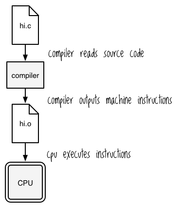
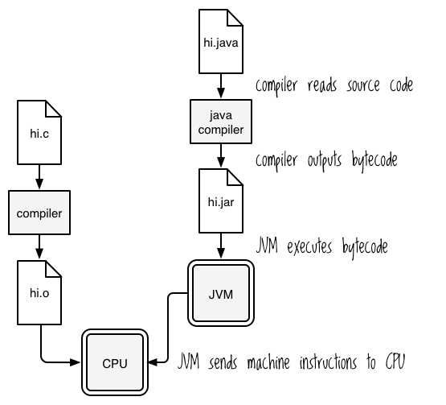

Chapter 12


# JVMで働く

Clojuristの人生には、純粋な関数と不変のデータ構造の聖域から、ワイルドで野蛮なJavaの土地に飛び出さなければならない日が来ます。この危険な旅は、ClojureがJava仮想マシン（JVM）上でホストされており、3つの基本的な特性を付与されているため必要です。第一に、Clojureアプリケーションは、Javaアプリケーションと同じように実行することができます。第二に、ファイルの読み取りや日付の操作などの中核的な機能には、Javaオブジェクトを使用する必要があります。第三に、Javaには便利なライブラリの広大なエコシステムがあり、それらを使用するためにはJavaについて少し知っておく必要があります。

このように、Clojureは、ディストピアの国の真ん中に置かれたユートピアのコミュニティのようなものです。もちろん、他のユートピア人と交流するのが望ましいのですが、物事を成し遂げるためには、たまには地元の人と話す必要があるのです。

この章は、Javaの国の会話集と文化紹介の間にあるようなものです。JVMとは何か、JVMがどのようにプログラムを実行するのか、JVM用にプログラムをコンパイルする方法について学びます。また、よく使われるJavaのクラスやメソッドを簡単に紹介し、Clojureを使ってそれらとどのようにやり取りするのかを説明します。Clojureプログラムに任意のJavaライブラリを組み込むことができるように、Javaについて考え、理解する方法を学びます。

この章の例を実行するには、Java Development Kit ( JDK ) バージョン 1.6 以降がコンピュータにインストールされている必要があります。 ターミナルで `javac -version` を実行することで確認することができます。`java 1.8.0_40`のように表示されるはずです。もし表示されない場合は、`*http://www.oracle.com/*`にアクセスして、最新のJDKをダウンロードしてください。

## The JVM

開発者は、JVMという用語をいくつかの異なるものを指すために使用します。「Clojureは*the* JVMで動作する」と言うのを耳にするでしょうし、「Clojureプログラムは*a* JVMで動作する」と言うのも耳にするでしょう。最初の場合、JVMは抽象化されたもの、つまりJava仮想マシンの一般的なモデルを指します。2番目は、プロセス-実行中のプログラムのインスタンス-を指します。ここでは、JVMのモデルに焦点を当てますが、JVMプロセスの実行について話しているときは、そのことを示すことにします。

JVMを理解するために、一歩下がって、普通のコンピュータがどのように動作するかを復習してみましょう。コンピュータの心臓の奥深くにあるのがCPUで、CPUの仕事は*加算*や*符号なし乗算*のような演算を実行することです。プログラマーがこれらの命令をパンチカードや電球、亀の甲羅の隙間などにエンコードしているという話を聞いたことがあると思いますが、現在ではこれらの演算はアセンブリ言語でADDやMULといったニーモニックで表現されています。CPUのアーキテクチャ（x86、ARMv7など）によって、そのアーキテクチャの*命令セット*の一部としてどのような演算が利用できるかが決まります。

アセンブリ言語でプログラミングしても面白くないので、人々はCやC++などの高級言語を発明し、CPUが理解できるような命令にコンパイルしています。大まかに言うと、その流れは

1.  コンパイラがソースコードを読み込む。
2.  コンパイラは、機械語命令を含むファイルを出力する。
3.  CPUがこれらの命令を実行する。

図12-1では、最終的には、プログラムをCPUが理解できる命令に翻訳する必要があり、CPUは、あなたがそれらの命令を生成するために使用するプログラミング言語を気にしないことに注意してください。

JVMは、コードを*Javaバイトコード*と呼ばれる低レベルの命令に変換する必要があるという点で、コンピュータに類似しています。しかし、*仮想*マシンとして、この変換はハードウェアではなくソフトウェアとして実装されています。実行中のJVMは、バイトコードをその場でホストが理解できるマシンコードに翻訳することによって実行します。




図12-1：C言語プログラムがマシンコードに変換される仕組みの高レベルな概要


プログラムがJVM上で実行されるためには、Javaバイトコードにコンパイルされる必要があります。 通常、プログラムをコンパイルすると、その結果のバイトコードは*.class*ファイルに保存されます。そして、これらのファイルを*Java archive* *ファイル*（JARファイル）にパッケージします。そして、CPUが機械命令を生成するためにどのプログラミング言語を使うかを気にしないのと同じように、JVMはバイトコードをどのように作成するかを気にしません。Scala、JRuby、Clojure、あるいはJavaを使用してJavaバイトコードを作成しようが関係ありません。一般的に、プロセスは図12-2に示すようになります。

1.  Javaコンパイラはソースコードを読み込む。
2.  コンパイラはバイトコードを出力する（多くの場合、JARファイルに出力される）。
3.  JVMは、バイトコードを実行する。
4.  JVMがCPUに機械命令を送る。

「ClojureはJVMで動く」と言われるのは、ClojureのプログラムがJavaのバイトコードにコンパイルされ、JVMのプロセスがそれを実行することを意味しています。運用の観点からは、ClojureのプログラムをJavaのプログラムと同じように扱うことを意味します。JARファイルにコンパイルして、`java`コマンドで実行するのです。クライアントがJVM上で動作するプログラムを必要とする場合、あなたはそれをJavaの代わりにClojureで密かに書くことができ、彼らは何も知らないでしょう。外から見ると、JavaとClojureのプログラムの違いは、CとC++のプログラムの違いと同じようにわからないのです。Clojureは、生産的であり、かつ巧妙であることを可能にします。




図12-2：JavaプログラムはJVMバイトコードを生成するが、JVMはCコンパイラのようにマシン命令を生成する必要がある。


## Javaプログラムの作成、コンパイル、実行について

実際のJavaプログラムがどのように動作するのかを見てみましょう。この章では、Javaが採用しているオブジェクト指向のパラダイムについて学びます。そして、Javaを使って簡単な海賊の絵本を作ってみましょう。これは、JVMをより快適に感じるのに役立ち、次のJavaインターロップ（Javaクラス、オブジェクト、およびメソッドを直接使用するClojureコードを書く）のセクションに備えることができ、万一悪党が公海であなたの戦利品を横取りしようとしたときに役に立つでしょう。すべての情報をまとめるために、章の終わりにClojureのJavaコードのいくつかを覗いてみましょう。

### 世界一小さなナッツシェルで学ぶオブジェクト指向プログラミング

Javaはオブジェクト指向言語なので、ClojureプログラミングでJavaライブラリを使用したりJavaインターロップ・コードを書いたりするときに何が起こっているかを理解したい場合は、オブジェクト指向プログラミング（OOP）の仕組みを理解する必要があります。Clojureのドキュメントにもオブジェクト指向の用語が出てきますので、これらの概念を学ぶことは重要です。OOPに精通している方は、このセクションを飛ばしていただいて結構です。OOPの中心的なプレーヤーは、*クラス*、*オブジェクト*、および*メソッド*です。

私はオブジェクトを、本当に、本当に、とんでもなく間抜けなアンドロイドだと思っています。 感覚を持った生き物を強制的に永久に隷属させることの倫理について、哲学的な議論を呼び起こすこともないようなアンドロイドです。このアンドロイドがすることは2つだけ。コマンドに応答することと、データを保持することです。私の想像では、彼らは小さなハローキティのクリップボードに何かを書き留めることによってこれを行う。

アンドロイドを製造する工場を想像してください。アンドロイドが理解するコマンドのセットも、アンドロイドが保持するデータのセットも、アンドロイドを作るファクトリーによって決定されるのです。OOPの用語では、ファクトリーはクラス、アンドロイドはオブジェクト、コマンドはメソッドに相当する。例えば、`ScaryClown`というファクトリー（クラス）があり、`makeBalloonArt`というコマンド（メソッド）に応答するアンドロイド（オブジェクト）を生成します。アンドロイドは持っている風船の数を記録しておき、風船の数が変わるたびにその数を更新する。また、`balloonCount`でその数を報告し、`receiveBalloons`で任意の数の風船を受け取ることができる。以下は、ピエロのBelly Rubsを表すJavaオブジェクトとの対話方法である：


```
ScaryClown bellyRubsTheClown = new ScaryClown();
bellyRubsTheClown.balloonCount();
// => 0

bellyRubsTheClown.receiveBalloons(2);
bellyRubsTheClown.balloonCount();
// => 2

bellyRubsTheClown.makeBalloonArt();
// => "Belly Rubs makes a balloon shaped like a clown, because Belly Rubs
// => is trying to scare you and nothing is scarier than clowns."
```


この例では、`ScaryClown` クラスを使用して新しいオブジェクト `bellyRubsTheClown` を作成する方法を説明します。また、このオブジェクトのメソッド（`balloonCount`、`receiveBalloons`、`makeBalloonArt`など）を呼び出す方法も示しています（おそらく、子供を怖がらせることができるようにするためでしょう）。

OOPの最後の側面として、少なくともJavaではどのように実装されているかを知っておく必要があるのは、ファクトリーにコマンドを送ることができるということです。 OOPの用語では、クラスもメソッドを持っていると言います。例えば、組み込みクラスの `Math` は、数値の絶対値を返す `Math.abs` を含む多くのクラスメソッドを持っています：


```
Math.abs(-50)
// => 50
```


あのピエロがトラウマになっていなければいいのですが。さて、あなたのOOPの知識を活かしてみましょう！

### Ahoy, World

まず、*phrasebook* という名前の新しいディレクトリを作成します。そのディレクトリに *PiratePhrases.java* というファイルを作成し、次のように記述します：


```
public class PiratePhrases
{
    public static void main(String[] args)
    {
        System.out.println("Shiver me timbers!!!");
    }
}
```


この非常にシンプルなプログラムは、実行すると "Shiver me timbers!!!"というフレーズをターミナルに表示します。(海賊が "Hello, world!"と言うのと同じ意味)をターミナルに表示します。このプログラムは `PiratePhrases` というクラスと、そのクラスに属する `main` という静的メソッドから構成されています。静的メソッドは基本的にクラスメソッドである。

ターミナルで `javac PiratePhrases.java` というコマンドで `PiratePhrases` のソースコードをコンパイルしてください。もし、あなたがすべて正しく入力し、*純粋な心を持っているならば、*PiratePhrases.class*という名前のファイルが表示されるはずです：


```
$ ls
PiratePhrases.class PiratePhrases.java
```


あなたは今、最初のJavaプログラムをコンパイルしたところです！では、`java PiratePhrases`で実行してみてください。このように表示されるはずです：


```
Shiver me timbers!!!
```


ここで起こっていることは、あなたがJavaコンパイラである`javac`を使って、Javaクラスファイルである*PiratePhrases.class*を作成したことです。このファイルには大量のJavaバイトコードが詰め込まれています（まあ、このサイズのプログラムでは、たぶん1オドルだけですが）。

あなたが`java PiratePhrases`を実行すると、JVMはまずあなたの*classpath*から`PiratePhrases`という名前のクラスがないか調べます。クラスパスは、JVMがクラスを定義するファイルを見つけるために検索するファイルシステムのパスのリストです。デフォルトでは、クラスパスはjavaを実行したときのディレクトリを含みます。`java -classpath /tmp PiratePhrases` を実行してみると、 *PiratePhrases.class* がカレントディレクトリにあるにもかかわらず、エラーになります。

`注` Mac や Linux を使っている場合はコロンで、Windows を使っている場合はセミコロンで区切ることで、クラスパスに複数のパスを設定することができます。例えば、クラスパス `/tmp:/var/maven:.` は `/tmp`, `/var/maven`, `.` ディレクトリーを含みます。

Javaでは、1つのファイルに1つのパブリッククラスしか許可されず、ファイル名はクラス名と一致していなければなりません。このようにして、`java` は `PiratePhrases` クラスのバイトコードを *PiratePhrases.class* で探してみることがわかります。`java`は`PiratePhrases`クラスのバイトコードを見つけた後、そのクラスの`main`メソッドを実行する。JavaはC言語と同様に、「何かを実行する、このクラスをエントリポイントとして使用する」と言うと、常にそのクラスの `main` メソッドを実行します。したがって、`PiratePhrases`のソースコードを見ればわかるように、このメソッドは `public` でなければなりません。

次の節では、複数のファイルにまたがるプログラムコードの扱い方と、Javaライブラリの使用方法について学びます。

## Package と Import

マルチファイル・プログラムとJavaライブラリの扱い方を確認するために、プログラムをコンパイルして実行することにします。このセクションはClojureに直接関係するもので、Javaライブラリと相互作用するために同じアイデアと用語を使用するからです。

まず、いくつかの定義から始めましょう：

- **package** Clojureの名前空間と同様に、パッケージはコード構造を提供します。パッケージはクラスを含み、パッケージ名はファイルシステムのディレクトリに対応します。ファイルに `package com.shapemaster` という行がある場合、クラスパスのどこかに *com/shapemaster* というディレクトリが存在するはずです。そのディレクトリの中に、クラスを定義するファイルが存在することになります。
- **import** Javaではクラスをインポートすることができ、基本的には名前空間プレフィックスなしでクラスを参照することができます。つまり、`com.shapemaster`に `Square` という名前のクラスがある場合、`.java`ファイルの先頭に `import com.shapemaster.Square;` または `import com.shapemaster.*;` と書くと、コード中で `com.shapemaster.Square` の代わりに `Square` を使用できます。

それでは、`package`と`import`を使ってみましょう。この例では、`Greetings` と `Farewells` という2つのクラスを持つ `pirate_phrases` というパッケージを作成します。まず、*phrasebook*に移動し、そのディレクトリ内に*pirate_phrases*という別のディレクトリを作成します。Javaのパッケージ名はファイルシステムのディレクトリに対応しているので、*pirate_phrases*を作成する必要があります。次に、*pirate_phrases*ディレクトリ内に*Greetings.java*を作成する：


```
➊ package pirate_phrases;

public class Greetings
{
    public static void hello()
    {
        System.out.println("Shiver me timbers!!!");
    }
}
```


➊で、`package pirate_phrases;` は、このクラスが `pirate_phrases` パッケージの一部であることを示します。次に、*pirate_phrases*ディレクトリ内に*Farewells.java*を作成します：


```
package pirate_phrases;

public class Farewells
{
    public static void goodbye()
    {
        System.out.println("A fair turn of the tide ter ye thar, ye magnificent sea friend!!");
    }
}
```


では、 *phrasebook* ディレクトリに *PirateConversation.java* を作成してください：


```
import pirate_phrases.*;

public class PirateConversation
{
    public static void main(String[] args)
    {
        Greetings greetings = new Greetings();
        greetings.hello();

        Farewells farewells = new Farewells();
        farewells.goodbye();
    }
}
```


最初の行の `import pirate_phrases.*;` は、 `Greetings` と `Farewells` クラスを含む `pirate_phrases` パッケージ内のすべてのクラスをインポートしています。

*phrasebook*ディレクトリ内で `javac PirateConversation.java` を実行し、次に `java PirateConversation` を実行すると、このように表示されるはずです：


```
Shiver me timbers!!!
A fair turn of the tide ter ye thar, ye magnificent sea friend!!
```


そして読者よ、彼女は吹く。まさに "Thar she blows "だ。

Javaプログラムをコンパイルするとき、Javaはクラスパスを検索してパッケージを探します。次のように入力してみてほしい：


```
cd pirate_phrases
javac ../PirateConversation.java
```


これが手に入る：


```
../PirateConversation.java:1: error: package pirate_phrases does not exist
import pirate_phrases.*;
^
```


ブーム！Javaコンパイラーは、恥を忍んで頭を垂れ、少し泣けと言ったのだ。

なぜか？`pirate_phrases`パッケージが存在しないと思ったからだ。でも、そんなの馬鹿げてるでしょ？あなたは *pirate_phrases* ディレクトリにいる！

ここで起こっていることは、デフォルトのクラスパスがカレントディレクトリしか含まないということです、この場合は *pirate_phrases* です。`javac`は *phrasebook/pirate_phrases/pirate_phrases* ディレクトリを探そうとしていますが、これは存在しません。`javac ../PirateConversation.java` を *phrasebook* ディレクトリの中から実行すると、 `javac` は *phrasebook/pirate_phrases* ディレクトリを探そうとします。ディレクトリを変更せずに、`javac -classpath ../../PirateConversation.java` を実行してみてください。戦慄が走る！ これは手動でクラスパスを *pirate_phrases* の親ディレクトリ、つまり *phrasebook* に設定したからです。そこから、`javac`はうまく *pirate_phrases* ディレクトリを見つけることができる。

まとめると、パッケージはコードを整理し、それに合ったディレクトリ構造を必要とします。クラスをインポートすることで、クラス全体のパッケージ名を先頭に付けることなく、クラスを参照することができます。`javac`とJavaはクラスパスを使ってパッケージを見つける。

## JAR Files

JARファイルを使うと、すべての *.class* ファイルを1つのファイルにバンドルすることができます。 *phrasebook* ディレクトリに移動し、以下を実行してください：


```
jar cvfe conversation.jar PirateConversation PirateConversation.class
pirate_phrases/*.class
java -jar conversation.jar
```


これで海賊の会話が正しく表示される。あなたはすべてのクラスファイルを *conversation.jar* にバンドルした。また、`e`フラグを使用して、`PirateConversation`クラスが *エントリポイント* であることを示した。エントリポイントとは、JAR全体が実行されるときに実行されるべき `main` メソッドを含むクラスのことで、`jar` はこの情報をJARファイル内の *META-INF/MANIFEST.MF* というファイルに格納する。そのファイルを読むと、次のような行があります：


```
Main-Class: PirateConversation
```


ところで、JARファイルを実行するとき、ファイルに対してどのディレクトリにいるかを気にする必要はない。 *pirate_phrases* ディレクトリに移動して、`java -jar ../conversation.jar`を実行すれば問題なく動作する。その理由は、JARファイルがディレクトリ構造を保持しているからです。`jar tf conversation.jar`で中身を見ることができる：


```
META-INF/
META-INF/MANIFEST.MF
PirateConversation.class
pirate_phrases/Farewells.class
pirate_phrases/Greetings.class
```


JARファイルには*pirate_phrases*ディレクトリが含まれていることがわかります。 JARについてもう一つ面白い事実があります。JARは実際には *.jar* という拡張子がついたただのZIPファイルです。他のZIPファイルと同じように扱うことができます。

## clojure.jar

これで、Clojureがフードの下でどのように動作するかを見る準備ができました！1.9.0安定版リリース`をダウンロードして実行してください：


```
java -jar clojure-1.7.0.jar
```


最も癒される光景、Clojure REPLを見てほしい。実際にどのように起動したのでしょうか？JARファイルの*META-INF/MANIFEST.MF*を見てみましょう：


```
Manifest-Version: 1.0
Archiver-Version: Plexus Archiver
Created-By: Apache Maven
Built-By: hudson
Build-Jdk: 1.7.0_20
Main-Class: clojure.main
```


`clojure.main`がエントリポイントとして指定されているようです。このクラスはどこから来たのでしょうか？GitHubの *<https://github.com/clojure/clojure/blob/master/src/jvm/clojure/main.java>* にある *clojure/main.java* を見てください：


```
/**
 *   Copyright (c) Rich Hickey. All rights reserved.
 *   The use and distribution terms for this software are covered by the
 *   Eclipse Public License 1.0 (http://opensource.org/licenses/eclipse-1.0.php)
 *   which can be found in the file epl-v10.html at the root of this distribution.
 *   By using this software in any fashion, you are agreeing to be bound by
 *   the terms of this license.
 *   You must not remove this notice, or any other, from this software.
 **/

package clojure;

import clojure.lang.Symbol;
import clojure.lang.Var;
import clojure.lang.RT;

public class main{

final static private Symbol CLOJURE_MAIN = Symbol.intern("clojure.main");
final static private Var REQUIRE = RT.var("clojure.core", "require");
final static private Var LEGACY_REPL = RT.var("clojure.main", "legacy-repl");
final static private Var LEGACY_SCRIPT = RT.var("clojure.main", "legacy-script");
final static private Var MAIN = RT.var("clojure.main", "main");

public static void legacy_repl(String[] args) {
    REQUIRE.invoke(CLOJURE_MAIN);
    LEGACY_REPL.invoke(RT.seq(args));
}

public static void legacy_script(String[] args) {
    REQUIRE.invoke(CLOJURE_MAIN);
    LEGACY_SCRIPT.invoke(RT.seq(args));
}

public static void main(String[] args) {
    REQUIRE.invoke(CLOJURE_MAIN);
    MAIN.applyTo(RT.seq(args));
}
}
```


ご覧のように、このファイルは `main` という名前のクラスを定義している。このファイルは `clojure` パッケージに属し、`public static main` メソッドを定義している。このように見ると、Clojureは他のJVMプログラムと同じです。

これは詳細なJavaチュートリアルを意図したものではありませんでしたが、プログラマがClojureを「JVM上で実行する」あるいは「ホストされた」言語であると話すとき、何を意味するのかを明確にする助けになったことを願っています。次のセクションでは、Clojureプロジェクト内で追加のJavaライブラリを使用する方法を学びながら、JVMのマジックを探求し続けます。

## Clojure App JARs

JavaがJava JARをどのように実行するかはわかったと思いますが、JARとしてバンドルされたClojureアプリケーションをどのように実行するのでしょうか？結局のところ、Clojureアプリケーションはクラスを持っていませんよね？

結論から言うと、名前空間宣言に `(:gen-class)` ディレクティブを置くことで、Clojureコンパイラに名前空間のクラスを生成させることができます。(これは、あなたが作成した一番最初のClojureプログラム、第1章の *clojure-noob* で見ることができます。そのプログラム、小さなティーポットを覚えていますか?) これは、JVMが名前空間をJavaクラスを定義するかのように扱うために必要なバイトコードをコンパイラが生成することを意味します。

プログラムの *project.clj* ファイルで、`:main`属性を使用して、プログラムのエントリ・ポイントの名前空間を設定します。*clojure-noob* では、 `:main ^:skip-aot clojure-noob.core`となります。 Leiningen がこのファイルをコンパイルするとき、結果の JAR ファイルへのエントリポイントを含む *meta-inf/manifest.mf* ファイルを追加します。

つまり、名前空間に `-main` 関数を定義して `(:gen-class)` ディレクティブをインクルードし、さらに *project.clj* ファイルに `:main` を設定すれば、JAR としてコンパイルされたときに Java がプログラムを実行するために必要なものがすべて揃うことになります。ターミナルで *clojure-noob* ディレクトリに移動して、これを実行することで試すことができます：


```
lein uberjar
java -jar target/uberjar/clojure-noob-0.1.0-SNAPSHOT-standalone.jar
```


2つのメッセージが出力されているはずだ： "Cleanliness is next to godliness”「清潔は神々しさに次ぐ」と "I'm a little teapot!”「私は小さなティーポットです！」。JARファイルを実行するためにLeiningenが必要なわけではないことに注意してほしい。友人や隣人にこのファイルを送れば、Javaがインストールされている限り実行できる。

## Java Interop

Rich Hickey氏のClojureの設計目標の1つは、*実用的な*言語を作ることでした。そのため、ClojureはJavaのクラスやオブジェクトと簡単にやり取りできるように設計されています。つまり、Javaの広範なネイティブ機能とその巨大なエコシステムを利用することができます。 Javaクラス、オブジェクト、メソッドを使用する機能は、*Java interop*と呼ばれます。このセクションでは、Clojureのinterop構文を使用する方法、Javaパッケージをインポートする方法、最も頻繁に使用されるJavaクラスを使用する方法を学びます。

### Interop Syntax

Clojureのinterop構文を使えば、Javaオブジェクトやクラスとのやり取りは簡単です。オブジェクトの相互運用構文から始めましょう。

オブジェクトのメソッドは `(. methodName object)` を使って呼び出すことができます。例えば、すべてのClojure文字列はJava文字列として実装されているので、Javaメソッドを呼び出すことができます：


```
(.toUpperCase "By Bluebeard's bananas!")
; => "BY BLUEBEARD'S BANANAS!"

➊ (.indexOf "Let's synergize our bleeding edges" "y") 
; => 7
```


これらはこのJavaと同等である：


```
"By Bluebeard's bananas!".toUpperCase()
"Let's synergize our bleeding edges".indexOf("y")
```


Clojureの構文では、Javaのメソッドに引数を渡すことができることに注意してください。この例では、 ➊ で `indexOf` メソッドに引数 `"y"` を渡しています。

また、クラスの静的メソッドを呼び出したり、クラスの静的フィールドにアクセスすることもできます。注意してください！


```
➊ (java.lang.Math/abs -3) 
; => 3

➋ java.lang.Math/PI 
; => 3.141592653589793
```


➊で `java.lang.Math` クラスの `abs` スタティックメソッドを呼び出し、 ➋でそのクラスの `PI` スタティックフィールドにアクセスしました。

これらの例（`java.lang.Math/PI`を除く）はすべて、*ドット特殊形式*を使用するように展開するマクロを使用しています。一般的に、Javaオブジェクトやクラスとやりとりするために独自のマクロを書きたいのでなければ、ドット特殊形式を使う必要はないでしょう。とはいえ、以下にそれぞれの例とそのマクロ展開を示します：


```
(macroexpand-1 '(.toUpperCase "By Bluebeard's bananas!"))
; => (. "By Bluebeard's bananas!" toUpperCase)

(macroexpand-1 '(.indexOf "Let's synergize our bleeding edges" "y"))
; => (. "Let's synergize our bleeding edges" indexOf "y")

(macroexpand-1 '(Math/abs -3))
; => (. Math abs -3)
```


これはドット演算子の一般的な形である：


```
(. object-expr-or-classname-symbol method-or-member-symbol optional-args*)
```


ドット演算子にはさらにいくつかの機能があり、さらに詳しく調べたい場合は、 *<http://clojure.org/java_interop#Java%20Interop-The%20Dot%20special%20form>* にあるclojure.orgのJava相互運用に関するドキュメントを参照してください。

### オブジェクトの作成と変更

前のセクションでは、既に存在するオブジェクトのメソッドを呼び出す方法を示しました。このセクションでは、新しいオブジェクトを作成する方法と、オブジェクトとやり取りする方法について説明します。

新しいオブジェクトは2つの方法で作成できます： `(new ClassName optional-args)` と `(ClassName. optional-args)` です：


```
(new String)
; => ""

(String.)
; => ""

(String. "To Davey Jones's Locker with ye hardies")
; => "To Davey Jones's Locker with ye hardies"
```


たいていの人はドット版の`(ClassName.)`を使う。

オブジェクトを変更するには、前のセクションでやったようにオブジェクトのメソッドを呼び出します。これを調べるために、`java.util.Stack`を使ってみよう。このクラスはオブジェクトのLIFO（Last-in, First-out）スタックを表す。*スタック*は一般的なデータ構造であり、物理的なオブジェクトのスタック、例えばあなたが略奪した金貨のスタックを視覚化することができるので、スタックと呼ばれています。スタックにコインを追加すると、スタックの一番上に追加される。コインを取り除くときは、それを一番上から取り除く。したがって、最後に追加されたオブジェクトが最初に削除されたオブジェクトとなる。

Clojureのデータ構造とは異なり、Javaのスタックはミュータブルです。項目を追加したり、項目を削除したりして、新しい値を導出する代わりにオブジェクトを変更することができます。以下は、スタックを作成し、そこにオブジェクトを追加する方法です：


```
(java.util.Stack.)
; => []

➊ (let [stack (java.util.Stack.)] 
  (.push stack "Latest episode of Game of Thrones, ho!")
  stack)
; => ["Latest episode of Game of Thrones, ho!"]
```


ここには興味深い詳細がいくつかある。まず、➊にあるように `stack` の `let` バインディングを作成し、それを `let` フォームの最後の式として追加する必要がある。そうしないと、全体の式の値は文字列 `"Latest episode of Game of Thrones, ho!" ` になってしまう。これは `push` の戻り値だからだ。

第二に、Clojureはスタックを角括弧で表示します。これはベクトルに対して使うのと同じテキスト表現です。しかし、スタック上の `first` のようなデータ構造を読み込むために、Clojure の `seq` 関数を使用することができます：


```
(let [stack (java.util.Stack.)]
  (.push stack "Latest episode of Game of Thrones, ho!")
  (first stack))
; => "Latest episode of Game of Thrones, ho!"
```


しかし、スタックに要素を追加するために `conj` や `into` のような関数を使うことはできない。そうすると例外が発生します。Clojureの関数を使ってスタックを読むことができるのは、Clojureがその抽象化を `java.util.Stack` に拡張しているからです。

Clojureは `doto` マクロを提供し、同じオブジェクトに対して複数のメソッドをより簡潔に実行できるようにします：


```
(doto (java.util.Stack.)
  (.push "Latest episode of Game of Thrones, ho!")
  (.push "Whoops, I meant 'Land, ho!'"))
; => ["Latest episode of Game of Thrones, ho!" "Whoops, I meant 'Land, ho!'"]
```


この`doto`マクロはメソッド呼び出しの戻り値ではなくオブジェクトを返すので、理解しやすい。`macroexpand-1`を使って展開すると、その構造が先ほどの例で見た `let` 式と同じであることがわかる：


```
(macroexpand-1
 '(doto (java.util.Stack.)
    (.push "Latest episode of Game of Thrones, ho!")
    (.push "Whoops, I meant 'Land, ho!'")))
; => (clojure.core/let
      [G__2876 (java.util.Stack.)]
      (.push G__2876 "Latest episode of Game of Thrones, ho!")
      (.push G__2876 "Whoops, I meant 'Land, ho!'")
      G__2876)
```


便利だ！

### Importing

Clojureでは、インポートはJavaと同じ効果があります。つまり、パッケージ接頭辞全体をタイプアウトすることなくクラスを使用できます：


```
(import java.util.Stack)
(Stack.)
; => []
```


また、この一般的なフォームを使用して、複数のクラスを一度にインポートすることもできます：


```
(import [package.name1 ClassName1 ClassName2]
        [package.name2 ClassName3 ClassName4])
```


例を挙げよう：


```
(import [java.util Date Stack]
        [java.net Proxy URI])

(Date.)
; => #inst "2016-09-19T20:40:02.733-00:00"
```


しかし通常、インポートはすべて`ns`マクロで行う：


```
(ns pirate.talk
  (:import [java.util Date Stack]
           [java.net Proxy URI]))
```


クラスをインポートするための2つの異なる方法は同じ結果をもたらしますが、あなたのコードを読む人にとって、`ns`宣言で命名に関わるすべてのコードを見ることができるのは便利なので、通常は2番目の方法が好まれます。

これがクラスをインポートする方法です！とても簡単です。さらに簡単にするために、Clojureは `java.lang.String` と `java.lang.Math` を含む `java.lang` のクラスを自動的にインポートします。

## よく使われるJavaクラス

この章の締めくくりとして、よく使うJavaクラスをざっと見てみましょう。

### The System Class

`System`クラスは、プログラムが動作している環境とやりとりするための便利なクラスフィールドとメソッドを持っている。これを使用して、環境変数を取得したり、標準入力、標準出力、エラー出力のストリームを操作したりすることができる。

最も便利なメソッドとメンバは `exit`、`getenv`、`getProperty` である。`System/exit`は第5章で、Peg Thingのゲーム終了に使ったのを覚えているかもしれない。`System/exit` は現在のプログラムを終了させるもので、引数としてステータスコードを渡すことができる。ステータスコードについてよく知らない場合は、 *<http://en.wikipedia.org/wiki/Exit_status>* にあるWikipediaの "Exit status "の記事をお勧めする。

`System/getenv`はシステムの環境変数をすべてマップとして返します：


```
(System/getenv)
{"USER" "the-incredible-bulk"
 "JAVA_ARCH" "x86_64"}
```


環境変数の一般的な使い方の1つは、プログラムを設定することである。

JVMはコンピュータの環境変数とは別のプロパティのリストを持っており、それを読み取る必要がある場合は `System/getProperty` を使うことができる：


```
➊ (System/getProperty "user.dir")
; => "/Users/dabulk/projects/dabook"

➋ (System/getProperty "java.version")
; => "1.7.0_17"
```


➊での最初の呼び出しは、JVMが起動したディレクトリを返し、➋での2回目の呼び出しは、JVMのバージョンを返した。

### Dateクラス

Javaには、日付を扱うための優れたツールがあります。`java.util.Date`クラスについては、オンラインAPIドキュメント( *<http://docs.oracle.com/javase/7/docs/api/java/util/Date.html>* で入手可能)が詳しいので、あまり詳しく説明しません。Clojure開発者として、この `date` クラスの3つの特徴を知っておく必要があります。まず、Clojureでは日付をリテラルとして表現することができます：


```
#inst "2016-09-19T20:40:02.733-00:00"
```


第2に、日付を文字列に変換する方法をカスタマイズしたい場合や、文字列を日付に変換したい場合は、`java.util.DateFormat`クラスを使用する必要があります。第3に、日付を比較したり、分や時間などの単位を日付に追加したりするような作業をする場合は、非常に便利なclj-timeライブラリを使うべきです（ *<https://github.com/clj-time/clj-time>* でチェックアウトできます）。

## ファイルと入出力

このセクションでは、入出力(IO)に対するJavaのアプローチと、Clojureがそれをどのように単純化するかについて学びます。`clojure.java.io`名前空間は、IOを単純化するための便利な関数をたくさん提供しています ( *<https://clojure.github.io/clojure/clojure.java.io-api.html>* )。JavaのIOは必ずしも単純ではないので、これは素晴らしいことです。プログラミングのキャリアのどこかでIOを実行したくなることもあるだろうから、まずは心の中でIOに触手を巻いてみよう。

IOには、ファイル、ソケット、バッファなど、あらゆるリソースが含まれる。 Javaには、リソースの内容を読むためのクラス、内容を書き込むためのクラス、リソースのプロパティとやりとりするためのクラスがそれぞれ用意されている。

例えば、`java.io.File`クラスはファイルのプロパティを操作するために使われる：


```
(let [file (java.io.File. "/")]
➊   (println (.exists file))  
➋   (println (.canWrite file))
➌   (println (.getPath file))) 
; => true
; => false
; => /
```


他のタスクの中でも、ファイルが存在するかどうかのチェック、ファイルの読み取り/書き込み/パーミッションの取得、ファイルシステムのパスの取得に使うことができ、それぞれ➊、➋、➌で確認できる。

この機能のリストには、読み込みと書き込みが明らかに欠けている。ファイルを読み込むには、`java.io.BufferedReader`クラスか、あるいは`java.io.FileReader`を使うことができる。同様に、書き込みには `java.io.BufferedWriter` クラスか `java.io.FileWriter` クラスを使うことができる。 読み書きには他のクラスも利用可能であり、どれを選択するかは特定のニーズに依存する。reader クラスと writer クラスはすべて、インターフェイスとして同じ基本メソッドセットを持っている。reader は `read` や `close` などを実装し、writer は `append`、`write`、`close`、`flush` を実装している。JavaはさまざまなIOツールを提供してくれる。皮肉屋の人は、Javaは首を吊るのに十分なロープをくれる、と言うかもしれない。

いずれにせよ、Clojureは、異なる種類のリソースの読み書きを統一する関数が含まれているため、読み書きが簡単になります。例えば、`spit`はリソースに書き込み、`slurp`はリソースから読み込む。例えば、 `spit` はリソースに書き込みを行い、 `slurp` はリソースから読み込みを行う：


```
(spit "/tmp/hercules-todo-list"
"- kill dat lion brov
- chop up what nasty multi-headed snake thing")

(slurp "/tmp/hercules-todo-list")

; => "- kill dat lion brov
      - chop up what nasty multi-headed snake thing"
```


これらの関数はファイル以外のリソースを表すオブジェクトでも使うことができる。次の例では、文字列に対して IO 操作を実行できる `StringWriter` を使う：


```
(let [s (java.io.StringWriter.)]
  (spit s "- capture cerynian hind like for real")
  (.toString s))
; => "- capture cerynian hind like for real"
```


また、 `slurp` を使って `StringReader` から読み込むこともできる：


```
(let [s (java.io.StringReader. "- get erymanthian pig what with the tusks")]
  (slurp s))
; => "- get erymanthian pig what with the tusks"
```


さらに、リソースに対しては `read` メソッドと `write` メソッドを使うことができる。 どちらのメソッドを使ってもあまり違いはありません。 `spit` と `slurp` はファイルシステムのパスや URL を表す文字列だけで動作するので便利です。

`with-open`マクロはもう一つの便利な機能である。リソースを本体の最後で暗黙的に閉じるので、手動でリソースを閉じるのを忘れて、誤ってリソースを閉じ込めてしまうことがない。`reader` 関数は便利なユーティリティで、`clojure.java.io` API ドキュメントによると、”引数を、開いている `java.io.Reader` に強制しようとする" 関数です。これは `slurp` を使いたくない場合に便利である。なぜなら、リソースを丸ごと読み込もうとしたくないし、どのJavaクラスを使う必要があるのかを把握したくないからである。ファイルを1行ずつ読み込む場合は、 `reader` と `with-open` と `line-seq` 関数を使うことができる。ヘラクレスのToDoリストの最初の項目だけを表示する方法を以下に示す：


```
(with-open [todo-list-rdr (clojure.java.io/reader "/tmp/hercules-todo-list")]
  (println (first (line-seq todo-list-rdr))))
; => - kill dat lion brov
```


ClojureでIOを始めるにはこれで十分でしょう。より洗練されたタスクを行おうとするなら、`clojure.java.io docs`、`java.nio.file`パッケージのドキュメント、または `java.io`パッケージのドキュメントをチェックしてください。

## 資料

-   "The Java Virtual Machine and Compilers Explained": *<https://www.youtube.com/watch?v=XjNwyXx2os8>*
-   clojure.org Java interop documentation: *<http://clojure.org/java_interop>*
-   Wikipedia's "Exit status" article: *<http://en.wikipedia.org/wiki/Exit_status>*

## まとめ

この章では、ClojureがJVM上でホストされることの意味を学びました。ClojureプログラムはJavaバイトコードにコンパイルされ、JVMプロセス内で実行されます。ClojureプログラムはJavaライブラリにもアクセスでき、Clojureのinterop機能を使って簡単にJavaライブラリと対話できます。


