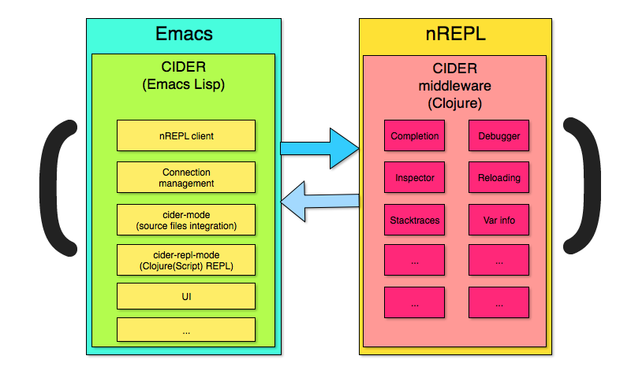
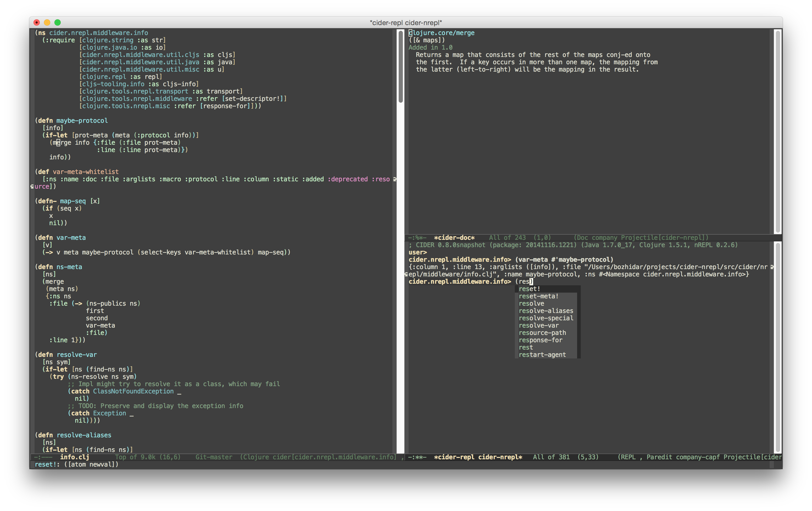

= CIDER

CIDERは**C**lojure( Script) **I**nteractive **D**evelopment **E**nvironment の**R**ocks! 

CIDERは、Clojureの xref:usage/interactive_programming.adoc[対話型プログラミング] のサポート機能をEmacsに拡張します。この機能は xref:usage/cider_mode.adoc[cider-mode] を中心としたもので、 https://github.com/clojure-emacs/clojure-mode[clojure-mode] を補完するEmacsのマイナーモードです。`clojure-mode`がClojureソースファイルの編集をサポートするのに対して、`cider-mode`はコンパイル、デバッグ、定義とドキュメントの検索、テストの実行などのために実行中のClojureプロセスと対話するためのサポートを追加します。

.SLIMEからインスピレーションを得た
****
CIDERはもともと、強力なCommon Lisp対話型開発環境 https://github.com/slime/slime[SLIME] にインスパイアされた。当初、私たちはSLIMEのコア機能をClojureに適応させることから始めましたが、時間の経過とともにCIDERは多くの分野でSLIMEとはかなり異なるものになりました。CIDERの初期の歴史についてもっと知りたい方は、 https://www.youtube.com/watch?v=4X-1fJm25Ww&list=PLZdCLR02grLoc322bYirANEso3mmzvCiI&index=6[この発表] をチェックしてください。
****

*ぜひご検討ください。
xref:contributing/funding.adoc[継続的な発展を財政的に支援する].*

== 概要

CIDERは、Emacs Lisp、Common Lisp（ https://github.com/slime/slime[SLIME] または https://github.com/joaotavora/sly[Sly] を使用）、Scheme（ https://github.com/jaor/geiser[Geiser] を使用）、およびSmalltalkでプログラミングするときのようなインタラクティブな開発体験を提供することを目指しています。

プログラマは、常に既存のClojure定義を再評価し、実行中のアプリケーションに新しい定義を追加する、非常に動的でインクリメンタルな方法でプログラミングすることが期待されています。CIDERを使用している間、Clojureアプリケーションを停止/開始することはありません。 あなたが誰に尋ねるかによって、そのアプローチは "対話型プログラミング/開発 "または "REPL駆動型プログラミング "と名付けられます。私たちは前者の呼び方を好み、CIDERのドキュメント全体を通してこの呼び方を使います。

ヒント：典型的なCIDERのワークフローについての詳細は、 xref:usage/interactive_programming.adoc[インタラクティブプログラミング] セクションにあります。

CIDERは https://github.com/nrepl/nrepl[nREPL] , ClojureネットワークREPLサーバーの上に構築されています。

CIDERの基本的なアーキテクチャは以下のようなものです：

ClojureコードはnREPLサーバーによって実行される。CIDERはサーバにリクエストを送り、そのレスポンスを処理します。サーバーの機能は、CIDERのようなインタラクティブな開発環境のニーズに対応するために特別に設計された、追加の https://github.com/clojure-emacs/cider-nrepl[nREPLミドルウェア] によって増強されます。

.エディターにとらわれない基礎
****
私たちが元々CIDERのために開発したnREPLミドルウェアの多くは、エディタにとらわれず、他のClojure開発環境でも使用されています(例えば、 https://github.com/tpope/vim-fireplace[vim-fireplace] や https://github.com/BetterThanTomorrow/calva[Calva] )。
****

== 特徴

CIDERには多くの機能が搭載されている。以下はその一部である（順不同）：

* 対話的なコード評価
* 強力なREPL
* コード補完
* コード・リロード
* 定義とドキュメントの検索
* エラー報告の強化
* `clojure.test` の統合
* `clojure.spec` の統合
* 対話型デバッガ
* ClojureScript サポート
* xref:platforms/overview.adoc[alternative Clojure platforms] (例: ClojureCLR, babashka, nbb & lumo) のサポート。

その他にも... このマニュアルの残りの部分では、CIDERの機能を詳しく説明していきます。

== 実際のCIDER

以下は典型的なCIDERセッションの様子である。

ここでは、ユーザーはソースバッファから直接 `clojure.core/merge` のドキュメントをチェックし、REPLバッファにジャンプしてそこで何かを試しています。

CIDERの本質的な機能のビデオデモもあります：

video::aYA4AAjLfT0[youtube]

xref:additional_resources.adoc[追加リソース] ページには、他にもいくつかのデモビデオがあります。

== 次はどうする？

では、次に何をすればいいのか？お好きなようにドキュメントを熟読していただきたいが、いくつかお勧めの方法がある：

* xref:basics/installation.adoc[CIDERをインストールする]  xref:basics/up_and_running.adoc[稼働させる]
* xref:usage/interactive_programming.adoc[対話型プログラミング] と xref:usage/cider_mode.adoc[ cider-mode] に慣れる。
* xref:config/basic_config.adoc[設定] CIDER を自分好みにする。
* xref:additional_packages.adoc[追加パッケージ] で生産性を上げることができます。
