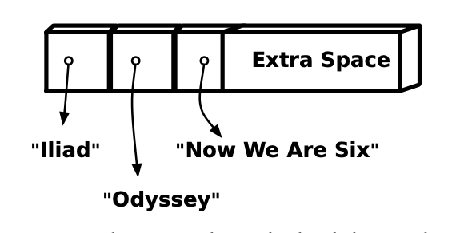
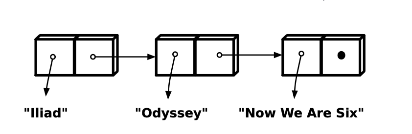

### リストとベクター

ベクターとリストがどちらも順序付けされたシーケンシャルなデータ構造であるなら、なぜその2つがあるのでしょうか?Clojureがベクターとリストの両方を含む理由は、見た目は似ていますが、内部的にはこの2つのデータ構造は大きく異なるからです。次の図に示すように、ベクターは配列に似ていて、連続したメモリの大きな塊だと考えることができます。最初の項目をメモリ・ブロックの最初のスロットに、2番目の項目を2番目のスロットに、といった具合です。



これとは対照的に、リストは連結リストとして実装される。「22ページの図」にあるように、リストは一連の2個の空き領域オブジェクトと考えることができる。



1 番目の空き領域はあるデータ項目への参照を含み、2 番目の空き領域はリストの次のオブジェクトを指す。

アイテムの単一ファイル列を整理するこれらの2つの方法は、非常に異なる強みがあります。例えば、ベクターの654番目のアイテムに到達するのは速いです-舞台裏でClojureはちょっとしたアドレス演算を行い、654番目のアイテムがそこにあります。対照的に、リストの654番目のアイテムに到達するには、すべての前のアイテムの連鎖を一度に1つずつ下っていく必要があります。

> [!NOTE]
>
> **スロットの数は？**
>
> 2スロットのリスト・オブジェクトには、実際には3つのスロットがあります。3つ目のスロットはリスト内のアイテムの数を表すものです。これにより、アイテムが1つ、2つ、3つ......とリスト全体を実行しなくても、`count`関数が実行できるようになる。リストは不変なので、カウントをキャッシュしても問題はない。

しかし、その利点はベクターだけにあるわけではない。ベクターよりもリストの前に新しい項目を追加する方がずっと簡単で、しかも速い。リストでは、新しい2つのスロットを確保し、1つのスロットを項目に、もう1つのスロットを元のリストに向けるだけだ。ベクターは多かれ少なかれ連続したメモリの塊に依存しているため、新しいアイテムを先頭に追加するには、より多くのメモリを割り当て、アイテムをあちこちにコピーする必要があるかもしれません。一方で、ベクターの末尾に新しい項目を追加する場合は、メモリ・ブロックの末尾に空きがあればすぐに行えます。

リストとベクターの実装の違いは `conj` 関数ではっきりと表面化する。`conj`はコレクションとアイテムを受け取り、元のコレクションに新しいアイテムを加えたものを返す。重要なのは、`conj` はベクターとリストの強みが異なることを認識していて、それに従って動作することです。

```clojure
(def poems '("Iliad" "Odyssey" "Now We Are Six"))
(conj poems "Jabberwocky")
```

それは以下のような結果となる。

```clojure
("Jabberwocky" "Iliad" "Odyssey" "Now We Are Six")
```

一方、 `conj` を使ってベクターに新しいアイテムを追加すると、そのアイテムは最後に置かれます。

```clojure
(def vector-poems ["Iliad" "Odyssey" "Now We Are Six"])
(conj vector-poems "Jabberwocky")
```

これが返される。

```clojure
["Iliad" "Odyssey" "Now We Are Six" "Jabberwocky"]
```


