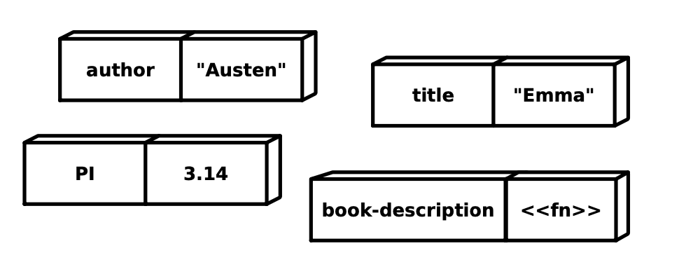

###束縛もモノである

意外なことに、シンボルと値の間の束縛、つまり `def` によって作成されるモノも同じように普通の値である。`def`を評価すると、Clojureは "var "を作成します。"var "はシンボルと値の間の束縛を表すものです。「88ページの図」に示されているように、varには2つのスロットがあると考えることができます：シンボル（おそらく`author`）と値（おそらく`"Austen"`）のための場所があります。

ちょっと面白いことに、適切な呪文を唱えれば、今度は `#` の後に `'` をつけて var を取得することもできる：

```clojure
(def author "Austen") ; Make a var.
#'author ; Get at the var for author -> "Austen".
```



他のClojureの値と同様に、`def`の中でvarsを使うことができます：

```clojure
(def the-var #'author) ; Grab the var.
```

そして、APIを知っていれば、varの中に埋もれているシンボルと値の両方を取得することができる：

```clojure
(.get the-var)  ; Get the value of the var: "Austen"
(.-sym the-var) ; Get the symbol of the var: author
```

この奇妙な`.get`と`.-sym`の構文については気にしないでください-これについては「第16章 Javaとの相互運用（189ページ）」で説明します。その代わりに、`def`を評価するときには3つの別々の値を扱うという考え方に注目してください。まず、束縛するシンボル、この場合は`author`である。次に、そのシンボルに束縛する値、例では`"Austen"`である。最後に、シンボルを値に束縛するvar、`#'author`です。
