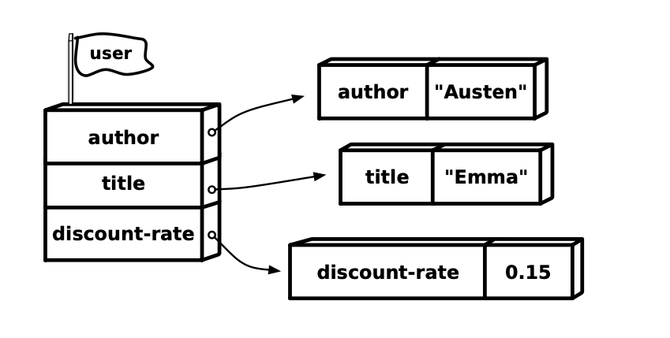

### Varsの置き場所

前の章で、def が varsをどのように作成するのか、シンボルと値の間の束縛を表すvarsを どのように作成するのかを見ました。その章では、varsがどのように整理されるかについて説明しました。しかし、実際はとてもシンプルです。"96ページの図 "に示されているように、varsは "名前空間 "に住んでいます。

概念的には、Clojure名前空間は、シンボルによってインデックス付けされたvarsの大きな参照テーブルです。そして、必要なだけプログラム内に名前空間を持つことができるので、各名前空間自体はユニークな名前を持っています。任意の時点で、カレント名前空間と呼ばれる特別な名前空間が1つ存在します。つまり、次のようにすると



namespace/examples.clj
```clojure
(def discount-rate 0.15)
```

これはカレント名前空間で、`discount-rate` を `0.15` と関連付ける var で置き換えられています。コードの少し後で `discount-rate` に言及すると、Clojure はカレント名前空間を参照して `0.15` を生成します。

起動するとき、Clojureはあなたのために `user` という新しい名前空間を作成し、それをカレント名前空間にします。

したがって、これまで評価してきたすべての `def` と `defn` は、"Hello, Clojure "で紹介したファイルベースのプロジェクトを例にすると、そのまま `user` 名前空間に入っています。

`user`はデフォルトの名前空間ですが、唯一の名前空間ではありません。先ほど言ったように、名前空間は必要な数だけ作ることができ、新しい名前空間を作る最も簡単な方法は `ns` を使うことです：


```clojure
(ns pricing)
``` 

単に `ns` に新しい名前空間の名前を入力するだけでよく、引用符で囲む必要はない。便利なことに、`ns` は新しい名前空間を作成するだけでなく、それをカレント名前空間にします。このように

```clojure
(ns pricing)
(def discount-rate 0.15)
(defn discount-price [book]
  (* (- 1.0 discount-rate) (:price book)))
```

`pricing` 名前空間を作成し、`discount-rate` と `discount-price` の var を追加します。

既存の名前空間の名前を `ns` に指定すると、名前空間の作成を省略して、ただ単に現在の名前空間を既存の名前空間に切り替えます。
例えば、`pricing` から `user` に切り替えるとする：

```clojure
(ns user)
```

そして再び `pricing` へと戻る：

```clojure
;; Back to the pricing namespace.
(ns pricing)
```

`discount-price`はまだ有効なのだ：

```clojure
(println (discount-price {:title "Emma" :price 9.99}))
```


デフォルトでは、ある名前空間内のvarsは別の名前空間内のvarsと完全に分離されています。したがって、別々の名前空間にある限り、`discount-price`という関数やプレーンな値をいくつでも持つことができます。そこで、ある名前空間で定義されたvarsを別の名前空間からどのように取得するかという問題が発生します。例えば、`user`名前空間にいる場合はどうなるでしょうか：

```clojure
(ns user)
;; How do I get at discount-price?
```

そして、`discount-price?`を呼び出したい。

「別の名前空間のものが必要だ」という問題に対する最も簡単な解決策は、「完全修飾シンボル」を使うことだ。完全修飾されたシンボルとは、名前空間を含む長い版のシンボルのことです。完全修飾シンボルを書くには、まず名前空間を書き、その後にスラッシュをつけ、その後にシンボル名を書きます。つまり、`discount-price`は`pricing/discount-price`となる：

```clojure
(ns user)
;; I can get at discount-price in pricing like this!
(println (pricing/discount-price {:title "Emma" :price 9.99}))
```

繰り返しになるが、名前空間はシンプルである：名前空間は自分のものを置く場所であり、自分の名前を持つだけである。そして、名前空間から何かが必要な場合は、名前空間名でシンボルを修飾するだけでいい。


