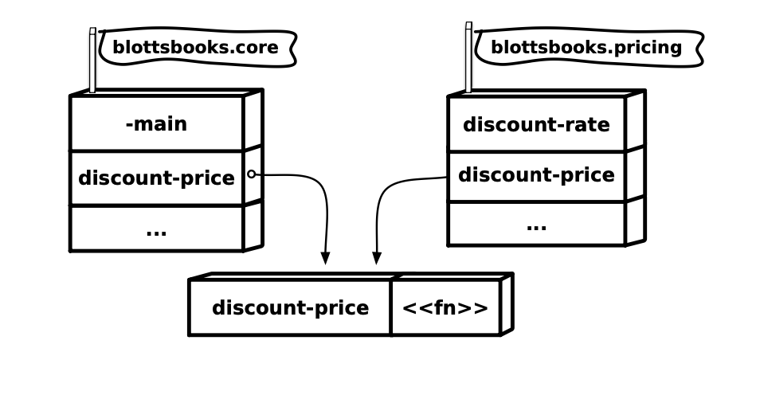

### As and Refer

The downside of using fully qualified names like `blottsbooks.pricing/discount-price` is that they can get long, and long names tend to clutter up your code and make it less readable. Fortunately, Clojure provides a couple of shortcuts to minimize the clutter.

One way you can make your code less noisy is to create an alias for the namespace, like this:

```clojure 
(require '[blottsbooks.pricing :as pricing])
```

or like this:

```clojure
(ns blottsbooks.core
  (:require [blottsbooks.pricing :as pricing])
  (:gen-class))
```

Note that we’re now feeding `require` a three-element vector instead of just the name of the namespace. As shown in the "figure on page 101", the extended version of `require` not only pulls in the `blottsbooks.pricing` namespace but also gives it an alias of plain old `pricing`.


Given this, we can now refer to `blottsbooks.pricing/discount-price` as `pricing/discount-price`:

```clojure
(defn -main []
  (println
    (pricing/discount-price {:title "Emma" :price 9.99})))
```


The alias that you supply with `:as` is completely arbitrary. We could have said `[blottsbooks.pricing :as p]` and then called `p/discount-price`. Also keep in mind that the alias created by `:as` is local to the namespace where you evaluated the `require`.

If you want to use the `pricing` alias in a second namespace, you’re going to need a second `require.../:as`. Finally, aliases don’t mask ordinary bindings, so if you did have that `pricing` alias in your namespace you could also have a `pricing` function without a problem.

The `require.../:as` combination should be your first choice when those fully qualified names are getting in the way. In extreme situations you can take things one step further, with `:refer`:

```clojure
(require '[blottsbooks.pricing :refer [discount-price]])
```

As shown in the following figure, when you use `:refer` you are essentially pulling the vars from the other namespace into the current namespace.



That means you don’t have to worry about using fully qualified names or aliases:

```clojure
;; Now that I've done the :refer...
(discount-price {:title "Emma" :price 9.99})
```

While `:refer` might seem like a great way to get to the most concise code possible, there is a danger lurking in all that convenience: what if we already have a `discount-price` function defined? In that case `:refer` will overwrite it. As perilous as this is for application functions, consider that you can also accidentally overwrite standard, Clojure-supplied functions with `:refer`. Who’s up for debugging some code where `first` or `list` has been redefined? Since namespaces exist precisely to prevent these kinds of clashes, you should use `:refer` very sparsely, if at all.

> [!NOTE]
>
> **REPL Prompts**
>
> Now that we’ve looked at namespaces, we can finally resolve the Great REPL Prompt Mystery. REPLs generally include the name of the current namespace in their prompts. If you start a REPL with Leiningen outside of a project directory, your initial namespace will be `user`, and that’s what you will see in your prompt. On the other hand, if you start a REPL from inside of a Clojure project directory, Leiningen will default to the `core` namespace of that project.


