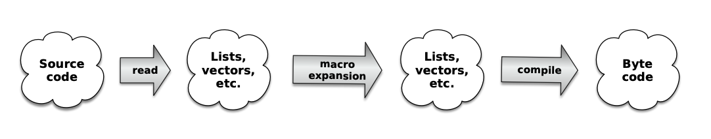

### Macros to the Rescue

We can indeed, but to get it done we need to step back and forget about functions and argument evaluation for a second and think about what we’re trying to do with `arithmetic-if`. What we really want to do is write something like this:

```clojure
(arithmetic-if rating
  (println "Good book!")
  (println "Totally indifferent.")
  (println "Run away!"))
```

but execute something like this:

```clojure
(cond
  (pos? rating)  (println "Good book!")
  (zero? rating) (println "Totally indifferent.")
  :else          (println "Run away!"))
```

Wouldn’t it be great if we could somehow preprocess our Clojure code just before it gets compiled? We could take advantage of the preprocessing step to turn our `arithmetic-if` expression into the equivalent `cond` expression. And since—as we saw in the last chapter—Clojure code is just regular Clojure data, it should be easy to write a function to do the code transformation. In fact, here it is:
              
```clojure    
(defn arithmetic-if->cond [n pos zero neg]
  (list 'cond (list 'pos? n) pos
              (list 'zero? n) zero
              :else neg))
```


There’s not really much to `arithmetic-if->cond`—it’s just an ordinary function that uses some clever quoting to take its arguments and build a codelike list from them. If we feed `arithmetic-if->cond` the right data, making sure we quote all the symbols to prevent stray evaluation, like this:

```clojure
(arithmetic-if->cond 'rating
  '(println "Good book!")
  '(println "Totally indifferent.")
  '(println "Run away!"))
```

we’ll get back a list that looks just like the `cond` statement we’re looking for:

```clojure
(cond
  (pos? rating) (println "Good book!")
  (zero? rating) (println "Totally indifferent.")
  :else (println "Run away!"))
```


This is great, but it doesn’t really help, because all we’ve done so far is to transform some codelike data into different codelike data. But it’s all still just data. If only we had a way to insert `arithmetic-if->cond` into the Clojure compiler, so that it could transform our code just before it gets compiled, then we would be in business.

You’ve probably already guessed the punchline: macros let you do just that.  Here is our transformation recast as a Clojure macro:

```clojure
(defmacro arithmetic-if [n pos zero neg]
  (list 'cond (list 'pos? n) pos
              (list 'zero? n) zero
              :else neg))
```

Notice how `arithmetic-if` looks a lot like an ordinary function definition. In fact, as shown in the figure, macros are just functions, special only in that they are part of the compilation process.




So once we define the `arithmetic-if` macro, we can start using `arithmetic-if` in our code, confident that this:

```clojure
(arithmetic-if rating :loved-it :meh :hated-it)
```

will get turned into this before it’s compiled:

```clojure
(cond (pos? rating) :loved-it (zero? rating) :meh :else :hated-it)
```


> [!NOTE]
>
> **Are You a C Programmer?**
>
> If you are a C programmer, then this macro talk probably sounds familiar. Certainly Clojure’s macros and C’s macros are very closely related. Macros in Clojure do have the pleasant advantage that you write them in Clojure itself and, instead of dealing with program text, they work with Clojure data structures.

The thing to keep in mind about macros is that they are applied to the code, not to the runtime data.

For example, if we defined this simple macro:

```clojure
(defmacro print-it [something]
  (list 'println "Something is" something))
```

and then called it like this:

```clojure
(print-it (+ 10 20))
```

the argument passed to `print-it` would not be `30`. Instead Clojure would pass the list `(+ 10 20)` to `print-it`, which means this is what would actually get compiled:

```clojure
(println "Something is" (+ 10 20))
```

And that—when Clojure actually gets around to running it—would finally resolve to `30`.

