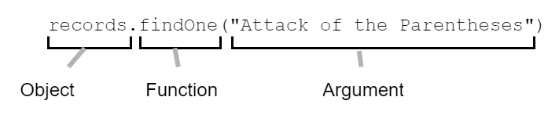
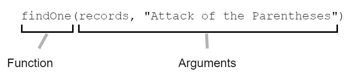
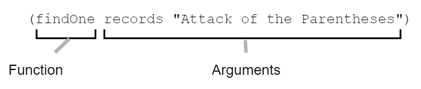
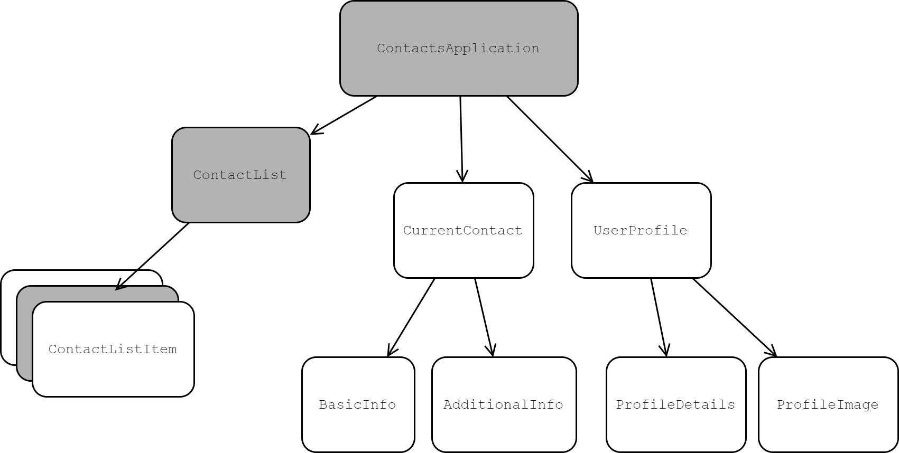

[UP](000_00.md)

### レッスン1：ファーストルック

今日のテクノロジーの世界では、ウェブが王様です。ウェブアプリケーションはどこにでもあり、ウェブの世界共通語はJavaScriptです。シンプルなWebページにインタラクティブ機能を追加したり、複雑なシングルページのアプリケーションを作成したり、さらにはマイクロサービスを作成したりする場合でも、JavaScriptは事実上のツールです。その年齢にもかかわらず、JavaScriptはウェブ開発の全世代を強化するために進化してきました。また、JavaScriptのコミュニティは、これまでで最も活発で豊富なソフトウェア開発コミュニティの1つであり、考えられるあらゆる用途のためのライブラリやフレームワークを備えています。

-----
このレッスンでは

- ClojureScriptとは？
- ClojureScriptの特徴は？
- JavaScriptよりもClojureScriptの方が解決しやすい問題とは？
-----

しかし、JavaScriptにも悪いところがないわけではありません。何が「良い部分」で、何が「避けた方が良い部分」なのかを教えてくれる本が必要です。また、ブラウザによってサポートレベルが異なるという現実にも対処しなければなりません（現在もそうですが）。私たちは、次のプロジェクトで多くの実行可能なUIフレームワークの中からどれを使うべきか、また、最初に選んだフレームワークに不満を感じたらどのフレームワークに切り替えるべきかを決めるために、精神的なサイクルを費やす必要があります。JavaScriptは大規模なWeb開発の課題に対応するために成熟してきましたが、新しいプロジェクトでは別の言語を選択したほうがよい場合もあります。

本書では、ClojureScriptというプログラミング言語を学び、大規模なシングルページのアプリケーションの開発にいかに適しているかを見ていきます。すべての括弧に慣れるまでには時間がかかるかもしれませんが、この奇妙な言語がモジュール式の高性能なユーザーインターフェースの構築に優れていることがわかります。最後に、シンプルでエレガントな言語であるため、ClojureScriptを使うのがいかに楽しいかを説明します。

#### ClojureScriptの紹介

ClojureScriptは、基本的なレベルでは、JavaScriptにコンパイルされるClojureプログラミング言語の方言です。Clojureは2008年にRich Hickey氏によって、実用的で安全でシンプルであることを目標とした汎用プログラミング言語として開発されました。ClojureはもともとJava Virtual Machineのバイトコードにしかコンパイルできませんでしたが、2011年にClojureをクライアントサイドのWeb開発に導入するためのオプションとしてClojureScriptが登場しました。ClojureとClojureScriptの間にはいくつかの違いがありますが、それらは主に異なるプラットフォーム上で動作する同じ言語です。ClojureScriptは、Clojureの実用性、安全性、そしてシンプルさを継承しています。

ClojureScriptは、不変のデータ構造、関数型プログラミング、Lispなど、無名の学術的な言語のすべての流行語を持っています。- しかし、この言語がアカデミックのために設計された言語であると考えてはいけません。ClojureScriptは、私たちJavaScriptプログラマーが最も困っている問題を解決するために生まれた、非常に実用的な言語です。ClojureScriptは、大規模なアプリケーションを構築・保守する際に遭遇する問題点を特に解決します。ClojureScriptは、非同期プログラミング、状態管理、高レベルの抽象化などの解決策を提示して成功を収めており、ClojureScriptの特定の機能を模倣した多くのJavaScriptライブラリが登場しています。Clojureは実用的な言語であり、特にクライアントサイドのWeb開発に適しています。

実用的な言語であるだけでなく、ClojureScriptは書いていてとても楽しい言語でもあります。同じ定型文を何度も書くことに慣れてしまった私たちにとって、ClojureScriptのような言語の簡潔さは新鮮な息吹です。さらに、ClojureScriptには、JavaScriptよりもはるかに充実した標準ライブラリが付属しているので、カスタムコードやサードパーティのライブラリを必要とするような単純な作業でも、コアのClojureScriptから離れることなく達成できることが多いのです。

ここでは、ClojureScriptをJavaScriptとは異なるものにしている多くの特徴を見ていきますが、ClojureScriptがまったく異質な言語であると考えるべきではありません。最初の「カッコショック」の後、その構文は実際にはJavaScriptのそれよりもシンプルであることがわかります。この言語がどのように構成されているかを知るために、JavaScriptからClojureScriptに翻訳されたコードの例をいくつか見てみましょう。下の図は、JavaScriptの関数呼び出しの例です。JavaScriptはいくつかの異なるスタイルで書くことができるので、オブジェクト指向の例と関数型の例を見ていきます。



オブジェクト指向によるJavaScriptの関数呼び出し

このオブジェクト指向のスタイルは、ほとんどのJavaScriptプログラマーにとって非常に馴染みのあるもので、ほとんど説明を必要としません。次に紹介するのは、おそらくあまり馴染みのない関数型スタイルです。このスタイルは lodash や類似のライブラリで広く使われています。



関数的なJavaScriptの関数呼び出し

次に、同じ例のClojureScript版を見てみましょう。ClojureScript版には、JavaScript版と同じ数の括弧があることに注目してください。実際、関数型JavaScriptのコードとの唯一の違いは、左の括弧が左に移動していることと、引数の間にカンマがないことです。



ClojureScriptの関数呼び出し

これは些細な例ですが、ClojureScriptが怖くないことを理解するには十分でしょう。これからのレッスンで見ていくように、ClojureScriptを読むためには目を慣らす必要がありますが、そのプロセスは新しいライブラリやプログラミング技術を学ぶのとそれほど変わりません。

**クイックレビュー**

- ClojureScriptとJavaScriptでは、ClojureScriptの方が標準ライブラリが充実していますか？
- ClojureScriptはlodashやramdaのような機能的なスタイルではなく、オブジェクト指向のスタイルを推奨していますか？

#### ClojureScriptのスイートスポット

ClojureScriptは汎用のプログラミング言語ですが、すべての仕事に最適なツールというわけではありません。ウェブページ上の1つまたは2つの要素をアニメーション化したり、アナリティクスのスニペットを実装したりするだけなら、ClojureScriptはおそらく過剰です(実際、そのような単純な例では、jQueryでさえ過剰かもしれません)。では、いつClojureScriptを使い、いつJavaScriptを使うかをどのように判断すればよいのでしょうか。あるプロジェクトでClojureScriptを使うかどうかを決めるためには、ClojureScriptが得意とするプロジェクトの種類を把握しておく必要があります。

##### シングルページのアプリケーションを書く

Clojureは、JVM用の汎用アプリケーションプログラミング言語としてスタートしましたので、ClojureScriptの伝統はアプリケーションプログラミングに基づいています。実際、ClojureScriptの価値を高めている構成要素は、まさにアプリケーションタイプのプログラムに必要なものであることがわかります。具体的には、ClojureScriptは、小さな悩みから始まり、アプリケーションが成長するにつれて大きな問題へとエスカレートするJavaScriptの問題を解決します。大規模なJavaScriptアプリケーションを管理したことがある人なら、戦略的なアーキテクチャ、モジュールの読み込み、クロスブラウザの互換性、ライブラリの選択、ツールなど、さまざまな問題を同時に解決することがいかに難しいかを知っています。

JavaScriptの問題点は、これらの問題をそれぞれ個別に解決しなければならないことですが、ある問題を解決するための選択が他の問題に影響を与える可能性があります。例えば、私たちが使用しているモジュールシステムは、ビルドツールとは別の問題であり、テストフレームワークとも別の問題です。しかし、ビルドツールがテストフレームワークをサポートしていること、そして両方がモジュールシステムをサポートしていること、または簡単に統合できることを確認する必要があります。突然、素晴らしいアプリを書こうと思っていたのに、ビルドのセットアップに3日もかかってしまったことで、そのアプリは頓挫してしまいました。このようなシナリオは、個人的に何度も経験しているので、ありふれていると言えるでしょう。

逆説的に言えば、ClojureScriptは選択肢を奪うことで物事を簡単にします。モジュールシステムは、言語に組み込まれています。テストフレームワークが組み込まれています。ほとんどのライブラリは、関数型のスタイルで一般的なデータ構造を扱うAPIを提供しているので、統合が簡単です。さらに、内蔵されているGoogle Closureライブラリは、日付の扱い、DOM操作、HTML5の履歴、グラフィック、ajaxなど、ほとんどの一般的な関心事をカバーします。ClojureScriptアプリケーションの構築は、JavaScriptアプリケーションの構築ほどの冒険ではありませんが、より生産的であることは確かです。

##### UIの最適化

ClojureScriptの不変のデータ構造により、興味深いUIの最適化が可能であることを言及しましたが、その仕組みについては詳しく説明していません。実際には、Reactの仮想DOMコンセプトとClojureScriptの不変のデータ構造の組み合わせによって、このような最適化が可能になります。ClojureScriptのデータ構造は不変であることがわかっているので、作成した構造は変更できないことがわかります。UIコンポーネントをバックアップするデータ構造がある場合、同じデータ構造がバックアップされている限り、コンポーネントを再レンダリングする必要がないことがわかっています。この知識があれば、高度に最適化されたUIを作ることができます。

例えば、連絡先管理アプリを作成していて、`ContactListItem`コンポーネントを含む`ContactList`コンポーネントがあります。これらのコンポーネントは、すべて連絡先のリストでバックアップされており、連絡先が変更されるたびに再レンダリングする必要があります。JavaScriptフレームワークを使用してコンポーネントを書いていた場合、変更を追跡できるようにフレームワークが提供する特別なオブジェクトの中にデータを置くか、ダーティチェックのメカニズムを使用して定期的に変更する必要があるものを見つけるか、すべてをDOMのメモリ内表現にレンダリングし、変更があれば実際のDOMにレンダリングする必要があります。ClojureScriptコミュニティは最後の方法を採用していますが、実際にはClojureScriptの方が良い話です。なぜなら、仮想DOMにレンダリングする必要のあるコンポーネントを選択することができ、追加のCPUサイクルを節約することができるからです。



不変のデータ構造によるUIの最適化

この例では、`contact`が変更されるたびに、その連絡先をモデリングするマップを完全に置き換えます。`contacts`リストが完全に新しいオブジェクトになっているため、仮想DOMにレンダリングするときに、`ContactList`は再レンダリングされます。`ContactListItem` コンポーネントのうち、編集した連絡先を反映しているものだけが再レンダリングされます。残りの`ContactListItem`は、基礎となるデータが変更されていないことがすぐにわかるので、行うべき作業はありません。さらに、アプリケーションの他の部分もレンダリングする必要はありません。この最適化は些細なことのように聞こえるかもしれませんが、アプリケーションのパフォーマンスに劇的な影響を与えることができることを後ほど説明します。

##### 非同期の近代化

JavaScriptは現在、非同期プログラミングを実現するための望ましい方法として、プロミスライクオブジェクトを扱うためのファーストクラスの構文である`async/await`を採用しています。未だに生のプロミスやコールバック、ジェネレーターを見かけることがありますが、`async/await`は多かれ少なかれ普遍的なものになっています。

一方、ClojureScriptでは、CSP(Communicating Sequential Processes)と呼ばれる非同期プログラミングのスタイルを採用しています。これは、Goプログラミング言語で効果を発揮した非同期のスタイルと同じです。CSPでは、プロミスやコールバックを直接扱うことはありません。その代わりに、値を考え、チャネルを介してそれらを渡します。チャネルとは、複数の値を配信できるストリームやプロミスのことだと思ってください。また、非同期コードを同期コードのように書くことができるので、非同期コードを書く際の認知的負荷を大幅に軽減することができます。リクエストを実行したり、入力を逐次または並列に取得することはどちらも自然なことです。ClojureScript開発者の中には、非同期をClojureScriptがJavaScriptに勝る唯一の最も重要な利点と考える人もいます。この本の後半で実際に見たときに自分で判断しなければなりませんが、非同期についてのまったく新しい考え方を可能にすることを知っておいてください。

##### デザインのモジュール化

JavaScriptが登場したばかりの頃は、おそらく1つのJavaScriptファイルを書いて、それをウェブサイトのすべてのページに含めることで、そのサイトで必要なスクリプトをすべてカバーしていたでしょう。ファイルが大きくなりすぎたり、ページによって必要な機能がまったく異なる場合は、複数のJavaScriptファイルを書いて、該当するページに入れていたと思います。そのうち、「Module Pattern」や「Revealing Module Pattern」という言葉を耳にして、コードを狭い範囲のモジュールに分け、1つのモジュールに1つのファイルを使うようになったかもしれません。そうすると、まだ存在しないモジュールを参照しようとしないように、ページ上ですべてのファイルを正しい順序で読み込むことを気にしなければなりません。この時点で、必要なモジュールだけを非同期的にロードし、正しい順序でロードすることができるモジュールローダーの話を聞いたことがあると思います。また、すべてのモジュールを1つのファイルに連結してデプロイすることもできました。問題は、AMD、CommonJS、ES2015など、モジュールローディングに関する複数の規格が競合していたことでした。今日でも、モジュールをプロセスに統合するための適切なツールを見つけることは困難であり、すべてのチームには、デプロイメントのためにコードをバンドルする際の問題点を知っているWebpackのエキスパートが少なくとも1人は必要です。

一方、ClojureScriptは、コンパイルされた言語であるという利点があり、追加の複雑さなしに独自のモジュールシステムを提供することができます。ClojureScriptは、関数やデータの名前付きコレクションである名前空間を使用してコードを整理します。読み込み順序、循環依存の防止、本番用に単一のアセットにコンパイルすることは、すべて標準のコンパイラツールチェーンに含まれています。さらに、ClojureScript コンパイラは、Google Closure モジュールを出力し、それを Google Closure コンパイラに渡すことで、デッドコードパスの排除など、さらなる最適化を行うことができます。言語レベルで優れたモジュールシステムを持っていると、新しいプロジェクトのセットアッププロセスが非常に簡単になります。

**クイックレビュー**

- 次のプロジェクトのうち、ClojureScriptが適しているのはどれですか？
  - CMSのダッシュボードのようなシングルページのアプリ
  - 静的なページにアニメーションを追加する
  - 複雑な非同期のユーザーインタラクションを伴うウェブベースのゲーム
  - CPUに負荷のかかる数値計算のシミュレーション
- ClojureScriptは、JavaScriptと同じモジュールシステム(CommonJS、ES2015)を使用していますか?

#### ClojureScript 101

さて、ClojureScriptがフロントエンドのWeb開発にもたらす利点のいくつかを見てきましたが、一歩下がってClojureScriptの特徴を調べてみましょう。コードを書く方法を大幅に改善することを約束する技術には、新しいコンセプトがつきものです。そして、どんな新しい概念でもそうですが、習得への第一歩は親しみです。それでは早速、ClojureScriptの特徴を見ていきましょう。

##### JavaScriptにコンパイルできる言語

2008年当時、クライアントサイドのWebプログラミングを行うとしたら、JavaScriptしか選択肢がありませんでした。その後数年間で、JavaScriptをコンパイルする言語が登場し始めました。これらの言語は、JavaScriptの残骸を整理したり、JavaScript自体にはない機能を追加したりしていました。これらの言語の中には、JavaScriptの感触を多く残した控えめなアプローチのものもありました。他の言語は、研究用言語のカテゴリーに入る、JavaScriptからの急激な脱却でした。ClojureScriptは、JavaScriptを大幅に改良するとともに、プロフェッショナルな使用を目的とした言語に必要なコミュニティのサポートを維持しています。

JavaScriptにコンパイルされる他の言語に加えて、私たちの多くはJavaScriptの新しいバージョンを古いバージョンにコンパイルすることで、主要なブラウザでサポートされる前にJavaScriptをより生産的で楽しいものにする言語機能を利用しているという事実を考慮する必要があります。ES2015標準規格を皮切りに、JavaScriptは最近のプログラミング言語から多くの優れたアイデアを蓄積してきましたが、新しい機能は常にブラウザが採用するよりも早く導入されるため、私たちが「最新のJavaScript」を使うには少なくとも1年はかかりますし、残念ながらJavaScript自体をコンパイル・トゥ・js言語として扱わなければなりません。多くの分野では、このような複雑さは狂気の沙汰とみなされますが、ウェブ開発ではこれが現状です。絶え間なく変化するJavaScriptとは対照的に、ClojureScriptは言語として驚くほど安定しており、イノベーションの多くは言語そのものではなくライブラリで起こっています。

他のコンパイル・ツー・js言語と同様に、ClojureScriptが存在するということは、JavaScriptでは十分ではないということを表明しているのです。CoffeeScriptは、JavaScriptの冗長で一貫性のない構文に対応しています（結局、1週間ほどで書かれました）。TypeScript、Dart、PureScriptは、型システムの欠如に対処し、開発者がコードをよりよく推論できるようにしています。JavaScript自体は言語の老朽化に対応しており、以前のバージョンとの類似性を維持しつつ、より現代的な機能をもたらし、古いJavaScriptアプリケーションを移行するための簡単な方法を提供しています。ClojureScriptは、よりシンプルなシンタックス、一連のバグを排除するデータ構造の武器、非同期プログラミングのためのより良いパラダイム、そして最も人気のあるUIフレームワークの1つ（React）との優れた統合をもたらします。要するに、ClojureScriptは、JavaScriptよりも優れた汎用フロントエンド言語になろうとしています。

##### シンプルな言語

JavaScriptはカメレオンのような言語です。命令型、オブジェクト指向型、関数型のいずれかのスタイルでコードを書くことができるだけでなく、同じコードベースの中でこれらすべてのスタイルを混在させることも可能です。配列の反復処理のような単純なタスクを考えてみても、これを達成するためにはかなり多くの方法があり、そのどれもがJavaScriptではかなり慣用的です。もし私たちが命令型のスタイルに最も慣れているのであれば、`for`ループを使って配列の各要素に手動でアクセスすることができます。一方で、`Array.prototype.forEach()`関数を使用することもできます（古いブラウザへの対応を気にしなくてよい場合）。最後に、すでにプロジェクトでlodashを使用している場合は、そのヘルパー関数を使用することもできます。これらの方法は、以下に示すように、ほとんどのJavaScriptプログラマーにとって馴染みのあるものだと思います。

```JavaScript
const numbers = [4, 8, 15, 16, 23, 42];

for (let num of numbers) {
  // <1>
  console.log(`The number is ${num}`);
}

numbers.forEach(
  // <2>
  (num) => console.log(`The number is ${num}`)
);

const printNum = (num) => {
  // <3>
  console.log(`The number is ${num}`);
};
_.each(numbers, printNum);
```

JavaScriptでの配列の反復処理

1. Imperative
2. オブジェクト指向
3. 関数型

同じコードベースの中に複数のプログラミングスタイルを共存させることよりも問題なのは、JavaScriptの「悪い部分」、つまり技術面接の質問でよく出てくる癖です。開発者が初めてJavaScriptを学ぶときには、避けなければならない落とし穴がいくつもあります。私たちは、よりシンプルな言語を選ぶ余裕がなかったために、JavaScriptによってもたらされた複雑さのすべてと共存することを学んできたのです。JavaScriptsの奇妙な点を部分的に挙げてみて、これほど多くの落とし穴のない言語を採用した方が良いかどうか考えてみましょう。

- 変数昇格
- 複数の`this`設定方法
- == と ===
- void演算子
- 'ba' ++ 'n' + 'a' + 's'。
- `xs.push(x)`は何を返す？ `xs.concat([x])`は？

JavaScriptの複雑さを考えると、非常に慎重にコーディングしないと、これらの癖に噛まれてしまう危険性があることがわかります。単純なアプリケーションであれば、このようなことにも耐えられるかもしれませんが、コードベースが大きくなるにつれて、よりシンプルな言語の価値が明らかになってきます。不必要な複雑さを排除して一貫したコードベースを維持するには、多大なスキルと規律が必要です。世の中には、必要なスキルと規律を持った熟練のJavaScript開発者がたくさんいますが、アプリケーションレベルで良いJavaScriptを書くのが難しいという事実は変わりません。ありがたいことに、ClojureScriptはよりシンプルな選択肢であり、確かに学習曲線を伴いますが、一般的には、最終的に最も価値があると証明されるのは、より険しい学習曲線を持つものです。

JavaScriptが多様なプログラミングスタイルを促進することを見てきましたが、ClojureScriptは意見がはっきりしていて、関数型のプログラミングを容易にするように設計されています。実際、慣用的なClojureScriptは、関数型スタイルで書かれたJavaScriptによく似ていますが、式は少ないことがわかります。以下は、JavaScriptの配列に似ているベクターを反復処理する例です。

```Clojure
(def numbers [4, 8, 15, 16, 23, 42])

(doseq [n numbers]
  (println "The number is" n))
```
ClojureScriptでのベクトルの反復処理

JavaScriptのコードのように、これは一連の数字を定義し、それぞれの数字に対してコンソールにステートメントを記録します。doseqが特定のオブジェクト・プロトタイプに接続されていないことを除けば、オブジェクト指向のバージョンにもよく似ています。しかし、これは、いくつかのマイナーなバリエーションとともに、ClojureScriptでコレクションを反復処理する必要があるときに、どのように見えるかを期待することができます。いつでも。

##### 強力な言語

プログラミング言語には、デフォルトでどれだけの機能を盛り込むかというスペクトラムがあります。一方では、CPUの命令に直接変換し、「標準ライブラリ」を持たないアセンブリ言語があり、もう一方では、その問題領域内のほとんどのタスクを達成するために必要なすべての機能を含む高度に専門化された言語があります。フロントエンドのWebプログラミング言語といえば、JavaScriptはスパルタンな傾向にあり、ClojureScriptは「バッテリー付き」で高レベルのツールをデフォルトで提供する傾向にあります。様々なコアデータ構造と広範なコレクションAPI、言語自体の拡張を可能にするマクロ、そしてデフォルトで利用可能なGoogle Closureライブラリ全体の間で、ClojureScriptはアプリケーションを構築するためのより強力なツールを提供します。


プログラミング言語のスペクトル

ClojureScriptが提供する抽象化は、JavaScriptが提供するものよりも高レベルであり、ほとんどのコードをより簡潔かつ記述的に書くことができます。JavaScriptが数値、文字列、配列、オブジェクト、簡単な制御構造を提供する一方で、ClojureScriptは同様のプリミティブに加えて、キーワード、リスト、ベクトル、セット、マップ、プロトコル、レコード、マルチメソッドを提供します。これらが何なのかわからなくても心配はありません。ツールが増えたことで、学ぶべきことが増えた一方で、新しいライブラリを学んだり、独自のデータ構造や汎用アルゴリズムを書いたりする機会が減ったことも意味しています。

##### 関数型言語

好き嫌いは別として、ClojureScriptは関数型プログラミングの概念を取り入れています。「関数型プログラミング」というと敷居の高いアカデミックな話題のように聞こえるかもしれませんが、恐れることはありません。関数型プログラミングの概念のほとんどは、JavaScriptを日常的に使っている私たちにとって、少なくともある程度は馴染みのあるものであることがわかります。JavaScriptはScheme（ClojureScriptと同じ関数型Lisp）に大きな影響を受けているので、これは驚くべきことではありません。関数型プログラミングは、JavaScriptでサポートされている3つの主要なプログラミングスタイルの1つで、入力値から出力値へのマッピングという数学的な意味での関数の使用に重点が置かれています。

| パラダイム | 説明 | キーコンセプト|
|:-----------|:-----|:--------------|
|インペラティブ  | プログラムは、プログラムの状態を変更したり、入力を受け取ったり、出力を生成したりすることができる一連のステートメントとして記述されています。 | 変数、ループ、代入、ステートメント、サブルーチン|
|オブジェクト指向|オブジェクト、その動作、および相互作用の観点から、実世界をモデル化します。|オブジェクト、クラスまたはプロトタイプ、メソッド、メッセージ、オブジェクトグラフ|
|関数型          |プログラムとは、ある入力値からある出力値への変換を、構成可能な関数を用いて行うものと説明します。|純粋な関数、不変の値、高次の関数|

JavaScriptプログラミングパラダイムの比較

JavaScriptにおける関数型プログラミングは勢いを増していますが、私たちが目にするコードの大半は命令型またはオブジェクト指向型です。関数型プログラミングの詳細については触れませんが、ClojureScriptでは、渡された引数やグローバルな状態を変更することなく、データを受け取り、新しいデータを返す小さな関数を組み合わせてプログラムを構築することに重点を置いています。

このように関数を書くことの大きな特徴は、同じ引数で関数を呼び出しても、常に同じ結果が得られることです。これは関数にとって重要ではない特性のように思われるかもしれませんが、テストやデバッグが非常に容易になります。プログラムの大部分が純粋な関数として書かれていれば、テストは何の設定もなく書くことができます。オブジェクト指向システムの典型的なテスト方法とは対照的に、多くのオブジェクトを構築し、テストの前に適切な状態にしなければなりません。

**クイックレビュー**

- ClojureScript言語は安定していますか？どうしてですか、どうしてですか？
- ClojureScriptがJavaScriptを改良する方法を少なくとも3つ挙げてください。
- シンプルさと親しみやすさの違いは何ですか？JavaScriptのシンプルではない部分とは何ですか？
- ClojureScriptとJavaScriptのどちらがより高い抽象度で動作しますか？
- JavaScriptで一般的な3つのプログラミングスタイル（命令型、オブジェクト指向、関数型）のうち、ClojureScriptではどれを推奨していますか？

#### まとめ

ClojureScriptは、特にフロントエンドのWeb開発において、非常に便利な言語です。ClojureScriptは、JavaScriptの関数型プログラミングの概念の多くを共有していますが、よりシンプルで生産性の高い言語です。ClojureScriptはカッコだらけで異質に見えるかもしれませんが、カッコだらけの表面の下では、JavaScriptと多くの共通点があります。私たちは今、理解しなければなりません。

- ClojureScriptとは何か、JavaScriptとの違いは何か
- どのようなアプリケーションがClojureScriptに最も適しているか

[UP](000_00.md)
