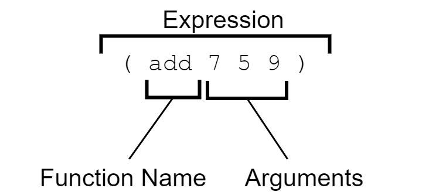

[UP](000_00.md)

### レッスン3：ビルディングブロック

ClojureScriptとは何か、なぜそれが重要なのかを理解した上で、言語の基本を概観することから旅を始めます。慣れない言語を学ぶ際の最大のハードルの1つは、構文を理解することです。概念的なレベルでは言語間で大きな共通点がありますが、その概念を表現する方法は全く異なる場合があります。次の2つのレッスンでは、ClojureScriptのコードを読むという基本的なスキルに磨きをかけていきます。JavaScriptに比べて非常にシンプルな構文であっても、（JavaScriptを含む）Cのような言語に身を置いてきた多くのプログラマーにとっては、非常に珍しいものに見えます。ClojureScriptを読むスキルは、今後のレッスンで長いコードサンプルを簡単に読めるようになるために大いに役立ちます。

-----
**このレッスンでは**

- ClojureScriptの構文の基本を学びます。
- すべての括弧の目的を理解する
- 言語に組み込まれている中核的なデータ型を調査する
-----

まず、このレッスンでは、言語の最も一般的な構文要素を調査し、次のレッスンでは、ClojureScriptのコードが実際にどのように評価されるかを見ていきます。評価モデルを理解することで、読むコードを理解し、期待通りのコードを書くことができるようになります。ClojureScriptは非常に小さな言語であり、JavaScriptよりもはるかに小さいため、理解するのは非常に簡単です。外国語の構文であるにもかかわらず、言語の構文要素が比較的少ないため、驚くほど早く慣れ親しむことができます。

#### 括弧、括弧、どこでも！？

これまでのレッスンの例で見てきたように、ClojureScriptのコードには括弧がたくさんあります。多くの人にとって、この言語のこの1つの側面が、ClojureScriptを厄介なものにしています。括弧は、1つのコードを他のコードと区別するために使われる主要な記号です。JavaScriptをはじめとするC言語系の言語では、括弧と中括弧の両方が使われています。括弧は関数のパラメータを示したり、演算の順番を指定したりするために使われ、中括弧は関連するステートメントのブロックを区切るために使われます。最初の「括弧ショック」を乗り越えれば、ClojureScriptはシンプルでエレガントにさえ見えてきます。

##### 式と関数の評価

ClojureScriptでは、評価されるべき式を示すために括弧を使用します。次のレッスンでは、この**S式**と呼ばれるものについてもっと詳しく見ていきますが、非常に重要なものなので、少なくともここでは触れておかなければなりません。高いレベルでは、すべてのClojureScriptプログラムは基本的に次のような形をしています。

###### ClojureScriptプログラムの概要

```Clojure
(some-function arg1 arg2 ...)
```

開いた括弧があると、コンパイラが次に期待するのは、呼び出し可能なもの（通常は関数）です。次の閉じた括弧までの他のすべてのものは、引数であることが期待されます。



シンプルな式

同じ一般的な構造をJavaScriptで記述すると、以下のようになります。

```JavaScript
someFunction(arg1, arg2, ...);
```
ClojureScriptとJavaScriptのコードはどちらも、いくつかの関数があって、それがいくつかの数の引数で呼び出されるべきことを示しています。JavaScriptのコードでは、関数の名前を最初に置き、その後にいくつかの引数を括弧で囲んで関数呼び出しを示しますが、ClojureScriptでは、関数名とその引数の両方を括弧で囲んで同じことを示します。

#### コアデータ型

ClojureScriptには、数字、文字列、ブーリアンなど、他のプログラミング言語で期待されるすべてのプリミティブなデータ型があります。これらの単純な値をスカラーと呼びます。さらに、JavaScriptの配列やオブジェクトのように、この言語にはさまざまな便利なコレクション型があります。これらのコレクションは頻繁に使用されるため、それらを表現する特別な構文があります。それぞれのデータ型について説明する前に、参考のためにデータ型の一覧を挙げておきましょう。次の表は、リテラルの構文表現を持つデータ型の一覧で、簡単な説明とコードでの表現例を示しています。

ClojureScriptデータリテラル

|データ型|説明|例|
|:------|:---|:--|
|数値|整数または浮動小数点数|`17.4`|
|文字列|テキストデータ|`"Today is the first day..."`|
|文字|テキストデータ|`\a`|
|真偽値|論理的な真/偽|`true`|
|キーワード|軽量化された識別子|`:role`|
|シンボル|ClojureScript内部でよく使われる識別子|`'cljs-is-awesome`|
|リスト|効率的な探索を可能にする順序付きコレクション|`'(1 3 5 7 9)`|
|ベクタ|インデックスによる効率的なアクセスを可能にする順序付けされたコレクション|`[0 2 4 6 8]`|
|マップ|一意のキーと値を関連付ける順序なしのコレクション|`{:name "kayleigh", :age 29}`|
|セット|一意の値を持つ順不同のコレクション|`#{true "ubiquity" 9.2}`|
|nil|空を表す値|`nil`|
|オブジェクト|JavaScriptオブジェクト - 相互運用に使用|`#js {"isJs" true, "isImmutable" false}`|
|配列|JavaScriptの配列 - 相互運用のための使用|`#js ["Lions" "Tigers" "Bears"]`|

ここでは、ClojureScriptのコードに含まれるさまざまな要素を識別できるように、各データタイプを順に見て、その使用例をいくつか紹介します。

###### 数値

ClojureScriptは、JavaScriptのNumberプリミティブを使用しているため、JavaScriptとまったく同じ整数および浮動小数点数をサポートしています。以下は、ClojureScriptが有効な数値として認識するさまざまなフォーマットの例です。

**数値**

```Clojure
32                                                         ;; <1>

012                                                        ;; <2>

0xbeef                                                     ;; <3>

0.6                                                        ;; <4>

1.719493e3                                                 ;; <5>

-0.12e-4                                                   ;; <6>
```

1. 10進数の整数
2. 先頭の0から始まる8進数
3. 0xで始まる16進法の整数
4. 浮動小数点数
5. 指数付き浮動小数点数
6. 符号と指数を持つ浮動小数点数

##### 文字列

文字列は数値と同様、JavaScriptのプリミティブを使用します。しかし、ClojureScriptの文字列構文は、JavaScriptのものよりも制限されています。特に、文字列は二重引用符で囲む必要があります。二重引用符やその他の特殊文字は、バックスラッシュでエスケープされます。

**文字列**

```Clojure
"Quick! Brown foxes!"                                        ;; <1>

\a                                                           ;; <2>

"Column 1\tColumn 2"                                         ;; <3>

"foo
bar"                                                         ;; <4>
```

1. 単純な文字列
2. 一文字の文字列は、バックスラッシュで囲まれた文字で表現されます。
3. 特殊文字を含む文字列
4. 複数行にまたがる文字列

##### 真偽値

ClojureScriptでは、JavaScriptの真偽値も使用します。真偽値は`true`か`false`しかありませんので、ここでは例示を省略します。

##### キーワード

ここでは、JavaScriptに相当するものがないデータ型を取り上げます。キーワードは、名前の前にコロンを付けて表します。キーワードは自分自身に評価され、同じ名前の2つのキーワードは等しいとみなされます。キーワードの興味深い特性の1つに、関数として使用できることがあります。関数として使用する場合、キーワードは引数としてマップを想定しており、それがキーとなっているマップ内の値を返します。キーワードが2つのコロンで始まる場合、現在の名前空間がキーワードの前に付加されます。

**キーワード**

```Clojure
:a-keyword                                                  ;; <1>

::namespaced-keyword                                        ;; <2>

:explicit-ns/keyword                                        ;; <3>

{:name "Bill", :type "admin"}                               ;; <4>

(:type user)                                                ;; <5>
```

1. シンプルなキーワード
2. 暗黙の名前空間を持つ - :cljs.user/namespaced-keyword の略語。
3. 明示的な名前空間を持つ
4. マップのキーとして使用
5. マップ検索を行う関数として使用される

##### シンボル

シンボルは、ClojureScriptが派生したプログラミング言語のLispファミリーと密接に関連しているため、興味深いデータ型です。シンボルは、通常、他のオブジェクトに評価される名前です。私たちは、ほとんどの例でシンボルを意識せずに見てきました。

```Clojure
my-function                                                 ;; <1>

first                                                       ;; <2>
```

1. ユーザー定義変数を参照するシンボル
2. 組み込み関数を参照するシンボル

ClojureScriptのデータ型の中で、シンボルはおそらく最も理解しにくいものです。シンボルは非常にメタ的な性質を持っており、他の身近な概念に直接対応していません。アプリケーションコードではあまり使われないので、他のデータ型のようにシンボルを深く掘り下げることはしません。

##### リスト

リストは括弧の中にいくつかの式を入れたものです。しかし、s式も同じように書かれていることを覚えておいてください。そのため、s式として評価してはいけないリストは、その前に引用符を付けて指定します。興味深いことに、ClojureScriptのコードは実際にはリストで構成されています。

**リスト**

```Clojure
(+ 1 2 3 4)                                                 ;; <1>

'(+ 1 2 3 4)                                                ;; <2>

'(some data)                                                ;; <3>

'()                                                         ;; <4>
```

1. 式として解釈され、評価されるリスト
2. リストをシングルクォートで始めることで、リストの評価を妨げる
3. リストは任意のClojureScriptデータタイプを含むことができます。
4. 空のリスト

##### ベクター

ベクターは、角括弧内に含まれる複数の式で構成されます。ClojureScriptはベクターに遭遇すると、それをデータ構造として解釈し、関数呼び出しとして評価しようとはしません。ベクターは、JavaScriptの配列と同様の方法で使用され、ClojureScriptで最も一般的なデータ構造です。ベクターは、関数が受け取る引数を列挙するのにも使われます。

**ベクター**

```CLojure
[]                                                          ;; <1>

["Alice" "Bob" "Carol"]                                     ;; <2>

(defn say-hello [name]                                      ;; <3>
  (println "Hello," name))
```

1. 空のベクトル
2. 文字列のコレクションを定義するためのベクター
3. 関数の引数リストを定義するためのベクター

##### マップ

マップは、JavaScriptのオブジェクトのようなコレクションです。一意のキーと値を関連付け、その後、キーによって値を検索することができます。マップの構文は、JavaScriptのオブジェクトと似ており、波括弧の中にいくつかのキーと値のペアを入れて構成されます。ペアの区切りには、カンマか改行が使われます。カンマはClojureScriptではホワイトスペースなので、省略されることがよくあります。

**マップ**

```Clojure
{}                                                          ;; <1>

{"product" "Self-Sealing Stem Bolt"                         ;; <2>
 "sku" "DS9-SB09"
 "stock" 212}

{:name "Jorge", :age 29}                                    ;; <3>
```

1. 空のマップ
2. 文字列をキーとするマップ
3. キーワードをキーとするマップ

##### セット

セットは、ユニークな要素を集めた順不同のコレクションです。重複を避けたい場合や、ある要素がコレクションに含まれているかどうかを素早く判断する必要がある場合によく使用されます。セットは、任意の数の要素を中括弧で囲んで宣言します。中括弧の前にはシャープ記号が付いています。

**セット**

```Clojure
#{}                                                         ;; <1>

#{"admin" "editor" "author" "subscriber"}                   ;; <2>
```

1. 空のセット
2. 複数のユニークな文字列を含むセット

独自の構文を持つデータ構造の中で、セットはおそらく最も使用頻度の低いものです。しかし、一見するとマップとよく似ているので、見分けられるようにしておくことは重要です。

##### Nil

Nilは空の値で、常に`nil`と書かれます。JavaScriptでは`null`に相当し、booleanとして使用する場合は`false`と同じ働きをします。

JavaScriptの相互運用フォームについては後のレッスンで説明しますので、ここでの説明は後回しにします。

**クイックレビュー**

- JavaScriptのオブジェクトに最も似ているコレクションタイプは？
- JavaScriptの配列に最も似ているコレクションタイプはどれですか？
- 興味のある分野のClojureScriptライブラリをググって、ソースコードに目を通してみてください。ほとんどの構文要素を識別できますか？

#### まとめ

このレッスンでは、ClojureScriptのコードを初めて実際に体験し、言語の基本構造とコアデータ型を調査しました。また、ClojureScriptの中心的な構成要素である式を初めて見ました。実際、式は非常に重要なので、次のレッスンでは式について学びます。今、私たちが知っていることは

- 括弧を使った関数の評価方法
- スカラーデータ型：number、string、boolean、keyword、symbol
- コレクションデータ型：リスト、ベクトル、マップ、セット
- 空の値：nil


[UP](000_00.md)
