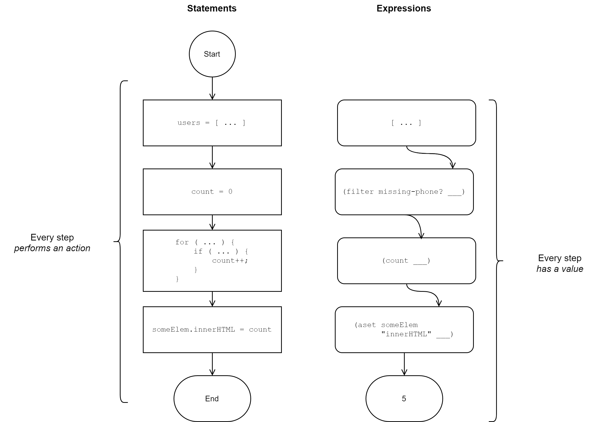
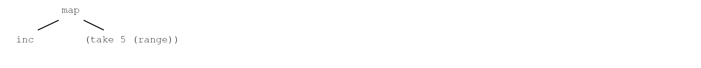

[UP](000_00.md)

### レッスン4：式と評価

前のレッスンで簡単に触れたように、式の概念はClojureScriptコードの中核をなしています。JavaScriptのような言語から来たプログラマにとって、式で考えることは視点を変える必要がありますが、ClojureScriptの他の側面と同様に、慣れれば式を使ったプログラミングは非常に簡単であることがわかります。

-----
このレッスンでは

- S式について学び、それらを識別する
- 文と式の違いを定義する。
- ClojureScriptの評価モデルを理解する。

-----

#### S式で基礎を固める

ほとんどのClojureScriptコードは、S式と呼ばれる構造で表されます。S式とは「symbolic expression」の略で、Clojureに影響を与えた古いLisp系の言語に由来しています。

##### S式の構成

S式には2つの形式があります。

1. `12`、`true`、`"tacos"`などのプリミティブな値
2. ホワイトスペースで区切られた 0 個以上の式を含む括弧付きリスト。`( expression* )`

この2つの形式だけで、ClojureScriptの構文のほとんどを定義しました。ブロック、ループ、関数呼び出し、条件分岐など、言語のほとんどの部分に特別な構文はありません。すぐに説明しますが、ClojureScript はコードを読みやすくするためにいくつかの構文要素を追加する点で、ほとんどの Lisps とは異なりますが、シンプルな S式が圧倒的に基本的で普及している構文構成です。ここでは、S式の例をいくつか紹介します。

```Clojure
5                                                          ;; <1>
;; 5

+                                                          ;; <2>
;; #object[cljs$core$_PLUS_ ...]

()                                                         ;; <3>
;; ()

(+ 5 5)                                                    ;; <4>
;; 10

(take 5 (range))                                           ;; <5>
;; (0 1 2 3 4)

(map inc (take 5 (range)))
;; (1 2 3 4 5)

(mk-sandwich "Bacon" "Lettuce" "Tomato")                   ;; <6>
;; WARNING: Use of undeclared Var cljs.user/mk-sandwich at line 1 <cljs repl>
;; #object[TypeError TypeError: Cannot read property 'call' of undefined]
```

**S式**

1. プリミティブ
2. 関数名
3. 空のS式
4. 他の単純なS式で構成されるS式
5. S式は入れ子にすることができます。
6. S式が構文的に有効だからといって、その実行を保証するものではありません。

この時点で、すべての括弧には目的があることがわかります（筆者も最初は疑っていました）。括弧は、あらゆるコードを評価するための一貫した明示的な構造を提供します。他のプログラミング言語では、関数の呼び出し、数学や論理の演算、条件分岐、メソッドの呼び出しなどに別々の構文が用意されているのが一般的ですが、ClojureScriptでは、評価のためのルールが明確に定義された1つの構文構造しかありません。ここでは、S式がどのように評価されるかを説明しますが、その前に、文の実行ではなく式の評価に重点を置いていることについて、少し寄り道をします。

> 注
>
> S式をベースにした言語を使うということは、演算子の優先順位というものが存在しないということです。JavaScriptでは、*は+よりも優先順位が高く、&&はORよりも優先順位が高く、!はここに挙げた他のどの演算子よりも優先順位が高いことを思い出す必要があります。ClojureScriptでは、優先順位が言語自体の構文で明示されているので、表は必要ありません。例えば、(and x (or y z))という表現の意味に疑問の余地はありませんし、(or (and x y) z)が全く別の意味であることも明らかです。最初は奇妙な構文に見えたものが、非常に有用であることがわかります。

##### 式の理解

関数型プログラミング言語であるClojureScriptは、文よりも式を重視しています。つまり、ClojureScriptではすべてのものが何らかの具体的な値で評価されます。JavaScriptでは、値を返さない文や、何も返さない（というか未定義を返す）関数が許されていますが、ClojureScriptのコードは、単純な数値からプログラム全体まで、すべて何らかの値を生成するように評価されます。

式ではなく、何も返さないJavaScriptの文を考えてみましょう。

```JavaScript
const x = 5;

if (10 % 2 === 0) {
  evenOrOdd = "Even";
}

for (let i = 0; i < 10; i++) {
  console.log("Looping!");
}
```

これらの例では、何らかの計算を行うコードが見られますが、特定の結果を与えるわけではありません。考えてみると、これらの文の前に `const foo =` を置くと、次の例のように構文エラーになります。

```JavaScript
const foo = if (10 % 2 === 0) {
    evenOrOdd = "Even";
}

// Uncaught SyntaxError: Unexpected token if
```

一方、ClojureScriptでは、文はなく、式だけなので、すべてのものが値を持ちます（たとえその値が`nil`であっても）。これにより、言語を、ある値に評価される式と、評価されずに実行される文に分ける必要がなくなり、物事が非常に単純化されます。すべてのものは値を持ちます。以下は、先ほど考えたJavaScriptのステートメントに相当するClojureScriptのステートメントです。

```Clojure
(def x 5)
;; #'user/x                                                ;; <1>

(if (even? 10) "Even" "Odd")
;; "Even"                                                  ;; <2>

(doseq [i (range 5)]
  (println "Looping!"))
;; Looping!
;; Looping!
;; Looping!
;; Looping!
;; Looping!
;; nil                                                     ;; <3>
```

ClojureScriptの式

1. varを定義すると、そのvar自体が評価される
2. if 式は、適切な分岐として評価されます。
3. doseqはnilと評価されます。

連絡先リストアプリを作っていて、電話番号を知らないユーザーの数をUIのどこかに表示したいと想像してみてください。JavaScript でこれを行う典型的な方法は、カウンター変数を作成し、ユーザーのリストをループして、電話番号が見つからなかった場合にカウンターをインクリメントすることです。最後に、ある要素のコンテンツをカウンタの値で更新します。

```JavaScript
let counter = 0;
const users = [
  /* ... */
];

for (let user of users) {
  if (isMissingPhone(user)) {
    counter++;
  }
}

someElem.innerHTML = counter;
```

ステートメント指向のJavaScriptコード

このコードは、コンピュータが従うべき取扱説明書のようなもので、あるタスクを達成するために実行すべきことが書かれています。一方、式を使ったプログラミングでは、データがあり、そこからどのようにして興味のある値を導き出すかを考えます。今回の例では、ユーザーのリストがあり、電話番号を知らないユーザーの数に興味があります。式指向のアプローチでは、おそらく次のようなことをするでしょう。電話番号を持たないユーザーだけを含むフィルター付きのユーザーリストを作成し、そのフィルター付きリストのアイテム数を取得します。

```Clojure
(set! (.-innerHTML someElem)
      (count
        (filter missing-phone? users)))
```

式指向のClojureScriptコード

短いだけでなく、このコードでは、最初のデータ（ユーザーの集合）と欲しいデータ（カウント）の間に明確な関係が描かれています。興味深いことに、上記の式全体は、電話番号を持たないユーザーの数として評価されます。


式とステートメントの比較

式指向のコードは、最後に値を返すことがわかります。しかし、各式は他の式で構成されているので、プロセスの各ステップは何らかの値を持っています。式とは何か、文とはどう違うのかを理解したところで、ClojureScriptが式をどのように評価（値を導き出す）するのかを見ていきましょう。

**クイックレビュー**

以下のJavaScriptのコードスニペットについて、それが式なのか文なのかを確認してください。

```JavaScript
// <1>
if (age === 16) {
  sweetSixteen = true;
}

// <2>
console.log('Regardless');

// <3>
'happy birthday to you'
  .split(" ")
  .map(_.capitalize)
  .join(" ");

// 4
const x = 12;

// 5
count >= threshold ? 'Too High' : 'Ok';

// 6
function foo() {}

// 7
(function () {});
```

回答 1-ステートメント、2-ステートメント、3-式、4-ステートメント、5-式、6-ステートメント、7-式

#### ClojureScriptコードの評価

ClojureScriptの式の評価ルールは簡単です。

1. 式がプリミティブ要素またはデータ構造の場合、その値はその要素です。
2. 式が括弧で囲まれた式のリストである場合、最初の式は関数として解釈され、残りの式は引数として解釈されます。
3. 内側の式を最初に評価し、外側に向かって評価する

例として、`(map inc (take 5 (range)))` という式を見てみましょう。この S 式は括弧で囲まれた式のリストなので、最初の要素である記号 `map` は、`inc` と `(take 5 (range))` という 2 つの引数を持つ関数として解釈されます。



式の評価、ステップ1

`inc`は、整数を受け取り、次に大きい数を返す関数です。ClojureScriptはこの関数を直接呼び出すことができるので、この引数を評価する必要はありません。しかし、引数の`(take 5 (range))`は、その値を`map`式に戻すことができるように評価する必要があります。S式のルールを思い出してみると、ClojureScriptは`take`を`5`と`(range)`を引数に持つ関数として解釈することがわかります。


式の評価、ステップ2

元のS式を評価する準備はほぼ整っていますが、まずは最後の内側のS式、`(range)`を評価する必要があります。この S式は、内部に `range` という単一の式しかないので、引数のない関数として解釈されます。


式の評価、ステップ3

最後に、式は「裏返し」に評価されます。`range`関数の呼び出しから始まり、一番外側のS式まで評価されます。


式の評価、ステップ4

`range`の呼び出しは、`0`から始まる整数の無限列を返しました。無限列の扱い方については後ほど説明しますが、ここでは、無限列とは、必要なだけ値を生成し続けることができるオブジェクトであることを理解しておく必要があります。この式が評価されると、元の式`(range)`の代わりに無限列が代入され、評価は外へと続いていきます。


式の評価、ステップ5

次の式は、`5`と無限大の数列を引数にした`take`関数の呼び出しとして解釈されます。この式の値は、`(0 1 2 3 4)`というシーケンスで、`(range)`で生成された無限列の最初の5要素です。`take`の呼び出しはこの戻り値で置き換えられ、評価は再び外に向かって続けられます。


式の評価、ステップ6

最後に、評価の最後のステップが実行されます。引数として`inc`と`(0 1 2 3 4)`を指定して`map`を呼び出します。これにより、シーケンスの各要素がインクリメントされ、S式の最終値が返されます。

ClojureScriptの評価ルールはシンプルなので、式がどのように評価されるかを数ステップで理解することができます。驚くべきことに、どんなに大規模で複雑なコードを見ていても、同じプロセスを使ってClojureScriptのほとんどすべての部分を読むことができるのです。基本的な構文を理解すれば、あとは語彙や共通のイディオムを学ぶだけです。

#### 操作の順序

意外に思われるかもしれませんが、ClojureScriptには演算子の優先順位という概念がありません。つまり、足し算の前に掛け算を行うべきだというようなルールはありません。式を評価する順序を暗黙のうちに決定する一連のルールを持つ代わりに、s式のネスト方法によって順序を指定します。例えば、次のコードは、5と2を掛け合わせてから、その結果を10に加える。

```Clojure
(+ 10 (* 5 2)) ; 20
```

一方、次のコードでは、10と5を足してから2を掛けています。

```Clojure
(* (+ 10 5) 2) ; 30
```

括弧を使って演算の順番を決めることで、より明確にすることができ、演算子の優先順位に関連する一連のバグをほぼ排除することができます。

##### やってみよう

- `make-dessert`という名前の関数を引数 `"ice cream"`と `"brownies"`で呼び出す式を書いてください。
- 次の数式をClojureScriptで書いてください．足し算と引き算の前に掛け算が行われるようにしてください．`8 + 3 * 4 - 10`
- 最後の演習と同じ式を書きますが、乗算が最後に行われるようにします。

#### まとめ

このレッスンでは、式とは何か、式指向のプログラミングと文指向のプログラミングはどう違うのかを学びました。また、ClojureScriptの評価戦略についても学びました。最後に、S式の構文では、すべての操作の順序を明示することで、演算子の優先順位が必要ないことを学びました。これで、以下のことができるようになりました。

- ClojureScriptがどのようにコードを評価するかを理解する。
- 一連の文の実行と式の評価の違いを定義する。
- ClojureScriptのS式構文を読む。


[NEXT](001_00.md)

[UP](000_00.md)
