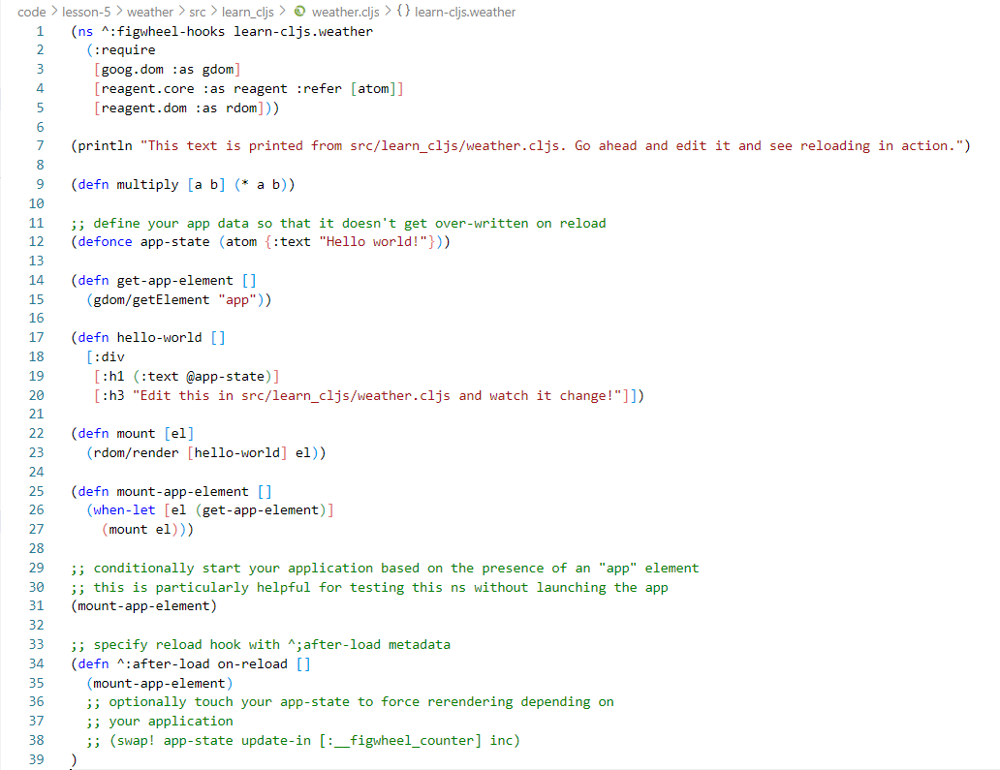
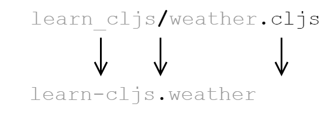

[UP](001_00.md)

### レッスン5：ClojureScriptプロジェクトのブートストラップ

ここまでは、ClojureScriptについての議論は、ほとんど理論的なものでした。ClojureScriptを使いたい理由はわかったが、実際にはどうなのだろうか。このセクションでは、小さな天気予報アプリケーションをゼロから開発します。ハイレベルなコンセプトに注意を払いながら、細かい部分の議論は後回しにします。この時点では、ClojureScriptコードの見た目に慣れ、JavaScriptでは難しいことがどのように簡単になるのかを確認し、ツールによって開発プロセスがどのように効率化されるのかを確認することに興味があります。アプリケーションの構文はまだ少し外国のもののように思えるかもしれませんが、ClojureScriptプロジェクトがいかに楽しく生産的であるかということを感じ始めます。

-----
このレッスンでは

- プロジェクトをゼロから設定する方法を学ぶ
- コードをビルドするためのClojureScriptコンパイラの使用方法を学ぶ
- clj-newを使ったブートストラップ
-----

まず最初に、ClojureScriptプロジェクトの作成と構築の方法を学びます。大工さんが傑作を作る前にすべての道具に精通していなければならないように、私たちも商売道具に精通していなければなりません。JavaScriptの開発にはたくさんのツールが必要ですが、ClojureScriptプロジェクトに必要な重要なツールはいくつかしかないので、安心してください。

#### cljとの出会い

各言語には、学ぶべき独自のツールセットがありますが、ClojureScriptも同じです。この本では、2つの非常に重要なツールに焦点を当てます。汎用のビルドタスクのための`clj`と、コードのライブリロードのためのFigwheelです。まず、私たちの新しい友人である`clj`を見てみましょう。`clj`は、依存関係を管理し、コードをビルドするための組み込みのコマンドライン・ツールです。JavaScriptの`npm`のように、`clj`は設定ベースの依存関係管理ツールであると同時に、シンプルなビルドツールでもあります。ソフトウェア・プロジェクトの構築にある程度慣れている読者であれば、すぐに馴染むことができるでしょうが、ビルド・プロセスを使うのが初めてであっても心配はいりません。ここでは、ClojureScriptアプリケーションを快適に構築するために必要な事項を十分に詳しく説明します。

Clojure言語には、ClojureとClojureScriptの両方をコンパイルするために使用できるコマンドラインツールが付属しています。他のビルドツールもありますが、`clj`ツールが事実上の選択肢です。これはシンプルなツールですが、大規模なプロジェクトでも使用できるほど強力です。このツールは、依存関係の管理、コンパイル、そしてプロジェクトのテストに使用します。このように1つのツールですべての問題を解決できるのは、JavaScriptの世界ではツールが乱立しているため、歓迎すべき変化といえるでしょう。先に進む前に、JavaとClojureをインストールする必要があります。手順はリリースごとに少しずつ変わるので、読者は公式の「Clojure Getting Started Guide」にある最新の手順に従うことをお勧めする。ClojureScriptの興味深い特徴の1つは、手動でインストールする必要がないことです。Clojureがインストールされたら、新しいプロジェクトを作成することができます。

##### 手動でのプロジェクト作成

テンプレートからスケルトン・プロジェクトを作成するツールもありますが、ここではまず手動でプロジェクトをセットアップし、ボンネット内で何が行われているかを理解できるようにします。まず、新しいディレクトリを作成して入力する必要があります。

```bash
$ mkdir my-cljs-project
$ cd my-cljs-project
```

次に，このディレクトリに `deps.edn` ファイルを作成します。このファイルは、JavaScriptツールのコミュニティにおける`package.json`に相当し、プロジェクトが必要とする依存関係のリスト、ソースコードやスクリプトのエイリアスの場所を指定します。`.edn`という拡張子は、そのファイルがExtensible Data Notation（ClojureScriptのデータ構造を含むファイル形式）を使用していることを示しています。それでは、素朴なdepsファイルを作成してみましょう。

```Clojure
{:deps {org.clojure/clojurescript {:mvn/version "1.10.844"}}
 :paths ["src"]}
```
deps.edn

`:deps`エントリには、プロジェクトが必要とするすべての依存関係が含まれています。この例では、ClojureScriptの最近の(この記事を書いている時点での)バージョンを要求しています。ほとんどのパッケージは、depsファイルに貼り付けるためのエントリを提供していますので、depsマップの形式についてはあまり気にしないでください。

`:paths` エントリは、ClojureScript コンパイラに、どこでコードを探すかを指示します。テストがある場合は、テストのパスもこのベクトルに追加します。

それでは、最初のソースファイルを作成して、コンパイルしてみましょう。`src/my_cljs_project/core.cljs`というファイルを作成して、以下の内容を入力します。

```Clojure
(ns my-cljs-project.core)                                  ;; <1>

(js/alert "Hello World")                                   ;; <2>
```
src/my_cljsproject/core.cljs

1. 名前空間の宣言
2. アラートの起動

デフォルトでは、アプリケーションは`out/main.js`にコンパイルされるので、このアプリケーションを読み込むためのシンプルなHTMLページを作ってみましょう。

```html
<!DOCTYPE html>
<html>
  <head>
    <meta charset="UTF-8">
  </head>
  <body>
    <script src="out/main.js" type="text/javascript"></script>
  </body>
</html>
```
index.html

では、ClojureScriptファイルをコンパイルして、ブラウザでスクリプトを読み込みます。これらはすべて1つのコマンドで行うことができます。

```bash
$ clj -m cljs.main --compile my-cljs-project.core --repl
```
このコマンドを実行すると、"Hello World "というアラートが表示された空のページが表示されているはずです。このコマンドが何をしているのかを理解するために、これを分解してみましょう。

- `clj` これは、Clojureコマンドラインツールを起動します。
- `-m clj.main` このフラグは、実行する関数を指定します。`deps.edn`ファイルに`org.clojure/clojurescript`を依存関係として含めると、`clj`にClojureScriptコンパイラをダウンロードするように指示します。`clj.main`はコンパイラ自体を呼び出す関数です。残りのフラグは、`clj`自身ではなく、ClojureScriptコンパイラーによって解釈されます。
- `--compile my-cljs-project.core` これは我々のアプリケーションの「エントリーポイント」の名前空間を指定します。ファイルは1つしかないので、その名前空間を指定します。この名前空間は、`core.cljs`ファイルの先頭で指定したものと一致することに注意してください。
- `--repl` このフラグは、2つのことを行います。1つ目は、`index.html`ファイルとコンパイルされたJavaScriptを提供するためにWebサーバーを起動すること、2つ目は、REPL（[レッスン7](001_07.md)で学ぶ対話型インタープリター）を起動することです。

> **注意**
>
> 本書に掲載されている端末の例は、OSXやLinuxなどのUnix系の環境を想定しています。Windowsをお使いの方は、コマンドに若干の変更が必要な場合があります。

##### エイリアスの使用

`clj`ツールは、コードをビルドして実行するために必要なすべてのオプションを提供してくれますが、アプリケーションを起動するたびに、`clj -m cljs.main --compile my-cljs-project.core --repl` とタイプアウトするのは面倒なことです。`deps.edn`ファイルでは、スクリプトのエイリアスを指定することができます。このエイリアスによって、いくつかのコマンドの略語を宣言したり、Clojureファイルを実行したりすることができます。

```Clojure
;; ...
:aliases
  {:dev {:main-opts ["-m" "cljs.main"
                     "--compile" "my-cljs-project.core"
                     "--repl"]}}
```
deps.edn                    

このエイリアスがあれば、次のコマンドでアプリケーションを実行することができます： `clj -M:dev`.

**クイックレビュー**

- `deps.edn`ファイルとは何ですか？また、JavaScriptのエコシステムにおいてそれに相当するものは何ですか？
- 私たちのアプリケーションを実行するために`clj`に渡された各フラグについて説明しましょう。

##### cljの理解

小さくて単純な部分からより高度な機能を構成するというClojureの哲学に固執して、`clj`は明確に定義された目的を持つビルディング・ブロックです：依存関係を管理し、Clojureコード（ClojureScriptコンパイラを含む）を実行します。プロジェクト管理のためのより完全な機能を持ったツールは他にもありますが、機能が増えれば複雑になります。この本では、`clj`と、次のレッスンで紹介するFigwheelというツールにこだわります。

`clj -m cljs.main ...` を実行すると、いくつかのことが起こります。まず、`deps.main`で指定されている依存関係がすべてダウンロードされます。このダウンロードは最初の実行時にのみ行われ、その後の実行に備えてパッケージはローカルにキャッシュされます。次に、Java仮想マシンが起動され、Clojureコンパイラがロードされます。次に，Clojure は `-m` フラグで指定されたコードをロードします．ここでは、ClojureScriptコンパイラのエントリポイントである`cljs.main`を指定しています。このコードが利用できるのは、ClojureScriptコンパイラのパッケージ(`org.clojure/clojurescript`)を`deps.edn`に追加したからです。

`-m cljs.main` フラグの後、残りのフラグは `clj` 自体ではなく ClojureScript コンパイラによって解釈されます。ここでは、ClojureScriptコンパイラーオプションのリファレンスを紹介しませんが、https://clojurescript.org/reference/repl-and-main に優れた公式リファレンスがあります。その代わりに、これからのレッスンの過程で必要となるオプションについて説明します。

#### プロジェクトのブートストラップ

`clj`の概要を理解したところで、早速、最初の簡単なプロジェクトである天気予報アプリを作ってみましょう。私たちは、すべてを手動で設定する退屈な作業を排除するために、テンプレートからプロジェクトを作成するために[clj-new](https://github.com/seancorfield/clj-new)と呼ばれるツールを使用します。ClojureScriptコンパイラのように、明示的に何かをインストールすることなく、clj-newを利用することができます。`clj`の追加機能の1つは、`~/.clojure/deps.edn`にエイリアスを定義して、常に利用できるようにすることです。以下の内容でこのファイルを作成してください。

```Clojure
{:aliases
 {:new {:extra-deps {seancorfield/clj-new
                     {:mvn/version "1.1.243"}}
        :exec-fn clj-new/create}
        :exec-args {}}}
```
~/.clojure/deps.edn

これにより、コマンド `clj -X:new` を使用して、`seancorfield/clj-new` パッケージで提供される `clj-new/create` 関数を呼び出すことができます。 clj-new は、プロジェクトの足場を生成するために、テンプレート名とプロジェクト名を必要とします。Figwheelを使用してコードを自動的にコンパイルし、変更に応じてリロードするので、作成するファイルとディレクトリ構造の青写真であるclj-newテンプレートを使用することができます。デフォルトでは、Clojureアプリケーション・ライブラリを生成するためのいくつかの組み込みテンプレートがありますが、他のテンプレートを指定することもできます。テンプレート名を指定してclj-newを起動すると、そのテンプレートが組み込みのものかどうかをチェックします。組み込みテンプレートが見つからない場合は、中央のリポジトリから適切なテンプレートを探してダウンロードし、プロジェクトを生成しようとします。

Figwheelプロジェクトは、ライブリロードに必要なすべての配管を備えたClojureScriptプロジェクトを生成するテンプレートを提供しています。UIの構築には、Reactを中心とした慣用的なClojureScriptラッパーであるReagentライブラリを使用します。ありがたいことに、Figwheelテンプレートでは、生成されたプロジェクトにReagentのボイプレート・コードを含めるための追加の引数を渡すことができます。これで、アプリのプロジェクトを作成することができます。

```bash
$ clj -X:new :template figwheel-main :name learn-cljs/weather :args '["+deps" "--reagent"]'
```

このコマンドには見慣れない構文が含まれていますので、少し分解してみましょう。先ほど学んだように、コマンドの最初の部分である`clj -X:new`は、`clj-new/create`関数を呼び出し、残りの引数はこの関数に渡されます。`:template` は当然のことながら、使用するテンプレートの名前を指定し、`:name` は作成するプロジェクトの名前、`:args` は `figwheel-main` テンプレートが解釈する追加の引数です。`figwheel-main`は組み込みテンプレートではないので、clj-newはClojureの中央リポジトリである[Clojars](https://clojars.org/)からテンプレートを取得します。

生成されたプロジェクトの構造を理解するためには、ちょっとした慣習を理解する必要があります。ほとんどのClojureとClojureScriptのプロジェクトは、名前空間で修飾されたパッケージ名を使用して、中央レジストリにプッシュされたプロジェクト間での名前の衝突の可能性を減らします。名前空間はフォワードスラッシュの前の部分で、一般的には開発者のGitHubユーザー名やコードを所有する組織のリバースドメイン名ですが、好きなものを使うこともできます。本書では、すべてのプロジェクトの名前空間(*1)として `learn-cljs` を使用します。


プロジェクトの名前空間と名前

最後の引数はちょっと変わっていて、 `:args '["+deps" "--reagent"]'` となっています。これは、文字列のベクトルを `figwheel-main` テンプレートの引数として渡します。サポートされる正確な引数はテンプレートによって異なりますが、Figwheelはこれらを使ってベース・テンプレートに対するオプションの拡張機能を設定します。今回のケースでは、依存関係を管理するために`deps.edn`ファイルを使用することと、Reagentウェブフレームワークを含めることを指定しています。

#### プロジェクトの探索

これでClojureScriptプロジェクトが動き出しました(骨組みだけですが)。clj-newが生成したアプリケーションを見るには、プロジェクト・ディレクトリに移動して、どのようなファイルが生成されたかを確認します。

```bash
$ cd weather
$ tree -a
.
├── .gitignore
├── README.md
├── deps.edn
├── dev.cljs.edn
├── figwheel-main.edn
├── resources
│   └── public
│       ├── css
│       │   └── style.css
│       ├── index.html
│       └── test.html
├── src
│   └── learn_cljs
│       └── weather.cljs
├── target
│   └── public
├── test
│   └── learn_cljs
│       ├── test_runner.cljs
│       └── weather_test.cljs
└── test.cljs.edn
```
生成されたプロジェクトを探る

それでは、これらのファイルやディレクトリが何のためにあるのかを探ってみましょう。`deps.edn` はすでにおなじみですし、`README.md` や `.gitignore` も説明不要でしょうが、その他の EDN ファイルについては少し説明が必要です。

- `dev.cljs.edn` - ビルドファイル。Figwheelでは、ClojureScriptコンパイラーに異なるオプションを渡すために、個別のビルド構成を使用することができます。例えば、開発用ビルドの設定にはこのファイルを使用し、本番用ビルドには別のファイルを使用することができます。
- `figwheel-main.edn` - Figwheel構成ファイル。このファイルは、Figwheel 自体の構成オプションを提供します。
- `test.cljs.edn` - ビルドファイル。`dev.cljs.edn` と同様に、このファイルは特定のビルド（この場合はテスト・ビルド）を設定します。

`src`ディレクトリには、プロジェクトのすべてのClojureScriptソースファイルが格納されています。通常、`src`の下にはプロジェクトの名前空間と同じ名前のフォルダが1つあり、このフォルダの下にはいくつもの`*.cljs`ファイルやその他のフォルダが存在します。デフォルトでは、`figwheel-main`テンプレートは、このディレクトリに1つの`<プロジェクト名>.cljs`ファイルを作成します。`weather.cljs`をClojureScriptをサポートするテキストエディタやIDEで開くと、次のようなものが表示されます。


VS Codeによる`core.cljs`の編集

このファイルの残りの部分については、これからのレッスンで天気予報アプリを作り始める際に詳しく説明します。今のところ、ファイルの先頭にある名前空間宣言を見てみましょう。各ClojureScriptファイルには1つの名前空間が含まれており、これは単にデータと関数の集まりです。名前空間は、ClojureScriptのモジュール化の単位です。作成された`weather.cljs`ファイルを開いてみると、1行目で名前空間が宣言されているのがわかります（`^:figwheel-hooks`の部分は今のところ無視します）。`(ns ^:figwheel-hooks learn-cljs.weather)`. ClojureScriptコンパイラは、名前空間を格納するファイルの名前に基づいて、名前空間のための単純な命名規則を使用します。

1. ソースディレクトリからの相対的なファイルパスを取る
2. パスの区切り文字 (Unix 系システムでは "/" 、Windows では "\") をドット "." に置き換えます。
3. アンダースコア"_"をハイフン"-"に置き換える。


ファイル名と名前空間の関係

> **ハイフンかアンダースコアか**
>
>    ClojureScriptに慣れていない人が戸惑うのは、プロジェクト内のディレクトリにはアンダースコアで名前を付けるのに、名前空間にはハイフンで名前を付けているという事実です。これは、名前空間をJavaクラスにコンパイルし、ファイルパスに応じてクラス名を付けるClojureから借用した慣習です。Javaのクラス名にはハイフンが使えないので、ファイルパスにもハイフンは使えません。ClojureScriptはClojureに倣い、ファイルシステムのパスでは名前空間のハイフンをアンダースコアに変換することを要求しています。これは癖のようなものですが、一度意識してしまえば簡単に付き合えるものです。

`resources/` ディレクトリには、`index.html`、スタイルシート（デフォルトでは空です）、プロジェクトの構築、テストランナーをホストするためのページなど、ウェブサイトを提供するために必要なすべてのアセットが含まれています。`index.html`には、アプリケーションを読み込むためのdivが1つ作成されており、依存関係にあるアプリケーションを読み込むためのJavaScriptファイルが含まれています。

**クイックレビュー**

- アプリケーションをロードするページのマークアップを調整するために、どのファイルを変更しますか？
- プロジェクトの依存関係を追加するために、どのファイルを変更しますか？
- `learn-cljs.weather.sunny-day`名前空間を追加するために、どのファイルを作成しますか？

#### まとめ

このレッスンでは、新しいClojureScriptプロジェクトをゼロから作成する手順を説明しました。組み込みのClojure(およびClojureScript)ビルドツールであるcljについて紹介しました。次に、`clj-new`プロジェクト・スカフォールド・ツールを見て、それが生成してくれたプロジェクト構造を探りました。次は、開発中に即時にフィードバックを受けることができるもう一つのコア・ツールであるFigwheelについて学びます。その後、両足でコードを書き始めることができるようになります。私たちは今、以下のことを知っています。

- 新しいClojureScriptプロジェクトをゼロから立ち上げる方法
- どのようなタスクが`clj`ツールによって処理されるか
- テンプレートからプロジェクトを起動するために`clj-new`を使用する方法
- 典型的なClojureScriptプロジェクトはどのように構成されているか

-----
1. 名前空間のことを「groupId」、名前のことを「artifactId」と呼ぶことがあります。これは、JavaのMavenプロジェクト管理ツールで使用されている命名規則と関係があり、Clojureツールの多くはこの規則に基づいて構築されています。
2. ほとんどのプログラマーのテキストエディタは、ClojureScriptに使用できるClojure言語パッケージを持っていますが、IDEでの作業を好むのであれば、Cursiveは利用可能なClojure(Script)IDEの中で最も完全な機能を備えています。

[NEXT](001_06.md)

[UP](001_00.md)
