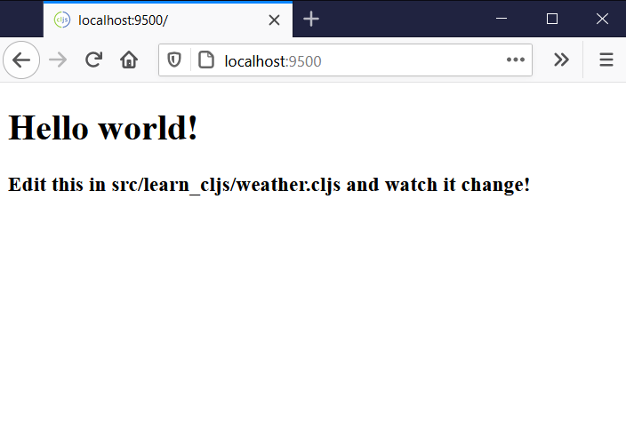

[UP](001_00.md)

### レッスン6：Figwheelで迅速なフィードバックを受ける

前回のレッスンでは、1つのコマンドを実行しただけでしたが、コンパイルし、すぐに見るように、自動的にリロードする基本的なプロジェクトをすでに持っています。Figwheelは、コードをリロードしたり、Webブラウザ内でClojureScriptを実行するために、ClojureScriptコミュニティで選ばれているツールです。インタラクティブな開発は、ClojureScript開発者にとって大きな優先事項であり、Figwheelのようなツールによって得られる即時のフィードバックは、開発を真にインタラクティブな体験にしてくれます。

-----
このレッスンでは

- インタラクティブな開発が ClojureScript の基礎であることを学びます。
- Figwheel を使用してコンパイルし、即座にブラウザにロードする方法を学びます。
- リロード可能なコードの書き方を学ぶ
-----

Figwheelによる開発の効率化について理解を深めるために、実際に起動して見てみましょう。`figwheel-main` テンプレートを持つ clj-new を使用してプロジェクトを生成したので、1 つのコマンドで Figwheel を起動するために使用できるエイリアスが含まれています。

```bash
$ cd weather                                               # <1>
$ clj -A:fig:build                                         # <2>
[Figwheel] Validating figwheel-main.edn
[Figwheel] figwheel-main.edn is valid \(ツ)/
# ... more output ...
Opening URL http://localhost:9500
ClojureScript 1.10.773
cljs.user=>
```
Figwheelの実行

1. プロジェクト・ディレクトリに入ります。
2. Figwheel の起動

Figwheel は、起動して既存のコードをコンパイルするのに数秒かかりますが、Figwheel がアプリケーションに接続する準備ができたことを出力が示すと、ブラウザを開いて `http://localhost:9500` に移動し、実行中のアプリケーションを確認することができます。


FigwheelによるClojureScriptのリロード

Figwheelを起動すると、ClojureScriptのソース・ファイルに変更がないか、プロジェクトの監視を開始します。これらのファイルが変更されると、Figwheel はそれらを JavaScript にコンパイルし、その JavaScript をブラウザに送信して実行します。

##### ライブ・リローディングのテスト

変更時に Figwheel がコードをリロードするアプリケーションが動作しているので、テキスト・エディタを開いてコードの一部を変更してみましょう。使用したテンプレートでは、デフォルトで `src/learn_cljs/weather.cljs` に1つのソース・ファイルを生成しています。変更を加える前に、このファイルの内容を大まかに説明します。

```Clojure
(ns ^:figwheel-hooks learn-cljs.weather                    ;; <1>
  (:require
   [goog.dom :as gdom]
   [reagent.core :as reagent :refer [atom]]
   [reagent.dom :as rdom]))

(println "This text is printed from src/learn_cljs/weather.cljs. Go ahead and edit it and see reloading in action.")

(defn multiply [a b] (* a b))

;; define your app data so that it doesn't get over-written on reload
(defonce app-state (atom {:text "Hello world!"}))          ;; <2>

(defn get-app-element []
  (gdom/getElement "app"))

(defn hello-world []                                       ;; <3>
  [:div
   [:h1 (:text @app-state)]
   [:h3 "Edit this in src/learn_cljs/weather.cljs and watch it change!"]])

(defn mount [el]
  (rdom/render [hello-world] el))

(defn mount-app-element []
  (when-let [el (get-app-element)]
    (mount el)))

;; conditionally start your application based on the presence of an "app" element
;; this is particularly helpful for testing this ns without launching the app
(mount-app-element)

;; specify reload hook with ^;after-load metadata
(defn ^:after-load on-reload []                            ;; <4>
  (mount-app-element)
  ;; optionally touch your app-state to force rerendering depending on
  ;; your application
  ;; (swap! app-state update-in [:__figwheel_counter] inc)
)
```
src/cljsweather/core.cljs

1. 名前空間の宣言
2. すべてのUIの状態を保持するデータ構造
3. Reagent コンポーネントの宣言とレンダリング
4. Figwheelのリロード処理への任意のフック

まず、`hello-world`コンポーネントに小さな変更を加えてみましょう。変更が反映されているかどうかを確認するために、ちょっとした追加のテキストを追加します。

```Clojure
(defn hello-world []
  [:div
    [:h1 "I say: " (:text @app-state)]])
```

ファイルを保存すると、すぐにブラウザが更新され、追加したテキストが反映されるはずです。次に、`app-state`内のテキストを "Hello World!"以外のものに変更してみましょう。

```Clojure
(defonce app-state (atom {:text "Live reloading rocks!"}))
```

再度ファイルを保存すると、ブラウザの表示が何も変わらないことがわかります。何も変わらないのは、`app-state`の作成に`defonce`を使用しているからです。`defonce`を使うことで、`cljs-weather.core`名前空間がリロードされても、`app-state`は触られません。この動作により、生産性が大きく向上します。複雑な検証ルールを持つ複数ページのフォームを作るというシナリオを考えてみましょう。フォームの最後のページの検証に取り組んでいた場合、通常はコードを変更し、ブラウザをリロードし、最後のページに到達するまでフォームに入力し、変更をテストし、すべてが満足のいくものになるまで必要な回数だけこのサイクルを繰り返します。一方、ClojureScriptとFigwheelでは、フォームの最初の数ページを入力した後、効果をすぐに確認しながらコードに小さな変更を加えることができます。コードがリロードされてもアプリの状態はリセットされないので、最初のページを埋めるという退屈なサイクルを繰り返す必要はありません。

**やってみよう**

- `hello-world`コンポーネントを変更し、代わりに`<p>`タグをレンダリングします。
- "Hello, " をレンダリングする `greeter` という新しいコンポーネントを作成し、 `hello-world` の代わりに `greeter` を使用するように `rdom/render` の呼び出しを更新します。

> IDEは必要ですか？
>
>   ClojureScriptの編集は、使い慣れたエディタやIDEで行うことができます。最近のほとんどのテキストエディタにはClojure/ClojureScriptのプラグインがあり、シンタックスハイライトや、しばしば括弧のバランスを取る機能があります。ClojureScriptコミュニティで人気のあるエディタとしては、VS Code、Emacs、LightTable(これ自体がClojureScriptで主に書かれています)、vimなどがあります。IDEをご希望の場合、CursiveはIntelliJ IDEAの上に構築された完全な機能を持つClojure/ClojureScriptのIDEです。IDEを使うにしても、シンプルなテキストエディタを使うにしても、優れたClojureScriptのサポートを見つけることができます。

ClojureScriptコードのリロードに加えて、Figwheelは、変更する可能性のあるスタイルシートのリロードも行います。このプロジェクトを作成するときに使用した Figwheel テンプレートは、`resources/public/css` ディレクトリにあるすべてのスタイルの変更を監視するように Figwheel を設定します。これをテストするために、デフォルト（空）のスタイルシートを開き、いくつかのスタイルを追加します。

```CSS
body {
  background-color: #02a4ff;
  color: #ffffff;
}

h1 {
  font-family: Helvetica, Arial, sans-serif;
  font-weight: 300;
}
```
resources/public/css/style.css

スタイルシートを保存すると、Figwheel は新しいスタイルシートをブラウザに送信し、ページを完全にロードすることなく適用します。ClojureScript や CSS の変更に対するフィードバックを即座に受け取ることができるため、非常に生産的なワークフローを実現することができます。

#### リローダブル・コードの記述

Figwheelがコードをリロードしてくれるのはとても助かりますが、魔法ではありません。アプリケーションの動作に悪影響を与えずにリロードできるコードを書く責任があります。本書の後半では、React.jsやReagentと呼ばれるClojureScriptのラッパーを使っていくつかのアプリケーションを作成します。これらのフレームワークは、ライブリロードに適したコーディングスタイルを強く推奨していますが、これらのフレームワークを使用しているかどうかにかかわらず、ライブリロードを最大限に活用できるように、リロード可能なコードとは何かをよく理解しておく必要があります。

リローダブルコードを書く上で考慮すべきことはたくさんありますが、基本的には、「リローダブルコードの柱」と呼ばれる3つの重要なコンセプトに集約されます。


リローダブルコードの柱

この3つの柱に沿ってコードを書けば、リロード可能なコードになるだけでなく、コードの堅牢性や保守性も向上することが多いのです。ここでは、これらの3つの柱のそれぞれについて、どのようにコードに適用するかを説明します。

##### 無駄のない関数

idempotent function（べき等関数）とは、一度だけ呼ばれても、何度も呼ばれても、同じ効果を持つ関数のことです。例えば、DOM要素の`innerHTML`プロパティを設定する関数は冪等ですが、他の要素に子を追加する関数は冪等ではありません。

**べき等関数と非べき等関数**

```Clojure
(defn append-element [parent child]                        ;; <1>
  (.appendChild parent child))

(defn set-content [elem content]                           ;; <2>
  (set! (.-innerHTML elem) content))
```
1. 非べき等関数
2. べき等関数

`append-element`関数は間違いなくidempotent(べき等)ではありません。なぜならば、100回呼び出すのと1回呼び出すのとでは結果が異なるからです。一方、`set-content`関数はidempotent(べき等)であり、何度呼び出しても結果は同じです。ライブリロードを行う際には、リロード時に呼び出される関数がidempotent(べき等)であることを確認する必要があります。そうしないと、そのコードの副作用が何度も実行され、望ましくない結果になってしまいます。

**やってみよう**

- idempotent(べき等)で、まだ存在していない場合にのみ子を追加するバージョンの`append-element`を書いてください。考えられる解決策を以下に示します。

```Clojure
(defn append-element [parent child]
   (when-not (.contains parent child)
       (.appendChild parent child)))
```

**`defonce`**

Figwheel プロジェクトを `--reagent` 引数で足場を組むと、生成される名前空間は `defonce` という構造を使用してアプリケーションの状態を定義します。

```Clojure
(defonce app-state (atom {:text "Hello world!"}))
```

前述したように、`defonce`は`def`と非常によく似ていますが、その名が示すように、varを一度だけバインドし、それ以降の評価ではその式を効果的に無視します。アプリの状態を`defonce`で定義し、コードがリロードされるたびに新しい値で上書きされないようにすることがよくあります。このようにして、アプリケーションのビジネスロジックがリロードされても、一時的なデータとともにアプリケーションの状態を維持することができます。

`defonce`を使用するもう一つの便利なパターンは、初期化コードが繰り返し実行されないようにすることです。`defonce`式は次のような形をしています。`(defonce name expr)` ここで`name`はバインドするvarの名前を表すシンボル、`expr`は任意のClojureScript式です。`defonce`はvarが再定義されるのを防ぐだけでなく、varがバインドされるときに`expr`が再評価されるのも防ぎます。つまり、初期化コードを`defonce`で囲むことで、コードが何度リロードされても一度しか評価されないことが保証されるのです。

```Clojure
(defonce is-initialized?
  (do                                                      ;; <1>
    (.setItem js/localStorage "init-at" (.now js/Date))
    (js/alert "Welcome!")
    true))                                                 ;; <2>
```
初期化コードのラッピング

1. `do`は複数の式を評価し、最後の式の値を取る
2. 初期化が完了したら`is-initialized?` を`true`にバインドする

今回は、一度だけ評価される`is-initialized?` というvarを定義し、すべての初期化が完了したら`true`という値にバインドしています。`do`形式は、渡された式をそれぞれ評価し、最後の式の値を返すものです。最終的に値を返す前に、実行したい副作用（ここでは`localStorage`に値を設定し、アラートを表示する）がある場合に便利です。`do`と`defonce`の組み合わせは、特定のコードが一度しか実行されないことを保証するための一般的なパターンです。

**クイックレビュー**

- Figwheelの実行中に、`core.cljs`の中で`(defonce app-state ...)`を含む行を探し、テキストを変更し、ファイルを保存してください。ページは更新されましたか？なぜ、あるいはなぜそうならないのでしょうか？
- `core.cljs`の中で`[:h1 (:text @app-state)]`を含む行を探し、`h1`を`p`に変更します。ページは更新されますか？この動作が`app-state`の定義の変更と異なるのはなぜですか?

**表示／ビジネスロジックの分離**

表示コードとビジネスロジックの分離は、一般的に良い習慣ですが、リロード可能なコードではさらに重要です。先ほど、idempotent(べき等)関数について説明したときに書いた`append-element`関数を思い出してください。

Twitterのようなアプリケーションを書いていて、あるフィードに新しいメッセージを追加するためにこの関数を使っていたとします。このコードを書くにはいくつかの方法がありますが、そのすべてがライブリロードに適しているわけではありません。次のようなコードを考えてみましょう。このコードでは、新しいメッセージを受信するロジックと、それを表示するロジックが分離されていません。

```Clojure
(defn receive-message [text timestamp]
  (let [node (.createElement js/document "div")]
    (set! (.- innerHTML node) (str "[" timestamp "]: " text))
    (.appendChild messages-feed node)))
```
表示とビジネスロジックの組み合わせ

この例では、受信したメッセージを処理するロジックと、メッセージを表示する懸念を組み合わせています。ここで、表示からタイムスタンプを削除してUIをシンプルにしたいとします。このコードでは、すでに表示されているメッセージには影響しないため、タイムスタンプを省略するように`receive-message`関数を修正し、ブラウザを更新する必要があります。より良い方法は、以下のようなものです。

```Clojure
(defonce messages (atom []))                               ;; <1>

(defn receive-message [text timestamp]                     ;; <2>
  (swap! messages conj {:text text :timestamp timestamp}))

(defn render-all-messages! [messages]                      ;; <3>
  (set! (.- innerHTML messages-feed) "")
  (doseq [message @messages]
    (let [node (.createElement js/document "div")]
      (set! (.-innerHTML node) (str "[" timestamp "]: " text))
      (.appendChild messages-feed node))))

(render-all-messages!)                                     ;; <4>
```
表示とビジネスロジックの分離

1. 受信したすべてのメッセージは、上書きされないように`defonce`で定義されたアトムに保存される
2. 新しいメッセージを処理する関数は、純粋なビジネスロジックです。
3. メッセージをレンダリングする関数は純粋な表示ロジックです。
4. レンダリングの実行

この場合、`render-all-messages!` 関数を更新すると、Figwheel がコードをリロードしたときに、メッセージ・リストは変更されませんが、表示関数の動作は異なり、`render-all-messages!` が呼び出されると、すべてのメッセージの表示が更新されます。

> 注意
>
>   上記のコードの実装は、render-all-messages! を呼び出すたびにリスト全体が再レンダリングされるため、効率が悪いです。後のレッスンでは、Reagentフレームワークを使用して、同様の結果をより効率的に得ることができます。

**クイックレビュー**

- リロード可能なコードの柱は何ですか？なぜそれぞれが重要なのでしょうか？
- `def`と`defonce`の違いは何ですか？

**やってみよう**

- Figwheelが動作している状態で、`app-state`内のテキストを変更し、ファイルを保存してみます。どうなりますか？`defonce`ではなく`def`を使っていたら、何か違ったことが起きたでしょうか？
- コードに構文エラーを導入して、ブラウザで何が起こるか見てみましょう。

#### まとめ

このレッスンでは、ClojureScriptでのインタラクティブな開発の中核となる機能であるライブリロードについて調べました。Figwheelを使って、コードが変更されるたびにリロードし、リロード可能なコードを書くための原則を見ていきました。この知識があれば、生産性を次のレベルに引き上げることができ、通常のJavaScriptで得られるよりもはるかに迅速なフィードバックを得ることができます。私たちは今、次のことを知っています。

- コマンド・ラインから Figwheel を起動する方法
- コードが変更されたときに Figwheel がリロードする方法
- リロードに適したコードの書き方


[NEXT](001_07.md)

[UP](001_00.md)
