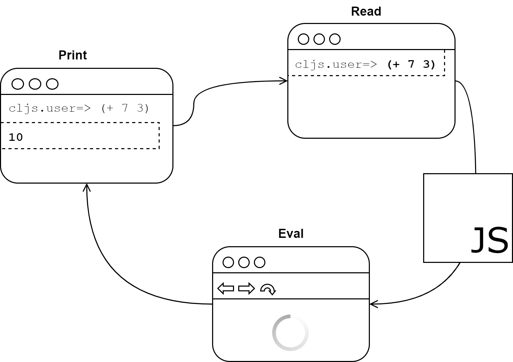
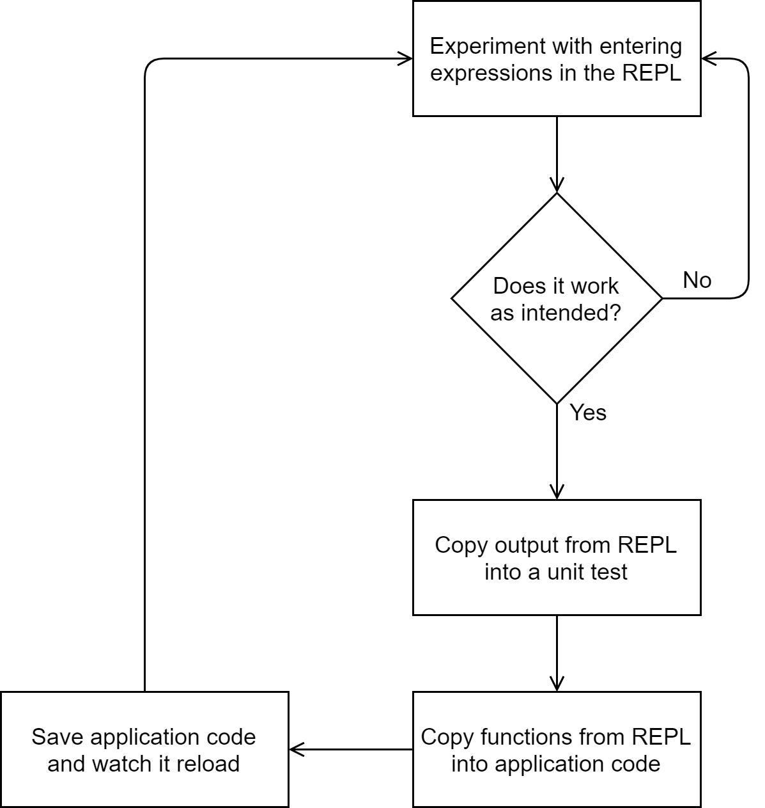
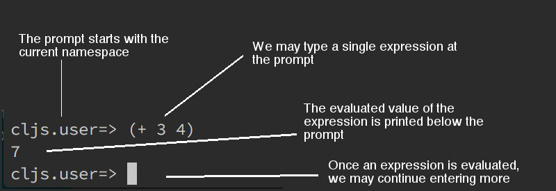
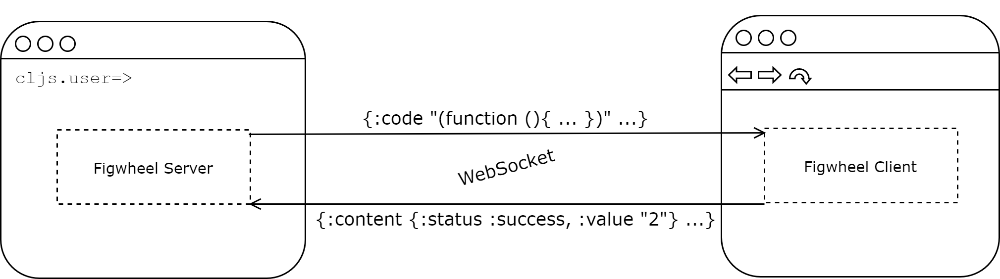

[UP](001_00.md)

### レッスン7：REPLクラッシュコース

前のレッスンでは、ソース・ファイルが変更されたときに Figwheel を使ってコードを再読み込みし、非常に迅速なフィードバック・サイクルを実現する方法を学びました。これは Read-Eval-Print Loop の略で、ほとんどのブラウザが提供する JavaScript コンソールに概念的に似ています。ライブリロードは、書くべきコードの見通しが立っているときには大きな助けとなりますが、REPLはより探索的なコードを書くための環境を提供してくれます。つまり、プロジェクトの一部にする前にアイデアやアルゴリズムを試すことができるのです。ユニットテストのように、REPL開発では、コードの一部を分離してテストし、その出力を調べて、期待通りであることを確認することができます。しかし、ユニット・テストとは異なり、REPLはよりインタラクティブで、より迅速なフィードバックを提供します。

-----
このレッスンでは

- REPL とは何かを理解し、それを使用する
- FigwheelのREPLを使って新しいコードを試す
- REPL が Web ブラウザとどのように連動するかを学ぶ
-----

#### REPLについて

前述したように、REPL は Read-Eval-Print Loop の略で、プロンプトで入力した各式を読み取り、その式を Web ブラウザのコンテキストで評価し、その結果をコマンドラインに返信します。このプロセスを下図に示します。


The Read-Eval-Print Loop

まず、REPLはユーザーからの入力を待ちます。ClojureScriptの式を入力すると、その式をJavaScriptにコンパイルし、そのJavaScriptコードを（WebSocket経由で）Webブラウザに送って評価します。ブラウザがJavaScriptコードを評価すると、その結果をREPLに送り返します。最後に、REPLはその結果を印刷し、ユーザーからのさらなる入力を待ちます。このループは、REPLが終了するか、接続しているブラウザが閉じられるまで続きます。ClojureScript REPLは、読み取り(Read)と印刷(Print)の部分のみを担当しており、評価(Eval)ステップを実行するためにはブラウザが必要であることを覚えておいてください。

> 注意
>
> ClojureScriptにはいくつかの異なるREPLオプションがありますが、本書ではFigwheelを使用します。多くの情報はどのREPLにも当てはまりますが、他のREPLでは機能が若干異なる場合があるので注意してください。特に、Node.jsを使用してコンパイル済みのJavaScriptを評価するREPLを実行することも可能です。

単にREPLを提供するだけでは、それほど面白いものではありません。結局のところ、RubyやPythonにはREPL（または「インタラクティブ・インタープリター」）がありますし、すべての最新ブラウザには開発ツールにJavaScript REPLが組み込まれています。REPLがClojureScriptにとってユニークなのは、ClojureScriptがコンパイルされた言語であることです。つまり、REPLはClojureScriptを読み、それをJavaScriptにコンパイルし、JavaScriptコードを評価し、その結果をClojureScript REPLで結果をプリントバックするということを、すべて完全にシームレスに行うことができます。他のコンパイルトゥJavaScript言語では、コードの一部を貼り付けて、そのコードがコンパイルされたJavaScriptを見るためのオンラインインターフェースを提供するのが一般的ですが、開発者にダイナミックでインタラクティブなプログラミング環境を提供するという点では、ClojureScriptは他とは一線を画しています。REPLを使用することで、実行中のブラウザでコードが正確に実行されることを確信することができます。

#### ブラウザとのインタラクションのためのREPLの使用

ClojureScript REPLをロードするために、このユニットで使用してきたのと同じ`learn-cljs/weather`アプリを使用します。

```bash
$ cd weather
$ clj -A:fig:build
```

ほとんどの場合、Figwheelが直接ブラウザ・タブを開くことができますが、そうならなかった場合は、ブラウザを開いて `http://localhost:9500` にアクセスし、私たちのREPLが接続して式の評価を開始できるようにしてください。

ClojureScript REPLは、入力されたコードを即座にJavaScriptにコンパイルし、ブラウザのコンテキストで評価します。前のレッスンでは、Figwheelを起動し、ブラウザを開いて、`http://localhost:9500` に移動しました。この設定は、コードを保存するたびにリロードするために使用しましたが、Figwheelは、Webページと通信できるREPLを端末で起動します。REPL を使用するには、Figwheel が実行されているターミナル・ウィンドウに式を入力し始めるだけで、アプリケーションが実行されているページのコンテキストで実行されます。さらに、アプリケーション・コードと対話し、その場で変更することもできます。典型的なClojureScriptの開発サイクルは、次のような手順で行われます。


REPL-Driven Development Workflow

このレッスンでは、この完全なワークフローは使用しませんが、探索的な開発にどのように使用できるかを確認するために、REPL を探索します。Figwheel が実行され、ブラウザにアプリが読み込まれたら、Figwheel とブラウザの両方が表示されていることを確認する必要があります。REPL を広範囲に使用するので、そのコマンドライン・インターフェースの意味を理解するために少し時間をかけてみましょう。



REPLの分解

REPLが起動すると、名前空間である`cljs.user`の後に太い矢印である`=>`が続くプロンプトが表示されます。先ほども少し触れましたが、名前空間はモジュール化の基本単位で、似たような関数やデータをまとめておくためのものです。私たちが関数やデータを定義すると、必ずそれらはある名前空間に追加されます。名前空間を手動で変更しない限り、REPLで定義されたものは`cljs.user`名前空間に追加され、実行中のアプリケーションを動かしているコードを誤って上書きしないようにします。このプロンプトが表示された後、式を1つずつ入力していきます。式は複数行に渡ることもありますが、式を終了するとすぐにREPLはその式を評価し、次の行に結果を表示します。`(println "Side effects!")`のように、副作用のためだけに実行され、意味のない値を持つ式もあります。この場合、REPLは "Side effects!"という文字列を表示し、式自体に価値がないことを示す`nil`を返します。

REPLでの文字列

REPLでは、特殊文字はバックスラッシュ付きで入力されたとおりに表示されますが、文字列を`println`で表示すると、特殊文字が意図した表示方法で表示されることに注意してください。

```Clojure
cljs.user=> "New\nLine"
"New\nLine"

cljs.user=> (println "New\nLine")
New
Line
nil
  
```

異なる名前空間に変更するためには、`in-ns`関数を使用することができます。この関数は、入力する名前空間の名前を持つシンボルを引数として受け取り、REPLの環境をその名前空間に変更します。たとえば、アプリケーションのメインの名前空間に変更するには、単純に `(in-ns 'learn-cljs.weather)` と入力します。ファイルシステムに例えると、名前空間はディレクトリのようなもので、`def`や`defn`でvarを定義することは新しいファイルを作るようなもので、`in-ns`は`cd`を使って新しいディレクトリに移動するようなものです。新しい名前空間に入ると、その中で定義されているすべての変数にアクセスできるようになり、新たに定義した変数もその名前空間で定義されることになります。

**やってみよう**

- コマンドラインから Figwheel REPL を起動します。
- 基本的な式をいくつか入力します。数字や文字列のようなものが式であることを覚えておいてください。
- `learn-cljs.weather` 名前空間に入り、その後 `cljs.user` 名前空間に戻る。

##### ブラウザでコードを実行する

Figwheel を起動すると、REPL を読み込む前に Web ブラウザを開いていることに注目してください。なぜ、REPLを使うのにブラウザが必要だったのでしょうか？Figwheel自体は、ClojureScriptコードを実行しません。その代わりに、コードをJavaScriptにコンパイルし、それをWebブラウザに送信してブラウザのJavaScriptエンジンで実行し、その結果をターミナル・ウィンドウに表示するというプロセスを指揮します。



Figwheel のクライアント/サーバ通信

REPL で式を入力すると、Figwheel は ClojureScript コンパイラを起動して、JavaScript コードの一部を生成します。そして、この JavaScript コードを WebSocket 経由で Web ブラウザに送信し、ブラウザはそれを評価して WebSocket 経由で Figwheel サーバに返します。コンパイルされた JavaScript の実行中に何らかの例外が発生した場合、エラー出力が Figwheel に送り返され、私たちが見ることができます。

これは不必要な間接的作業のように見えるかもしれませんが、実際にはいくつかの理由で非常に便利です。まず、自分のコードがウェブ・ブラウザのコンテキストで実際に正しい動作をすることを確信できること、そして2つ目は、Figwheel REPLから直接ブラウザを操作できることです。これからいくつかの例を試し、今度はDOMを操作してみましょう。

```Clojure
(in-ns 'learn-cljs.weather)                                ;; <1>
;; nil

(def input (.createElement js/document "input"))           ;; <2>
;; #'learn-cljs.weather/input                              ;; <3>

(.appendChild (.-body js/document) input)
;; #object[HTMLInputElement [object HTMLInputElement]]

(set! (.-placeholder input) "Enter something")             ;; <4>
;; "Enter something"

(defn handle-input [e]                                     ;; <5>
  (swap! app-state assoc :text (-> e .-target .-value)))
;; #'learn-cljs.weather/handle-input

(set! (.-onkeyup input) handle-input)
;; #object[learn_cljs$weather$handle_input ...]
```
REPLからのブラウザ操作

1. アプリのメインネームスペースに入る
2. `input`要素を作成し、DOMに追加します。
3. `def`の評価値が定義されたvarになる
4. 要素の`placeholder`プロパティを変更する
5. イベントハンドラを作成し、`input`にアタッチする。この式は複数の行にまたがっていることに注意してください。

REPL でこれらの式をすべて評価すると、アプリ内に見出しと入力ができ、そこに何かを入力するたびに、`h1` が入力した内容で更新されます。動作することがわかっているコードがあるので、REPLセッションからステートメントをコピーして、アプリケーションに貼り付けるだけでよいので、これは強力です。しかし、コードをアプリケーションに貼り付ける前に、REPLでリファクタリングを行うこともできます。REPLで何かを再定義すると、それは実行中のアプリケーションに影響を与えるので、コードの再定義を始める前にページを更新する必要はありません。しかし、イベントリスナーを追加したり、DOMを変更したりした場合には、ページを更新して「白紙」に戻したいと思うかもしれません。今回のケースでは、`handle-input`関数をリファクタリングするだけなので、ページをリロードせずに続けることができます。

**クイックレビュー**

- REPLで`(+ 40 2)`と入力してEnterキーを押した後に何が起こるか、自分の言葉で説明してください。
- `https://clojuredocs.org/` を調べて、REPLにある例をいくつか実行してみてください。ClojureScriptのライブラリのほとんどはClojureのものと同じなので、例題のほとんどはどちらの言語でも同じように動作します。

> 重要
>
> REPLで定義したものは、Webブラウザを閉じるか更新するまでしか有効ではありません。したがって、REPLで定義したものをすべて破棄したい場合は、単にブラウザを更新すればよいのです。逆に、夢中になっているREPLセッションの途中では、構築した状態が失われないように、ブラウザを更新しないように注意する必要があります。

イベントを引き起こした入力の値を複数の場所で取得したい場合もあるでしょうから、それを独自の関数に抽出することができます。また、アプリの状態を更新することも独自の関数に抽出すれば、イベントハンドラの意図を明確にすることができます。

```Clojure
(defn event-value [e] (-> e .-target .-value))
;; #'learn-cljs.weather/event-value

(defn update-text [value]
  (swap! app-state assoc :text value))
;; #'learn-cljs.weather/update-text

(defn handle-input [e]
  (update-text (event-value e)))
;; #'learn-cljs.weather/handle-input
```

この短いREPLセクションから、アプリケーションで使用できるクリーンでリファクタリングされたコードが得られました。ほとんどすべてのコードはリファクタリングが必要ですが、REPL駆動の開発スタイルでは、開発プロセスの非常に早い段階でリファクタリングを行うことができるので、ユニットテストを書いたり、REPLからコードをアプリケーションに貼り付けたりするときには、すでにきれいで簡潔になっています。コードをきれいにするのが早ければ早いほど、技術的負債の蓄積が少なくなり、最終的には開発の生産性が向上します。

#### まとめ

このレッスンでは、REPLを使ってWebページを操作する方法を紹介しました。REPLは、新しいコードを試すためにも、アプリケーションのメイン・ネームスペースのコードを操作するためにも使用しました。どんなスキルでもそうですが、最終的にマスターするための能力を身につけるには練習が重要で、ClojureScriptのREPLは新しいスキルを練習するのに最適な方法の1つです。今後は、ほとんどすべてのトピックをREPLセッションで紹介していきます。現在、以下のことが可能です。

- コマンドラインからFigwheel REPLを起動する
- REPLで入力したコードがどのように評価されるかを理解する
- コードをプロジェクトにコミットする前に、REPLでコードを書いてリファクタリングする


[NEXT](001_08.md)

[UP](001_00.md)
