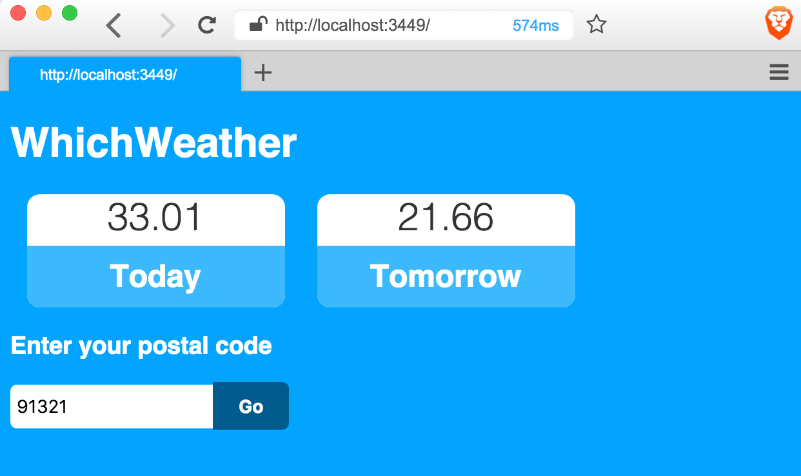
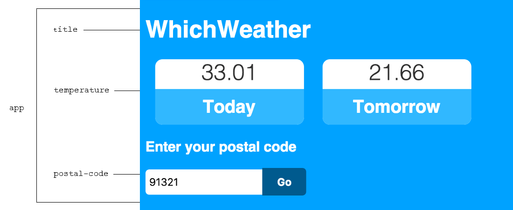
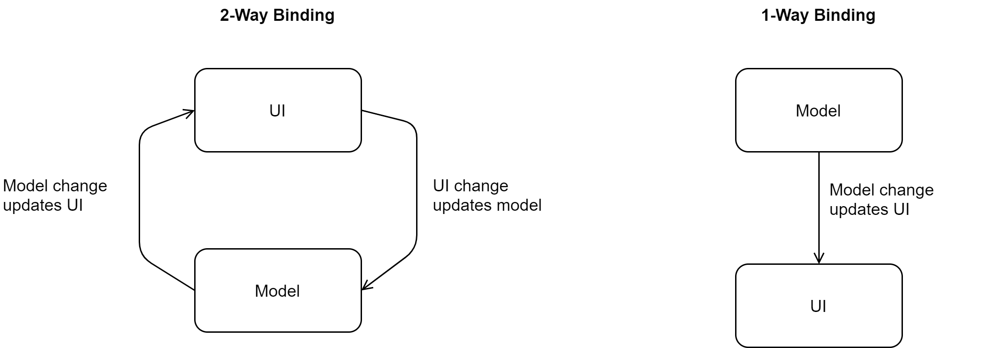

[UP](001_00.md)

### レッスン8：キャップストーン1 - 天気予報アプリ

ここ数回のレッスンでは、ClojureScript開発者にとって最も一般的なツールに慣れ親しんできました。コードを少しずつ書いてきましたが、その焦点はプロジェクトそのものにありました。このレッスンでは、少し方針を変えて、最小限のアプリを書くことに焦点を当てます。このレッスンは少し難しく、コードの詳細についてはほとんど説明しません。ここでの意図は、コードの細かい部分には触れずに、典型的なClojureScriptの開発ワークフローがどのようなものかを示すことです。ClojureScriptの基本的な構文やイディオムを学んだ後は、このレッスンに戻ってきて、何が起こっているのかをより深く理解できるようになるはずです。

-----
このレッスンでは

- ClojureScriptツールの知識を応用して、新しいプロジェクトを作成する
- REPL駆動のワークフローでClojureScriptアプリケーションを開発する
- Reagentフレームワークを体験する
-----

このレッスンでは、これまでの数回のレッスンで学んだスキルを活かして、シンプルな天気予報アプリを開発します。このアプリは、ユーザーの入力を受け入れ、サードパーティのAPIからデータを取得し、ReactとReagent ClojureScriptライブラリを利用して効率的なレンダリングを行います。このアプリは、ClojureScriptの最低限の知識だけで理解できるようなシンプルなものですが、ClojureScript開発の明確なイメージを与えるのに十分な代表的なものです。さあ、腕まくりをしてコードを書き始めましょう!



ClojureScriptシングルページアプリの実例

#### Reagentでアプリを作成する

ここまでに我々は、典型的な ClojureScript アプリケーションがどのようにレイアウトされているかを見て、clj-new を使用して ClojureScript プロジェクトをブートストラップしました。また、小さなコードを素早く反復するためにFigwheelが提供するライブ・リロード機能とREPLを探りました。ここでは、簡単な ClojureScript アプリケーションを使用して、ClojureScript 開発のハイレベルな紹介を終了します。先ほど生成したアプリケーションに戻ります。ClojureScriptアプリケーションをいかに素早く構成できるかを見ていきます。このレッスンの完全なコードは、[この本のGitHubリポジトリ](https://github.com/kendru/learn-cljs)で公開されていますので、自由にコードを引っ張ってくるだけで、ついていくことができます。ここでの目的は、言語としてのClojureScriptの裏と表を学ぶことではなく、生産的なClojureScriptがどのようなものかを知ることです。

試薬(Reagent)コンポーネントの作成

まず、コア名前空間を単純化して、1つのReagentコンポーネントを含み、それをレンダリングすることから始めましょう。

```Clojure
(ns ^:figwheel-hooks learn-cljs.weather                    ;; <1>
  (:require
   [goog.dom :as gdom]
   [reagent.dom :as rdom]
   [reagent.core :as r]))

(defn hello-world []                                       ;; <2>
  [:div
   [:h1 {:class "app-title"} "Hello, World"]])

(defn mount-app-element []                                 ;; <3>
  (rdom/render [hello-world] (gdom/getElement "app")))
(mount-app-element)

(defn ^:after-load on-reload []                            ;; <4>
  (mount-app-element))
```
src/learn_cljs/weather.cljs

1. 名前空間の宣言とReagentフレームワークのロード
2. シンプルなReagentコンポーネントを宣言する
3. ReagentコンポーネントをDOMにレンダリングする
4. コードを再ロードする際、Figwheelにアプリを再マウントするよう指示する

ほとんどのClojureScriptユーザーインターフェースは、宣言型コンポーネントを優先します。つまり、コンポーネントはDOMを直接操作するのではなく、どのようにレンダリングするかを記述します。このアプリケーションの`hello-world`コンポーネントは、Clojurized HTMLのように見えます。実際、Reagentコンポーネントの構文は、ClojureScriptデータ構造を使ってHTMLをエミュレートするように設計されています。ClojureScriptの他の側面と同様に、Reagentは、小さな構造から、より大きく、より有用な部分に組み合わせることができる小さなコンポーネントを奨励しています。

この`hello-world`コンポーネントは、ClojureScriptのデータ構造を返す単なる関数です。この関数に相当するJavaScriptを想像するのは簡単です。

```JavaScript
const helloWorld = () => {
    return ["h1", {"class": "title"}, "Hello, World"];
};
```

次に進む前に、ビルド構成の `:watch-dirs` エントリから「`test`」ディレクトリを削除する必要があります。

```Clojure
^{:watch-dirs ["src"] ;; Previously contained "test" as well
  :css-dirs ["resources/public/css"]
  :auto-testing true
   }
{:main learn-cljs.weather}
```
dev.cljs.edn

test ディレクトリを削除しなければならないのは、scaffolded test に、`learn-cljs.weather` 名前空間から削除した `multiply` 関数のテスト・ケースが含まれているからです。このウォッチを削除しないと、Figwheel はコードを再読み込みしません。

**クイックレビュー**

- `hello-world` コンポーネントに `app-title` というクラスができました。コンポーネントにも id 属性を追加し、ブラウザの開発ツールを使って変更がうまくいったことを確認してください。

##### アトムでの状態管理

Reagent はこの関数を実行して、DOM の構造に類似した構造に変えます。この関数が異なる値を返すたびに、Reagentはコンポーネントを再レンダリングします。しかし、このコンポーネントの場合、すべてが静的です。コンポーネントがダイナミックであるためには、変化する可能性のあるいくつかのデータをレンダリングしなければなりません。Reagentでは、アプリをレンダリングするために使用するすべてのデータをアトムの中に保持しています。アトムとは、変化する可能性のあるデータのための単なるコンテナです。アトムは、レッスン5で作成した定型的なコードの中ですでに使用されています。

```Clojure
(defonce app-state (r/atom {:text "Hello world!"}))
```

どのようなClojureデータ構造でも、`(atom ...)`で囲むだけで、アトムで包むことができます。アトムを利用する試薬(Reagent)コンポーネントは、アトム内のデータが変更されるたびに、自動的に再レンダリングします。この自動再レンダリング処理のおかげで、面倒なDOM操作を気にすることなく、宣言的なコンポーネントを書くことができるのです。

天気予報アプリでは、アプリ全体の状態をClojureScriptのマップをラップしたアトムの中に保持します。`(atom {})`. これにより、必要となるすべてのデータを1つの場所で管理することができます。このアプローチは、最も人気のあるJavaScriptフレームワークでデータを管理するためのさまざまなアプローチと比較すると、非常にシンプルです。天気予報アプリの状態は、タイトル、ユーザーが入力する郵便番号、そしてリモートAPIから取得する気温からなる、非常にシンプルなものになります。このアプリの状態のスケルトンを`cljs-weather.core`名前空間で作成することができます。

アプリケーションの初期状態
```Clojure
(defonce app-state (r/atom {:title "WhichWeather"
                            :postal-code ""
                            :temperatures {:today {:label "Today"
                                                   :value nil}
                                           :tomorrow {:label "Tomorrow"
                                                      :value nil}}}))
```

基本的なデータ構造が整ったところで、インターフェースを構成するコンポーネントを特定し、定義します。


我々のアプリのコンポーネント

試薬(Reagent)コンポーネント
```Clojure
(defn title []
  [:h1 (:title @app-state)])

(defn temperature [temp]                                   ;; <1>
  [:div {:class "temperature"}
   [:div {:class "value"}
    (:value temp)]
   [:h2 (:label temp)]])

(defn postal-code []
  [:div {:class "postal-code"}
   [:h3 "Enter your postal code"]
   [:input {:type "text"
            :placeholder "Postal Code"
            :value (:postal-code @app-state)}]
   [:button "Go"]])

(defn app []
  [:div {:class "app"}
   [title]                                                 ;; <2>
   [:div {:class "temperatures"}
    (for [temp (vals (:temperatures @app-state))]          ;; <3>
      [temperature temp])]
   [postal-code]])

(defn mount-app-element []                                 ;; <4>
  (rdom/render [app] (gdom/getElement "app")))
```

1. `temp`が渡されることを期待するReagentコンポーネント
2. コンポーネントを別のコンポーネントに入れ子にする
3. アプリの状態にある `:temperature` のそれぞれから`temperature`コンポーネントをレンダリングする
4. `hello-world`コンポーネントの代わりに`app`をレンダリングするようにReagentに指示する。

#### ユーザー入力への対応

アプリが動作し、データをレンダリングできるようになったので、次はユーザーにページを操作してもらいましょう。ここでは、ユーザーに郵便番号を入力してもらい、その場所の気象データを取得できるようにします。JavaScriptで行うように、イベントハンドラをinput要素にアタッチします。このハンドラは、キー操作のたびにアプリの状態を更新します。`postal-code`コンポーネントは、すでにアプリの状態から値を取得しています。ハンドラをアタッチするだけで、入力が同期された状態になります。

```Clojure
[:input {:type "text"
         :placeholder "Postal Code"
         :value (:postal-code @app-state)
         :on-change #(swap! app-state assoc :postal-code (-> % .-target .-value))}]
```

Reagentによる入力処理

このフローは、VueやAngular 1のようなJavaScriptフレームワークの「2ウェイ」データバインディングとは異なることに注意してください。例えば、AngularJSで同様の効果を得るためには、`postalCode`というステートの一部を管理するコントローラを作成し、このステートを入力にバインドします。内部的には、フレームワークは、状態が更新されるたびに、入力要素が新しい値で更新され、入力値がユーザーによって変更されるたびに、状態が更新されることを保証します。このフレームワークでは、モデルからUIだけでなく、UIからモデルの方向にも変更が伝わるようになっているため、2ウェイバインディングと呼ばれています。

```html
<div ng-app="whichWeather" ng-controller="inputCtrl">    <!--1-->
  <input ng-model="postalCode">                          <!--2-->
</div>

<script>
var app = angular.module('whichWeather', []);              // <3>
app.controller('inputCtrl', function($scope) {
    $scope.postalCode = '';                                // <4>
});
</script>
```
AngularJSで入力を扱う

1. フレームワークがどの状態を子要素で管理するかを知るために、マークアップにインジケータを用意します。
2. 入力要素を作成し、それにバインドされている状態を宣言します。
3. データを扱い、インタラクションを処理するアプリとコントローラを作成する。
4. 入力要素にバインドされる状態を初期化する

2ウェイバインディングは、非常にシンプルなアプリケーションには便利ですが、パフォーマンスに問題がある傾向があり、多くの状態（特に派生データ）を持つ大規模なアプリケーションでは、より困難になる可能性があります。本書で紹介するほとんどのアプリケーションで採用しているアプローチは少し異なり、実際にはもっとシンプルです。アプリケーションの状態とUIを自動的に双方向で同期させるのではなく、Reagent（および基盤となるReactフレームワーク）は、基盤となる状態が変化したときにのみUIを更新します。したがって、データモデルの観点からコンポーネントを記述し、入力を受け取ったときにそのモデルを更新し、UIが新しい状態を反映するようにフレームワークに任せるのです。


データバインディング戦略

一方通行のデータバインディングでは、モデルが唯一の真実の情報源とみなされ、モデルに対するすべての変更が明示的に行われます。これは、より自動化された2ウェイ・バインディングと比較すると不便に思えるかもしれませんが、推論やデバッグが非常に容易であり、大規模なアプリケーションではよりシンプルなロジックが可能になります。

**クイックレビュー**

- 郵便番号は常に数字であるべきだと仮定します。HTML5 の`number`入力タイプを使用するようにコンポーネントを変更します。
- 双方向データバインディングでは、入力が変更されるとモデルが更新され、モデルが変更されるとビューも更新されます。この処理がどのように違うのか説明してください。

入力が実際にアプリの状態を更新していることを確認するために、REPLを使用してアプリの状態の現在の値を調べることができます。アプリ状態変数の名前は `app-state` ですが、UI コンポーネントでは `@app-state` として参照されます。この演算子については後で詳しく説明しますが、今回の目的のためには、アトムの現在の値を抽出することを知っておく必要があります。現在のアプリの状態を表示するために UI コンポーネントから使うのと同じように、REPL からこの演算子を使うことができます。

```Clojure
@learn-cljs.weather/app-state
;; {:title "WhichWeather", :postal-code "81235", :temperatures
;;  {:today {:label "Today", :value nil}, :tomorrow {:label "Tomorrow", :value nil}}}
```

Calling an External API


[UP](001_00.md)
