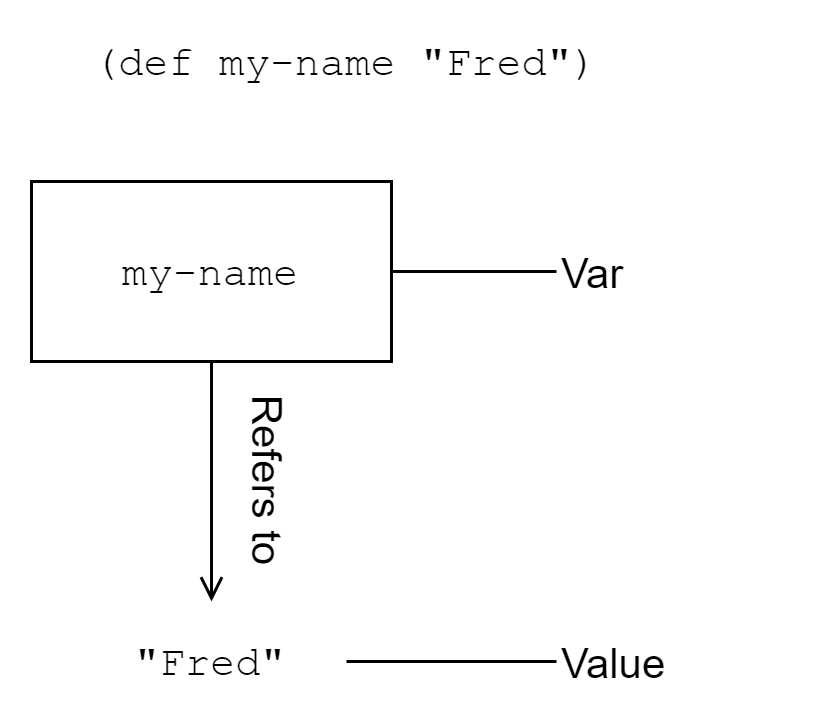

[UP](002_00.md)


### レッスン9：変数と値の使用

ClojureScriptは、私たちが変数について知っていると思っていることを、頭からひっくり返します。変更可能な変数について考える代わりに、変更できない値について考え始めるべきです。ClojureScriptには変数(`var`と呼ばれる)の概念がありますが、通常、変数が参照する値を変更することはできません。ClojureScriptは、varとその値を区別することに注意しています。JavaScriptのように、変数は別のオブジェクトを参照するように再定義することができますが、JavaScriptとは異なり、変数が参照するオブジェクトは変更できません。ClojureScriptを面白くしているのは、この「値でプログラミングする」という核心的な考え方です。実際、値はすべての関数型プログラミング言語の核心であり、不変の値と純粋な関数（レッスン12で説明し、ユニット4で再び説明します）の組み合わせが、非常に簡単に推論できるプログラミングスタイルを可能にすることがわかります。

このレッスンでは

- 不変の値と可変型変数の違いを理解する
- 値を命名する2つの主要な方法、`def`と`let`を学ぶ
- 値と、値を使ったプログラミングとについて説明します。

#### 変数について

varは、JavaScriptの変数とよく似ています。varはある値への変更可能な参照です。ミュータブルであるということは、最初はある値を参照し、後から別の値を参照することができるということです。

誰もが見知らぬ人ばかりのパーティに行くことを想像してみてください。ドアを開けると、自分の名前を書くための名札が渡されます。おそらく、あなたが名札に書いた名前が、他のパーティー参加者があなたを呼ぶときに使う名前になるでしょう。ここで、別の名前を持つ参加者と名札を交換したとします。あなたという人間は変わりません。新しい名札をもらっても、あなたのアイデンティティは変わらず、他の人があなたを呼ぶときに使う名前が変わるだけです。さらに、あなたの元の名札の名前を、他の人が使うようになっているのです。名札が自分のものでなくなったからといって、それが無効になるわけではありません。



VARを値にバインドする

この架空の状況は、varとvalueがどのように機能するかを示す例えです。valueはパーティーに参加する人々で、varは名札です。名前を付けた人に影響を与えることなく名前を変更することができるように、Varは名前を付けた価値観に影響を与えることなく変更することができます。varと値を関連付けることを、varを値にバインドするといいます。REPLで気軽にフォローしてみてください。

```Clojure
(def my-name "Fred")                                       ;; <1>
;; #'cljs.user/my-name

my-name
;; "Fred"

(defn mk-global [value]
  (def i-am-global value))
;; #'cljs.user/mk-global

mk-global                                                  ;; <2>
;; #object[ ... ]

(mk-global [4 8 15 16 23 42])
;; #'cljs.user/i-am-global

i-am-global                                                ;; <3>
;; [4 8 15 16 23 42]

(def ten 10)
;; #'cljs.user/ten

(def twenty (* ten 2))                                     ;; <4>
;; #'cljs.user/twenty

twenty
;; 20

ten                                                        ;; <5>
;; 10
```
変数(var)の定義

1. varである `my-name` を値 `"Fred"` にバインドする。
2. `defn` は関数を作成し、それを varである `mk-global` にバインドしました。
3. `mk-global` 関数の中で `i-am-global` というvar が定義されていても、それは `cljs.user` 名前空間のグローバルなものです。
4. 式は値に評価されるので、`twenty` は`(* ten 2)`の結果、つまり`20`に束縛されます。
5. tenに2を掛けても10の値が変わらないことを確認します。

##### シンボル

レッスン 3 では、シンボルについて簡単に説明しました。シンボルとは、基本的に何か他のもの（通常は var）を参照する名前です。上の REPL セッションでは、`my-name`、`mk-global`、`i-am-global`、`ten`、`twenty` はすべてシンボルです。つまり、これらは私たちがバインドしたvarを参照する名前です。ClojureScriptがプログラムコードを評価しているときにシンボルに遭遇すると、そのシンボルが参照しているものを評価しようとし、シンボルを既知の値に解決できない場合は警告を表示します。

```Clojure
(def x 7)                                                  ;; <1>
;; #'cljs.user/x

x                                                          ;; <2>
;; 7

'x                                                         ;; <3>
;; x

(defn doubler [x] (* 2 x))                                 ;; <4>
;; #'cljs.user/doubler

(doubler 3)
;; 6

y                                                          ;; <5>
;; WARNING: Use of undeclared Var cljs.user/y at line 1 <cljs repl>
;; nil
```
シンボル

1. シンボル`x`を使ってvarを参照する
2. シンボルは、それが参照するものとして評価されます。
3. シンボルの前に引用符を付けると、ClojureScriptはシンボルが参照するものではなく、シンボル自体を評価します。
4. 関数内では、シンボル `x` はグローバル変数ではなく、関数パラメータを参照します。
5. 何も参照していないシンボルを評価しようとしたときの警告

**やってみよう**

ClojureScriptでは、ほとんどすべてのものが値であり、varは任意の値に結合することができます。この知識をもとに、`def`を使ってこの関数を参照するvarを作成します。

```Clojure
(fn [message]
  (js/alert (.toUpperCase (str message "!!!!!!!!!!!!!!!!"))))
```

作成したvarを使って、この関数を呼び出すことはできますか？例：`(my-var "inconceivable")`

> 使い方をすでに知っている
>
> JavaScriptでは、すでに日常的に不変のデータを扱っています。JavaScriptの文字列や数値は不変であり、変更できない値です。それらから新しい値を導き出すことはできますが、（ありがたいことに）「1＝2」や「Unchangeable」＋＝「...or not」とは言えません。このような種類の値を不変と考えるのは至極当然のことですが、コレクションを不変と考えるのはもっと難しいことです。不変のデータ構造に出会ったことのある熟練したプログラマーは、不変のデータ構造を「かさばる」とか「資源を大量に消費する」と考える傾向があるかもしれません（実際、不変のデータ構造の実装の多くは非効率的です）。他の言語の変更可能なコレクションに慣れていたり、不変的なコレクションを実用的でないと考えていたりして、不変的なコレクションを扱う習慣を身につけるのには時間がかかります。しかし、いったん慣れてしまえば、マップやベクターなどを値として考えることは、文字列や数値を同じように考えるのと同じくらい自然なことです。

#### letによるローカルバインディングの作成

`def`は名前空間全体に見えるvarを作成しますが、より一時的な、あるいは範囲を絞った値を命名して使用したい場合があります。ClojureScriptでは、`let`を使ってこのようなローカルバインディングを作成します。`let`はvarと同様、名前と値を対応させますが、`let`の内容が評価された後も値は残りません。これは、不必要なvarsの束で名前空間を汚すことなく、関数の途中で便宜的に名前を付けたい場合に便利です。`let`式の形式は次のとおりです。

```Clojure
(let [bindings]
  expr1
  expr2
  ...
  expr-n)
```

`bindings`は `[a 20, b 10, c (+ a b)]` のような名前と値のペアで、`let`式全体は`let`のボディ内の最後の式の値として評価されます。最後の式の値のみが考慮されるため、他の式はコンソールへの出力やDOM操作などの副作用にのみ使用されます。ここでは、実際のアプリケーションでの`let`の使い方の例を示します。

```Clojure
(defn parse-msg [msg-raw]
  (let [msg-types {:c ::control
                   :e ::event
                   :x ::error}
        msg (reader/read-string msg-raw)
        type (:t msg)
        data (:d msg)]
    (println "Got data:" data)
    [(get msg-types type) data]))
```

ここでは、いくつかの重要な点に注意してください。まず、`let`で作成した名前（`msg-types`、`msg`、`type`、`data`）は、`let`内のコードでのみ定義され、`let`の評価が終了するとガベージ・コレクションされます。次に、最初に宣言した名前は、後のバインディングでも使用できます。たとえば、 `msg` は式 `(reader/read-string msg-raw)` を評価した結果として定義され、 `type` と `data` は `msg` を基準にして定義されています。これはごく当たり前のことで、より明確で簡潔なコードを書くことができます。

**クイックレビュー**

- `let`が、すでに定義されているvarと同じ名前のバインディングを作るとどうなりますか？次のコードの出力はどうなりますか？

```Clojure
(def name "Napoleon")

(let [name "Pedro"]
   (println "Vote 4" name))
```

- 次の関数は、あなたの好きなデザートの名前を教えてくれるように記入してください。

```Clojure
(let [desserts ["Apple Pie" "Ice Cream Sandwiches" "Chocolates" "Berry Buckle"]
      favorite-index 1
      favorite-dessert (get desserts favorite-index)]
   (println "All desserts are great, but I like" favorite-dessert "the best"))
```

Destructuring Bindings


[UP](002_00.md)
