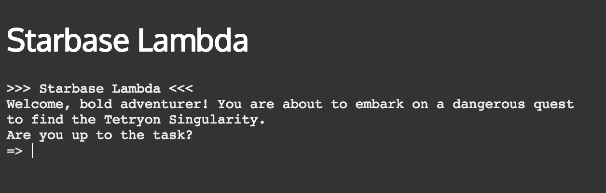
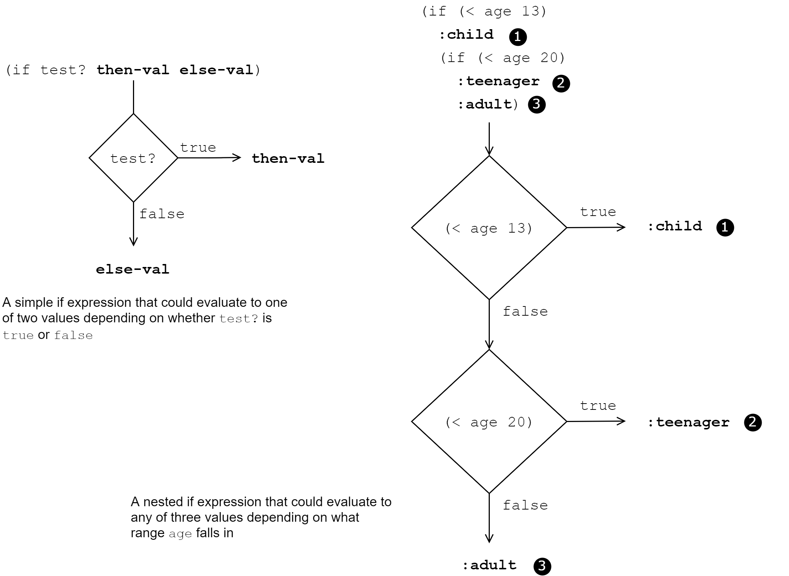

[UP](002_00.md)


### レッスン10：選択肢を作る

これまで私たちが書いてきたコードは、ある出発点から始まり、完成するまで進行するものがほとんどでした(*1)。コードには明確に定義されたタスクがあり、そのタスクを達成するためには、明確に定義された一連の命令に従わなければなりません。しかし、私たちに欠けていたのは、何らかの条件に応じて別の道を歩むことができるという「選択」の概念です。例えば、何百キロも続く、他の道と交わることのない道があったとします。その道を車で走るとしたら、別の道を通るかどうかを決める必要がないので楽ですが、その分、退屈なドライブになってしまいます。私たちが書くコードも同じです。上から下に向かって走るだけの、はっきりとした直線的な実行をするスクリプトを書くこともできますが、そうすると、最も面白くてやりがいのあるプログラムを見逃してしまうことになります。

-----
このレッスンでは

- 単純な選択をするために、`if`と`when`を適用する
- 真偽の概念とその定義に慣れる
- `cond`を使って複数の選択肢から選ぶ
-----

#### 例 アドベンチャーゲーム


テキストベースのアドベンチャーゲーム

このレッスンでは、テキストベースのシンプルなアドベンチャーゲームを作ります。アドベンチャーゲームは、仮想環境の中でユーザーに一連の選択をさせることで成り立っているので、条件分岐の概念を学ぶのに最適なゲームです。一度に一つのブロックを学ぶことに集中できるように、著者の端末エミュレータライブラリ[bterm](https://github.com/kendru/bterm)を使用します。これにより、DOM操作やイベント処理、大規模なフレームワークを学ぶことなく、制御構造の中核となる概念に集中することができます。

#### ifとwhenで簡単な選択をする

私たちが何かを選択するときには、通常、何かが真か偽かを判断する必要があります。例えば、特定のチェックボックスが選択されているか？アカウントの残高がある閾値を下回っているか？プレイヤーがインベントリに特定のポーションを持っているか？このような質問には、"yes "か "no "の2つの答えのどちらかしかありません。ClojureScriptは式を評価して動作しますので、これらの質問は通常、真か偽のどちらかに評価される式の形をしています。上記の質問がClojureScriptの式に変換されたものを想像してみましょう。

```Clojure
;; チェックボックスにチェックが入っているか？
(aget my-checkbox "checked")

;; アカウントの残高が閾値を下回っているか？
(< (:balance account) low-balance-threshold)

;; プレイヤーは在庫に知恵の薬を持っていますか？
(some #(= (:name %) "Potion of Wisdom")
      (get-inventory player))
```      
質問をする式

これらの式を評価すると（参照している変数が実際に定義されていると仮定して）、その値は真か偽のどちらかであると考えられるものになります。

##### ifによる選択

答えが真のときにはある選択をし、答えが偽のときには別の選択をしたいことがよくあります。このような場合には、ClojureScriptの`if`特殊形式を使用することができます。if式は次のような形をしています。

```Clojure
(if test-expr then-expr else-expr)
```

`if`は、「テスト」と、「テストが真の場合に使用する値」と、「テストが偽の場合に使用する値」の3つの式を取ります。`if`式全体の評価は、最初の式の値に応じて、2番目または3番目の式の値になります。先ほどの口座残高の例を使うと、次のように書くことができます。

```Clojure
(def account-status
  (if (< (:balance account) low-balance-threshold)         ;; <1>
    :low-balance                                           ;; <2>
    :ok))                                                  ;; <3>
```
1. バランスがあるポイントを下回っているかどうかをテストする
2. テストが真であれば `:low-balance` と評価する。
3. このテストが偽の場合、 `:ok` と評価します。

> NOTE: 特殊形式
>
> S式を書くと、ClojureScriptは式の最初のシンボルが関数名、マクロ名、または特殊形式に解決される限り、それを評価します。`if`の呼び出しは関数の呼び出しのように見えますが、`if`は実際には関数ではなく特別な形式です。私たちはこれまでしばらくの間、関数を書いてきましたし、後のレッスンではマクロの書き方を学びますが、特殊形式が言語に焼き付けられているのは、ライブラリ関数としては実装できないほど基本的なものだからです（少なくとも効率的ではありません）。ありがたいことに、開発者としての私たちの視点では、呼び出している特定のものが、関数、マクロ、特殊形式のどれであるかを気にする必要はありません。

`if`文の考え方は開発者なら誰でも知っているはずですが、ほとんどの言語の`if`文とClojureScriptの`if`には重要な違いがあります。ClojureScriptでは`if`は式なので、常に特定の値で評価されます。JavaScriptのような命令型言語では、`if`文は通常、どのコードブランチを実行するかの選択を行います。実際の`if`文では、値は得られません。例えば、次のようなものは有効なJavaScriptではありません。

```JavaScript
// This will throw a SyntaxError
const answer = if (someCondition) {
   'Yes';
} else {
   'No';
}
```
JavaScript のIFは式ではない

しかし、JavaScriptには式である三項演算子が用意されています。ClojureScriptの`if`式は、JavaScriptの三項演算子と非常によく似ていますが、扱うべき構文が一つ減りました!

```JavaScript
const answer = someCondition ? 'Yes' : 'No';
```
...しかし、Ternariesは

JavaScriptでは、ほとんどの命令型言語と同様に、条件付きで変数を設定したり、ユーザーに入力を促したり、DOMを操作したりするような副作用を実行するために`if`文を使います。ClojureScriptでは、通常、2つの値を決定するために`if`式を使用します。式全体が`then`式または`else`式のいずれかの値を取ります。2つ以上の値を選択するには、`then`式または`else`式のどちらかを別の（入れ子になった）`if`式に置き換えることでも実現できます。


条件付き評価

ただし、深く入れ子になったif式は読みにくいので、通常は`cond`で置き換えることができます。

**クイックレビュー**

- JavaScriptとClojureScriptの`if`の違いを説明します。
- `a`と`b`という2つの数値が与えられたとき、a > bであれば`"大きい"`、a < bであれば`"小さい"`、同じであれば`"同じ"`と評価する`if`式はどのように書きますか？

##### whenによる条件判断

`if`と密接な関係にあるのが`when`式です。`if`から`else`式を除いたものと考えることができます。

```Clojure
(when test-expr some-value)
```

テスト式が真の場合は、式全体が与えられた値に評価され、テストが偽の場合は、式が`nil`に評価されます。実際、`when`は、`else`式が`nil`である`if`の単なる省略形です。

```Clojure
(if test-expr some-value nil)
```

`when`の一般的な使用例としては、値が非nilのときのみ変換する場合と、ある条件が成立したときに何らかの副次的効果を発揮する場合があります。1つ目のケースでは、以下のようなコードをよく見かけます。

```Clojure
(defn conversion-rate [sessions]                           ;; <1>
  (let [users (user-count sessions)
        purchases (purchase-count sessions)]
    (when (> users 0)                                      ;; <2>
      (/ purchases users))))
```

1. ユーザーに対する購入数の比率を得るための関数を定義する
2. ゼロによる除算を防ぐためにwhenを使う

2つ目のケースでは、特定の場合にのみDOM操作やその他の副作用を行いたいことがよくあります。例えば、バックエンドのAPIからサーバーエラーを受け取ったときに、エラーメッセージをポップアップさせたい場合があります。

```Clojure
(when (< 499 (:status response))
  (show-error-notification (:body response)))
```

##### ifとwhenの適用

アドベンチャーゲームの例を考えてみると、ユーザーにYes/Noの質問をした後に何をするかを決めるのに`if`式を使うことができます。ここでは、ゲームの全体的なアーキテクチャについて説明します。ここでは、ゲーム全体をマップで表現します。キーは各ステートの名前で、値は特定の画面を表すマップです。ゲームのデータ構造の大まかな形は以下の通りです。

ゲームは、ユーザーが何らかの意思決定をしたときに、ステート間の移動方法を決定するルールを持つステートの集合体として表現します。

```Clojure
{:start { ... }
 :state-1 { ... }
 :state-2 { ... }
 :state-3 { ... }
 :win { ... }}
```

ゲームは、ユーザーがラムダ星基地の宇宙船に乗っているところから始まり、目的は**テトリオン特異点**の場所を明らかにすることです。ユーザーは簡単なコマンドを発行したり、「はい」「いいえ」の質問に答えたりします。

ゲーム内の各ステート（上記の`{ ... }`で埋められたもの）には、 `:type`, `:title`, `:dialog`, `:transitions` が含まれます。型は、ゲームがどのような状態であるか(例 `:start`, `:win`,  `:lose`)を決定します。タイトルとダイアログは、画面に何を表示するかを決定し、トランジションは、ユーザーの選択に応じて、どの状態に移行するかを決定します。例えば、以下のようになります。

```Clojure
{:type :start
 :title "Starbase Lambda"
 :dialog (str "Welcome, bold adventurer! You are about to embark on a dangerous "
              "quest to find the Tetryon Singularity.\nAre you up to the task?")
 :transitions {"yes" :embarked,
               "no" :lost-game}}
```
ゲームの状態の例

ユーザーがこの状態になると、タイトルとダイアログを画面に表示し、入力を促します。ユーザーが "yes "と入力した場合は `:embarked` ステートに進み、そうでない場合は `:lost-game` ステートに進みます。

このプロジェクトは、必要な依存関係が`deps.edn`に設定されており、基本的なマークアップやスタイルも含まれています。ここでは、Gitタグ `lesson10.1` を使って作業を行います。

##### 入力を促す

まず最初にやるべきことは、ユーザーが現在いるシーンのタイトルとダイアログを表示し、入力を促すことです。入力は後で行うことにして、ここではシーンの表示方法について考えてみましょう。今回使用しているbtermライブラリには、出力を制御するための便利な関数がいくつか用意されています。

- `print` - 画面をターミナルに表示します。
- `println` - ターミナルに画面を印刷し、最後に改行文字を付けます。
- `clear` - ターミナルからの既存の出力をすべて消去します。

これを踏まえて、シーンの表示方法を考えてみましょう。タイトルとダイアログを表示するのは当然ですが、ゲームに勝ったか負けたかを表示する必要があります。この場合、"You've Won!" か "Game Over" のどちらかを表示すればよいのです。これを実現するには、まず現在のシーンのタイプをテストし、タイプが `:win` または `:lose` の場合にのみゲーム終了メッセージを表示するようにします。

```Clojure
(when (or (= :win type)                                    ;; <1>
          (= :lose type))
  ;; Display message                                       ;; <2>
  )
```

1. ユーザーがエンドゲームの状態にあるかどうかをチェックする
2. 副作用として何らかのメッセージを表示する

さらに，ユーザが勝ったか負けたかによって，異なるメッセージを使いたいと思います．これは`if`で実現できます。

```Clojure
(io/println term
            (if (= :win type) "You've Won!" "Game Over"))
```

`if`式は、`type`の値に応じて"You've Won!"または"Game Over"と評価されます。

これらを、タイトルやダイアログの印刷と合わせて考えると、次のようになります。

```Clojure
(defn prompt [game current]                                ;; <1>
  (let [scene (get game current)                           ;; <2>
        type (:type scene)]
    (io/clear term)
    (when (or (= :win type)                                ;; <3>
              (= :lose type))
      (io/print term
                (if (= :win type)                          ;; <4>
                    "You've Won! "
                    "Game Over ")))
    (io/println term (:title scene))                       ;; <5>
    (io/println term (:dialog scene))
    (io/read term #(on-answer game current %))))           ;; <6>
```
入力に対するプロンプト表示

1. この関数は、ゲームのデータ構造全体と現在のシーンを受け取ります。
2. 関数の残りの部分で使用する2つのローカルバインディングを`let`で作成します。
3. 終盤のメッセージを条件付きで表示する
4. どのメッセージを印刷するかを決める
5. シーンの種類に関わらず、タイトルとダイアログを印刷します。
6. ユーザーが何を入力しても、これから書くon-answer関数を使って処理します。

##### 入力の処理

表示面の処理が終わったところで、次はユーザーの入力を処理したいと思います。先ほどのスニペットでは、ユーザーが答えを入力したときに`on-answer`関数に制御を渡しました。この関数は、`prompt`と同様に、ゲームのデータ構造全体と現在のシーンを示すキーが渡されますが、ユーザーがプロンプトで入力した文字列も渡されます。この情報をもとに、次にどのシーンを表示するかを決定し、もう一度ユーザーに入力を促す必要があります。このコードの雛形は以下の通りです。

```Clojure
(defn on-answer [game current answer]
  (let [scene (get game current)
        next ;; TODO: determine the next state
        ]
    (prompt game next)))
```

まず、"yes" または "no" の回答だけを処理する必要があります。2つの選択肢を決定するだけなので、`if`式は1つで十分です。

```Clojure
(if (= "yes" answer)
  (get-in scene [:transitions "yes"])
  (get-in scene [:transitions "no"]))
```

**やってみよう**

ゲームの状態にはもうひとつ、次のような形をした `:skip` を扱う必要があります。

```Clojure
{:type :skip
 :title "..."
 :dialog "..."
 :on-continue :next-state}
```

ユーザーが何を入力しても次の状態に進むように、`on-answer`関数に別の条件式を追加します。考えられる解決策を以下に示します。

```Clojure
(defn on-answer [game current answer]
  (let [scene (get game current)
        next (if (= :skip (:type scene))
               (:on-continue scene)
               (if (= "yes" answer)
                 (get-in scene [:transitions "yes"])
                 (get-in scene [:transitions "no"])))]
    (prompt game next)))
```

#### 真と偽と

続きを読む前に、ClojureScriptの真偽の概念について少し触れておきましょう。`if`や`when`に渡すテスト式は、`true`か`false`かという実際の真偽値にすることができますが、そうする必要はありません。JavaScriptのように、任意の値をテストとして渡すことができます。たとえそれが真偽値でなくても、言語はそれを「真」とみなしてテストを通過させるか、「偽」とみなしてテストを失敗させます。

偽であるとみなす特殊なケースがいくつかあるJavaScriptとは異なり、ClojureScriptでは非常にシンプルなルールに従っています：`false`と`nil`は偽であり、それ以外はすべて真です。

> ClojureScriptの真偽ルール
>
> `false`と`nil`は偽であり、その他の値はすべて真である。

**クイックレビュー**

- 以下の "TEST "の各値に対する`(if TEST "Truthy" "Falsy")`の値は何でしょうか。
  - `true`
  - `false`
  - `"false"`
  - `""`
  - `0`
  - `nil`
  - `js/NaN`
  - `[]`

#### condでより複雑な選択をする

`if`と`when`を使えば、技術的にはコード上で必要なあらゆる意思決定を処理することができます。しかし、`if`を使うのが面倒な場合もよくあります。ゲームにコマンドを追加して、ユーザーが "restart" と入力すると最初に戻り、 "help" と入力すると利用可能なコマンドが表示されるようにしてみましょう。オプションを増やしていくと、`if`式をどんどん入れ子にしていかなければなりません。ポケットナイフで木彫りの彫刻をするようなもので、うまくいくかもしれませんが、結果的には楽しいものではありません。

`cond`とその親戚である`condp`と`case`が登場しました。`cond`は、ある式と任意の数のテスト/結果のペアを受け取り、式全体が、最初のテストの後に来る "then" 式で評価され、それが真であることを示します。

```Clojure
(cond
  test-1 then-1
  test-2 then-2
  ;; ...
  test-n then-n)
```
`cond`の構造

他のテストが真でない場合、「通過する」値のテスト式として `:else` を使うのは慣用的である。`false`と`nil`だけが偽であることを思いだしてください、つまり、キーワード `:else` は常に真であり、先行するテストが満たされない場合に `cond` を満たすことを覚えておいてください。このゲームに追加したいコマンドを考えると、condを使った方がはるかにシンプルになります。


入れ子になったifをcondで置き換える

##### condpによる繰り返しのテスト

これができる限りのことであれば、かなりの改善になります。しかし、`condp`と呼ばれる`cond`のバリエーションを使えば、さらに物事を単純化することができます。`condp`も`cond`と同様、多くの選択肢の中から選ぶことができますが、各テスト式に共通するコードが多い場合、`condp`は通常、それを因数分解するのに役立ちます。今回のケースでは、"answer"の値が、すべてのテスト式において、ある文字列と等しいかどうかをテストする。

`condp`は、1)バイナリ述語、つまり、2つの引数を取り、真偽値を返す関数、例えば、`=` 2)すべてのテストの右辺として使用する式、3)任意の数の左辺のテスト式/結果のペア、を受け取ります。また，4) 事前のテストがどれも真でなかった場合に使用するオプションのデフォルト値を取ることもできます．

```Clojure
(condp pred expr
  test-expr-1 then-1
  test-expr-2 then-2
  ;; ...
  test-expr-n then-n
  default-expr)
```
condpの構造

`condp`は、テスト式と結果のペアごとに、テスト式と他の式に述語を適用し、テスト式が述語を通過した最初の結果値を評価します。紙面上では分かりにくいかもしれませんが、例を見れば一目瞭然です。ここでは、テキストベースのメニューを`condp`を使って書き直してみました。

```Clojure
(condp
  =                                                        ;; <1>
  answer                                                   ;; <2>
  "restart" (prompt game :start)                           ;; <3>
  "help" (show-help game current)
  "save" (save-state current)
  "easter-egg" (rickroll)
  (next-state game current answer))                        ;; <4>
```

1. 各選択肢をテストするために、`=` 述語関数を使用する
2. すべてのテストで、右辺として`answer`を渡す
3. 各節は`(= "restart" answer)`としてテストされます。
4. すべての先行テストが失敗した場合、デフォルトの式を提供する

入れ子になったif文を使った最初の実装に比べて、`condp`を使ったこのバージョンは、非常に簡潔で読みやすいものになっています。このような理由から、caseのような柔軟性が必要ない場合に、複数の値をテストするためにcondpは広く使われています。

**クイックレビュー**

- `cond`を使って、与えられた数字が正のときは`:pos`、負のときは`:neg`、ちょうど0のときは`:zero`と評価されるコードを書く。
- `condp`を使って同じことをするコードを書く。

#### まとめ

このレッスンでは、通常、分岐制御構造と呼ばれているものを学びました。JavaScriptなどの命令型言語とは対照的に、これらの構造は、実行の流れを指示する命令文ではなく、値を選択する式として使用されることを学びました。また、ClojureScriptの真偽の概念と、それが他の多くの言語のものよりも単純であることを学びました。これで、以下のことができるようになりました。

- `if`を使って2つの値を選択する
- `when`を使って条件付きでコードを評価する
- `cond`と`condp`を使った複数の選択肢の簡略化

ClojureScriptでは、他の言語とは少し異なる機能を持っていますが、これらの分岐メカニズムは、アプリケーションを書くために必要な最も基本的な構成要素の1つです。次に、制御構造のもうひとつのクラスであるループについて見てみましょう。

-----
(*1) 条件式を使ったコードサンプルをいくつか見てきましたが、これは面白いプログラムであれば、条件式はほとんど避けられないからです。


[NEXT](002_11.md)

[UP](002_00.md)
