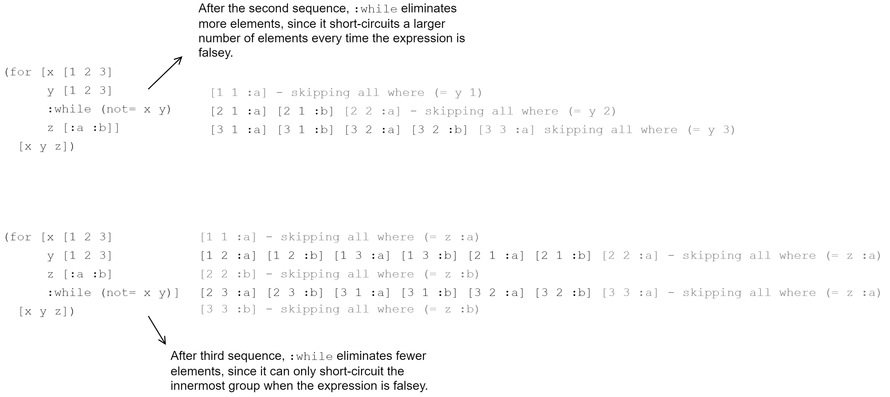

[UP](002_00.md)


### レッスン11：ループする

前回のレッスンでは、通常、分岐制御構造と呼ばれるClojureScriptのバージョンを見ました。しかし、ClojureScriptでは、私たちが慣れ親しんできた他の言語とは少し異なる動作をすることがわかりました。さて、もう1つの基本的なトピックであるループに入ると、ClojureScriptではまたしても少し違うことを学びます。

-----
このレッスンでは

- ClojureScriptのさまざまなループ構造を調べる
- シーケンスの観点から考えることを学ぶ
- 副作用のためにループを強制的に評価する
-----

命令型言語では、ループは同じ命令を何度も繰り返すために使用されます。通常、毎回何らかの小さな変化を加えて、最終的にループを終了させます。典型的な命令型ループは `while` ループで、コンピュータはある条件を満たすまで同じ命令を繰り返し実行します。

```JavaScript
let i = 0;                                                 // <1>

while (i < 10) {                                           // <2>
    console.log("Counting: " + i);
    i++;                                                   // <3>
}
```
JavaScriptのwhileループ

1. 変更される変数の初期化
2. ループの継続条件の設定
3. 通過するたびに`i`の値を増加させる

ClojureScriptは、データの不変性と式指向のプログラミングの両方を重視しており、ループは本質的に可変型であり文指向であることから、ClojureScriptにループのための場所があるかどうか疑問に思うでしょう。答えは「イエス」でもあり「ノー」でもあります。ループのような構成要素はいくつかありますが、よく見ると、それらは明示的なループを伴わない他の概念の抽象化であることがわかります。

#### `for`によるシーケンスの操作

このレッスンで学ぶ最初の、そしておそらく最も一般的な表現は`for`です。`for`は、ある種の命令型ループと名前が似ていますが、まったく別のものです。反復型の`for`とは対照的に、ClojureScriptの`for`は、既存のシーケンスを変換したり、オプションでフィルタリングしたりして、新しいシーケンスを作成するというシーケンス内包のアイデアを中心にしています。ClojureScriptでこのタスクを実行するには複数の方法がありますが、`for`は確かに簡潔で慣用的な選択肢です。

最も基本的な形として、`for`は任意の数のシーケンスとボディを受け取り、シーケンス要素のすべての組み合わせについてボディを評価することで新しいシーケンスを生成します。

```Clojure
(for [elem1 sequence1                                      ;; <1>
      elem2 sequence2]                                     ;; <2>
  expr)                                                    ;; <3>
```
`for`の解剖

1. `sequence1`の各要素を順番に`elem1`にバインドする
2. `sequence2`についても同様に行う
3. `sequence1`と`sequence2`の各要素の組み合わせに対して、結合した`elem1`と`elem2`で`expr`を評価する

##### 単一のシーケンスでの`for`の使用

`for`は任意の数のシーケンスをサポートしていますが、実際には1つか2つのシーケンスで使用されることがほとんどです。最も一般的な使い方は、先に述べたように、シーケンス変換としてです。例えば、数字のリストがあって、それぞれの2乗を求めたいとします。ここで求めたいのは、各要素が元のリストの対応する要素の2乗である新しいリストを生成するプロセスを何らかの形で記述することです。ありがたいことに、これは言葉で表現するよりもコードで表現する方がより簡単です。

```Clojure
(for [n (range 10)]                                        ;; <1>
  (* n n))                                                 ;; <2>
;; (0 1 4 9 16 25 36 49 64 81)
```
0から9の2乗を求める

1. 0〜9の数字を使って新しいシーケンスを作る。
2. 新しいシーケンスの各数字を元の数字の2乗にする

ここまでで、`for`が1つの入力シーケンスで使用された場合、全シーケンス変換を記述することがわかると思います。ClojureScriptを使用する際には、目の前の問題がシーケンス変換として表現できるかどうかを考えてみましょう。もしそうであれば、`for`は何の変哲もない解決策を提供します。同じ問題を`for`を使って反復的に解くことを考えてみましょう。いくつかの直角三角形があるとします。直角に隣接する辺はわかっているので、それぞれの三角形の斜辺を求めなければなりません。Fistは、JavaScriptによる反復的な解決法です。

```JavaScript
let sides = [[4.2, 6], [4, 4], [3, 4], [5.5, 3]];          // <1>
let lengths = [];                                          // <2>
let i;

for (i = 0; i < sides.length; i++) {                       // <3>
    lengths.push(
        Math.sqrt(
                Math.pow(sides[i][0], 2) +
                Math.pow(sides[i][1], 2)
        )
    );
}
```
斜辺の長さを反復的に求める

1. 三角形の辺を2次元の配列としてモデル化する
2. 結果の長さを格納する配列を宣言する
3. 辺の要素を繰り返し処理し、計算された斜辺の長さを毎回 `lengths` 配列に格納する

これは非常にわかりやすい反復コードですが、ClojureScriptで必要とされるレベルよりもまだ低レベルのものです。このようなループでは、インデックスが混ざってしまったり（例えば、`sides[i][0]`と`sides[0][i]`）、off-by-1エラーが発生しやすくなります。この問題は、ある配列を別の配列に変換しているだけなので、簡単に`for`を使うことができます。

```Clojure
(let [sides-list (list [4.2 6] [4 4] [3 4] [5.5 3])]       ;; <1>
  (for [sides sides-list]                                  ;; <2>
    (Math.sqrt (+ (Math.pow (first sides) 2)               ;; <3>
                  (Math.pow (second sides) 2)))))
                                                           ;; <4>
;; (7.323933369440222 5.656854249492381 5 6.264982043070834)
```
斜辺の長さを`for`で求める

1. 直角三角形の2辺を表すペアのリストを宣言します。
2. リストのすべてのペアに変換を適用するためにfor式を使用する
3. ピタゴラスの定理を適用して、斜辺の長さを求める。
4. 結果は、各三角形の斜辺を持つ数列です。

**クイックレビュー**

- 点のペアが次のように与えられます。[[x, y], [x, y]] という座標が与えられたとき，点間の距離を計算する`for`式を書きなさい．ヒント：これは前の例と非常によく似ています。

##### 複数の配列に対する`for`の使用

`for`は、複数の配列の要素を組み合わせることができるのが特徴です。複数の配列が与えられた場合、各入力配列の単一要素のユニークな組み合わせごとに要素を生成します。このような組み合わせは「直交積」と呼ばれ、数学的集合論の重要な概念です。例えば、電子商取引のアプリを書いていて、ある商品には色、サイズ、スタイルなどいくつかのバリエーションがあるとします。`for`を使って、可能なすべての商品の組み合わせを得ることができます。

```Clojure
(let [colors [:magenta :chartreuse :taupe]                 ;; <1>
      sizes [:sm :md :lg :xl]
      styles [:budget :plain :fancy]]
  (for [color colors                                       ;; <2>
        size sizes
        style styles]
    [color size style]))                                   ;; <3>
;; ([:magenta :sm :plain] [:magenta :sm :regular] [:magenta :sm :fancy]
;; ... [:taupe :xl :plain] [:taupe :xl :regular] [:taupe :xl :fancy])
```
`for`による製品バリエーションの生成

1. 3つの配列を宣言する
2. 各コレクションから1つのアイテムの可能なすべての組み合わせを取る
3. 各色、サイズ、スタイルの組み合わせのベクトルを生成する

この例では、結果として得られた商品の組み合わせに対して、`[color size style]`のベクトルにまとめる以外には何もしていませんが、必要に応じてあらゆる変換を行うことができました。反復ループを使って同じタスクを実行するには、3階層の入れ子になったループを書かなければならないことを考えてみてください。

##### ループ修飾子：let、when、while

ここまでは、1つ以上の配列からすべての要素を取り出すという、基本的な`for`の形式のみを使用してきました。これは多くのユースケースで有効ですが、結果をフィルタリングしたい場合もあります（例えば、小さいサイズで豪華な商品を提供したくない場合など）。`for`がリストを生成した後にフィルタリングするのではなく、`:when`修飾子を使って`for`式自体に直接フィルタリングのロジックを組み込むことができます。繰り返しになりますが、結果を出す前に何らかの中間値を計算したい場合があります。`for`の本体に`let`式を入れ子にする代わりに、`:let`修飾子を使うことができます。最後に、あるカットオフポイントまでの要素だけを取り出したい場合は、`:while`修飾子を使用することができます。これらの修飾子を説明するために、少し不自然な例を使ってみましょう。

```Clojure
(for [n (range 100)                                        ;; <1>
      :let [square (* n n)]                                ;; <2>
      :when (even? n)                                      ;; <3>
      :while (< n 20)]                                     ;; <4>
  (str "n is " n " and its square is " square))            ;; <5>

;; ("n is 0 and its square is 0"
;; "n is 2 and its square is 4"
;; "n is 4 and its square is 16"
;; ...
;; "n is 18 and its square is 324")
```
`for`修飾子

1. 0〜99の範囲でnを取る
2. シンボル`square`のバインディングを宣言し、nの2乗として各反復を行う
3. nが偶数である値のみを含める
4. nが20になるまで続ける

これらの修飾子を使用するには，シーケンス式のリストにその修飾子を追加すればよいのです．どの修飾子も理解するのが難しいものではありませんので、次に進む前に、それぞれの修飾子の概要を簡単に説明します。

- **:let**は`for`の本体内に任意の数のバインディングを作成します。`:let`では、`for`式で定義されているシンボルや、スコープ内の他の変数を使用できます。使い方は、通常の`let`形式と同じです。
- **:when**は、どの入力に対して値を出力するかを決定します。`:when`は、どのような入力に対して値を出力するかを決定します。 `:when`の後には述語式が続き、その式が真である場合にのみ値を出力します。
- **:while**は、`:when`と似ていますが、複数の入力シーケンスで使用される場合、最も直接的な「グループ」を短絡的に判断します。つまり、あるシーケンス式の後に配置された場合、配置された後のシーケンスの残りの要素をスキップし、前のシーケンスの次の項目と配置された後のシーケンスの最初の項目を取ることで形成される組み合わせを続行します。この動作を説明するために、while節の配置が次の例の動作にどのように影響するかを考えてみましょう。


`:while`修飾子の動作

**クイックレビュー**

- `x`と`y`という2つの値を`(range 50)`から受け取り、`x`と`y`の積が100未満のとき、すべての偶数値の`x`と奇数値の`y`に対して`[x y]`というペアを生成する`for`式をホワイトで作成しましょう。
- 製品のバリエーションの例に戻り、 `:when` を使って `:magenta` と `:fancy` の両方を持つすべてのバリエーションを除外しましょう。

#### `loop`と`recur`を使った明示的な再帰の実行

次のレッスンでは、再帰関数、つまり、自分自身を呼び出す関数について詳しく見ていきます。その前段階として、2つの数字の最大公約数を計算する[ユークリッドアルゴリズム](https://en.wikipedia.org/wiki/Euclidean_algorithm)を使った簡単な再帰関数を紹介します。

```Clojure
(defn gcd [x y]                                            ;; <1>
  (if (= y 0)
    x
    (gcd y (mod x y))))                                    ;; <2>
;; #'cljs.user/gcd
(gcd 90 60)                                                ;; <3>
;; 30
```
再帰関数

1. ユークリッド・アルゴリズムを用いて`gcd`関数を定義する
2. この関数は最後に自分自身を呼び出します。
3. `90`と`60`の入力で関数をテストする

次に見ていくループ状の構造は、`loop`と`recur`の動的な組み合わせです。`loop`/`recur`は、再帰的な処理を行いたいが、そのための独立した名前のついた関数は必要ないという場合に使用します。`loop`で使う一般的な形式は以下の通りです。

```Clojure
(loop [name-1 init-value-1                                 ;; <1>
       name-2 init-value-2]
  body-exprs                                               ;; <2>
  (recur next-value-1 next-value-2))                       ;; <3>
```
`loop`の分解

1. ループの最初のパスに、任意の数のバインディングとその値を渡す
2. 任意の数のボディ式
3. 任意でループの最初に戻り、次の反復での各バインディングの値を渡す

これは、ClojureScriptが持つ伝統的な命令型ループに最も近い構造です。(*1) 上で紹介した`gcd`関数を`loop`/`recur`形式に変換するのは簡単なことです。

```Clojure
(defn gcd-loop [a b]
  (loop [x a                                               ;; <1>
         y b]
    (if (= y 0)
      x                                                    ;; <2>
      (recur y (mod x y)))))                               ;; <3>
;; #'cljs.user/gcd-loop
(gcd-loop 90 60)
;; 30
```
`loop`による`gcd`の実装

1. 関数の入力でループを初期化する
2. `y`が`0`の場合に`x`を返す
3. `y`が`0`でない場合に再帰する

上で見たように，条件式の一方の分岐に`recur`の呼び出しを置き，もう一方の分岐に別の値を置くことで，ループの終了と再帰のタイミングを簡単に制御することができます．これにより、おそらく命令型ループで慣れ親しんだような粒度を、より少ない定型文で実現することができます。

##### recurの意味

`loop`は非常に便利な構造で、多くの種類の再帰関数を単純化することができます。しかし、すべての再帰関数を置き換えることはできず、「末尾再帰関数」と呼ばれる特定のクラスのみを置き換えることができます。これらの特殊な関数は、関数の最後に行うこと（「末尾」の位置）として自分自身を呼び出すものです。前回のレッスンで述べたように、再帰関数が自分自身を呼び出すたびにスタックフレームが消費され、深く再帰するとJavaScriptランタイムはエラーを出して実行を停止します。しかし、`loop`と`recur`で書かれた再帰処理は、ClojureScriptコンパイラが命令型ループに最適化することができるため、任意の深さまで再帰することができます。このような理由から、`loop`も通常は関数型再帰よりも高速です。

`loop`は末尾再帰でしか動作しないため、再帰の後に評価が行われないように注意する必要があります。ありがたいことに、ClojureScriptコンパイラは、再帰が末尾にない場合に警告を発し、再帰を移動するまでコードをコンパイルしません。以下は、適切な再帰呼び出しと不正な再帰呼び出しの例です。

```Clojure
(loop [i 0
      numbers []]
 (if (= i 10)
   numbers
   (recur (inc i) (conj numbers i))))                      ;; <1>
;; [0 1 2 3 4 5 6 7 8 9]
(loop [i 7
       fact 1]
  (if (= i 1)
    fact
    (* i (recur (dec i) (* i fact)))))                     ;; <2>
;; ----  Could not Analyze  <cljs form>   line:5  column:22  ----
;;
;;   Can't recur here at line 5 <cljs repl>
;;
;;   1  (loop [i 7
;;   2         fact 1]
;;   3    (if (= i 1)
;;   4      fact
;;   5      (* i (recur (dec i) (* i fact)))))
;;               ^---
;;
;; ----  Analysis Error  ----
;; nil
```
合法と非合法な`recur`

1. ループの中で最後に評価されるものが再帰である場合、再帰は合法である。
2. 再帰の後に`i`を掛ける必要があるので、ここでは再帰できません。

このように、すべての再帰関数が`loop`に変換できるわけではありませんが、変換できる場合にはパフォーマンス上のメリットがあることがわかります。以上、`loop`について簡単にご紹介しましたが、本書では`loop`を頻繁に使用しますので、より深く理解する機会があると思います。

#### 副作用のための'loop'

これまで、シーケンス内包の`for`と、明示的な再帰の`loop`/`recur`について説明してきました。ClojureScriptのルーピングには、もう一つのカテゴリーがあります：副作用のためのルーピングです。副作用とは、DOMノードの追加や削除、サーバーサイドAPIへのデータ送信など、プログラムが実行する純粋な計算以外に引き起こす効果のことを思い出してください。

ClojureScriptの難しさの1つは、`for`を含む多くのシーケンス操作が遅延的であることです。つまり、呼び出されるまで結果を出さないということです。以下の`for`式を考えてみましょう。

```Clojure
(for [i (range 10)]
  (println i))
```

これをREPLに入力すると、期待通りに0～9の数字が表示されます。しかし、`for`が生成した配列からいくつかの値だけを要求すると、意外な結果が出てきます。

```Clojure
(take 3                                                    ;; <1>
  (for [i (range 10)]
    (println i)))
;; 0                                                       ;; <2>
;; 1
;; 2
;; (nil nil nil)                                           ;; <3>
(do (for [i (range 10)]
      (println i))
    (println "Done"))
;; Done
;; nil                                                     ;; <4>
```
遅延評価

1. `for`式で与えられたシーケンスから3つの要素だけを取り出す
2. `println`は10回ではなく3回しか呼ばれません。
3. `println`は`nil`を返すので、結果は`nil`が埋められたシーケンスとなる
4. `for`式の結果が必要になることはないので、数字は表示されません。

`for`は、他の計算を行うために結果が必要な場合にのみ評価されます。後のレッスンで説明するように、この怠惰さはある種の場合には非常に便利ですが、副作用を扱う場合には予期せぬ動作を引き起こす可能性があるため、評価を強制する必要があります。

##### `dorun`による既存のシーケンスの評価

シーケンスが完全に評価されたことを確認するための最初で最も簡単な方法は、シーケンスを `dorun` でラップすることです。`dorun`は、シーケンスが与えられただけで、すべての値を実現するために必要なコードを連続して実行し、`nil`を返します。例えば，上の例では，`for`式を`dorun`で囲むだけで，数字を強制的に表示することができます．

```Clojure
(do (dorun                                                 ;; <1>
      (for [i (range 10)]
        (println i)))
    (println "Done"))
;; 0                                                       ;; <2>
;; 1
;; 2
;; 3
;; 4
;; 5
;; 6
;; 7
;; 8
;; 9
;; Done
;; nil
```
遅延シーケンスの強制的な評価

1. `dorun`で`for`をラップする
2. すべての数値が期待通りに表示される

##### `doseq`による効果のループ

各要素が呼ばれるたびに副作用を実行するシーケンスがある場合には `dorun` を使うことが多いですが、既存のシーケンスを反復して各要素に対して副作用を実行したい場合の方が多いです。このような場合には，`doseq`を使うことができます．`dose`qの構文は`for`と同じですが（修飾子を含む），すぐに評価され，シーケンスの代わりに`nil`が返されます．ユーザーのリストをバックエンドAPIに送信することを考えた場合、コードが期待通りに評価されることを確実にしたいので、以下の例のように`doseq`を使用することができます。

```Clojure
(defn send-to-api [user]                                   ;; <1>
  (println "Sending to API:" user))
;; #'cljs.user/send-to-api
(let [users [{:name "Alice"}
             {:name "Bob"}
             {:name "Carlos"}]]
  (doseq [user users]                                      ;; <2>
    (send-to-api user))
  (println "Done!"))
;; Sending to API: {:name Alice}                           ;; <3>
;; Sending to API: {:name Bob}
;; Sending to API: {:name Carlos}
;; Done!
;; nil
```
1. `send-to-api`関数をスタブ化する
2. `users`コレクションをイテレートする
3. 副作用はすぐに実行される

ここでは、`users`リストを反復処理して、各ユーザーの`send-to-api`を呼び出しています。この関数の戻り値は気にしていないので、`doseq`はここでの完璧なオプションです。

**クイックレビュー**

- 先ほどの例で、`doseq`の代わりに`for`を使っていたらどうなっていたでしょうか？
- `dorun`に似た`doall`という関数があります。オンラインで調べて、どのような場合にどちらかを使うのか説明してください。
- DOM操作は副次的な効果です。DOMと組み合わせて`doseq`を使うユースケースにはどのようなものがありますか？

#### まとめ

ClojureScriptの中核となるループ機能を見てきました。`for`や`while`のループは多くの言語で重要ですが、ClojureScriptにはこれらの概念すらないことがわかりました。ClojureScriptのループ機能は、次の3つのうちのどれかを中心に構成されています。

- 配列操作(`for`)
- 再帰(`loop`/`recur`)
- 副作用の評価の強制（`doseq`)

最初は伝統的な命令型のループを使わずに問題を解決するのは難しいと思うかもしれませんが、すぐに「Clojure風」の解決法の方が簡単であることに気づくでしょう。シーケンスや再帰で考えることに慣れてくると、ClojureScriptのやり方が自然に身についてきます。


-----
(*1) 興味深いことに、`loop`はJavaScriptの`while`ループにコンパイルされます。


[UP](002_00.md)
