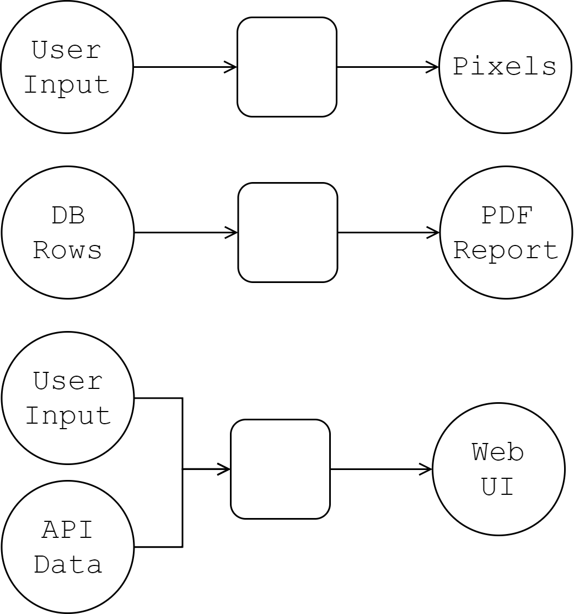
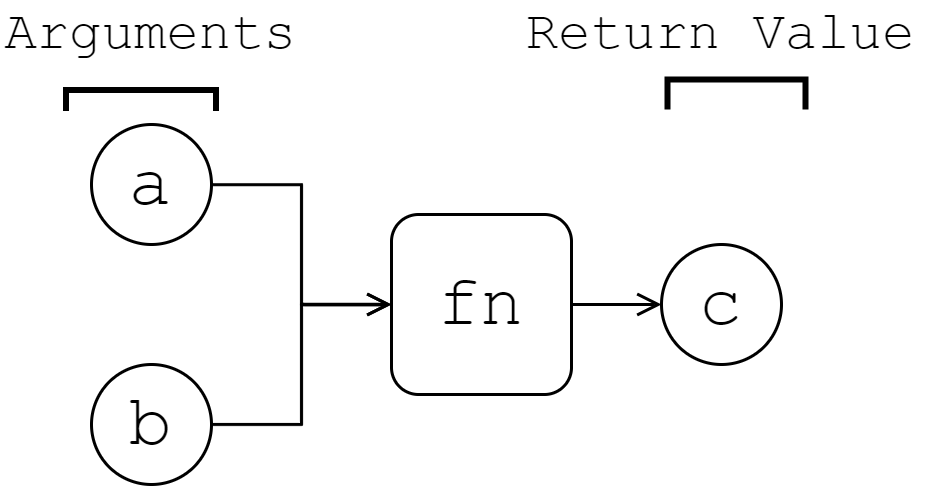
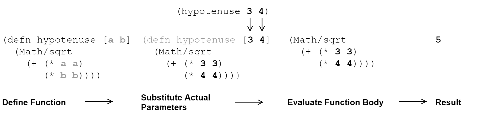

[UP](002_00.md)


### レッスン12：関数を使ってコードを再利用しよう

ClojureScriptは、関数型プログラミング言語です。関数型プログラミングのパラダイムは、私たちにスーパーパワーを与えてくれますが、好き嫌いは別として、コードの書き方にも一定の要求があります。関数型コードの意味するところ（不変データ、副作用の最小化など）についてはすでに説明しましたが、ここまでは関数とは何か、ましてや慣用的な使い方については勉強していませんでした。このレッスンでは、ClojureScriptにおける関数とは何かを定義し、その定義と使用方法を学びます。最後に、コードを別々の関数に分割する場合のベストプラクティスと、ClojureScriptで頻繁に遭遇する特殊なクラスの関数である再帰関数の使い方を見ていきます。

-----
このレッスンでは

- ClojureScriptの最も基本的なプログラミング構造を学ぶ
- 共通のコードを関数に抽出して美しいコードを書く
- 再帰関数を使って一般的な問題を解決する
-----

#### 関数について

あなたがこれまでに書いてきたプログラムを考えてみてください。主に企業向けのソフトウェアを書いている人もいるでしょう。ゲームを書いている人もいるでしょう。また、ウェブ上で素晴らしい体験を生み出すデザイナーの方もいらっしゃるでしょう。プログラムには非常に多くの種類がありますが、そのすべてを1つの共通した考え方に集約することができます。プログラムとは、データとして何らかの入力を受け、何らかの出力を生成するものです。企業向けソフトウェアでは、フォームを入力してデータベースの行を生成したり、データベースの行を入力して何らかのユーザーインターフェースを生成したりします。ゲームでは、マウスの動きやキーの押し方、仮想環境に関するデータを受け取り、ピクセルや音波の記述を生成する。インタラクティブなWebページも、ユーザーの入力を受けてマークアップやスタイルを生成します。


プログラムがデータを変換する

これらのケースでは、プログラムは1つまたは複数のデータを他のデータに変換します。関数は、これらのデータ変換を記述するビルディングブロックです。関数は、他の関数を組み合わせて、より便利で高度な変換を行うことができます。

関数型プログラミングは、データの動きを記述するものだと考えることができます。データを割り当てたり変更したりするステートメントでアルゴリズムを考える命令型コードとは異なり、コードはプログラムの中をデータがどのように流れていくかを記述したものと考えることができるのです。このような宣言的なプログラムを書くための鍵となるのが関数です。各関数は、0個以上の入力値（引数）を持ち、必ず何らかの出力値を返します。(*1)


関数は入力を出力にマッピングする

#### 関数の定義と呼び出し

文字列、数値、キーワードと同様に、ClojureScriptの関数は値です。これは、変数に割り当てたり、引数として他の関数に渡したり、他の関数から返したりできることを意味します。JavaScriptの関数も第一級の値であるため、JavaScriptのプログラマーにとっては目新しい概念ではありません。

```JavaScript
const removeBy = (pred) => {                               // <1>
    return list =>                                         // <2>
        list.reduce((acc, elem) => {
            if (pred(elem)) {
                return acc;
            }
            return acc.concat([elem]);
        }, []);
}

const removeReds = removeBy(                               // <3>
    product => product.color === 'Red'
);

removeReds([
    { sku: '99734N', color: 'Blue' },
    { sku: '99294N', color: 'Red' },
    { sku: '11420Z', color: 'Green' },
]);
```

1. 関数を変数に代入する `removeBy`
2. 関数を返す
3. 関数を他の関数の引数として渡す

このコードをClojureScriptに直訳する(*2)と、とてもわかりやすいものになります。

```Clojure
(def remove-by                                             ;; <1>
  (fn [pred]
    (fn [list]                                             ;; <2>
      (reduce (fn [acc elem]
                (if (pred elem) acc (conj acc elem)))
              []
              list))))

(def remove-reds                                           ;; <3>
  (remove-by (fn [product] (= "Red" (:color product)))))

(remove-reds
  [{:sku "99734N" :color "Blue"}
   {:sku "99294N" :color "Red"}
   {:sku "11420Z" :color "Green"}])
```

1. 関数の変数への代入、`remove-by`
2. 関数を返す
3. 関数を他の関数の引数として渡す

JavaScriptは、Lispの1つであるSchemeの機能の多くを念頭に置いて設計されているので、関数が両言語で似たような働きをすることは驚くことではありません。主な違いは、意味的なものではなく、構文的なものです。それでは、関数を定義するための構文を見てみましょう。

##### fnとdefn

関数は`fn`という特殊な形式で定義します。最も基本的なバージョンでは、`fn`はパラメータのベクトルと、評価するための1つまたは複数の式を受け取ります。関数が呼び出されると、引数はパラメータの名前に束縛され、関数の本体が評価されます。関数は、その本体に含まれる最後の式の値に評価されます。例として、1つの配列に2つ目の配列のすべての要素が含まれているかどうかを調べる関数を考えてみましょう。

```Clojure
(fn [xs test-elems]                                        ;; <1>
  (println "Checking whether" xs                           ;; <2>
           "contains each of" test-elems)
  (let [xs-set (into #{} xs)]                              ;; <3>
    (every? xs-set test-elems)))
```

1. 2つのパラメータを受け取る関数を宣言する
2. 最初の式は副作用がないか評価され，その結果は捨てられます．
3. 関数全体では，最後の式の値を受け取ります

この例では，パラメータベクトルと2つの式で構成されるボディを持つ `fn` の基本的な形式を示しています．最初の式は、いくつかのデバッグ情報を記録しており、意味のある値には評価されないことに注意してください。関数自体は最後の式の値を受け継ぎ，`xs` と `test-elems` は関数が呼び出されたときの実際の値で置換されます．

```Clojure
(let [xs-set (into #{} xs)]
  (every? xs-set test-elems))
```

**無名関数の略記法**

無名関数には、`fn`と名前付き引数リストを省略することでキー操作を数回減らすことができる、より簡潔な構文もあります。次の例では、この省略された構文を使用します。

```Clojure
#(let [xs-set (into #{} %1)]
   (every? xs-set %2)))
```

このように、関数自体は`#(...)`で定義され、各引数は、`%1`、`%2`などの位置で参照されます。関数が1つの引数しか取らない場合は、その引数は単に`%`で参照されます。

```Clojure
(#(str "Hello " %) "world")
;; => "Hello world"
```

この構文は便利ですが、意図がすぐにわかるような非常に小さな関数にしか使わないようにしましょう。通常のケースでは、名前付き引数の明確さを考慮して、少し長い構文を使用することをお勧めします。また、2つ以上の引数を取る関数では、この構文は必要以上に混乱を招くことが多いです。これはClojureScriptのコードではまだかなり一般的で、イベントコールバックによく使われます。

**名前付き関数の定義**

便利な関数を宣言したのに、名前がないので呼び出す方法がないことに気づいたかもしれません。ここで`defn`の出番です。`defn`は、関数を宣言すると同時に、それをvarにバインドするための略記法です。

```Clojure
(def contains-every?                                       ;; <1>
  (fn [xs test-elems]
    ;; function body...
    ))

(defn contains-every? [xs test-elems]                      ;; <2>
  ;; function body...
)
```

1. 無名関数をvar(`contains-every?`)にバインドする
2. 関数の定義とバインドを同時に行う `defn`

このように、`defn` は名前付きの関数を作りたいときに便利な略記法です。

プログラムをきれいに保つために、通常は関連する関数を名前空間にまとめます。`def`または`defn`を使って関数をvarにバインドすると、その関数はpublicになり、他の名前空間からも要求できるようになります。ClojureScriptでは、明示的にプライベートにしない限り(*3)、varはデフォルトでエクスポートされます。最高レベルの実装以外はすべて隠そうとするオブジェクト指向プログラミングとは異なり、Clojureは小さな関数を可視化して合成することを目的としています（しばしば異なる名前空間から）。名前空間と可視性については、[レッスン23](004_23.md)でさらに詳しく説明します。

##### `defn`のバリエーション

先ほど学んだ`defn`の基本形は最も一般的なものですが、いくつかの追加構文を使用することもできます。

**複数のアリティ**

まず、関数は複数のアリティを宣言することができます。これは、与えられた引数の数に応じて動作が変わるというものです。複数のアリティを宣言するには、各パラメータリストと関数本体を、関数名の後に別のリストで囲みます。

```Clojure
(defn my-multi-arity-fn
 ([a] (println "Called with 1 argument" a))                ;; <1>
 (                                                         ;; <2>
  [a b]                                                    ;; <3>
  (println "Called with 2 arguments" a b)                  ;; <4>
 )
 ([a b c] (println "Called with 3 arguments" a b c)))

(defn my-single-arity-fn [a]                               ;; <5>
  (println "I can only be called with 1 argument"))
```

1. 基本的な`defn`形式とは異なり、各関数の実装はリストで囲まれています。
2. 各関数の実装では，リストの最初の要素がパラメータ・ベクトル
3. ...その後に1つ以上の式が続き，そのアリティの実装の本体を形成します。
4. 単一アリティの関数では，関数本体を構成するパラメータと式はリストで囲む必要はありません．

複数アリティの関数は、デフォルトのパラメータを与えるためによく使われます。ショッピングカートに商品を追加する次のような関数を考えてみましょう。3項版では`product-id`と一緒に数量を指定することができ、2項版ではこの3項版をデフォルトの数量`1`で呼び出しています。

```Clojure
(defn add-to-cart
 ([cart id] (add-to-cart cart id 1))
 ([cart id quantity]
  (conj cart {:product (lookup-product id)
              :quantity quantity})))
```

ClojureScriptの関数は、明示的に宣言されたアリティでしか呼び出すことができないので、これはJavaScriptとは驚くべき違いがある部分です。つまり、1つのパラメータで宣言された関数は1つの引数でしか呼び出すことができず、2つのパラメータで宣言された関数は2つの引数でしか呼び出すことができない、といった具合です。

**ドックストリング**

関数には、docstringを含めることができます。これは、インラインドキュメントとして機能する、関数の短い説明です。ドックストリングを使用する場合は、関数名の直後に記述します。

```Clojure
(defn make-inventory
  "Creates a new inventory that initially contains no items.
  Example:
  (assert
    (== 0 (count (:items (make-inventory)))))"
  []
  {:items []})
```

単純に関数の上にコメントを置くのではなく、docstringを使用する利点は、docstringがコンパイルされたコードに保存されるメタデータであり、REPLに組み込まれている`doc`関数を使ってプログラムでアクセスできることです。

```Clojure
dev:cljs.user=> (doc make-inventory)
-------------------------
cljs.user/make-inventory
([])
  Creates a new inventory that initially contains no items.
  Example:
  (assert
    (== 0 (count (:items (make-inventory)))))
nil
```

**事前条件と事後条件**

ClojureScriptは、[プログラミング言語Eiffel](https://www.eiffel.org/)が提唱した「契約による設計」のコンセプトからヒントを得ています。関数を定義するとき、その関数が何をするかについての契約を、前置条件と後置条件の観点から指定することができます。これらは、関数の直前と直後にそれぞれ評価されるチェックです。これらのチェックのいずれかが失敗した場合、JavaScriptエラーが投げられます。

前置条件と後置条件のベクトルは、パラメータリストの直後のマップで、前置条件には`:pre`キーを、後置条件には`:post`キーを使って指定できます。各条件は `:pre` または `:post` ベクトル内の式として指定されます。これらはいずれもパラメータ名で関数の引数を参照することができ、ポストコンディションでは`%`を使って関数の戻り値を参照することもできます。

```Clojure
(defn fractional-rate [num denom]
  {:pre [(not= 0 denom)]                                   ;; <1>
   :post [(pos? %) (<= % 1)]}                              ;; <2>
  (/ num denom))

(fractional-rate 1 4)
;; 0.25

(fractional-rate 3 0)
;; Throws:
;; #object[Error Error: Assert failed: (not= 0 denom)]
```

1. 1つの前置条件が指定され、`denom`が決してゼロではないことを保証します。
2. 結果が1以下の正の数であることを保証する2つの後置条件が指定されます。

##### やってみよう

- REPLで、1つの引数を取る関数を定義し、それを2つの引数で呼び出します。どうなりますか？
- 1つの引数を取る関数のパラメータリストと関数本体をリストで囲んでみてください。これは有効でしょうか？
- これまでに学んだ`defn`の高度な機能をすべて組み合わせて、docstring、複数のアリティ、前置/後置条件を持つ関数を作成してみましょう。

#### 式としての関数

さて、機械的に関数を定義する方法を学んだところで、一歩下がって、関数とは何かを考えてみましょう。レッスン4「式と評価」で、ClojureScriptでの評価のメンタルモデルを作成したことを思い出してください。内部のS式がどのように評価され、その結果が外部の式に代入されるかを思い出してください。

```Clojure
(* (+ 5 3) 2)
;; => (* 8 2)
;; => 16
```

レッスン4では、`(+ 5 3)`のようなS式が`8`と評価されることは当たり前だと思っていましたが、それがどのようにして起こるのかは考えていませんでした。この評価のメンタルモデルを拡張して、関数が呼び出されたときにどうなるかを説明する必要があります。

関数を定義するときには、パラメータのリストを宣言します。これらを関数の形式的なパラメータ(`formal parameters`)と呼びます。関数本体は、これらの形式的なパラメータのどれを参照しても構いません。関数が呼び出されると、形式的なパラメータのすべてのインスタンスが、実際のパラメータ(`actual parameters`)と呼ばれる渡された引数に置き換えられた関数本体に置き換えられます。これを説明するのは少し難しいのですが、簡単な例で説明しましょう。

```Clojure
(defn hypotenuse [a b]                                     ;; <1>
  (Math/sqrt
    (+ (* a a)
       (* b b))))

(str "the hypotenuse is: " (hypotenuse 3 4))               ;; <2>

(str "the hypotenuse is: " (Math/sqrt                      ;; <3>
                             (+ (* 3 3)
                                (* 4 4))))

(str "the hypotenuse is: " 5)                              ;; <4>

"the hypotenuse is: 5"                                     ;; <5>
```

1. 斜辺(`hypotenuse`)という関数を定義する
2. 先ほど定義した関数を呼び出す
3. 関数の呼び出しを、`a` の代わりに `3` を、`b` の代わりに `4` を代入して、関数定義の本体に置き換えます。
4. 結果の式を評価します。
5. 最終的な値が得られるまで評価を続ける


パラメータの置換

関数を別の式のテンプレートと考えると、既存の評価モデルにうまく適合します。ClojureScriptの関数は、暗黙的に変更可能なコンテキストを持たないため、JavaScriptよりもシンプルな概念です。JavaScriptでは、標準的な関数は特別な`this`変数を持っています。この変数は、関数が読み込んで変更することができる何らかのオブジェクトを参照することができます。関数がどのように定義されているかによって、`this`は異なるものを参照する可能性があり、経験豊富な開発者でもこれにつまづいてしまうことがあります。対照的に、ClojureScriptの関数は純粋で、いかなる追加の状態も持ち歩きません。この純粋さが、私たちの式の評価モデルにうまく適合しているのです。

##### クロージャ

ClojureScriptの関数は、デフォルトでは共有された可変型の状態に自動的にアクセスすることはありませんが、関数がどのように評価されるかを推論する際に考慮しなければならないもう1つの詳細があります。ClojureScriptでは、JavaScriptと同様に、関数はレキシカルスコープを持ちます。つまり、関数が定義されている場所で見えるあらゆるシンボルを参照できます。関数がそのレキシカルスコープから変数を参照する場合、クロージャを作成すると言います。例えば、同じ名前空間で以前に宣言されたすべての変数を参照することができます。

```Clojure
(def http-codes                                            ;; <1>
  {:ok 200
   :created 201
   :moved-permanently 301
   :found 302
   :bad-request 400
   :not-found 404
   :internal-server-error 500})

(defn make-response [status body]
  {:code (get http-codes status)                           ;; <2>
   :body body})
```

1. 現在の名前空間に var を定義する
2. 関数内でこの var を参照すると、その上にクロージャが作成される

ClojureScriptには高階の関数という概念があるので、他の関数から返された関数は、親関数のスコープから変数を参照することもできます。

```Clojure
(def greeting "Hi")                                        ;; <1>

(defn make-greeter [greeting]                              ;; <2>
  (fn [name]
    (str greeting ", " name)))                             ;; <3>

((make-greeter "Здрасти") "Anton")
;; => "Здрасти, Anton"
```

1. シンボル`greeting`は、この名前空間内でHiの値を持つvarを参照します。
2. この関数内では、`greeting` は名前空間レベルの var ではなく、渡された引数を参照します。
3. 内部の関数は、親関数のスコープから `greeting` をクローズアップします。

この例では、`make-greeter`から返された関数が`greeting`に対するクロージャを作成しています。仮に`(make-greeter "Howdy")`と呼ぶと、結果の関数は評価されるたびに常に`greeteter`の代わりに `"Howdy"`を代入することになります。`make-greeter`関数の外側でシンボル`greeting`に束縛された別の値があったとしても、内側の関数はそれを見ることができません。なぜなら、関数自体の近くに同じ名前の別のシンボルがあるからです。名前空間レベルの`greeting`は、内側の`greeting`によって影になっていると言います。クロージャについては[レッスン21](004_21.md)でさらに詳しく説明し、クロージャに対応するためには評価のメンタルモデルをどのように変更する必要があるかを見ていきます。

##### 抽象化としての関数

上で見たように、関数は式を再利用するための方法ですが、それ以上のものでもあります。関数は、ClojureScript開発者にとっての主要な抽象化手段です。関数は、ある変換の詳細を名前の後ろに隠します。いったん式を抽象化してしまえば、それがどのように実装されているかについては、もう気にする必要はありません。我々の期待に沿うものであれば、ボンネットの中で何が起こっているかはもう気にする必要はありません。トリビアルな例として、`add`関数のいくつかの潜在的な実装を見てみましょう。

```Clojure
(defn add [x y]                                            ;; <1>
  (+ x y))

(defn add [x y]                                            ;; <2>
  (if (<= y 0)
    x
    (add (inc x) (dec y))))

(defn add [x y]                                            ;; <3>
  47)

(add 17 23)                                                ;; <4>
```

1. 2つの数字を加算する基本的な関数
2. 加算のための別の関数。あまり効率的ではありませんが、動作します。
3. 非常に意見の多い足し算の関数です。残念ながら、ほとんどの場合間違っています。
4. `add`関数を呼んでみましょう。私たちが知っているのは、この関数が数字を足すことになっているということだけです。

本当の力を発揮するのは、特定の粒度の高い関数からより高いレベルの抽象化に移行したときです。ClojureScriptでは、新しいプロジェクトを始めるときに、問題領域の小さな詳細やプロセスを記述する小さな関数をたくさん作り、それらの関数を使って、もう少し小さな詳細やプロセスを定義することがよくあります。このような「ボトムアップ」プログラミングを行うことで、興味のある抽象度だけに集中することができ、その関数が構成されている下位の関数や、その関数が実装の詳細として機能している上位の関数を気にする必要がなくなります。

**クイックレビュー**

- `my-inc`を使って、数値の増分を返す関数を定義してください。同じ名前の関数を`defn`を使わずに定義するにはどうすればよいですか？
- 形式的なパラメータと実際のパラメータの違いは何ですか？
- クロージャの文脈でのシャドウイングの意味は？

#### 再帰101

このレッスンの最後のトピックとして、再帰関数を取り上げます。先に述べたように、再帰関数とは単に自分自身を呼び出すことができる関数のことです。前章では`loop`/`recur`を使って、関数の中で再帰を実装しました。今回は、古典的な階乗関数を使って再帰関数を実装する方法を見てみましょう。

```Clojure
(defn factorial [n]
  (if (<= n 1)
    n                                                      ;; <1>
    (* n (factorial (dec n)))))                            ;; <2>
```

1. ベースケース - もう`factorial`を呼び出さない
2. 再帰的なケース - `factorial`を再度呼び出す

この例は、JavaScriptの経験がある読者には意外と知られていないでしょう。再帰は、ClojureScriptでもJavaScriptと基本的に同じように動作します。再帰呼び出しのたびにスタックが大きくなるので、スタックがオーバーフローしないように注意する必要があります。しかし、関数が末尾再帰的である場合、つまり評価の最後の段階で自分自身を呼び出す場合は、前回のレッスンで`loop`を使ったのと同様に`recur`特殊形式を使うことができます。唯一の違いは、`loop`がない場合、`recur`はその中の関数を再帰的に呼び出すことです。これを知っていれば，スタックを増やさない末尾再帰的な`factorial`を書くことができます．

```Clojure
(defn factorial
 ([n] (factorial n 1))
 ([n result]
  (if (<= n 1)
    result
    (recur (dec n) (* result n)))))
```

ClojureScriptは、前回のレッスンで`loop`/`recur`で行ったように、この再帰関数を単純なループに最適化することができます。

**クイックレビュー**

- 再帰の仕組みがよくわからない場合は、「再帰101」に戻って読んでみてください。

#### まとめ

このレッスンでは、ClojureScriptの関数についてかなり詳しく見ていきました。`fn`と`defn`の違いを学び、`defn`が取り得る様々な形式を学びました。関数の評価モデルを検討し、一般的な式を抽出する手段として関数を紹介しました。最後に、再帰関数を見て、末尾再帰関数を最適化するために`recur`をどのように使うかを見ました。JavaScriptとClojureScriptは関数を似たような方法で見ていますが、今後の混乱を避けるために、違いのある部分を指摘するようにしました。

-----
1. 実際には、多くの関数が`nil`を返します。`nil`とは、意味のある値が存在しないことを示す値です。`nil`を返す関数は、副次的に呼び出されることが多いです。
2. このコードサンプルは、ClojureScriptとJavaScriptの関数の類似性を説明するために、直訳を意図しています。慣用的なClojureScriptではありませんし、標準ライブラリを利用していません。
3. 関数は、`defn`ではなく`defn-`で宣言することでプライベートにすることができます。


[NEXT](002_13.md)

[UP](002_00.md)
