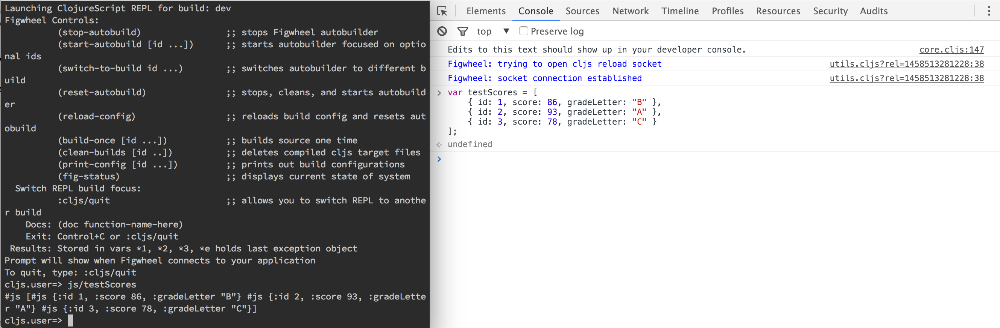
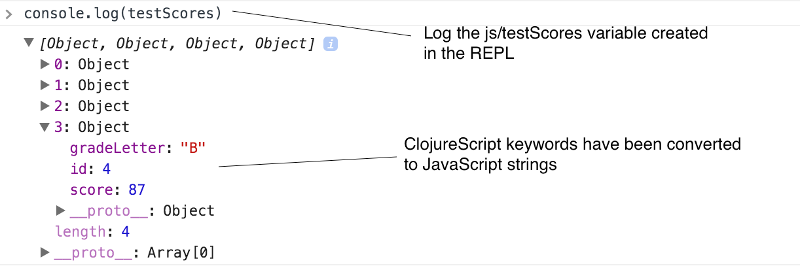

[UP](002_00.md)


### レッスン13：JavaScriptのデータを操作する

ClojureScriptの利点の一つは、JavaScriptとの優れた相互運用性です。Clojureが最初に発表されたとき、その主要な目標の一つは、既存のJavaコードとの簡単な統合を提供することでした。ClojureScriptは、ホストプラットフォームとの統合を大切にするというこの精神を引き継いでいます。JavaScriptの相互運用性については後ほど詳しく説明しますが、ここでは、JavaScriptのデータ構造の作成と操作について説明します。

-----
このレッスンでは

- ClojureScriptとJavaScriptのデータ型の変換
- 既存のJavaScriptコードベースにClojureScriptコードを統合する
- ミュータブルなJavaScriptオブジェクトと配列の使用の意味を理解する
-----

#### 例 従来のコードとの統合

従来の JavaScript アプリケーションをゆっくりと ClojureScript に移行することに決めたとします (素晴らしい選択です)。しかし、コードベースの大きさのために、一度に一つの部分を移行する方がより現実的です。それまでの間は、ClojureScriptからレガシーアプリケーションである教室管理アプリケーションと対話する必要があります。レガシーアプリケーションからスコアのリストを読み込んで、ClojureScriptで修正を行い、その結果をJavaScriptアプリケーションに送り返す必要があります。幸いなことに、ClojureScriptはJavaScriptとの相互運用性に優れていますので、その方法を学んでみましょう。

#### 変換関数の使用

既存のJavaScriptコードベースやライブラリで作業していると、JavaScriptのデータ構造を渡している可能性がありますが、アプリケーション内ではClojureScriptのデータとして扱いたいと思っています。ClojureScriptには、JavaScriptとClojureScriptのデータ構造を変換するための2つの便利な関数があります。これらの関数を使えば、プログラムに入ってきたデータをClojureScript構造に変換し、出てきたデータをJavaScriptに戻すことが簡単にできます。

REPLとそれに接続されているブラウザタブを開いて、これを試してみましょう。開発ツールを開き、以下のような `testScores` というオブジェクトを作成します。

```JavaScript
var testScores = [                                         // <1>
  { id: 1, score: 86, gradeLetter: "B" },                  // <2>
  { id: 2, score: 93, gradeLetter: "A" },
  { id: 3, score: 78, gradeLetter: "C" },
];
```
JSオブジェクトの作成

1. トップレベルの構造は、オブジェクトの配列です。
2. ネストされたオブジェクトには、`id`、`score`、`gradeLetter` プロパティがあります。

これにより、`testScores`というJavaScriptのグローバル変数が作成され、REPLからアクセスできるようになります。ClojureScriptでは、`js`という名前空間（関数やデータを集めるためのモジュールのようなもの）を作成し、ブラウザ内で利用可能なすべてのグローバル変数を格納します。例えば、`document`オブジェクトには`js/document`、`window`オブジェクトには`js/window`などでアクセスできます。


ブラウザとREPL間のデータ共有

REPLを使って、この変数を検査し、ClojureScriptのデータ構造に変換し、修正して、新しいバージョンを`testScores`変数に書き戻すことができます。

```Clojure
cljs.user=> (def cljs-scores (js->clj js/testScores))      ;; <1>
#'cljs.user/cljs-scores

cljs.user=> cljs-scores
[{"id" 1, "score" 86, "gradeLetter" "B"}
{"id" 2, "score" 93, "gradeLetter" "A"}
{"id" 3, "score" 78, "gradeLetter" "C"}]

cljs.user=> (conj cljs-scores                              ;; <2>
                  {"id" 4, "score" 87, "gradeLetter" "B"})
[{"id" 1, "score" 86, "gradeLetter" "B"}
{"id" 2, "score" 93, "gradeLetter" "A"}
{"id" 3, "score" 78, "gradeLetter" "C"}
{"id" 4, "score" 87, "gradeLetter" "B"}]

cljs.user=> cljs-scores
[{"id" 1, "score" 86, "gradeLetter" "B"}
{"id" 2, "score" 93, "gradeLetter" "A"}
{"id" 3, "score" 78, "gradeLetter" "C"}]

cljs.user=> (def updated-scores                            ;; <3>
              (conj cljs-scores {"id" 4, "score" 87, "gradeLetter" "B"}))
#'cljs.user/updated-scores

cljs.user=> (set! js/testScores (clj->js updated-scores))  ;; <4>
#js [#js {:id 1, :score 86, :gradeLetter "B"}
#js {:id 2, :score 93, :gradeLetter "A"}
#js {:id 3, :score 78, :gradeLetter "C"}
#js {:id 4, :score 87, :gradeLetter "B"}]
```
JavaScriptとClojureScriptのデータ変換

1. `testScores`をClojureScriptの値に変換する
2. 新しいスコアを追加して修正した値を作成し、var `cljs-scores` の値が変更されていないことを確認する
3. 更新されたスコアを `updated-scores` var にバインドする
4. 更新されたスコアを JavaScript オブジェクトに戻し、`testScores` を新しい値に更新する

新しいスコアを含むように変更されたことを確認するために、ブラウザで `testScores` 変数を検査することができます。


更新された`testScores`を検査する

**クイックレビュー**

まだ、`js/testScores`変数への参照が残っています。
- ブラウザの開発者ツールでこの変数を変更し、ClojureScriptから出力したらどうなるでしょうか？
- このJavaScriptの変数を変更すると、`cljs-scores`変数に影響しますか？

> 注意
>
> ClojureScriptはJavaScriptよりも豊富なデータ型を持っているので、`clj->js`は非可逆的な操作となります。例えば、集合はJSの配列に変換され、キーワードやシンボルは文字列に変換されます。つまり、varの`x`に含まれるあるClojureScriptの値は、`(js->clj (clj->js x))`と常に等しいわけではないのです。例えば、`#{"Lucy" "Ricky" "Fred" "Ethel"}`という集合があって、これをJavaScriptに変換すると、`["Ricky", "Fred", "Lucy", "Ethel"]`という配列になります（覚えておいていただきたいのですが、セットには順序がありませんので、配列に変換したときの要素の順序は任意です）。この配列をClojureScriptに戻すと、以下に示すように、最初に持っていたセットではなく、`["Ricky" "Fred" "Lucy" "Ethel"]`というベクトルになってしまいます。
>```Clojure
>cljs.user=> (def characters #{"Lucy" "Ricky" "Fred" "Ethel"})
>#'cljs.user/characters
>cljs.user=> (def js-characters (clj->js characters))
>#'cljs.user/js-characters
>cljs.user=> js-characters
>#js ["Ricky" "Fred" "Lucy" "Ethel"]
>cljs.user=> (js->clj js-characters)
>["Ricky" "Fred" "Lucy" "Ethel"]
>cljs.user=> (= characters (js->clj js-characters))
>false
>```

**やってみよう**

- REPLからJavaScriptオブジェクトを作成し、`window.myVar`として利用できるようにします。
- 開発ツールで`jsObj`という名前のJavaScriptオブジェクトを作成し、ClojureScript REPLの`set!`関数を使って変更する。

#### JavaScriptデータを直接扱う

「外の世界」からのJavaScriptデータをClojureScriptデータに変換してから作業するのが一般的ですが、ClojureScript内から直接JavaScriptデータを作成したり変更したりすることも可能です。ClojureScriptの数値、文字列、およびブーリアンは、JavaScriptの対応するものと同じなので、ClojureScriptからネイティブに扱うことができます。

##### オブジェクトの使用

オブジェクトは、`js-obj`関数またはリテラル構文の`#js {}`で作成できます。

```Clojure
cljs.user=> (js-obj "isJavaScript" true, "type" "object")  ;; <1>
#js {:isJavaScript true, :type "object"}

cljs.user=> #js {"isJavaScript" true, "type" "object"}     ;; <2>
#js {:isJavaScript true, :type "object"}
```
JavaScriptオブジェクトの構築

1. `js-obj`関数によるオブジェクトの作成
2. リテラル`#js {}`構文によるオブジェクトの作成

`js-obj`関数は偶数の引数を取ります。引数はkeyとvalueのペアであることが予想されます。リテラル構文は、ClojureScriptのマップに`#js`をつけたような形をしています。どちらの形式も同じJavaScriptオブジェクトを生成しますが、リテラル構文の方が圧倒的に多く使われています。

また、JavaScriptオブジェクトのプロパティを取得するには、プロパティアクセス構文を使います。`(.-property object)`でJavaScriptオブジェクトのプロパティを取得したり、`set!`関数でプロパティを更新することができます。

```Clojure
cljs.user=> (def js-hobbit #js {"name" "Bilbo Baggins", "age" 111})
#'cljs.user/js-hobbit
cljs.user=> (.-age js-hobbit)
111
```

プロパティアクセス構文の変形版では、JavaScriptオブジェクトのプロパティ検索を連鎖させるのと同様に、ネストされたオブジェクト内のプロパティへのアクセスをサポートしています。例えば、JavaScriptでは、次のようにすることができます（すべての中間プロパティが有効であると確信している場合）。

```JavaScript
// JavaScript nested lookup
var settings = {                                           // <1>
  personal: {
    address: {
      street: "123 Rolling Hills Dr",
    },
  },
};

// Prints "123 Rolling Hills Dr"
console.log(settings.personal.address.street);             // <2>
```

1. ネストされたJavaScriptオブジェクト
2. ネストされたプロパティへのアクセス

ClojureScriptでプロパティ・アクセスを使用すると、同じタスクを実行できます。構文は、通常のプロパティ・アクセスとは若干異なります。`(.. obj -propOne -propTwo)`のようになります。

```Clojure
(println
  (.. settings -personal -address -street))
; Prints "123 Rolling Hills Dr"
```

ClojureScriptでは、入れ子になっている可能性のあるオブジェクトのプロパティを読み取ることができるだけでなく、オブジェクトを変異させるための`set!`関数が用意されています。この関数は、プロパティへのアクセスと、設定する新しい値を受け取り、指定されたプロパティでオブジェクトを変異させ、供給された値を返します。

```Clojure
cljs.user=> (set! (.-name js-hobbit) "Frodo")              ;; <1>
"Frodo"

cljs.user=> (set! (.-age js-hobbit) 33)
33

cljs.user=> js-hobbit                                      ;; <2>
#js {:name "Frodo", :age 33}
```

1. js-hobbitオブジェクトに2つのプロパティを設定する。
2. `set!`でオブジェクトを変更する

**実験**

プロパティ・アクセスがネストしたプロパティをサポートしているので、`set!`関数がネストしたプロパティの設定をサポートするのは当然です。REPLを使用して、次の生徒の物理の授業での成績を設定するための正しい構文を探してみましょう。

```Clojure
(def student #js {"locker" 212
                  "grades" {"Math" "A",
                            "Physics" "B",
                            "English" "A+"}})
```

これまで見てきたClojureScriptデータを操作する関数とは異なり、`set!`はその場でオブジェクトを変更します。これは、変更可能なJavaScriptデータを扱っているからです。

##### 配列の使用

JavaScriptのオブジェクトを作成するための関数やリテラルの構文があるように、JavaScriptの配列を作成するための`array`関数や`#js []`リテラルを使用することができます。

```Clojure
cljs.user=> (array "foo" "bar" "baz")
#js ["foo" "bar" "baz"]

cljs.user=> #js [1 3 5 7 11]
#js [1 3 5 7 11]
```

配列へのアクセスには，`aget`関数と`aset`関数を使うことができます．`aget`は，JavaScriptの配列と，その配列へのインデックスを受け取り，そのインデックスにある要素を返します．`set!`と同様に、`aset`は配列をその場で変異させます。

```Clojure
cljs.user=> (def primes #js [1 3 5 7 11])                  ;; <1>
#'cljs.user/primes

cljs.user=> (aget primes 2)                                ;; <2>
5

cljs.user=> (aset primes 5 13)                             ;; <3>
13

cljs.user=> primes                                         ;; <4>
#js [1 3 5 7 11 13]
```
配列要素の取得と設定

1. JavaScriptの配列にvarをバインドする
2. インデックス`2`の要素の取得
3. インデックス`5`の要素に`13`を設定する
4. `aset`が配列を変異させた

また、JavaScriptの配列メソッドにアクセスするには、`(.functionName array args*)`を使用します。これは、JavaScriptオブジェクトのメソッドを呼び出すための標準的な構文で、詳細は後述します。

```Clojure
cljs.user=> (.indexOf primes 11)                           ;; <1>
4

cljs.user=> (.pop primes)                                  ;; <2>
13

cljs.user=> primes
#js [1 3 5 7 11]
```
JavaScriptの配列メソッドの使用

1. primesにおけるindexOfメソッドの呼び出し - JavaScriptのprimes.indexOf(11)と同じです。
2. popメソッドの呼び出し - JavaScriptのprimes.pop()と同等です。

**クイックレビュー**

- JavaScript の Array.prototype.push 関数を使用して、この配列の末尾に値を追加します。#js ["first", "second"].
- JavaScriptのArray.prototype.pop関数を使って、前の演習で追加した値を削除します。

> **ベストプラクティス**
>
> ClojureScriptでは、JavaScriptのオブジェクトや配列を簡単に扱うことができますが、ClojureScriptのデータ構造を使用し、JavaScriptのデータとの変換は、プログラムの「エッジ」や他のライブラリとやり取りするときにのみ行うようにしましょう。不変データから得られる利点、特にデータの変更に関連したあらゆる種類のバグからの保護は非常に大きいので、アプリケーションの多くが不変であればあるほど良いでしょう。

**やってみよう**

ブラウザの開発ツールで次のような変数を作成します。

```JavaScript
var books = [
  {
    title: "A History of LISP",
    subjects: ["Common Lisp", "Scheme", "Clojure"],
  },
  {
    title: "All About Animals",
    subjects: ["Piranhas", "Tigers", "Butterflies"],
  },
];
```

- 値 "Scheme" を取得する式を作成します。
- "All About Animals "のタイトルを "Dangerous Creatures"に変更する副作用のある式を書いてください。

**挑戦**

ClojureScriptマップで表現された`book`を受け取り、それをJavaScriptオブジェクトに変換し、`books`配列に追加し、new bookを追加した後に`books`の要素数を返すClojureScript関数を書いてください。

**可能な解決策**

```Clojure
(defn add-book [book]
  (let [js-book (clj->js book)]
    (.push js/books js-book)
    (.-length js/books)))
```

#### まとめ

ClojureScriptは、JavaScriptと共生関係にあります。ClojureScriptを効果的に使用するためには、ホスト言語との対話に慣れていなければなりません。このレッスンでは、JavaScriptのデータを操作する方法を見ていきました。ClojureScript REPLとブラウザのJavaScript開発ツールの両方を使用して、ClojureScriptとJavaScriptのデータ構造の間で変換したり、JavaScriptのオブジェクトや配列を直接変更したりするプロセスを説明しました。現在、以下のことができるようになりました。

- ClojureScriptコードからJavaScriptオブジェクトを作成する
- JavaScriptのオブジェクトや配列を変更する
- ClojureScriptのデータ構造とJavaScriptのオブジェクトや配列の間で変換する。


[NEXT](002_14.md)

[UP](002_00.md)
