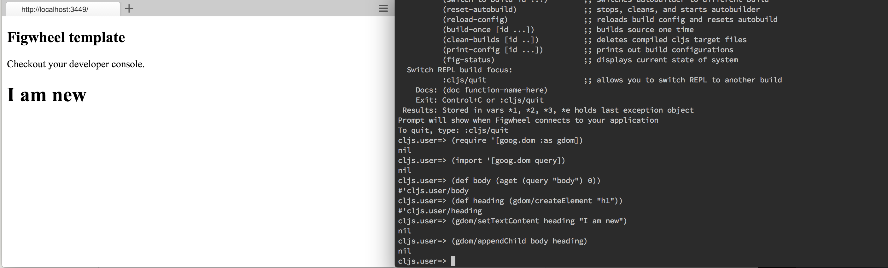
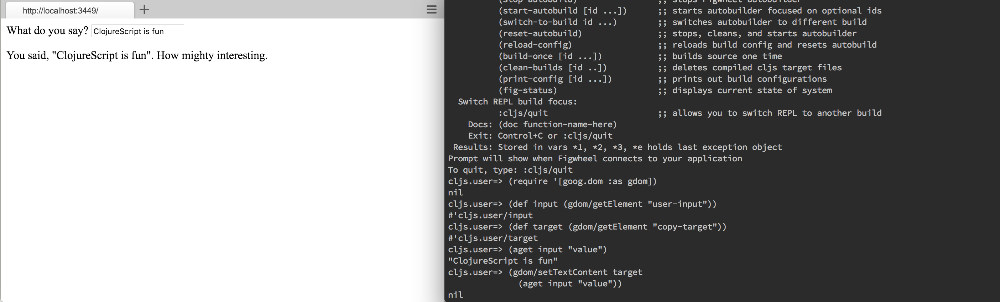

[UP](002_00.md)


### レッスン14：I/Oの実行

ウェブアプリケーションは、すべてがインタラクションです。簡単な入力を行うためのフォームや、アニメーション付きのグラフなど、私たちウェブ開発者が行うほとんどすべての作業は、ユーザーからデータを受け取ったり、ユーザーにデータを表示したりすることです。I/Oがすべてのウェブアプリケーションにとって重要であることを考慮して、次の "ビルディングブロック "としてI/Oを見ていきます。

-----
このレッスンでは

- ウェブページからユーザーの入力を取得する
- Google ClosureライブラリでDOMを操作する
-----


これからの数回のレッスンでは、華氏と摂氏の間で温度を変換するアプリを作っていきます。あらかじめ定義された温度を、一方の測定システムから他方の測定システムに変換するだけのアプリでは、おそらくエキサイティングではないでしょう。役に立つことをするためには、ユーザーと対話する必要があります。I/Oについて学んだことと、変数、制御構造、関数についての新しい知識を組み合わせることで、この温度変換器を作ることができます。

まず、clj-newを使用して、Figwheelテンプレートを使用する新しいプロジェクトを作成し、REPLを開始しましょう。

```bash
$ clj -X:new :template figwheel-main :name learn-cljs/doing-io :args '["+deps"]'
$ cd doing-io
$ clj -A:fig:build
```

これで、ブラウザにアクセスして、ClojureScriptの方法でI/Oを行う方法を学び始めることができます。

#### DOMの操作

ClojureScriptは、ネイティブのJavaScript DOMライブラリ全体を自由に使えるので、これらを使ってDOMを直接操作することを妨げるものは何もありません。しかし、私たちはGoogle Closureライブラリ全体にアクセスできるので、代わりにそれを使用することにします。最近のブラウザ（したがって、最新バージョンのJavaScript）をサポートするだけのアプリケーションでは、この点はあまり問題になりませんが、レガシーなブラウザをサポートする必要があるアプリケーションでは、高レベルのDOMライブラリがあると非常に便利です。

まず最初に、REPL で DOM 要素を作成し、それをページの本文(`body`)に追加します。ブラウザのウィンドウには、私たちが行った変更が反映されます。結果は以下のようになります。


DOM要素の動的な生成

DOMに要素を追加するために、Google ClosureのDOM操作ライブラリを使って、`h1`要素を作成し、そのテキストコンテンツを設定し、bodyの最後に追加します。それでは、REPLでこれらの各ステップを説明します。

```Clojure
cljs.user=> (require '[goog.dom :as gdom])                 ;; <1>
nil

cljs.user=> (def body (.querySelector js/document "body")) ;; <2>
#'cljs.user/body

cljs.user=> (def heading (gdom/createElement "h1"))        ;; <3>
#'cljs.user/heading

cljs.user=> (gdom/setTextContent heading "I am new")
nil

cljs.user=> (gdom/appendChild body heading)                ;; <4>
nil
```
REPLからのDOM要素の作成

1. DOM 操作に必要な Google Closure ライブラリを取り込みます。
2. ネイティブDOMライブラリを使って、`<body>`タグのHTMLElementを取得し、`body` varにバインドします。
3. Google Closure を使って新しい要素を作成し、コンテンツを与えます。
4. その要素をページのbodyに追加する

慣れない分野なので、一歩下がって、何が行われているかを式ごとに正確に見てみましょう。

```Clojure
(require '[goog.dom :as gdom])
```

この式は、`goog.dom`名前空間のすべてのコードをロードします。この名前空間には、DOMを操作するための多くの便利な関数が含まれており、Closure Libraryが多くのブラウザの癖を正規化していることから、通常はバニラJavaScriptの代わりにこのライブラリを使用します。この`require`では、この名前空間の関数を`gdom`というエイリアスで利用できるようにしています。他の名前空間からインポートしたコードを呼び出すときには、`(namespace/function args*)`という形式を使用します。したがって、この名前空間の`getDocument()`関数を`(gdom/getDocument)`として呼び出すことができます。

```Clojure
(def body (.querySelector js/document "body"))
```

次に、ネイティブのJavaScriptコードを使って、`body`要素への参照を取得します。これは、生のJavaScriptで取得したDOM要素が、Google Closure Libraryと完全に互換性があることを示す例として行っています。

```Clojure
(def heading (gdom/createElement "h1"))
```

次に、`h1` 要素を作成し、それを var, heading にバインドします。この時点では、要素は作成されていますが、DOMにはアタッチされていません。

```Clojure
(gdom/setTextContent heading "I am new")
```

ここで、作成した切り離された`h1`ノードのコンテンツを設定します。要素を作成し、その内容を適切に設定したので、これをドキュメントのボディに追加することができます。

```Clojure
(gdom/appendChild body heading)
```

これにより、`heading` として作成した DOM ノードが `body` var にバインドされた document body に追加されます。 この時点で、DOM が変更され、Web ブラウザには行った変更が反映されます。

**やってみよう**

- 上記の例を参考にして、内容のある`p`タグを作成し、`body`に追加します。
- `goog.dom.removeNode()`関数を使って、`h1`タグと`p`タグの両方を削除します。ヒント: この関数は、削除するノードを唯一のパラメータとして受け取ります。

**実験**

要素を作成したので、次のステップとして、すでに画面に表示されているものを操作してみましょう。作成した `<h1>` タグの HTML 要素を含む var がすでにあるので、そのスタイルを変更してクラスを追加してみましょう。[goog.domのドキュメント](https://google.github.io/closure-library/api/)によると、`setProperties`関数は、要素と、プロパティと値をマッピングするJavaScriptオブジェクトを受け取り、DOM要素にプロパティを適用します。

```Clojure
cljs.user=> (gdom/setProperties heading #js {"style" "color:red;"
                                             "class" "big-title"})
nil
```

前回のレッスンで学んだJavaScriptのオブジェクトリテラル構文を使って、propertiesオブジェクトを作成しました。そして、プロパティを設定したい要素とpropertiesオブジェクトを指定して、`goog.dom.setProperties()`関数を呼び出しました。

これまでのところ、DOMを操作するプロセスは、カッコの位置が違ったり、`var`の代わりに`def`を使ったりしているものの、JavaScriptで行うことと劇的には変わりません。 ほとんどの場合、このような「低レベル」で作業することはなく、Reactのようなライブラリを使ってDOMを管理することになるでしょう。しかし、高レベルの技術を十分に活用する前に、しっかりとした基礎知識を身につけておく必要があるのです。次に、ユーザー入力の取得とイベントの処理について簡単に説明した後、温度変換アプリにまとめていきます。

#### ユーザー入力の取得

ここまではI/Oの "O "の部分を見てきましたが、次はユーザーの入力を取得する部分です。ここでは、ユーザーからデータを取得する最も基本的な方法である、フォームコントロールからの値の抽出について見ていきます。練習として、ページ上のテキスト入力を使用し、この入力から別の要素に値をコピーしてみましょう。最初からDOM全体を作成するのではなく、プロジェクトの`index.html`を作業したい構造に変更してみましょう。Figwheel は html ファイル全体をその場で置き換えるわけではないので、このファイルを更新した後は必ずブラウザをリロードしてください。

```html
<!DOCTYPE html>
<html>
<head>
  <meta charset="UTF-8">
  <meta name="viewport" content="width=device-width, initial-scale=1">
  <link href="css/style.css" rel="stylesheet" type="text/css">
</head>
<body>
  <div id="app">                                         <!-- 1 -->
    <div class="form-control">
      <label for="user-input">What do you say?</label>
      <input id="user-input" type="text" />
    </div>

    <p>You said, "<span id="copy-target"></span>". How mighty interesting.</p>
  </div>
                                                          <!-- 2 -->
  <script src="cljs-out/dev-main.js" type="text/javascript"></script>
</body>
</html>
```
resources/public/index.html

1. I/Oのテストに使用するマークアップを`app` divに投入する。
2. コンパイル済みのClojureScriptを読み込む

さて、ユーザー入力要素からテキストを取得するプロセスは、かなり簡単です。今回も、REPLセッション全体を表示してから、興味深い部分を順に説明します。結果は以下のようになります。


ユーザー入力の取得

```Clojure
cljs.user=> (require '[goog.dom :as gdom])
nil

cljs.user=> (def input (gdom/getElement "user-input"))
#'cljs.user/input

cljs.user=> (def target (gdom/getElement "copy-target"))
#'cljs.user/target

cljs.user=> (.-value input)                                ;; <1>
"ClojureScript is fun"

cljs.user=> (gdom/setTextContent target                    ;; <2>
              (.-value input))
nil
```
入力の値を読み取る

1. `input` は JavaScript オブジェクトなので、property access 構文を使ってそのプロパティを取得できます。
2. 入力の値の取得とターゲットの更新を1つの式で行う

この例で`require`がどのように使われているかはすでに説明しましたので、次の式に移ります。

```Clojure
(def input (gdom/getElement "user-input"))
```

ここでは、`goog.dom.getElement()`関数を使って、入力要素をidで取得しています。ネイティブのJavaScriptで`(.getElementById js/document "user-input")`のように同じことをすることもできますが、`getElement`の方がより簡潔です。同じようにして、ユーザーから受け取ったテキストを出力するターゲット要素への参照を取得します。

```Clojure
(gdom/setTextContent target
  (.-value input))
```

この式では、ユーザーが入力したテキストが格納される`input`要素の`value`プロパティを取得し、ターゲットノードのテキストコンテンツをこの値で更新しています。このコードは、入力（`input`の値の読み取り）と出力（`target`のテキストコンテンツの書き込み）の両方を行います。

低レベルのDOM操作に多くの時間を費やすことはないので、このテーマについては長々と説明しません。もし、DOM操作のコードを書かなければならなくなった場合、Google Closureライブラリには素晴らしいドキュメントがあります。そうでなければ、良いClojureScript DOMライブラリを見つけて、それを使うことを恐れないでください!

**やってみよう**

[dommyライブラリ](https://github.com/plumatic/dommy)をインクルードして、Google Closureの代わりにDommyを使ってDOM操作の例をもう一度見てみましょう。dommyの使用を開始するには、`deps.edn`にdommyを依存関係として追加し、Figwheelを再起動する必要があります。dommyはgoog.domより扱いやすいですか？ClojureScriptライブラリを直接扱う場合、ボイラープレートは少なくなりますか？

#### イベントの処理

ユーザーの入力を得ることと密接な関係にあるのが、イベントの処理の問題です。ユーザーがボタンをクリックした、テキスト入力の値を変更したなど、何か面白いことが起こったときに教えてくれるトリガーが必要です。今回もGoogle Closureライブラリを使ってイベントハンドラを作成し、それをDOMにバインドしていきます。入力から別の要素に値をコピーする例を拡張しますが、今回は、ユーザーが入力するたびに対象の要素を更新するイベントを使用します。

```Clojure
cljs.user=> (require '[goog.events :as gevents])
nil

cljs.user=> (defn update-target [evt]                      ;; <1>
              (gdom/setTextContent target
                (.. evt -currentTarget -value)))
#'cljs.user/update-target

cljs.user=> (gevents/listen input                          ;; <2>
                            "keyup"
                            update-target)
#object[Object [object Object]]
```
イベントを利用した更新のトリガー

1. イベントごとに呼び出されるコールバック関数を定義する。
2. イベントハンドラを入力の`keyup`イベントにバインドする

もう一度、このコードを見ながら、何が起こっているのかを明確に理解できるようにしてみましょう。

```Clojure
(defn update-target [evt]
  (gdom/setTextContent target
    (.. evt -currentTarget -value)))
```

ここでは、入力からの`keyup`イベントのたびに呼び出す予定のイベントハンドラ関数を作成しています。このコードの内側の部分は、REPLで手入力したコードと非常によく似ていることに注目してください。どちらも`(gdom/setTextContent target value)`という形式になっています。ここでの違いは、DOM要素から直接値を取り出すのではなく、JavaScriptのイベントから値を取り出していることです。

```Clojure
(gevents/listen input "keyup" update-target)
```

最後に、`goog.events.listen()`関数を使って、`keyup`イベントで`input`要素にイベントハンドラをアタッチします。これで、`input`を入力すると、`target`要素がすぐに更新されるようになりました。これで、次のレッスンで温度変換アプリを作るために必要な要素がすべて揃いました。

**挑戦**

`goog.dom`と`goog.events`ライブラリを使って、以下のようなアプリを書いてみましょう。

- 2つのパスワード入力を作成する(パスワードとパスワード確認用)
- ステータステキストを作成します。
- キーが押されるたびに入力値が比較されるように、入力にリスナーをアタッチする
- 入力値が同じ場合は「一致」、異なる場合は「一致しない」とステータステキストを設定する。

ヒント:

- 子要素をアタッチするための`app`ノードを忘れずに取得してください。
- パスワードフィールドに入力されたテキストを公開しないようにするとボーナスポイントが入ります

可能な解決策
```Clojure
(ns passwords.core
  (:require [goog.dom :as gdom]
            [goog.events :as gevents]))

(defn values-same? [field-1 field-2]
  (= (aget field-1 "value")
     (aget field-2 "value")))

(defn handle-change [password confirmation status]
  (gdom/setTextContent status
                       (if (values-same? password confirmation)
                         "Matches"
                         "Do not match")))

(let [password (gdom/createElement "input")
      confirmation (gdom/createElement "input")
      status (gdom/createElement "p")
      app (gdom/getElement "app")]
  (gdom/setProperties password #js {"type" "password"})
  (gdom/setProperties confirmation #js {"type" "password"})

  (gevents/listen password "keyup"
                  #(handle-change password confirmation status))
  (gevents/listen confirmation "keyup"
                  #(handle-change password confirmation status))

  (gdom/setTextContent app "")
  (gdom/appendChild app password)
  (gdom/appendChild app confirmation)
  (gdom/appendChild app status))
```

#### まとめ

このレッスンでは、ネイティブのJavaScriptとGoogle Closure Libraryのコードを使って、ウェブページからユーザーの入力を取得し、DOMを操作しました。また、イベントハンドラを要素にアタッチして、ユーザのアクションに応じてコールバックを評価する方法も学びました。ユーザーと対話する方法ができたので、もっと便利なアプリケーションを作ることができるようになりました。これで、以下のことがわかるはずです。

- Google Closure ライブラリ関数をrequireし、使用する。
- DOM 要素の作成と操作
- ユーザーの入力をDOMから取得する
- イベントハンドラをアタッチして、ユーザのインタラクションに応答する


[UP](002_00.md)
