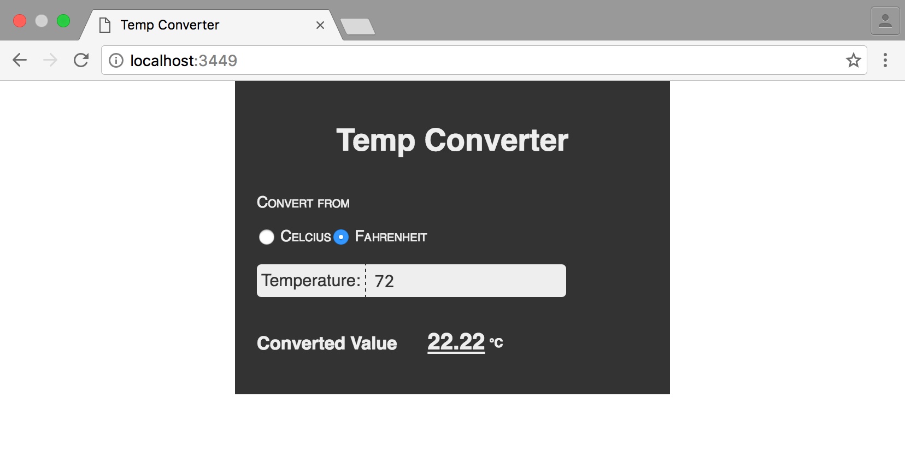

[UP](002_00.md)


### レッスン15：キャップストーン 2 - 温度変換器

これまでの数回のレッスンでは、どのようなアプリを書くにしても必要となる基本的な概念を学んできました。再利用したい値を保持するための変数、どのようなコードパスを取るべきかを決定するための制御構造、再利用可能な動作や計算を定義するための関数、そしてユーザーと対話するためのIOです。まだまだ学ぶべきことはたくさんありますが、すでに便利なアプリを書き始めることができます。

-----
このレッスンでは

- HTMLでアプリの構造を宣言的に作成する
- 基本的なClojureScriptの知識を応用して、ウィジェットのようなアプリを作成する
-----

このレッスンでは、温度を取得し、ユーザーが切り替えることができるラジオボタンの値に応じて、摂氏から華氏、またはその逆に変換する簡単なアプリを作成します。このアプリには、ユーザーが温度を入力するための入力部、入力した単位を選択するためのいくつかのラジオボタン、そして変換後の値を表示するためのターゲットが必要です。完成したプロジェクトはこのようなものです。


完全な温度変換アプリ

まず、Figwheelプロジェクトを作成します。

```bash
$ clj -X:new :template figwheel-main :name learn-cljs/temp-converter :args '["+deps"]'
```

ここでも、自動テストを書かないので、`dev.cljs.edn` の `:watch-dirs` から `"test"` のエントリを削除してください。

#### マークアップの作成

前章では、DOMを手動で構築し、コードで要素を作成したり追加したりしました。これは作業が煩雑なだけでなく、ClojureScriptとしてのイディオムがありません。命令的なアプリよりも宣言的なアプリを好むべきであることを覚えておいてください。今回は、マークアップ全体をHTMLで定義します。生成された`index.html`の`app`タグを以下のように置き換えてください。

```html
<div id="app">
  <h1>Temp Converter</h1>

  <div class="user-input">
    <div class="unit-control">                             <!-- 1 -->
      <p>Convert from</p>
      <div class="radio-option">
        <input type="radio" id="unit-c" name="unit" value="c" checked="checked" />
        <label for="unit-c">Celsius</label>
      </div>
      <div class="radio-option">
        <input type="radio" id="unit-f" name="unit" value="f" />
        <label for="unit-f">Fahrenheit</label>
      </div>
    </div>

    <div class="temp-control">                             <!-- 2 -->
      <label for="temp">Temperature:</label>
      <input type="number" id="temp" name="temp" />
    </div>
  </div>

  <div class="converted-output">                           <!-- 3 -->
    <h3>Converted Value</h3>

    <span id="temp-out">-</span>
    <span id="unit-out">F</span>
  </div>
</div>
```
温度コンバータ マークアップ

1. 単位を切り替えるためのラジオボタン
2. ユーザーが温度を入力するためのテキスト入力
3. 結果表示エリア

このマークアップでは、アプリケーションで使用するすべての要素を定義しているため、コード内でその場限りの DOM 要素を作成する必要はありません - 既に定義されている要素の操作のみを行います。`goog.dom/getElement`関数を使って簡単に参照できるように、操作する各要素に固有の`id`属性を与えていることに注意してください。

**クイックレビュー**

- 宣言的にアプリを構成する利点は何ですか？
- ClojureScriptのコードを書く前に、この静的なマークアップをアプリケーションに変えるために必要な手順を挙げてみましょう。

#### コードウォークスルー

それでは、作成したばかりのWebページと対話し、温度変換のビジネスロジックを処理するClojureScriptコードを書きます。まず最初に、過去数回のレッスンで使用したGoogle Closureライブラリをインポートします。DOM操作のための`goog.dom`と、ユーザーの入力に反応するための`goog.events`です。

```Clojure
(ns learn-cljs.temp-converter
  (:require [goog.dom :as gdom]
            [goog.events :as gevents]))
```

ClojureScriptは多くの場合、ボトムアップ方式で書かれています。つまり、ドメイン内の低レベルの操作を最初に定義し、低レベルの操作を組み合わせてより複雑なロジックを開発します。このケースでは、ドメインは非常にシンプルですが、温度を変換するビジネスロジックを最初に定義します。

```Clojure
(defn f->c [deg-f]
  (/ (- deg-f 32) 1.8))

(defn c->f [deg-c]
  (+ (* deg-c 1.8) 32))
```

次に、ページ上の重要な要素への参照を取得したいと思います。Google Closure を使ってページ上の DOM 要素を見つけ、各要素を var にバインドします。 これにより、残りのコードをより明確にすることができ、また、これらの要素を使用するたびに DOM を検索するというオーバーヘッドがないため、パフォーマンスの向上にもつながります。

```Clojure
(def celsius-radio (gdom/getElement "unit-c"))
(def fahrenheit-radio (gdom/getElement "unit-f"))
(def temp-input (gdom/getElement "temp"))
(def output-target (gdom/getElement "temp-out"))
(def output-unit-target (gdom/getElement "unit-out"))
```

次に、イベント処理のコードで使用する関数をいくつか作成します。他のプログラミング言語と同様に、ロジックの各部分をそれぞれの関数にまとめることは、良い習慣とされています。

```Clojure
(defn get-input-unit []
  (if (.-checked celsius-radio)
    :celsius
    :fahrenheit))

(defn get-input-temp []
  (js/parseInt (.-value temp-input)))

(defn set-output-temp [temp]
  (gdom/setTextContent output-target
                       (.toFixed temp 2)))
```

このコードは、これまでの数回のレッスンで行ってきたDOM操作を扱っているので、見覚えがあるはずです。`get-input-unit`関数と`get-input-temp`関数は、それぞれ変換する単位と温度を取得し、`set-output-temp`関数は、変換された温度でdisplay要素を更新します。

また、何か変化があったときにイベントハンドラとして使用する関数も必要です。この関数は、現在選択されている測定単位と温度を取得し、変換後の温度で結果セクションを更新します。

```Clojure
(defn update-output [_]
  (if (= :celsius (get-input-unit))
    (do (set-output-temp (c->f (get-input-temp)))
        (gdom/setTextContent output-unit-target "F"))
    (do (set-output-temp (f->c (get-input-temp)))
        (gdom/setTextContent output-unit-target "C"))))
```

この関数は、私たちのアプリの中核となるものです。各イベントを処理し、それに応じてUIを更新します。この関数は、イベントオブジェクトを引数にして呼び出されますが、使用しないパラメータにはアンダースコアを付けるという一般的な慣習に従っています。このコードでもうひとつ注目すべき点は、`do`を使って複数の式をまとめていることです。`do`は複数の式を受け取り、それらすべてを順に評価し、最後の式の値を返します。したがって、`(do x y z)`という式は、`x`→`y`→`z`と評価され、式全体が`z`だけの場合と同じ値になります。これは、`x`と`y`に副作用（ここではDOM要素の更新）があり、それらの評価を気にしない場合に便利です。

**やってみよう**

- 温度入力をクリアするボタンの追加

最後に、ラジオボタンがクリックされたり、入力が更新されたりしたときに、イベントハンドラとして `update-output` 関数をアタッチすることで、ロジックを UI に接続します。これにより、ユーザーが変換後の出力に影響を与えるような変更を行った場合には、必ず結果を再計算します。

```Clojure
(gevents/listen temp-input "keyup" update-output)
(gevents/listen celsius-radio "click" update-output)
(gevents/listen fahrenheit-radio "click" update-output)
```

およそ40行のコードで、便利なClojureScriptアプリができあがりました! 完全を期すために、コード全体を以下に掲載します。

```Clojure
(ns learn-cljs.temp-converter
  (:require [goog.dom :as gdom]                            ;; <1>
            [goog.events :as gevents]))

(defn f->c [deg-f]                                         ;; <2>
  (/ (- deg-f 32) 1.8))

(defn c->f [deg-c]
  (+ (* deg-c 1.8) 32))

(def celsius-radio (gdom/getElement "unit-c"))              ;; <3>
(def fahrenheit-radio (gdom/getElement "unit-f"))
(def temp-input (gdom/getElement "temp"))
(def output-target (gdom/getElement "temp-out"))
(def output-unit-target (gdom/getElement "unit-out"))

(defn get-input-unit []                                     ;; <4>
  (if (.-checked celsius-radio)
    :celsius
    :fahrenheit))

(defn get-input-temp []
  (js/parseInt (.-value temp-input)))

(defn set-output-temp [temp]
  (gdom/setTextContent output-target
                       (.toFixed temp 2)))

(defn update-output [_]                                    ;; <5>
  (if (= :celsius (get-input-unit))
    (do (set-output-temp (c->f (get-input-temp)))
        (gdom/setTextContent output-unit-target "F"))
    (do (set-output-temp (f->c (get-input-temp)))
        (gdom/setTextContent output-unit-target "C"))))

(gevents/listen temp-input "keyup" update-output)          ;; <6>
(gevents/listen celsius-radio "click" update-output)
(gevents/listen fahrenheit-radio "click" update-output)
```
src/learn_cljs/tempconverter.cljs

1. このアプリに必要なGoogle Closureモジュールのrequire
2. 変換関数の定義
3. 使用する各要素をvarに格納する
4. ヘルパー関数
5. イベント処理のコールバック
6. 温度入力の`keyup`イベントと各ラジオボタンの`click`イベントにイベントハンドラをアタッチする

**課題**

これはとてもシンプルなアプリですが、簡単に拡張することができます。ここでは、新しい機能を追加するためのオプションをいくつか紹介します。

- ユーザーがケルビンも選択できるようにして、適切な変換を行う。
- コードがリロードされるたびに、イベントハンドラが追加されます。[レッスン6](001_06.md)で説明した初期化パターンを使って、イベントハンドラが一度だけアタッチされるようにします。

#### まとめ

これからも新しいビルディングブロックを手に入れて、今まで学んだことと組み合わせて、より便利で面白いアプリケーションを作っていきましょう。これまでに、ClojureScriptがどのように構成されているかをよく理解してきましたが、これまでのところ、JavaScriptに対するClojureScriptの優位性を示すことはあまりありませんでした。しかし、これからはClojureScriptのユニークな部分を探っていきます。次のレッスンでは、ClojureScriptを非常に生産的にしている豊富なコレクション・データ型について見ていきます。


[NEXT](003_00.md)

[UP](002_00.md)
