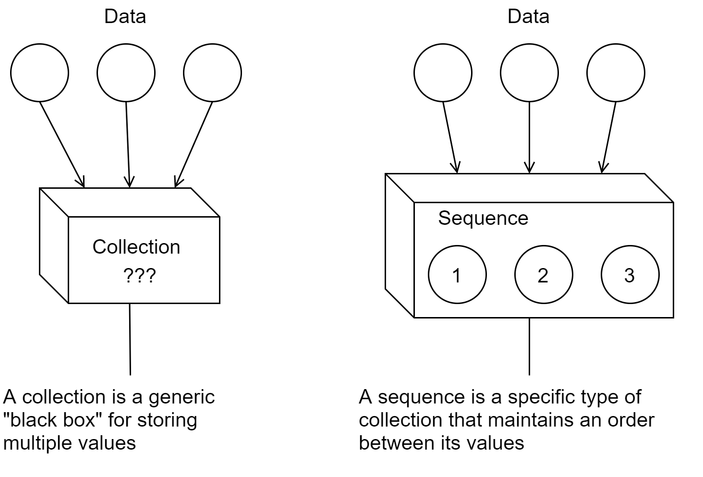

[UP](003_00.md)

### レッスン 16：コレクションのグルーキング

これまでのところ、文字列、数字、キーワードなどの単純なデータ型を扱ってきました。ClojureScriptの構文を調査したときにいくつかのコレクションを見ましたが、それらが何であるか、実際のアプリケーションでどのように使用するかについては説明しませんでした。想像するに、一緒になっているデータを表現する方法がないままプログラムを書くのは、せいぜい面倒なことです。JavaScriptには、リストを表現するための配列や、連想データ（ブログ記事のタイトル(`title`)や内容(`content`)など、特定の文字列をキーとして値が参照されるデータ）を表現するためのオブジェクトがあります。これらのタイプのコレクションがどのように機能するかは、JavaScriptや他の言語ですでにおなじみでしょう。

-----
このレッスンでは

- 順番に並んだデータの管理にリストを使う
- キーを指定して値を検索するマップの使用
- データを一意に保つためのセットの使用
-----

##### 例 連絡帳

コレクションがClojureScriptの中心的な機能であることは、驚くには値しません - 実際、他のほとんどの言語よりも
はるかに多いのです。私たちは日常的にコレクションを扱います。例えば、友人や知人の詳細を保存する連絡帳を
考えてみましょう。連絡帳自体が連絡先の詳細のコレクションであり、各連絡先自体が個人情報のコレクションです。


連絡帳は現実世界のコレクション

JavaScriptでは、連絡帳自体をリストとしてモデル化し、個々の連絡先を、名前(`name`)や住所(`address`)などのプロパティを
持つオブジェクトとしてモデル化することができます。おそらく以下のような形になるでしょう。

```JavaScript
const contactBook = [                                      // <1>
    {
        name: "Phillip Jordan",
        address: "523 Sunny Hills Cir.",
        city: "Springfield",
        email: "phil.j@hotmail.com"
    },
    {                                                      // <2>
        name: "Clara Michaels",
        address: "4473 Point of the Pines",
        city: "Colorado Springs",
        email: null
    }
];
```
JavaScriptで連絡帳をモデリングする

1. 外側の構造は、連絡先のリストを整理するための配列です。
2. 内部構造は、特定のプロパティの組によって連絡先を記述するためのオブジェクトです。

JavaScriptが提供する配列やオブジェクトを使って効果的にプログラムを書くことができますが、ClojureScriptでは、
より焦点を絞ったツールや、より重要な抽象化を行うことができます。JavaScriptでは、リストをソートしたりフィルタリングしたり、
オブジェクトのプロパティを検索したりすることができます。これらは、本質的に異なる動作をする異なるデータタイプです。
ClojureScriptでは、複数のコレクションタイプがあり、すべてが特定のコレクションプロトコルに準拠しています。
インターフェイスの概念に慣れている人にとっては、すべてのClojureScriptのコレクションは、共通のインターフェイスに
準拠しています。つまり、コレクションを扱うように設計されたコードは、ベクター、セット、リスト、マップなど、どのような
コレクションでも扱うことができるのです。そして、パフォーマンス特性に基づいて使用したい特定のコレクションタイプを
選択することができ、同じ使い慣れた関数を使って操作することができるという自信があります。それだけでなく、
コレクションプロトコルを自分のコードに実装することができ、ClojureScriptは、あたかも言語自体に組み込まれているか
のように、自分のオブジェクトを操作することができます。

#### コレクションとシーケンスの定義

ここで、コレクションとは何かを定義し、密接に関連する概念であるシーケンスを見てみましょう。ClojureScriptでは、
コレクションとは、複数のものを保持するデータ型のことです。単一のものだけを表すスカラーとは逆のものです。また、
コレクションは他のデータを格納する容器と考えることもできます。一方、シーケンスは、始まりと終わりを持つ直線的な
コレクションです。すべてのシーケンスはコレクションですが（コンテナなので）、すべてのコレクションがシーケンスではありません。


コレクションとシーケンス

ClojureScriptが何かをコレクションとして扱うためには、それに何かを追加することができればよく、奇妙な名前の`conj`関数
（"conjoin "の略）を使ってこれを行います。どのように何かをコレクションに追加するかは、コレクションの種類によって異なります。
例えば、リストの先頭にはアイテムが追加されますが、ベクターの末尾にはアイテムが追加され、セットにアイテムを追加しても、
そのアイテムがまだ存在していない場合にのみセットが大きくなります。異なるコレクションに対する `conj `の動作の例を
 REPL で見ることができます。

```Clojure
cljs.user=> (conj '(:lions :tigers) :bears)                ;; <1>
(:bears :lions :tigers)

cljs.user=> (conj [:lions :tigers] :bears)                 ;; <2>
[:lions :tigers :bears]

cljs.user=> (conj #{:lions :tigers} :bears)                ;; <3>
#{:lions :tigers :bears}

cljs.user=> (conj #{:lions :tigers} :tigers)               ;; <4>
#{:lions :tigers}
```
`conj`をさまざまなコレクションで使用する

1. `conj`は，リストの先頭に追加する
2. ...またはベクターの末尾に追加する
3. セットには順序がないので，新しい要素は単にセットに追加される
4. 既に集合の中にある要素を追加しても効果はない

**クイックレビュー コレクション**

- すべてのコレクションがサポートしていると確信できる唯一の操作は何ですか？
- コレクションの先頭に`conj`を使って効率よく要素を追加するには、どのコレクションタイプを使えばよいでしょうか？

#### シーケンス

シーケンスは、ClojureScriptのコレクションの一種で、要素が直線的に並んでいます。コレクションは`conj`による要素の追加を
サポートするだけですが、シーケンスは`first`と`rest`という2つの追加操作をサポートしなければなりません。
`first`はシーケンスの最初の項目を返し、`rest`は他のすべての項目を含む別のシーケンスを返します。
シングルトン・シーケンス、つまり要素が1つしかないシーケンスの場合、`rest`は空のシーケンスと評価されます。


シーケンスの`first`と`rest`

このシーケンスの抽象化は非常に直感的です。--- 何かの最初のビットを得ることができる限り、
残りのビットで別のシーケンスを得ることができます。何も残らなくなるまで、毎回最初のビットを取りながら、
シーケンス全体を横断することができます。シーケンスの残りの部分(`rest`)は別のシーケンスなので、その最初の(`first`)要素を
最後まで取ることができます。 このことを念頭に置いて、シーケンスが空になるまでシーケンスの残りの部分(`rest`)を
繰り返しループさせることで、シーケンスに対してある種の集約を行う関数を作成することができます。例えば、
ある列のすべての数字を足すには、次のような関数を書きます。

```Clojure
(defn add-all [xs]
  (loop [sum 0                                             ;; <1>
         nums xs]
    (if (empty? nums)                                      ;; <2>
      sum
      (recur (+ sum (first nums))
             (rest nums)))))                               ;; <3>
```
シーケンスのトラバース

1. 和`0`と、与えられたすべての数字とでループを初期化する
2. 数列がなくなったら、蓄積された和を返す
3. 数列にまだ数字が残っていたら、以前の和に数列の最初の数字を加えたものを新しい和とし、残りの数列を新しい数列として、再びループを回します。

ここで何が起こっているのか、視覚的に理解することができます。


シーケンスのトラバース

シーケンスを`first`と`rest`の間で繰り返し分割するこのプロセスは、ClojureScriptのコアコンセプトである
シーケンストラバーサルを示しています。ありがたいことに、シーケンスを扱う関数のライブラリが充実しているので、
上の例のような退屈なコードを書く必要はほとんどありません。

**おまけ**

- `reduce`関数についてオンラインで調べてみましょう。`reduce`を使って`add-all`関数をどのように簡略化できるでしょうか？

**クイックレビュー シーケンス**

- 一般的に、`first`関数と`rest`関数だけを使って、数列のn番目の要素を得るにはどうしたらいいでしょうか？
- 空のリストの`first`は何ですか？
- 空のリストの`rest`は何ですか？

> ** すべては抽象化のため**
>
> lodashやRamdaをはじめとするいくつかのJavaScriptライブラリには、配列の最初の要素と残りの要素を取得する同様の関数があります。これらのライブラリのシーケンス関数とClojureScriptのシーケンスの主な違いは、シーケンスがどのデータ型にも本質的に結びつかない抽象化されたものであることです。シーケンスのように見えるものは、ClojureScriptにとってはシーケンスなのです。抽象化されたプログラミングに慣れてしまうと、JavaScriptのデータ型は少し堅苦しく感じられるようになります。

#### シーケンシャルデータにリストを使う

リストは、ClojureScriptで最もシンプルなデータ型の1つです。リストは、任意の型の他のオブジェクトを保持することができる
シーケンスで、先頭から効率的にアクセスして直線的に進むことができます。1つ目は、常に最初から最後までアクセスされる
データのコレクションを持っている場合、2つ目は、最後に追加されたアイテムが最初に取り出されるスタックとしてデータを
扱いたい場合です。しかし、リストは、ランダムアクセス（例：シーケンスのn番目の要素を取得する）には効率的ではありません。

ClojureScriptでリストを作成するには2つの方法があります。1つ目は`list`関数を使う方法、2つ目はリテラル構文である`'()`を
使う方法です。コレクションとしてのリストは、`conj`による要素の追加をサポートし、シーケンスとしてのリストは、`first`と
`rest`をサポートします。

```Clojure
cljs.user=> (list 4 8 15 16 23 42)                         ;; <1>
(4 8 15 16 23 42)

cljs.user=> '(4 8 15 16 23 42)                             ;; <2>
(4 8 15 16 23 42)

cljs.user=> (conj '(:west :north :north) :south)           ;; <3>
(:south :west :north :north)

cljs.user=> (first '("Tom" "Dick" "Harry"))                ;; <4>
"Tom"

cljs.user=> (rest '("Tom" "Dick" "Harry"))
("Dick" "Harry")
```
リストの操作

1. `list`関数によるリストの作成
2. リテラル構文によるリストの作成
3. `conj`によるリストの前置
4. `first`と`rest`でリストをシーケンスとして扱う

#### インデックス付きデータとしてベクターの使用

アプリケーションによってはリストが便利な場合もありますが、実際にはベクターの方が広く使われています。ベクターは、
JavaScriptの配列に相当するClojureScriptの（不変の）コレクションと考えてください。ベクターは、リストのように連続して
走査することも、0始まりのインデックスでアクセスすることもできる、非常に汎用性の高いコレクションです。リストとは異なり、
`conj`はベクターの最後に要素を追加します。特定の要素を取得したり、特定のスライスを抽出したりしたいコレクションには、
通常、ベクターが最適です。

```Clojure
cljs.user=> (conj ["Moe" "Larry"] "Curly")                 ;; <1>
["Moe" "Larry" "Curly"]

cljs.user=> (first ["Athos" "Porthos" "Aramis"])
"Athos"

cljs.user=> (rest ["Athos" "Porthos" "Aramis"])            ;; <2>
("Porthos" "Aramis")

cljs.user=> (nth ["Athos" "Porthos" "Aramis"] 1)           ;; <3>
"Porthos"

cljs.user=> (["Athos" "Porthos" "Aramis"] 1)               ;; <4>
"Porthos"
```
ベクター操作

1. `conj`は，ベクターの末尾に追加する
2. `rest`は常にシーケンスを返す
3. `nth`は，インデックスによって特定の要素を検索する
4. ベクター自体は、インデックスを引数として与えられたときに要素を検索することができる関数です。

上のREPLセッションでは、ベクターとシーケンスの興味深い特性をいくつか発見しました。まず、`rest`関数をベクターに適用する
と、ベクターが返ってこないことがわかります。その代わり、リストのように見えますが、実際にはリストと同じように動作する一般的
なシーケンスであることがわかりました。ベクターはインデックス付きのアクセスに最適化されているため、ClojureScriptでは
シーケンスとして使用する際には必ず強制力が働きます。ほとんどの場合、これはほとんど違いがありませんが、知っておくと
よいでしょう。次に、ClojureScriptでは、ベクターは、検索する要素のインデックスを引数として受け取る関数であることが
わかります。だからこそ、`(["Athos""Portos""Aramis"] 1)`と評価できるのです。面白いことに、ClojureScriptではほとん
どすべてのものが関数として使用できます。ベクター、マップ、キーワード、シンボルはすべて関数として使用できます（ただし、
それらが必要とする引数を与えなければ、予想外の結果が得られるかもしれません）。

ベクターの性能は実世界の多くの場面で適しているので、ここではベクターを多く扱うことになります。

#### 連想データにマップを使う

マップは、キーと任意の値を対応付けることができる非常に便利なコレクションです。マップは、JavaScriptのオブジェクトのClojureScript版ですが、よりシンプルです。JavaScriptのオブジェクトには関数が付加されていて、その関数が参照するもの
には複雑なルール（暗黒魔法と言う人もいるかもしれません）がありますが、マップは単なるデータです。関数をマップの値と
して使用することを妨げるものは何もありませんが、それによって関数とマップの間に何らかの結合が生まれるわけではありません。

マップは郵便局と考えることができます。郵便受けを持っている人には、郵便物を探すのに使える特定の番号が割り当てられて
います。郵便局は、特定の顧客のために郵便物を受け取ると、その顧客に関連付けられたボックスに郵便物を入れます。基本的
には、郵便局は、ボックス番号と1人の顧客に属する郵便物との間の関連性を維持します。同様に、マップは、ある識別キーと
任意の値の間の関連性を保持します。

マップは、リテラル構文の`{}`でも、`hash-map`関数でも作成できます。

```Clojure
cljs.user=> {:type "talk"                                  ;; <1>
                     :title "Simple Made Easy"
                     :author "Rick Hickey"}
{:type "talk", :title "Simple Made Easy", :author "Rick Hickey"}

cljs.user=> (hash-map :foo "bar", :baz "quux")             ;; <2>
{:baz "quux", :foo "bar"}
```
マップの生成
Creating Maps


[UP](003_00.md)

