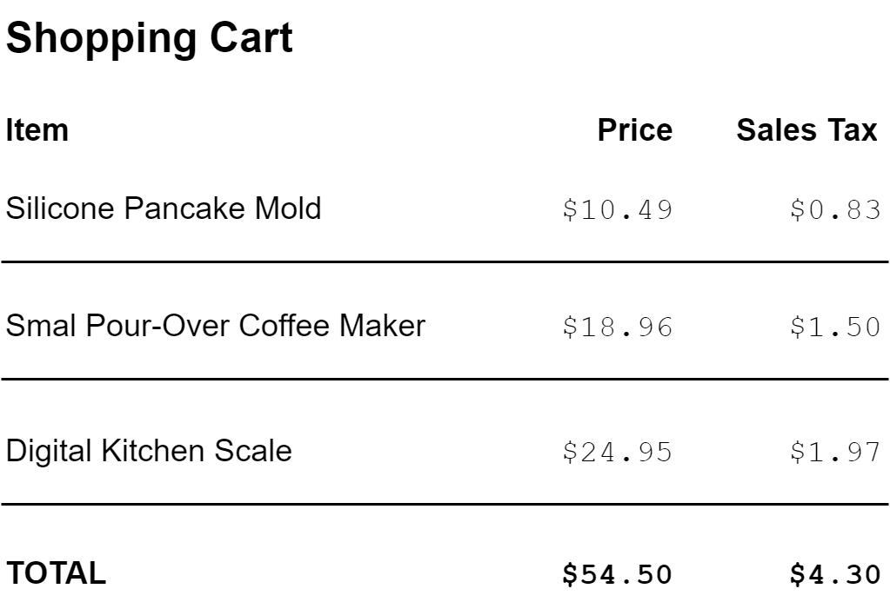

[UP](003_00.md)

### レッスン 17：シーケンス操作を発見する

プログラミングには抽象化がつきものです。ソフトウェアエンジニアリングの分野は、人間にとってより良いプログラムや
システムを作り、それを維持することを目的としています。明確で正確なシステムを作るための鍵は、抽象化という概念に
あります。抽象化とは、頻繁に繰り返されるパターンを特定し、それをより広く適用できるものに一般化することです。私たち
人間は、概念を抽象化することに長けています。実は、これは子供の頃に最初に学ぶスキルの1つなのです。例えば、目に
入るすべての果物を「りんご」と呼ぶ幼児を想像してみてください。なぜなら、彼らはリンゴに慣れ親しんでおり、リンゴと他の
果物との間に多くの類似点があることを認識しているからです。
やがてこの子は、「果物」と呼ばれる、異なるが類似した物体のクラス全体が存在することを学びます。それぞれの果物は
独自の特性を持ち、他の多くの特性を共有しています。プログラミングにおける抽象化の考え方も非常によく似ています。
多くの点で類似しているように見えるいくつかの異なる構成要素がありますが、それぞれの構成要素は他のものとは異なり、
それぞれの構成要素に共通する特性を適切に一般化する方法を決定しなければなりません。

-----
**このレッスンでは**

- シーケンスの各要素に変換を適用する
- シーケンスタイプ間の効率的な変換
- シーケンスを特定の要素だけに絞り込む
-----

##### 例 消費税の計算

電子商取引のショッピングカートアプリを作成しているとします。要求事項のひとつに、カート内の各商品の消費税を表示する
ことと、合計金額と消費税の合計を表示するサマリーセクションを設けることがあります。この問題を解決するために、
ClojureScriptのシーケンス操作をいくつか適用する方法を学びます。



#### シーケンスの抽象化

前のレッスンで見たように、ClojureScriptはコレクションを重要な一般的な抽象化として認識しています。コレクションの
抽象化には、アイテムをコレクションに「追加」するための` conj` という単一の操作があります。覚えておくべき重要な点は、
特定のコレクションタイプごとに、アイテムを追加する意味が定義されていることです。リスト、ベクター、セット、マップへの
追加は、それぞれのケースで異なる効果を持つ可能性があります。ここで、抽象化の力が発揮されます。つまり、具体的な
データ型に関わらず、自信を持って`conj`のような抽象的な操作を用いて、一般的な方法でコードを書くことができるの
です。ClojureScriptでは、コレクションが最も一般的な抽象化であるのに対し、シーケンスはより狭く、より焦点の合った
抽象化です。シーケンスは、直線的に考えられるデータを考えることができ、今回のショッピングカートの例では、商品に
最適です。

シーケンスは、私たちウェブ開発者が携わる多くの領域で、中核となる抽象化です。ブログ記事のフィード、電子メールの
受信箱、一連の金融取引など、ほとんどのアプリケーションは、1つ以上のデータのシーケンスを核としています。このような
タイプのプログラムにオブジェクト指向でアプローチする場合、通常はシステム内の個々のオブジェクトと、それらがどの
ような動作をサポートしているかを最初に考えます。例えば、電子メールプログラムの場合、`markRead()`や`getLabels()`
のようなメッセージを持つ`Message`オブジェクトを作成することから始めようと思うかもしれません。これらのオブジェクトを
モデル化したら、それらを格納するためのある種のコレクション・オブジェクトを作成するか、あるいは単に配列を使用してそれ
を反復処理するかでしょう。ClojureScriptのやり方は少し違います（そしてよりシンプルです）。細かいオブジェクトの個々の
動作に注目するのではなく、"どのメッセージが読まれているか？"や "受信箱には何通のメッセージがあるか？"などの集合的
なプロパティについて考えることから始めます。

一歩下がって、ショッピングカートの問題をシーケンスの観点からどのように考えるかを考えてみましょう。まず、カートを
ラインアイテムのベクトルとしてモデル化します。各ラインアイテムは :name と :price キーを持つマップです。

```Clojure
cljs.user=> (def cart [{:name "Silicone Pancake Mold" :price 10.49}
                       {:name "Small Pour-Over Coffee Maker" :price 18.96}
                       {:name "Digital Kitchen Scale" :price 24.95}])
#'cljs.user/cart
```
ショッピングカートのモデル化

このシーケンスには2つの特性があります。1つ目は、シーケンス内の各アイテムの消費税を計算する方法、2つ目は、
すべての価格とすべての消費税を合計する方法を知る必要があります。ここでの一般的な問題は、シーケンスの各要素
に何らかの演算を適用することと、シーケンス全体の値を1つの値にまとめることです。これらの問題を解決するには，
それぞれ`map`と`reduce`という関数を使います。

#### Mapによる変換

`map`関数は、シーケンスを受け取り、各要素が元のシーケンスの要素に何らかの関数を適用したものに対応する
新しいシーケンスを返します。例えば，整数の増分を取得する関数`inc`を数値のリストにマッピングすると，各要素が
元のシーケンスの対応する数値の増分となる新しいシーケンスを得ることができます．

```Clojure
cljs.user=> (map inc '(100 200 300))
(101 201 301)
```

リスト`(100 200 300)`に`inc`関数をマッピングしたところ、結果は新しいリスト`(101, 201, 301)`になりました。この新しいリストの各数値は、元のリストの各要素の1増です。`map`はシーケンスの上を歩いていて、それぞれの要素に来ると、その要素を取って関数に通し、その結果を新しいシーケンスに入れていると想像できます。この例では、`100`に`inc`を適用し、その結果である`101`を新しいシーケンスに入れています。2番目と3番目の要素についても同様に、`200`を`201`に、`300`を`301`に変換しています。最後に、`map`の呼び出しにより、変換されたすべての数字のリストが返されます。


一般的に`map`は、関数`f`とシーケンスを受け取り、元のシーケンスの各要素に`f`を適用した結果を要素とする新しいシーケンスを返します。`map`は新しいシーケンスを返すので、元のシーケンスには手を加えないことに注意してください。シーケンスの変換を伴う問題では、通常、`map`が最初に使用されます。他の言語で`for`ループを使うときは、ClojureScriptでは`map`を使うことができます。


**クイックレビュー**

次のコードスニペットを見てみましょう。

```Clojure
(def samples [[8 12 4]
              [9 3 3 6]
              [11 4]])

(def result-1 (map first samples))

(def result-2 (map dec result-1))
```

- `result-1`の値は何ですか？
- `result-2`の値は何ですか？
- `samples`の値は何ですか？
- 各ベクターの長さを`samples`の中に入れたコレクションを得るには？

##### マップによる消費税の追加

ショッピングカートに消費税を追加する最初の例に戻ると、マップを使用して、各アイテムが元のカートのアイテムのように、`:sales-tax` キーを追加した新しいカートを作成します。JavaScriptを使用している場合は、以下のコードのようなforループが必要になります。

```JavaScript
const taxRate = 0.079;
const cart = [                                             // <1>
    { name: "Silicone Pancake Mold", price: 10.49 },
    { name: "Small Pour-Over Coffee Maker", price: 18.96 },
    { name: "Digital Kitchen Scale", price: 24.95 },
];

for (let item  of cart) {                                  // <2>
    item.salesTax = item.price * taxRate;
}
```
JavaScriptで消費税を追加する

1. カートを、名前(`name`)と価格(`price`)を持つ商品のリストとして定義する。
2. カート内のすべての商品をループし、新しい `salesTax` プロパティを追加する。

このコードは、配列をループして各要素をインプレースで更新しているだけなので、JavaScript プログラマにとっては非常に馴染み深いものです。カートの配列をその場で更新したので、この配列や配列に含まれる個々のオブジェクトを使用するコードの他の部分で、意図しない結果が発生した可能性があります。一見単純で無害なコードに見えても、実は微妙なバグの原因になっている可能性があるのです。

`map`を使ってClojureScript（またはJavaScript）で解決策を書けば、より簡潔であることに加えて、よりシンプルでエラーが起こりにくいものになります。`map`は2つの引数を取ることを覚えておいてください：個々の要素に適用する関数とシーケンスです。ここでは、ショッピングカートの簡単なモデルがあるので、必要なのは、各カートアイテムに適用する関数で、消費税が追加された新しいアイテムを生成します。この関数をショッピングカートにマッピングすると、ワンライナーになります。

```Clojure
cljs.user=> (def tax-rate 0.079)
#'cljs.user/tax-rate

cljs.user=> (defn add-sales-tax [cart-item]                ;; <1>
              (let [{:keys [price]} cart-item]
                (assoc cart-item :sales-tax (* price tax-rate))))
#'cljs.user/add-sales-tax

cljs.user=> (add-sales-tax {:name "Medium T-Shirt"         ;; <2>
                            :price 10.00})
{:name "Medium T-Shirt", :price 10, :sales-tax 0.79}

cljs.user=> (map add-sales-tax cart)                       ;; <3>
({:name "Silicone Pancake Mold", :price 10.49, :sales-tax 0.8287100000000001}
 {:name "Small Pour-Over Coffee Maker", :price 8.96, :sales-tax 0.70784}
 {:name "Digital Kitchen Scale", :price 24.95, :sales-tax 1.97105})
```
ClojureScriptで消費税を追加する

1. 消費税のないアイテムを消費税のあるアイテムに変換する関数を定義する
2. この関数を1つのアイテムでテストする
3. この変換をカート全体にマッピングして、消費税が追加された新しいカートを取得する

このコードの要となるのは、`add-sales-tax`関数で、カートのアイテムを1つ受け取り、消費税を追加したアイテムを返します。保守性の高いコードを作成する上で最も重要なことは、適切な名前を選択することです。そこで、`let`式を使用して、単に`price`で渡されたアイテムの価格を命名しています。次の行では、`assoc` 関数を使用して新しいマップを作成しています。このマップは `cart-item` と似ていますが、キーが `:sales-tax` で値が `(* price tax-rate)` のエントリが追加されています。`assoc` は非常に便利なユーティリティー関数で、連想コレクション（値に関連付けられたキーの概念を持つコレクション、一般的にはマップ）に特定のエントリを追加または更新することができます。`assoc`にコレクション（ここでは`cart-item`）、設定したいキー、設定したい値を渡すと、適切なエントリが追加または更新された新しいコレクションが得られます。

次に、この関数を1つのカートアイテムでテストし、期待通りに動作することを確認します。このテストは、リグレッションを防ぐためにユニットテストスイートにほぼそのままコピーすることができますが、それは別のレッスンに取っておきましょう。最後に、1つのシンプルな式で欲しい結果を得ることができます。`(map add-sales-tax cart)`です。この式は、「'sales-tax'関数を'cart'列にマッピングする」という英語に近いものです。配列のインデックスを維持する必要はなく、off-by-1エラーや変数の上書き、`cart`の変更による意図しない結果の可能性もありません。すべてのClojureScriptが目指しているように、このソリューションはシンプルで簡潔です。

**やってみよう**

mapがどのように動作するかを見たので、商品リストに様々な変換を行うコードを書いてみましょう。

- 商品の名前だけのシーケンスを返す`map`式を書きます（ヒント：`:name`キーワードは、マップの`:name`キーを検索する関数として機能します）。
- 商品のリストと、各商品の価格から差し引くパーセントの金額を受け取り、割引された商品のシーケンスを返す`discount`関数を書きます。出発点として、このテンプレートに記入することができます。

```Clojure
(defn discount [products pct-discount]
   (map (fn [product] ...) products))
```

Intoで結果を出す

`map`をはじめとするシーケンス操作には、最後に注意しなければならない「困ったこと」があります。この例では、cartはベクターですが、mapを呼び出した結果はリストのようなものでした。これは間違いではありません。`map`、`filter`、その他のシーケンス関数は、入力として任意のタイプのシーケンスを受け入れますが、結果としてseqと呼ばれる一般的なデータ構造を返します。seqは一般的なシーケンス型で、リストと同じような動作をします。あるシーケンスを通過させるために関数のパイプラインを構築するとき、一般的には各ステップで生成されるデータ型を気にしません。なぜなら、ベクターをリストと同じように、リストをseqと同じように扱うためにシーケンスの抽象化に依存しているからです。ClojureScriptの一般的なイディオムは、`into`関数を使用してseqを後から必要な型に変換することです。

```Clojure
cljs.user=> (def my-vec ["Lions" "Tigers" "Bears" "Lions"])
#'cljs.user/my-vec

cljs.user=> (defn loud [word]
              (str word "!"))
#'cljs.user/loud

cljs.user=> (map loud my-vec)                              ;; <1>
("Lions!" "Tigers!" "Bears!" "Lions!")

cljs.user=> (into [] (map loud my-vec))                    ;; <2>
["Lions!" "Tigers!" "Bears!" "Lions!"]

cljs.user=> (into '() (map loud my-vec))                   ;; <3>
("Lions!" "Bears!" "Tigers!" "Lions!")

cljs.user=> (into #{} (map loud my-vec))                   ;; <4>
#{"Lions!" "Tigers!" "Bears!"}
```
Seqの協調処理

1. マッピングによりseqが得られる
2. seqは新しいベクトルに入れることができる。
3. seqをリストに入れると、要素が逆になる。
4. seqをセットに入れると、重複がなくなる。

`into`は，出力コレクションと入力コレクションを受け取り，入力コレクションのすべての要素を出力コレクションに結合します．これは、入力シーケンスを1要素ずつ走査し、`conj`関数と同じセマンティクスを使用して各要素を出力シーケンスに追加します。`conj`関数はベクトルの末尾に追加しますが、リストの先頭に追加するため、結果として得られるリストの要素が逆になる理由を説明しています。このように、`into`でシーケンスを出力するパターンは、ClojureScriptでは非常によく使われており、この後のレッスンでも多用されます。

**クイックレビュー**

先ほど学んだように、`into`は繰り返し`conj`を適用して、あるシーケンスから各要素をコレクションに追加します。`into`の結果を理解するためには、さまざまなコレクションで`conj`がどのように動作するかを知っておく必要があります。

- 次の式を`conj`の一連の呼び出しとして書き直してみましょう： `(into [] '(:a :b :c))`
- `(conj (conj (conj '() 1) 2) 3)` の結果は？
- 前の演習で空のリスト`'()`を空のベクトル`[]`に置き換えるとどうなるでしょうか？

#### フィルタによる絞り込み

`map`を使って，あるシーケンスを別のシーケンスに変換することができます．このツールだけで解決できる問題はたくさんありますが、シーケンスのすべての要素を考慮したくない場合を考えてみましょう。たとえば、課税対象のアイテムや21歳以上のユーザー、バーモント州の住所の処理にしか興味がない場合などです。このような場合、`map`では十分ではありません。`map`は常に、各要素が元のシーケンスの要素と1対1で対応する新しいシーケンスを生成するからです。そこで活躍するのが`filter`です。シーケンスを全体的に変換するために`map`を使うのに対し、フィルタを使ってシーケンスを興味のある要素だけに絞り込みます。

`filter`関数は、JavaScriptの`Array.prototype.filter()`関数と似ていて、とても簡単です。関数`f`とシーケンス`xs`を受け取り、`(f x)`が真の値を返す要素のみからなる新しいシーケンスを返します。繰り返しになりますが、この関数は実際に動作しているところを見ると、はるかに理解しやすい関数のひとつです。

```Clojure
cljs.user=> (filter even? '(1 2 3 4 5))                    ;; <1>
(2 4)

cljs.user=> (defn longer-than-4? [s]                       ;; <2>
              (> (count s) 4))
#'cljs.user/longer-than-4?

cljs.user=> (filter longer-than-4?                         ;; <3>
                    ["Life" "Liberty" "Pursuit" "of" "Happiness"])
("Liberty" "Pursuit" "Happiness")
```
シーケンスのフィルタリング

1. 標準ライブラリ関数を使ったシーケンスのフィルタリング
2. `filter`で使用する述語（ブール値を返す関数）を定義する。
3. 先ほど定義した関数を使ってフィルタリング

`filter`は、元のシーケンスを検査して、特定の要素だけを新しいシーケンスに通していると考えることができます。これは、誰がアクセスできるかを決めるために特定のルールを適用する用心棒のようなものです。基準を満たさない要素は、排除されます。最初の例では、`filter`に基準関数（しばしば述語と呼ばれる）、`even?` フィルタは、リストの各数字を関数 `even?` と照合し、偶数の数字だけで新しい配列を作ります。このプロセスを以下に示します。


シーケンスへのフィルタの適用

2つ目の例では、作成した関数をフィルターに渡しますが、処理はまったく同じです。渡された各文字列の長さがチェックされ、4文字を超える単語だけがフィルタリングされたシーケンスに含まれます。

##### フィルタで課税対象を探す

フィルタの動作についての知識があれば、ショッピングカートから課税対象の商品だけを取得するのは簡単です。まず、カートモデルを更新して、各アイテムに `:taxable?`キーを追加します。

```Clojure
cljs.user=> (def cart [{:name "Silicone Pancake Mold" :price 10.49 :taxable? false}
                       {:name "Small Pour-Over Coffee Maker" :price 18.96 :taxable? true}
                       {:name "Digital Kitchen Scale" :price 24.95 :taxable? true}])
#'cljs.user/cart
```

ここでは、課税対象となるアイテムだけにリストをフィルタリングする方法を初めて試してみましょう。

```Clojure
cljs.user=> (defn is-taxable? [item]
              (get item :taxable?))
#'cljs.user/is-taxable?

cljs.user=> (filter is-taxable? cart)
({:name "Small Pour-Over Coffee Maker", :price 18.96, :taxable? true}
 {:name "Digital Kitchen Scale", :price 24.95, :taxable? true})
```

シーケンスをフィルタリングするための3行のコード（述語関数を含む）は悪くありません。さらに良いことに、`for`ループが見当たらないので、off-by-oneエラーが発生する余地がありません。これはかなり簡潔ですが、ClojureScriptでは通常、物事をより簡潔にする方法があります。キーワードは、マップで自分自身を検索する関数として使用できることを覚えておいてください。つまり、`(:taxable? {:name "Small Pour-Over Coffee Maker" :price 18.96 :taxable? true})`を呼び出すと、マップ`{:name "Small Pour-Over Coffee Maker" :price 18.96 :taxable? true}`内の :taxable? キーを検索し、 `true`を生成します。つまり、`is-taxable?`関数は冗長であり、`:taxable?`というキーワードだけで置き換えることができるのです。

```Clojure
cljs.user=> (filter :taxable? cart)
({:name "Small Pour-Over Coffee Maker", :price 18.96, :taxable? true}
 {:name "Digital Kitchen Scale", :price 24.95, :taxable? true})
```

前のバージョンと同じように明確で、JavaScriptの代替手段よりもはるかにシンプルな1ライナーでリストをフィルタリングすることができました。これで、ClojureScriptコミュニティで非常に高く評価されているシンプルさを実感することができます。

**課題**

データ操作はClojureScriptの最も得意とするところの1つですが、システムのユーザーに何らかの形でそれを提示するまでは、あまり役に立たないのです。ショッピングカートを定義し、そこに含まれるすべての課税対象商品の名前、価格、税金のリストをレンダリングするClojureScriptファイルを作成してください。一つの可能な解決策は以下の通りです。

```Clojure
(ns shopping-cart.core
  (:require [goog.dom :as gdom]))

(def tax-rate 0.079)
(def cart [{:name "Silicone Pancake Mold" :price 10.49 :taxable? false}
           {:name "Small Pour-Over Coffee Maker" :price 18.96 :taxable? true}
           {:name "Digital Kitchen Scale" :price 24.95 :taxable? true}])

(defn add-sales-tax [cart-item]
  (assoc cart-item
         :sales-tax (* (:price cart-item) tax-rate)))

(def taxable-cart
  (map add-sales-tax
       (filter :taxable? cart)))

(def item-list (gdom/createDom "ul" nil ""))

;; Helper function to generate the display text for a product
(defn display-item [item]
  (str (:name item)
       ": "
       (:price item)
       " (tax: "
       (.toFixed (:sales-tax item) 2)
       ")"))

;; Create the list of products
(doseq [item taxable-cart]
  (gdom/appendChild
   item-list
   (gdom/createDom "li" #js {} (display-item item))))

;; Clear the entire document and append the list
(gdom/removeChildren (.-body js/document))
(gdom/appendChild (.-body js/document) item-list)
```
ショッピングカートのレンダリング

まとめ

今回のレッスンでは、上位概念であるシーケンスを使ったプログラミングの威力を実感していただきました。JavaScriptで`for`ループを使用する場所のほとんどが、シーケンス操作でより明確かつ簡潔に表現できることを学びました。最後に、これらの知識を活かして、消費税を含んだカート内の商品を表示するショッピングカートコンポーネントを作成しました。このレッスンで取り上げた演算は、すべてシーケンスを受け取り、新しいシーケンスを評価するものでした。次のレッスンでは、シーケンスを取り込んでスカラ値に評価する、別の便利な問題を見てみましょう。


[UP](003_00.md)

