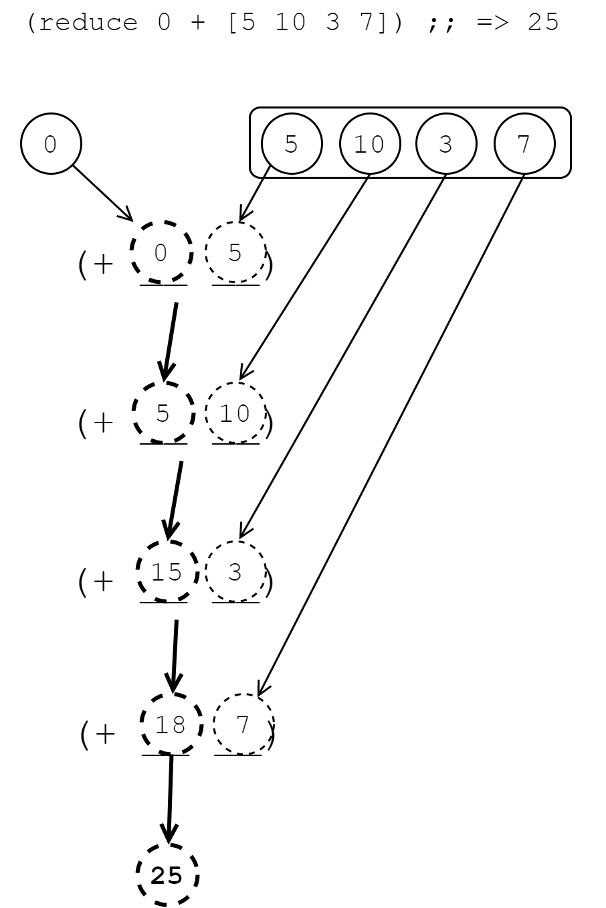

[UP](003_00.md)

### レッスン 18：データをまとめる

これまでに、シーケンスに対して行うことのできる便利な操作をいくつか学んできました。

- 各要素を変換する`map`
- 特定の要素を選択する`filter`
- コレクションタイプ間の変換を行う`into`

これらの関数だけで、できることはたくさんあります。実際、これらの関数を使えば、`for`ループのようなものを使う必要はほとんどありません。前回のレッスンでは、これらの関数を使って、ショッピングカート内の商品の消費税を計算し、課税対象の商品のみにフィルタリングしました。しかし、カートの合計金額や、カート内の商品の平均金額を取得したい場合を考えてみましょう。この場合、`map`は使えません。単一の値が必要であり、`map`は常に元の値と同じサイズの別のシーケンスとして評価されます。`filter`も明らかに我々が求めているものではありません。`for`ループに頼らずに、シーケンスから「サマリー」データを取得する方法はありますか？確かに他の選択肢もありますが、最も一般的なのは`reduce`関数です。

-----
**このレッスンでは**

- シーケンス全体の値を集約する
- `reduce`関数の記述
- `reduce`を使った再帰的コードの簡略化
-----

##### 練習問題： カートの値の取得

前回のレッスンと同じ一般的なショッピングカートのモデルを使って、カート内のすべての商品の合計金額を求めてみましょう。ここでは再び、JavaScriptで必須的に行う方法の例を考えます。今回、私たちは宇宙旅行に行くことになり、途中で必要になるかもしれないいくつかの消耗品を手に入れる必要があります。

```JavaScript
const cart = [                                             // <1>
    { name: "Tachyon Emitter Array", price: 1099.45 },
    { name: "Dilithium Matrix", price: 2442.00 },
    { name: "Antimatter Chamber Sealant Rings (4)", price: 19.45 },
    { name: "Toothbrushes (2-pack)", price: 8.50 }
];

let total = 0;                                             // <2>
for (let item of cart) {
    total += item.price;
}

console.log(total.toFixed(2)); // "3569.40"
```
手続き型によるショッピングカートの値

1. 前のレッスンで使ったのと同じカートのデータ構造を使う
2. `for`ループを使って合計値を計算する

ここでのパターンは簡単です。ある値、つまりこの場合は変数`total`があり、配列`cart`の各要素ごとに更新されます。このようなコードは日常的に見たり使ったりしているので、何が起こっているのかを理解するのは難しくありませんが、`for`ループには不必要な複雑さがあります。ClojureScriptでは、`reduce`というパターンを使います。

```Clojure
cljs.user=> (def cart                                      ;; <1>
              [{:name "Tachyon Emitter Array" :price 1099.45}
               {:name "Dilithium Matrix" :price 2442.00}
               {:name "Antimatter Chamber Sealant Rings (4)" :price 19.45}
               {:name "Toothbrushes (2-pack)" :price 8.50}])
#'cljs.user/cart

cljs.user=> (defn add-price [total item]                   ;; <2>
              (+ total (:price item)))
#'cljs.user/add-price

cljs.user=> (def total (reduce add-price 0 cart))          ;; <3>
#'cljs.user/total

cljs.user=> (.toFixed total 2)
"3569.40"
```

1. カートのデータ構造を定義する
2. 実行中の合計値と新しい要素を受け取り、新しい合計値を生成する還元(reducing)関数を作成する。
3. この還元(reducing)関数をカート全体に適用し、合計を抽出する。

#### Reduceの理解

`map`と`filter`の仕組みは、それらを使用したコードを見ただけで明らかになりましたが、`reduce`についてはもう少し深く掘り下げる必要があります。`map`や`filter`と同様に、`reduce`は関数とシーケンスを受け取り、何かを返します。しかし、`reduce`には追加のパラメータが必要で、その関数は`map`や`filter`に渡した関数とは少し異なります。ひとつは、この関数が1つのパラメータではなく、2つのパラメータを取ることです。また、常にシーケンスを返すわけではありません。では、`reduce`はどのように機能するのでしょうか。

`reduce`は一般的に3つのパラメータを受け取ります。
初期値、還元(reducing)関数、そしてシーケンスです。まず、初期値とシーケンスの最初の要素を引数として還元(reducing)関数を評価し、評価された値をコレクションの2番目の項目とともに再び還元(reducing)関数に渡します。その後，シーケンスの各要素について還元関数の評価を続けます．
結果として得られる値を次の呼び出しに戻します。最後に、`reduce`自体は、reducing関数への最後の呼び出しで得られた値に評価されます。このように頭を悩ませることが多いので、図を使って何が起こっているのかを視覚的に理解してみましょう。



`reduce`はreducing関数を評価するたびに値を積み上げていくことがわかります。最初の呼び出しでは、初期値である`0`とシーケンスの最初の要素である`5`を加算して`5`を得た。次に、この値とシーケンスの次の要素である`10`を加えて`15`を得た。このようにシーケンス全体を進めていき、最終的な結果として最後の値である`25`を得ました。数列を扱う方法を知らない関数（`+`）を、数列内のすべての数字の合計を得るために応用できたことに注目してください。

子供たちが雪合戦のために雪玉を詰める様子を想像してみてください。片手に少しの雪を持ち、もう片方の手で雪を詰めていきます。片手に少しの雪を持ち、もう片方の手で雪を詰めていきます。雪を詰めるたびに、雪玉はどんどん大きくなり、自分の好みの雪玉になります。Reduceの動作もこれとよく似ていて、パスするたびにどんどんデータを「蓄積」していきます。このような理由から、Reduce関数に渡される最初のパラメータは、しばしばアキュムレータやメモと呼ばれます。

**クイックレビュー**

次のようなコードがあるとします。

```Clojure
;; Create a seq of words
(def words (clojure.string/split
            "it was the best of times it was the worst of times"
            #" "))

(defn count-words [counts word]
  (update-in counts [word] #(inc (or % 0))))

(def word-counts (reduce count-words {} words))
```

- `word-counts`のデータタイプは何ですか？
- `word-counts`の値は何ですか？

REPLでこのコードを試す前に、鉛筆と紙を使って`count-words`関数の呼び出しを書き出してみてください。慣れない特定の関数のドキュメントを調べる必要がある場合は、REPLから`(doc function-name)`を呼び出すか、clojuredocs.orgでその関数を調べることができます。

#### Reduceの使用例

Reduceは、以下のような場合に最適なツールです。

- シーケンスを走査しながら状態を蓄積する必要がある。
- 標準ライブラリに、必要な機能を持つ既存の関数がない。

私たちのアプリが、分析を目的としてウェブページ上のユーザーイベントを追跡するとします。ユーザーが実行した`:event`と、そのイベントが発生した`:timestamp`を持つマップとしてモデル化されたイベントのリストがあります。

```Clojure
(def events [{:event :click, :timestamp 1463889739}
             {:event :typing, :timestamp 1463889745}
             {:event :click, :timestamp 1463889746}
             {:event :click, :timestamp 1463889753}])
```

今回の課題は、ユーザーがアイドル状態であった最長の時間を把握することです。そのためには、これまでに発生したイベントと最後に発生したタイムスタンプの間の最長時間を記録する必要があります。記録したい項目が複数あるので、蓄積装置としてマップを使うことができます。

```Clojure
(defn longest-idle-time [events]
  (:max-idle                                               ;; <1>
    (reduce (fn [{:keys [max-idle last-ts]} event]         ;; <2>
              (let [ts (:timestamp event)
                    idle-time (- ts last-ts)]
                {:max-idle (max max-idle idle-time)        ;; <3>
                 :last-ts ts}))
            {:max-idle 0
             :last-ts (:timestamp (first events))}         ;; <4>
            events)))
```

1. `reduce`はマップを返すので、1つの値だけを取り出す
2. インラインでreducing関数を定義する
3. reducing関数からマップを返す
4. 初期値をマップとして定義する

このケースでは、イベントとイベントの間の最長の間隔を秒単位で知りたいのですが、新しい時間の間隔を計算できるように、前のイベントがいつ発生したのかも記録しておく必要があります。マップをアキュムレータとして使用することで、必要なだけ多くの状態を記録することができ、最終的には必要のない中間結果を破棄して、目的の特定の値だけを得ることができます。

**やってみよう**

- ユーザーが何回クリックしたかを返す関数を書いてみましょう。
- 一連のイベントを受け取り、ユーザが何回ダブルクリックしたかを示す関数を書いてください（ダブルクリックとは、同じタイムスタンプ内で2回クリックした場合と定義します）。イベントのリストは、タイムスタンプの昇順で並んでいると仮定しても構いません。

#### より簡潔に

Reduceは、明快で表現力のあるコードを書くのに役立つ便利な関数ですが、さらに簡潔なコードを書くために留意すべき点がいくつかあります。まず、Reduceには2引数のバージョンがあり、多くの状況で使用することができます。

```Clojure
(reduce reducing-fn vals)
```

この場合、`reducing-fn`に渡す初期値は指定しません。代わりに、`vals`の最初の2つの要素で最初に呼び出されます。これは、数字の和をとるような場合に非常に有効です。

```Clojure
cljs.user=> (reduce + [6 7 8])
21

;; (+ 6 7)  => 13
;; (+ 13 8) => 21
```

キー操作の手間が省けるだけでなく、この2引数バージョンの`reduce`は読みやすくなっています。

`reduce`をより簡潔にするための2つ目のヒントは、値を還元する前にマッピングやフィルタリングを行うことです。ショッピングリストの例に戻ると、課税対象となるすべての商品の価格の小計を取得したい場合、1回の`reduce`ですべてを実行することができます。

```Clojure
(reduce (fn [total item]
          (if (:taxable? item)
            (+ total (:price item))))
        0
        cart)
```

しかし、通常は変換、フィルタリング、還元(reducing)を別々のステップで行った方がわかりやすいです。

```Clojure
(reduce +                                                  ;; <1>
        (map :price                                        ;; <2>
             (filter :taxable? cart)))                     ;; <3>
```

1. すべての値の合計
2. 価格の
3. 課税対象アイテムの

`map`、`filter`、`reduce`がそれぞれのステップに分かれているので、このコードの意図は明確で、シンプルです。各懸念事項はしっかりとカプセル化されており、どのコードも多くのことをやろうとしていません。さらに、すべてのロジックを1つの`reduce`関数にまとめた場合と比べて、各部分の再利用性が高くなっています。

**課題**

Reduceは`map`や`filter`よりもずっと一般的な関数です。実際、`map`と`filter`はどちらも`reduce`を使って実装できます。ここでは、`map`の実装を紹介します。

```Clojure
(defn my-map [xform vals]
  (reduce (fn [new-vals elem]
            (conj new-vals (xform elem)))
            '()
            (reverse vals)))
```

同様のパターンで、独自のバージョンの`filter`を実装し、`my-filter`と名付けてください。

#### まとめ

`reduce`で何ができるか考えてみましょう。

- シーケンスの合計値を記録する
- 多くの再帰的なコードをより簡潔に書き直す。
- あらゆるシーケンス操作を`reduce`として実装する

このレッスンでは、基本的な`reduce`関数を取り上げ、ショッピングカートに入っているすべての商品の価格を合計する問題に適用しました。`reduce`は、その汎用性と再帰的なコードを簡略化する能力から、ClojureScriptのコードでは非常によく使われます。シーケンスの扱い方がわかったところで、ClojureScriptのコレクションを使ったドメインのモデル化に目を向けてみましょう。


[NEXT](003_19.md)

[UP](003_00.md)

