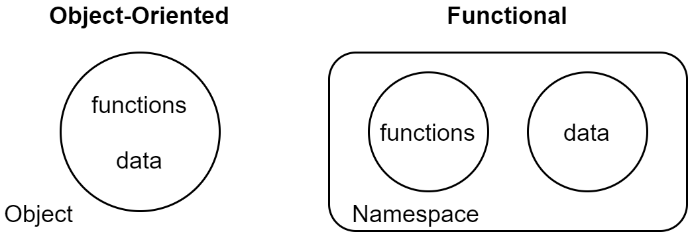
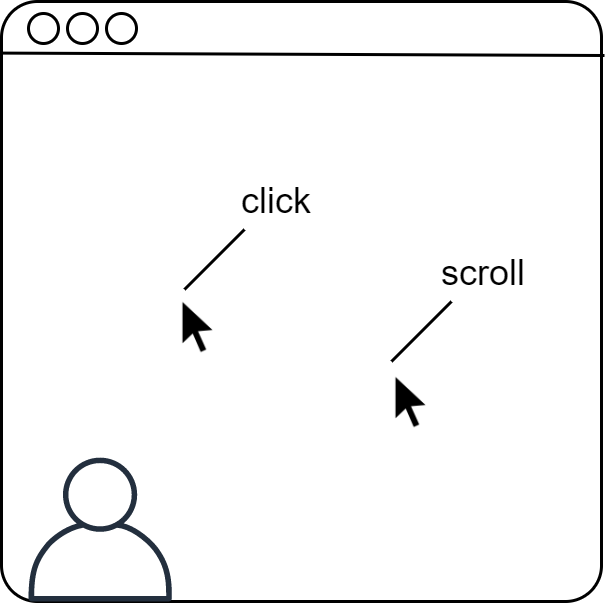

[UP](003_00.md)

### レッスン 19：マップとベクターでデータを使いこなす

このレッスンでは、データを簡単に扱うことができるClojureScriptの機能のいくつかを紹介します。ClojureScriptでは、単一のオブジェクトタイプでのみ動作する高度に専門化された関数を作成するのではなく、汎用のコレクションタイプとそれを操作する標準関数に依存することを重視しています。ほとんどの主流言語が推奨しているオブジェクト指向のアプローチは、特定のタイプの「もの」のデータと動作の両方をカプセル化したオブジェクトを作成することです。しかし、ClojureScriptが奨励している手法は、関数とデータを分離することです。データは純粋な情報であり、関数はデータを純粋に変換するものです。

-----
このレッスンでは

- 最も一般的なマップ関数をマスターする：`assoc`, `dissoc`, `merge`, `select-keys`
- ネストの深い値の取得と設定
- 一般的なオブジェクトを作成するためのコンストラクタパターンの使用
-----


関数とデータ

##### 例 ドメインのモデル化

分析アプリの作成を任されたとします。始める前に、これから扱うオブジェクトの種類をモデル化したいと思います。静的に型付けされた言語を使用していた場合、おそらく型定義を記述することから始めるでしょう。JavaScriptを使っていたとしても、扱うオブジェクトに「クラス」を定義することになるでしょう。これらのオブジェクトを定義する際には、そのオブジェクトが含むデータとサポートする操作の両方について考えなければなりません。例えば、`User`と`ClickEvent`がある場合、`User.prototype.clickEvent()`という操作が必要になるかもしれません。


分析領域：ユーザーとその行動

ClojureScriptでは、データと関数を別々に考えます。このアプローチは結果的に柔軟で、データに対して実行したい操作のほとんどがシンプルで再利用可能であることがわかります。実際に、必要な操作がすでに標準ライブラリに含まれていることもよくあります。結局のところ、コードの簡潔さと標準ライブラリの豊富さを組み合わせることで、JavaScriptよりも少ない行数のコードを書くことができ、より堅牢で保守性の高いアプリケーションを実現することができるのです。

#### マップとベクターによるドメインモデリング

ここまでで、マップとベクター、そしてそれらに使用できるコレクションとシーケンスの操作についてかなり理解できました。今度は、実際のドメインであるアナリティクスのダッシュボードで、これらを実践してみましょう。モデル化する必要のある主な概念は、ユーザー(user)、セッション(session)、ページビュー(page-view)、イベント(event)であり、これらのモデル間の関係は以下の通りです。

- ユーザー(user)は1つまたは複数のセッションを持ちます。
- セッション(session)は、1つまたは複数のページビューを持ち、ユーザーに属する場合も匿名の場合もあります。
- ページビュー(page-view)は0個以上のイベント(event)を持ちます。

これで、いくつかのサンプルデータを作成するのに十分な知識が得られました。ここでは、最も単純なモデルから始めて、上位のモデルへとステップアップしていきましょう。イベント(event)は他のどのモデルにも依存しないので、ここから始めるのが良いでしょう。

##### イベントのモデリング

イベント(event)とは、ユーザーがWebページを操作する際に行う何らかのアクションのことです。それは、クリック(click)、スクロール(scroll)、フィールド入力(field entry)などです。イベント(event)によって関連するプロパティは異なりますが、すべてのイベントには少なくともタイプとタイムスタンプがあります。

```Clojure
(def my-event {:type :click                                ;; <1>
               :timestamp 1464362801602
               :location [1015 433]                        ;; <2>
               :target "#some-elem"})
```
イベントのモデリング

1. すべてのイベントには、`:type`と`:timestamp`の項目があります。
2. 残りのエントリは、イベントタイプに固有のものです。

ClojureScriptでイベント(event)のようなデータタイプを考えるとき、通常は少なくともデータタイプの精神的なスキーマを作成します。[clojure.spec](https://clojure.org/about/spec)を筆頭に、データにスキーマを強制するために使用できるライブラリがありますが、今のところ、データ構造の「形」を慣習的に強制します。つまり、イベントを作成するときには、タイムスタンプとタイプを指定して作成するようにします。実際、新しいデータ型を作成するために、1つ以上の関数を定義するのは一般的な方法です。ここでは、イベント(event)を使った例を紹介します。

```Clojure
cljs.user=> (defn event [type]
              {:type type
               :timestamp (.now js/Date)})
#'cljs.user/event

cljs.user=> (event :click)
{:type :click, :timestamp 1464610050488}
```
コンストラクタ関数の使用

この関数は、イベントのために確立した規則に従った新しいオブジェクトを作成するプロセスを単純に抽象化したものです。また、クリックイベント専用のコンストラクタ関数も作成しておきましょう。

```Clojure
cljs.user=> (defn click [location target]
              (merge (event :click)
                     {:location location, :target target}))
#'cljs.user/click

cljs.user=> (click [644 831] "#somewhere")
{:type :click,
 :timestamp 1464610282324,
 :location [644 831],
 :target "#somewhere"}
```

このコードで唯一見慣れない点は、`merge`関数の使用です。この関数は、少なくとも2つのマップを受け取り、後続の各マップのすべてのプロパティを最初のマップに追加した結果である新しいマップを返します。これは、2番目のマップのすべての項目を1番目のマップに結合したものと考えることができます。

**クイックレビュー マージ**

- REPLで、2つのマップを定義し、それらをマージします。
- 3つのマップを定義し、それらをマージする（例：(merge map-1 map-2 map-3)
- mergeは、渡したマップのどれかを変異（変更）させますか？

- 次の式の結果はどうなりますか？

```Clojure
(let [orig {:name "Cookie Monster" :food "Cookies!!"}
      overwrite {:profession "puppet" :food "Lasagne"}]
   (merge orig overwrite))
```

**やってみよう**

ページ上の座標を、`[x-position, y-position]`という2要素のベクターで表現します。次の式が同じ結果になるように、2つの数値を与えて位置を作成する関数`location`を定義します。

```Clojure
;; Expression 1 - Define location inline
(click [644 831] ".link")

;; Expression 2 - Construct location with a function
(click (location 644 831) ".link")
```

> コンストラクタについて
>
> これまで、ClojureScriptのコンストラクタの概念について説明してきました。JavaScript とは異なり、ClojureScript のコンストラクタはデータを返す単なる関数です。コンストラクタは、開発者が新しいデータを簡単に作成し、作成コードを一箇所にまとめるための利便性にすぎません。

##### ページビューのモデリング

イベントが終わったので、次にページビューのモデリングを行います。ここでは、ページビューのコンストラクタを定義します。

```Clojure
cljs.user=> (defn page-view
              ([url] (page-view url (.now js/Date) []))    ;; <1>
              ([url loaded] (page-view url loaded []))
              ([url loaded events]
                {:url url
                 :loaded loaded
                 :events events}))

cljs.user=> (page-view "some.example.com/url")             ;; <2>
{:url "some.example.com/url",
 :loaded 1464612010514,
 :events []}

cljs.user=> (page-view "http://www.example.com"            ;; <3>
                      1464611888074
                      [(click [100 200] ".logo")])
{:url "http://www.example.com",
 :loaded 1464611888074,
 :events [{:type :click,
           :timestamp 1464611951519,
           :location [100 200],
           :target ".logo"}]}
```
ページビュー(page-view)のモデリング

1. `page-view`を3つの属性で定義する
2. `page-view`は、URLだけで呼び出すことができます。
3. ...または、URL、ロードされたタイムスタンプ、イベントのベクターを使って呼び出します。

イベントでしたように、コンストラクタを作成して、ページビュー(page-view)の定義に合ったマップを組み立てるための詳細を管理しています。このコードの異なる点は、コンストラクタとして多重アリティ関数を使用していることと、`loaded` および `events` の値が提供されない場合にデフォルト値を提供していることです。これは、引数のデフォルト値を扱うClojureScriptの一般的なパターンです。

##### セッションのモデリング

データモデルの階層を進めていくと、今度はセッション(session)が出てきます。セッション(session)とは、同じユーザーによる1つ以上の連続したページビュー(page-view)のことです。ユーザーがサイトを離れ、後で戻ってきた場合、新しいセッション(session)を作成することになります。そのため、セッション(session)には、ページビュー(page-view)のコレクションに加えて、ユーザーのブラウザや場所などの識別情報が必要です。

```Clojure
cljs.user=> (defn session
              ([start is-active? ip user-agent] (session start is-active? ip user-agent []))
              ([start is-active? ip user-agent page-views]
                {:start start
                 :is-active? is-active?
                 :ip ip
                 :user-agent user-agent
                 :page-views page-views}))

cljs.user=> (session 1464613203797 true "192.168.10.4" "Some UA")
{:start 1464613203797, :is-active? true, :ip "192.168.10.4", :user-agent "Some UA", :page-views []}
```
セッションのモデリング

ここでは何も新しいことはありません。分析アプリケーションで使用できるタイプを増やして、ドメインを充実させているだけです。残るのはユーザー(user)だけです。

**やってみよう**

イベント(event)、ページビュー(page-view)、セッション(session)の定義について説明しましたが、ユーザーのデータタイプを定義するのに必要なツールはすべて揃っています。

- ユーザーの「形」を定義します。少なくとも以下の項目を含める必要があります。`:id`, `:name`, `:sessions`.
- コンストラクタ関数を作成して、セッションのコレクションを持つユーザーと持たないユーザーを作成します。
- おまけに、`anonymous-user`という関数を作って、idもnameも持たないユーザを作ってみてください。

これで、分析アプリケーションのための完全なドメインが定義されました。次は、ClojureScriptの標準ライブラリの関数を使って、どのようにドメインを操作するかを考えてみましょう。以下は、この時点でのドメインからの完全なデータがどのように見えるかのサンプルです。このデータを参照しながら作業を進めていくと便利です。

```Clojure
;; User
{:id 123
 :name "John Anon"
 :sessions [

   ;; Session
   {:start 1464379781618
    :is-active? true
    :ip 127.0.0.1
    :user-agent "some-user-agent"
    :page-views [

      ;; Pageview
      {:url "some-url"
       :loaded 1464379918936
       :events [

         ;; Event
         {:type :scroll
          :location [403 812]
          :distance 312
          :timestamp 1464380102036}

         ;; Event
         {:type :click
          :location [644 112]
          :target "a.link.about"
          :timestamp 1464380117760}]}]}]}
```
分析ドメインのためのサンプルデータ

#### 連想データの活用

分析データのほとんどは、単純なキーと値の関連付けであるマップの形をしています。これまで見てきたように、マップだけでモデル化できるデータは非常に多いので、ClojureScriptがマップを操作するための優れたツールを提供するのは当然のことです。実際、その通りです。ここでは、マップを扱うときに何度も出てくるいくつかの関数、`assoc`、`dissoc`、`select-keys`を見ていきます。マップで使える標準ライブラリの関数は他にもありますが、これらは最もよく使われるもので、説明に値します。[Clojure Cheatsheet](http://clojure.org/api/cheatsheet)は、私たちがカバーできない関数の優れたリファレンスです。

##### 多かれ少なかれ。要素の追加と削除

ClojureScriptには、マップエントリを追加・削除するための非常に便利な関数ペア、`assoc`と`dissoc`があります。 JavaScriptオブジェクトのプロパティを設定・削除するのとは異なり、`assoc`と`dissoc`は提供するマップには触れません。その代わりに、新しいマップを返します。ここまでで、不変のデータを扱うということに慣れてきたと思いますが、まだ少し慣れが必要です。

**`assoc`による値の追加**

先ほど作成したセッションモデルを考えてみましょう。このモデルには、ユーザーのウェブサイトへの訪問に関する識別情報が含まれています。新たな要件は、ユーザーがログアウトしたり、サイトを離れたりした後に、すべてのセッションに期間を追加することです。この場合、セッションマップに新しいエントリを追加する必要があります。これを「デュレーション(`:duration`)」と呼びましょう。


データをマップに関連付ける

これはまさに`assoc`関数が解決するケースです。`assoc` は，マップと，そのマップに関連付けるためのキーと値を受け取ります。また、引数として任意の数のキーと値を受け取ることができ、マップ内にそのすべてのキーと値を関連付けることができます。

```Clojure
cljs.user=> (def trail {:name "Bear Creek Trail"
                        :distance 7.5})
#'cljs.user/trail

cljs.user=> (assoc trail :difficulty :moderate)            ;; <1>
{:name "Bear Creek Trail",
 :distance 7.5,
 :difficulty :moderate}

cljs.user=> (assoc trail                                   ;; <2>
                   :difficulty :moderate
                   :location "Colorado"
                   :max-elevation 12800)
{:name "Bear Creek Trail",
 :distance 7.5,
 :difficulty :moderate,
 :location "Colorado",
 :max-elevation 12800}
```
マップにエントリを追加する

1. 1つのエントリーを追加する
2. 複数のエントリの追加

これで、終了タイムスタンプが与えられたときに、セッションの秒数を示す `:duration` エントリを追加する関数が書けるようになりました。

```Clojure
cljs.user=> (defn with-duration [session end-time]
              (let [duration-in-ms (- end-time (:start session))
                    duration-in-s (.floor Math (/ duration-in-ms 1000))]
                (assoc session :duration duration-in-s)))

cljs.user=> (def my-session
              (session (.now js/Date) true "127.0.0.1" "Some UA"))
#'cljs.user/my-session

;; Wait a few seconds

cljs.user=> (with-duration my-session (.now js/Date))
{:start 1464641029299,
 :is-active? true,
 :ip "127.0.0.1",
 :user-agent "Some UA",
 :page-views [],
 :duration 14}
```

**クイックレビュー：`assoc`**

- `(assoc some-map key val)`と`(conj some-map [key val])`の違いはありますか？
- `assoc`は渡されたマップをmutate(変更)しますか？

##### `dissoc`による値の削除

ユーザーがIPやユーザーエージェントを追跡しないように要求できる設定を追加したとします。そのため、サーバーに送信する前にマップからこれらのデータを削除する必要があります。`dissoc`は、マップと、そのマップから削除するための任意の数のキーを受け取り、指定したキーを含まない新しいマップを返します。これらのエントリのないセッションを返す`untrack`という関数を作ってみましょう。

```Clojure
cljs.user=> (defn untrack [session]
              (dissoc session :ip :user-agent))
#'cljs.user/untrack

cljs.user=> (untrack my-session)
{:start 1464641029299, :is-active? true, :page-views []}
```

**クイックレビュー: `dissoc`**

- `dissoc`を使って、このマップから`:region`キーを削除してみましょう。`{:landmark "Uncompahgre", :region "San Juan Mountains"}`。
- `(dissoc {:temp 212} :color :material :mass)`のように、`dissoc`に渡したキーのうち1つ以上がマップに含まれていない場合はどうなるでしょうか。
- 先ほど作成した `with-duration` 関数を更新して、セッションから `:is-active?`キーを削除します。

##### `select-keys`による選択範囲の絞り込み

マップを扱うときに便利なもうひとつの関数が`select-keys`です。`select-keys`は、マップと保持したいキーのコレクションを受け取り、渡されたキーだけを含む新しいマップを返します。アプリケーションの一部で、セッションがいつ始まったか、アクティブかどうか、ページビューなどにしか興味がない場合、`select-keys`を使って、データを興味のあるものだけに絞り込むことができます。

```Clojure
cljs.user=> (select-keys my-session [:start :is-active? :page-views])
{:start 1464641029299,
 :is-active? true,
 :page-views []}
```

**やってみよう**

ClojureScriptがマップを連想的と考えるのは直感的です。興味深いことに、ベクターもまた、整数のインデックスとそのインデックスの要素を対応させる連想的なコレクションです。

```Clojure
cljs.user=> (associative? [])
true
```

- REPLで複数の要素を持つベクターを定義する
- 指定したインデックスの要素を取得するには `get` を使用します。
- 指定したインデックスの要素を更新するには `assoc` を使用します。
- ベクターに対して `merge` および `dissoc` 関数を使用してみてください。その結果に驚きましたか？

#### ネストしたデータの扱い

どんなに単純なプログラムでも、どこかで入れ子のデータを扱う必要があります。本章で検討している分析アプリケーションはその良い例で、ページビューの中に入れ子になったイベントがあり、そのイベントはセッションの中に入れ子になっていて、セッション自体がユーザーの中に入れ子になっています。これまでに見てきた関数だけでは、とても手に負えません。ここでは、入れ子になったデータを扱うことができるいくつかの関数に注目してみましょう。

##### `get-in`で絞り込む

`get`関数は、マップやベクターの特定の要素にアクセスするために何度も目にしてきました。この関数には、データ構造の奥深くにある値を設定するための`get-in`関数があります。`get-in`では、取り出す値のキーを1つだけ指定するのではなく、順番に検索されるキーのシーケンスを指定します。このシーケンスは、興味のあるデータへのパスと考えることができます。コンピュータが検索するデータを探すためのロードマップのようなものです。たとえば、あるユーザーの最初のセッションの最初のページビューを取得するには、次のようにします。

```Clojure
(get-in user [:sessions 0 :page-views 0])
```
ネストしたデータの取得

これはまず、渡された`user` の `:sessions` キーを検索します。次に、最初のセッション（インデックス0）を取得し、このセッションの`:page-views`キーを取得します。最後に、最初の`page-views`を取得します。`get-in`は実際には`get`を繰り返し呼び出すための便宜的なものであることに注意してください。

```Clojure
(get
  (get
    (get
      (get user :sessions)                                 ;; <1>
     0)                                                    ;; <2>
   :page-views)                                            ;; <3>
  0)                                                       ;; <4>
```

1. ユーザーのセッションの取得
2. 最初のものを取得する
3. ページビューを取得する
4. 最初のものを取得

このパスの概念は、ClojureScriptでは、特定のデータに「たどり着く」方法を説明するためによく使われます。JavaScriptの世界で例えると、特定のオブジェクトに対する連鎖的なプロパティアクセスです。

```JavaScript
user.sessions[0].pageViews[0];
```
JavaScriptのネストしたデータの取得

一見すると、JavaScript版もClojureScript版と同じくらい明確に見えますが、実際にはもう少し明確かもしれません。しかし、get-inの重要な特徴の1つは、パスのどの時点でも次のプロパティが存在しない場合、評価が停止し、全体がnilと評価されることです。より正確なJavaScriptの翻訳は以下のようになります(*1)。

```JavaScript
user &&                                                    // <1>
    user.sessions &&
    user.sessions[0] &&
    user.sessions[0].pageViews &&
    user.sessions[0].pageViews[0];                         // <2>
```

1. 未定義の可能性があるすべての中間ステップをチェック
2. ネストされたデータを取得するには、そのデータに至るまでのすべてのステップが定義されている必要があります。

**クイックレビュー： `get-in`**

- この式が真になるように空欄を埋める

```Clojure
(= "second"
   (get-in {:tag "ul"
            :children [{:tag "li"
                        :id "first"}
                       {:tag "li"
                        :id "second"}]}
       ...))
```

- 次の式は何と評価されますか？

```Clojure
(get-in {} [:does :not :exist])
```

##### `assoc-in`による設定

`get-in`が`get`のバリエーションで入れ子のデータにアクセスできるように、`assoc-in`は`assoc`のバリエーションで入れ子のデータを設定できるようになっています。`assoc-in`の呼び出しは`assoc`の呼び出しと非常によく似ていますが、違いは単純なキーを与える代わりに、設定したいデータへのパスを渡すことです。

```Clojure
(assoc-in user
          [:sessions 0 :page-views]                        ;; <1>
          [(page-view "www.learn-cljs.com" 123456 [])])    ;; <2>
```

1. 変更するデータへのパス
2. 関連付けする値

**クイックレビュー：`assoc-in`**

- 次の結果はどうなりますか？

```Clojure
(assoc-in {:tag "ul"
           :children [{:tag "li"
                       :id "first"}
                      {:tag "li"
                       :id "second"}]}
      [:children 1 :class]
      "last-item")`
```

- 次の結果はどうなりますか？

```Clojure
(assoc-in {} [:foo :bar :baz] "quux")
```

##### `update-in`による更新

`get-in`と`assoc-in`の動作を見てきましたが、次は`update-in`でネストされたデータを扱うための3つの関数を完成させます。`assoc-in`と同様に、この関数はデータ構造とパスを受け取りますが、データ構造に入れる単純な値を受け取るのではなく、指定されたパスで見つかった既存のアイテムに適用する関数を受け取ります。そして、このパスにある項目は、関数が返す値で置き換えられます。簡単な例を考えてみましょう。

```Clojure
cljs.user=> (update-in {:num 1} [:num] inc)
{:num 2}
```

ここでは、パス`[:num]`に位置する要素を操作し、それをインクリメントするように指定しました。これにより、元のマップの`:num`キーをインクリメントしたものが、`:num`キーとなる新しいマップが作成されました。この簡単な例ではフラットデータを扱いましたが、ネストしたデータでも原理は同じです。アナリティクスの例に戻って、クリックイベントのx座標に10pxを追加したいとします。これは、1つの`update-in`で簡単に実現できます。

```Clojure
(defn add-to-click-location [click-event]
  (update-in [:location 0] #(+ 10 %)))
```

Reagentでシングルページのアプリを作るようになると、常に`update-in`を利用することになるので、その使い方に慣れておくことが大切です。

**クイックレビュー：`update-in`**

- `(update-in {} [:foo :bar] inc)`の結果はどうなりますか？
- `update-in`は，マップとベクターの両方を扱うことができますか？なぜなのでしょうか？

#### まとめ

この章では多くのことをカバーし、以下のようなかなりのデータ操作ができるようになりました。

- `merge`によるマップの結合
- `assoc`と`disso`cによる単一のプロパティの追加と削除
- `get-in`、`assoc-in`、`update-in`による深いネストされたデータの処理

前回のレッスンで学んだ一連の操作と、今回学んだ追加の操作を組み合わせることで、かなり複雑なデータ駆動型のプログラムを書くことができます。次は、コレクションとシーケンスについて学んだことをまとめて、`localStorage`にデータを保持する連絡先リストアプリケーションを作ってみましょう。

-----
(*1) JavaScriptの新しいオプショナルチェイン機能は、`user?.sessions?[0]?.pageViews?[0]`のようにこの表現を単純化します。

[NEXT](003_20.md)

[UP](003_00.md)

