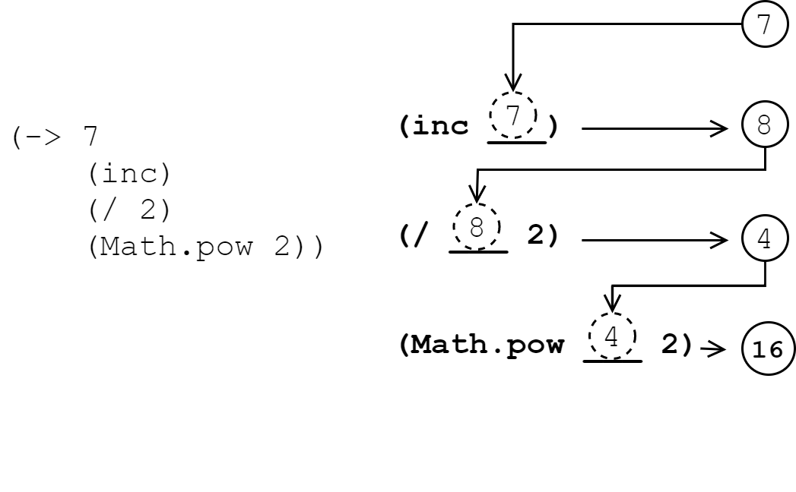

[UP](003_00.md)

### レッスン 20：キャップストーン 3 - 連絡帳

これまでの数回のレッスンでは、ClojureScriptでデータを扱うためのコアツールを学びました。まず、基本的なコレクションタイプであるリスト、ベクター、マップ、セットと、これらのコレクションを操作するための最も一般的な関数について学びました。次に、統一されたインターフェイスを使ってあらゆる種類のシーケンシャルデータを操作することができる、重要なシーケンス抽象化について詳しく見ていきます。次に、`reduce`関数と、一連のデータを集約するために使用される多くのケースについて学びました。最後に、現実世界の分析領域をモデル化するプロセスを説明しました。これらの知識を得て、次のキャップストーンプロジェクトを構築する準備ができました。今回は、[レッスン16](003_16.md)で触れた連絡帳の例を取り上げ、完全な実装であるClojureScript Contactsを構築します。

-----
このレッスンでは

- フレームワークを使わずに完全なClojureScriptアプリケーションを作る
- 単純なClojureScriptデータ構造からHTMLを構築する

-----


ClojureScriptのContactsのスクリーンショット

このキャップストーンのコード全体をそのまま表示することはありませんが、完成したプロジェクトのコードは、この本のGitHubリポジトリで見ることができます。前回と同様に、新しいFigwheelプロジェクトを作成します。

```bash
$ clj -X:new :template figwheel-main :name learn-cljs/contacts :args '["+deps"]'
$ cd contacts
$ clj -A:fig:build
```

#### データのモデリング

このレッスンでは、前の章で学んだテクニックとパターンを使って、連絡帳のデータをモデリングします。このレッスンの目的は、これまでに学んだことを実践することであり、新しい内容を多く取り入れることではありません。主にマップとベクターを使ってデータをモデル化し、新しい連絡先を作成するためのコンストラクタ関数パターンを実装します。また、データを変換する簡単な関数を使って、UIが連絡先リストを更新するために必要な操作を実装します。それでは、データモデルを見ていきましょう。

##### エンティティの構築

連絡帳は連絡先の順番に並んだリストを表しているので、その順番に並んだリストを表すデータ構造が必要になりますが、すでに見たようにベクターがぴったりです。空の連絡先リストは、空のベクターとして定義でき、コンストラクタ関数は必要ありません。

```Clojure
(def contact-list [])
```

空のベクターでは面白くないので、そのベクターが保持する連絡先に注目してみましょう。それぞれの連絡先には、姓名、電子メールアドレス、都市名、州名、国名などの住所が必要です。これは以下のようなネストしたマップで簡単に対応することができます。

```Clojure
{:first-name "Phillip"
 :last-name "Jordan"
 :email "phil.j@hotmail.com"
 :address {:street "523 Sunny Hills Cir."
           :city "Springfield"
           :state "MI"
           :postal "11111"
           :country "USA"}}
```

新しい連絡先を作成するには、前回のレッスンで紹介したコンストラクタ・パターンのバリエーションを使用します。各フィールドを個別に渡すのではなく、連絡先を構成する0個以上のフィールドを含むことが期待されるマップを渡します。前回のレッスンで、`select-keys`関数が、マップと選択されるべきキーのコレクションを受け取り、選択されたキーだけがコピーされた新しいマップを返すことを思い出していただけると思います。この関数を使って入力をサニタイズし、連絡先に有効なキーだけが含まれるようにすることができます。

```Clojure
(defn make-contact [contact]
  (select-keys contact [:first-name :last-name :email :postal :address]))
```

アドレス自体はマップなので、アドレスの作成は別の関数にしましょう。そして、make-contact関数を更新して、このアドレスコンストラクタを使うようにします。

```Clojure
(defn make-address [address]
  (select-keys address [:street :city :state :country]))

(defn make-contact [contact]
  (let [clean-contact (select-keys contact [:first-name :last-name :email])]
    (if-let [address (:address contact)]
      (assoc clean-contact :address (make-address address))
      clean-contact)))
```

今回の`make-contact`の新バージョンでは、これまで見たことのない`if-let`という表現が導入されています。このマクロは`if`と同じように動作しますが、名前をテストされる値にバインドします（`let`のように）。`let`とは異なり、1つのバインドしか提供できません。コンパイル時には、このコードは以下のように展開されます(*1)。

```Clojure
(if (:address contact)
  (let [address (:address contact)]
    (assoc clean-contact :address (make-address address)))
  clean-contact)
```
`if-let`の変形

近々、似たようなマクロである`when-let`を使用する予定です。`if-let`のように、バインディングを提供することができ、`when`のように、バインディングされた値が非nilの場合のみ処理します。

しかし、ClojureScriptのスレッディングマクロの1つである `-> (pronounced "thread first")` を使用して、`make-contact`関数をもう少し簡潔で読みやすいものにすることができます。このマクロを使うと、深く入れ子になっている式を、より連続的に書くことができます。このマクロは、値と任意の数の関数呼び出しを受け取り、その値を各関数呼び出しの第一引数として注入します。この変換を実際に見てみると、その機能がより直感的に理解できるはずです。

```Clojure
(-> val                                                    ;; <1>
    (fn-1 :foo)                                            ;; <2>
    (fn-2 :bar :baz)                                       ;; <3>
    (fn-3))

(fn-3                                                      ;; <4>
  (fn-2
    (fn-1 val :foo)
    :bar :baz))
```
スレッドファーストの変換

1. `val`を値とし、以下の式をスレッドしていきます。
2. `fn-1`は`val`と`:foo`を引数として評価されます。
3. `fn-1`の評価結果は、`fn-2`の第1引数としてスレッドされます。
4. マクロは、`fn-1` → `fn-2` → `fn-3` と評価される入れ子式に書き換えられます。

このマクロは、コードの読みやすさを向上させるため、ClojureScriptのコードでは非常によく使われます。このマクロは、コードの読みやすさを向上させるため、一見すると連続しているように見えるが、「インサイドアウト」で評価されるコードを書くことができます。ClojureScriptには、他にもいくつかのスレッディングマクロがありますが、今は説明しませんが、使い方がわかったら説明します。


スレッドファースト・マクロ

このマクロを使えば、make-contact関数をより明確にすることができます。

```Clojure
(defn maybe-set-address [contact]                          ;; <1>
  (if (:address contact)
    (update contact :address make-address)
    contact))

(defn make-contact [contact]
  (-> contact                                              ;; <2>
      (select-keys [:first-name :last-name :email])
      (maybe-set-address)))
```

1. アドレスを条件付きで構築するコードをリファクタリングする
2. `->`マクロを使って`make-contact`を書き換える

**クイックレビュー**

- if-letは複数のバインディングが可能ですか？例えば、このコードは何をするのでしょうか？
```Clojure
(if-let [contact (find-by-id 123)
     address (:address contact)]
(println "Address:" (format-address address)))
```

- 次の式を `->` マクロはどのように書き換えますか？
```Clojure
(let [input {:password "s3cr3t"}]
(-> input
  (assoc :password-digest (-> input :password digest))
  (dissoc :password)))
```

##### ステートトランジションの定義

コードで定義した連絡先の静的なリストを表示する以外のことをUIで行うためには、UIで何らかのインタラクションを可能にする必要があります。ここでも、UIコードの前に低レベルのドメインロジックを構築し、ClojureScriptが推奨するボトムアップ型のプログラミングスタイルを活用できるようにしています（小さくて細かい機能を、より大きくて便利な構造にまとめます）。

まず、ユーザーが新しい連絡先を連絡先リストに追加できるようにしたいとします。ある種のフォームデータを入力として受け取り、それをmake-contactコンストラクタに渡して、結果の連絡先をリストに追加することができます。引数としてコンタクトリストと入力データを渡して、新しいコンタクトリストを作成する必要があります。

```Clojure
(defn add-contact [contact-list input]
  (conj contact-list
        (make-contact input)))
```

これらの関数定義をREPLに貼り付けて、期待通りに機能するかどうかをテストすることができます。

```Clojure
cljs.user=> (-> contact-list                               ;; <1>
                (add-contact {:email "me@example.com"
                              :first-name "Me"
                              :address {:state "RI"}})
                (add-contact {:email "you@example.com"
                              :first-name "You"}))
[{:first-name "Me", :email "me@example.com"}
 {:first-name "You", :email "you@example.com"}]
```
REPLでテスト

1. 繰り返しになりますが、 `->` マクロはコードの読み書きを容易にします。

次に、リストから連絡先を削除する方法が必要になります。連絡先を格納するのにベクターを使用しているので、特定のインデックスの要素を削除するだけで済みます。

```Clojure
(defn remove-contact [contact-list idx]
  (vec                                                     ;; <1>
    (concat                                                ;; <2>
      (subvec contact-list 0 idx)                          ;; <3>
      (subvec contact-list (inc idx)))))
```
連絡先を削除する

1. `vec` : シーケンスをベクターに変換します。
2. `concat`は，渡されたシーケンスのすべての要素を順番に含む`seq`を返す
3. `subvec`は、与えられたベクターの一部を返します。

ここでは、まだ見たことのない新しい関数がいくつかあるので、それらが何をするのかを簡単に見てみましょう。まず、この関数の「内側」から、`subvec`を見てみましょう。この関数は、あるベクターのスライスを効率的に取得する方法を提供します。この関数には、2引数と3引数の形式があります。`(subvec v start)`と`(subvec v start end)`です。この関数は、JavaScriptの`Array.prototype.slice()`関数と同様に動作します。この関数は、元のベクターの`start`インデックスから始まり、`end`インデックスまでのすべての要素を含む新しいベクターを返します。`end`が指定されていない場合は、`start`から元のベクターの終了までのすべての要素が含まれます。

次に，`concat`です。この関数は、いくつかのシーケンスを受け取り、その引数のすべての要素を連結した新しい遅延(*2)`seq`を作成します。結果は`seq`なので、`vec`関数を使って結果をベクターに戻します。ClojureScriptの標準ライブラリの多くはシーケンスを抽象化して動作するため、結果をより特定のタイプのコレクションに変換する必要があることがよくわかります。

最後に、連絡帳を更新する際には、以前のバージョンを置き換えたいと思います。これは、更新された連絡先を、古いバージョンが占めていた`contact-list`の同じインデックスに配置するために、`assoc`を使用することで行うことができます。

```Clojure
(defn replace-contact [contact-list idx input]
  (assoc contact-list idx (make-contact input)))
```

**クイックレビュー**

- `vec`はシーケンスをベクターに変換すると言いました。シーケンスの抽象化について学んだことを踏まえて、`vec`にマップを渡すとどうなるでしょうか？セットの場合はどうでしょうか？

#### UIの作成

データモデルを扱うために必要なすべての関数を定義したので、アプリケーションのUIの作成に目を向けてみましょう。セクション5では、Reagentフレームワークを使用して高性能なUIを作成する方法を学びますが、今のところは、何か変更があるたびにアプリケーション全体を再レンダリングするという素朴な方法をとります。私たちのアプリケーションには、2つのメインセクションがあります。各連絡先の概要を表示する連絡先リストと、連絡先の詳細を表示/編集するための大きなペインです。

[hiccups](https://github.com/teropa/hiccups)ライブラリを使用して、プレーンなClojureScriptデータ構造をHTML文字列に変換します。これにより、アプリケーションのインターフェイスをClojureScriptのデータ構造として表現し、ページの実際のDOMに対して非常にシンプルなインターフェイスを持つことができます。このライブラリを使用するためには、`deps.edn`の依存関係に追加する必要があります。

```Clojure
:deps {;; ...Other dependencies
       hiccups/hiccups {:mvn/version "0.3.0"}}
```
deps.edn

次に、このライブラリをコアの名前空間にインポートする必要があります。このライブラリのマクロを使用しているので、構文が少し異なることに注意してください。

```Clojure
(ns learn-cljs.contacts
  (:require-macros [hiccups.core :as hiccups])
  (:require [hiccups.runtime]))
```
learn_cljs/contacts.cljs

ClojureScriptのデータ構造とHTMLとの変換は非常に簡単です。

1. HTMLタグは、最初の要素がキーワードとしてのタグ名であるベクターで表されます。
2. 属性はマップで表され、タグ名のすぐ後に来るべきです。属性を省略しても構いません。
3. ベクター内の残りの要素は、外側の要素の子となります。

たとえば、次のコードは、アンカータグを1つ含むdivをレンダリングします。

```Clojure
(hiccups/html                                              ;; <1>
  [:div                                                    ;; <2>
    [:a {:href "https://www.google.com"                    ;; <3>
         :class "external-link"}
        "Google"]])                                        ;; <4>
;; <div><a class="external-link" href="https://www.google.com">Google</a></div>
```
Hiccupでレンダリング

1. `html`マクロは、hiccupsのデータをHTML文字列にレンダリングします。
2. `div`を作成します。属性を指定する必要はありません
3. 外側の`div`の子として、属性マップを持つ`a`要素を作成します。
4. `a`要素はテキストのみを含みます。

これらの知識をもとに、hiccupと互換性のあるデータ構造を生成するコンポーネントを様々なUI要素に定義することができます。これらの関数を組み合わせてUI全体を表すデータ構造を作成し、これを別の関数に渡して構造全体をページにレンダリングします。

##### UIの状態

一歩下がって、UIに必要な追加の状態について考えてみましょう。まず、編集モードであるかどうかを示すフラグが必要です。編集モードでは、右側のペインに連絡先の詳細を含むフォームが表示されます。また、どの連絡先が編集用に選択されたかを追跡する必要があります。まだ保存されていない新しい連絡先の場合、このプロパティは`nil`または省略されます。当然ながら、アプリケーションの状態に関する連絡先も必要です。このように、非常にシンプルなステートモデルで、UIに必要なものをすべてサポートしています。

```Clojure
(def initial-state
  {:contacts contact-list
   :selected nil
   :editing? false})
```

また、アプリケーション全体をレンダリングし、状態が変化するたびにイベントハンドラをアタッチする役割を担う`refresh!`関数も定義します。イベントハンドラを再アタッチする必要があるのは、アプリケーションを含む DOM ツリーを置き換えているからで、ハンドラは破棄された DOM ノードにアタッチされたままになります。

```Clojure
(defn attach-event-handlers! [state])                      ;; <1>

(defn set-app-html! [html-str]
  (set! (.-innerHTML app-container) html-str))

(defn render-app! [state]
  (set-app-html!
    (hiccups/html
      [:div])))                                            ;; <2>

(defn refresh! [state]                                     ;; <3>
  (render-app! state)
  (attach-event-handlers! state))

(refresh! initial-state)                                   ;; <4>
```

1. アタッチする必要のあるすべてのイベントハンドラーは、この関数内でアタッチされます。
2. 空のdivを実際のアプリケーションのHTMLで置き換えます。
3. `refresh!` は、アプリケーションの状態を更新するたびに呼び出されます。
4. `initial-state`からページをレンダリングするために、最初の`refresh!`でアプリケーションを開始します。

##### 連絡帳のレンダリング

まずは、連絡先の概要をリストに表示するコンポーネントから始めましょう。スタイリング(*3)にはBulma CSSフレームワークを使用しますので、生成されるマークアップのほとんどは、ページのスタイリングを目的としたものです。さらに、mu-ICONクラス名を使用した[Microns](https://www.s-ings.com/projects/microns-icon-font/)アイコンフォントを使用します。

```Clojure
(defn format-name [contact]                                ;; <1>
  (->> contact                                             ;; <2>
       ((juxt :first-name :last-name))                     ;; <3>
       (str/join " ")))

(defn delete-icon [idx]
  [:span {:class "delete-icon"
          :data-idx idx}
    [:span {:class "mu mu-delete"}]])

(defn render-contact-list-item [idx contact selected?]
  [:div {:class (str "card contact-summary" (when selected? " selected"))
         :data-idx idx}                                    ;; <4>
    [:div {:class "card-content"}
      [:div {:class "level"}
        [:div {:class "level-left"}
          [:div {:class "level-item"}
            (delete-icon idx)
            (format-name contact)]]
        [:div {:class "level-right"}
          [:span {:class "mu mu-right"}]]]]])
```
連絡先の概要を表示する

1. 連絡先の表示名のロジックを別の関数に抽出する
2. マクロ `->>` (thread last) を使用して、後続の各関数の最後の引数として値を渡します。
3. `juxt` 関数は、コンタクトからファーストネームとラストネームを抽出します。これは以下の通りです。
4. `idx`は、イベントハンドラで正しい連絡先を取得できるようにするために必要です。

このコードで注意しなければならない点は、どちらも`format-name`関数で発生します。まず、値を複数の関数呼び出しに通すために `->>` マクロを使用しています。これは、このレッスンで以前に使用した `->` マクロとほぼ同じように動作しますが、値を最後の引数として後続の各関数に送り込むという点が異なります。

第二に、`juxt`関数は非常に興味深い関数で、少し説明する必要があります。`juxt`は可変数の関数を受け取り、新しい関数を返します。この関数は、`juxt`に渡された元の関数を、与えられた引数を使って順番に呼び出します。結果は最終的に、`juxt`に渡された関数と同じ順序でベクターに入れられます。例えば、このコードスニペットは、コレクションから最小値と最大値を含む2要素のベクターを取得する関数を作成します。

```Clojure
(def minmax
  (juxt #(reduce Math/min %)
        #(reduce Math/max %)))

(minmax [48 393 12 14 -2 207])
;; [-2 393]
```

`juxt`の呼び出し`((juxt :first-name :last-name))`に余分な括弧があるのは、`juxt`の呼び出し自体に連絡先を通すのではなく、`juxt`が返す関数を呼び出す必要があるからです。キーワードはマップで自分自身を探すことができる関数なので、この式は効果的に連絡先のファーストネームとラストネームをそれぞれ持つベクターを作成します。

```Clojure
((juxt :first-name :last-name) {:first-name "Bob" :last-name "Jones"})
;; ["Bob" "Jones"]
```

##### インタラクションの追加

次に、連絡先のサマリーで有効にしたいインタラクションについて考えてみましょう。行がクリックされると、その連絡先の詳細が表示／編集できるようにしたいと思います。各リストアイテムにイベントハンドラをアタッチして、アプリの状態に `:editing?` フラグを設定し、`:selected` にクリックされた連絡先のインデックスを設定します（レンダリング関数に `idx` を渡し、行に `data-idx` 属性を設定する必要があったのはこのためです）。

```Clojure
(defn on-open-contact [e state]
  (refresh!
    (let [idx (int (.. e -currentTarget -dataset -idx))]
      (assoc state :selected idx
                   :editing? true))))

(defn attach-event-handlers! [state]
  ;; ...
  (doseq [elem (array-seq (gdom/getElementsByClass "contact-summary"))]
    (gevents/listen elem "click"
      (fn [e] (on-open-contact e state)))))
```

シーケンスを熱心に反復するために `doseq` を使用することはよく知られていますが、`array-seq` を見たのは初めてです。この関数は、JavaScriptの配列を受け取り、それをClojureScriptのseqに変換し、任意のシーケンス操作（ここでは`doseq`）で使用できます。

単一の連絡先リストアイテムをレンダリングできるようになったので、各リストアイテムを表示するリストを作成してみましょう。

```Clojure
(defn render-contact-list [state]
  (let [{:keys [:contacts :selected]} state]
    [:div {:class "contact-list column is-4 hero is-fullheight"}
      (map-indexed (fn [idx contact]
                     (render-contact-list-item idx contact (= idx selected)))
                   contacts)]))
```

この関数は非常に単純で、連絡先リストの各項目のラッパー`div`をレンダリングし、その後、各連絡先のサマリーを順番にレンダリングするために`render-contact-list-item`関数にデリゲートします。しかし、まだお目にかかったことのない新しい関数があります。この関数は、要素そのものだけでなく、シーケンス内の要素のインデックスを使って`map-indexed`関数を呼び出すことを除けば、`map`と同じように動作します。

コンポーネントを合成してUIを構築するこのパターンは、JavaScriptの世界でもよく見られますが、ほとんどのClojureScriptアプリケーションでは、UIを合成する方法は、プレーンなデータ構造を生成する純粋な関数による関数合成です。

最後に、連絡先詳細フォームのレンダリングと連絡先の追加/更新について、あまり追加の説明をせずに簡単に説明します。まず、アプリ全体のHTMLをレンダリングする関数を見てみましょう。

```Clojure
(defn render-app! [state]
  (set-app-html!
    (hiccups/html
      [:div {:class "app-main"}
        [:div {:class "navbar has-shadow"}
          [:div {:class "container"}
            [:div {:class "navbar-brand"}
              [:span {:class "navbar-item"}
                "ClojureScript Contacts"]]]]
        [:div {:class "columns"}
          (render-contact-list state)
          [:div {:class "contact-details column is-8"}
            (section-header (:editing? state))
            [:div {:class "hero is-fullheight"}
              (if (:editing? state)
                (render-contact-details (get-in state [:contacts (:selected state)] {}))
                [:p {:class "notice"} "No contact selected"])]]]])))
```

`render-contact-list`関数はすでに見ましたが、連絡先を追加または保存するためのボタンを表示する`section-header`と、編集フォームを表示する`render-contact-details`を定義する必要があります。まずは `render-contact-details` から始めましょう。

```Clojure
(defn form-field                                           ;; <1>
  ([id value label] (form-field id value label "text"))
  ([id value label type]
   [:div {:class "field"}
     [:label {:class "label"} label]
     [:div {:class "control"}
       [:input {:id id
                :value value
                :type type
                :class "input"}]]]))

(defn render-contact-details [contact]
  (let [address (get contact :address {})]                 ;; <2>
    [:div {:id "contact-form" :class "contact-form"}
      (form-field "input-first-name" (:first-name contact) "First Name")
      (form-field "input-last-name" (:last-name contact) "Last Name")
      (form-field "input-email" (:email contact) "Email" "email")
      [:fieldset
        [:legend "Address"]
        (form-field "input-street" (:street address) "Street")
        (form-field "input-city" (:city address) "City")
        (form-field "input-state" (:state address) "State")
        (form-field "input-postal" (:postal address) "Postal Code")
        (form-field "input-country" (:country address) "Country")]]))
```
連絡先の詳細をレンダリングする

1. 複数のフォームフィールドをレンダリングすることになるので、フィールドのコードを独自の関数に抽出します。
2. 住所は存在しないかもしれないので、デフォルトでは空の地図を提供しています。

次に、フォームを処理して、連絡先を追加または更新するコードを見てみましょう。

```Clojure
(defn get-field-value [id]
  (let [value (.-value (gdom/getElement id))]
    (when (not (empty? value)) value)))

(defn get-contact-form-data []
  {:first-name (get-field-value "input-first-name")
   :last-name (get-field-value "input-last-name")
   :email (get-field-value "input-email")
   :address {:street (get-field-value "input-street")
             :city (get-field-value "input-city")
             :state (get-field-value "input-state")
             :postal (get-field-value "input-postal")
             :country (get-field-value "input-country")}})

(defn on-save-contact [state]
  (refresh!
    (let [contact (get-contact-form-data)
          idx (:selected state)
          state (dissoc state :selected :editing?)]        ;; <1>
      (if idx
        (update state :contacts                            ;; <2>
                replace-contact idx contact)
        (update state :contacts
                add-contact contact)))))
```

1. この`let`の`state`は、この更新された状態を参照します。
2. ドメイン関数を使用して、アプリの状態で連絡先リストを更新する

先に進む前に、`update`を使ってアプリケーションの状態を変換する方法を見てみましょう。`update`は、インデックス付きのコレクション（マップまたはベクター）、更新するキー、および変換関数を受け取ります。この関数は可変式で、変換関数の後に追加の引数があれば、変換する値に続く変換関数に渡されます。たとえば、`(update state :contacts replace-contact idx contact)`という呼び出しでは、`idx`と`contact`に続いて、連絡先リストを使って`replace-contact`が呼び出されます。

さて、いよいよ連絡先を作成・保存するアクションを持つページヘッダーを実装します。

```Clojure
(defn action-button [id text icon-class]
  [:button {:id id
            :class "button is-primary is-light"}
    [:span {:class (str "mu " icon-class)}]
    (str " " text)])

(def save-button (action-button "save-contact" "Save" "mu-file"))
(def cancel-button (action-button "cancel-edit" "Cancel" "mu-cancel"))
(def add-button (action-button "add-contact" "Add" "mu-plus"))

(defn section-header [editing?]
  [:div {:class "section-header"}
    [:div {:class "level"}
      [:div {:class "level-left"}
        [:div {:class "level-item"}
          [:h1 {:class "subtitle"}
            [:span {:class "mu mu-user"}]
            "Edit Contact"]]]
      [:div {:class "level-right"}
        (if editing?
          [:div {:class "buttons"} cancel-button save-button]
          add-button)]]])

(defn on-add-contact [state]
  (refresh! (-> state
                (assoc :editing? true)
                (dissoc :selected))))

(defn replace-contact [contact-list idx input]
  (assoc contact-list idx (make-contact input)))

(defn on-save-contact [state]
  (refresh!
    (let [contact (get-contact-form-data)
          idx (:selected state)
          state (dissoc state :selected :editing?)]
      (if idx
        (update state :contacts replace-contact idx contact)
        (update state :contacts add-contact contact)))))

(defn on-cancel-edit [state]
  (refresh! (dissoc state :selected :editing?)))

(defn attach-event-handlers! [state]
  ;; ...
  (when-let [add-button (gdom/getElement "add-contact")]
    (gevents/listen add-button "click"
      (fn [_] (on-add-contact state))))

  (when-let [save-button (gdom/getElement "save-contact")]
    (gevents/listen save-button "click"
      (fn [_] (on-save-contact state))))

  (when-let [cancel-button (gdom/getElement "cancel-edit")]
    (gevents/listen cancel-button "click"
      (fn [_] (on-cancel-edit state)))))
```

今では、このようなコードを読んで理解することは問題ないでしょう。紙面の都合上、アプリケーションコード全体を転載することはしませんが、[本書のGitHubプロジェクト](https://github.com/kendru/learn-cljs/tree/master/code/lesson-20/contacts)でご覧いただけます。

**やってみよう**

- 連絡先が電話番号を持てるようにします。各電話番号には `:type` と `:number` が必要になります。このためには、モデル、コンポーネント、イベントハンドラの更新が必要です。

#### まとめ

このアプリケーションは、最新のウェブ開発の輝かしい例ではありませんが（心配しないでください - セクション5で説明します）、このセクションで学んだテクニックを使って、データ駆動型のアプリケーションを構築する方法を示しました。これは大規模なアプリケーションではありませんが、ClojureScriptを使ってデータを変換することに慣れるための、自明ではないプロジェクトです。それでも、私たちのClojureScriptコードの多くは、ファンキーな構文のバニラJavaScriptによく似ています。次のセクションでは、より自然で慣用的なClojureScriptを書くために掘り下げていきます。

-----
1. if-letマクロの実際の実装は若干複雑ですが、効果は同じです。
2. 遅延評価については、[レッスン11](002_11.md)で取り上げました。
3. Bulmaのスタイルは、本書のGitHubリポジトリの対応するレッスンの`bulma.min.css`にあります。

[NEXT](004_00.md)

[UP](003_00.md)

