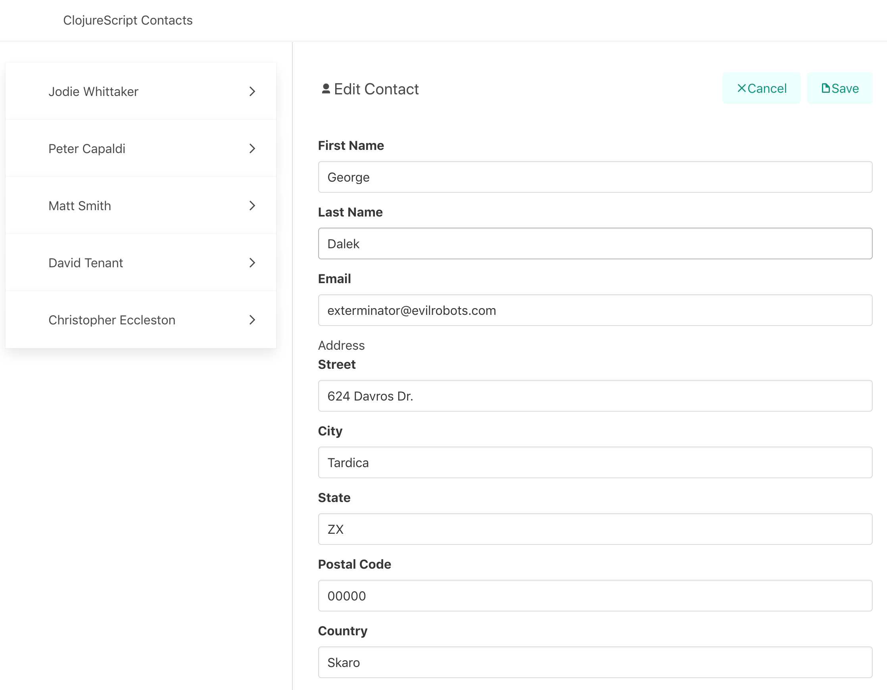

[UP](003_00.md)

### レッスン 20：キャップストーン 3 - 連絡帳

これまでの数回のレッスンでは、ClojureScriptでデータを扱うためのコアツールを学びました。まず、基本的なコレクションタイプであるリスト、ベクター、マップ、セットと、これらのコレクションを操作するための最も一般的な関数について学びました。次に、統一されたインターフェイスを使ってあらゆる種類のシーケンシャルデータを操作することができる、重要なシーケンス抽象化について詳しく見ていきます。次に、`reduce`関数と、一連のデータを集約するために使用される多くのケースについて学びました。最後に、現実世界の分析領域をモデル化するプロセスを説明しました。これらの知識を得て、次のキャップストーンプロジェクトを構築する準備ができました。今回は、[レッスン16](003_16.md)で触れた連絡帳の例を取り上げ、完全な実装であるClojureScript Contactsを構築します。

-----
このレッスンでは

- フレームワークを使わずに完全なClojureScriptアプリケーションを作る
- 単純なClojureScriptデータ構造からHTMLを構築する

-----


ClojureScriptのContactsのスクリーンショット

このキャップストーンのコード全体をそのまま表示することはありませんが、完成したプロジェクトのコードは、この本のGitHubリポジトリで見ることができます。前回と同様に、新しいFigwheelプロジェクトを作成します。

```bash
$ clj -X:new :template figwheel-main :name learn-cljs/contacts :args '["+deps"]'
$ cd contacts
$ clj -A:fig:build
```

#### データのモデリング

このレッスンでは、前の章で学んだテクニックとパターンを使って、連絡帳のデータをモデリングします。このレッスンの目的は、これまでに学んだことを実践することであり、新しい内容を多く取り入れることではありません。主にマップとベクターを使ってデータをモデル化し、新しい連絡先を作成するためのコンストラクタ関数パターンを実装します。また、データを変換する簡単な関数を使って、UIが連絡先リストを更新するために必要な操作を実装します。それでは、データモデルを見ていきましょう。

##### エンティティの構築

連絡帳は連絡先の順番に並んだリストを表しているので、その順番に並んだリストを表すデータ構造が必要になりますが、すでに見たようにベクトルがぴったりです。空の連絡先リストは、空のベクターとして定義でき、コンストラクタ関数は必要ありません。

```Clojure
(def contact-list [])
```

空のベクターでは面白くないので、そのベクターが保持する連絡先に注目してみましょう。それぞれの連絡先には、姓名、電子メールアドレス、都市名、州名、国名などの住所が必要です。これは以下のようなネストしたマップで簡単に対応することができます。

```Clojure
{:first-name "Phillip"
 :last-name "Jordan"
 :email "phil.j@hotmail.com"
 :address {:street "523 Sunny Hills Cir."
           :city "Springfield"
           :state "MI"
           :postal "11111"
           :country "USA"}}
```

新しい連絡先を作成するには、前回のレッスンで紹介したコンストラクタ・パターンのバリエーションを使用します。各フィールドを個別に渡すのではなく、連絡先を構成する0個以上のフィールドを含むことが期待されるマップを渡します。前回のレッスンで、`select-keys`関数が、マップと選択されるべきキーのコレクションを受け取り、選択されたキーだけがコピーされた新しいマップを返すことを思い出していただけると思います。この関数を使って入力をサニタイズし、連絡先に有効なキーだけが含まれるようにすることができます。

```Clojure
(defn make-contact [contact]
  (select-keys contact [:first-name :last-name :email :postal :address]))
```

アドレス自体はマップなので、アドレスの作成は別の関数にしましょう。そして、make-contact関数を更新して、このアドレスコンストラクタを使うようにします。

```Clojure
(defn make-address [address]
  (select-keys address [:street :city :state :country]))

(defn make-contact [contact]
  (let [clean-contact (select-keys contact [:first-name :last-name :email])]
    (if-let [address (:address contact)]
      (assoc clean-contact :address (make-address address))
      clean-contact)))
```

今回の`make-contact`の新バージョンでは、これまで見たことのない`if-let`という表現が導入されています。このマクロは`if`と同じように動作しますが、名前をテストされる値にバインドします（`let`のように）。`let`とは異なり、1つのバインドしか提供できません。コンパイル時には、このコードは以下のように展開されます(*1)。

```Clojure
(if (:address contact)
  (let [address (:address contact)]
    (assoc clean-contact :address (make-address address)))
  clean-contact)
```
`if-let`の変形

近々、似たようなマクロである`when-let`を使用する予定です。`if-let`のように、バインディングを提供することができ、`when`のように、バインディングされた値が非nilの場合のみ処理します。

しかし、ClojureScriptのスレッディングマクロの1つである `-> (pronounced "thread first")` を使用して、`make-contact`関数をもう少し簡潔で読みやすいものにすることができます。このマクロを使うと、深く入れ子になっている式を、より連続的に書くことができます。このマクロは、値と任意の数の関数呼び出しを受け取り、その値を各関数呼び出しの第一引数として注入します。この変換を実際に見てみると、その機能がより直感的に理解できるはずです。


[UP](003_00.md)

