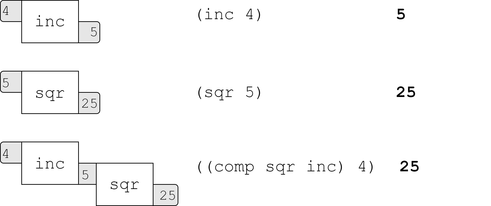
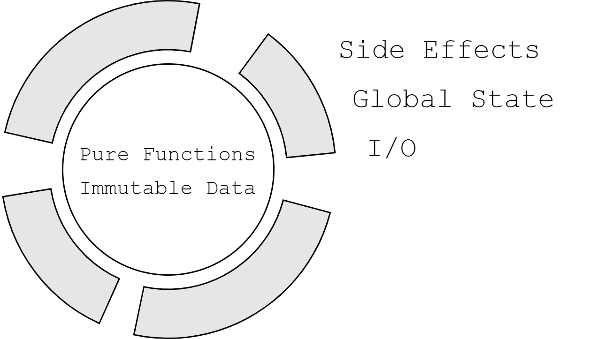
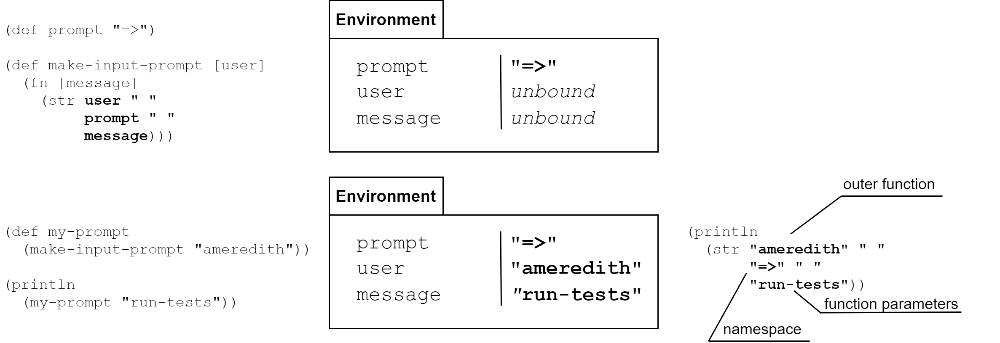
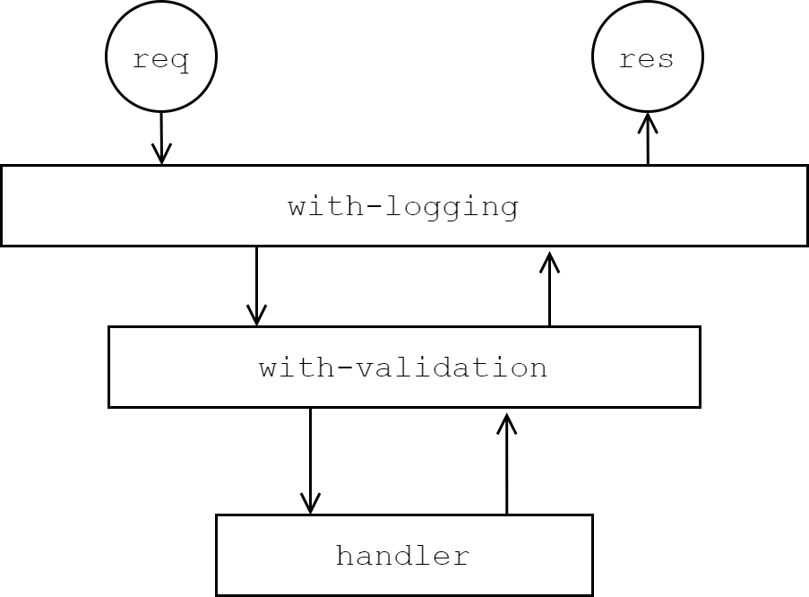

[UP](004_00.md)

### レッスン 21：関数型プログラミングの概念

ClojureScriptは、関数型プログラミングとプラグマティズムの交点に位置しています。このレッスンでは、関数型言語であることの意味を深く考えてみましょう。関数型プログラミングとは、単に関数を値として使えるようにするだけのものではありません。その核となる重要な概念は、「合成可能性」「関数的純粋性」「不変性」です。コンポーザビリティ(合成可能性)とは、再利用可能な小さな部品から、より大きなモジュールやシステムを構築することを意味します。関数的純粋性の概念は、私たちの関数がグローバルな状態を変更したり、Webページを変更したりするような副作用を持たないことを意味します。不変性とは、変数をその場で変更するのではなく、変換された新しい値を生成することです。このレッスンの終わりには、ClojureScriptで関数型コードを書くことの意味をより深く理解することができるでしょう。

-----
**このレッスンでは**

- 小さな関数を大きな関数に合成するボトムアップ設計を適用する
- 関数的な純粋性によって、プログラムの推論を容易にする
- 関数型プログラミングで不変性が果たす重要な役割を学ぶ

-----

#### 小さな部品から動作を構成する

命令型プログラミングでは、ある種のミュータブルな状態を保持し、その状態を操作する関数を書くことが多い。オブジェクト指向プログラミングが導入した重要な洞察は、可変型の状態と、その状態を操作することが許されているメソッドをオブジェクトにカプセル化することで、プログラムの推論が容易になるということです。クリーンなオブジェクト指向コードは、単一の責任を持つメソッドに集約されます。これは表面的には良いことのように聞こえるかもしれませんが、多くの場合、私たちが望むよりも制限が多くなったり少なくなったりしてしまいます。制限が多いのは、複数のオブジェクト間で同じようなロジックを共有することが、かなりの複雑さを伴わないと難しいからです。また、これらのメソッドが属するオブジェクトの状態を変化させ、そのオブジェクト上のメソッドの将来の動作を呼び出し側が予期しない方法で変化させてしまう可能性があるため、思ったよりも制限が緩くなります。

オブジェクト指向プログラミングと同様に、関数型プログラミングでも1つのことを行う関数を書くことが推奨されていますが、上述の2つの欠点はありません。その代わり、関数はオブジェクトにカプセル化されていなくても、どんなデータでも操作することができるので、重複の少ないシンプルなコードになります。さらに、純粋な関数の定義では、いかなる状態も変更せず、その動作は変更可能な状態の影響を受けないため、その動作はすべての場合において明確に定義されています。

データが一般的なデータ構造（主にマップとリスト）を使ってモデル化され、共有された変更可能な状態に依存しない場合、非常に興味深いことが起こります：一握りの関数を様々な方法で構成することができるのです。実際、標準ライブラリの関数を組み合わせること以外は、ほとんど何もせずにプログラムを作成することができます。ここで、関数型プログラミングの優れたテキストに必ず登場する言葉を紹介し、この点を強調しておきます。

> "10個の関数が10個のデータ構造を操作するよりも、100個の関数が1つのデータ構造を操作する方が良い。"
>
>    -- アラン・パーリス

パーリス氏が言いたいのは、同じ共通のデータ型や抽象度で動作する関数が100個あれば、それらを組み合わせることで100以上のことができるということです。しかし、オブジェクト指向のように、メソッドを特定のオブジェクトクラスに結びつけると、動作を合成する方法はかなり限定されてしまいます。

このセクションの最後にグループチャットアプリケーションを作るので、ユーザーの「バッジ」（ニックネームと現在のオンライン状態）を表示するコンポーネントを考えてみましょう。


ユーザー状態のバッジ

このコンポーネントは、いくつかの小さな合成可能なピースに分解することができます。まず、ユーザーのニックネームを取得する関数と、hiccupのような構造を`strong`タグで包んで太くする関数を書いてみましょう。

```Clojure
(def alan-p {:first-name "Alan"                            ;; <1>
             :last-name "Perlis"
             :online? false})

(defn nickname [entity]                                    ;; <2>
  (or (:nickname entity)
      (->> entity
           ((juxt :first-name :last-name))
           (s/join " "))))

(defn bold [child]                                         ;; <3>
  [:strong child])

(bold (nickname alan-p))
;; => [:strong "Alan Perlis"]
```

1. サンプルデータの定義
2. ユーザーのニックネームの抽出
3. DOMをボールドにする

次に、スタイリングのために特定の要素にクラスを追加したいことがわかっているので、hiccup風のタグにクラスを追加する関数を作成します。

```Clojure
(defn concat-strings [s1 s2]
  (s/trim (str s1 " " s2)))

(defn with-class [dom class-name]
  (if (map? (second dom))
    (update-in dom [1 :class] concat-strings class-name)
    (let [[tag & children] dom]
      (vec (concat [tag {:class class-name}]
                   children)))))
```

DOMを表現するためにプレーンなデータ構造を使っているので、この関数は標準ライブラリのデータ操作関数を使って書くことができます。実際、この関数はhiccup特有のものを全く参照していません。次に、ユーザーの`online?`フラグの値に基づいて、ユーザーバッジに"online"または"offline"のクラスを追加する関数を書きます。

```Clojure
(defn with-status [dom entity]
  (with-class dom
    (if (:online? entity) "online" "offline")))
```

なお、ここではユーザーの`online?`プロパティを検査していますが、将来的に追加したいチャットボットなどのエンティティにこの関数を使用することを妨げるものではありません。最後に、`user-status`コンポーネントを定義するには、先ほど作成したこれらの小さな構成要素だけで十分です。

```Clojure
(defn user-status [user]
  [:div {:class "user-status"}
    ((juxt
      (comp bold nickname)                                 ;; <1>
      (partial with-status                                 ;; <2>
               [:span {:class "status-indicator"}]))
     user)])
```

1. `comp`は、関数を合成した新しい関数を作成します。
2. `partial` は、すでにいくつかの引数が与えられている関数を作成します。

前回のレッスンで`juxt`を初めて見ましたが、この例ではさらに2つの関数があります。これらの関数はClojureScriptで非常によく使われており、小さな関数を組み合わせて大きなアプリケーションにするのに非常に便利です：`comp`と`partial`です。 `comp`は数学の関数合成に似た関数合成を行います。

$$\left(f \circ g\right)\left(x\right) = \left(f\left(g\left(x\right)\right)\right) $$
数学的な関数の合成

数学のように関数`f`と`g`を合成すると、次の例のように、ある引数`x`に適用すると`(g x)`と評価され、その結果が`f`の引数として渡される関数ができます。

```Clojure
(= ((comp f g) x)
   (f (g x)))
```
ClojureScriptにおける関数の合成

`comp`は、`->`マクロを逆に適用したものと考えることができます。ただし、関数のパイプライン全体を評価するのではなく、与えられた任意の入力に対してパイプラインを評価する新しい関数を生成します。ユーザーステータスコンポーネントの場合、`(comp bold nickname)` を使って、ユーザーを受け取り、そのユーザーのニックネームを太字で返す関数を作成します。この新しい関数は、各関数を右から左につなぐパイプラインと考えることができます。


`comp`関数パイプライン

もう一つの新しい関数は`partial`です。`partial`は関数合成とは直接関係ありませんが，一般的な関数に1つ以上のパラメータを与えることで，より具体的なバージョンを作成することができます．部分的適用の典型的な例は、加算関数です。`(add x y)`です。`partial`を使って`x`の引数を与えれば、`y`だけを受け取り、すでに与えられた`x`を加える新しい関数を作ることができます。

```Clojure
(defn add [x y]                                            ;; <1>
  (+ x y))

(def add-5 (partial add 5))                                ;; <2>

(add-5 10)
;; 15
```

1. 2つのパラメータのみを持つ独自の`add`関数を定義する
2. 部分的に適用したバージョンの作成

この例では、`partial`が、`5`とその他の与えた引数で`add`を呼び出す新しい関数を生成します。`partial`の呼び出しは、機能的には以下の定義と同等です。

```Clojure
(def add-5
  (fn [y]
    (add 5 y)))
```

簡単なデータを操作する小さな合成可能な関数からユーザーステータスコンポーネントを構築するこの些細な例は、拡張性と再利用性のあるコードベースを作成するための関数合成の力を示しています。

#### 純粋な関数を書く

便利なプログラムには副作用がつきものです。副作用のないプログラムは、DOMを変更したり、APIリクエストを行ったり、データを`localStorage`に保存したりすることができず、Webアプリケーションで一般的に行いたいことは何もできません。では、なぜ私たちは副作用のないコードを書くことを良いことのように語るのでしょうか？純粋な関数型プログラミングモデルでは、副作用は認められていませんが、すべての関数型プログラミング言語は、少なくとも何らかの副作用のための機能を提供しています。例えば、Haskellでは、純粋な関数型APIの背後で不純なIO操作を行うために、IOモナドを提供しています。しかし、ClojureScriptはさらに実用的で、必要に応じて副作用のあるコードを書くことができます。注意しないと、一般的なJavaScriptのコードと同じような落とし穴のあるコードを書いてしまう可能性があります。言語自体が副作用だらけのコードを書くのを防ぐことはできませんので、ほとんど純粋なアプリケーションを書くように意図的に自分自身を制限する必要があります。ありがたいことに、ClojureScriptはそのような制約を簡単にしてくれます。


純粋な関数型のコアを維持する

副作用は必要ですが、私たちは副作用を実行する関数と純粋な関数を分離するように努めるべきです。純粋な関数は、テストや推論がしやすくなります。例えば、レッスン15の温度変換アプリで書いたコードを見てみましょう。

```Clojure
(defn update-output [_]
  (if (= :celsius (get-input-uom))
    (do (set-output-temp (c->f (get-input-temp)))
        (gdom/setTextContent output-unit-target "F"))
    (do (set-output-temp (f->c (get-input-temp)))
        (gdom/setTextContent output-unit-target "C"))))
```

このコードは仕事をこなしますが、変換とI/Oの両方を行っているため、特にクリーンでエレガントというわけではありません。このコードをテストするためには、すべての要素が存在するページ上で実行する必要があります。また、テストするためには、手動で入力フィールドを設定し、関数を呼び出し、出力要素の内容をアサートする必要があります。代わりに、これをいくつかの純粋な関数にリファクタリングすることができます。ラベルを取得する純粋な関数、変換を実行する純粋な関数、そしてDOMを読み込んで変異させる不純な関数です。

```Clojure
(defn target-label-for-input-unit [unit]                   ;; <1>
  (case unit
    :fahrenheit "F"
    :celsius "C"))

(defn convert [unit temp]                                  ;; <2>
  (if (= :celsius unit)
    (c->f temp)
    (f->c temp)))

(defn update-output [_]                                    ;; <3>
  (let [unit (get-input-unit)
        input-temp (get-input-temp)
        output-temp (convert unit input-temp)
        output-label (target-label-for-input-unit unit)]
    (set-output-temp output-temp)
    (gdom/setTextContent output-unit-target output-label)))
```

1. 入力単位から変換後の単位ラベルを取得するためのコードを抽出
2. 温度をある単位から別の単位に変換するためのコードの抽出
3. 純粋でないコードは、UIロジックを操作するだけです。

純粋な機能コアのコードは、テストしやすいだけでなく、UIやユーザーエクスペリエンスアプリケーションに加えたい変更に対しても、より強い耐性を持っています。もしUIの動作方法を変更したい場合は、変換ロジックではなく、`update-output`関数を置き換えるだけで済みます。

##### 参照透過性

これまで説明してきた評価の純粋置換モデルに当てはまる場合、関数は参照透過的であると言われます。つまり，関数の呼び出しは，他の影響を受けることなく，常にその関数が評価される値に置き換えることができます。これは、関数がそのパラメータ以外の状態に依存せず、外部の状態を変異させないことを意味します。また、同じ入力値で関数を呼び出すと、常に同じ戻り値が得られることになります。しかし、実際のアプリケーションでは、すべての関数が参照透過的になるわけではないので、ビジネスロジックを純粋に保ち、参照透過的にする一方で、参照不透明なコードをアプリケーションの「エッジ」に移動させるという同じ戦略を適用します。多くのウェブアプリケーションでは、現在の時刻を考慮して計算を行うことがよくあります。例えば、このコードは一日のうちで時間に適した挨拶を生成します。

```Clojure
(defn get-time-of-day-greeting-impure []
  (condp >= (.getHours (Date.))
    11 "Good morning"
    15 "Good day"
    "Good evening"))
```

このコードの問題点は、同じ入力（この場合は入力なし）を与えても、呼び出された時間帯によって出力が変わることです。現在の時刻を取得することは本質的に参照透過的ではありませんが、先ほど適用したテクニックを使って、副作用のある関数を機能的に純粋なビジネスロジックのコアから分離することができます。

```Clojure
(defn get-current-hour []                                  ;; <1>
  (.getHours (js/Date.)))

(defn get-time-of-day-greeting [hour]                      ;; <2>
  (condp >= hour
    11 "Good morning"
    15 "Good day"
    "Good evening"))

(get-time-of-day-greeting (get-current-hour))
;; "Good day"
```

1. 参照透過的ではない機能を除外する
2. ビジネスロジックの出力が形式的なパラメータにのみ依存するようにする。

これはかなり些細な例ですが、時刻、APIコールの結果、`(Math.random)`乱数ジェネレータなど、明示的なパラメータ以外の外部の状態に依存するコードは、関数型パラダイムを崩し、要件の変化に応じたテストや進化が困難になります。

#### 不変のデータ

私たちは、DOMを変異させるコードを、関数型コアの周りの不純なラッパーにリファクタリングするプロセスを見てきました。しかし、関数型コードを書きたいのであれば、避けなければならない別の種類の副作用があります：データの変異です。JavaScriptでは、2つの組み込みコレクションデータ構造であるオブジェクトと配列は、ミュータブルであり、つまりその場で変更することができます。JavaScript のオブジェクト指向機能はすべて、ミュータブルに依存しています。例えば、以下のようにオブジェクトを直接操作するコードはよく見られます。

```JavaScript
const blog = {
  title: 'Object-Oriented JavaScript',
  tags: ['JavaScript', 'OOP'],
  rating: 4
};

blog.tags.push('mutability');
blog.rating++;
blog.title += ' considered harmful';
blog.isChanged = true;
```

ClojureScriptでは、オブジェクトを修正するのではなく、修正を加えたオリジナルオブジェクトのコピーを作成します。効率が悪いように聞こえますが、ClojureScriptではデータ構造を使用しており、類似したオブジェクトが同じメモリ位置で構造の大部分を共有できるように構成されています。これから説明するように、このような不変的なデータ構造は、実際に高度に最適化されたユーザーインターフェースを可能にし、アプリケーションを高速化することもできます。不変のデータ構造を扱うには、考え方を変える必要がありますが、以下に示すように、変更可能なデータを扱うのと同じくらい簡単です。

```Clojure
(def blog {:title "Functional ClojureScript"
           :tags ["ClojureScript" "FP"]
           :rating 4})

(def new-blog
  (-> blog                                                 ;; <1>
      (update-in [:tags] conj "immutability")
      (update-in [:rating] inc)
      (update-in [:title] #(str % " for fun and profit"))
      (assoc :new? true)))

new-blog                                                   ;; <2>
; {:title "Functional ClojureScript for fun and profit",
; :tags ["ClojureScript" "FP" "immutability"], :rating 5, :new? true}
blog
; {:title "Functional ClojureScript", :tags ["ClojureScript" "FP"], :rating 4}
```

1. `->`マクロを使って一連の変換を行う
2. 元の`blog`マップと変換後の`new-blog`マップの両方を検査する。

この例では、オリジナルの`blog`変数がそのままになっていることがわかります。一連の変更を`blog`マップに重ね、変更されたマップを`new-blog`として保存します。ここでの重要なポイントは、`update-in` や `assoc` の関数は `blog` に手を加えていないということです。不変データは関数型プログラミングの鍵であり、プログラムが反復可能で決定論的であることを保証してくれます（少なくとも、必要な部分は）。データの受け渡しの際にデータを変更できるようにすると、複雑さが急上昇します。変異可能なデータを許可すると、一つの計算をデバッグするために、膨大な数の変数を頭の中で管理しなければならなくなります。

> 注
>
> 筆者はかつて、非常に大規模なJavaScriptアプリケーションを担当するチームで働いていました。そのチームは、予期せぬ突然変異が非常に多くの不具合の原因となっていることに気づき、変更可能なデータに起因するバグの発見と修正に費やした時間をすべて記録し始めました。そのチームは、集計結果がホワイトボードに収まらなくなったため、Immutable.jsライブラリに切り替えました。


#### 関数型デザインパターン

デザインパターンは、この10年ほどの間に何かと悪い評判を受けてきましたが、多くの場合、その批判は当然のものとなっています。Gang of Four(*1)と呼ばれるデザインパターンの多くは、当時のオブジェクト指向言語の柔軟性の欠如に対する回避策として発見されました。実際、LispとAIのコミュニティの中心人物であるPeter Norvig氏は、『Gang of Four』で紹介されている23のデザインパターンのうち16のデザインパターンは、Lispでは不要なものか、言語の自然な使い方によって生じるものであるとしている(*2)。それでも、デザインパターンの目的は、ソフトウェア開発でよく起こる問題を記述するための共通の語彙を作り、よく使われる解決策のテンプレートを提示することにあります。ClojureScriptのような動的な関数型言語であっても、頻繁に発生する問題や解決策を定義することにはメリットがあります。そこで、このセクションでは、コンストラクタ、クロージャ、ストラテジー、ミドルウェアの4つのパターンについて説明します。

##### コンストラクタ

[レッスン19](003_19.md)で取り上げ、[レッスン20](003_20.md)で再確認したので、おなじみのパターンでしょう。ここでは、あるデータ構造の作成を関数の後ろで抽象化することで、そのデータ構造に名前を付け、将来的に構造を変更するのを容易にすることを目的としています。このパターンはすでに数回のレッスンで使用しているので、ここで詳しく説明する必要はありません。

##### クロージャー(closure)

JavaScriptと同様、ClojureScriptにもレキシカルクロージャという概念があります。つまり、関数は、その関数が定義されたスコープ内で可視化されていたあらゆる変数を参照することができます。これにより、関数の中に（不変の）状態を保持することができます。これにより、DOM 要素を名前空間のトップレベルで定義し、同じ名前空間で定義された関数内でそれを参照するといったことが可能になります。

```Clojure
(def user-notes (gdom/getElement "notes"))

(defn get-notes []
  (.-value user-notes))
```

これは、クロージャーのごく些細な使い方です。クロージャの真価が発揮されるのは、高階の関数と組み合わせて使うときです。この章の最初に、単純に2つの数字を足す`add`関数を定義したことを思い出してください。その後、部分適用を使って、常に引数に`5`を加える関数を生成しました。しかし、数を受け取って、その数を常に引数に加える加算関数を返す`make-adder`関数を定義すれば、もっと柔軟に対応できるでしょう。クロージャのおかげで、これができるのです。

```Clojure
(defn make-adder [x]
  (fn [y]
    (add x y)))

((make-adder 1) 5)  ;; 6
((make-adder 2) 5)  ;; 7
((make-adder 10) 5) ;; 15
```

`make-adder`から返す関数は、親関数に渡されたすべての引数を名前で参照できることに注意してください。クロージャでは、[レッスン4](000_04.md)で導入し、[レッスン12](002_12.md)で拡張した評価のメンタルモデルに手を加える必要があります。というのも、関数呼び出しを関数の定義に置き換え、形式的なパラメータをすべて実際のパラメータに置き換えればよいとはもはや考えられないからです。これを`make-adder`のケースで行うと、次のようになってしまいます。

```Clojure
((make-adder 1) 10)

((fn [y]
  (add x y)) 10)
```

これは、`make-adder`に渡した`1`の知識を「失う」ことになり、どの値にも束縛されていないシンボル`x`が残ってしまうため、大きな問題となります。環境という概念を導入して，関数が定義された場所で表示されていた変数へのシンボルのマッピングを行い，評価のモデルを更新して，関数を評価するときには，関数定義内のすべてのシンボルを同名のフォーマルパラメータに置き換えるか，一致するフォーマルパラメータが見つからない場合には環境内の対応する名前の値に置き換えることにしましょう．



この単純な原理を利用して、OOPの世界のオブジェクトを模したクロージャを使うことができます。オブジェクトの初期状態を受け取るコンストラクタがあり、この状態を更新して新しいオブジェクトを返したり、状態を問い合わせて何らかの値を返したりする関数のマップを返すとします。

```Clojure
(defn make-mailbox
 ([] (make-mailbox {:messages []                           ;; <1>
                    :next-id 1}))
 ([state]
  {:deliver!                                               ;; <2>
   (fn [msg]
     (make-mailbox
       (-> state
          (update :messages conj
            (assoc msg :read? false
                       :id (:next-id state)))
          (update :next-id inc))))

   :next-unread                                            ;; <3>
   (fn []
     (when-let [msg (->> (:messages state)
                         (filter (comp not :read?))
                         (first))]
       (dissoc msg :read?)))

   :read!
   (fn [id]
     (make-mailbox
       (update state :messages
         (fn [messages]
           (map #(if (= id (:id %)) (assoc % :read? true) %)
                 messages)))))}))

(defn call [obj method & args]
  (apply (get obj method) args))                           ;; <4>

(defn test-mailbox []
  (loop [mbox (-> (make-mailbox)
                  (call :deliver! {:subject "Objects are Cool"})
                  (call :deliver! {:subject "Closures Rule"}))]
    (when-let [next-message (call mbox :next-unread)]
      (println "Got message" next-message)
      (recur
        (call mbox :read! (:id next-message)))))
  (println "Read all messages!"))
;; Got message {:subject "Objects are Cool", :id 1}
;; Got message {:subject "Closures Rule", :id 2}
;; Read all messages!
```
純粋な関数型のオブジェクト

1. 引数なしのコンストラクタを用意すると便利
2. 規約により、`!`で終わるメソッドは、オブジェクトの状態を更新し、新しいオブジェクトを返します。
3. `!`で終わらないメソッドは、オブジェクトを更新せず、代わりに値を返します。
4. `apply`は、引数のコレクションを持つ関数を呼び出します。

**やってみよう**

- メールボックス "object"にさらにいくつかのメソッドを追加してみましょう。
  - `:all-messages` - メールボックス内のすべてのメッセージを返します。
  - `:unread-messages` - メールボックス内のすべての未読メッセージを返します。
  - `:mark-all-read!` - すべてのメッセージを既読にすることで状態を変更します。

##### 戦略

オブジェクト指向プログラミングのように、Strategyパターンは、アルゴリズムの実装を上位のコードから分離する方法です。このパターンは、関数型言語では非常に自然なもので、パターンと呼ぶにはほど遠いものです。標準ライブラリの `filter` を例にとってみましょう。この関数はシーケンスをフィルタリングしますが、各要素が含まれているかどうかをテストするための基準は指定していません。その基準は`filter`に渡された関数によって決定され、新しいシーケンスにどの要素を含めるべきかを決定する具体的な戦略を指定しています。

```Clojure
(let [xs [0 1 2 3 4 5 6 7 8 9]]
  (println (filter even? xs))
  (println (filter odd? xs)))
;; (0 2 4 6 8)
;; (1 3 5 7 9)
```

##### ミドルウェア

最後にご紹介するのは、ミドルウェア・パターンです。このパターンでは、リクエストとレスポンスのサイクルの中に「フック」を宣言することができます。このフックは、リクエストを途中で変換したり、レスポンスを途中で変換したり、あるいは両方を変換することができます。また、フックを使うことで、リクエストを短縮することもできます。

例えば、あるAPIを呼び出す必要があるが、リクエストを送信する前に検証できるようにしたいとします。検証ロジックをAPIリクエストを実行する関数に直接追加することもできますが、これは2つの理由から理想的ではありません。1つ目は、検証ロジックをAPIロジックに結合してしまうこと、2つ目は、純粋なビジネスロジックと不純なビジネスロジックの両方を同じ関数に結合することで、アプリのテスト性が低下することです。問題ありません。分離した検証関数を追加しましょう。

```Clojure
(defn handler [req]
  (println "Calling API with" req)
  {:data "is fake"})

(defn validate-request [req]
  (cond
    (nil? (:id req)) {:error "id must be present"}
    (nil? (:count req)) {:error "count must be present"}
    (< (:count req) 1) {:error "count must be positive"}))

;; Client code
(if-let [validation-error (validate-request req)]
  validation-error
  (handler req))
```

しばらくはこれでうまくいっていましたが、今度は各リクエストとそのレスポンスのログを追加する必要があります。以下のように、クライアントコードにロジックを追加することができます。

```Clojure
(do
  (println "Request" req)
  (let [res (if-let [validation-error (validate-request req)]
              validation-error
              (handler req))]
    (println "Response" res)
    res))
```

リクエスト/レスポンスに追加したい2つのフックがあっても、コードは扱いづらくなってきています。ミドルウェアパターンでは、それぞれのフックをハンドラ関数を「ラップ」する関数に抽出することができます。ミドルウェアとは、ハンドラーを受け取り、新しいハンドラーを返す関数のことです。ハンドラを一般的に`Request -> Response`の関数と考えると、ミドルウェアは`(Request -> Response) -> (Request -> Response)`の関数となります。ミドルウェアの良いところは、入力と出力の型が同じなので、通常の関数合成を使ってどのような順序でも組み合わせが可能なことです。


ミドルウェアパターン

上のラップされたAPIハンドラーの例に戻ると、検証とロギングをミドルウェアとして記述すると、以下のようになります。

```Clojure
(defn with-validation [handler]
  (fn [req]
    (if-let [error (validate-request req)]
      error
      (handler req))))

(defn with-logging [handler]
  (fn [req]
    (println "Request" req)
    (let [res (handler req)]
      (println "Response" res)
      res)))

(let [wrap-handler (comp with-logging with-validation)
      handler (wrap-handler handler)]
  ; Example invalid request
  (handler {})
  ;; Request {}
  ;; Response {:error id must be present}

  ; Example valid request
  (handler {:id 123, :count 12})
  ;; Request {:id 123, :count 12}
  ;; Calling API with {:id 123, :count 12}
  ;; Response {:response is fake}
  )
```

**クイックレビュー**

- なぜ通常の関数合成でミドルウェアを構成できるのですか？
- ミドルウェアを構成する順序は重要ですか？`wrap-handler`を`(comp with-validation with-logging)`と定義したらどうなったでしょうか？

#### まとめ

このレッスンでは、関数型プログラミングの3つの基本を簡単に見ました。副作用の最小化と分離、不変データの使用、ビジネスロジックの参照透過性の維持です。これらの考え方をすると、私たちは当然、データを受け取り、いくつかの変換を経て、その結果がプログラムの出力となるようなプログラムを書きます。実際には、ほとんどのプログラムは、DOMと相互作用する不純なコードで接着された多くの純粋なデータ・パイプラインで構成されていますが、このレッスンで学んだ関数型プログラミングの概念に従えば、主にデータ変換に関係するビジネス・ロジックのクリーンで機能的なコアを持つことができます。これからの数回のレッスンでは、関数型プログラミングを効果的に実践するための、より多くの言語機能やテクニックを学んでいきます。

-----
1. デザインパターン。Erich Gamma, John Vlissides, Richard Helm, Ralph Johnson著「Design Patterns: Elements of Reusable Object-Oriented Software」。
2. [動的言語におけるデザインパターン](http://www.norvig.com/design-patterns/)

[NEXT](004_22.md)

[UP](004_00.md)

