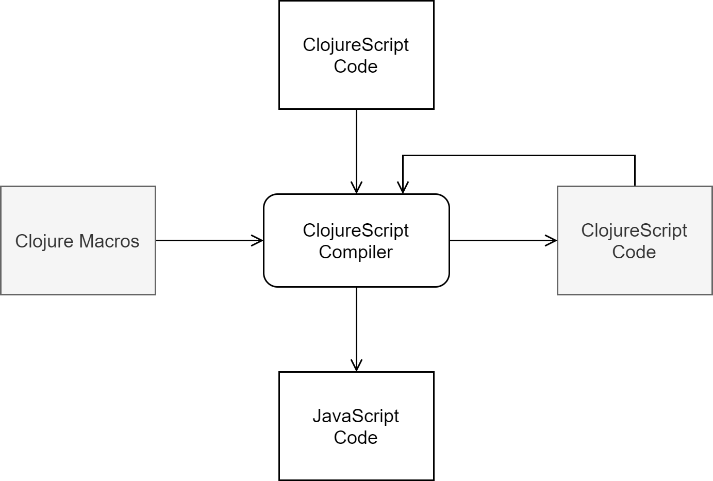

[UP](004_00.md)

### レッスン 23：名前空間とプログラム構造

ClojureScriptでは、モジュール化の単位は名前空間です。名前空間とは、他の名前空間が要求したり使用したりできる関数やデータを論理的にまとめたものです。外部ライブラリは、コードで要求できる名前空間としてモジュールを公開しており、コードを複数のモジュールに分割することもできます（そしてそうすべきです）。このレッスンでは、モジュールを宣言したり要求したりする方法や、モジュールを使ってプログラムにきれいなアーキテクチャの境界を作る方法を学びます。

-----
**このレッスンでは**

- 関数やデータを名前空間で整理する
- 論理的で直感的なプロジェクト構造を構築する
- REPLでの名前空間の使用
-----

#### 名前空間の宣言

これまでに書いた各ClojureScriptファイルでは、clj-newが親切にもファイルの先頭に名前空間宣言を生成してくれました。サードパーティのライブラリを取り込むために`(:require ...)`形式を使用してきましたが、ここで何が起こっているのかを正確に理解することは賢明にも避けてきました。しかし、これからは違います。

このレッスンでは、名前空間を探求するために、新しいFigwheelプロジェクトを作成します。

```bash
$ clj -X:new :template figwheel-main :name learn-cljs/import-fns :args '["+deps"]'
$ cd import-fns

```

`src/learn_cljs/import_fns.cljs`で生成されたファイルを見てみると、ファイルの先頭に以下のような宣言があります。

```Clojure
(ns learn-cljs.import-fns
  (:require
   [goog.dom :as gdom]))
```

ClojureScriptコンパイラは、この宣言をGoogle Closure Compilerのモジュール宣言に変換し、最終的にこの名前空間で定義したすべての関数と変数を含むJavaScriptオブジェクトにコンパイルされます。この素朴な宣言から、いくつかのことがわかります。

1. 名前空間の名前を `learn-cljs.import-fns` と宣言します。この名前は、[レッスン5](001_05.md)で説明した命名規則に従わなければなりません。
2. 他の名前空間からこの名前空間にコードを要求するために使用できるスケルトン`(:require ...)`形式があります。

##### Requireの使用

名前の宣言は簡単なので、2番目の項目である他の名前空間からのコードの要求に注目します。他のファイル（サードパーティのライブラリを含む）からコードを要求して、自分のコード(*1)で利用できるようにするには、`ns`宣言の中の`:require`フォームが圧倒的に一般的です。それでは、先ほど作成したプロジェクトを使って、`:require`の様々な形式を見ていきましょう。ここでは、テキストベースのアドベンチャーゲームを例にして、プレイヤーのインベントリを表示してみます。

```Clojure
(ns learn-cljs.import-fns
    (:require learn-cljs.import-fns.ui                     ;; <1>
              [learn-cljs.import-fns.format                ;; <2>
               :refer [pluralize]]
              [learn-cljs.import-fns.inventory             ;; <3>
               :as inventory]
              [goog.dom :refer [getElement]                ;; <4>
                        :rename {getElement get-element}]))

(defn item-description [i item]
  (let [qty (inventory/item-qty i item)
        label (if (> qty 1) (pluralize item) item)]
      (str qty " " label)))

(let [i (-> (inventory/make-inventory)
            (inventory/add-items "Laser Catapult" 1)
            (inventory/add-items "Antimatter Scrubber" 5))]
  (learn-cljs.import-fns.ui/render-list (get-element "app")
    (map (partial item-description i)
         (inventory/list-items i))))
```

1. `learn-cljs.import-fns.ui` 名前空間全体を要求する。
2. `learn-cljs.import-fns.format` 名前空間からの 1 つの関数を要求する。
3. `learn-cljs.import-fns.inventory` 名前空間を `inventory` というエイリアスで要求します。
4. Google Closure Library名前空間から1つの関数を要求し、その関数の名前を変更する。

このスニペットは、コードを名前空間に要求する一般的な方法のすべてを示しています。`:require`キーワードの後には、任意の数のlibspecを含めることができます。libspec は、完全修飾された名前空間か、名前空間といくつかのオプションの修飾子を含むベクターのいずれかです。この構文は、`ns`特殊形式によって解釈され、libspecの正確な形式に従って、他の名前空間からvarを取り込むことができます。

**形式1：単純な名前空間**

第一の形式では、必要とする名前空間の名前を単純に使います: `learn-cljs.import-fns.ui`. そして、この名前空間内のパブリックな var を参照するには、完全な名前空間の後に `/` と var の名前を使用します (例: `learn-cljs.import-fns.ui/render-list`)。

**形式2：参照(refer)**

2つ目のケースでは、名前空間を `:refer [pluralize]` でフォローします。 `:refer` は、後続のベクターにリストアップされているすべての var を、プレフィックスなしで利用できるようにします。したがって、`(learn-cljs.import-fns.format/pluralize item)`ではなく、`(pluralize item)`と書くことができます。`learn-cljs.import-fns.format`名前空間の関数は、完全修飾構文を使っても呼び出すことができます。

**形式3：名前空間のエイリアス化**

第3のケースでは、必要な名前空間を `:as` を使ってエイリアス化します。これは、名前空間内の任意の public var を参照できるという点で、最初のケースと同様に機能します。しかし、完全な名前空間の代わりに `:as` の後に指定したシンボルを使用することができます。したがって、`learn-cljs.import-fns.inventory/make-inventory` は `inventory/make-inventory` となります。`:as`の使用は、非常に冗長な名前を持つ名前空間からRequireする場合に非常に便利です。一般的には、 `:refer` よりも `:as` を使う方が良いでしょう。なぜなら、名前空間の宣言を見直さなくても、参照する var がどこから来たのかを明確にすることができるからです。

**形式4：エイリアス化したVar**

最後に、4つ目のケースとして、参照した特定のvarの名前を変更します。ここでは、Google Closure Libraryの`goog.dom`モジュールの`getElement`関数を、より慣用的な`kebab-case`の名前にするためにエイリアス化しています。実際には、名前の衝突を防ぐためにリネームがよく使われます。例えば、`mark-inactive`という名前の関数を、`my-app.users`と`my-app.customers`の両方の名前空間からインポートしたい場合があります。この場合、`:rename`を使って、`mark-user-inactive`と`mark-customer-inactive`としてインポートすることができます。

|requireの形式|説明|関数の使い方|
|:------------|:----|:----------|
|`my.namespace`|名前空間全体をrequire|`my.namespace/compute`|
|`my.namespace :refer [compute other-fn]`|特定の関数をrequireし、それらをそのまま参照する|`compute`|
|`my.namespace :as mine`|エイリアスで名前空間をrequire|`mine/compute`|
|`my.namespace :refer [compute] :rename {compute calculate}`|特定のvarをエイリアス化してrequire|`calculate`|
requireの形式

> 注意
>
> 名前空間で同じ名前のvarを定義したい場合に、ClojureScript標準ライブラリからvarの名前を変更する(または完全に除外する)ことができる`:refer-clojure`という形式があります。`(:refer-clojure :rename {str string})`は、`str`関数を`string`としてエイリアス化し、警告を発生させずにstrの名前を自由に再利用できるようにします。同様に、`(:refer-clojure :exclude [str])`とすることで、`str`関数を完全に除外することができます。とはいえ、通常は、標準ライブラリの何かと衝突しないような説明的な名前を付けるべきです。

##### Googleクロージャーライブラリクラスのインポート

Google Closure Libraryからクラスのコンストラクタをインポートする場合、`:require`に加えて注意しなければならないのが`:import`です。この形式は、libspec の `:refer` キーワードで他の名前空間から var を取り込むのと同じように、Google Closure モジュールのクラスコンストラクタを私たちの名前空間に取り込むためだけに存在します。`:require`と同様に、`:import`もいくつかのimport仕様が続くことを期待しています。最も一般的な形式は、クラスをインポートするための名前空間と、その名前空間からインポートするための未修飾のコンストラクタ名が続くベクトルです。

```Clojure
(ns my-ns
  (:import [goog.math Coordinate Rect]))

(.contains (Rect. 10 50 5 5)
           (Coordinate. 12 50))
```

`:import`について覚えておくべきことは、Google Closureモジュールからクラス（enumを含む）を要求する場合にのみ使用され、ClojureScriptの名前空間やGoogle Closureモジュールの（非コンストラクタの）関数を含める場合には決して使用されないということです。

##### マクロのrequire

ClojureScriptの最も強力な機能の1つは、マクロのサポートです。しかし、マクロの実装方法には、マクロを必要とする方法にちょっとした癖があります。マクロは、その呼び出しサイトの「内部」にあるClojureScriptコードに生データ（リスト、ベクトル、シンボルなど）としてアクセスでき、実際にJavaScriptにコンパイルされるコードを返す前に、データ構造としてこのコードを操作することができます。厄介なことに、ClojureScriptコンパイラはClojureで書かれているので、マクロ自体はClojureScriptコードを生成するClojureコードです。マクロについては後のレッスンで詳しく学びますが、今のところ覚えておくべき重要なことは、マクロがClojureコードであるため、別の方法でそれを要求する必要があるということです。その方法とは、`:require-macros`形式です。

```Clojure
(:require-macros [macro-ns :as macros])
```

このフォームは、ClojureScriptの名前空間からの変数ではなく、Clojureの名前空間からのマクロのインポートで動作することを除いて、`:require`とよく似た機能を持ちます。


マクロのコンパイル

#### 関連機能のグループ化

さて、名前空間を宣言し、使用したい他のコードを必要とする仕組みについて説明しましたが、一歩下がって、名前空間をどのように整理するかを見てみましょう。ClojureScriptの特徴の1つに、解放感と苛立ちがありますが、それは名前空間の構造について意見を持たないことです。名前空間には、必要なものを必要なだけ入れることができ、循環的な依存関係を作らない限り、すべてがうまくいきます。ここでは、オブジェクト指向プログラミングから得られたいくつかの知見が役立ちます。それは、高凝集性と低結合性です。

凝集性が高いとは、2つのコードが目的において密接に関連している場合、プログラムのアーキテクチャにおいても密接に関連しているべきだということです。低結合とは、同じコインの裏表のようなもので、2つのコードが無関係であれば、プログラムのアーキテクチャの中でお互いに離れているべきだということです。OOPの実践者とは異なり、私たちはこの原則をデータにも適用します。データを隠すことは関数型プログラミングの目的ではないので、関数とその操作対象であるデータを同じ名前空間にまとめ、両者を自由に公開する傾向があります。

例として、アドベンチャーゲームのインベントリのコードに戻ってみましょう。`import-fns.core`名前空間では、`learn-cljs.import-fns.inventory`と`import-fns.ui`名前空間を必要とし、`learn-cljs.import-fns.format`からは`pluralize`を必要としています。これらのファイルには、この小さなアプリのビジネスロジックとプレゼンテーションロジックが含まれています。最初に、`learn-cljs.import-fns.inventory`を見てみましょう。

```Clojure
(ns learn-cljs.import-fns.inventory)                       ;; <1>

(defn make-inventory []                                    ;; <2>
  {:items {}})

(defn- add-quantity [inventory-item qty]                   ;; <3>
  (update-in inventory-item [:qty]
    (fn [current-qty] (+ current-qty qty))))

(defn add-items
 ([inventory item] (add-items inventory item 1))
 ([inventory item qty]
  (update-in inventory [:items item]
    (fnil add-quantity
      {:item item :qty 0}
      qty))))

(defn list-items [inventory]
  (keys (:items inventory)))

(defn item-qty [inventory item]
  (get-in inventory [:items item :qty] 0))
```
learn_cljs/import_fns/inventory.cljs

1. このファイル内のすべての関数は、`import-fns.inventory`名前空間の一部となります。
2. `make-inventory`という名前のパブリック関数を宣言します。
3. `defn-`を使用してプライベート関数を宣言します。

名前が示すように、この名前空間にはインベントリの作成と管理に関するすべてのコードが含まれます。書式設定や表示ロジックはありません。新しいインベントリを作成する`make-inventory`、ある量の特定のアイテムを追加する`add-items`、インベントリ内の個別のアイテムを取得する`list-items`、特定のアイテムの数量を取得する`item-qty`を公開しています。`add-quantity`関数は、`add-items`の実装の詳細としてのみ存在し、このコンテキスト以外ではほとんど価値がないため、`defn-`で宣言してプライベートにしています。次に、`learn-cljs.import-fns.format`名前空間を見てみましょう。

```Clojure
(ns learn-cljs.import-fns.format
  (:require [clojure.string :as s]))

(defn ends-with-any? [word suffixes]
  (some (fn [suffix]
          (s/ends-with? word suffix))
        suffixes)))

(defn replace-suffix [word old-suffix new-suffix]
  (let [prefix-len (- (count word)
                      (count old-suffix))
        prefix (.substring word 0 prefix-len)]
    (str prefix new-suffix)))

(defn pluralize [word]
  (cond
    (ends-with-any? word ["s" "sh" "ch" "x" "z"])
    (str word "es")

    (s/ends-with? word "f")
    (replace-suffix word "f" "ves")

    (s/ends-with? word "fe")
    (replace-suffix word "fe" "ves")

    (re-find #"[^aeiou]y$" word)
    (replace-suffix word "y" "ies")

    :else (str word "s")))
```
learn_cljs/import_fns/format.cljs

この名前空間には、アプリに必要なすべての文字列フォーマット関数が含まれています。メインの名前空間では`pluralize`のみをrequireしていますが、すべての関数は再利用可能なロジックを含んでいるため、すべての関数を公開しています。さらに、すべての関数を公開することで、すべての関数を分離してテストすることが可能になります。これらの関数はすべて、どんな文字列でも動作する一般的な関数であることに注意してください。もし、インベントリに特化したコードがあれば、それを`inventory`名前空間に置くでしょう。では、インベントリに特化したフォーマット関数のセットがある場合はどうすればよいのでしょうか。一般的な方法としては、`learn-cljs.import-fns.format-inventory`のような名前の新しい名前空間を作り、この名前空間が特殊な作業を行うために、`format`と`inventory`の両方の名前空間から関数やデータをrequireすることができます。コードのアーキテクチャをクラス階層に押し込む必要がなければ、非常に大きな柔軟性を得ることができます。最後に、完璧を期すために、`learn-cljs.import-fns.ui`名前空間を見てみましょう。

```Clojure
(ns learn-cljs.import-fns.ui
  (:require [goog.dom :as gdom]))

(defn append-list-item [list text]
  (gdom/appendChild list
    (let [li (gdom/createElement "li")]
      (gdom/setTextContent li text)
      li)))

(defn render-list [elem items]
  (let [ul (gdom/createElement "ul")]
    (doseq [item items]
      (append-list-item ul item))
    (gdom/removeChildren elem)
    (gdom/appendChild elem ul)))
```
learn_cljs/import_fns/ui.cljs

この名前空間については、APIがインベントリではなく、テキストのレンダリングを中心に形成されていることを除けば、特筆すべき点はあまりありません。インベントリとレンダリングを結びつける「グルーコード」は、すべてコア名前空間にあります。

##### 隠れた "OOP "の回避

多くの新しいClojureScript開発者は、プライベート変数を含むことができるアトムと名前空間を使えば、ステートフルなオブジェクトを簡単にエミュレートできることに気づくでしょう。アトムの中でオブジェクトの状態を保持するためにプライベート変数を定義し、APIを定義するためにパブリック関数を使用し、実装の詳細としてプライベート関数を使用することができる、これは事実です。しかし、隠された状態を導入するとすぐに、テスト可能性と合理性の両方の観点から、機能的な純粋性と参照透明性の利点を失うことになります。

#### 名前空間とREPL

先に進む前に、REPLから名前空間を操作する方法を簡単に見てみましょう。名前空間宣言で`:require`や`:import`を使用すると、`ns`の特別なフォームでは、これらのディレクティブを使用して、名前空間内でどのコードを利用可能にするかを決定します。これらのディレクティブのアナログとして動作するマクロ（`require`と`import`）があり、REPLから実行してコードをREPLセッションに公開することができます。

```Clojure
dev:cljs.user=> (require '[learn-cljs.import-fns.format :as fmt] :reload)
nil
dev:cljs.user=> (fmt/pluralize "burrito")
"burritos"
```

主な違いは、`require`に渡すベクターを引用しなければならないことです。そうしないと、REPLは`import-fns.format`と`fmt`のシンボルを現在の名前空間に束縛されている変数に解決しようとします。ベクターを引用すると（`[]`の代わりに`'[]`を使うなど）、ClojureScriptは、その中の各シンボルを解決しようとせず、リテラルシンボルとして解釈します。さらに、require仕様の後に`:reload`キーワードを追加することで、最後にrequireした後にファイルに加えられた変更を拾うために、REPLに名前空間を再評価させることができるという違いもあります。

デフォルトでは、REPLを起動すると、`cljs.user`という名前空間の中で動作します。私たちが`def`(または`defn`)したものは、REPLセッションの間、この名前空間の中で定義されます。別の名前空間で動作させたい場合は、`in-ns`という特殊な形式を使って、REPLに別の名前空間で動作するように指示することができます。

```Clojure
dev:cljs.user=> (in-ns 'import-fns.format)

dev:import-fns.format=> (replace-suffix "programmer" "er" "ing")
"programming"
```

REPL駆動の開発では、`in-ns`を使用することでワークフローを簡素化することができます。REPLで名前空間のコードを書き始め、動作に満足したらすべての定義をファイルにコピーすることができます。

#### まとめ

このレッスンでは、名前空間とは何か、また、`:require`と`:import`を使って、名前空間とその依存関係を宣言する方法を学びました。また、高凝集性と低結合性の原則を用いて、コードを名前空間に整理する方法を学びました。最後に、コードを効果的にナビゲートしたりテストしたりするために、REPLから名前空間を操作する方法を見てみました。

-----
1. また、`(:use [namespace :only [var1 var2]])`という形式もあり、これは`(:require [namespace :refer [var1 var2]])`と同じように動作します。Clojureでは、`(:require)`の中で`:refer`が使えるようになる前はよく使われていましたが、今ではすっかり使われなくなってしまいました。


[UP](004_00.md)

