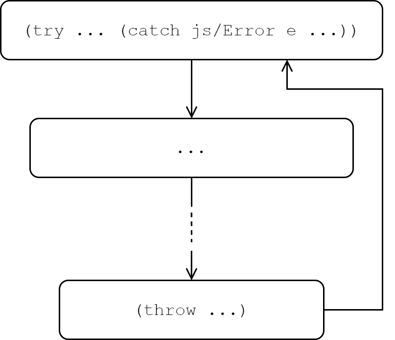
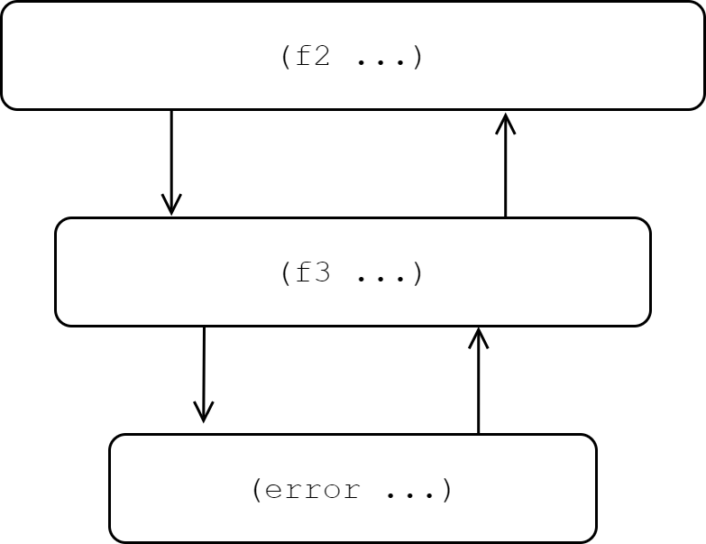
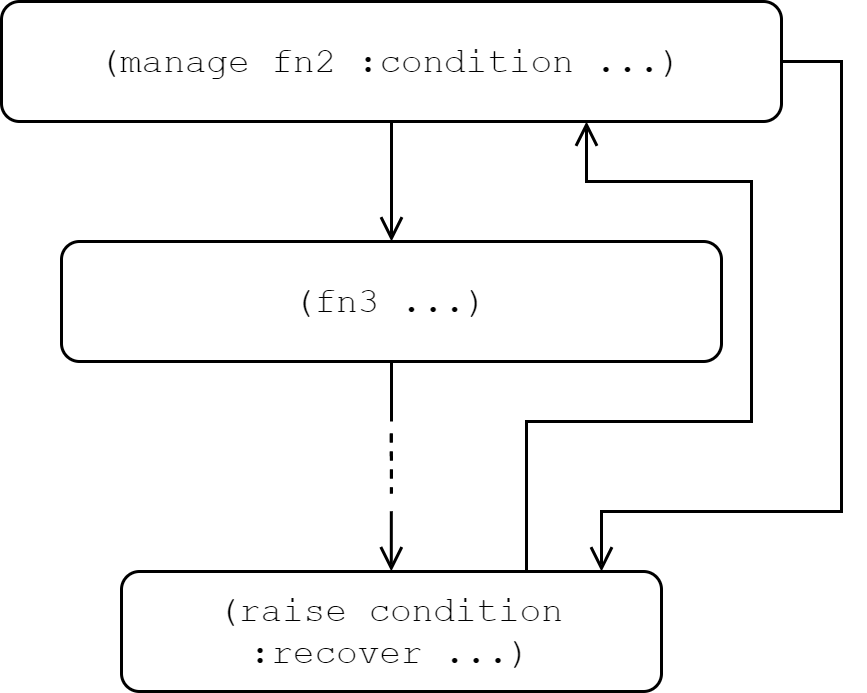

[UP](004_00.md)

### レッスン 24：例外とエラーの処理

私たちは、プログラミングを、私たちが宣言的にプログラムを書き、コンピュータがそれを純粋な計算モデルに変換して、宇宙が熱死するまで追い続けることができる理想的な学問だと考えたいと思います。しかし実際には、悪いことが起こり、それは宇宙の熱死よりもずっと早く起こるでしょう。ネットワークが故障したり、ゼロで割り切れなかったり、入力が「間違った」形で生成されるようなコーナーケースを見逃したり。これらはすべて例外的な状態であり、発生した場合には意識してなんとか対処する必要があります。ようこそ、例外の世界へ

-----
**このレッスンでは**

- try/catchで例外的な状況を処理する
- エラーにメタデータを追加する
- 例外を値として扱う
- より柔軟なエラー処理のための条件の使用
-----

#### try/catchによる例外処理

ClojureScriptでの例外処理は、JavaScriptでの例外処理との違いよりも似ています。ClojureScriptは、JavaScriptの`try/catch`構文にコンパイルされる`try`と呼ばれる特殊な形式を提供します。基本的な使い方は、JavaScriptのプログラマなら誰でも知っているはずです。

```Clojure
(try
  (do-stuff 42)
  (call-api {:id 17})                                      ;; <1>
  true                                                     ;; <2>
  (catch js/Error e                                        ;; <3>
    (println "An error occurred:" e)
    false)
  (finally
    (do-cleanup)))                                         ;; <4>
```

1. `try`のボディ内には複数の式が可能
2. `try`は式であり、値を返します。
3. `catch`は常にキャッチされるべき値のクラスとともに使用される
4. `finally`節がある場合は、副作用のために呼び出されます。

`try/catch`の動作は、JavaScriptのそれとほぼ同じですが、注目すべき違いがいくつかあります。

まず、`try`は文ではなく式です。`try`のボディ内のすべての式が成功すると、`try`自体がボディの最後の式の値に評価されます。いずれかの式が例外をスローしてそれがキャッチされると、`try`は`catch`ブロック内の最終式の値に評価されます。JavaScriptと同様に、オプションで`finally`節を指定することができます。最終節が指定された場合は、本体と`catch`節が評価された後に、純粋に副作用として実行されます。成功した場合は `try` の本体の値、失敗した場合は `catch` の本体の値のみが返され、 `finally` の値は捨てられます。

次に、キャッチする例外のコンストラクタを指定する必要があり、スローされた値がそのコンストラクタの型でない場合、`catch`節は評価されず、例外が再スローされます。この要件は、ClojureScriptのルーツであるClojureに由来しています。ClojureはJVM上で動作し、`try/catch`の形式はJavaのそれを模倣しています。Clojureとの構文の一貫性を保つために、ClojureScriptは同じ構文を採用しています。実際には、ほとんどの場合、`js/Error`がエラータイプの値として使用されます。しかし、JavaScriptでは`Error`に限らずあらゆる値を投げることができるため、他の値をキャッチする必要がある場合があります。エラーのコンストラクタの代わりに、キーワード `:default` を使って、ClojureScript の値を含む任意の型の値をキャッチすることができます。

```Clojure
dev:cljs.user=> (try
           #_=>   (throw {:type :custom-error
           #_=>           :message "Something unpleasant occurred"})
           #_=>   (catch :default e
           #_=>     (println "Caught value:" e)))
Caught value: {:type :custom-error, :message Something unpleasant occurred}
nil
```

クイックレビュー

1. 次の各式の値は何ですか？

```Clojure
;; 1
(try
  :success
  (catch :default _
    :failure))

;; 2
(* 2
  (try
    (throw (js/Error.))
    4
    (catch :default _
      6)
    (finally 8)))

;; 3
(try
  (try
    (throw "a string")
    (catch js/Error e
      "Inner")
  (catch :default e
    "Outer")))
```

##### 情報の伝達

エラーが発生したときに、追加の情報を伝えることが望ましい場合があります。例えば、`localStorage`から文字列をロードし、それを解析し、それを使ってドメインオブジェクトを構築する場合、失敗する可能性のある3つのステップがあり、これらの失敗を異なる方法で処理したいと思うでしょう。ユーザーに表示するメッセージの種類を決定したり、後で検査するためにサービスにエラーを記録するかどうかを決定したりします。この場合、`ex-info`を使用して、ClojureScriptが定義するJavaScript `Error`タイプのサブクラスである`ExceptionInfo`オブジェクトを作成することができます。この関数では、メッセージ、任意のメタデータのマップ、そして例外の原因を記述するオプションのフィールドを添付することができます。例えば、以下のようになります。

```Clojure
(ex-info "A parse error occurred"                          ;; <1>
         {:line 17 :char 8 :last-token "for"}              ;; <2>
         :unexpected-end-of-string)                        ;; <3>
```
ExceptionInfoエラーの生成

1. エラーメッセージ
2. メタデータ
3. 原因 (オプション)

`ExceptionInfo`をキャッチすると、`ex-message`、`ex-data`、`ex-cause`関数を使って、余分な情報を抽出して戻すことができます。`localStorage`の文字列を解析し、そこからドメインモデルをハイドレートする例に戻ると、エラーの種類を検出し、エラーが発生した場所に応じて異なる処理を行うことができます。

```Clojure
(def required-attrs [:id :email])
(def allowed-attrs [:id :email :first-name :last-name])

(defn make-user [user-data]
  (cond
    (not (every? #(contains? user-data %) required-attrs))
    (throw (ex-info "Missing required attributes"
                    {:required required-attrs
                     :found (keys user-data)}
                    :validation-failed))
    (not (every? #(some (set allowed-attrs) %) (keys user-data)))
    (throw (ex-info "Found disallowed attributes"
                    {:allowed allowed-attrs
                     :found (keys user-data)}
                    :validation-failed))
    :else (assoc user-data :type :user)))

(defn hydrate-user []
  (let [serialized-user (try
                          (.getItem js/localStorage "current-user")
                          (catch js/Error _
                            (throw (ex-info "Could not load data from localStorage"
                                            {}
                                            :local-storage-unsupported))))
        user-data (try
                    (.parse js/JSON serialized-user)
                    (catch js/Error _
                      (throw (ex-info "Could not parse user data"
                                      {:string serialized-user}
                                      :parse-failed))))]
    (-> user-data
        (js->clj :keywordize-keys true)
        make-user)))

(try
  (hydrate-user)
  (catch ExceptionInfo e
    (case (ex-cause e)
      :local-storage-unsupported
      (display-error (str "Local storage not supported: "
                                                     (ex-message e)))
      :parse-failed
      (do (display-error "Could not load user data from browser")
          (log-error {:type :user-parse-failed
                      :source (:string (ex-data e))}))
      :validation-failed
      (do (display-error "There was an error in your submission. Please correct it before continuing.")
          (update-field-errors (ex-data e)))
      ;; Re-throw an unknown error
      (throw e))))
```

このパターンを使用すると、処理コードが異なるビジネスロジックをディスパッチするために使用できる例外とともに、より多くの情報を提供することができます。JavaScriptでは、`Error`をサブクラス化して、エラー処理ロジックに`instanceof`チェックを含めることで、同様の結果を得ることができます。ClojureScriptは、単にもう少し意見が多く、これを実行するためのツールをすぐに提供しています。

#### 例外の関数型的な代替手段

try/catchによるエラー処理は、すべてのJavaScript開発者にとって馴染み深いものですが、純粋な関数型プログラミングの流れに反しています。例外を投げることができる場合、関数はもはや入力から出力へのマッピングではありません。関数はさらに、制御の流れを示すメカニズムになります。関数が例外をスローするとき、呼び出し元に値を返さず、スローされた値を最終的に受け取るコードは必ずしも直接の呼び出し元ではありません。[レッスン21](004_21.md)で学んだパターンを使って、例外処理のコードをコアのビジネスロジックから分離することはいつでも可能です。これは通常可能であり、最も単純な選択肢であることが多いです。しかし、例外的な状況を処理するためのより関数型的な方法があります。ここでは、エラーを値として扱う方法と、条件システムを使用する方法の2つを紹介します。


try/catchのコントロールフロー

##### 値としてのエラー

例外的な状況に対処するコードを記述する上で、最もシンプルで機能的に純粋な方法は、発生した可能性のあるエラーを単純に返すことです。この場合、失敗する可能性のある関数は、成功値かエラーを含むラッパー値を返すことになります。ラッパー値を表現する方法はたくさんありますが、シンプルなオプションは、1番目の位置に`:ok`、2番目の位置に正常値を持つか、1番目の位置に`:error`、2番目の位置にエラー値を持つ2要素のベクターです。このエラー型を定義し、その値を処理する関数をいくつか作成することは簡単です。

```Clojure
(ns errors.err
    (:refer-clojure :exclude [map]))

(defn ok [val]
  [:ok val])

(defn error [val]
  [:error val])

(defn is-ok? [err]
  (= :ok (first err)))

(def is-error? (complement is-ok?))

(def unwrap second)

(defn unwrap-or [on-error err]
  (if (is-ok? err)
    (unwrap err)
    (on-error (unwrap err))))

(defn map [f err]
  (if (is-ok? err)
    (-> err unwrap f ok)
    err))

(defn flat-map [f err]
  (if (is-ok? err)
    (-> err unwrap f)
    err))
```
エラー型の定義

これらのいくつかの関数を使って、この「エラー型」のラッパーを持つ値を構築し、変換することができます。(*1)

```Clojure
(defn div [x y]                                            ;; <1>
  (if (zero? y)
    (error "Cannot divide by zero")
    (ok (/ x y))))

(unwrap (div 27 9))                                        ;; <2>

(unwrap (div 27 0))                                        ;; <3>

(map #(+ % 12)
     (div 27 9))                                           ;; <4>

(unwrap
  (flat-map                                                ;; <5>
    #(div % 2)
    (div 27 9)))
```

1. `0`で割ることを求められた場合に失敗する可能性のある除算関数の定義
2. 成功値 `[:ok 3]` です。
3. エラー値 `[:error "Cannot divide by zero"]` 。
4. `map`は成功値をエラー型に変換します。
5. `flat-map` は、エラー型の中の成功値を受け取り、これを別のエラー型生成関数に渡した結果を返します。

このようなスタイルでコードを書くと、すべての関数に同じ定型文が含まれることになります。例えば、自分が呼び出した別の関数が返すエラーを処理する関数は、すべて次のようになります。

```Clojure
(defn get-results-and-handle-error []
  (unwrap-or
    (fn [err]                                              ;; <1>
      (display-err err)
      [])
    (get-results)))                                        ;; <2>
```
エラーをハンドリングする

1. このコールバックは、`get-results`が失敗したときに呼び出され、その値は`get-results-and-handle-error`から返されます。
2. `get-results`が失敗する可能性があります。

一方、呼び出した関数のいずれかが失敗したときにエラーを伝搬するような関数がある場合、その関数は次のようになります。

```Clojure
(defn transform-results-and-propagate-error []
  (map
    #(transform-results %)                                 ;; <1>
    (get-results)))
```
エラーの伝播

1. `get-results`が成功したときのみ、`transform-results`が結果とともに呼び出されます。

この方法の欠点は、どの関数が失敗するかを常に気にして、その結果をラップされた結果として処理する必要があることです。最終的には、エラー処理のための定型文が増えますが、制御フローは明示的であり、関数には副作用がありません。このトレードオフが価値あるものになることもありますが、アプリケーションの境界で例外処理コードを適切に使用することで、より良い結果が得られることもあります。Adam Bardの[failjure](https://github.com/adambard/failjure)のように、このerror-as-valueアプローチに関連する定型文を最小限にするための優れたライブラリがいくつかあります。


「値としてのエラー」のコントロールフロー

##### コンディションとリスタート

Lispファミリーのプログラミング言語の長い歴史を考えると、Common Lispで一般化されたコンディションの概念について簡単に触れておく必要があります(*2)。コンディションシステムの基本的な考え方は、私たちがコントロールできないさまざまな結果をもたらす可能性のあるコードの断片があるということです。例えば、不正な入力を解析することができない、使いたい機能をブラウザが無効にしている可能性がある、などです。さらに、このような特殊な条件に遭遇したコードは、その結果として何をすべきかを決定したいコードとは限りません。しかし、何らかの条件が発生したときに、制御がコールスタックの上に恣意的に渡されることがあってはなりません。ClojureScriptでコンディションを扱うためのポピュラーなライブラリに[special](https://github.com/clojureman/special)があります。

コンディションシステムでは、条件を通知し、その条件を特定のタイプの条件を処理するために登録された関数で処理することができます。最後に、このハンドラはオプションでリスタートを呼び出すことができ、条件が通知された場所に制御を戻します。さらに、条件を通知した下位の関数は複数のリスタートを提供することができ、どのリスタートを呼び出すかはハンドラーの判断に委ねられています。

この仕組みを理解するために、`localStorage`の文字列を解析してドメインモデルをハイドレートする例に戻ってみましょう。最終的には、高レベルのコードから呼び出す低レベルのコードになります。`localStorage`からデータを取得する低レベルのコードは、何が適切な行動なのかを決定する役割を担うべきではありません。そうしないと、プログラムの高レベルのロジックと結合してしまい、再利用できなくなってしまいます。特殊なライブラリを使うと、次のようなコードになります。

```Clojure
(defn get-localstorage [key]
  (try
    (.getItem js/localStorage key)
    (catch js/Error _
      (condition :localstorage-unsupported nil))))         ;; <1>

(defn get-parsed-data [key]
  (let [serialized (get-localstorage key)]
    (try
      (if-let [parsed (js->clj
                        (.parse js/JSON serialized)
                        :keywordize-keys true)]
        parsed
        (condition :no-data key
          :normally {}))                                   ;; <2>
      (catch js/Error _
        (condition :parse-error {:key key :string serialized}
          :normally {}
          :reparse #(get-parsed-data %))))))               ;; <3>

(defn handle-parse-error [{:keys [key]}]
  (if (= key "current-user")
    (condition :reparse "currUser")                        ;; <4>
    (do (display-error "Cannot parse")
        (initialize-user))))

(defn hydrate-user []
  (let [managed-fn (manage get-parsed-data                 ;; <5>
                     :localstorage-unsupported (fn [_]     ;; <6>
                                                 (display-error "Unsupported")
                                                 "{}")
                     :parse-error handle-parse-error)
                     :no-data (fn [_]
                                (initialize-user))]
    (managed-fn "current-user")))
```
条件の処理

1. `:localstorage-unsupported`のconditionを`nil`でシグナリングする。
2. conditionが管理されていない場合のデフォルト値の提供
3. 特定の動作を行うための「リスタート」を提供する
4. `:reparse`のリスタートをトリガーする
5. `get-parsed-data`関数のマネージド・バージョンを、各conditionタイプに対応したハンドラで作成します。
6. ハンドラは、conditionキーワードに続いて、conditionの値を目的の値に変換する関数として宣言します。

この例はかなり密度が高いので、少しずつ紐解いていきましょう。まず、conditionシステムの一部として使用しているのが、`condition`と`manage`という2つの関数です。`condition`は、特定のタイプのconditionを値とともに通知します。例えば、ユーザーデータの解析(パース)にエラーが発生した場合、 `:parse-error`型のconditionに`{:key key :string serialized}`という値を添えてシグナルを送ります。 `manage`は、直接呼び出された関数でも、最終的にコールスタックの奥深くで任意に呼び出された関数でも、シグナルが送られる可能性のある各conditionに対してハンドラを提供するバージョンの関数を作成します。ハンドラにはシグナルされたconditionの値が与えられ、そのconditionがシグナルされた場所で使用される値を返すか、新しいconditionをシグナルすることができます。

この2つ目のオプションが「再起動」を実現する方法です。`condition`をシグナリングしたときに、再起動ハンドラも提供することができます。コールスタックの上位にハンドラーが用意されていない場合、 `:normal` ハンドラーが自動的に呼び出されます。その他の再起動は、ハンドラ関数内で対応する再起動conditionを上げることで選択できます。上の例では、`localStorage`から別のキーのデータを解析しようとする`:reparse`リスタートを提供しています。この再起動は、`handle-parse-error`関数でシグナルを送ります。`(condition :reparse "currUser")`. このように、高レベルのロジックに基づいてディスパッチできるコードを低レベルの関数で提供できることが、conditionを強力なものにしています。


conditionのコントロールフロー

**クイックレビュー**

1. 次のコードの結果はどうなりますか？
```Clojure
(let [f (fn [s]
          (if (= 0 (mod (count s) 2))
            (condition :even-length s
              :normally "EVEN"
              :shout (.toUpperCase s))
            (str "You said: " s)))
      managed (manage f
                :even-length (fn [s]
                               (if (= "loud" s)
                                 (condition :shout)
                                 (str s "!"))))]
  [(managed "test")
   (managed "foo")
   (managed "loud")])
```

このように、コンディションを使うと、回復策を指定するコードと、どの回復策を呼び出すかを決定するコードを切り離すことができます。例外と同様に、コンディションも純粋な機能ではありません。なぜなら、関数の通常の戻り値以外の制御フローを導入するからです。しかし、リスタートはエラーが発生した関数に制御を戻すため、例外よりも機能的なものに近いと言えます。

#### まとめ

このレッスンでは、ClojureScript版の`try/catch`を使って、自分のコードや自分が呼び出したコードで発生した例外を処理する方法を学びました。また、`ex-info`を使用して、エラー処理コードで使用できる追加情報を伝えるエラー値を作成する方法を学びました。最後に、より機能的なプログラミングに適した方法でエラーに対処する2つの方法を紹介します。失敗する可能性のある関数の戻り値を特別なエラータイプで「ラップ」したり、条件を使って上位のコードが下位のコードで例外的なケースを処理するための戦略を指定したりしました。

-----
1. そう、これはまさにErrorモナドです。
2. 何でもかんでもCommon Lispで普及したと言ってしまえばそれまでですが。

[NEXT](004_25.md)

[UP](004_00.md)

