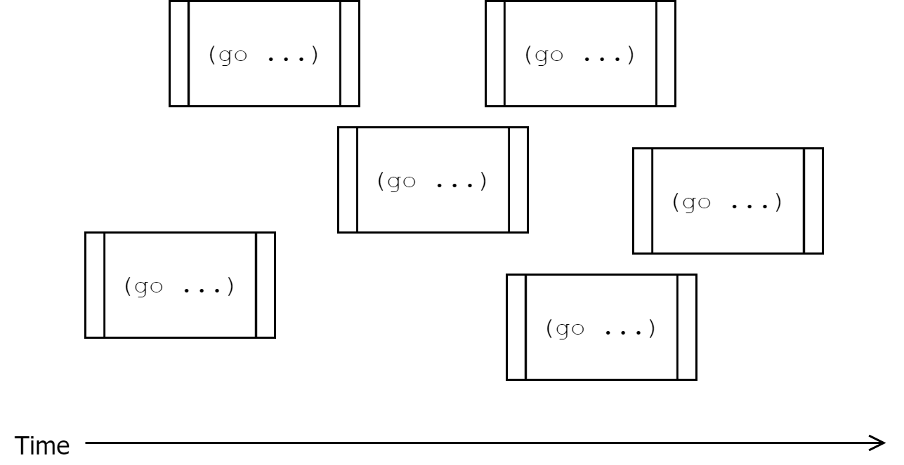
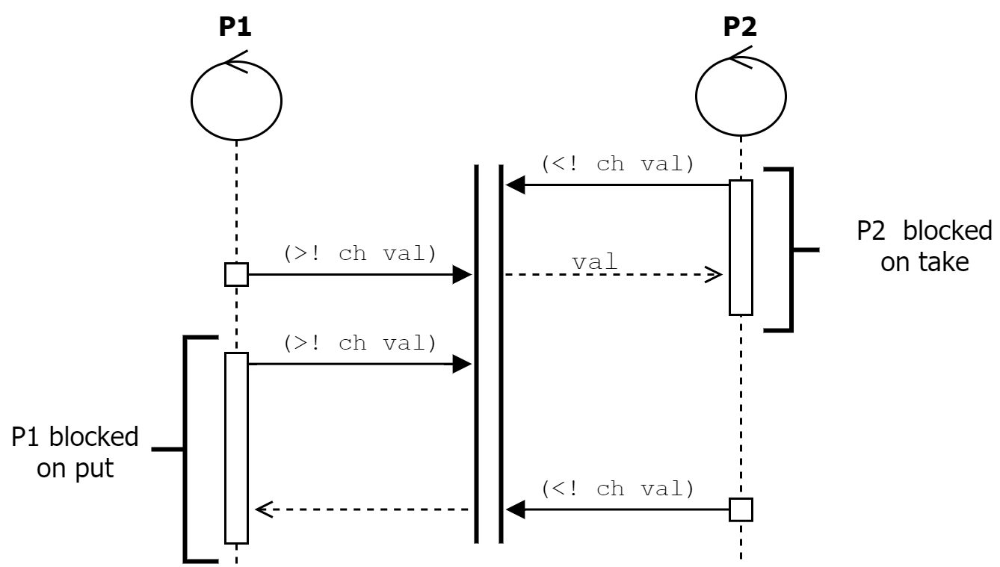

[UP](004_00.md)

### レッスン 25：core.async の紹介

非同期プログラミングはWeb開発の中心に位置しています。ほとんど全てのアプリは、メインスレッドをブロックすることなく、APIバックエンドと通信したり、ユーザの入力に応答したり、他のIOタスクを実行する必要があります。JavaScriptのPromise APIをClojureScriptから使用することは可能ですが、非同期プログラミングのためのもう一つのパラダイムである`core.async`ライブラリを使用することができます。このライブラリは、Goプログラミング言語と同じ並行処理モデルを実装しており、コードを、相互に通信する必要があるかもしれないシーケンシャル・プロセスとして書くことができます。

-----
**このレッスンでは**

- CSP（ClojureScript（およびGo）の背後にある同時実行モデル）について学びます。
- 並列問題をプロセスの観点から考える
- プロセス間の通信にチャネルを使用する
-----

#### CSPの概要

ClojureScriptの同時実行ライブラリは、1978年にTony Hoare氏によって記述されたCommunicating Sequential Processesという数学的プロセス計算（同時実行モデル）に基づいています。CSPの基本的な考え方は、それぞれが順序付けられた一連のステップを実行する、いくつかの独立したプロセスがあるというものです。これらのプロセスは、チャネルを介してメッセージを送受信することで相互に通信することができる。プロセスは、チャネルからメッセージを読みたい場合、メッセージが利用可能になるまでブロックし、その後、メッセージを消費して次に進みます。また、プロセスはチャネルにメッセージを同期または非同期で配置することができます。チャネルを介した通信を使用することで、複数のプロセスが同期し、あるプロセスが他のプロセスからの特定の入力を待ってから処理を進めることができます。

ClojureScriptでは、`core.async`ライブラリが、これらの非同期ワークフローを作成するために必要な機能を提供しています。新しい軽量プロセスを作成する`go`マクロ、チャネルを作成する`chan`マクロ、および演算子`<!` (take)、`>!` (put)、および `alts!` (多くのチャネルの1つから取る)の演算子です。これらのプリミティブを使うだけで，非常に洗練された非同期通信パターンを作ることができます．`core.async`を使用する前に、少し戻ってCSPについて説明します。

CSPでは、基本的なオブジェクトは`process`です。プロセスとは、いくつかのステップを順番に実行できる匿名（無名）のコードであり、独自の制御フローを持つ可能性があります。`process`内のコードは常に同期的に実行されます。つまり、プロセスは前のステップが完了するまで次のステップには進みません。各プロセスは他のすべてのプロセスから独立しており、すべてのプロセスが同時に実行されます（どのプロセスをいつ実行するかのスケジューリングはClojureScriptが担当します）。最後に、通信はCSPの基本ですが、プロセスは必ずしも他のプロセスと通信する必要はありません。


コンカレントなプロセス群

プロセスに続いて、CSPの次の重要なオブジェクトは、チャネル(*1)です。チャネルとは、あるプロセスから別のプロセスに値を伝達するための導管のことです。デフォルトでは、各チャネルは一度に1つの値しか伝えられません。つまり、あるプロセスがチャネルで値を送信すると、次にそのチャネルで送信しようとするプロセスは、他のプロセスがそのチャネルから値を取り出すまで、パークされます。さらに、空のチャネルから値を取ろうとすると、値が投入されるまで受信機がパークされます。また、チャネルには、そのチャネルから値が取り出されていない、指定された数の値を保持できるバッファを設けることができます。さらに、これらのバッファは、満杯になったらプロデューサーをパークするか（これがデフォルトの動作です）、新しい値を黙って破棄するか（`dropping-buffer`経由）、バッファ内の最も古い値をプッシュアウトするか（`sliding-buffer`経由）のいずれかです。

> 注意
>
> 空のチャネルから読み込んだり、満タンのチャネルに書き込もうとすると、プロセスがパークする可能性があることを述べました。プロセスから見ると、プロセスはブロックされており、チャネルの状態が変化するまで何の進展もありません。しかし、ClojureScriptランタイムの観点からは、他のプロセスは実行を続けることができ、パークされたプロセスは、チャネルの状態が変化すれば最終的に再開することができます。ClojureScriptはJavaScriptのシングルスレッドのコンテキストで実行され、プロセスをパーキングしてもそのスレッドはブロックされないので、ブロッキングという言葉は使わないようにしています。


チャネルによる同期

プロセスとチャネルの仕組みを理解した上で、例を挙げてみましょう。例えば、SQLクエリのエディタを作っていて、ユーザがクエリの入力に集中してCtrl + Enterを押すたびに、クエリをサーバに送信して応答を待つとしましょう。キー入力を監視するプロセスと、ユーザーの入力を調整し、必要に応じてサーバーへのリクエストを実行するプロセスを用意します。

`core.async`はコアライブラリの一部ではなく、公式ライブラリとして公開されているため、使用したいプロジェクトの`deps.edn`に依存関係を追加する必要があります。

```Clojure
:deps {;; Other deps}
       org.clojure/core.async {:mvn/version "1.3.618"}}
```

#### 軽量プロセスとしてのGoブロック

ClojureScriptでは、実行するコードのブロックを含む`go`マクロを使ってプロセスを作成します。単純な`go`ブロックは以下のようになります。

```Clojure
(go (println "Hello Processes!"))
```

これにより、以下のJavaScriptコードと同様に、非同期的にコンソールに「Hello Processes！」と表示されます。

```JavaScript
setTimeout(() => console.log("Hello Processes!"), 0);
```

この`go`ブロックはいくつでも作ることができ、それらはすべて互いに独立して動作します。面白いのは、`go`ブロックにチャネルを導入するときです。次の例では、あるチャネルから値を読み込んで、ある述語を満たすものを別のチャネルに転送しています。これは本質的にはチャネルフィルターの操作です。

```Clojure
(go (loop []
  (let [val (<! in-ch)]                                    ;; <1>
    (when (pred? val)                                      ;; <2>
      (>! out-ch val)))                                    ;; <3>
  (recur)))
```
絞り込み(フィルタリング)プロセス

1. in-chから値を読み取る
2. pred?で値をテストする
3. 値をout-chに書き込む

この例は、`core.async`に共通するパラダイムを示しています。それは、無限にループするgoブロックを作成し、同じタスクを何度も実行することです。JavaScriptには、コードやコールバックを実行するグローバルイベントループがあるように、ごく一部の機能だけを実行するミニイベントループを作ることができます。実際、このように無限にループする処理パターンは非常に一般的で、`core.async`にはgoブロックと`loop`を組み合わせた`go-loop`マクロが用意されています。このマクロを使うと、私たちのコードは次のようになります。

```Clojure
(go-loop []
  (let [val (<! in-ch)]
    (when (pred? val)
      (>! out-ch val)))
  (recur))
```

各プロセスが独立して動作する様子を説明するために、`core.async`ライブラリが提供する`timeout`関数を利用することができます。この関数は、指定されたタイムアウト（ミリ秒単位）の後に閉じるチャネルを返します。2つのプロセスを作り、それぞれが指定された間隔でコンソールにログを出力するようにしてみましょう。

```Clojure
(go-loop []
  (<! (timeout 100))
  (println "Hello from process 1")
  (recur))

(go-loop []
  (<! (timeout 250))
  (println "Hello from process 2")
  (recur))
```

**クイックレビュー**

- 本当か嘘か？「各 go ブロックは、他の go ブロックが実行される前に必ず完了まで実行されます。」
- `(go (loop [] .... (recur)))`のより簡潔な書き方は？

#### チャネルでの通信

SQLクエリエディタの例に戻ると、キーボードの入力を聞いて、1つ以上の修飾キー（Ctrl、Alt、Shiftなど）と他のキーを組み合わせた「キーコード」のイベントをすべて発するプロセスを生成することができます。このためには、キーダウンとキーアップのイベントをリッスンして、チャネルに配置する必要があります。コードを検出すると、その結果を別のチャネルに配置します。

```Clojure
(def keydown-ch (chan))                                    ;; <1>
(gevent/listen js/document "keydown"
  #(put! keydown-ch (.-key %)))

(def keyup-ch (chan))                                      ;; <2>
(gevent/listen js/document "keyup"
  #(put! keyup-ch (.-key %)))

(def is-modifier? #{"Control" "Meta" "Alt" "Shift"})

(def chord-ch (chan))
(go-loop [modifiers []                                     ;; <3>
          pressed nil]
  (when (and (seq modifiers) pressed)                      ;; <4>
    (>! chord-ch (conj modifiers pressed)))
  (let [[key ch] (alts! [keydown-ch keyup-ch])]            ;; <5>
    (condp = ch
      keydown-ch (if (is-modifier? key)                    ;; <6>
                   (recur (conj modifiers key) pressed)
                   (recur modifiers key))
      keyup-ch (if (is-modifier? key)
                 (recur (filterv #(not= % key) modifiers)
                        pressed)
                 (recur modifiers nil)))))
```
キーコードの検出


1. 1つのチャネルにすべてのキーダウンイベントのキーを乗せる
2. 1つのチャネルにすべてのキーアップイベントのキーを乗せる
3. 押したままの修飾キーと、最後に押された他のキーを追跡する
4. 押されたキーの他に修飾キーがあれば、コードをchord-chチャネルに送る
5. keydown-chまたはkeyup-chチャネルの値を待つ
6. 押されたキーを追加したり、離されたキーを削除したりして、繰り返す

##### 非同期に値を送る

再帰的なパスごとに状態を維持する`go-loop`の使用に加えて、ここでは`core.async`の新しい部分がいくつか出てきます。1つ目は、`put!` この関数は、非同期的にチャネルに値を入れます。通常のputとtakeの演算子（それぞれ`>!`と`<!`）は、goブロックの中でのみ実行されるように設計されています。一つの選択肢として、チャネルに値を置くたびに新しいgoブロックを立ち上げることができます。例えば、`keydown`リスナーは次のように書くことができました。

```Clojure
(gevent/listen js/document "keydown"
  #(go (>! keydown-ch (.-key %))))
```

しかし、この方法では、キーが押されるたびに必要としない追加のオーバーヘッドが発生します。この場合、`put!`関数の方がはるかに安価な選択肢となります。なお、`>!`を使うとプロセスがパークされることを覚えておいてください。しかし、Goブロックに入っていないときは、処理を進める前にチャネルの準備が整うのを待ちたくありません。非同期に値を送信し、チャネルの準備ができたときにそれを受け取ることができるようにしたいのです。これがまさに`put!`の役割です。`>!`のように、チャネルと、そのチャネルに置く値を受け取ります。さらに、第3引数にコールバックを指定することができ、値がチャネルに届いたときにコールバックが呼び出されます。

##### チャネルの切り替え

前述のCSPの紹介でも触れましたが、複数のチャネルから値を消費するためによく使う追加の関数があります。それが`alts!`です。それが`alts!`です。`>!`や`<!`と同様に、`alts!`はgoブロックの中からのみ呼び出すことができます。`alts!` は、「聞く」チャネルのベクターを受け取り、いずれかのチャネルから値を受け取るまで待機します。値を受け取ると、1番目の要素が受け取った値で、2番目の要素がその値を受け取ったチャネルであるベクターに評価されます。`alts!`から得られるチャネルをチェックすることで，値がどこから来たのかを判断し，その値をどうするかを決めることができます。


一般的な使用例としては、最終的に値を配信すると予想されるチャネルと、一定時間後に閉じるタイムアウトチャネルを交互に使用して、タイムアウトを実装することがあります。

```Clojure
(go
  (let [[val ch] (alts! long-task-ch (timeout 5000))]
    (if (= ch long-task-ch)
      (println "Task completed!" val)
      (println "Oh oh! Task timed out!"))))
```

##### コミュニケーションの追加

これまでのところ、チャネルの読み書きを行うプロセスは1つしかありませんでした。ここでは、モックアップされたサーバにクエリを送信し、結果領域を更新する別のプロセスに変更してみましょう。

```Clojure
(defn mock-request [query]                                 ;; <1>
  (let [ch (chan)]
    (js/setTimeout
      #(put! ch (str "Results for: " in))
      (* 2000 (js/Math.random)))                           ;; <2>
    ch))

(go-loop []
  (let [chord (<! chord-ch)]                               ;; <3>
    (when (and (= chord ["Control" "r"])
               (= js/document.activeElement query-input))
      (set! (.-innerText results-display) "Loading...")
      (set! (.-innerText results-display)
        (<! (mock-request (.-value query-input)))))        ;; <4>
    (recur)))
```
モックリクエストの作成

1. サーバーへのリクエストをシミュレートし、最終的に結果を得るためのチャネルを返す
2. 遅延をシミュレートするために、0秒から2秒の間のランダムな間隔で待つ
3. キーコードを待つ
4. リクエストを実行し、結果を待ってから`results-display`を更新する

ここでは、`chord-ch`チャネルからキーコードを繰り返し取得する別のプロセスをスピンアップし、正しいコードがあるかどうか、クエリの入力がフォーカスされているかどうかをチェックしています。この2つの条件が満たされていれば、サーバーへのリクエストをシミュレートし、結果が返ってきたら、結果領域を更新します。注意すべき点は、`(set! (-innerText results-display) (<! (mock-request (.-value query-input))))`は、`(mock-request (.-value query-input))`によって返されたチャネルから値を取得できるようになるまで、評価を停止します。内部的には、goマクロはコードをステートマシンに書き換えますが、知っておくべきことは、値の準備ができるまで処理を保留する必要があるときはいつでも、その値に依存するすべてのコードは、値が提供されるまで延期されるということです。

**クイックレビュー**

- `>!`と`put!`の違いを説明してください。
- 1500ミリ秒後にリクエストをタイムアウトさせるために、前のgoブロックをどのように変更することができますか？

#### 値としてのチャネル

`mock-request`関数で見たように、コードのどこにでもチャネルを作ることができます。関数の引数として渡したり、関数から返したりすることができます。チャネルは、プロセス間の通信を容易にするという特別な目的を持っていますが、通常のClojureScriptの値でもあります。

非同期に結果を生成する関数からチャネルを返すのは一般的な慣例です。JavaScriptでは、通常はPromiseを返す（または関数を非同期に書く）のに対し、goブロック内から関数を呼び出す場合にはチャネルを返すことが多いです。著者であり、ClojureのインストラクターでもあるEric Normand氏は、チャネルを返す関数に`<`の接頭辞(*2)を付けることを提案しています。この慣習に従うと、`mock-request`関数は`<mock-request`となります。これにより、チャネルを返す関数を他の関数と視覚的に区別することができます。しかし、チャネルを返す関数は、コールバックを受け付ける関数よりも汎用性が低いことを覚えておいてください。なぜなら、チャネルを返すときには、その関数が最終的に生成する値はすべてgoブロックで消費されなければならないと決められているからです。このような理由から、最終的にどのように呼び出すかわからない場合は、コールバックを受け取る関数を書くことをお勧めします。

単に、最終的に値を入れるチャネルを作成するチャネルに加えて、いくつかの面白い高次のチャネル関数を作成することができます。例えば、他のいくつかのチャネルからの値をマージするチャネルを作ることができます。

```Clojure
(defn merge-ch [& channels]
  (let [out (chan)]
    (go-loop []
      (>! out (first (alts! channels)))
      (recur))
    out))
```

このレッスンの冒頭で、チャンネル内の値をある述語を満たすものだけにフィルタリングする、もう1つの便利な高階のチャンネル関数を見ました。もう1つの例を見てみましょう。2つのチャンネルを同期させる関数で、各チャンネルで1つの値を待ち、`[chan-1-val chan-2-val]`のペアを生成するものです。

```Clojure
(defn synchronize-ch [chan-1 chan-2]
  (let [out (chan)]
    (go-loop []
      (>! out [(<! chan-1) (<! chan-2)])
      (recur))
    out))
```

非常にシンプルな関数を使えば、非常に高度な非同期システムを簡単に作ることができます。最も重要なことは、チャネルは値であるため、チャネルを操作する関数を作成することで、ビジネスロジックから通信パターンを抽象化することができるということです。

#### まとめ

このレッスンでは、Communicating Sequential Processesという同時実行モデルと、そのClojureScript実装である`core.async`について学びました。CSPの基本的な概念を学んだ後、goブロックがどのように同時実行の軽量プロセスを作成し、準備ができていないチャネルへの書き込みや読み取りを待つときにパークできるかを調べました。また、チャネルを使うことで、プロセス間の通信や状態の同期が可能になることを説明しました。最後に、チャネルが単純なClojureScriptの値であることから、ビジネスロジックとは別にプロセスの通信構造を操作することが可能であることを確認しました。`core.async`は、JavaScriptのPromisesや`async`/`await`と同等の表現力を持っていますが、同時実行についての非常に便利な考え方を示しており、複数の逐次的なインタラクションをすべて同時に処理する必要があるSPAに適しています。

-----
1. CSPの元々の定式化にはチャンネルはありませんでした。その代わり、各処理は一意の名前を持ち、他のプロセスに直接メッセージを渡していました。現在のCSPの著名な実装では、匿名プロセス間の通信に名前付きのチャネルを使用しています。
2. Eric Normand氏によるcore.asyncのスタイルガイドは、https://purelyfunctional.tv/mini-guide/core-async-code-style/ にあります。

[NEXT](004_26.md)

[UP](004_00.md)

