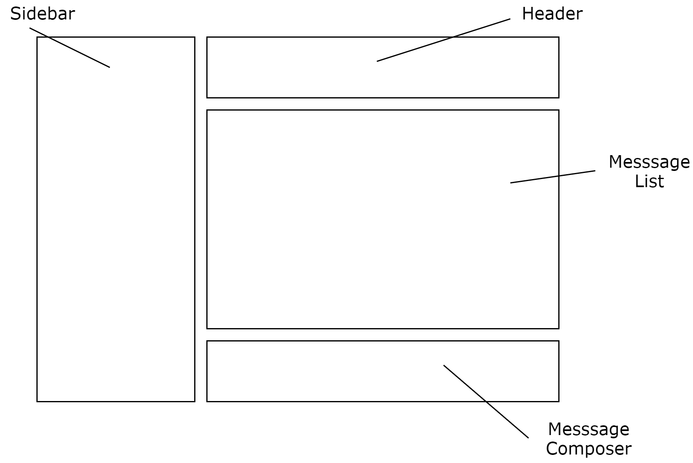

[UP](004_00.md)

### レッスン 26：キャップストーン 4 - グループチャット

おめでとうございます。この時点で、私たちはほとんどの種類のアプリを書くのに十分なClojureScriptを学びました。確かに、これからの章では、より生産性を高めるためのツールやテクニックを手に入れることができますが、これまでに学んだことを使って、完全で生産品質の高いアプリを書くことを妨げるものは何もありません。今回のキャップストーンでは、リアルタイムのグループチャットアプリケーションを書く予定です。このアプリケーションのライブインスタンスには、https://chat.learn-cljs.com/ で接続できます。

-----
**このレッスンでは**

- 状態、イベント、およびコンポーネントの観点から、自明ではないアプリケーションを設計する
- WebSocket APIを使用する
- リファクタリングの原則を学ぶ

-----


ClojureScript Chatのスクリーンショット

#### インタラクションについて考える

アプリケーションの構築を開始する方法は数多くあり、必ずしも最良の方法とはありません。しかし、ClojureScriptでは、状態と、その状態でユーザーがどのように対話するかを考えることから始めるのが自然です。大まかには、アプリケーションデータとUIステートの2種類のデータを追跡します。アプリケーションデータとは、アプリケーションを動かしているサーバーから受け取るデータのことです。 一方、UIステートとは、永続化されることはないが、さまざまなコンポーネントの状態を判断するのに役立つデータの断片で構成されています。

##### アプリケーションデータ

このチャットアプリケーションでは、参加できる部屋(`rooms`)のベクター、会話に参加できる人(`people`)のベクター、現在の部屋や会話で読めるメッセージ(`messages`)のベクターを保持します。また、いくつかの理由から、現在のユーザー(`current-user`)を追跡する必要があります。第一に、画面の右上にユーザーの名前を表示し、第二に、ユーザーがいない場合は、ユーザーがサインアップまたはサインインできるようにモーダルを表示します。

```Clojure
(ns learn-cljs.chat.state)

(def initial-state                                         ;; <1>
  {:rooms []
   :people []
   :messages []
   :current-user nil})

(defonce app-state (atom initial-state))                   ;; <2>
```
learn_clj/chat/state.cljs

1. アプリケーションの初期状態を不変的なマップとして定義する
2. アプリの状態を、`initial-state`と同じ値を開始値とするアトムとして定義します。

次に、アプリケーションデータを変換する関数を追加して、UIコンポーネントが簡単にデータを利用できるようにします。また、アプリの状態を遷移させる関数も用意します。可能な限り純粋でテスト可能なコードを書くために、アプリの状態を更新する関数は、不変の状態(`state`)を受け取り、新しい状態を返します（`app-state`アトムを直接変異させるのではなく）。これらの関数は、APIからレスポンスを受け取ったときに呼び出されます。

```Clojure
;; Application data queries
(defn room-by-id [state id]
  (->> state
       :rooms
       (filter #(= id (:id %)))
       first))

(defn person-by-username [state username]
  (->> state
       :people
       (filter #(= username (:username %)))
       first))

;; Application data transition functions
(defn received-people-list [state people]
  (assoc state :people people))

(defn person-joined [state person]
  (let [username (:username person)
        is-joined-user? #(= username (:username %))]
    (update state :people
      (fn [people]
        (if (some is-joined-user? people)
          (map
            (fn [user]
              (if (is-joined-user? user)
                (assoc user :online? true)
                user))
            people)
          (conj people person))))))

(defn person-left [state username]
  (update state :people
    (fn [people]
      (map #(if (= username (:username %))
              (assoc % :online? false)
              %) people))))

(defn received-rooms-list [state rooms]
  (assoc state :rooms rooms))

(defn room-added [state room]
  (update state :rooms conj room))

(defn message-received [state message]
  (update state :messages conj message))

(defn messages-received [state messages]
  (assoc state :messages messages))

(defn messages-cleared [state]
  (assoc state :messages []))
```

詳細は省きますが、クエリ関数では、ユーザー名でユーザーを検索したり、IDで部屋を検索したりすることができます。transition関数は、APIから期待されるほとんどのレスポンスを処理します。`person-joined`関数は、以前に見たことのあるユーザーを「オンライン」としてマークしたり、まったく新しいユーザーをユーザーリストに追加したりする興味深いロジックの1つです。また、`messages-cleared`関数は、ユーザーが部屋や会話を切り替えたときに（APIではなく）UIから呼び出されるもので、サーバーが新しいメッセージリストを送信するのを待つ間、前の部屋や会話からのメッセージが表示されないようになっています。およそ40行のコードで、アプリケーションデータを操作するためのインターフェースを定義しました。

##### UIの状態

これはシンプルなアプリケーションなので、いくつかのアプリケーションの状態を保持するだけで十分です。

- 現在のビュー(`current-view`)、つまりユーザーがフォーカスしている部屋や会話の内容
- ユーザーが認証する前に、"Sign In "または "Sign Up "モーダルを表示するかどうかを決定するトグル。
- 「ルームの作成」入力が開かれているかどうかを示すフラグ

多くのアプリケーションでは、入力データをUIの状態に保持していますが、React上での構築を開始するまでは、これは正当化するにはあまりにも複雑な要素を含んでいます。このプロジェクトでは、単純にDOMを照会してユーザーの入力フィールドの値を取得します。

まず、これらのフィールドをアプリケーションの状態に追加します。

```Clojure
(def initial-state
  {;; ...
   :current-view nil
   ;; May be {:type :room, :id 123}
   ;;     or {:type :conversation, :username "user_abc"}

   :auth-modal :sign-in
   ;; May be :sign-in
   ;;     or :sign-up

   :create-room-input-open? false})
```

次に、アプリケーションデータと同じように、クエリと状態遷移の機能を追加していきます。

```Clojure
;; UI state queries
(defn is-current-view-room? [state]
  (= ::room (get-in state [:current-view :type])))

(defn current-room-id [state]
  (get-in state [:current-view :id]))

(defn is-current-view-conversation? [state]
  (= ::conversation (get-in state [:current-view :type])))

(defn current-conversation-recipient [state]
  (get-in state [:current-view :username]))

(defn room-list [state]
  (let [current-room (when (is-current-view-room? state)
                       (get-in state [:current-view :id]))]
    (map (fn [room]
           (assoc room
             :active? (= current-room (:id room))))
         (:rooms state))))

(defn people-list [app]
  (let [current-username (when (is-current-view-conversation? app)
                           (get-in app [:current-view :username]))]
    (map (fn [person]
           (assoc person
             :active? (= current-username (:username person))))
         (:people app))))

;; UI state transition functions
(defn switched-to-room [state room-id]
  (assoc state :current-view {:type ::room
                              :id room-id}))

(defn switched-to-conversation [state username]
  (assoc state :current-view {:type ::conversation
                              :username username}))

(defn auth-modal-toggled [state]
  (update state :auth-modal
    {:sign-up :sign-in                                     ;; <1>
     :sign-in :sign-up}))

(defn user-authenticated [state user]
  (assoc state :current-user user))

(defn create-room-input-opened [state]
  (assoc state :create-room-input-open? true))

(defn create-room-input-closed [state]
  (assoc state :create-room-input-open? false))
```

1. 現在の認証モデルの状態を次の状態にマッピングする関数として、マップ自体を使用する

ステートインターフェースの全体像がわかったところで、コンポーネントやAPIがステートとやりとりするメカニズムであるメッセージバスの話に移りましょう。

##### メッセージバスのパターン

コンポーネントやAPIから直接アプリケーションの状態を変更するのではなく、メッセージングレイヤーを導入することで、コンポーネントのテストをより簡単に行うことができ、あるコンポーネントが他のコンポーネントからのメッセージに反応することができるようになります。前のレッスンで学んだ`core.async`の知識をもとに、非常にシンプルなメッセージングシステムを作成します。このメッセージングシステムでは、アプリ内のどこからでも、指定されたタイプのメッセージを発信したり、指定されたタイプのメッセージを処理する関数をサブスクライブしたりすることができます。

```Clojure
(ns learn-cljs.chat.message-bus
  (:require [cljs.core.async :refer [go-loop pub sub chan <! put!]]))

(def msg-ch (chan 1))                                      ;; <1>
(def msg-bus (pub msg-ch ::type))                          ;; <2>

(defn dispatch!                                            ;; <3>
 ([ch type] (dispatch! ch type nil))
 ([ch type payload]
  (put! ch {::type type
            ::payload payload})))

(defn handle! [p type handle]                              ;; <4>
  (let [sub-ch (chan)]
    (sub p type sub-ch)
    (go-loop []
      (handle (::payload (<! sub-ch)))
      (recur))))
```
chat/message_bus.cljs

1. メッセージがディスパッチされるチャネル
2. コンシューマが `msg-ch` からのメッセージを受信できるようにするためのパブリケーション
3. タイプされたメッセージをディスパッチする機能
4. タイプされたメッセージのハンドラを登録する関数です。


メッセージング・レイヤーのアーキテクチャ

このシンプルなメッセージング・レイヤーは、pub/sub 機能を提供しています。`msg-ch` チャネルにメッセージを送信するには `dispatch!` を、特定のタイプのメッセージが送信されるたびに呼び出されるコールバックをサブスクライブするには `handle!` を使用します。`msg-ch` にメッセージを送るように `dispatch!` を、`msg-bus` をサブスクライブするように `handle!` をハードコーディングすることもできますが、この場合、コードのテストが非常に困難になり、モジュール化も困難になります。

#### コンポーネントの構築

このアプリケーションは非常にシンプルですが、いくつかの異なるレイアウト・コンポーネントで構成されています。

- ヘッダー
- サイドバー
- メッセージ・リスト
- メッセージコンポーザー
- 認証モーダル


これらのハイレベルなレイアウト・コンポーネントをそれぞれ名前空間に分割し、残りのレイアウトを初期化するトップレベルの「app」コンポーネントも含めることにします。


アプリケーションレイアウト

ほとんどのコンポーネントは、同じパターンに従います。これらのコンポーネントは、親のDOMノードにマウントされ、アプリケーションの状態の一部（または状態から計算された値）の変化を監視し、変化が起こったときに自分自身を再レンダリングします。このパターンに沿ったコンポーネントを初期化するための関数を作ってみましょう。

```Clojure
(ns learn-cljs.chat.components.component
  (:require [learn-cljs.chat.state :as state]))

(defn init-component
  "Initialize a component.
  Parameters:
  el - Element in which to render component
  watch-key - Key that uniquely identifies this component
  accessor - Function that takes the app state and returns the
             component state
  render - Function that takes the parent element and component
           state and renders DOM"
  [el watch-key accessor render]
  (add-watch state/app-state watch-key                     ;; <1>
    (fn [_ _ old new]
      (let [state-old (accessor old)                       ;; <2>
            state-new (accessor new)]
        (when (not= state-old state-new)                   ;; <3>
          (set! (.-innerText el) "")
          (render el state-new)))))
  (render el (accessor @state/app-state))                  ;; <4>
  el)                                                      ;; <5>
```

1. すべての変更についてアプリの状態を監視する
2. 提供された`accessor`関数を使用して、新旧のアプリの状態を計算する
3. コンポーネントの状態が変更された場合のみ再レンダリングする
4. 初期レンダリングを行う
5. 親コンポーネントを返す

このユーティリティー関数の使い方は、次のセクションでコンポーネントの構築を始める際に明らかになります。

##### アプリケーション・クローム

このアプリケーションのUIは、トップダウン方式で構築します。まずアプリケーションコンテナを作成し、次に「クローム」コンポーネント（ヘッダーとサイドバー）を作成してから、下位レベルのコンポーネントを作成します。とりあえず、ヘッダーをロードしてDOMにレンダリングするだけのアプリケーションコンテナを作ってみましょう。

```Clojure
(ns learn-cljs.chat.components.app
  (:require [learn-cljs.chat.components.header :refer [init-header]]
            [goog.dom :as gdom])
  (:import [goog.dom TagName]))

(defn init-main []
  (gdom/createDom TagName.SECTION "content-main"
    (init-header)))

(defn init-app [el msg-ch]
  (let [wrapper (gdom/createDom TagName.DIV "app-wrapper"
                  (init-main))]
    (set! (.-innerText el) "")
    (.appendChild el wrapper)))
```
chat/components/app.cljs

このアプリケーションコンテナのコードは非常に簡単です。いくつかのDOMノードを持つ基本的なシェルを作成し、 `render-header`を呼び出して、ヘッダに必要なDOMを作成して返します。このコードが何か役に立つ前に、 `init-header` 関数を公開する `learn-cljs.chat.components.header` 名前空間を作成する必要があります。今からそれを行います。

```Clojure
(ns learn-cljs.chat.components.header
  (:require [goog.dom :as gdom]
            [learn-cljs.chat.components.component :refer [init-component]]
            [learn-cljs.chat.state :as state])
  (:import [goog.dom TagName]))

(defn display-name [person]                                ;; <1>
  (if person
    (->> person
        ((juxt :first-name :last-name))
        (s/join " "))
    "REMOVED"))

(defn accessor [app]                                       ;; <2>
  (cond
    (state/is-current-view-room? app)                      ;; <3>
    {:icon "meeting_room"
     :title (-> app
                (get-in [:current-view :id])
                (->> (state/room-by-id app))
                :name)
     :current-user (:current-user app)}

    (state/is-current-view-conversation? app)
    {:icon "person"
     :title (-> app
                (get-in [:current-view :username])
                (->> (state/person-by-username app))
                display-name)
     :current-user (:current-user app)}

    :else                                                  ;; <4>
    {:title "Welcome to ClojureScript Chat"}))

(defn render [header {:keys [icon title current-user]}]    ;; <5>
  (doto header
    (.appendChild
      (gdom/createDom TagName.H1 "view-name"
        (gdom/createDom TagName.I "material-icons" icon)
        title))
    (.appendChild
      (gdom/createDom TagName.DIV "user-name"
        (when (some? current-user)
          (display-name current-user))))))

(defn init-header []                                       ;; <6>
  (init-component
    (gdom/createDom TagName.HEADER "app-header")
    :header accessor render))
```
state/components/header.cljs

1. ユーザーの名前を整形して表示するヘルパー関数
2. アプリの状態を受け取り、コンポーネントの状態を計算するアクセサ関数
3. 関連するデータにアクセスするために `learn-cljs.chat.state` で書いた関数を使用します。
4. ユーザーがチャットルームや会話に参加していない場合のフォールバックを提供する
5. アプリの状態に基づいて`header`要素を更新する関数をレンダリングする
6. ヘッダーコンポーネントを作成し、そのDOME要素を返す

ここでは、`init-component`関数が動作しています。`init-header`の中では、ヘッダーコンテンツをレンダリングするための要素を作成し、その要素に、アプリケーションの状態からコンポーネントの状態を計算するアクセサ関数と、コンポーネントの状態が変化するたびにヘッダーを更新するレンダリング関数を渡します。`init-component`ヘルパーの設計方法の良い点は、アプリケーションの状態が変化して、ヘッダーのレンダリング方法に影響を与えた場合にのみ、render関数が呼び出されることです。次のセクションでは、レンダリングサイクルを最適化するためにReactに頼ることになりますが、フレームワークを使わずにいかに簡単にUIを構築できるかを知ることは有益です。

先に進む前に、少し整理しましょう。まず、`display-name`関数はユーザー名をレンダリングするのに便利なので、この関数を`render-helpers`名前空間にリファクタリングしてみましょう。

```Clojure
;; chat/components/render_helpers.cljs
(ns chat.components.render-helpers
  (:require [clojure.string :as s]))

(defn display-name [person]
  (if person
    (->> person
        ((juxt :first-name :last-name))
        (s/join " "))
    "REMOVED"))

;; chat/components/header.cljs
(ns chat.components.header
  (:require ; ...
            [chat.components.render-helpers :refer [display-name]])
  ; ...
)
```

さらに、`goog.dom`ライブラリの構文は少し冗長なので、次のようなコードを書けるように、別の`dom`ヘルパー名前空間を作成します。

```Clojure
(dom/h1 "title" "Hello world!")
```

この代りに、

```Clojure
(gdom/createDom TagName.H1 "title" "Hello world!")
```

このヘルパーの名前空間を`learn-cljs.chat.components.dom`として作成します。

```Clojure
(ns learn-cljs.chat.components.dom
  (:require [goog.dom :as gdom])
  (:import [goog.dom TagName]))

(defn dom-fn [tag-name]                                    ;; <1>
  (fn [& args]
    (apply gdom/createDom tag-name args)))

(def div (dom-fn TagName.DIV))
;; ...                                                     ;; <2>

(defn with-children [el & children]                        ;; <3>
  (doseq [child children]
    (.appendChild el child))
  el)
```
chat/components/dom.cljs

1. DOM要素を作成する関数を返す高階の関数
2. 使用するDOM要素ごとに関数を定義します。簡潔にするためにほとんどの要素は省略しています。
3. `.appendChild`の繰り返し使用をクリーンアップする別のヘルパーを定義します。

そして、`header.cljs`に戻って、この新しいDOMユーティリティーを使用するために、レンダー関数と初期化関数を更新します。

```Clojure
(ns learn-cljs.chat.components.header                                 ;; <1>
  (:require ; ...
            [learn-cljs.chat.components.dom :as dom]))

;; ...

(defn render [header {:keys [icon title current-user]}]
  (dom/with-children header
    (dom/h1 "view-name"
      (dom/i "material-icons" icon) title)
    (dom/div "user-name"
      (when (some? current-user)
        (display-name current-user)))))

(defn init-header []
  (init-component (dom/header "app-header")
    :header accessor render))
```

1. `[goog.dom :as gdom]`のrequireと`[goog.dom TagName]`のimportを削除します。

コードをリファクタリングして読みやすく簡潔にしたところで、サイドバーの作成に移りましょう。サイドバーには、部屋のリスト、会話ができるユーザーのリスト、新しい部屋を作成するためのコントロールが表示されます。部屋の名前やユーザーの名前をクリックすると、それぞれその部屋や会話に切り替わります。ヘッダーとは異なり、サイドバーには、アプリケーションの状態を更新するために、ユーザーが操作できる要素が含まれています。このため、メッセージチャンネルを必要とするすべてのコンポーネントにコンポーネント階層を介して渡し、メッセージを送信するために `learn-cljs.chat.message-bus/dispatch!` 関数を呼び出します。メッセージは登録したハンドラーによって処理され、最終的にはいくつかのメッセージがAPIリクエストのトリガーとなります。

アプリケーションの状態を受け取るコンポーネントを初期化し、DOMの独自の部分を管理し、イベントリスナーを追加しているだけで、このコードに目新しいものはありません。早速ですが、サイドバーの全コードを以下に示します。

```Clojure
(ns learn-cljs.chat.components.sidebar
  (:require [learn-cljs.chat.components.dom :as dom]       ;; <1>
            [learn-cljs.chat.components.component :refer [init-component]]
            [learn-cljs.chat.components.render-helpers :as helpers]
            [learn-cljs.chat.message-bus :as bus]
            [goog.events :as gevents]
            [learn-cljs.chat.state :as state]))

(defn sidebar-header [title]
  (dom/div "sidebar-header" title))

(defn render-room [msg-ch room]
  (let [class-name (str "sidebar-item" (when (:active? room)
                                         " active"))
        text (:name room)]
    (doto (dom/div class-name text)
      (gevents/listen "click"                              ;; <2>
        #(bus/dispatch! msg-ch :switch-to-room
           {:id (:id room)})))))

(defn render-create-room [msg-ch el open?]                 ;; <3>
  (if open?
    (let [add-room-input (dom/input "add-room-input")]
      (dom/with-children el
        (doto add-room-input
          (gevents/listen "keyup"
            #(when (= (.-key %) "Enter")
              (bus/dispatch! msg-ch
                :create-room (.-value add-room-input))))
          (gevents/listen "blur"
            #(bus/dispatch! msg-ch
               :close-create-room-input))))
      (.focus add-room-input))                             ;; <4>
    (dom/with-children el
      (doto (dom/div "add-room" "Add")
        (gevents/listen "click"
          #(bus/dispatch! msg-ch :open-create-room-input))))))

(defn render-create-room-item [msg-ch]
  (init-component
    (dom/div "sidebar-item no-highlight")
    :sidebar-create-room
    :create-room-input-open?
    (partial render-create-room msg-ch)))

(defn render-rooms [msg-ch el rooms]
  (apply dom/with-children el                              ;; <5>
    (conj
      (mapv #(render-room msg-ch %) rooms)
      (render-create-room-item msg-ch))))

(defn sidebar-rooms [msg-ch]
   (init-component
     (dom/div "sidebar-rooms")
     :sidebar-rooms
     state/room-list
     (partial render-rooms msg-ch)))

(defn render-person [msg-ch person]
  (let [class-name (str "sidebar-item" (when (:active? person)
                                          " active"))
        text (helpers/display-name person)]
    (doto (dom/div class-name text)
      (gevents/listen "click"
        #(bus/dispatch! msg-ch :switch-to-conversation
           {:username (:username person)})))))

(defn render-people [msg-ch el people]
  (dom/with-children el
    (map #(render-person msg-ch %) people)))

(defn sidebar-people [msg-ch]
   (init-component
     (dom/div "sidebar-people")
     :sidebar-people
     state/people-list
     (partial render-people msg-ch)))

(defn init-sidebar [msg-ch]
  (dom/aside "sidebar"
    (sidebar-header "Rooms")
    (sidebar-rooms msg-ch)
    (sidebar-header "People")
    (sidebar-people msg-ch)))
```
chat/components/sidebar.cljs

1. 先ほどのヘッダーコードから因数分解したUIヘルパーをrequireする
2. レンダリングしたリストの各部屋にイベントリスナーを追加する。
3. 「Add Room」ウィジェットをレンダリングして、クリックすると入力になるようにする
4. 「Add Room」がクリックされると、自動的に入力フィールドをフォーカスする
5. `dom/with-children` は可変引数のchildrenリストを想定しているので、`apply`を使って渡している要素のベクターを「アンラップ」しています。

このサイドバーは`components/app.cljs`でも初期化する必要があります。

```Clojure
(ns learn-cljs.chat.components.app
  (:require ;; ...
            [learn-cljs.chat.components.sidebar            ;; <1>
             :refer [init-sidebar]]))

(defn init-app [el msg-ch]
  (let [wrapper (dom/div "app-wrapper"                     ;; <2>
                  (init-sidebar msg-ch)                    ;; <3>
                  ;; ...
                )]
    ;; ...
  ))
```

1. サイドバーの初期化関数をrequireする
2. DOMヘルパーを使用するように`app.cljs`をリファクタリングします。
3. `init-sidebar`はアプリのラッパー内でサイドバーをレンダリングします。

最後に、headerとsidebarの両方のDOM要素をページ自体に読み込む`learn-cljs.chat`名前空間を作成します。

```Clojure
(ns learn-cljs.chat
    (:require [learn-cljs.chat.message-bus :as bus]
              [learn-cljs.chat.components.app              ;; <1>
               :refer [init-app]]
              [learn-cljs.chat.handlers]                   ;; <2>
              [goog.dom :as gdom]))

(defonce initialized?
  (do
    (init-app                                              ;; <3>
      (gdom/getElement "app")
      bus/msg-ch)
    true))
```
chat.cljs

1. アプリケーション全体のUIを初期化する関数をrequireする。
2. メッセージハンドラを登録する副作用のために、`learn-cljs.chat.handlers` 名前空間をrequireする。
3. UIの初期化

このプロジェクトを進めていく中で、この `learn-cljs.chat` 名前空間を充実させていきますが、気をつけなければならないのは、他のコードに比べて純粋で関数型的なものではないということです。なぜなら、ある時点で、副作用のために実際に何かをロードしたり、ステートフルな関数を呼び出したり、ページ上のDOMを仮定したり、`msg-ch`チャネルのようなグローバルなオブジェクトをロードしたりする必要があるからです。コード・ベース全体をこのような不純物で汚染するのではなく、コードの興味深い部分をよりモジュール化するために、できるだけ多くの不純物の操作をコア名前空間で行います。

このアプリケーションで関数型的な純粋性を維持していない部分の一つは、それを `learn-cljs.chat` で構築し、各コンポーネントに明示的に渡すのではなく、UIコンポーネントが `learn-cljs.chat.state/app-state`に直接アクセスできるようにしたことです。これは、テスト可能性とモジュール性を犠牲にして、コードをより簡単にするために、時々行われる実用的なトレードオフの一種です。本番のアプリケーションでは、通常、状態にアクセスするために、より制限された明示的なアプローチによって、より良いサービスを提供することができます。

##### メッセージ・リスト

さて、アプリケーションの基本的な「シェル」ができたところで、アプリケーションの本質であるメッセージリストに移りましょう。メッセージ・フィードはアプリケーションの中核であるにもかかわらず、単一のコンポーネントとして実装されています。stateアクセッサは、アプリケーションから`:messages`コレクションを取得し、各メッセージの作者を取得するために`:users`コレクションを簡単にルックアップし、いくつかのフォーマットを適用します。レンダラは、これらのメッセージごとに DOM を作成します。メッセージリストにはユーザーの入力に応答する必要のあるものがないので、イベントハンドラをアタッチする必要はありません。

```Clojure
(ns learn-cljs.chat.components.messages
  (:require [learn-cljs.chat.components.dom :as dom]
            [learn-cljs.chat.components.component :refer [init-component]]
            [learn-cljs.chat.components.render-helpers :as helpers]
            [learn-cljs.chat.state :as state]))

(defn message-state-accessor [app message]
  (let [sender (state/person-by-username app (:sender message))
        name (helpers/display-name sender)
        initial (-> name (.charAt 0) (.toUpperCase))
        formatted-timestamp (.toLocaleString
                              (js/Date. (* 1000 (:timestamp message))))]
    (assoc message :author {:name name
                            :initial initial}
                   :timestamp formatted-timestamp)))

(defn accessor [app]
  (->> app :messages (map #(message-state-accessor app %))))

(defn render-message [message]
  (dom/article "message"
    (dom/div "message-header"
      (dom/div "author-avatar" (get-in message [:author :initial]))
      (dom/div "author-name" (get-in message [:author :name]))
      (dom/div "message-timestamp" (:timestamp message)))
    (dom/div "message-content"
      (dom/p nil (:content message)))))

(defn render [el messages]
  (dom/with-children el
    (map render-message messages)))

(defn scroll-to-bottom [el]                                ;; <1>
  (let [observer (js/MutationObserver.
                   #(set! (.-scrollTop el)
                          (.-scrollHeight el)))]
    (.observe observer el #js{"childList" true})))

(defn init-messages []
  (dom/section "messages"
    (doto (dom/div "messages-inner")
      (scroll-to-bottom)
      (init-component :messages accessor render))))
```
chat/components/messages.cljs

1. [Mutation Observer](https://developer.mozilla.org/en-US/docs/Web/API/MutationObserver)を使用して、メッセージリストが変更されるたびに、ビューポートをメッセージリストの下部に設定します。これにより、ユーザーは常に最新のメッセージを見ることができます。

メッセージリストはトップレベルのコンポーネントとしてレンダリングされるので、`components/app.cljs`内で初期化する必要があります。

```Clojure
(ns learn-cljs.chat.components.app
  (:require ;; ...
            [learn-cljs.chat.components.messages :refer [init-messages]]))

(defn init-main [msg-ch]
  (dom/section "content-main"
    ;; ...
    (init-messages)))
;; ...
```

メッセージリストができたところで、次はメッセージコンポーザーに移りましょう。

##### メッセージコンポーザー

コンポーザーは、今まで見てきた中で最もシンプルなコンポーネントです。これは単にイベントリスナーを持つテキストエリアで、ユーザーがEnter/Returnキーを押すたびにメッセージを送信し、その内容をクリアします。

```Clojure
(ns learn-cljs.chat.components.compose
  (:require [learn-cljs.chat.components.dom :as dom]
            [learn-cljs.chat.message-bus :as bus]))

(defn init-composer [msg-ch]
  (let [composer-input (dom/textarea "message-input")]
    (.addEventListener composer-input "keyup"
      (fn [e]
        (when (= (.-key e) "Enter")
          (.preventDefault e)
          (let [content (.-value composer-input)]
            (set! (.-value composer-input) "")
            (bus/dispatch! msg-ch :add-message content)))))
    (dom/div "compose" composer-input)))
```
chat/components/compose.cljs

先に進む前に注意しておきたいのは、ユーザーが作成しているメッセージをDOM自体の外では追跡していないということです。これは、アプリケーションの状態に加えて、DOMに依存して状態の一部を保持していることを意味します。ReactとReagentの上でアプリケーションを構築し始めたら、このようなことは避けて、すべての状態を不変のデータ構造に保持し、レンダリングがアプリケーションの状態を取得して（仮想）DOMに変換するシンプルで決定性のあるプロセスになるようにしたいと思うでしょう。

メッセージリストと同様に、コンポーザーもアプリにマウントして、メインコンテンツエリア内で初期化する必要があります。

```Clojure
(ns learn-cljs.chat.components.app
  (:require ;; ...
            [learn-cljs.chat.components.compose :refer [init-composer]]))

(defn init-main [msg-ch]
  (dom/section "content-main"
    ;; ...
    (init-composer)))
;; ...
```

##### 認証モーダル (Authentication Modal)

これはマルチユーザーのチャットアプリケーションなので、ユーザーの概念を持つ必要があります。そして、少なくとも簡単なサインアップ/サインインプロセスを実装し、ユーザーがアプリをロードするたびに名字や名前、ユーザー名を入力する必要がないようにしなければなりません。また、ユーザーがお互いになりすましてしまうことも避けたいと考えています。以下は、認証モーダルのコード一覧です。この後、各セクションを説明していきます。

```Clojure
(ns learn-cljs.chat.components.auth
  (:require [learn-cljs.chat.components.dom :as dom]
            [goog.dom.classes :as gdom-classes]
            [learn-cljs.chat.components.component :refer [init-component]]
            [learn-cljs.chat.components.render-helpers :as helpers]
            [learn-cljs.chat.message-bus :as bus]
            [learn-cljs.chat.state :as state]))

(declare accessor get-render sign-in-modal sign-up-modal
         auth-modal auth-form footer-link)

(defn init-auth [msg-ch]
  (init-component (dom/section "auth-modal")
    :auth
    accessor
    (get-render msg-ch)))

(defn accessor [state]
  (select-keys state [:current-user :auth-modal]))

(defn get-render [msg-ch]
  (fn [el {:keys [current-user auth-modal] :as s}]
    (if (some? current-user)
      (gdom-classes/add el "hidden")
      (doto el
        (gdom-classes/remove "hidden")
        (.appendChild
          (dom/div "auth-modal-wrapper"
            (if (= :sign-in auth-modal)
              (sign-in-modal msg-ch)
              (sign-up-modal msg-ch))))))))

(defn sign-in-modal [msg-ch]
  (auth-modal msg-ch
    {:header-text "Sign In"
     :footer-text "New here? Sign up."
     :form-fields [{:label "Username" :type "text" :name "username"}
                   {:label "Password" :type "password" :name "password"}]
     :submit-action :sign-in}))

(defn sign-up-modal [msg-ch]
  (auth-modal msg-ch
    {:header-text "Sign Up"
     :footer-text "Already have an account? Sign in."
     :form-fields [{:label "First Name" :type "text" :name "first-name"}
                   {:label "Last Name" :type "text" :name "last-name"}
                   {:label "Username" :type "text" :name "username"}
                   {:label "Password" :type "password" :name "password"}]
     :submit-action :sign-up}))

(defn auth-modal [msg-ch {:keys [header-text
                                 form-fields
                                 submit-action
                                 footer-text]}]
    (dom/div "auth-modal-inner"
      (dom/div "auth-modal-header"
        (dom/h1 nil header-text))
      (dom/div "auth-modal-body"
        (auth-form msg-ch form-fields submit-action))
      (dom/div "auth-modal-footer"
        (footer-link msg-ch footer-text))))

(defn auth-form [msg-ch form-fields submit-action]
  (let [form (dom/form nil
               (apply dom/with-children (dom/div)
                 (for [{:keys [label type name]} form-fields
                       :let [id (str "auth-field-" name)]]
                   (dom/div "input-field"
                     (dom/label #js {"class" "input-label"
                                     "for" id}
                       label)
                     (dom/input #js {"type" type
                                     "name" name
                                     "id" id}))))
               (dom/button #js {"type" "submit"} "Submit"))]
    (doto form
      (.addEventListener "submit"
        (fn [e]
          (.preventDefault e)
          (bus/dispatch! msg-ch submit-action
            (into {}
              (for [{:keys [name]} form-fields
                    :let [id (str "auth-field-" name)]]
                [(keyword name) (.-value (js/document.getElementById id))]))))))))

(defn footer-link [msg-ch footer-text]
  (doto (dom/a nil footer-text)
    (.addEventListener "click"
      (fn [e]
        (.preventDefault e)
        (bus/dispatch! msg-ch :toggle-auth-modal)))))
```
chat/components/auth.cljs

ファイルの先頭では、まだ遭遇したことのないClojureScriptの機能である`declare`マクロに遭遇します。その名のとおり、このマクロは、まだ値に束縛されていない変数を宣言します。これにより、ソースファイルで物理的に定義される前に、名前空間内の関数やその他の値を参照することができます。今回の例では、高レベルの関数を最初に、低レベルの詳細を実装する関数を後からコードに記載できるように、便宜的にこれらの変数を宣言しています。これはClojureScriptのイディオムではありませんが、コードを見ていく上では便利です。

次に、先ほど作成した`init-component`ヘルパーを使用して、認証モーダルを管理するコンポーネントを定義します。認証モーダルを表示するためには、アプリケーションの状態について2つのことを知る必要があります。認証されたユーザーがいるかどうか、モーダルが表示される場合はサインインとサインアップのどちらの状態になるか、です。このコンポーネントのレンダリング関数を返す前に、親コンポーネントから「hidden」クラスを追加または削除する副作用を行います。

次に、モーダルの「サインイン」と「サインアップ」の両方の状態を定義します。それぞれの状態で、ヘッダーとフッターに何を表示するか、どのフォームフィールドを表示するか、フォームが送信されたときにどのようなメッセージを発信するかを決めなければなりません。各モーダルの状態によって異なることはほんの少しなので、共通のコードを`auth-modal`関数に因数分解し、`sign-in-modal`と`sign-up-modal`が異なるデータで呼び出すようにします。

`auth-modal`関数は、さらにいくつかの低レベル関数を使用して実装します。まず、`auth-form`は、`form-fields`で指定されたすべての入力要素を持つフォーム要素を作成します。そして、フォームの各要素を照会して、フィールド名とフィールド値のマップにまとめる`submit`イベントハンドラを添付します。そして、フィールド/値のマップをペイロードとして、適切なメッセージタイプを発行します。次に、`footer-link`ですが、これはモーダルの2つの状態を切り替えるためのトグルリンクを表示します。フォームと`footer-link`は、アプリケーションが応答すべきメッセージを発信する必要があるので、`msg-ch`をコンポーネント階層を下って、それぞれの下位コンポーネントに渡します。

最後に、先ほどと同様に`components/app.cljs`でモーダルを初期化する必要があります。

```Clojure
(ns learn-cljs.chat.components.app
  (:require ;; ...
            [learn-cljs.chat.components.auth :refer [init-auth]]))

(defn init-app [el msg-ch]
  (let [wrapper (dom/div "app-wrapper"
                  (init-auth msg-ch)
                  ;; ...
                )]
    ;; ...
  ))
```

UIが完成したところで、WebSocket APIを接続する方法を簡単に見てみましょう。

#### リアルタイム通信

このアプリケーションは非常に動的であり、ほぼリアルタイムでメッセージを送受信したいので、WebSocket APIを使用します。この ClojureScript Node.js API のコードは、この本ではカバーできませんが、[Learn ClojureScript の GitHub リポジトリ](https://github.com/kendru/learn-cljs/tree/master/code/lesson-26/chat-backend)で入手できます。アプリケーション内でメッセージを処理する機能はすでに持っており、APIとはメッセージで会話するので、必要なことは驚くほど少ないです。APIは、APIにメッセージを送信するための関数を公開する必要があり、また、APIから我々のアプリケーションにメッセージを返す必要があります。面白いのは、リクエスト／レスポンスの流れという概念がなく、UI内やUIとAPIの間を流れる非同期のメッセージだけであることです。

```Clojure
(ns learn-cljs.chat.api
  (:require [learn-cljs.chat.message-bus :as bus]
            [cljs.reader :refer [read-string]]))

(defonce api (atom nil))                                   ;; <1>

(defn send!
 ([msg-type] (send! msg-type nil))
 ([msg-type payload]
  (.send @api
    (pr-str (if (some? payload)                            ;; <2>
              [msg-type payload]
              [msg-type])))))

(defn init! [msg-ch url]
  (let [ws (js/WebSocket. url)]
    (.addEventListener ws "message"
      (fn [msg]
        (let [[type payload] (read-string (.-data msg))]   ;; <3>
           (bus/dispatch! msg-ch
             (keyword (str "api/" (name type)))            ;; <4>
             payload))))
    (reset! api ws)))
```
api.cljs

1. 便宜上、Websocket APIをグローバル・アトムとして定義します。
2. `pr-str`は、Clojure(Script)データをシリアル化します。
3. `read-string`は、Clojure(Script)データをデシリアライズします。
4. UIイベントと区別するために、すべてのAPIイベントに`api/`というプレフィックスを付ける

このAPI名前空間では、非常にシンプルなメッセージング・プロトコルを定義しています。UI と API の両方が、シリアライズされた ClojureScript データ構造であるメッセージを相互に送信します。最初の要素はメッセージ・タイプを識別するキーワードで、2 番目の要素は任意のタイプのオプションのペイロードになります。ここでは、標準ライブラリの`pr-str`および`read-string`関数を使用して、ClojureネイティブのEDN形式(*1)を使用してデータ構造をシリアライズ／デシリアライズします。

まず、コア・ネームスペース内でAPIを初期化します。

```Clojure
(ns learn-cljs.chat.core
  (:require ;; ...
            [learn-cljs.chat.api :as api]))

(defonce initialized?
  (do
    (api/init! bus/msg-ch js/WS_API_URL)                   ;; <1>
  ;; ..
  ))
```

1. グローバルなWS_API_URLをページから読み込み、APIのURLを決定します。これはビルドスクリプトで設定できます。

次に、`handlers`名前空間を更新して、特定のUIメッセージに応答してAPIメッセージを発行したり、APIから直接送られてくるメッセージを処理したりします。まず、ユーザーが特定の部屋や会話をアクティブにしたときにAPIの通知を送信し、その特定の場所に関連したメッセージの更新を送信できるようにします。

```Clojure
(ns learn-cljs.chat.handlers
  (:require ;; ...
            [chat.api :as api]))

;; ...

(bus/handle! bus/msg-bus :switch-to-conversation
  (fn [{:keys [username]}]
    (api/send! :set-view {:type :conversation, :username username})
    ;; ...
  ))

(bus/handle! bus/msg-bus :switch-to-room
  (fn [{:keys [id]}]
    (api/send! :set-view {:type :room, :id id})
    ;; ...
  ))
```

当然のことながら、メッセージを送信したらサーバーに通知したいと思います。サーバーは、私たちが現在どの部屋や会話にいるかを記録しているので、私たちが送信する必要があるのは、メッセージそのものだけです。

```Clojure
(bus/handle! bus/msg-bus :add-message
  (fn [content]
    (api/send! :add-message {:content content})))
```

ユーザーに新しい部屋を作らせるので、その際にはサーバーにメッセージを送る必要があります。

```Clojure
(bus/handle! bus/msg-bus :create-room
  (fn [name]
    (api/send! :create-room {:name name})))
```

authモーダルは、サインインやサインアップに使用されるべきイベントを発するので、それらもサーバーに送信しましょう。

```Clojure
(bus/handle! bus/msg-bus :sign-in
  (fn [data]
    (api/send! :sign-in data)))

(bus/handle! bus/msg-bus :sign-up
  (fn [data]
    (api/send! :sign-up data)))
```

これで、ユーザーのインタラクションに基づいてAPIに送信する必要のあるメッセージのすべてが処理されました。次に、UIが反応する必要のあるAPIからのメッセージを処理しましょう。まず、認証を処理しましょう。ユーザーがログインやサインアップに成功すると、APIはユーザーの詳細情報を含む認証済み(`authenticated`)メッセージを送信します。これをアプリケーションの状態で現在のユーザーとして設定し、ユーザーリストとルームリストを要求してサイドバーに表示させます。

```Clojure
(bus/handle! bus/msg-bus :api/authenticated
  (fn [user-info]
    (swap! state/app-state state/user-authenticated user-info)
    (api/send! :list-people)
    (api/send! :list-rooms)))
```

サーバーからルームリストを受信したら、アプリケーションの状態にルームリストを設定し、リストの最初の部屋を初期ルームとして切り替える必要があります。

```Clojure
(bus/handle! bus/msg-bus :api/rooms-listed
  (fn [rooms]
    (swap! state/app-state state/received-rooms-list rooms)
    (when-let [first-room (first rooms)]
      (bus/dispatch! bus/msg-ch :switch-to-room
        {:id (:id first-room)}))))
```

次に、ユーザーのリストを受け取ったとき、ユーザーが参加したとき、ユーザーが離脱したときのメッセージを処理しましょう。これらのハンドラは、APIからのデータを先ほど書いた状態遷移関数に渡すだけのシンプルなものです。

```Clojure
(bus/handle! bus/msg-bus :api/people-listed
  (fn [people]
    (swap! state/app-state state/received-people-list people)))

(bus/handle! bus/msg-bus :api/person-joined
  (fn [person]
    (swap! state/app-state state/person-joined person)))

(bus/handle! bus/msg-bus :api/person-left
  (fn [username]
    (swap! state/app-state state/person-left username)))
```

次に、ユーザーが部屋や会話を切り替えたときに発生する、単一のメッセージおよびメッセージのリストを受信するハンドラを作成します。また、`should-set-message?` 関数を作成して、APIからのメッセージやメッセージがまだ表示に適しているかどうかを判断するようにします。これにより、ユーザーが新しい部屋に切り替えたときに、APIが切り替えを認識する前に、誤って前の部屋のメッセージを投稿してしまうことを防ぐことができます。

```Clojure
(defn should-set-message? [username room]
  (let [app @state/app-state]
    (or
      (and (some? username)
           (state/is-current-view-conversation? app)
           (= username (state/current-conversation-recipient app)))
      (and (some? room)
           (state/is-current-view-room? app)
           (= room (state/current-room-id app))))))

(bus/handle! bus/msg-bus :api/message-received
  (fn [{:keys [message username room]}]
    (when (should-set-message? username room)
      (swap! state/app-state state/message-received message))))

(bus/handle! bus/msg-bus :api/messages-received
  (fn [{:keys [messages username room]}]
    (when (should-set-message? username room)
      (swap! state/app-state state/messages-received messages))))
```

最後に、部屋の作成時に新しい部屋を作成するためのハンドラーがもう一つ必要です。

```Clojure
(bus/handle! bus/msg-bus :api/room-created
  (fn [room]
    (swap! state/app-state
      #(-> %
           (state/room-added room)
           (state/create-room-input-closed)))))
```

これでハンドラーが完成し、完全に機能するチャットアプリケーションが完成しました。

**課題**

このアプリケーションは、数行のコードで構成されているにもかかわらず、非常に優れた機能を持っていますが、まだまだ改善の余地があります。次のような点を試してみてください。

- 一度に表示されるメッセージ数を一定にし、必要な箇所までスクロールした時にのみ表示する。
- サーバーからのエラーメッセージを表示する。エラーは以下の形式で表示されます。`[:error {:message "Some message"}]` となります。
- WebSocket が閉じた場合、自動的に再接続する

#### まとめ

ここまでたどり着いた方は、ClojureScriptで自明でないアプリケーションを作成したことを祝福します。この時点で、私たちは言語のコア機能とイディオムをすべて学び、それらを実践して、面白くて使いやすいチャットアプリを作成しました。最終的には完全に機能するアプリが完成しましたが、フレームワークを使用していない場合にJavaScriptで行うのと同様に、いくつかの命令的なコードと手動でのDOM操作に頼らなければなりませんでした。次のセクションでは、Reactの仮想DOMとClojure Scriptの不変性への嗜好が、宣言的なアプリケーションUIを書くことを可能にする完璧な結婚をどのように形成するかを見ていきます。

-----
1. https://github.com/edn-format/edn

[NEXT](005_00.md)

[UP](004_00.md)

