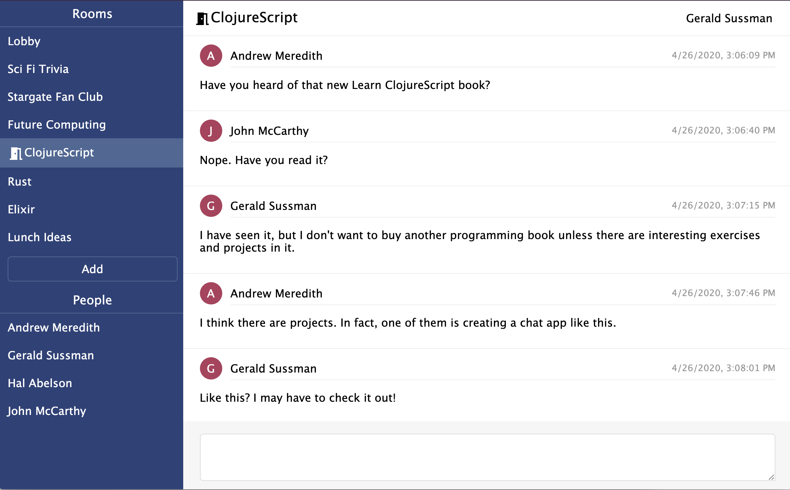
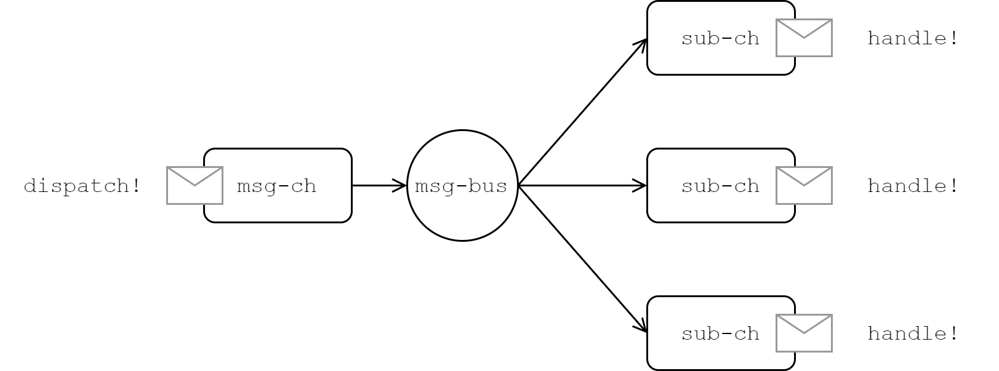

[UP](004_00.md)

### レッスン 26：キャップストーン 4 - グループチャット

おめでとうございます。この時点で、私たちはほとんどの種類のアプリを書くのに十分なClojureScriptを学びました。確かに、これからの章では、より生産性を高めるためのツールやテクニックを手に入れることができますが、これまでに学んだことを使って、完全で生産品質の高いアプリを書くことを妨げるものは何もありません。今回のキャップストーンでは、リアルタイムのグループチャットアプリケーションを書く予定です。このアプリケーションのライブインスタンスには、https://chat.learn-cljs.com/ で接続できます。

-----
**このレッスンでは**

- 状態、イベント、およびコンポーネントの観点から、自明ではないアプリケーションを設計する
- WebSocket APIを使用する
- リファクタリングの原則を学ぶ

-----


ClojureScript Chatのスクリーンショット

#### インタラクションについて考える

アプリケーションの構築を開始する方法は数多くあり、必ずしも最良の方法とはありません。しかし、ClojureScriptでは、状態と、その状態でユーザーがどのように対話するかを考えることから始めるのが自然です。大まかには、アプリケーションデータとUIステートの2種類のデータを追跡します。アプリケーションデータとは、アプリケーションを動かしているサーバーから受け取るデータのことです。 一方、UIステートとは、永続化されることはないが、さまざまなコンポーネントの状態を判断するのに役立つデータの断片で構成されています。

##### アプリケーションデータ

このチャットアプリケーションでは、参加できる部屋(`rooms`)のベクター、会話に参加できる人(`people`)のベクター、現在の部屋や会話で読めるメッセージ(`messages`)のベクターを保持します。また、いくつかの理由から、現在のユーザー(`current-user`)を追跡する必要があります。第一に、画面の右上にユーザーの名前を表示し、第二に、ユーザーがいない場合は、ユーザーがサインアップまたはサインインできるようにモーダルを表示します。

```Clojure
(ns learn-cljs.chat.state)

(def initial-state                                         ;; <1>
  {:rooms []
   :people []
   :messages []
   :current-user nil})

(defonce app-state (atom initial-state))                   ;; <2>
```
learn_clj/chat/state.cljs

1. アプリケーションの初期状態を不変的なマップとして定義する
2. アプリの状態を、`initial-state`と同じ値を開始値とするアトムとして定義します。

次に、アプリケーションデータを変換する関数を追加して、UIコンポーネントが簡単にデータを利用できるようにします。また、アプリの状態を遷移させる関数も用意します。可能な限り純粋でテスト可能なコードを書くために、アプリの状態を更新する関数は、不変の状態(`state`)を受け取り、新しい状態を返します（`app-state`アトムを直接変異させるのではなく）。これらの関数は、APIからレスポンスを受け取ったときに呼び出されます。

```Clojure
;; Application data queries
(defn room-by-id [state id]
  (->> state
       :rooms
       (filter #(= id (:id %)))
       first))

(defn person-by-username [state username]
  (->> state
       :people
       (filter #(= username (:username %)))
       first))

;; Application data transition functions
(defn received-people-list [state people]
  (assoc state :people people))

(defn person-joined [state person]
  (let [username (:username person)
        is-joined-user? #(= username (:username %))]
    (update state :people
      (fn [people]
        (if (some is-joined-user? people)
          (map
            (fn [user]
              (if (is-joined-user? user)
                (assoc user :online? true)
                user))
            people)
          (conj people person))))))

(defn person-left [state username]
  (update state :people
    (fn [people]
      (map #(if (= username (:username %))
              (assoc % :online? false)
              %) people))))

(defn received-rooms-list [state rooms]
  (assoc state :rooms rooms))

(defn room-added [state room]
  (update state :rooms conj room))

(defn message-received [state message]
  (update state :messages conj message))

(defn messages-received [state messages]
  (assoc state :messages messages))

(defn messages-cleared [state]
  (assoc state :messages []))
```

詳細は省きますが、クエリ関数では、ユーザー名でユーザーを検索したり、IDで部屋を検索したりすることができます。transition関数は、APIから期待されるほとんどのレスポンスを処理します。`person-joined`関数は、以前に見たことのあるユーザーを「オンライン」としてマークしたり、まったく新しいユーザーをユーザーリストに追加したりする興味深いロジックの1つです。また、`messages-cleared`関数は、ユーザーが部屋や会話を切り替えたときに（APIではなく）UIから呼び出されるもので、サーバーが新しいメッセージリストを送信するのを待つ間、前の部屋や会話からのメッセージが表示されないようになっています。およそ40行のコードで、アプリケーションデータを操作するためのインターフェースを定義しました。

##### UIの状態

これはシンプルなアプリケーションなので、いくつかのアプリケーションの状態を保持するだけで十分です。

- 現在のビュー(`current-view`)、つまりユーザーがフォーカスしている部屋や会話の内容
- ユーザーが認証する前に、"Sign In "または "Sign Up "モーダルを表示するかどうかを決定するトグル。
- 「ルームの作成」入力が開かれているかどうかを示すフラグ

多くのアプリケーションでは、入力データをUIの状態に保持していますが、React上での構築を開始するまでは、これは正当化するにはあまりにも複雑な要素を含んでいます。このプロジェクトでは、単純にDOMを照会してユーザーの入力フィールドの値を取得します。

まず、これらのフィールドをアプリケーションの状態に追加します。

```Clojure
(def initial-state
  {;; ...
   :current-view nil
   ;; May be {:type :room, :id 123}
   ;;     or {:type :conversation, :username "user_abc"}

   :auth-modal :sign-in
   ;; May be :sign-in
   ;;     or :sign-up

   :create-room-input-open? false})
```

次に、アプリケーションデータと同じように、クエリと状態遷移の機能を追加していきます。

```Clojure
;; UI state queries
(defn is-current-view-room? [state]
  (= ::room (get-in state [:current-view :type])))

(defn current-room-id [state]
  (get-in state [:current-view :id]))

(defn is-current-view-conversation? [state]
  (= ::conversation (get-in state [:current-view :type])))

(defn current-conversation-recipient [state]
  (get-in state [:current-view :username]))

(defn room-list [state]
  (let [current-room (when (is-current-view-room? state)
                       (get-in state [:current-view :id]))]
    (map (fn [room]
           (assoc room
             :active? (= current-room (:id room))))
         (:rooms state))))

(defn people-list [app]
  (let [current-username (when (is-current-view-conversation? app)
                           (get-in app [:current-view :username]))]
    (map (fn [person]
           (assoc person
             :active? (= current-username (:username person))))
         (:people app))))

;; UI state transition functions
(defn switched-to-room [state room-id]
  (assoc state :current-view {:type ::room
                              :id room-id}))

(defn switched-to-conversation [state username]
  (assoc state :current-view {:type ::conversation
                              :username username}))

(defn auth-modal-toggled [state]
  (update state :auth-modal
    {:sign-up :sign-in                                     ;; <1>
     :sign-in :sign-up}))

(defn user-authenticated [state user]
  (assoc state :current-user user))

(defn create-room-input-opened [state]
  (assoc state :create-room-input-open? true))

(defn create-room-input-closed [state]
  (assoc state :create-room-input-open? false))
```

1. 現在の認証モデルの状態を次の状態にマッピングする関数として、マップ自体を使用する

ステートインターフェースの全体像がわかったところで、コンポーネントやAPIがステートとやりとりするメカニズムであるメッセージバスの話に移りましょう。

##### メッセージバスのパターン

コンポーネントやAPIから直接アプリケーションの状態を変更するのではなく、メッセージングレイヤーを導入することで、コンポーネントのテストをより簡単に行うことができ、あるコンポーネントが他のコンポーネントからのメッセージに反応することができるようになります。前のレッスンで学んだ`core.async`の知識をもとに、非常にシンプルなメッセージングシステムを作成します。このメッセージングシステムでは、アプリ内のどこからでも、指定されたタイプのメッセージを発信したり、指定されたタイプのメッセージを処理する関数をサブスクライブしたりすることができます。

```Clojure
(ns learn-cljs.chat.message-bus
  (:require [cljs.core.async :refer [go-loop pub sub chan <! put!]]))

(def msg-ch (chan 1))                                      ;; <1>
(def msg-bus (pub msg-ch ::type))                          ;; <2>

(defn dispatch!                                            ;; <3>
 ([ch type] (dispatch! ch type nil))
 ([ch type payload]
  (put! ch {::type type
            ::payload payload})))

(defn handle! [p type handle]                              ;; <4>
  (let [sub-ch (chan)]
    (sub p type sub-ch)
    (go-loop []
      (handle (::payload (<! sub-ch)))
      (recur))))
```
chat/message_bus.cljs

1. メッセージがディスパッチされるチャネル
2. コンシューマが `msg-ch` からのメッセージを受信できるようにするためのパブリケーション
3. タイプされたメッセージをディスパッチする機能
4. タイプされたメッセージのハンドラを登録する関数です。


メッセージング・レイヤーのアーキテクチャ

このシンプルなメッセージング・レイヤーは、pub/sub 機能を提供しています。`msg-ch` チャネルにメッセージを送信するには `dispatch!` を、特定のタイプのメッセージが送信されるたびに呼び出されるコールバックをサブスクライブするには `handle!` を使用します。`msg-ch` にメッセージを送るように `dispatch!` を、`msg-bus` をサブスクライブするように `handle!` をハードコーディングすることもできますが、この場合、コードのテストが非常に困難になり、モジュール化も困難になります。

#### コンポーネントの構築

このアプリケーションは非常にシンプルですが、いくつかの異なるレイアウト・コンポーネントで構成されています。

- ヘッダー
- サイドバー
- メッセージ・リスト
- メッセージコンポーザー
- 認証モーダル


これらのハイレベルなレイアウト・コンポーネントをそれぞれ名前空間に分割し、残りのレイアウトを初期化するトップレベルの「app」コンポーネントも含めることにします。


[UP](004_00.md)

