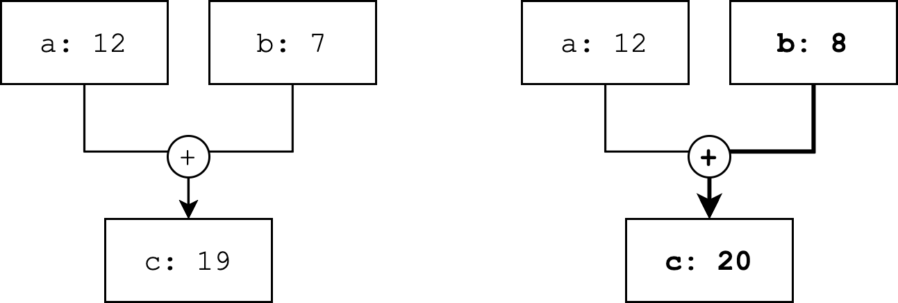
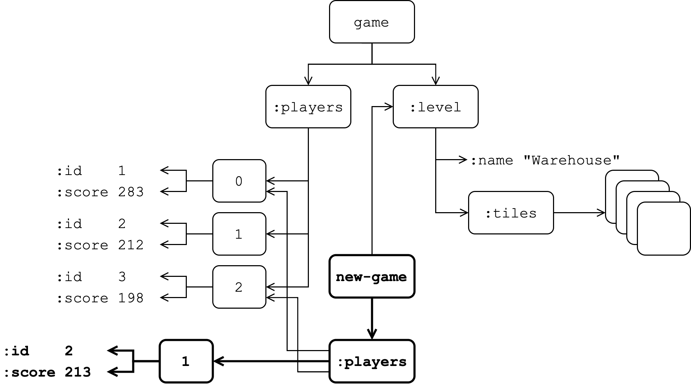

[UP](005_00.md)

### レッスン 27：プラットフォームとしてのReact

JavaScriptのマルチパラダイム性とは対照的に、ClojureScriptは関数型プログラミング体験を約束します。しかし、DOMとの対話が必要になった途端、私たちのコードは...関数型ではなくなってしまうことがわかりました。このレッスンでは、Reactの宣言的な性質がどのようにClojureScriptアプリケーションの完璧なプラットフォームになるかを探ります。Reactアプリケーションを書きますが、JSXやフック、状態管理にReduxやMobXのようなものを使うのではなく、ClojureScriptのデータ構造と、ここまで学んできたのと同じツールやテクニックを使います。

-----
このレッスンでは

- Reactが機能的なWebアプリケーションに最適なプラットフォームである理由を理解する
- ReactのDOM diffingがどのようにして宣言的なUIを書くことを可能にするかを見る
- 不変性を利用することで、純粋なコンポーネントをすぐに作成できることを学ぶ
-----

#### 関数型プログラミングモデル

その名が示すように、Reactはリアクティブプログラミングの考えに基づいて構築されています。リアクティブプログラミングの中核となる概念は、「プログラムとは、データがシステムをどのように流れるかを記述したものである」というものです。ある値は他の値から計算されることもあるため、ある値の変化が多くの追加の値に伝搬することもあります。具体的な例として、3つのセルがあるスプレッドシートを考えてみましょう。`A`、`B`、`C`の3つのセルがあり、`C`は`A`と`B`から計算されます。


リアクティブなスプレッドシートのセル

`A`と`B`のどちらかが変化すると、`C`も変化します。下流には`C`の値に依存する別の値があるかもしれませんが、その場合は`A`または`B`への変更が伝搬し続ける可能性があります。ここで、データ依存関係の連鎖の最終的な値が、ユーザーインターフェース全体を表すデータ構造であると想像してみてください。これで、UIをリアクティブなアプリケーションの状態に対する計算として記述する、すっきりとした概念的にシンプルな方法ができました。

このリアクティブなデータモデルは、関数型プログラミングと相性が良いです。前のレッスンで、状態の更新をどのようにモデル化したかを思い出してください。ハンドラーは、現在の状態（データ）とメッセージ（これもデータ）を受け取り、新しい状態を生成します。ここで、状態の変化が潜在的に多くの変換を経て新しい状態を生成するリアクティブモデルについて考えてみましょう。離散的な瞬間に適用される変換のグラフを考えると、不変的な値のシーケンスとして存在するアプリケーションがある計算モデルになります。これらの値のそれぞれは、DOMにレンダリングできるデータ構造で表されます。

JavaScriptからReactを使う場合は、そのデータ構造をJSXで表現し、ClojureScriptを使う場合は、通常のClojure(Script)のデータ構造を使います。DOMをどのように変異させるかを考える必要がないということは、これまでのDOM操作のような命令形のスタイルから解放されるということです。データを変換しているだけなので、私たちが目標としていたテスト可能性、関数型的な純粋さ、決定性のすべての利点を取り戻すことができます。

#### DOMディフィング

私たちの仕事は、アプリケーション全体を表すデータ構造を作ることです。しかし、何か変更があるたびにDOM全体を最初から再レンダリングするのは、単純なアプリ以外では信じられないほど遅く、非効率的です。ここでReactが活躍します。たとえDOMを表すデータ構造（仮想DOM）をゼロから再計算したとしても、Reactは実際にどのような変更が必要かを判断するために差分アルゴリズムを適用します。つまり、私たちの視点では、状態遷移のたびにゼロから再レンダリングしていることになりますが、Reactは私たちの仮想DOMと以前の仮想DOMを取得し、実際のDOMに必要な変分を適用して、仮想DOMと同期させているのです。

例として、トグルスイッチについて考えてみましょう。トグルは、`toggle-on`または`toggle-off`のクラスを持つ内側のスパンを持つdivとして表現することができます。これを次のように表現することができます。

```Clojure
(defn toggle-switch [on?]
  [:div {:class "toggle-switch"}
    [:span {:class (if on? "toggle-on" "toggle-off")}]])
```

このスイッチを含むアプリケーションが最初にロードされたとき、最初のレンダリングで、このトグルが `on?` を `false` にバインドして呼び出されたとします。Reactは以前に仮想DOMを持っていなかったことを確認するので、適切な属性を持つDOMノードを作成するための命令型コードを実行します。後のある時点で、ユーザーが `on?` を `true` にするアクションを実行したとします。生成された仮想DOMはこのようになります。

```Clojure
[:div {:class "toggle-switch"}
  [:span {:class "toggle-off"}]]
```

から、このようになります。

```Clojure
[:div {:class "toggle-switch"}
  [:span {:class "toggle-on"}]]
```

新しいデータ構造を返しているにもかかわらず、Reactは2つのデータを差分して、唯一の違いはspanのクラス名が変わったことだと判断し、変更された1つのピースだけをインテリジェントに更新します。アプリの状態が時間とともに変化していく中で、すべてのコンポーネントが何らかの形で変化する可能性のある多くのコンポーネントを組み合わせていくようになったとしても、変化のたびに世界全体をゼロからレンダリングし、実際のDOMと宣言した仮想DOMを一致させるために必要な最小限の変更だけを計算して行うReactのdiffingアルゴリズムに頼ることができると考えられます。

#### 高速なアプリの作成

Reactの機能的リアクティブプログラミングモデルとDOM diffingは、ClojureScript特有のものではありませんが、ClojureScriptには、Reactのプログラミングモデルにはるかに従順になる1つの側面があります：データはデフォルトで不変です。前のセクションでは、何かが変更されるたびに、アプリケーションを最初からレンダリングする方法について説明しました。多くの場合、これは十分に高速であり、更新のたびに仮想DOMツリー全体を再作成するような、かなり大規模なアプリケーションを作成することもできます。しかし、トグルの例に戻ると、トグルが非常に大きなアプリの一部であり、その状態が唯一の変更点である場合は、何百ものコンポーネントを再レンダリングする必要はありません。

##### 値の等価性

ClojureScriptのデータ構造が不変であることはすでに説明しましたが、データ構造にはもう1つ非常に便利な特性があります。これは、2つのデータ構造が同じ内容であれば、それらがメモリ上でまったく同じ構造を指しているかどうかにかかわらず、等しいとみなされることを意味します。これは、JavaScriptではそうではありません。例えば、次のようなコードを考えてみましょう。

```JavaScript
const xs = [1, 2, 3];
const ys = [1, 2, 3];
xs === ys; // false

const dog1 = { name: 'Fido' };
const dog2 = { name: 'Fido' };
dog1 === dog2; // false
```

等価性の観点から、JavaScriptは2つの配列や2つのオブジェクトがたまたま同じ内容であるかどうかを気にしません。メモリ上で全く同じオブジェクトを参照していなければ、それらは等しくないと考えます。これに対し、ClojureScriptでは、同じ型で同じ内容のデータ構造は等しいと考えます。JavaScriptの例をClojureScriptに翻訳すると、異なる結果になります。

```Clojure
(def xs [1 2 3])
(def ys [1 2 3])
(= xs ys) ;; true

(def dog1 {:name "Fido"})
(def dog2 {:name "Fido"})
(= dog1 dog2) ;; true
```

2つのClojureScriptコレクションは、その内容が異なる場合にのみ異なります。任意に入れ子になったデータ構造を考えてみましょう。入れ子になったプロパティを変更すると、その親は元の構造の親要素と等しくなくなることがわかります。この変更は、トップレベルのコレクションにまでカスケードされます。しかし、変更された要素からルートに戻るパスにないプロパティは影響を受けず、元の構造と更新された構造の間で等しい状態になります。これを例で説明しましょう。

```Clojure
(def game {:players [{:id 1 :score 283}
                     {:id 2 :score 212}
                     {:id 3 :score 198}]
           :level {:name "Warehouse"
                   :tiles [[:empty :empty :crate :wall-v :empty]
                           ;; ...
                           ]}})
(def game-new (update-in game [:players 1 :score] inc))    ;; <1>

(= (get-in game [:players 1 :score])                       ;; <2>
   (get-in game-new [:players 1 :score]))
;; false
(= (get-in game [:players 1]) (get-in game-new [:players 1]))
;; false
(= (get-in game [:players]) (get-in game-new [:players]))
;; false
(= game game-new)
;; false

(= (get-in game [:level]) (get-in game-new [:level]))      ;; <3>
;; true
(= (get-in game [:players 0]) (get-in game-new [:players 0]))
;; true
```

1. ネストしたプロパティの更新
2. 更新されたプロパティとルートの間のすべてが等しくない
3. 更新パスの外側のすべてが等しい

また、Clojureでは、2つのデータ構造が等しいかどうかをテストすることは、比較的安価な操作です。これは、ClojureScriptが構造共有を実装した永続的なデータ構造を使用していることに関係しています。これは、1つのデータ構造があり、それに何らかの変換を適用すると、結果として得られるデータ構造は、元のデータ構造のうち変更された部分のみを再現することを意味します。データ構造内のコレクションで更新の結果変化しなかったものは、メモリ内の全く同じコレクションを参照します。ClojureScriptが等値性チェックを行う際には、まず2つのオブジェクトが両方ともメモリ内の同じオブジェクトへの参照であるかどうかをテストします。これは非常に高速なテストで、データ構造の一部が共有されている場合には、このチェックによって、よりコストのかかる深い等値性チェックを省略することができます。


永続的なデータ構造

##### 純粋なコンポーネント

Reactでは、`React.Component`のインスタンスは、Reactが再レンダリングしようとすると、常にその仮想DOMを再計算します。一方、`React.PureComponent`のインスタンスは、そのpropsまたはstateのいずれかが前回のレンダリング時の値と等しくない場合にのみ、その仮想DOMを再計算します。Pure Componentは、`shouldComponentUpdate()`メソッドを実装することで、この最適化を実現しています。ClojureScriptでは、作成したコンポーネントはReact PureComponentsのように動作します。各コンポーネントは、不変のデータ構造でバックアップされるため、必要だとわかったときにのみ、その仮想DOMを再計算することになります。

JavaScriptでReactを使用する際に、`shouldComponentUpdate()`メソッドを手動で最適化したり、不変データや純粋なコンポーネントを使用することは可能ですが、ClojureScriptではこれらの最適化を無料で行うことができます。次のレッスンで見るように、Reagentフレームワークではさらに最適化されています。

#### まとめ

このレッスンでは、Reactのリアクティブプログラミングモデルが、純粋な関数型プログラミングの実践や不変のデータにいかに適合するかを学びました。また、Reactの仮想DOMにより、UIをデータ構造として表現し、Reactに効率的なレンダリングを任せることができることを学びました。最後に、不変データ、効率的な等号チェック、純粋なコンポーネントがどのように連携して、最適化されたレンダリングプロセスをすぐに提供するかを見ました。


[UP](005_00.md)
