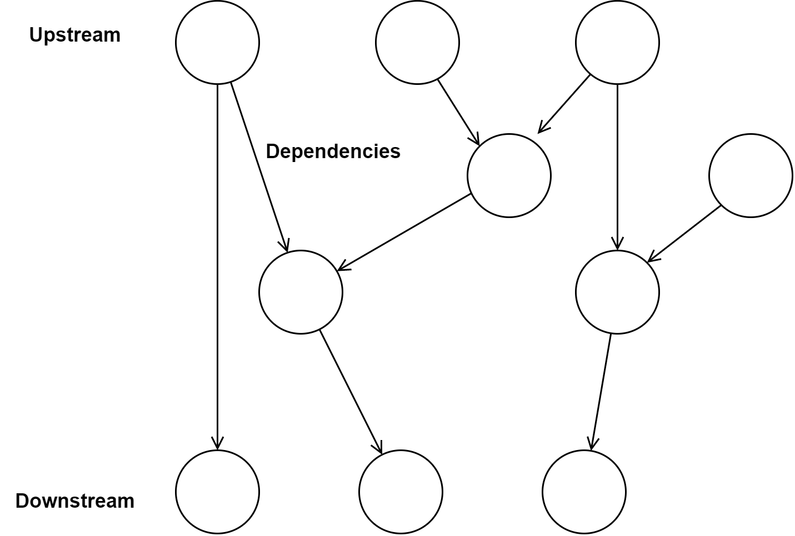
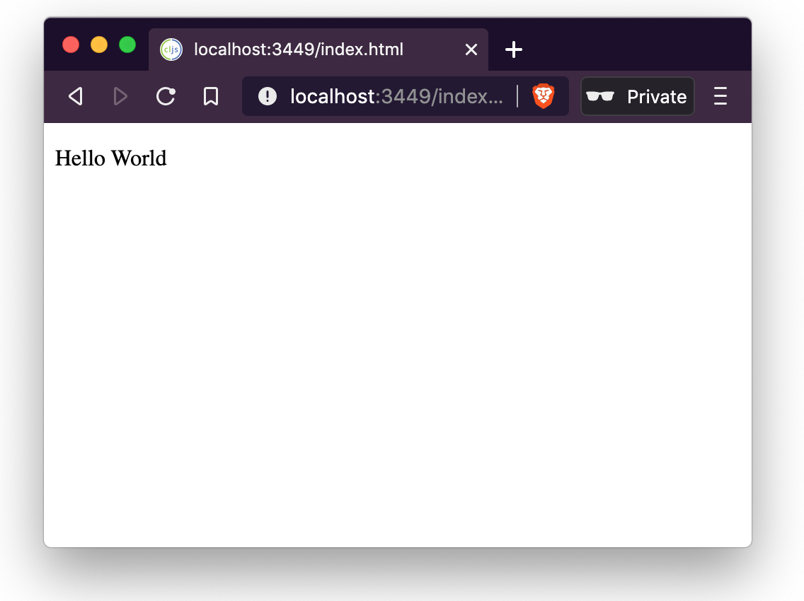

[UP](005_00.md)

### レッスン 28： ReagentでReactを使う

ReactがClojureScriptアプリケーションを書くのに適したプラットフォームであることを見てきましたが、まだコードは書いていません。ReactのAPIを直接使用することも可能ですが、ここではReagentを使用します。Reagentは非常にシンプルなAPIを提供しており、Reactのライフサイクルや複雑な状態管理に煩わされることなく、コンポーネントの作成に専念することができます。Reagentのコンポーネントは、[レッスン20](003_20.md)でContact Bookアプリケーションを書いたときに使用したのと同じhiccupスタイルのDOM表現を使用します。また、Reagentには状態管理が組み込まれており、アトムを使ってデータを追跡します。Reagentアプリケーションを書くプロセスは、[レッスン20](003_20.md)で使用したプロセスと似ていますが、状態が更新されたときに自動的かつ効率的に再レンダリングするためにReagentとReactに頼ることができる点が異なります。

-----
**このレッスンでは**

- (リアクティブ(反応型))アトムを使ったデータモデルの定義
- アプリケーションの状態を問い合わせ、更新する
- 異なるタイプのReagentコンポーネントの作成
-----

#### リアクティブデータ

前回のレッスンでは、Reactがリアクティブプログラミングモデルに従っていると述べました。これは、Reagentの状態管理にも当てはまります。Reagentにはリアクティブアトムと呼ばれる特殊なアトムが用意されており、このアトムがいつ参照されたか（すなわち、`@atom`や`(deref atom)`が呼ばれたか）を追跡することができます。Reagentのコンポーネント内でこのアトムが参照解除された場合、コンポーネントを再レンダリングするようにReagentに信号を送ります。値がどのようにリアクティブ(反応的)にシステムを流れるかを見るために、前章のスプレッドシートのセルの例を、Reagentの反応的なプリミティブのいくつかを使って作成してみる。まず、新しいFigwheelプロジェクトを初期化します。

```bash
$ clj -X:new :template figwheel-main :name learn-cljs/reagent-test :args '["+deps"]'
$ cd reagent-test
```

次に、`deps.edn`にreagentを依存関係として追加する必要があります。

```Clojure
:deps {;; Other deps...
       reagent/reagent {:mvn/version "1.0.0"}}
```

これで、Figwheel が生成するデフォルトの HTML ファイルの本文を、世界で最もシンプルなスプレッドシートの入力セルをいくつか含む HTML で置き換えることができます。

```html
<h1>Reactive Cells</h1>
<div>
  <label for="cell-a">A: </label>
  <input id="cell-a" type="number" value="0" />
</div>
<div>
  <label for="cell-b">B: </label>
  <input id="cell-b" type="number" value="0" />
</div>
<div>
  <label for="cell-c">C: </label>
  <input id="cell-c" readonly type="number" />
</div>
```
resources/public/index.html

これで、このページをReagentに接続して状態を管理する準備ができました。`learn-cljs.reagent-test`名前空間では、`A`と`B`のセルを表す2つのリアクティブ・アトムと、`C`のセルを表すリアクションを作成します。

```Clojure
(ns learn-cljs.reagent-test
    (:require [reagent.core :as r]                         ;; <1>
              [reagent.ratom :as ratom]                    ;; <2>
              [goog.dom :as gdom]
              [goog.events :as gevents]))

(def a-cell (r/atom 0))                                    ;; <3>
(def b-cell (r/atom 0))
(def c-cell
  (ratom/make-reaction                                     ;; <4>
    #(+ @a-cell @b-cell)))

(def a (gdom/getElement "cell-a"))
(def b (gdom/getElement "cell-b"))
(def c (gdom/getElement "cell-c"))

(defn update-cell [cell]
  (fn [e]
    (let [num (js/parseInt (.. e -target -value))]
      (reset! cell num))))

(gevents/listen a "change" (update-cell a-cell))           ;; <5>
(gevents/listen b "change" (update-cell b-cell))

(ratom/run!                                                ;; <6>
  (set! (.-value c) @c-cell))
```
src/reagenttest/core.cljs

1. `reagent.core` はリアクティブ版 `atom` を提供します。
2. `reagent.ratom`は、いくつかのリアクティブ・プログラミング・ユーティリティを提供する。
3. `a-cell`と`b-cell`はリアクティブ・アトムです。
4. `c-cell`は反応(リアクション)であり，他の反応(リアクティブ)アトムから値を得るアトムのように動作する
5. A または B の入力が変化したら、対応するセルを更新します。
6. `ratom/run!`を使って、`c-cell`が変更されるたびにCの入力を更新する。

この例を実行すると、`A`、`B`、`C` と書かれた 3 つの入力があるページが表示されます。`A` と `B` は通常の数値入力で、`C` は `A` と `B` を足し合わせた結果を表示する読み取り専用の入力です。`A`と`B`のセルには`reagent.core/atom`を使って反応(リアクティブ)アトムを作成します。これは通常のアトムのように動作し、そのアトムに依存する他の計算に変更を伝播することができます。次に、他の2つのセルに対する反応(リアクション)として、`C`セルを作成します。この反応の中で`a-cell`と`b-cell`のアトムを参照解除しているので、Reagentは`A→C`と`B→C`の間に依存関係を作り、`A`や`B`に変更があった場合に`C`の値が反応(リアクティブ)的に更新されるようにしています。反応(リアクション)として、`C`自体は読み取り専用の反応(リアクティブ)アトムとして動作し、また、他の反応(リアクション)の中で使用することができます。反応性(リアクティブ)アトムと反応(リアクション)のシステム全体が有向非環状グラフ（DAG）を形成し、「上流(upstream)」での変更が可能な限り「下流(downstream)」に自動的に伝播していきます。


有向非環状グラフ

リアクティブデータの概念については、後ほどデータ駆動型コンポーネントの作成に応用する方法をご紹介しますが、その前に、コンポーネント自体について見てみましょう。

#### コンポーネントの構築

Reagentコンポーネントは、仮想DOM構造を構築してReactに渡してレンダリングさせるための、非常にシンプルで宣言的な方法です。コンポーネントとは、単純に、hiccupのようなデータ構造を返す関数のことです。伝統を守るために、`p`タグの中に "Hello World "というテキストを表示するコンポーネントを作ってみましょう。

```Clojure
(defn hello []
  [:p "Hello World"])
```

これで終わりです。これが、単一の要素を定義する最初のReagentコンポーネントです。要素はタグを表し、最初の要素はタグ名のキーワードバージョン、オプションの2番目の要素は属性のマップを含むことができ、残りのアイテムはテキスト、他の要素、または他のReagentコンポーネントであることができる子です。

コンポーネントを手に入れて、さてどうする？このコンポーネントを実際のDOMにレンダリングする方法が必要です。これには`reagent-dom.render`関数を使います。この関数は2つの引数を取ります。Reagentコンポーネントと、それをレンダリングするDOMノードです。まず、このレッスンの残りの部分で使用する新しいReagentプロジェクトを作成しましょう。これは、ある日に何分運動したかを入力し、その運動量を経時的にグラフ化するという、非常にシンプルなアプリです。

```bash
$ clj -X:new :template figwheel-main :name learn-cljs/exercise-tracker :args '["+deps"]'
$ cd exercise-tracker
```

次に、前のセクションで行ったのと同じように、Reagentを依存関係として追加します（図示せず）。それでは、`hello`コンポーネントで`learn-cljs.exercise-tracker`名前空間を更新し、さらにこのコンポーネントをDOMにレンダリングしてみましょう。

```Clojure
(ns learn-cljs.exercise-tracker
  (:require [reagent.dom :as rdom]
            [goog.dom :as gdom]))

(defn hello []
  [:p "Hello World"])

(rdom/render
  hello                                                    ;; <1>
  (gdom/getElement "app"))                                 ;; <2>
```
src/exercisetracker/core.cljs

1. レンダリングするコンポーネント
2. コンポーネントをマウントするDOMノード

`clj -A:fig:build`を実行すると、Hello Worldが画面に出力されるのがわかります。


リエージェントのHello World


[UP](005_00.md)
