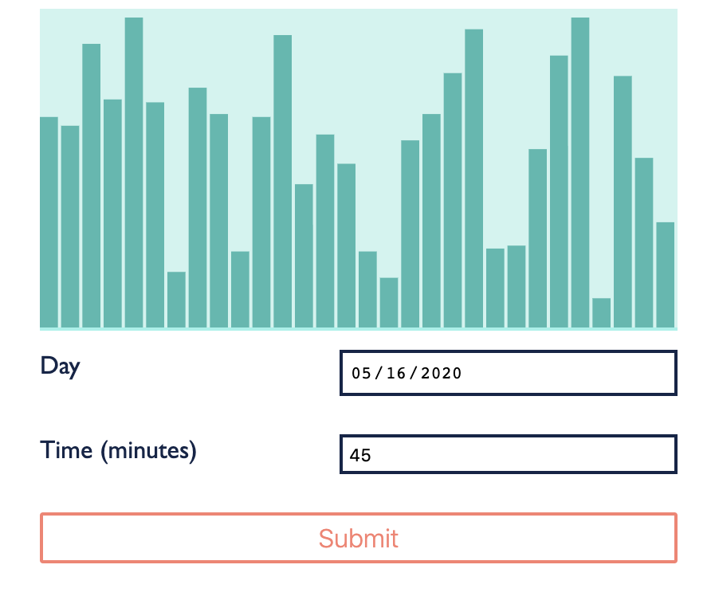

[UP](005_00.md)

### レッスン 28： ReagentでReactを使う

ReactがClojureScriptアプリケーションを書くのに適したプラットフォームであることを見てきましたが、まだコードは書いていません。ReactのAPIを直接使用することも可能ですが、ここではReagentを使用します。Reagentは非常にシンプルなAPIを提供しており、Reactのライフサイクルや複雑な状態管理に煩わされることなく、コンポーネントの作成に専念することができます。Reagentのコンポーネントは、[レッスン20](003_20.md)でContact Bookアプリケーションを書いたときに使用したのと同じhiccupスタイルのDOM表現を使用します。また、Reagentには状態管理が組み込まれており、アトムを使ってデータを追跡します。Reagentアプリケーションを書くプロセスは、[レッスン20](003_20.md)で使用したプロセスと似ていますが、状態が更新されたときに自動的かつ効率的に再レンダリングするためにReagentとReactに頼ることができる点が異なります。

-----
**このレッスンでは**

- (リアクティブ(反応型))アトムを使ったデータモデルの定義
- アプリケーションの状態を問い合わせ、更新する
- 異なるタイプのReagentコンポーネントの作成
-----

#### リアクティブデータ

前回のレッスンでは、Reactがリアクティブプログラミングモデルに従っていると述べました。これは、Reagentの状態管理にも当てはまります。Reagentにはリアクティブアトムと呼ばれる特殊なアトムが用意されており、このアトムがいつ参照されたか（すなわち、`@atom`や`(deref atom)`が呼ばれたか）を追跡することができます。Reagentのコンポーネント内でこのアトムが参照解除された場合、コンポーネントを再レンダリングするようにReagentに信号を送ります。値がどのようにリアクティブ(反応的)にシステムを流れるかを見るために、前章のスプレッドシートのセルの例を、Reagentの反応的なプリミティブのいくつかを使って作成してみる。まず、新しいFigwheelプロジェクトを初期化します。

```bash
$ clj -X:new :template figwheel-main :name learn-cljs/reagent-test :args '["+deps"]'
$ cd reagent-test
```

次に、`deps.edn`にreagentを依存関係として追加する必要があります。

```Clojure
:deps {;; Other deps...
       reagent/reagent {:mvn/version "1.0.0"}}
```

これで、Figwheel が生成するデフォルトの HTML ファイルの本文を、世界で最もシンプルなスプレッドシートの入力セルをいくつか含む HTML で置き換えることができます。

```html
<h1>Reactive Cells</h1>
<div>
  <label for="cell-a">A: </label>
  <input id="cell-a" type="number" value="0" />
</div>
<div>
  <label for="cell-b">B: </label>
  <input id="cell-b" type="number" value="0" />
</div>
<div>
  <label for="cell-c">C: </label>
  <input id="cell-c" readonly type="number" />
</div>
```
resources/public/index.html

これで、このページをReagentに接続して状態を管理する準備ができました。`learn-cljs.reagent-test`名前空間では、`A`と`B`のセルを表す2つのリアクティブ・アトムと、`C`のセルを表すリアクションを作成します。

```Clojure
(ns learn-cljs.reagent-test
    (:require [reagent.core :as r]                         ;; <1>
              [reagent.ratom :as ratom]                    ;; <2>
              [goog.dom :as gdom]
              [goog.events :as gevents]))

(def a-cell (r/atom 0))                                    ;; <3>
(def b-cell (r/atom 0))
(def c-cell
  (ratom/make-reaction                                     ;; <4>
    #(+ @a-cell @b-cell)))

(def a (gdom/getElement "cell-a"))
(def b (gdom/getElement "cell-b"))
(def c (gdom/getElement "cell-c"))

(defn update-cell [cell]
  (fn [e]
    (let [num (js/parseInt (.. e -target -value))]
      (reset! cell num))))

(gevents/listen a "change" (update-cell a-cell))           ;; <5>
(gevents/listen b "change" (update-cell b-cell))

(ratom/run!                                                ;; <6>
  (set! (.-value c) @c-cell))
```
src/reagenttest/core.cljs

1. `reagent.core` はリアクティブ版 `atom` を提供します。
2. `reagent.ratom`は、いくつかのリアクティブ・プログラミング・ユーティリティを提供する。
3. `a-cell`と`b-cell`はリアクティブ・アトムです。
4. `c-cell`は反応(リアクション)であり，他の反応(リアクティブ)アトムから値を得るアトムのように動作する
5. A または B の入力が変化したら、対応するセルを更新します。
6. `ratom/run!`を使って、`c-cell`が変更されるたびにCの入力を更新する。

この例を実行すると、`A`、`B`、`C` と書かれた 3 つの入力があるページが表示されます。`A` と `B` は通常の数値入力で、`C` は `A` と `B` を足し合わせた結果を表示する読み取り専用の入力です。`A`と`B`のセルには`reagent.core/atom`を使って反応(リアクティブ)アトムを作成します。これは通常のアトムのように動作し、そのアトムに依存する他の計算に変更を伝播することができます。次に、他の2つのセルに対する反応(リアクション)として、`C`セルを作成します。この反応の中で`a-cell`と`b-cell`のアトムを参照解除しているので、Reagentは`A→C`と`B→C`の間に依存関係を作り、`A`や`B`に変更があった場合に`C`の値が反応(リアクティブ)的に更新されるようにしています。反応(リアクション)として、`C`自体は読み取り専用の反応(リアクティブ)アトムとして動作し、また、他の反応(リアクション)の中で使用することができます。反応性(リアクティブ)アトムと反応(リアクション)のシステム全体が有向非環状グラフ（DAG）を形成し、「上流(upstream)」での変更が可能な限り「下流(downstream)」に自動的に伝播していきます。


有向非環状グラフ

リアクティブデータの概念については、後ほどデータ駆動型コンポーネントの作成に応用する方法をご紹介しますが、その前に、コンポーネント自体について見てみましょう。

#### コンポーネントの構築

Reagentコンポーネントは、仮想DOM構造を構築してReactに渡してレンダリングさせるための、非常にシンプルで宣言的な方法です。コンポーネントとは、単純に、hiccupのようなデータ構造を返す関数のことです。伝統を守るために、`p`タグの中に "Hello World "というテキストを表示するコンポーネントを作ってみましょう。

```Clojure
(defn hello []
  [:p "Hello World"])
```

これで終わりです。これが、単一の要素を定義する最初のReagentコンポーネントです。要素はタグを表し、最初の要素はタグ名のキーワードバージョン、オプションの2番目の要素は属性のマップを含むことができ、残りのアイテムはテキスト、他の要素、または他のReagentコンポーネントであることができる子です。

コンポーネントを手に入れて、さてどうする？このコンポーネントを実際のDOMにレンダリングする方法が必要です。これには`reagent-dom.render`関数を使います。この関数は2つの引数を取ります。Reagentコンポーネントと、それをレンダリングするDOMノードです。まず、このレッスンの残りの部分で使用する新しいReagentプロジェクトを作成しましょう。これは、ある日に何分運動したかを入力し、その運動量を経時的にグラフ化するという、非常にシンプルなアプリです。

```bash
$ clj -X:new :template figwheel-main :name learn-cljs/exercise-tracker :args '["+deps"]'
$ cd exercise-tracker
```

次に、前のセクションで行ったのと同じように、Reagentを依存関係として追加します（図示せず）。それでは、`hello`コンポーネントで`learn-cljs.exercise-tracker`名前空間を更新し、さらにこのコンポーネントをDOMにレンダリングしてみましょう。

```Clojure
(ns learn-cljs.exercise-tracker
  (:require [reagent.dom :as rdom]
            [goog.dom :as gdom]))

(defn hello []
  [:p "Hello World"])

(rdom/render
  hello                                                    ;; <1>
  (gdom/getElement "app"))                                 ;; <2>
```
src/exercisetracker/core.cljs

1. レンダリングするコンポーネント
2. コンポーネントをマウントするDOMノード

`clj -A:fig:build`を実行すると、Hello Worldが画面に出力されるのがわかります。


リエージェントのHello World

これは、何をするかという点では興味深いものではありませんが、構造については興味深いものがあります。副作用を実行する単一のエントリポイント（`rdom/render`の呼び出し）があり、UI自体（現在は単一のタグ）は完全に宣言的です。この構造を発展させて、必要な入力を受け付けるシンプルなフォームを作ることができます。繰り返しになりますが、このプロジェクトのCSSは書籍のリポジトリに掲載されていますが、このレッスンではスタイリングについては扱いません。

```Clojure
(defn date-input []
  [:div.input-wrapper                                      ;; <1>
    [:label "Day"]
    [:input {:type "date"}]])                              ;; <2>

(defn time-input []
  [:div.input-wrapper
    [:label "Time (minutes)"]
    [:input {:type "number" :min 0 :step 1}]])

(defn submit-button []
  [:div.actions
    [:button {:type "submit"} "Submit"]])

(defn form []
  [:form.input-form
    [date-input]                                           ;; <3>
    [time-input]
    [submit-button]])

(defn app []
  [form])

(rdom/render
  [app]
  (gdom/getElement "app"))
```

1. 要素に直接クラス名をつけることができる
2. HTML属性は、タグ名の後にマップとして与えることができます。
3. タグ名の代わりにReagentコンポーネントを指定することができます。

フォームができたので、その上にユーザーが入力したデータポイントを表示するチャートを追加してみましょう。まだ実際のデータが入っていないので、必要な形のデータ構造をスタブアウトして、実際の入力をリアクションによってこの形に変換することは後で考えることにしましょう。

```Clojure
(defn- random-point []
  (js/Math.floor (* (js/Math.random) 100)))

(defonce chart-data
  (let [points (map random-point (range 30))]              ;; <1>
    (r/atom {:points points
             :chart-max (reduce max 1 points)})))

(def chart-width 400)
(def chart-height 200)
(def bar-spacing 2)

(defn chart []
  (let [{:keys [points chart-max]} @chart-data             ;; <2>
        bar-width (- (/ chart-width (count points))
                     bar-spacing)]
    [:svg.chart {:x 0 :y 0
                 :width chart-width :height chart-height}
      (for [[i point] (map-indexed vector points)          ;; <3>
            :let [x (* i (+ bar-width bar-spacing))        ;; <4>
                  pct (- 1 (/ point chart-max))
                  bar-height (- chart-height (* chart-height pct))
                  y (- chart-height bar-height)]]
        [:rect {:key i                                     ;; <5>
                :x x :y y
                :width bar-width
                :height bar-height}])]))

;; ...
;; Change the app function to render the chart too
(defn app []
  [:div.app
    [chart]
    [form]])
```

1. 各ポイントに0～99の乱数を生成する
2. `chart-data`を参照すると、このコンポーネントが反応するようになる
3. `(map-indexed vector xs)`は、`[idx x]`のベクトルのシーケンスを生成する。
4. 各バーの描画に必要なデータを計算する
5. Reactのように、シーケンスの各アイテムは一意のキーを持つ必要がある

#### 状態の更新

入力の値を得るためにDOMに問い合わせをしていたチャットアプリケーションとは異なり、ここでは、入力データをステートに入れ、コンポーネントにステートから値をレンダリングさせることで、責任を逆転させます。ユーザーが入力に変更を加えたときには、その変更をステートに伝搬させ、それによってコンポーネントが再レンダリングされるようにしたいのです。ReactとReagentは、入力の値がUIステートによって制御されることから、この種の入力処理を制御された入力と呼んでいます。制御された入力コンポーネントを作成する最も簡単な方法は、Reagentコンポーネントのわずかなバリエーションを使用することです。

```Clojure
(defn- current-date-string [d]
  (let [pad-zero #(.padStart (.toString %) 2 "0")
        y (.getFullYear d)
        m (-> (.getMonth d) inc pad-zero)
        d (pad-zero (.getDate d))]
    (str y "-" m "-" d)))

(defonce state
  (r/atom {:inputs {:date (date-string (js/Date.))
                    :minutes "0"}}))
```

これで、入力コンポーネントの中で`state` atomを参照するだけで、stateが変化するたびに自動的に再レンダリングされるようになります。

```Clojure
(defn date-input []
  [:div.input-wrapper
    [:label "Day"]
    [:input {:type "date"
             :value (get-in @state [:inputs :date])}]])
```

アプリをロードすると、日付入力には今日の日付が、時間入力には`0`が入力されます。これらの入力を更新しようとすると、変更できないことがわかります。これは、これらの値がUIの状態によって設定されているためで、Reactは制御されている入力の値を更新することを許可しません。解決策としては、各コンポーネントに `on-change` ハンドラを追加し、ステート内の適切な値を入力の新しい値で更新します。

```Clojure
(defn date-input []
  [:div.input-wrapper
    [:label "Day"]
    [:input {:type "date"
             :value (get-in @state [:inputs :date])
             :on-change #(swap! state assoc-in [:inputs :date]
                           (.. % -target -value))}]])
```

##### コンポーネントのセットアップ

これで、入力を更新できるようになりました。入力を変更すると、`state`の値が更新され、更新された値でコンポーネントが再レンダリングされます（`state`を参照しているため）。これは動作しますが、パフォーマンス的には理想的ではありません。なぜなら、`state`が変更されるたびに、Reagentはこのコンポーネントを再レンダリングしようとするからです。大規模なアプリでは、ステートフルなコンポーネントが、ステートの一部が変化するたびに再レンダリングしようとすると、これは深刻なパフォーマンス問題を引き起こす可能性があります。代わりに必要なのは、アプリの状態の一部が変化したときだけ、つまりこの場合は適切な入力値が変化したときだけに変化するリアクションです。これは非常に一般的な使用例なので、Reagentはカーソルと呼ばれるユーティリティを提供しています。カーソルは、他のリアクティブアトムの中の特定の場所を指すリアクティブアトムのように動作します。その場所の値が更新されると、カーソルが更新され、カーソルを参照しているすべてのコンポーネントが更新されます。さらに、カーソルは`swap!`や`reset!`で更新することもでき、その変更は基礎となる状態に反映されます。

これらのカーソルは、名前空間のレベルで変数として作成することもできますが、その使用は実質的に1つのコンポーネントに限定されるため、入力のセットアップステップとして作成することができます。先ほど作成したコンポーネントは、Reagentでサポートされている最もシンプルなタイプです。これらは、レンダリングしたいDOM（hiccupとして表現される）に対して評価する関数です。Reactの用語では、これらのコンポーネントは単純なレンダリング関数です。しかし、Reagentでは、コンポーネント関数がレンダー関数を返すことで、コンポーネントのセットアップを行うことができます。これにより、入力状態へのカーソルを作成し、このカーソルを利用したレンダリング関数を返すことができます。

```Clojure
(defn date-input []
  (let [val (r/cursor state [:inputs :date])]              ;; <1>
    (fn []
      [:div.input-wrapper
        [:label "Day"]
        [:input {:type "date"
                 :value @val                               ;; <2>
                 :on-change #(reset! val                   ;; <3>
                               (.. % -target -value))}]])))
```

1. コンポーネントがマウントされる前に、一度カーソルを作成する
2. このコンポーネントをリアクティブにするために、カーソルを非参照にする
3. カーソルによる状態の更新

setup付きのコンポーネントを使用する場合、setupステップはコンポーネントがマウントされたときにのみ実行されますが、setupステップが返すrender関数は、コンポーネントの状態が更新されるたびに呼び出されます。setupステップは、Reactの`componentWillMount()`ライフサイクルメソッドに大まかに相当します。

**やってみよう**

`date-input`コンポーネントにいくつかの更新を行いました: 状態からの値の表示、状態の更新、カーソルを使ったレンダリングの最適化です。`time-input`コンポーネントにも同様の変更を加えてみてください。

最後に、フォームの送信について説明します。ユーザーがフォームを送信すると、日付文字列をキーとし、その日に行った運動の分数を値とする`data`マップのエントリを設定します。また、フォーム送信時には、フォームの入力項目もデフォルトの状態に戻す必要があります。このような状態の変更を行う関数を書き、`form`コンポーネントの送信時ハンドラとして呼び出しましょう。

```Clojure
(defn initial-inputs []
  {:date (date-string (js/Date.))
   :minutes "0"})

(defonce state
  (r/atom {:inputs (initial-inputs)
           :entries {}}))

;; ...

(defn submit-form [state]
  (let [{:keys [date minutes]} (:inputs state)]
    (-> state
        (assoc-in [:entries date] (js/parseInt minutes))
        (assoc :inputs (initial-inputs)))))

(defn form []
  [:form.input-form {:on-submit (fn [e]
                                  (.preventDefault e)
                                  (swap! state submit-form))}
    ;; ...
  ])
```

ユーザーの入力処理がすべて完了したので、次はリアクションを使って、自動的に同期されたUIの状態を計算してコンポーネントに提供するライブクエリを書く方法を見ていきます。

#### リアクティブクエリの記述

これまでのところ、レンダリングしたい状態（入力値）は、レンダリングするコンポーネントに1対1でマッピングされていましたが、チャートの場合は、チャートをレンダリングする前にデータを再形成したいと考えています。チャートのスタブとして使用する偽のデータを作成したときに、左から右にレンダリングされるべきポイントのシーケンスと、Y軸の高さを決定するための最大値を指定しました。しかし、この状態では、日付から数字へのマップが含まれています。ユーザーが入力した数字があればそれを、なければ`0`を使って、過去30日間のデータのシーケンスを生成する関数を書くことができます。次に、基礎となる `:entries` マップが変更されたときにチャートデータを再計算するリアクションを作成できます。

```Clojure
(defn get-points [entries]
  (let [ms-in-day 86400000
        chart-days 30
        now (js/Date.now)]
    (map (fn [i]
           (let [days-ago (- chart-days (inc i))
                 date (date-string (js/Date. (- now (* ms-in-day days-ago))))]
             (get entries date 0)))
         (range chart-days))))

(defn chart []
  (let [entries (r/cursor state [:entries])                ;; <1>
        chart-data (ratom/make-reaction                    ;; <2>
                    #(let [points (get-points @entries)]
                      {:points points
                       :chart-max (reduce max 1 points)}))]
    (fn []                                                 ;; <3>
      ;; ...
    )))
```

1. カーソルを取得して、`:entries`が変更されたときだけリアクションを再実行するようにする
2. `:entries`が変更されるたびにチャートデータを再計算するリアクションを作成します。
3. `chart-data`リアクションを参照するレンダー関数を返す

ここでは、`chart`コンポーネントを更新して、コンポーネントのセットアップを含むReagentコンポーネントのより高度なフォームを使用します。セットアップでは、まず、ステートの`:entries`キーにカーソルを取得します。これは厳密には必要ではありませんが、ステートが更新されるたびにリアクションを実行するのではなく、エントリーが変更されたときだけリアクションを実行することができます。次に、`reagent.ratom/make-reaction`を使ってリアクションを作成します。私たちが提供する関数は`entries`カーソルを参照するので、カーソルが変更されるたびにReagentはこのリアクションの値を再計算します。注意すべき重要な点は、レンダー関数のボディが全く変化していないことです。状態外で照会しているデータの形状は、コンポーネントが期待しているものと一致しているので、変更の必要はありません。

これでアプリは完全に機能するようになりました。フォームを使ってエントリーを追加すると、その変更は`entries`カーソルを通って、`chart-data`リアクションに伝わり、最後に`chart`コンポーネントのrender関数に伝わります。これらのリアクションは、状態へのライブクエリと考えることができます。一度設定すれば、自動的にコンポーネントにデータの流れを提供してくれます。Reagentが奨励しているこのデータ中心のアプローチは、慣用的なClojureScriptに完璧にフィットします。


エクササイズ・トラッカー アプリ

**チャレンジ**

このアプリケーションには永続性がなく、ページがリロードされるとリセットされます。`localStorage`を使って簡単な永続性を追加してみてください。

#### まとめ

このレッスンでは、UIレンダリングと状態管理の両方にReagentを使用する方法を学びました。Reagentがどのようにして宣言型コンポーネントを実現し、それらのコンポーネントをアプリケーションの状態と同期させるためのリアクティブプログラミングを、必須の「グルー」コードなしに実現するかを見た。リアクティブアトム、カーソル、リアクションなど、いくつかのシンプルなプリミティブを使うだけで、ステートフルなアプリケーションを、わずかなコードラインで簡単に作成することができました。また、いくつかの異なるタイプのReagentコンポーネントを見て、コンポーネントにセットアップが必要かどうかに応じて選択することができました。

[NEXT](005_29.md)

[UP](005_00.md)
