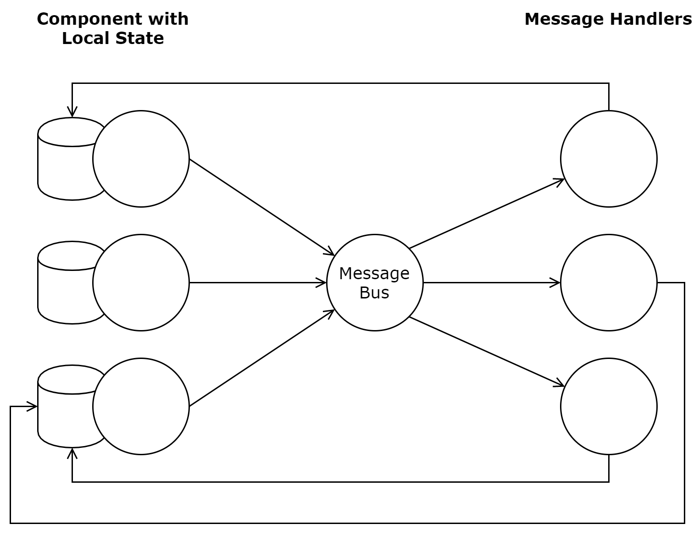
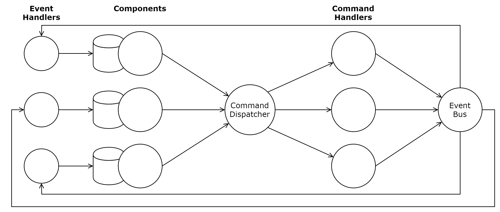
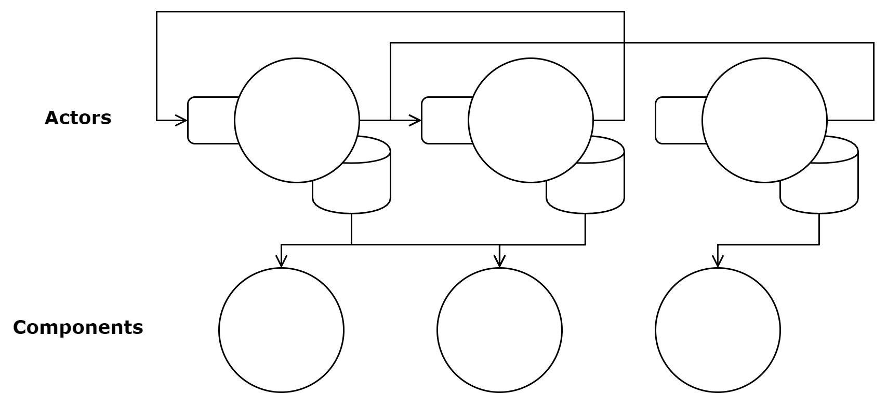

[UP](005_00.md)

### レッスン 29：懸念事項の分離

試薬(Reagent)アプリケーションを構築する際には、2つの大まかな戦略があります。1つ目は、すべての状態を単一のアトムに保つことで、これは前回のレッスンで使用したアプローチです。2つ目は、ステートの異なる部分を別々に保ち、それらの間で非同期通信を使用する方法です。1つ目の方法はシンプルで説明しやすいですが、2つ目の方法は、複数のチームで開発される可能性のある大規模なUIを作成する際に便利です。これは、マイクロフロントエンドのアイデアに適しています。異なるチームが、別々のビジネスイニシアチブや機能領域に関連した異なるコンポーネントを維持し、これらのコンポーネントはメッセージングを介して他のチームのコンポーネントと対話することができます。このレッスンでは、第1のアプローチについて説明した後、第2のアプローチの基本を説明します。

-----
**このレッスンでは**

- 非結合コンポーネントの作成
- UI内で通信するためのさまざまなメッセージングパターンを探る
- ビジネスロジックをフロントエンドのAPIに移行する
-----

#### チャネルによるコンポーネントの接続

ClojureScriptでは、`core.async`で迅速かつシンプルなメッセージングに必要なメカニズムがすべて提供されているので、それを利用します。共有状態やリアクティブプログラミングではなく、コンポーネントローカルの状態とメッセージングを使用したい場合が2つあります。それは、複数のアプリケーションで再利用・統合できるモジュラーコンポーネントを作成する場合と、通知、ツアー/オンボーディングウィジェット、プログレスバーなどの補助的な（サービス的な）機能を提供するコンポーネントを提供する場合です。このレッスンでは、状態を管理しつつ、`core.async`チャネルを使って通信する通知コンポーネントを実装します。

まず、レッスン26で使用したものと同様のメッセージバスパターンを使用して、コンポーネントが単一の共通メッセージバスに対してパブリッシュおよびサブスクライブできるようにします。

```Clojure
(ns learn-cljs.notifications
    (:require [cljs.core.async :refer [go-loop pub sub chan <! put!]]))

(defonce msg-ch (chan 1))
(defonce msg-bus (pub msg-ch ::type))

(defn dispatch!
 ([type] (dispatch! type nil))
 ([type payload]
  (put! msg-ch {::type type
                ::payload payload})))
```

> **注：名前空間とキーワード**
>
> 標準的なClojureScriptのキーワードは、単一のコロンで始まり、その後に識別子として有効な1つまたは複数の文字が続きます（例： `:i-am-a-keyword`）。しかし、キーワードは、同じ名前を持つ他のキーワードと区別するために名前空間を含むことができます。例えば、`:genre/rock`と`:terrain/rock`は、名前は `"rock"`で同じですが、名前空間は異なります。名前空間付きキーワードを作成するには、キーワード名の前に名前空間とフォワードスラッシュを付ける方法と、ダブルコロンでキーワードを開始する方法の2種類があります。ダブルコロンのバージョンでは、現在の ClojureScript 名前空間をキーワードの名前空間として使用するので、 `learn-cljs.notifications.pubsub` という名前空間内で `::type` として参照されるキーワードは、 `:learn-cljs.notifications.pubsub/type` としても参照されます。名前空間を使ったキーワードは、複数の貢献者がいる大きなプロジェクトでは特によく見られます。

レッスン26で使用したメッセージ・バスとは異なり、`dispatch!`関数は`msg-ch`チャンネルに発するようにハードコードされています。同様に、コンポーネントも `msg-bus` がスコープ内にあることを前提としています。それでは、通知コンポーネントを作成してみましょう。

```Clojure
(def initial-state
  {:messages []
   :next-id 0})

(defn add-notification [state id text]
  (-> state
      (update :messages conj {:id id
                              :text text})
      (assoc :next-id (inc id))))

(defn remove-notification [state id]
  (update state :messages
    (fn [messages]
      (filterv #(not= id (:id %)) messages))))             ;; <1>

(defn notifications []
  (let [state (r/atom initial-state)]                      ;; <2>
    (listen-for-added! state)                              ;; <3>
    (fn []
      [:div.messages
        (for [msg (:messages @state)                       ;; <4>
              :let [{:keys [id text]} msg]]
          ^{:key id}
          [:div.notification.is-info
            [:button.delete {:on-click #(swap! state remove-notification id)}]
            [:div.body text]])])))
```

1. `filterv`は`filter`と同様に動作しますが、ベクターを返します。
2. コンポーネントのセットアップ時に、初期状態をリアクティブ・アトムにロードする
3. この機能(関数)は次に実装します
4. このアトムを参照すると、コンポーネントはリアクティブになります。

このコンポーネントの状態は、メッセージのコレクションと、次のidを追跡するためのインクリメント・カウンタという、非常にシンプルなものです。また、状態にメッセージを追加したり、状態からメッセージを削除するための2つの関数も用意しています。次に、 `::add-notification`メッセージをこのコンポーネントに受信させる`listen-for-added!`関数を定義します。

```Clojure
(defn listen-for-added! [state]
  (let [added (chan)]
    (sub msg-bus ::add-notification added)
    (go-loop []
      (let [text (::payload (<! added))
            id (:next-id @state)]
        (swap! state add-notification id text)
        (js/setTimeout #(swap! state remove-notification id) 10000)
        (recur)))))
```

この関数によって作られた`go-loop`は、 `::add-notification`トピックからメッセージを受け取り、すでに定義した`add-notification`関数を使ってmessages vectorに追加します。また、`10000`ミリ秒後にメッセージを削除するタイマーを設定します。

コンポーネントの状態に通知を追加するためにメッセージ・バスからメッセージを消費しますが、このコンポーネントのレンダリング機能は、そのデータがどのようにして状態に入るかについては不可知であることに注意してください。この通知コンポーネントを、単一のアトムで全体の状態を管理するアプリケーションにプラグインするのは簡単なことです。レンダリング関数はそのままで、コマンドハンドラ関数とコンポーネントセットアップ関数を変更するだけで済みます。

さて、プラグイン可能な通知コンポーネントができたので、別のコンポーネントを接続して通知を発行することができます。例として、ユーザーの姓名を入力し、フォームが送信されたときに挨拶を発する簡単なフォームを作ってみましょう。

```Clojure
(defonce form-state (r/atom {:first-name ""                ;; <1>
                             :last-name ""}))

(defn update-value [e field]                               ;; <2>
  (swap! form-state assoc field (.. e -target -value)))

(defn submit-form []                                       ;; <3>
  (let [{:keys [first-name last-name]} @form-state]
    (dispatch! ::add-notification
      (str "Welcome, " first-name " " last-name)))
  (swap! form-state assoc :first-name ""
                          :last-name ""))

(defn input-field [key label]                              ;; <4>
  [:div.field
    [:label.label label
    [:div.control
      [:input.input {:value (get @form-state key)
                     :on-change #(update-value % key)}]]]])

(defn input-form []
  [:div.form
    [input-field :first-name "First Name"]                 ;; <5>
    [input-field :last-name "Last Name"]
    [:div.field
      [:button.button {:on-click submit-form}
        "Add"]]])
```

1. フォームの状態を管理するリアクティブ・アトム
2. 入力フィールドのイベントハンドラ
3. 送信ボタンクリックのイベントハンドラ
4. 入力フィールドコンポーネント
5. 引数はコンポーネント関数の直後の要素として渡される

前のレッスンの後では、これはかなり標準的なReagentコンポーネントのように見えるはずです。フォームの状態を保持するリアクティブ・アトムを作成し、入力と送信ボタンのコンポーネントを作成しています。このコードで興味深いのは、`submit-form`関数が通知コンポーネントから切り離されていることです。このように分離されたコンポーネントを作成することの欠点は、あるアクションの結果をコードで追跡して、その結果を正確に知ることが難しくなることです。結果は、 `::add-notification`トピックにサブスクライブされているもの（もしあれば）に依存します。

**やってみよう**

この例を、入力フォーム、notificationsコンポーネント、メッセージング・レイヤーのそれぞれの名前空間に分解してみてください。キーワードの前にダブルコロンを付けると、そのキーワードが出現する名前空間と同じ名前の名前空間になることを覚えておいてください。

#### メッセージのパターン

非同期メッセージングを構成して、コンポーネント同士や調整ロジックから切り離すという目的を達成するには、さまざまな方法があります。ここでは、ダイレクトパブサブ、コマンド/イベント、アクターなど、大まかなメッセージングのカテゴリを紹介します。これらのアプローチは、シンプルさとモジュール性の間のトレードオフに対して、それぞれ異なるアプローチをとっています。

##### ダイレクトパブリッシュ/サブスクライブ

ダイレクトパブリッシュ/サブスクライブ（またはパブサブ）パターンは、上の例で使用したものです。1つのチャンネルからメッセージを受け取り、そのトピックに登録されているすべてのサブスクライバチャンネルにメッセージをブロードキャストするメッセージバスがあります。この方法では、どのコンポーネントでもメッセージを発行でき、どのコンポーネントでもメッセージを聞くことができるという柔軟性を最大限に活かしています。このパターンは、直接の関数呼び出しをメッセージディスパッチに置き換えるものです。


ダイレクト・パブサブ・メッセージング

この柔軟性は、このパターンのデメリットでもあります。関数の呼び出しには大きな制約があり、ある関数から別の関数への実行を簡単に追跡することができます。これまで何度か説明してきた実行の純粋な置換モデルについて考えると、プログラムは1つの大きな関数のように見えます。非同期メッセージングはこのパラダイムを崩し、プログラムを複数のプログラムとして考えなければなりません。これらのプログラムはすべて他の人の行動を観察し、それに応じて反応することができます。ダイレクト・パブサブの複雑さは、小さなアプリケーションであれば簡単に管理できますが、いくつかの制約を課すパターンが必要になることもあります。

##### コマンド/イベント

通知コンポーネントの例では、フォームは `::add-notification` メッセージを送信しました。もし、他に必要なアクションがあった場合（フォームをAPIに送信するなど）、APIハンドラーに特定の `::add-notification` メッセージをリッスンさせるか、フォーム送信ハンドラーに実行すべき新しいアクションを認識させるか、という厄介な選択を迫られることになります。メッセージングの目的は、コンポーネントを互いに切り離し、プレゼンテーション・ロジックとビジネス・ロジックを分離することなので、コンポーネントがトリガーする必要のあるアクションについては、不可知論的にしておきたいと思います。これを実現する一つの方法は、Command/Eventパターンです。

このパターンでは、コンポーネントはコマンドを送信しますが、別のレイヤーが各コマンドを処理し、他のシステムが反応する可能性のあるゼロまたは複数のイベントを発行します。通知の例では、`dispatch!` 関数を、各タイプのコマンドを専用のハンドラに明示的に委譲する関数に置き換えることができます。


コマンド/イベント メッセージング

```Clojure
(defonce evt-ch (chan 1))
(defonce evt-bus (pub evt-ch ::type))

(defn emit!
 ([type] (emit! type nil))
 ([type payload]
  (put! evt-ch {::type type
                ::payload payload})))

;; ... Other handlers

(defn handle-user-form-submit! [form-data]
  (let [{:keys [first-name last-name]} form-data]
    ;; ... emit other events
    (emit! :notification/added (str "Welcome, " first-name " " last-name))))

(defn dispatch! [command payload]
 (case command
   ;; ... handle other commands
   :user-form/submit! (handle-user-form-submit! payload)))
```

新しい`dispatch!`関数は、通常の同期関数で、特定のコマンドの処理を専門のハンドラ関数に委ねます。ここでは、`:user-form/submit!`コマンドは、`handle-user-form-submit!`によって処理されます。実際のアプリケーションでは、このハンドラは、APIコールや追加のイベントを発行するなど、他のことも行うと思いますが、ここではシンプルに、notificationコンポーネントが表示するためのイベントを発行するだけにします。

コマンド用のpubsubパターンを直接の関数ディスパッチに置き換えましたが、イベント用にはそれを維持しています。実際、`evt-ch`, `evt-bus`, `emit!` は、pubsub バージョンの `msg-ch`, `msg-ch`, `dispatch!` をリネームしただけのものですが、その目的がコマンドではなくイベントメッセージのみを伝えることであることを除いては、同じです。このバージョンで変更する必要があるUIの唯一の部分は、通知コンポーネントが `evt-bus` の `:notification/added` トピックを購読することです。

```Clojure
(defn listen-for-added! [state]
  (let [added (chan)]
    (sub evt-bus :notification/added added)
    ;; ...
  ))
```

ダイレクト・パブリッシュ／サブスクライブではなく、コマンド／イベント・パターンを使用する際に必要となるトレードオフは、ボイラープレート・コードです。すべてのメッセージ・ハンドリング・ロジックをコンポーネントに埋め込む代わりに、コマンド・ハンドラ・レイヤを維持する必要があります。メリットは、アプリケーションで送受信されるメッセージを変更する必要がある場合、変更する必要がある場所が1箇所で済むことです。一方、サブスクライバを識別して変更する必要がある数には制限がありません。

##### アクターシステム

最後に、Erlang/ElixirとAkkaフレームワークから借りてきたもう1つのメッセージングパターン、アクターについて見てみましょう。アクターはメールボックスを持つ概念的なエンティティで、ある時点で行動するためのメッセージを受け取ることができます。アクターは、他のアクターのメールボックスにもメッセージを送ることができ、プログラムで生成・破棄することができます。ErlangやElixirとは異なり、Clojureはアクターをネイティブにサポートしていませんが、`core.async`が提供するCSPモデルの並行処理を使って、アクターを簡単にエミュレートすることができます。例えば、いくつかの関数を使うだけで、簡単なアクターシステムを作ることができます。

```Clojure
(defn actor-system []                                      ;; <1>
  (atom {}))

(defn send-to! [system to msg]
  (when-let [ch (get @system to)]
    (put! ch msg)))

(defn actor [system address init-state & {:as handlers}]
  (let [state (r/atom init-state)                          ;; <2>
        in-ch (chan)]
    (swap! system assoc address in-ch)                     ;; <3>
    (go-loop []
      (let [[type & payload] (<! in-ch)]
        (when-let [handler (get handlers type)]
          (apply handler state payload))                   ;; <4>
        (recur)))
    state))
```
基本的なアクターシステム

1. アクターシステムは、チャネルへのアドレスの可変型マップとして表現されます。
2. 各アクターは、リアクティブ・アトムで状態を保持する
3. アクターをシステムに登録する
4. メッセージの種類に応じて特定のハンドラにディスパッチする

このアクターシステムでは、アプリケーションの状態を個別に管理するアクターを作成することができます。このシンプルな実装では、`actor-system` 関数を使用して単一のアクターシステムを作成し、`actor` 関数を使用して任意の数のアクターを宣言することができます。多くのアクターの実装とは異なり、このアクター関数は、アクターの状態を表すリアクティブ・アトムを返し、それをReagentコンポーネントで参照することができます。アクター自体は、継続的にメールボックスからメッセージを読み込んで、宣言したハンドラ関数にディスパッチするGoループとして動作します。これを通知の例に適用する方法を見てみましょう。

```Clojure
(defonce sys (actor-system))                               ;; <1>

;; ...                                                     ;; <2>

(defonce notification-state
  (actor sys 'notifications                                ;; <3>
    {:messages []
     :next-id 0}

    :add-notification
    (fn [state text]
      (let [id (:next-id @state)]
        (swap! state add-notification id text)
        (js/setTimeout
          #(send-to! sys 'notifications
             [:remove-notification id])
          10000)))

    :remove-notification
    (fn [state id]
      (swap! state remove-notification id))))

(defonce form-state
  (actor sys 'input-form
    {:first-name ""
     :last-name ""}

    :update
    (fn [state field value]
      (swap! state assoc field value))

    :submit
    (fn [state]
      (let [{:keys [first-name last-name]} @state]
        (send-to! sys 'notifications
          [:add-notification (str "Welcome, " first-name " " last-name)]))
      (swap! state assoc
        :first-name ""
        :last-name ""))))

(defn notifications []
  [:div.messages
    (for [msg (:messages @notification-state)              ;; <4>
          :let [{:keys [id text]} msg]]
      ^{:key id}
      [:div.notification.is-info
        [:button.delete
          {:on-click #(send-to! sys 'notifications         ;; <5>
                        [:remove-notification id])}]
        [:div.body text]])])

;; ...                                                     ;; <6>
```
アクターシステムの使用例

1. 一つのアクターシステムを宣言する
2. `add-notification`と`remove-notification`は変更されません。
3. シンボル`'notifications`をアドレスに持つアクターを宣言する
4. `notification-state`は単なるリアクティブ・アトムであり、参照することができる
5. 状態の更新は、メッセージをアクターに送ることで行われるようになった
6. 残りのコンポーネントは、新しい概念を示すものではないので省略します。


アクターシステム・メッセージング

このパターンの明確な利点は、ステートを更新する可能性のあるすべての関数のすぐ隣でステートを宣言できるため、ビジネスロジックのトレースが容易になることです。単一のコンポーネントでのみ使用されるステートの場合、このパターンはコンポーネントのセットアップ時にアトムを作成することに比べて大きな利点はありませんが、共有されるステートの場合、このパターンはステートの管理方法を簡素化することができます。

**クイックレビュー**

- Command/Eventパターンでは、（APIコールのような）副作用はどこで実行されるべきでしょうか？
- 小規模なアプリケーションでは、どのメッセージングパターンが最もシンプルですか？
- Actorパターンは、1つのコンポーネントと多くのコンポーネントのどちらからアクセスされるステートに適していますか？

#### クライアント/サーバーアーキテクチャ

状態を更新するビジネスロジックからビューコンポーネントを切り離すと、状態管理をクライアント上のAPIとして考えることができるようになります。このようなプログラミング方法は、プレゼンテーションとビジネスロジックの懸念を分離するための明確な境界線を提供し、より保守性の高いコードにつながります。さらに、状態管理をUIから切り離せば、コンポーネントの外にあるバックエンドAPIレイヤーとの間でデータをやり取りすることも可能になります。このように分離することで、バックエンドAPIとコンポーネントが独立して動作する方法を自由に変えることができるため、柔軟性が高まります。例えば、バックエンドから送られてきたデータをレンダリングする前に再形成する必要がある場合、それはフロントエンドAPIレイヤーで行うことができます。

このフロントエンドAPIは、メッセージングパターンごとに若干の違いがあります。direct pubsubパターンでは、メッセージハンドラがこのAPIレイヤーを提供しますが、UIから発信されたメッセージとバックエンドAPIから発信されたメッセージは区別されないため、このパターンは大規模なコードベースではスパゲッティコードになる可能性があります。command/eventパターンでは、一般的にUIから発信されるコマンドと、制御やバックエンドAPIの呼び出しを1つの関数内で処理するため、ロジックがより集中的になります。最後に、アクターパターンでは、バックエンドAPIリクエストの実行を担当する専用のアクターを作成します。また、どのリクエストが進行中であるか、あるいは失敗したかなどを追跡して、UIにロード/エラーインジケータを表示することもできます。いずれにしても、メッセージングを使用してコンポーネント同士やコアビジネスロジックを切り離すことで、コードはより柔軟になりますが、複雑さが増すことになります。

#### まとめ

このレッスンでは、通知コンポーネントを例にとり、コンポーネント間の通信の必要性について説明しました。これまでのレッスンでは、単一のリアクティブ・アトムを使用し、その単一のアトムへの共有アクセスによって通信を可能にする方法を見てきました。このレッスンでは、メッセージングを使った別のコミュニケーション方法を検討しました。direct pubsub、command/event、アクターシステムという3つのパターンを検討しました。これらはそれぞれ、コンポーネントが相互に通信する方法やバックエンドAPIと通信する方法に制約を与える役割を果たします。最後に、メッセージングを利用することで、ビジネスロジックをフロントエンドAPIとして扱うことができ、また、状態管理をプレゼンテーションから切り離すことで、より柔軟なコードを実現できることを考えました。


[UP](005_00.md)
