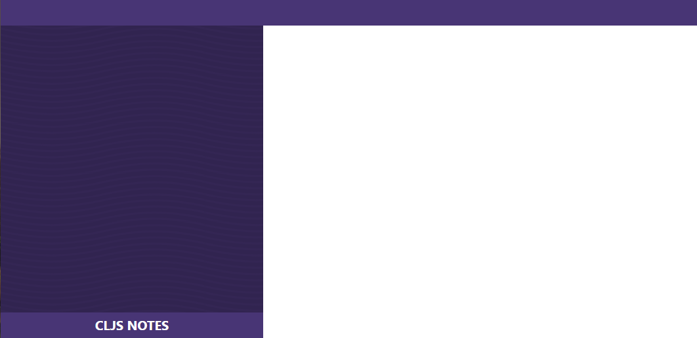

[UP](005_00.md)

### レッスン 30：キャップストーン5 - ノート

このセクションでは、ClojureScriptの知識をWebアプリケーションに応用するためのReagentフレームワークの使い方を学んできました。この最後の基礎講座では、再びプロジェクトを使って、Reagentとモジュール式アプリケーションデザインについて学んだことをまとめます。これまでの基礎講座と同様に、この講座でも、シーケンスの扱い方から状態管理や非同期通信まで、これまでに学んだことをすべて活用します。このレッスンの終わりには、メモを取るためのアプリケーションを一から作ることになります。前回のキャップストーンと同様、今回もフロントエンドのみを作成します。https://notes-api.learn-cljs.com/accounts にPOSTリクエストを発行することで得られる一連の認証情報を使って、https://notes.learn-cljs.com/api で実行されているAPIを利用することができます。

-----
**このレッスンでは**

- 柔軟なコンポーネントベースのUIを作る
- Reagentで状態管理を行う
- RESTful APIを利用する
-----


CLJSノートのスクリーンショット

#### 私たちが作っているもの

このキャップストーンの動機は、必要に応じて簡単に拡張できるシンプルなメモ帳アプリケーションが欲しいという作者自身の願望から来ています。ユーザーはこのアプリケーションを使って、メモを取ったり、タグで分類したり、メモのコレクションを編集することができなければなりません。このアプリケーションのバックエンドAPIは、2つの理由から意図的に面白くないものになっています。

1. このアプリケーションのバックエンドAPIは、意図的に面白みのないものになっていますが、これには2つの理由があります。
2. このレッスンではUIの構築に重点を置いているので、APIによるノイズは少ない方が良いのです。

このアプリは、1人のユーザーが使用するように設計されており、認証や認可を必要としません。

#### 状態の管理

何を作ろうとしているのかがわかったところで、データをモデル化し、UIコンポーネントがそのデータにアクセスするために使用できるパターンを明らかにしましょう。

まずは、ノート、タグ、それらの間の関係など、UIの状態を表す基本的なモデルを作成します。データはサーバーから取得するので、データの保存方法やUIからのアクセス方法を決定する際には、サーバーのデータモデルを考慮する必要があります。ここでは、2つの主要なエンドポイントを使用します。すべてのノートを一覧表示する`/notes`と、すべてのタグを一覧表示する`/tags`です。しかし、ほとんどの現実世界のアプリでそうであるように、データはUIでの使用には理想的な形式ではないため、一般的に正規化と呼ばれるプロセスでデータを再形成します。

##### データの正規化

リレーショナルデータベース技術がもたらした主なアイデアの1つに、正規化という概念があります。正規化には技術的な定義がありますが、ここでは非公式な説明を使うことができます。正規のアプリケーション状態では、データはコピーではなく参照によって共有されるべきです。この目的のためには、ノートとタグを別々に保存し、それらの間のリンクのリストを維持することを意味します。さらに、ルックアップが効率的になるように、それらを構造化します。例えば、以下のようなAPIレスポンスを受け取ることができます。

```Clojure
[{:id 1
  :title "Books to Read"
  :content "..."
  :tags [{:id 2 :name "list"}
         {:id 3 :name "reading"}]}
 {:id 2
  :title "Groceries"
  :content "..."
  :tags [{:id 1 :name "food"}
         {:id 2 :name "list"}]}]
```

このデータ構造の最初の難点は、タグが各ノートの下に入れ子になっていることです。ノートを中心とした表示では問題ありませんが、タグを表示または編集する場合は、この構造は理想的ではありません。ノートをそのままにして、タグの別のコレクションを維持することもできます。しかし、タグを編集する際には、ノートの下に入れ子になっているタグのすべてのコピーに同じ編集を適用しなければなりません。ここでの解決策は、リレーショナル・データベース管理システムで多対多の関係を持つ場合と同じことをすることです。つまり、ノート、タグ、そしてそれらの間の関係に別々のコレクションを作成するのです。目標は、データを次のような形に変換することです。

```Clojure
{:notes                                                    ;; <1>
   {1 {:id 1
       :title "Books to Read"
       :content "..."}
    2 {:id 2
       :title "Groceries"
       :content "..."}}
 :tags
   {1 {:id 1 :name "food"}
    2 {:id 2 :name "list"}
    3 {:id 3 :name "reading"}}

 :notes-tags
   {:by-note-id                                            ;; <2>
     {1 [2 3]
      2 [1 2]}
    :by-tag-id
     {1 [2]
      2 [1 2]
      3 [1]}}}
```

1. 各エンティティは、簡単に検索できるように、IDでインデックス化されたマップに格納されます。
2. 参照は、検索しやすいように、各方向（ノート→タグ、タグ→ノート）ごとに別々のマップに格納されます。

このコードでは、重複を避けるという約束を完全には果たせていないことがわかるでしょう。各参照は事実上2回保存されています。1回は `:by-note-id` コレクションに、もう1回は `:by-tag-id` コレクションにです。しかし実際には、この重複を局所的に処理することで、ノートにタグを追加したり削除したりするのは簡単な操作になります。

このデータを再構築するためには、以下の操作を効率的に行えるようないくつかのインデックスを作成する必要があります。

1. 任意のノートやタグをIDで検索する
2. 任意のノートがあれば、それに対応するタグを検索する。
3. 任意のタグが与えられた場合、対応するノートを検索します。

タグとノートのリソースの場合、IDからリソースへのマップが必要です。各IDは一意であるため、任意のIDに対するリソースは1つしかありません。ClojureScriptの`group-by`関数は、ほぼ私たちが望むものです...しかし、完全ではありません。

```Clojure
cljs.user=> (def items [{:id 1 :title "foo"}
                        {:id 2 :title "bar"}])
#'cljs.user/items

cljs.user=> (group-by :id items)
 {1 [{:id 1, :title "foo"}],
  2 [{:id 2, :title "bar"}]}
```

`group-by`関数は、グループ関数`f`とコレクション`xs`を受け取り、`(f x)`から同じ`(f x)`を得たすべてのアイテムのベクターへのマップを返します。キーワードは一般的にグループ関数として使用され、同じキーワードのプロパティを持つすべてのアイテムがグループ化されます。各IDはそのグループに1つの要素を持つことがわかっているので、すべての値から最初の要素を取ることができます。ClojureScriptライブラリには、マップ内のすべての値を変換する関数は用意されていませんが、自明のこととして書くことができます。

```Clojure
(defn map-values [f m]
  (into {} (for [[k v] m] [k (f v)])))
```

この関数は、`for` シーケンス内包を使用して、`m`のすべてのエントリを繰り返し処理し、同じキーを持ち、`f`が適用された値を持つ別のエントリを生成します。これらのキーと値のベクターは、新しいマップに集められます。これを使って、新しいインデックス関数を書くことができます。

```Clojure
cljs.user=> (defn make-index [f coll]
              (->> coll
                   (group-by f)
                   (map-values first)))
#'cljs.user/make-index

cljs.user=> (let [items [{:id 1 :title "foo"}
                         {:id 2 :title "bar"}]]
              (make-index :id items))
{1 {:id 1, :title "foo"},
 2 {:id 2, :title "bar"}}
```

この関数は、基本的な noteとtagのインデックスには有効ですが、`:notes-tags`のインデックスを扱うには、少し異なる戦略が必要です。まず、これらはユニークなインデックスではないので、各グループには複数の要素が含まれます。さらに、これらのインデックスの値として必要なのは、IDのシーケンスのみで、ノートやタグの完全なマップではありません。そのため、各グループの要素をマッピングして、それぞれの要素から1つのプロパティを抽出する必要があります。以下のように考えてみましょう。

```Clojure
cljs.user=> (def links [{:note-id 1 :tag-id 2}
                        {:note-id 1 :tag-id 3}
                        {:note-id 2 :tag-id 1}
                        {:note-id 2 :tag-id 2}])
#'cljs.user/links

cljs.user=> (group-by :note-id links)
{1 [{:note-id 1, :tag-id 2} {:note-id 1, :tag-id 3}],
 2 [{:note-id 2, :tag-id 1} {:note-id 2, :tag-id 2}]}
```

またしても、`group-by`は我々が望むものをほとんど与えてくれます。先ほどのように各グループに関数を適用するのではなく、グループ内の各項目に関数を適用する必要があります。これは少し複雑ですが、私たちが慣れ親しんでいるシーケンス関数だけで済みます。

```Clojure
cljs.user=> (->> links
                 (group-by :note-id)
                 (map-values #(mapv :tag-id %)))           ;; <1>
{1 [2 3],
 2 [1 2]}
```

1. 各グループに対して、すべての要素に `:tag-id` 関数をマッピングし、ベクターを生成します。

各グループの変換とグループ内の各要素の変換にオプションの関数を使えるようにすることで、必要な両方のケースを処理するように`make-index`関数を修正することができます。省略可能な引数を扱う方法として、「kwargs」（keyword args）パターンがあります。関数のパラメータベクターは、`&`で終わり、その後にマップのデストラクションパターンを続けることができます。関数は、キーワードと値のペアとして解釈される0個以上の引数のペアを受け取ります。これで、最後の`make-index`関数を書くことができます。

```Clojure
(defn make-index [coll & {:keys [index-fn value-fn group-fn]
                          :or {value-fn identity
                               group-fn identity}}]
  (->> coll
       (group-by index-fn)
       (map-values #(group-fn (mapv value-fn %)))))

;; Example usage:
cljs.user=> (make-index items
                        :index-fn :id
                        :group-fn first)
{1 {:id 1, :title "foo"},
 2 {:id 2, :title "bar"}}
cljs.user=> (make-index links
                        :index-fn :note-id
                        :value-fn :tag-id)
{1 [2 3],
 2 [1 2]}
```

この関数を書いておけば、あとはすべての`:note-id`/`:tag-id`ペアを抽出する関数と、最終的なレスポンスの正規化関数を書くだけです。

```Clojure
(defn get-links [notes]
  (mapcat (fn [note]
            (for [tag (:tags note)]
              {:note-id (:id note)
               :tag-id (:id tag)}))
          notes))

(defn normalize-notes [notes]
  (let [links (get-links notes)
        notes-without-tags (mapv #(dissoc % :tags) notes)
        all-note-tags (mapcat :tags notes)]
    {:notes (make-index notes-without-tags
                        :index-fn :id
                        :group-fn first)
     :tags (make-index all-note-tags
                       :index-fn :id
                       :group-fn first)
     :notes-tags
     {:by-note-id
      (make-index links
                  :index-fn :note-id
                  :value-fn :tag-id)
      :by-tag-id
      (make-index links
                  :index-fn :tag-id
                  :value-fn :note-id)}}))
```

データの正規化が期待通りに行われたので、次は状態の管理と調整に使用するアーキテクチャに移ります。

**クイックレビュー**

- データを正規化することのメリットは何ですか？
- kwargsパターンとは何ですか？関数にオプションのパラメータを渡す他の方法はありますか？
- 正規化されたデータフォーマットがあれば、タグが入れ子になっているノートをどのように再構成できるでしょうか？

##### UIの状態

サーバーから取得するデータに加えて、さらにいくつかの状態を維持する必要があります。

```Clojure
(ns learn-cljs.notes.state
  (:require [reagent.core :as r]))

(def initial-state
  {:current-route [:home]                                  ;; <1>
   :notifications {:messages []                            ;; <2>
                   :next-id 0}
   :data {:notes {}
          :tags {}}})

(defonce app (r/atom initial-state))
```
notes/state.cljs

1. 現在のルートのためのルートパラメータ。状態がルーティングの真実の源となり、ルーティングライブラリを使ってURLと状態を同期させることになります。
2. [レッスン29](005_29.md)から採用したコンポーネントを使って表示するための通知。

この最小限の状態が、キャップストーンプロジェクトを構築するために必要なすべてです。次に、状態の更新を調整するために使用するアーキテクチャに進みましょう。

##### 調整のためのアーキテクチャ

使用するアーキテクチャは、[レッスン29](005_29.md)のコマンド/イベントパターンに従います。流れとしては以下のようになります。

1. UIは、コマンド名とオプションのペイロードを指定して、`learn-cljs.notes.command/dispatch!`関数を呼び出すことで、コマンドを発行します。
2. コマンドハンドラは、コマンドに必要な任意の副作用（APIの呼び出しを含む）を実行し、イベントバスにイベントを発することができます。
3. 状態更新関数は、イベントをリッスンし、それに応じてグローバルなアプリケーションの状態を更新します。

[レッスン29](005_29.md)からのもう一つの変更点は、メッセージングに`core.async`を使用しないことです。`core.async`はここでも機能しますが、イベントを発行する関数とイベントハンドラにディスパッチする場所が1つずつあるという単純なケースでは、過剰な機能です。

まず最初は、コマンドディスパッチャです。これは、コマンド名とオプションのコマンドペイロードを受け取り、他の関数にディスパッチして副作用を実行したりイベントを発行したりするシンプルな関数です。

```Clojure
(ns learn-cljs.notes.command
  (:require [learn-cljs.notes.events :refer [emit!]]))

(defn handle-test-hello! [name]
  (println "Hello" name)                                   ;; <1>
  (emit! :test/greeting-dispatched {:name name}))          ;; <2>

(defn dispatch!
  ([command] (dispatch! command nil))
  ([command payload]
   (js/setTimeout                                          ;; <3>
     #(case command
        :test/hello (handle-test-hello! payload)

        (js/console.error (str "Error: unhandled command: " command)))
     0))
)
```
notes/command.cljs

1. ハンドラ関数は、副作用を実行することができます。
2. また、アプリの他の部分が反応できるように、イベントを発行する必要があります。
3. イベントが処理される前にコールスタックがクリアされるように、ディスパッチャは非同期に実行されます。

UI は `_command/dispatch!` を直接呼び出してコマンドを発行できます。例えば、コンポーネントが`(notes.command/dispatch! :test/hello "world")`を呼び出すと、Hello worldというテキストがコンソールに表示されます。より多くのコマンドをサポートするために、ケース式 `indispatch!` に条件を追加し、対応するハンドラ関数を追加します。

次に、イベントを購読者に配信する役割を持つ `emit!` 関数を実装する必要があります。どんなコードでも、イベントが発行されるたびに呼び出されるリスナー関数を登録して、それに反応する機会を得ることができます。

```Clojure
(ns learn-cljs.notes.events)

(def listeners (atom []))                                  ;; <1>

(defn emit!                                                ;; <2>
  ([type] (emit! type nil))
  ([type payload]
   (doseq [listen-fn @listeners]
     (listen-fn type payload))))

(defn register-listener! [listen-fn]                       ;; <3>
  (swap! listeners conj listen-fn))
```
notes/events.cljs

1. イベントが発せられたときに通知する関数を記録しておきます。
2. イベントの種類とペイロードを指定して、各リスナー関数を連続して呼び出す。
3. 他のコードがリスナーを登録できるようにする。

なお、リスナーを宣言する際には、defonceではなくdefを使用しています。これは意図的なもので、アプリがリロードされるたびにリスナーを再登録できるようにするためです。その結果、イベントハンドラを更新したときに、変更を有効にするためにアプリを完全にリフレッシュする必要がなくなります。

最後に、イベントが発生したときにアプリの状態に必要な更新を行うリスナーを登録します。

```Clojure
(ns learn-cljs.notes.state
  (:require ;; ...
            [learn-cljs.notes.events :as events]))

;; ...

(def handlers (atom {}))

(defn register-handler! [event-type handler-fn]
  (swap! handlers assoc event-type handler-fn))

(events/register-listener!
 (fn [type payload]
   (when-let [handler-fn (get @handlers type)]
     (swap! app #(handler-fn  % payload)))))
```
notes/state.cljs

これで、コードのどこからでも、イベントが発生したときにアプリの状態を更新するイベントハンドラを登録することができます。このハンドラには、データベースの状態とイベントのペイロードが渡され、データベースの状態（おそらく更新されたもの）を返すことが期待されます。

多くのリスナーを登録できるようにイベントバスを作成しましたが、登録するのは状態更新用のリスナーだけです。コマンドディスパッチャが直接アプリの状態を更新するのではなく、なぜ余計なインダイレクトの層を設けるのでしょうか。主な理由は、イベントをログに記録したり、自動化されたバグレポートとしてサーバーに送信するために`localStorage`に保存したり、状態構造を知らないサードパートのコンポーネントと統合したりする場合に、1つの場所を指定するためです。イベントを発行する行為とアプリの状態を更新する行為を切り離すことで、初期段階ではわずかな労力で、長期的には多くの柔軟性を得ることができます。

状態管理の流れを説明します。

1. UIコンポーネントは、`command/dispatch!`を使用してコマンドをディスパッチします。
2. コマンドディスパッチャはハンドラ関数を呼び出します。ハンドラ関数はイベントを発行したり、APIコールなどの副作用を実行することができます。
3. イベントバスは、リスナーにイベントを発行します。
4. 状態リスナーは、イベントとデータベースの現在の状態を、そのイベントのために登録されているハンドラに渡すことで、イベントを処理します。
5. イベントハンドラは、イベントとデータベースの現在の状態を受け取り、更新された状態を返します。
6. 更新された状態は、それに依存しているすべてのコンポーネントに伝わり、それらは再レンダリングされます。


状態の調整

#### アプリケーションの構築

このレッスンの最初の部分では、機能の「水平方向のスライス」である状態管理に焦点を当てました。状態管理はフロントエンドアプリケーションの中核をなすものなので、しっかりと設計されていることが重要です。しかし、ここでは、アプリケーションの残りの部分を構築するための「垂直方向のスライス」のアプローチを紹介します。つまり、一度に一つの機能に焦点を当て、その機能に関連するUIコンポーネント、ステートハンドラ、API関数などを開発していきます。結局のところ、現実世界のアプリケーションのほとんどは、このようにして構築されます。

最初に構築する「機能」は、レイアウトです。レイアウトは非常にシンプルで、「新規ノート」ボタンを含むヘッダー、ノートの一覧を表示するサイドバー、そしてユーザーがノートを作成・編集するメインコンテンツエリアがあります。


レイアウトシェル

これらの構造のほとんどを、トップレベルの`notes.cljs`ファイルに追加します。


[UP](005_00.md)
