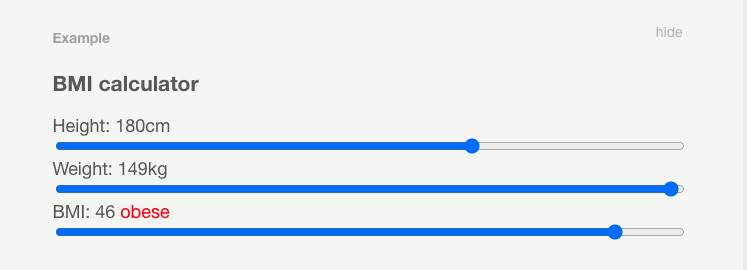
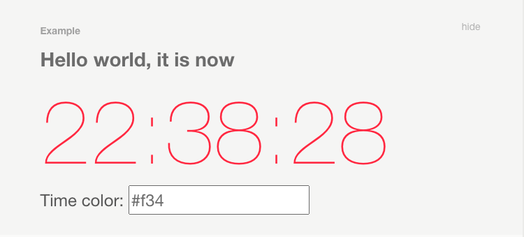
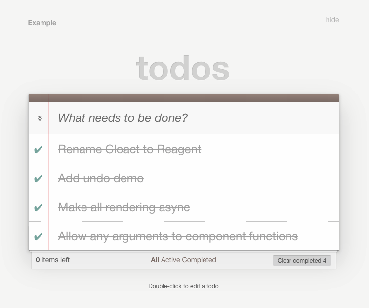

# Reagent: ClojureScriptのためのミニマルなReact

## Reagentの紹介

[Reagent](https://github.com/reagent-project/reagent)は、[ClojureScript](https://github.com/clojure/clojurescript)と[React](https://reactjs.org/)の間の最小限のインターフェースを提供します。これにより、プレーンなClojureScriptの関数とデータだけを使って、効率的なReactコンポーネントを定義することができ、[Hiccup](https://github.com/weavejester/hiccup)のような構文を使ってUIを記述することができます。

Reagentの目標は、いくつかの基本的なコンセプトだけで任意の複雑なUIを定義できるようにすること、そしてパフォーマンスについてほとんど考える必要がないほど、デフォルトで十分に高速であることです。

非常に基本的なReagentコンポーネントは次のようなものである。

**Example**
---
I am a component!

I have **bold** <span style="color: red; ">and red</span> text.
---

```Clojure
(defn simple-component []
  [:div
   [:p "I am a component!"]
   [:p.someclass
    "I have " [:strong "bold"]
    [:span {:style {:color "red"}} " and red "] "text."]])
```

他のコンポーネントを構成要素として、新しいコンポーネントを作ることができます。このように

**Example**
---
I include simple-component.

I am a component!

I have **bold** <span style="color: red; ">and red</span> text.
---

```Clojure
(defn simple-parent []
  [:div
   [:p "I include simple-component."]
   [simple-component]])
```


データは、古いClojureのデータ型を使って子コンポーネントに渡されます。このように

**Example**
---
Hello, world!
---

```Clojure
(defn hello-component [name]
  [:p "Hello, " name "!"])

(defn say-hello []
  [hello-component "world"])
```

**註**：上の例では、hello-componentは、Reagentコンポーネントとしてではなく、通常のClojure関数として呼び出されたのと同じかもしれません（角括弧の代わりに括弧を使うなど）。「本物の」Reagentコンポーネントは、データが変更されたときにのみ再レンダリングされるので、唯一の違いはパフォーマンスです。しかし、より高度なコンポーネント（下記参照）は、角括弧を使って呼び出す必要があります。

以下は、seq内のアイテムを表示する別の例です。

**Example**
---
Here is a list:
- Item 0
- Item 1
- Item 2
---

```Clojure
(defn lister [items]
  [:ul
   (for [item items]
     ^{:key item} [:li "Item " item])])

(defn lister-user []
  [:div
   "Here is a list:"
   [lister (range 3)]])
```

**注**: 上記の`^{:key item}`の部分は、この単純な例では実際には必要ありませんが、動的に生成されるコンポーネントのリストのすべてのアイテムに一意のキーを付けることは良い習慣であり、Reactが大きなリストのパフォーマンスを向上させるのに役立ちます。キーは、(この例のように)メタデータとして、または(それがマップである場合)コンポーネントへの第一引数の `:key` アイテムとして与えることができます。詳しくは[Reactのドキュメント](https://ja.reactjs.org/docs/lists-and-keys.html#keys)を参照してください。

## Reagentでの状態管理
Reagentで状態を管理する最も簡単な方法は、Reagent独自のバージョンの`atom`を使用することです。これは、clojure.coreのものと全く同じように動作しますが、脱参照されるたびに追跡することができます。`atom`を使用しているコンポーネントは、その値が変更されると自動的に再レンダリングされます。

簡単な例でそれを示してみましょう。

Example
---
The atom click-count has value: 2. [Click me!]
---

```Clojure
(ns example
  (:require [reagent.core :as r]))
(def click-count (r/atom 0))

(defn counting-component []
  [:div
   "The atom " [:code "click-count"] " has value: "
   @click-count ". "
   [:input {:type "button" :value "Click me!"
            :on-click #(swap! click-count inc)}]])
```

コンポーネントの中でローカルに状態を保持したい場合があります。`atom`を使えば、それも簡単にできます。

この例では、コンポーネントがレンダリングされるたびに`setTimeout`を呼び出し、カウンターを更新しています。


**Example**
---
Seconds Elapsed: XXXXXX
---

```Clojure
(defn timer-component []
  (let [seconds-elapsed (r/atom 0)]
    (fn []
      (js/setTimeout #(swap! seconds-elapsed inc) 1000)
      [:div
       "Seconds Elapsed: " @seconds-elapsed])))
```

前述の例では、Reagentのもう一つの特徴を利用しています。コンポーネント関数は、実際のレンダリングを行うために使用される別の関数を返すことができます。この関数は、最初の関数と同じ引数で呼び出されます。

これにより、Reactのライフサイクルイベントに頼ることなく、新しく作成されたコンポーネントのセットアップを行うことができます。

`atom`を渡すだけで、次のようにコンポーネント間で状態管理を共有することができます。

**Example**
---
The value is now: foo

Change it here: [foo]
---

```Clojure
(ns example
  (:require [reagent.core :as r]))
(defn atom-input [value]
  [:input {:type "text"
           :value @value
           :on-change #(reset! value (-> % .-target .-value))}])

(defn shared-state []
  (let [val (r/atom "foo")]
    (fn []
      [:div
       [:p "The value is now: " @val]
       [:p "Change it here: " [atom-input val]]])))
```
※ `(-> % .-target .-value)`はフォームフィールドの値を取得するJSの慣用句。

**注**：コンポーネント関数は、不変であれば、どのような引数でも呼び出すことができます。ミュータブルオブジェクトを使用することもできますが、その場合は、データが変更されたときにコンポーネントが更新されることを確認する必要があります。Reagentは、デフォルトでは、2つのオブジェクトが同じオブジェクトであれば、等しいと仮定しています。

## 必須API

ReagentはReactのAPIのほとんどをサポートしていますが、ほとんどのアプリケーションで必要となるエントリーポイントは本当に1つだけです：`reagent.dom/render`です。

これは2つの引数を取ります。コンポーネントとDOMノードです。例えば、一番最初の例をページ全体に散らすと、次のようになります。

```Clojure
(ns example
  (:require [reagent.dom :as rdom]))
(defn simple-component []
  [:div
   [:p "I am a component!"]
   [:p.someclass
    "I have " [:strong "bold"]
    [:span {:style {:color "red"}} " and red "] "text."]])

(defn render-simple []
  (rdom/render
    [simple-component]
    (.-body js/document)))
```


## 全てをまとめる

ここでは、シンプルなBMI計算機の例を紹介します。

データは単一の`reagent.core/atom`に格納されています。身長、体重、BMIをキーとしたマップです。



```Clojure
(ns example
  (:require [reagent.core :as r]))
(defn calc-bmi [{:keys [height weight bmi] :as data}]
  (let [h (/ height 100)]
    (if (nil? bmi)
      (assoc data :bmi (/ weight (* h h)))
      (assoc data :weight (* bmi h h)))))

(def bmi-data (r/atom (calc-bmi {:height 180 :weight 80})))

(defn slider [param value min max invalidates]
  [:input {:type "range" :value value :min min :max max
           :style {:width "100%"}
           :on-change (fn [e]
                        (let [new-value (js/parseInt (.. e -target -value))]
                          (swap! bmi-data
                                 (fn [data]
                                   (-> data
                                     (assoc param new-value)
                                     (dissoc invalidates)
                                     calc-bmi)))))}])

(defn bmi-component []
  (let [{:keys [weight height bmi]} @bmi-data
        [color diagnose] (cond
                          (< bmi 18.5) ["orange" "underweight"]
                          (< bmi 25) ["inherit" "normal"]
                          (< bmi 30) ["orange" "overweight"]
                          :else ["red" "obese"])]
    [:div
     [:h3 "BMI calculator"]
     [:div
      "Height: " (int height) "cm"
      [slider :height height 100 220 :bmi]]
     [:div
      "Weight: " (int weight) "kg"
      [slider :weight weight 30 150 :bmi]]
     [:div
      "BMI: " (int bmi) " "
      [:span {:style {:color color}} diagnose]
      [slider :bmi bmi 10 50 :weight]]]))
```

## パフォーマンス

React自体が非常に高速であり、Reagentも同様です。実際、ClojureScriptによる最適化のおかげで、Reagentは多くの場合、普通のReactよりもさらに高速になります。

マウントされたコンポーネントは、そのパラメータが変更されたときにのみ再レンダリングされます。変更の原因としては、脱参照(deref)された `atom` や、コンポーネントに渡される引数、コンポーネントの状態などが考えられます。

これらはすべて、基本的にポインタの比較だけである `identical?` で変更をチェックしますので、オーバーヘッドは非常に小さくなります。コンポーネントの引数として渡されたマップも同じように比較され、すべてのエントリが同一であれば等しいとみなされます。これは、`:div`や`:p`などのReactの組み込みコンポーネントにも適用されます。


以上のことから、ほとんどの場合、パフォーマンスを気にする必要はないと言えます。好きなようにUIを定義するだけで、十分に高速になります。

しかし、気にしなければならない状況もいくつかあります。レンダリングするコンポーネントの大きな `seq` を Reagent に与えた場合、レンダリングを高速化するために、すべてのコンポーネントにユニークな `:key` 属性を与えなければならないかもしれません（上記参照）。また、無名関数は、たとえ同じコードやクロージャを表していても、一般的にはお互いに同等ではないことに注意してください。

しかし、繰り返しになりますが、一般的にはReactとReagentが十分に高速であることを信じればよいでしょう。まさにこのページは、1つのReagentコンポーネントと数千の子コンポーネントで構成されていますが（コード例の括弧などはすべて別のコンポーネントです）、それでもブラウザに少しも負担をかけることなく、毎秒何度もページを更新することができます。
ちなみに、このページにはReactのもうひとつの仕掛けが使われています。それは、ページ全体がNodeと`reagent.dom.server/render-to-string`を使ってプリレンダリングされていることです。これがブラウザに読み込まれると、Reactは自動的にイベントハンドラを既に存在するDOMツリーに取り付けます。

## 完全なデモ

Reagentには、Leiningenのプロジェクトファイルなどを含む完全なサンプルがいくつか付属しています。ここでは、そのうちの1つを実際に動かしてみます。





```Clojure
(ns simpleexample.core
  (:require [reagent.core :as r]
            [reagent.dom :as rdom]
            [clojure.string :as str]))

(defonce timer (r/atom (js/Date.)))

(defonce time-color (r/atom "#f34"))

(defonce time-updater (js/setInterval
                       #(reset! timer (js/Date.)) 1000))

(defn greeting [message]
  [:h1 message])

(defn clock []
  (let [time-str (-> @timer .toTimeString (str/split " ") first)]
    [:div.example-clock
     {:style {:color @time-color}}
     time-str]))

(defn color-input []
  [:div.color-input
   "Time color: "
   [:input {:type "text"
            :value @time-color
            :on-change #(reset! time-color (-> % .-target .-value))}]])

(defn simple-example []
  [:div
   [greeting "Hello world, it is now"]
   [clock]
   [color-input]])

(defn ^:export run []
  (rdom/render [simple-example] (js/document.getElementById "app")))
```

## Todomvc

義務的なTodoリストは、Reagentではおおよそ次のようになります（ルーティングとパーシステンスをスキップすることで、少しズルをしています）。



```Clojure
(ns todomvc.core
  (:require [reagent.core :as r]
            [reagent.dom :as rdom]
            [clojure.string :as str]))

(defonce todos (r/atom (sorted-map)))

(defonce counter (r/atom 0))

(defn add-todo [text]
  (let [id (swap! counter inc)]
    (swap! todos assoc id {:id id :title text :done false})))

(defn toggle [id] (swap! todos update-in [id :done] not))
(defn save [id title] (swap! todos assoc-in [id :title] title))
(defn delete [id] (swap! todos dissoc id))

(defn mmap [m f a] (->> m (f a) (into (empty m))))
(defn complete-all [v] (swap! todos mmap map #(assoc-in % [1 :done] v)))
(defn clear-done [] (swap! todos mmap remove #(get-in % [1 :done])))

(defonce init (do
                (add-todo "Rename Cloact to Reagent")
                (add-todo "Add undo demo")
                (add-todo "Make all rendering async")
                (add-todo "Allow any arguments to component functions")
                (complete-all true)))

(defn todo-input [{:keys [title on-save on-stop]}]
  (let [val (r/atom title)
        stop #(do (reset! val "")
                  (if on-stop (on-stop)))
        save #(let [v (-> @val str str/trim)]
                (if-not (empty? v) (on-save v))
                (stop))]
    (fn [{:keys [id class placeholder]}]
      [:input {:type "text" :value @val
               :id id :class class :placeholder placeholder
               :on-blur save
               :on-change #(reset! val (-> % .-target .-value))
               :on-key-down #(case (.-which %)
                               13 (save)
                               27 (stop)
                               nil)}])))

(def todo-edit (with-meta todo-input
                 {:component-did-mount #(.focus (rdom/dom-node %))}))

(defn todo-stats [{:keys [filt active done]}]
  (let [props-for (fn [name]
                    {:class (if (= name @filt) "selected")
                     :on-click #(reset! filt name)})]
    [:div
     [:span#todo-count
      [:strong active] " " (case active 1 "item" "items") " left"]
     [:ul#filters
      [:li [:a (props-for :all) "All"]]
      [:li [:a (props-for :active) "Active"]]
      [:li [:a (props-for :done) "Completed"]]]
     (when (pos? done)
       [:button#clear-completed {:on-click clear-done}
        "Clear completed " done])]))

(defn todo-item []
  (let [editing (r/atom false)]
    (fn [{:keys [id done title]}]
      [:li {:class (str (if done "completed ")
                        (if @editing "editing"))}
       [:div.view
        [:input.toggle {:type "checkbox" :checked done
                        :on-change #(toggle id)}]
        [:label {:on-double-click #(reset! editing true)} title]
        [:button.destroy {:on-click #(delete id)}]]
       (when @editing
         [todo-edit {:class "edit" :title title
                     :on-save #(save id %)
                     :on-stop #(reset! editing false)}])])))

(defn todo-app [props]
  (let [filt (r/atom :all)]
    (fn []
      (let [items (vals @todos)
            done (->> items (filter :done) count)
            active (- (count items) done)]
        [:div
         [:section#todoapp
          [:header#header
           [:h1 "todos"]
           [todo-input {:id "new-todo"
                        :placeholder "What needs to be done?"
                        :on-save add-todo}]]
          (when (-> items count pos?)
            [:div
             [:section#main
              [:input#toggle-all {:type "checkbox" :checked (zero? active)
                                  :on-change #(complete-all (pos? active))}]
              [:label {:for "toggle-all"} "Mark all as complete"]
              [:ul#todo-list
               (for [todo (filter (case @filt
                                    :active (complement :done)
                                    :done :done
                                    :all identity) items)]
                 ^{:key (:id todo)} [todo-item todo])]]
             [:footer#footer
              [todo-stats {:active active :done done :filt filt}]]])]
         [:footer#info
          [:p "Double-click to edit a todo"]]]))))

(defn ^:export run []
  (rdom/render [todo-app] (js/document.getElementById "app")))
```


www.DeepL.com/Translator（無料版）で翻訳しました。