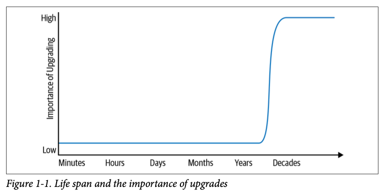
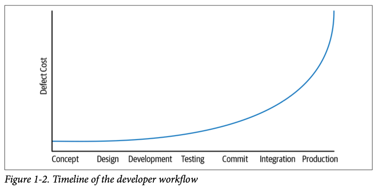

# What Is Software Engineering?

Written by Titus Winters
Edited by Tom Manshreck

石の上には何も建たない。すべては砂の上に建つが、その砂が石であるかのように建てなければならない。
-- ホルヘ・ルイス・ボルヘス

プログラミングとソフトウェアエンジニアリングの決定的な違いは、「時間」「規模」「トレードオフ」の3点です。ソフトウェアエンジニアリングのプロジェクトでは、エンジニアは時間の経過と最終的な変化の必要性をより意識する必要があります。また、ソフトウェアエンジニアリングの組織では、制作するソフトウェアだけでなく、それを制作している組織にとっても、規模と効率をより重視する必要があります。最後に、ソフトウェアエンジニアとしての私たちは、時間と成長の不正確な見積もりに基づいて、より複雑でリスクの高い決断をすることを求められます。

グーグルでは、「ソフトウェアエンジニアリングとは、時間をかけて統合されたプログラミングである」と言うことがあります。プログラミングは確かにソフトウェアエンジニアリングの重要な部分を占めています。そもそもプログラミングとは、新しいソフトウェアを生み出す方法です。この区別を受け入れるならば、プログラミングのタスク（開発）とソフトウェアエンジニアリングのタスク（開発、修正、メンテナンス）を区別する必要があるかもしれません。また、プログラミングに「時間」が加わることで、新たな側面が生まれます。立方体は四角形ではなく、距離は速度ではありません。ソフトウェアエンジニアリングはプログラミングではありません。

時間がプログラムに与える影響を考える一つの方法は、"あなたのコードの期待寿命(*1)はどれくらいですか？"という質問を考えることです。この質問に対する合理的な答えは、およそ10万分の1の差があります。数分しか持たないコードを考えるのも、何十年も持つコードを考えるのも同じように合理的です。一般的に、短いコードは時間に影響されません。1時間しか使えないプログラムのために、基盤となるライブラリやオペレーティングシステム（OS）、ハードウェア、言語のバージョンを変更する必要があることはまずありません。このような短命なシステムは、1次元に圧縮された立方体が正方形であるのと同じように、事実上「ただの」プログラミング問題である。その時間を拡大して寿命を長くすると、変化が重要になってきます。10年以上のスパンで見ると、暗黙的であれ明示的であれ、ほとんどのプログラムの依存関係は変化するでしょう。このような認識が、ソフトウェアエンジニアリングとプログラミングの違いの根底にあります。

この違いは、私たちがソフトウェアの持続可能性と呼んでいるものの核心です。想定されるソフトウェアの寿命の間、技術的な理由やビジネス上の理由など、価値のある変化に対応することができれば、そのプロジェクトは持続可能です。重要なのは、ここでは能力だけを見ていることです。価値がないとか、他の優先事項があるとかの理由で、あるアップグレードを実行しないという選択もあり得ます(*2)。根本的に技術や製品の方向性の変化に対応できないということは、そのような変化が重要になることはないという希望に、高いリスクを賭けていることになります。短期的なプロジェクトであれば、それは安全な賭けかもしれません。しかし、それが何十年も続くとなると、そうはいかないでしょう(*3)。

ソフトウェアエンジニアリングのもう一つの見方は、スケールを考えることです。何人の人が関わっているのか。また、開発やメンテナンスにどのような役割を果たしているのか。プログラミングの作業は個人で行うことが多いですが、ソフトウェアエンジニアリングの作業はチームで行います。ソフトウェアエンジニアリングを定義しようとした初期の試みでは、「多バージョンのプログラムを多人数で開発すること」という視点で適切な定義がなされています(*4)。このことから、ソフトウェアエンジニアリングとプログラミングの違いは、時間と人の違いであることがわかります。チームでの共同作業には新たな問題が発生しますが、一人のプログラマーが作るよりも価値のあるシステムを生み出す可能性があります。

チームの組織、プロジェクトの構成、ソフトウェアプロジェクトのポリシーとプラクティスのすべてが、ソフトウェアエンジニアリングの複雑さのこの側面を支配しています。これらの問題は規模に固有のものです。組織が大きくなり、そのプロジェクトが拡大するにつれて、ソフトウェアの生産効率は上がるのでしょうか。開発ワークフローは規模が大きくなるほど効率的になるのか、それともバージョン管理ポリシーやテスト戦略に比例してコストが高くなるのか。コミュニケーションや人間のスケールに関する問題は、ソフトウェア工学の黎明期から議論されており、「人月の神話」(*5)にまで遡ることができます。このようなスケールの問題は、しばしばポリシーの問題であり、ソフトウェアの持続可能性の問題の根幹をなすものです。

また、ソフトウェアエンジニアリングは、意思決定の複雑さとその利害関係の点で、プログラミングとは異なると言えます。ソフトウェアエンジニアリングでは、いくつかの進路の間のトレードオフを評価することを定期的に迫られますが、それは時に大きなリスクを伴い、また多くの場合、不完全な価値基準を用います。ソフトウェアエンジニア、またはソフトウェアエンジニアリングのリーダーの仕事は、組織、製品、および開発ワークフローのスケーリングコストの持続性と管理を目指すことです。これらのインプットを念頭に置いて、トレードオフを評価し、合理的な判断を下してください。時にはメンテナンスの変更を先延ばしにしたり、スケールメリットのないポリシーを採用することもあるかもしれませんが、その場合はその決定を見直す必要があることを知っておく必要があります。そのような選択をする際には、延期されるコストを明確にしておく必要があります。

ソフトウェアエンジニアリングの世界では、万能の解決策はめったにありませんが、この本も同じです。「このソフトウェアの寿命はどれくらいか」についての妥当な答えが10万分の1であったり、「あなたの組織には何人のエンジニアがいるか」についての答えが1万分の1であったり、「あなたのプロジェクトで利用可能な計算機資源はどれくらいか」についての答えが誰にもわからなかったりすると、Googleの経験はあなたの経験とは一致しないでしょう。この本では、何万人ものエンジニアと世界規模の計算機資源を使って、何十年も続くと予想されるソフトウェアを構築・保守する中で、私たちが見つけた効果的な方法を紹介することを目的としています。私たちがこの規模で必要だと感じた手法のほとんどは、小規模な取り組みにも有効です。これは、規模を拡大したときに良いと思われるエンジニアリングエコシステムについての報告と考えてください。いくつかの場所では、超大規模なスケールにはそれなりのコストがかかり、私たちは余分な間接費を払わない方が幸せだと考えています。そのような場合には、警告を発しています。願わくば、あなたの組織がそれらのコストを心配するほど大きくなったら、より良い答えを見つけてください。

チームワーク、文化、ポリシー、ツールなどの具体的な話に入る前に、まずは「時間」「規模」「トレードオフ」という主要なテーマについて詳しく説明します。

## 時間と変化

初心者がプログラミングを学んでいるとき、出来上がったコードの寿命は通常、数時間または数日で測られます。プログラミングの課題や演習では、一度書いただけで、リファクタリングはほとんど行われず、長期的なメンテナンスも行われません。これらのプログラムは、最初に作った後は、二度と作り直されたり実行されたりしないことが多いのです。これは教育現場では当然のことです。中等教育や高等教育の場では、チームプロジェクトのコースや実践的な論文があるかもしれません。もしそうであれば、学生のコードが1ヶ月ほどしか生きられないのは、そのようなプロジェクトだけでしょう。開発者は、要求の変化に応じてコードをリファクタリングする必要があるかもしれませんが、自分の環境の広範な変化に対応することを求められることはないでしょう。

また、一般的な業界環境でも、寿命の短いコードの開発者が見受けられます。モバイルアプリの寿命はかなり短く(*6)、良くも悪くも全面的な書き換えが比較的よく行われます。初期段階のスタートアップ企業のエンジニアは、長期的な投資よりも目先の目標を重視するのは当然かもしれません。新興企業の連続した開発者は、10年の開発経験があっても、1～2年以上の長期にわたって存在することが予想されるソフトウェアのメンテナンスをほとんど、あるいは全く経験していないということも十分あり得るのです。

一方で、成功したプロジェクトの中には、事実上、寿命に制限がないものもあります。Google検索、Linuxカーネル、Apache HTTP Serverプロジェクトのエンドポイントを合理的に予測することはできません。依存関係や言語バージョンなどのアップグレードがいつ必要になるかは予測できません。寿命が長くなると、これらの長寿プロジェクトは、プログラミングの課題やスタートアップの開発とは異なる雰囲気を持つようになります。

図1-1は、この「期待寿命」の両端に位置する2つのソフトウェアプロジェクトを示しています。期待寿命が数時間のタスクに取り組んでいるプログラマーにとって、どのような種類のメンテナンスを期待するのが妥当でしょうか。つまり、1回しか実行されないPythonスクリプトに取り組んでいる最中に、OSの新バージョンが出たら、やっていることをやめてアップグレードすべきでしょうか？もちろんそうではありません：アップグレードは重要ではありません。しかし、その反対に、Google検索が1990年代のOSのバージョンで止まっているとしたら、明らかに問題です。



期待寿命スペクトルの低いところと高いところを見ると、どこかに転換点があることがわかります。1回限りのプログラムと何十年も続くプロジェクトの間のどこかで、プロジェクトが外部性の変化に対応し始めなければならないという移行が起こるのです(*7)。最初からアップグレードを計画していなかったプロジェクトにとって、この移行は3つの理由で非常に苦痛なものとなります。

- このプロジェクトではまだ行われていない作業を行っていること、さらに隠れた前提条件が組み込まれていること。
- アップグレードを行おうとしているエンジニアが、この種の作業を経験していない可能性が高いこと。
- アップグレードの規模は通常よりも大きく、段階的なアップグレードではなく、数年分のアップグレードを一度に行うことが多い。

そのため、一度でもアップグレードを経験すると（あるいは途中で断念すると）、その後のアップグレードにかかるコストを過大評価して「二度とやらない」と決めてしまうのも無理はない。このような結論に達した企業は、結局、物を捨ててコードを書き直すか、二度とアップグレードしないことにしてしまいます。苦しい作業を避けるという自然な方法ではなく、苦しくないようにするための投資をすることが、より責任ある答えになることがあります。これは、アップグレードのコスト、それが提供する価値、プロジェクトの予想される寿命などによって異なります。

最初の大きなアップグレードを乗り越えるだけでなく、今後も確実に最新の状態を維持できるようにすることが、プロジェクトの長期的な持続可能性の本質なのです。持続可能性のためには、必要な変化の影響を計画し、管理することが必要です。Googleの多くのプロジェクトでは、試行錯誤を繰り返しながら、このような持続可能性を実現してきたと考えています。

では具体的に、短期的なプログラミングと、寿命の長いコードを作ることはどう違うのでしょうか。そのためには、"たまたま動く "ということと、"メンテナンスが可能である "ということの違いを、より深く認識する必要があります。これらの問題を特定する完璧なソリューションはありません。それは残念なことですが、ソフトウェアを長期的にメンテナンスできるようにすることは、常に戦いなのです。

## ハイラムの法則

もしあなたが他のエンジニアが使うプロジェクトを保守しているなら、「動作する」対「保守可能である」ことについての最も重要な教訓は、私たちが「ハイラムの法則」と呼ぶものです。

十分な数のAPIユーザーがいれば、契約書で何を約束したかは問題ではありません。

私たちの経験では、この公理は、時間の経過とともにソフトウェアを変化させることを議論する際の主要な要因となっています。概念的にはエントロピーに似ています。効率や熱力学の議論でエントロピーを意識しなければならないのと同様に、経年変化やメンテナンスの議論ではハイラムの法則(*8)を意識しなければなりません。エントロピーが絶対に減らないからといって、効率化を図ってはいけないということではありません。ソフトウェアを保守する際にハイラムの法則が適用されるからといって、それを想定したり、理解を深めたりすることができないわけではありません。私たちはそれを軽減することはできますが、根絶することはできないことを知っています。

ハイラムの法則は、最善の意図を持ち、最高のエンジニアを雇い、コードレビューをしっかりと行ったとしても、公表された契約やベストプラクティスを完全に遵守することはできないという実践的な知識を表しています。APIオーナーとしては、インターフェースの約束事を明確にすることで、ある程度の柔軟性や自由度を得ることができますが、実際には、ある変更の複雑さや難しさは、ユーザーがAPIの観察可能な動作をどれだけ便利だと感じるかにも依存します。ユーザーがそのようなものに依存できなければ、APIの変更は容易になります。十分な時間と十分なユーザーがいれば、最も無害な変更であっても何かが壊れる(*9)。その変更の価値を分析する際には、それらの壊れた部分を調査し、特定し、解決することの難しさを考慮しなければならない。

## 例 ハッシュの順序付け

ハッシュの反復順序付けの例を考えてみましょう。ハッシュベースの集合に5つの要素を挿入した場合、どのような順序で取り出すことができるでしょうか。

```
>>> for i in {"apple", "banana", "carrot", "durian", "eggplant"}: print(i)
...
durian
carrot
apple
eggplant
banana
```

ほとんどのプログラマーは、ハッシュテーブルが明らかに順序付けられていないことを知っている。しかし、使用しているハッシュテーブルが永遠にそのような順序を提供することを意図しているかどうか、詳細を知っている人は少ない。しかし、過去10～20年の間に、コンピュータ業界ではこのような型を使用する経験が進化してきました。

- ハッシュフラッディング(*10)攻撃により、非決定論的なハッシュ反復のインセンティブが高まっている。
- ハッシュアルゴリズムやハッシュコンテナの改良による効率化のためには、ハッシュの反復順序の変更が必要です。
- ハイラムの法則によれば、プログラマは、能力があれば、ハッシュテーブルのトラバース順序に依存したプログラムを書くことになります。

その結果、専門家に「ハッシュコンテナに特定の出力配列を仮定できますか」と質問すると、おそらく専門家は「いいえ」と答えるでしょう。大体においてそれは正しいのですが、おそらく単純化されています。もっとニュアンスのある答えは、「あなたのコードが、ハードウェア、言語ランタイム、データ構造の選択に変更がなく、短期間で終わるのであれば、そのような仮定は問題ない。「コードの寿命がわからない場合や、依存しているものが絶対に変わらないと約束できない場合は、そのような仮定は正しくありません。」 です。さらに、自分の実装がハッシュコンテナの順序に依存していなくても、暗黙的にそのような依存関係を作っている他のコードが使用している可能性もあります。例えば、ライブラリがRPC（Remote Procedure Call）レスポンスに値をシリアライズする場合、RPCの呼び出し元はこれらの値の順序に依存することになるかもしれません。

これは "動く "と "正しい "の違いを示す非常に基本的な例です。短期間のプログラムであれば、コンテナの反復順序に依存しても技術的な問題は発生しません。一方、ソフトウェアエンジニアリングのプロジェクトでは、定義された順序に依存することはリスクであり、十分な時間があれば、その反復順序を変更することに価値を見出すことができます。その価値とは、効率性やセキュリティ、あるいは将来の変更に備えたデータ構造など、様々な形で現れます。その価値が明らかになったら、その価値と、開発者や顧客が困ることとのトレードオフを比較検討する必要があります。

一部の言語では、依存性を防ぐために、ライブラリのバージョン間や同じプログラムの実行間でもハッシュの順序を特別にランダム化している。しかし、この方法でも「ハイラムの法則」のような驚きがあります。ハッシュの反復順序を非効率な乱数生成器として使用しているコードがあります。今、そのようなランダム性を取り除くと、そのユーザーは壊れてしまいます。熱力学的なシステムではエントロピーが増大するように、ハイラムの法則は観察可能なすべての行動に適用されます。

「今すぐ動く」と「いつまでも動く」という考え方で書かれたコードの違いを考えてみると、いくつかの明確な関係が見えてきます。コードを（非常に）可変的な寿命を必要とする人工物として見ると、プログラミングスタイルを分類することができます。脆弱で未公開の依存関係の機能に依存するコードは、「ハッキー」や「クレバー」と評される可能性が高く、一方、ベストプラクティスに沿って将来を計画したコードは、「クリーン」や「メンテナブル」と評される可能性が高くなります。どちらにも目的がありますが、どちらを選択するかは、コードの寿命に大きく依存します。私たちは、「"賢い "が褒め言葉であればプログラミングだが、"賢い "が非難の言葉であればソフトウェアエンジニアリングだ」と言っています。

## なぜ「何も変わらない」ことを目指さないのか？

時間や変化に対応する必要性についての議論には、「変化は必要かもしれない」という仮定が含まれています。そうでしょうか？

この本に書かれている他のすべてのことと同様に、それは場合によります。ここでは、「ほとんどのプロジェクトでは、十分に長い期間をかけて、その下にあるすべてのものを変更する必要があるかもしれない」ということを簡単に約束します。もしあなたのプロジェクトが純粋なCで書かれていて、外部依存がない（あるいはPOSIXのように長期的な安定性が約束されている外部依存しかない）ならば、どんな形のリファクタリングや難しいアップグレードも避けることができるかもしれません。C言語は安定性を提供するのに優れた仕事をしており、多くの点でそれが主な目的となっています。

多くのプロジェクトでは、基盤となる技術の変化にさらされることが多くあります。ほとんどのプログラミング言語やランタイムは、C言語よりもずっと変化します。純粋なC言語で実装されたライブラリであっても、新機能をサポートするために変更されることがあり、それが下流のユーザーに影響を与えることがあります。セキュリティの問題は、プロセッサ、ネットワークライブラリ、アプリケーションコードなど、あらゆる技術に開示されています。あなたのプロジェクトが依存しているすべての技術には、重大なバグやセキュリティ脆弱性が含まれている可能性があります（できれば小さい方がいい）。もし、Heartbleedのパッチを展開できなかったり、MeltdownやSpectreのような投機的実行の問題を軽減できなかったりするとしたら、それは大きな賭けです。

効率性の向上は、さらに事態を複雑にします。私たちは、データセンターに費用対効果の高いコンピューティング機器を装備し、特にCPUの効率を高めたいと考えています。しかし、初期のGoogleのアルゴリズムやデータ構造は、現代の機器では単純に効率が悪くなります。リンクリストやバイナリサーチツリーはまだ問題なく動作しますが、CPUサイクルとメモリレイテンシの差がますます大きくなり、「効率的な」コードがどのようなものかに影響を与えます。時間の経過とともに、ソフトウェアの設計変更を伴わない新しいハードウェアへのアップグレードの価値は低下してしまいます。下位互換性は、古いシステムが機能することを保証しますが、古い最適化が役に立つことを保証するものではありません。このような機会を利用しない、あるいは利用できない場合、大きなコストが発生するリスクがあります。このような効率性の問題は特に微妙で、最初の設計は完全に論理的で、合理的なベストプラクティスに従っていたかもしれませんが、後方互換性のある変更を重ねた結果、より効率的な新しい選択肢が重要になってくるのです。ミスはなかったが、時間の経過によって変化が重要になる。

先ほど述べたような懸念があるからこそ、持続可能性に投資していない長期プロジェクトには大きなリスクがあるのです。私たちは、このような問題に対応し、このような機会を利用する能力を持たなければなりません。それが、私たちに直接影響を与えるか、あるいは私たちが構築した技術の推移的な閉鎖だけに現れるかにかかわらず。変化は本質的に良いものではありません。変化のために変化するべきではありません。しかし、私たちには変化する能力が必要です。その必要性を認めるならば、その能力を安価にするための投資をするかどうかも検討すべきです。システム管理者なら誰でも知っているように、テープからリカバリーできることを理論的に知っていることと、実際にどうやってリカバリーするのか、必要になったときにどれくらいのコストがかかるのかを正確に知っていることは別物です。実践と専門知識は、効率と信頼性の大きな原動力となる。

## 規模と効率

Site Reliability Engineering (SRE)の本にも書かれているように(*11)、Googleの生産システムは全体として、人類が生み出した最も複雑な機械の一つです。このような機械を構築し、それを円滑に稼働させるためには、組織内や世界中の専門家が数え切れないほどの時間をかけて考え、議論し、再設計しなければならないという複雑さがあります。ですから、私たちはすでに、そのマシンをあの規模で動かし続けることの複雑さについて、本を書いています。

この本の多くは、そのようなマシンを生み出す組織のスケールの複雑さと、そのマシンを長期間稼働させ続けるために使用するプロセスに焦点を当てています。ここで、コードベースの持続可能性という概念について考えてみましょう。「組織のコードベースが持続可能なのは、変更すべきものをすべて安全に変更することができ、コードベースの寿命が尽きるまでそうすることができるときです。」 能力の議論の中には、コストの議論も含まれています。何かを変更するのに莫大なコストがかかる場合、それはおそらく延期されるでしょう。時間の経過とともにコストが超直線的に増加するようであれば、そのオペレーションは明らかにスケーラブルではありません(*12)。最終的には、時間の経過とともに、どうしても変更しなければならない予期せぬことが発生します。プロジェクトの規模が2倍になって、もう一度その作業をしなければならなくなったとき、手間が2倍になるでしょうか。また、その問題に対処するために必要な人的資源もあるでしょうか？

スケーリングが必要な有限のリソースは人的コストだけではありません。ソフトウェア自体が、計算機、メモリ、ストレージ、帯域幅などの従来のリソースをうまく利用して拡張する必要があるのと同様に、ソフトウェアの開発も、人間の時間的関与と開発ワークフローを動かす計算機リソースの両方の観点から、拡張する必要があります。もし、テストクラスタの計算コストが超直線的に増加し、四半期ごとに一人当たりの計算リソースの消費量が増えるようであれば、持続不可能な道を歩んでおり、早急に変更する必要があります。

最後に、ソフトウェア組織の最も貴重な資産であるコードベース自体も拡張する必要があります。ビルドシステムやバージョン管理システムが、成長や変更履歴の増加の結果、時間の経過とともに超線形的にスケールアップしている場合は、単純に進められないポイントが来るかもしれません。フルビルドにはどれくらいの時間がかかるか」「リポジトリの新しいコピーを取得するにはどれくらいの時間がかかるか」「新しい言語バージョンにアップグレードするにはどれくらいの費用がかかるか」など、多くの質問は積極的に監視されておらず、ゆっくりとしたペースで変化していきます。問題がゆっくりと悪化していき、一過性の危機として顕在化することがないため、ゆでガエルのようになってしまうのです。組織全体がスケーリングを意識して取り組まなければ、これらの問題を把握することはできません。

コードの生成と保守のために組織が利用しているすべてのものは、全体的なコストとリソースの消費の観点から、スケーラブルであるべきです。特に、組織が繰り返し行わなければならないことは、人間の労力の点でスケーラブルでなければなりません。一般的なポリシーの多くは、この意味でスケーラブルではないようです。

## スケールしないポリシー

少し練習すれば、スケーリング特性に問題のあるポリシーを簡単に見つけることができるようになります。最も一般的な方法は、一人のエンジニアに課せられた仕事を考慮し、組織が10倍、100倍にスケールアップすることを想像することで、これらを特定することができます。10倍になったら、サンプルのエンジニアが追いつかなければならない仕事が10倍になるのか？組織の大きさに応じて、エンジニアがこなさなければならない仕事の量は増えていくのでしょうか？コードベースの大きさに応じて、仕事の規模も大きくなるのでしょうか？これらのいずれかに当てはまる場合、その作業を自動化または最適化するための仕組みがありますか？もしそうでなければ、スケーリングの問題があります。

廃止措置に対する伝統的なアプローチを考えてみましょう。非推奨については第15章で詳しく説明しますが、一般的な非推奨のアプローチは、スケーリングの問題を示す良い例となります。新しいWidgetが開発されました。みんなが新しいものを使い、古いものを使うのをやめるべきだという決定がなされました。この動機付けのために、プロジェクト・リーダーは「8月15日に古いウィジットを削除しますので、必ず新しいウィジットに移行してください」と言う。

このようなアプローチは、小規模なソフトウェア環境では有効かもしれませんが、依存関係のグラフの深さと幅の両方が大きくなると、すぐに失敗してしまいます。チームはますます多くのウィジットに依存しており、1つのビルドの不具合が会社の大部分に影響を及ぼす可能性があります。このような問題をスケーラブルに解決するには、廃止措置の方法を変える必要があります。移行作業をお客様に押し付けるのではなく、チームが自分たちで内製化することで、規模の経済性を高めることができます。

2012年、私たちはこの問題に歯止めをかけようと、Churn（解約）を緩和するルールを導入しました。インフラチームは、社内のユーザーを新しいバージョンに移行させる作業を自分たちで行うか、後方互換性のある方法でアップデートを行う必要があります。私たちはこのポリシーを「チャーン・ルール」と呼んでいますが、これにより、依存するプロジェクトが追いつくために次第に大きな労力を費やすことがなくなり、スケールアップが可能になりました。また、すべてのユーザーにメンテナンスの労力を求めるよりも、専任のエキスパートグループに変更を実行させた方が、スケールが大きくなることも分かりました。エキスパートは、問題全体を深く学ぶために時間を費やし、その専門知識をすべてのサブプロブレムに適用します。ユーザーに解約への対応を強いることは、影響を受けたすべてのチームの立ち上がりが悪くなり、当面の問題を解決した後、役に立たない知識を捨ててしまうことになります。専門知識の拡張性が高い。

従来の開発ブランチの使用は、スケーリングの問題を含んだポリシーの例です。ある組織は、大規模な機能をトランクにマージすることで製品が不安定になっていることを認識し、「マージするタイミングをより厳しく管理する必要がある。マージの頻度を減らすべきだ」と結論づけたとします。そうすると、すべてのチームやすべての機能が別々の開発ブランチを持つことになります。あるブランチが「完成」したと判断されると、そのブランチはテストされてトランクにマージされますが、その際、その開発ブランチで作業を続けている他のエンジニアは、再同期やテストという形で、コストのかかる作業を行うことになります。このようなブランチ管理は、5～10個のブランチを管理している小規模な組織であれば、うまくいくでしょう。しかし、組織の規模（およびブランチの数）が大きくなると、同じ作業をするために支払うオーバーヘッドがどんどん増えていくことがすぐにわかります。規模が大きくなると、別のアプローチが必要になりますが、それについては第16章で説明します。

## 規模に応じたポリシー

どのような種類のポリシーが、組織の成長に伴ってより良いコストをもたらすのか？もっと言えば、組織の成長に合わせて超線形の価値を提供するためには、どのような種類のポリシーを導入すればよいのでしょうか？

私たちのお気に入りの社内ポリシーの1つは、インフラチームが安全にインフラの変更を行うことができるように保護する、インフラチームのための素晴らしいものです。「インフラを変更した結果、製品に障害などの問題が発生しても、継続的インテグレーション（CI）システムのテストで問題が表面化しなかった場合は、インフラの変更のせいではありません。」もっと口語的に言うと、これは「気に入ったのなら、CIテストを入れるべきだった」という言い回しで、私たちはこれを「ビヨンセ・ルール」と呼んでいます(*13)。スケーリングの観点から見ると、ビヨンセ・ルールは、共通のCIシステムで起動されない複雑で一回限りの特注テストはカウントしないということを意味しています。これがないと、インフラチームのエンジニアは、影響を受けるコードを持つすべてのチームを追跡して、テストの実行方法を尋ねなければならないことも考えられます。エンジニアの数が100人だった頃はそれができました。しかし、もうそんな余裕はありません。

私たちは、組織の規模が大きくなるにつれて、専門知識と共有コミュニケーションフォーラムが大きな価値を持つことを発見しました。エンジニアが共有フォーラムで議論したり、質問に答えたりすることで、知識が広がっていきます。新しい専門家も増えていきます。100人のエンジニアがJavaを書いているとしたら、質問に答えてくれるフレンドリーで親切なJavaの専門家が1人いれば、すぐに100人のエンジニアがより良いJavaコードを書くようになります。知識は伝播し、専門家はキャリアとなります。エンジニアの共通の障害を取り除くことには、多くの価値があります。この点については、第3章で詳しく説明します。

## 例 コンパイラのアップグレード

コンパイラをアップグレードするという大変な作業を考えてみましょう。理論的には、言語が後方互換性を保つためにどれほどの努力をしているかを考えると、コンパイラのアップグレードは安いはずですが、実際にはどれほど安い作業なのでしょうか？これまでに一度もアップグレードを行ったことがない場合、自分のコードベースがその変更に対応しているかどうかをどのように評価するのでしょうか？

私たちの経験では、言語やコンパイラのアップグレードは、大まかには後方互換性があると期待されていても、微妙で難しい作業です。コンパイラのアップグレードは、ほとんどの場合、誤コンパイルの修正、最適化の微調整、あるいは以前は定義されていなかったことの結果を変更する可能性など、動作に小さな変更をもたらします。このような潜在的な結果に対して、あなたのコードベース全体の正しさをどのように評価しますか？

Googleの歴史の中で最も有名なコンパイラのアップグレードは、2006年に行われました。その時点で、Googleは設立から数年が経過し、数千人のエンジニアが在籍していました。コンパイラの更新は約5年ぶりでした。ほとんどのエンジニアはコンパイラを変更した経験がありませんでした。ほとんどのコードは、1つのバージョンのコンパイラにしか触れていませんでした。ほとんどがボランティアで構成されたチームにとって、この作業は困難で苦痛を伴うものでした。最終的には、上流のコンパイラや言語の変更を回避するために、ショートカットや簡略化を見つけることになりましたが、どのように採用すればよいかはわかりませんでした(*14)。結局、2006年のコンパイラのアップグレードは非常に苦痛を伴うものでした。大小さまざまなHyrum's Lawの問題がコードベースに忍び込み、特定のコンパイラバージョンへの依存を深めていたのです。そのような暗黙の依存関係を断ち切ることは苦痛でしかありませんでした。まだビヨンセ・ルールもなく、CIシステムも普及していなかったため、変更の影響を事前に把握することも、リグレッションの責任を問われないことを確認することも困難でした。

この話は決して珍しいことではありません。多くの企業のエンジニアが、痛みを伴うアップグレードについて同じような話をすることができます。珍しいのは、その作業が苦痛であったことを事後的に認識し、スケーリングの問題を克服し、スケールを有利にするために、技術と組織の変更に焦点を当て始めたことです。自動化（一人の人間がより多くのことをできるように）、統合/一貫性（低レベルの変更が限られた問題範囲で済むように）、専門知識（数人の人間がより多くのことをできるように）です。

頻繁にインフラを変更すればするほど、その作業は容易になります。ほとんどの場合、コンパイラのアップグレードなどでコードが更新されると、コードがもろくなり、将来的なアップグレードが容易になることがわかっています。ほとんどのコードが何度かのアップグレードを経ているエコシステムでは、コードは根本的な実装のニュアンスに依存しなくなり、代わりに言語やOSが保証する実際の抽象化に依存するようになります。何をアップグレードするかにかかわらず、コードベースの最初のアップグレードは、他の要因を考慮しても、それ以降のアップグレードよりも大幅にコストがかかることが予想されます。

このように、私たちはコードベースの柔軟性に影響を与える多くの要因を発見してきました。

専門知識

いくつかの言語では、多くのプラットフォームで数百ものコンパイラーのアップグレードを行ってきた実績があります。

安定性

定期的にリリースを採用しているため、リリース間の変化が少ない。いくつかの言語では、1～2週間ごとにコンパイラのアップグレードを実施している。

整合性

定期的にアップグレードを行っているため、まだアップグレードされていないコードが少なくなっています。

親しみやすさ

定期的にアップグレードを行っているので、アップグレードのプロセスにおける冗長性を発見し、自動化を図ることができます。これは、SREの労働に対する考え方と大きく重なります(*15)。

ポリシー

私たちは、「ビヨンセ・ルール」のようなプロセスとポリシーを持っています。これらのプロセスの正味の効果は、インフラストラクチャーチームがすべての未知の使用法を心配する必要がなく、CIシステムで目に見えるものだけを心配すればよいため、アップグレードが実現可能であるということです。

根本的な教訓は、コンパイラのアップグレードの頻度や難易度ではなく、コンパイラのアップグレード作業が必要であると認識した時点で、コードベースが成長しても一定数のエンジニアで作業を確実に行う方法を見つけたということです(*16)。もしも、この作業はコストがかかりすぎるので将来的には避けるべきだと判断していたら、10年前のバージョンのコンパイラをまだ使っていたかもしれません。最適化の機会を逃した結果、計算機資源に25％ほど余分に支払っているかもしれません。2006年製のコンパイラでは投機的実行の脆弱性を軽減できないため、中央のインフラは重大なセキュリティリスクにさらされる可能性があります。停滞は選択肢の一つではありますが、多くの場合、賢明な選択肢ではありません。

## Shifting Left

One of the broad truths we’ve seen to be true is the idea that finding problems earlier in the developer workflow usually reduces costs. Consider a timeline of the developer workflow for a feature that progresses from left to right, starting from conception and design, progressing through implementation, review, testing, commit, canary, and eventual production deployment. Shifting problem detection to the “left” earlier on this timeline makes it cheaper to fix than waiting longer, as shown in Figure 1-2.
This term seems to have originated from arguments that security mustn’t be deferred until the end of the development process, with requisite calls to “shift left on security.” The argument in this case is relatively simple: if a security problem is discovered only after your product has gone to production, you have a very expensive problem. If it is caught before deploying to production, it may still take a lot of work to identify and remedy the problem, but it’s cheaper. If you can catch it before the original developer commits the flaw to version control, it’s even cheaper: they already have an understanding of the feature; revising according to new security constraints is cheaper than committing and forcing someone else to triage it and fix it.



The same basic pattern emerges many times in this book. Bugs that are caught by static analysis and code review before they are committed are much cheaper than bugs that make it to production. Providing tools and practices that highlight quality, reliability, and security early in the development process is a common goal for many of our infrastructure teams. No single process or tool needs to be perfect, so we can assume a defense-in-depth approach, hopefully catching as many defects on the left side of the graph as possible.

## Trade-offs and Costs

If we understand how to program, understand the lifetime of the software we’re maintaining, and understand how to maintain it as we scale up with more engineers producing and maintaining new features, all that is left is to make good decisions. This seems obvious: in software engineering, as in life, good choices lead to good outcomes. However, the ramifications of this observation are easily overlooked. Within Google, there is a strong distaste for “because I said so.” It is important for there to be a decider for any topic and clear escalation paths when decisions seem to be wrong, but the goal is consensus, not unanimity. It’s fine and expected to see some instances of “I don’t agree with your metrics/valuation, but I see how you can come to that conclusion.” Inherent in all of this is the idea that there needs to be a reason for everything; “just because,” “because I said so,” or “because everyone else does it this way” are places where bad decisions lurk. Whenever it is efficient to do so, we should be able to explain our work when deciding between the general costs for two engineering options.
What do we mean by cost? We are not only talking about dollars here. “Cost” roughly translates to effort and can involve any or all of these factors:

- Financial costs (e.g., money)
- Resource costs (e.g., CPU time)
- Personnel costs (e.g., engineering effort)
- Transaction costs (e.g., what does it cost to take action?)
- Opportunity costs (e.g., what does it cost to not take action?)
- Societal costs (e.g., what impact will this choice have on society at large?)

Historically, it’s been particularly easy to ignore the question of societal costs. However, Google and other large tech companies can now credibly deploy products with billions of users. In many cases, these products are a clear net benefit, but when we’re operating at such a scale, even small discrepancies in usability, accessibility, fairness, or potential for abuse are magnified, often to the detriment of groups that are already marginalized. Software pervades so many aspects of society and culture; therefore, it is wise for us to be aware of both the good and the bad that we enable when making product and technical decisions. We discuss this much more in Chapter 4.
In addition to the aforementioned costs (or our estimate of them), there are biases: status quo bias, loss aversion, and others. When we evaluate cost, we need to keep all of the previously listed costs in mind: the health of an organization isn’t just whether there is money in the bank, it’s also whether its members are feeling valued and productive. In highly creative and lucrative fields like software engineering, financial cost is usually not the limiting factor—personnel cost usually is. Efficiency gains from keeping engineers happy, focused, and engaged can easily dominate other factors, simply because focus and productivity are so variable, and a 10-to-20% difference is easy to imagine.

## Example: Markers

In many organizations, whiteboard markers are treated as precious goods. They are tightly controlled and always in short supply. Invariably, half of the markers at any given whiteboard are dry and unusable. How often have you been in a meeting that was disrupted by lack of a working marker? How often have you had your train of thought derailed by a marker running out? How often have all the markers just gone missing, presumably because some other team ran out of markers and had to abscond with yours? All for a product that costs less than a dollar.
Google tends to have unlocked closets full of office supplies, including whiteboard markers, in most work areas. With a moment’s notice it is easy to grab dozens of markers in a variety of colors. Somewhere along the line we made an explicit trade- off: it is far more important to optimize for obstacle-free brainstorming than to protect against someone wandering off with a bunch of markers.
We aim to have the same level of eyes-open and explicit weighing of the cost/benefit trade-offs involved for everything we do, from office supplies and employee perks through day-to-day experience for developers to how to provision and run global- scale services. We often say, “Google is a data-driven culture.” In fact, that’s a simplification: even when there isn’t data, there might still be evidence, precedent, and argument. Making good engineering decisions is all about weighing all of the available inputs and making informed decisions about the trade-offs. Sometimes, those decisions are based on instinct or accepted best practice, but only after we have exhausted approaches that try to measure or estimate the true underlying costs.
In the end, decisions in an engineering group should come down to very few things:

- We are doing this because we must (legal requirements, customer requirements).
- We are doing this because it is the best option (as determined by some appropriate decider) we can see at the time, based on current evidence.

Decisions should not be “We are doing this because I said so.”(*17)

## Inputs to Decision Making

When we are weighing data, we find two common scenarios:

- All of the quantities involved are measurable or can at least be estimated. This usually means that we’re evaluating trade-offs between CPU and network, or dollars and RAM, or considering whether to spend two weeks of engineer-time in order to save N CPUs across our datacenters.
- Some of the quantities are subtle, or we don’t know how to measure them. Sometimes this manifests as “We don’t know how much engineer-time this will take.” Sometimes it is even more nebulous: how do you measure the engineering cost of a poorly designed API? Or the societal impact of a product choice?

There is little reason to be deficient on the first type of decision. Any software engineering organization can and should track the current cost for compute resources, engineer-hours, and other quantities you interact with regularly. Even if you don’t want to publicize to your organization the exact dollar amounts, you can still produce a conversion table: this many CPUs cost the same as this much RAM or this much network bandwidth.
With an agreed-upon conversion table in hand, every engineer can do their own analysis. “If I spend two weeks changing this linked-list into a higher-performance structure, I’m going to use five gibibytes more production RAM but save two thousand CPUs. Should I do it?” Not only does this question depend upon the relative cost of RAM and CPUs, but also on personnel costs (two weeks of support for a software engineer) and opportunity costs (what else could that engineer produce in two weeks?).
For the second type of decision, there is no easy answer. We rely on experience, leadership, and precedent to negotiate these issues. We’re investing in research to help us quantify the hard-to-quantify (see Chapter 7). However, the best broad suggestion that we have is to be aware that not everything is measurable or predictable and to attempt to treat such decisions with the same priority and greater care. They are often just as important, but more difficult to manage.

## Example: Distributed Builds

Consider your build. According to completely unscientific Twitter polling, something like 60 to 70% of developers build locally, even with today’s large, complicated builds. This leads directly to nonjokes as illustrated by this “Compiling” comic—how much productive time in your organization is lost waiting for a build? Compare that to the cost to run something like distcc for a small group. Or, how much does it cost to run a small build farm for a large group? How many weeks/months does it take for those costs to be a net win?
Back in the mid-2000s, Google relied purely on a local build system: you checked out code and you compiled it locally. We had massive local machines in some cases (you could build Maps on your desktop!), but compilation times became longer and longer as the codebase grew. Unsurprisingly, we incurred increasing overhead in personnel costs due to lost time, as well as increased resource costs for larger and more powerful local machines, and so on. These resource costs were particularly troublesome: of course we want people to have as fast a build as possible, but most of the time, a high- performance desktop development machine will sit idle. This doesn’t feel like the proper way to invest those resources.
Eventually, Google developed its own distributed build system. Development of this system incurred a cost, of course: it took engineers time to develop, it took more engineer time to change everyone’s habits and workflow and learn the new system, and of course it cost additional computational resources. But the overall savings were clearly worth it: builds became faster, engineer-time was recouped, and hardware investment could focus on managed shared infrastructure (in actuality, a subset of our production fleet) rather than ever-more-powerful desktop machines. Chapter 18 goes into more of the details on our approach to distributed builds and the relevant trade-offs.
So, we built a new system, deployed it to production, and sped up everyone’s build. Is that the happy ending to the story? Not quite: providing a distributed build system made massive improvements to engineer productivity, but as time went on, the distributed builds themselves became bloated. What was constrained in the previous case by individual engineers (because they had a vested interest in keeping their local builds as fast as possible) was unconstrained within a distributed build system. Bloated or unnecessary dependencies in the build graph became all too common. When everyone directly felt the pain of a nonoptimal build and was incentivized to be vigilant, incentives were better aligned. By removing those incentives and hiding bloated dependencies in a parallel distributed build, we created a situation in which consumption could run rampant, and almost nobody was incentivized to keep an eye on build bloat. This is reminiscent of Jevons Paradox: consumption of a resource may increase as a response to greater efficiency in its use.
Overall, the saved costs associated with adding a distributed build system far, far outweighed the negative costs associated with its construction and maintenance. But, as we saw with increased consumption, we did not foresee all of these costs. Having blazed ahead, we found ourselves in a situation in which we needed to reconceptualize the goals and constraints of the system and our usage, identify best practices (small dependencies, machine-management of dependencies), and fund the tooling and maintenance for the new ecosystem. Even a relatively simple trade-off of the form “We’ll spend $$$s for compute resources to recoup engineer time” had unforeseen downstream effects.

## Example: Deciding Between Time and Scale

Much of the time, our major themes of time and scale overlap and work in conjunction. A policy like the Beyoncé Rule scales well and helps us maintain things over time. A change to an OS interface might require many small refactorings to adapt to, but most of those changes will scale well because they are of a similar form: the OS change doesn’t manifest differently for every caller and every project.
Occasionally time and scale come into conflict, and nowhere so clearly as in the basic question: should we add a dependency or fork/reimplement it to better suit our local needs?
This question can arise at many levels of the software stack because it is regularly the case that a bespoke solution customized for your narrow problem space may outperform the general utility solution that needs to handle all possibilities. By forking or reimplementing utility code and customizing it for your narrow domain, you can add new features with greater ease, or optimize with greater certainty, regardless of whether we are talking about a microservice, an in-memory cache, a compression routine, or anything else in our software ecosystem. Perhaps more important, the control you gain from such a fork isolates you from changes in your underlying dependencies: those changes aren’t dictated by another team or third-party provider. You are in control of how and when to react to the passage of time and necessity to change.
On the other hand, if every developer forks everything used in their software project instead of reusing what exists, scalability suffers alongside sustainability. Reacting to a security issue in an underlying library is no longer a matter of updating a single dependency and its users: it is now a matter of identifying every vulnerable fork of that dependency and the users of those forks.
As with most software engineering decisions, there isn’t a one-size-fits-all answer to this situation. If your project life span is short, forks are less risky. If the fork in question is provably limited in scope, that helps, as well—avoid forks for interfaces that could operate across time or project-time boundaries (data structures, serialization formats, networking protocols). Consistency has great value, but generality comes with its own costs, and you can often win by doing your own thing—if you do it carefully.

## Revisiting Decisions, Making Mistakes

One of the unsung benefits of committing to a data-driven culture is the combined ability and necessity of admitting to mistakes. A decision will be made at some point, based on the available data—hopefully based on good data and only a few assumptions, but implicitly based on currently available data. As new data comes in, contexts change, or assumptions are dispelled, it might become clear that a decision was in error or that it made sense at the time but no longer does. This is particularly critical for a long-lived organization: time doesn’t only trigger changes in technical dependencies and software systems, but in data used to drive decisions.
We believe strongly in data informing decisions, but we recognize that the data will change over time, and new data may present itself. This means, inherently, that decisions will need to be revisited from time to time over the life span of the system in question. For long-lived projects, it’s often critical to have the ability to change directions after an initial decision is made. And, importantly, it means that the deciders need to have the right to admit mistakes. Contrary to some people’s instincts, leaders who admit mistakes are more respected, not less.
Be evidence driven, but also realize that things that can’t be measured may still have value. If you’re a leader, that’s what you’ve been asked to do: exercise judgement, assert that things are important. We’ll speak more on leadership in Chapters 5 and 6.

## Software Engineering Versus Programming

When presented with our distinction between software engineering and programming, you might ask whether there is an inherent value judgement in play. Is programming somehow worse than software engineering? Is a project that is expected to last a decade with a team of hundreds inherently more valuable than one that is useful for only a month and built by two people?
Of course not. Our point is not that software engineering is superior, merely that these represent two different problem domains with distinct constraints, values, and best practices. Rather, the value in pointing out this difference comes from recognizing that some tools are great in one domain but not in the other. You probably don’t need to rely on integration tests (see Chapter 14) and Continuous Deployment (CD) practices (see Chapter 24) for a project that will last only a few days. Similarly, all of our long-term concerns about semantic versioning (SemVer) and dependency management in software engineering projects (see Chapter 21) don’t really apply for short-term programming projects: use whatever is available to solve the task at hand.
We believe it is important to differentiate between the related-but-distinct terms “programming” and “software engineering.” Much of that difference stems from the management of code over time, the impact of time on scale, and decision making in the face of those ideas. Programming is the immediate act of producing code. Software engineering is the set of policies, practices, and tools that are necessary to make that code useful for as long as it needs to be used and allowing collaboration across a team.

## Conclusion

This book discusses all of these topics: policies for an organization and for a single programmer, how to evaluate and refine your best practices, and the tools and technologies that go into maintainable software. Google has worked hard to have a sustainable codebase and culture. We don’t necessarily think that our approach is the one true way to do things, but it does provide proof by example that it can be done. We hope it will provide a useful framework for thinking about the general problem: how do you maintain your code for as long as it needs to keep working?

## TL;DRs

- “Software engineering” differs from “programming” in dimensionality: programming is about producing code. Software engineering extends that to include the maintenance of that code for its useful life span.
- There is a factor of at least 100,000 times between the life spans of short-lived code and long-lived code. It is silly to assume that the same best practices apply universally on both ends of that spectrum.
- Software is sustainable when, for the expected life span of the code, we are capable of responding to changes in dependencies, technology, or product requirements. We may choose to not change things, but we need to be capable.
- Hyrum’s Law: with a sufficient number of users of an API, it does not matter what you promise in the contract: all observable behaviors of your system will be depended on by somebody.
- Every task your organization has to do repeatedly should be scalable (linear or better) in terms of human input. Policies are a wonderful tool for making process scalable.
- Process inefficiencies and other software-development tasks tend to scale up slowly. Be careful about boiled-frog problems.
- Expertise pays off particularly well when combined with economies of scale.
- “Because I said so” is a terrible reason to do things.
- Being data driven is a good start, but in reality, most decisions are based on a mix of data, assumption, precedent, and argument. It’s best when objective data makes up the majority of those inputs, but it can rarely be all of them.
- Being data driven over time implies the need to change directions when the data changes (or when assumptions are dispelled). Mistakes or revised plans are inevitable.

-----
1 We don’t mean “execution lifetime,” we mean “maintenance lifetime”—how long will the code continue to be built, executed, and maintained? How long will this software provide value?
2 This is perhaps a reasonable hand-wavy definition of technical debt: things that “should” be done, but aren’t yet—the delta between our code and what we wish it was.
3 Also consider the issue of whether we know ahead of time that a project is going to be long lived.
4 There is some question as to the original attribution of this quote; consensus seems to be that it was originally phrased by Brian Randell or Margaret Hamilton, but it might have been wholly made up by Dave Parnas. The common citation for it is “Software Engineering Techniques: Report of a conference sponsored by the NATO Science Committee,” Rome, Italy, 27–31 Oct. 1969, Brussels, Scientific Affairs Division, NATO.
5 Frederick P. Brooks Jr. The Mythical Man-Month: Essays on Software Engineering (Boston: Addison-Wesley, 1995).
6 Appcelerator, “Nothing is Certain Except Death, Taxes and a Short Mobile App Lifespan,” Axway Developer blog, December 6, 2012.
8 To his credit, Hyrum tried really hard to humbly call this “The Law of Implicit Dependencies,” but “Hyrum’s Law” is the shorthand that most people at Google have settled on.
9 See “Workflow,” an xkcd comic.
10 A type of Denial-of-Service (DoS) attack in which an untrusted user knows the structure of a hash table and the hash function and provides data in such a way as to degrade the algorithmic performance of operations on the table.
11 Beyer, B. et al. Site Reliability Engineering: How Google Runs Production Systems. (Boston: O’Reilly Media, 2016).
12 Whenever we use “scalable” in an informal context in this chapter, we mean “sublinear scaling with regard to human interactions.”
13 This is a reference to the popular song “Single Ladies,” which includes the refrain “If you liked it then you shoulda put a ring on it.”
14 Specifically, interfaces from the C++ standard library needed to be referred to in namespace std, and an optimization change for std::string turned out to be a significant pessimization for our usage, thus requiring some additional workarounds.
15 Beyer et al. Site Reliability Engineering: How Google Runs Production Systems, Chapter 5, “Eliminating Toil.”
16 In our experience, an average software engineer (SWE) produces a pretty constant number of lines of code per unit time. For a fixed SWE population, a codebase grows linearly—proportional to the count of SWE- months over time. If your tasks require effort that scales with lines of code, that’s concerning.
17 This is not to say that decisions need to be made unanimously, or even with broad consensus; in the end, someone must be the decider. This is primarily a statement of how the decision-making process should flow for whoever is actually responsible for the decision.

