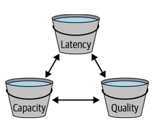
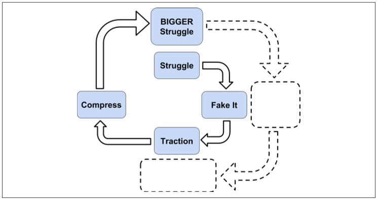

# Leading at Scale

Written by Ben Collins-Sussman
Edited by Riona MacNamara

第5章では、「個人的な貢献者」から「チームの明確なリーダー」になるとはどういうことかをお話しました。1つのチームを率いることから、関連する一連のチームを率いることになるのは自然な流れです。本章では、エンジニアリング・リーダーシップの道を歩み続ける中で、どのようにすれば効果的なのかを説明します。

あなたの役割が進化しても、ベストプラクティスはすべて適用されます。あなたは今でも "サーバント・リーダー "であり、より大きなグループに仕えているだけなのです。しかし、あなたが解決する問題の範囲は、より大きく、より抽象的になっていきます。あなたは徐々に "ハイレベル "になることを余儀なくされます。つまり、技術的なことにはあまり興味が持てなくなり、"ディープ "ではなく "ブロード "になることが求められるのです。細かい部分が失われていくのを嘆き、それまでのエンジニアリングの専門知識が自分の仕事にあまり関係なくなってきていることを実感します。むしろ、技術的な直感力や、エンジニアに良い方向に向かわせる能力が、これまで以上に重要になってくるのです。

このようなプロセスにはしばしば落胆させられますが、ある日、自分が個人として貢献していたときよりも、リーダーとしての影響力がはるかに大きいことに気づくのです。満足感はありますが、ほろ苦い実感です。

さて、リーダーシップの基本を理解したとして、本当に優れたリーダーになるためには何が必要なのでしょうか？ここでは、私たちが「リーダーシップの3つの要素」と呼んでいるものを使って、そのことをお話しします。「常に決断する」「常に去る」「常にスケールする」ということです。

## 常に決断すること

チームの中のチームを管理するということは、より高いレベルでより多くの意思決定を行うことを意味します。あなたの仕事は、特定のエンジニアリングタスクを解決する方法よりも、ハイレベルな戦略が重要になります。このレベルでは、ほとんどの意思決定は、正しいトレードオフを見つけることです。

### 飛行機の例え

Lindsay Jonesは私たちの友人で、プロの劇場用サウンドデザイナー兼作曲家です。彼はアメリカ中を飛び回り、プロダクションからプロダクションへと移動する生活を送っているので、飛行機にまつわるクレイジーな（そして真実の）話をたくさんしてくれます。その中でも特にお気に入りの話を紹介します。

 午前6時、私たちは全員飛行機に乗り込み、出発の準備をしています。機長がPAシステムを使って、誰かが燃料タンクに1万ガロンの燃料を入れすぎたと説明した。私は長い間、飛行機に乗ってきましたが、そのようなことが可能だとは知りませんでした。車の燃料を1ガロンも入れすぎたら、靴の中がガスだらけになってしまうでしょう？
 1時間以上かかるトラックが燃料を飛行機から吸い上げてくれるのを待つか、重量を均等にするために20人が今すぐ飛行機から降りるか、だ。
 誰も動かない。
 さて、ファーストクラスの通路を挟んで向かい側にいる男性がいるのですが、彼は本当に怒り狂っています。彼はM*A*S*Hのフランク・バーンズを思い起こさせるような感じで、非常に憤慨していて、いたるところで口をとがらせ、誰が責任を負うのかを要求しています。まるでマルクス・ブラザーズの映画に出てくるマーガレット・デュモンのように、素晴らしい見せ場を作っている。
 そこで彼は財布を手に取り、大量の札束を取り出した！ そして、「このミーティングに遅れるわけにはいかない！」と言ったのです。「今、この飛行機から降りてきた人には40ドルを差し上げます！」と。
 案の定、人々は彼の話に乗った。彼は20人に40ドルを配り（ちなみに800ドルの現金です！）、みんな降りていきました。
 さて、準備が整い、滑走路に向かうと、再び機長がPAに戻ってきた。飛行機のコンピューターが動かなくなった。原因は誰にもわからない。今すぐゲートまで牽引してもらわなければならない。
 フランク・バーンズは絶句した。マジで脳卒中になるかと思ったよ。罵声と悲鳴を上げている。他のみんなはお互いに見ているだけだ。
 ゲートに戻ると、この男は別の便を要求している。彼らは9時30分発の便を予約しようとしましたが、それでは遅すぎます。彼は「9:30より前の便はないのか」と言いました。
 ゲートエージェントは、「8時台に別のフライトがあったのですが、今は全部満席です。彼らは今、ドアを閉めています」。
 すると彼は「満席？満席ってなんだ？あの飛行機には空席が一つもないのか！？
 ゲートエージェントは、「いいえ、あの飛行機は、20人の乗客がどこからともなく現れて、すべての席を取るまでは、大きく開いていました。彼らは私が今まで見た中で最も幸せな乗客で、ジェットブリッジを降りるまでずっと笑っていました」。
 9時30分発の飛行機はとても静かだった。

この話はもちろん、トレードオフについてです。本書では、エンジニアリングシステムにおけるさまざまな技術的なトレードオフに焦点を当てていますが、トレードオフは人間の行動にも当てはまることがわかりました。リーダーであるあなたは、チームが毎週何をすべきかを決定しなければなりません。トレードオフが明白な場合もあれば（「このプロジェクトに取り組めば、他のプロジェクトが遅れる...」）、先ほどの話のように、トレードオフが予想外の結果をもたらし、あなたを苦しめることになる場合もあります。

最高レベルのリーダーとしてのあなたの仕事は、1つのチームであれ、より大きな組織であれ、困難で曖昧な問題を解決するために人々を導くことです。曖昧な問題とは、明らかな解決策がなく、解決不可能な問題であることを意味します。いずれにしても、問題を調査し、ナビゲートし、（願わくば）コントロールできる状態にまで持っていく必要があります。コードを書くことが木を切ることに似ているとすれば、リーダーの仕事は「木を見て森を見る」ことであり、その森の中で実行可能な道を見つけ、エンジニアを重要な木に向かわせることです。このプロセスには、大きく分けて3つのステップがあります。まず、目隠しをすること、次にトレードオフを見極めること、そして解決策を決定し、繰り返し実行することです。

### 目隠しをする

ある問題に初めて取り組んだとき、すでに何年もその問題に取り組んでいるグループがあることに気づくことがあります。これらの人々は、あまりにも長い間その問題に浸ってきたため、「目隠し」をしているのです。彼らは、問題（あるいは解決策）について、気づかないうちに多くの仮定をしています。批判的に現状を検討する能力を失った彼らは、「これはいつものやり方だ」と言います。時には現状を正当化するために進化してきた奇妙な対処法や合理化を発見することもあるでしょう。ここでは、新鮮な目を持つあなたが大きなアドバンテージを持っています。このような目隠しを見て、疑問を持ち、新しい戦略を考えることができます。(もちろん、問題に精通していないことが優れたリーダーシップの条件ではありませんが、多くの場合、それが利点となります）。)

### 重要なトレードオフを特定する

定義上、重要で曖昧な問題には、魔法のような「銀の弾丸」のような解決策はありません。すべての状況で永遠に通用する答えはありません。あるのはその時のベストな答えだけで、それはほぼ間違いなく、ある方向へのトレードオフを伴うものです。トレードオフを指摘し、皆に説明し、そのバランスをどうとるかを決めるのがあなたの仕事です。

### 決断して、繰り返す

トレードオフとその仕組みを理解した後は、力が湧いてきます。この情報をもとに、その月に最適な判断を下すことができます。来月になれば、トレードオフを再評価し、バランスを調整する必要があるかもしれません。これが、「常に決断を」という言葉の意味です。

ここにはリスクがあります。トレードオフのバランスを継続的に調整するようにプロセスを設定しないと、チームは完璧なソリューションを探すという罠に陥る可能性があり、それは「分析麻痺」と呼ばれるものになるかもしれません。そのためには、チームがイテレーションに慣れ親しむ必要があります。そのためには、「今日はこんなことをやってみようと思います」と説明して、緊張感を和らげるのが一つの方法です。「この決定をしてみて、どうなるか見てみよう。来月になれば、この変更を元に戻すこともできるし、別の決定をすることもできます。そうすることで、人々は柔軟性を保ち、自分の選択から学ぶことができるのです。

----

### ケーススタディ ウェブ検索の「レイテンシー」への対応

複数のチームを管理していると、単一の製品から離れて、製品の「クラス」全体、あるいは製品を横断するより広い問題を所有するようになる傾向があります。Googleの場合は、最も古い製品であるウェブ検索がその良い例です。

何年もの間、何千人ものGoogleエンジニアが、検索結果をより良いものにするという一般的な問題に取り組んできました。つまり、検索結果ページの「品質」を向上させるのです。しかし、この品質の追求には副作用があり、製品の動作が徐々に遅くなることが判明した。かつて、Googleの検索結果は、それぞれが関連するウェブサイトを表す10個の青いリンクのページ以上のものではありませんでした。しかし、この10年間で、「品質」を向上させるために何千もの小さな変更を加えた結果、画像、動画、ウィキペディアの情報を記載したボックス、さらにはインタラクティブなUI要素など、検索結果はますます高度なものになってきました。これは、サーバーが情報を生成するために、より多くの仕事をしなければならないことを意味します。より多くのバイトがワイヤー上で送信され、クライアント（通常は携帯電話）はこれまで以上に複雑なHTMLやデータのレンダリングを求められます。この10年間でネットワークやコンピューターの速度は格段に向上しましたが、検索ページの速度はどんどん遅くなり、レイテンシーも大きくなっています。大したことではないと思われるかもしれませんが、製品のレイテンシーは、ユーザーのエンゲージメントや使用頻度に直接影響します（全体として）。レンダリング時間の増加は、10ms程度の小さなものでも問題となります。レイテンシーはゆっくりと上昇していきます。これは、特定のエンジニアリングチームのせいではなく、長い間の集団的な汚染の結果です。ある時点で、ウェブ検索の全体的なレイテンシーが大きくなり、その影響で、検索結果の「質」の向上によって得られたユーザーエンゲージメントの改善が打ち消されるようになる。

何人ものリーダーが長年にわたってこの問題に取り組んできたが、組織的に対処することはできなかった。皆が身につけていた目隠しは、レイテンシーに対処する唯一の方法は、2〜3年ごとにレイテンシーの「コードイエロー」(*1)を宣言し、皆がコードの最適化と製品のスピードアップに全力を尽くすことだと考えていた。この作戦は一時的には有効だが、1〜2ヵ月後には再びレイテンシーが上昇し始め、すぐに元のレベルに戻ってしまう。

では、何が変わったのでしょうか？ある時点で、私たちは一歩下がって目隠しをし、トレードオフを全面的に再評価しました。その結果、「品質」を追求することには、1つではなく、2つの異なるコストがかかることがわかりました。1つ目のコストはユーザーに対するもので、品質が高ければ高いほど、より多くのデータが送信されることになり、その分、遅延も大きくなります。2つ目のコストは、Googleにとってのコストです。品質が高ければ高いほど、データを生成するために多くの作業を行うことになり、サーバーのCPU時間が増えることになります。品質とキャパシティのトレードオフについては、これまでもリーダーシップを発揮して慎重に検討してきましたが、レイテンシーを計算の中で完全に市民権を得ているとは言えませんでした。古いジョークにあるように、「良いもの、速いもの、安いもの......2つ選べ」というわけだ。トレードオフを表現する簡単な方法は、図6-1に示されているように、Good（品質）、Fast（レイテンシー）、Cheap（容量）の間に緊張のトライアングルを描くことです。

Figure 6-1. ウェブ検索におけるトレードオフ：2つの選択

それはまさにここで起きていたことです。これらの特性のうち、どれか1つを改善するには、他の2つの特性のうち少なくとも1つを意図的に害することが簡単にできます。例えば、検索結果ページにより多くのデータを載せることで品質を向上させることができますが、そうすると容量とレイテンシーが損なわれます。レイテンシーとキャパシティの直接的なトレードオフを行うには、サービングクラスタのトラフィック負荷を変更することもできます。より多くのクエリをクラスタに送信すると、CPUの利用率が向上するという意味で容量が増加し、ハードウェアのコストに見合った効果が得られます。しかし、負荷が高いとコンピュータ内のリソースの競合が激しくなり、クエリの平均レイテンシーが悪化します。クラスタのトラフィックを意図的に減少させる（クールに運用する）と、全体的な処理能力は低下しますが、各クエリは高速化します。

ここで重要なのは、この洞察、つまりすべてのトレードオフに対する理解が深まったことで、バランスをとるための新しい方法を試すことができるようになったということです。遅延を避けられない偶発的な副作用として扱うのではなく、他の目標と同様に第一級の目標として扱うことができるようになったのです。これにより、新たな戦略が生まれました。例えば、データサイエンティストは、レイテンシーによってユーザーエンゲージメントがどれだけ低下するかを正確に測定することができました。これにより、品質に起因する短期的なユーザーエンゲージメントの向上と、レイテンシーに起因する長期的なユーザーエンゲージメントの低下を比較する指標を構築することができました。このアプローチにより、製品の変更について、よりデータに基づいた判断ができるようになりました。例えば、ある小さな変更が品質を向上させる一方でレイテンシーを悪化させた場合、その変更を開始する価値があるかどうかを定量的に判断することができます。私たちは、品質、レイテンシー、容量の変更がバランスよく行われているかどうかを常に判断し、毎月その判断を繰り返しています。

----

## Always Be Leaving

『Always Be Leaving』は、一見するとひどいアドバイスのように聞こえます。優秀なリーダーがなぜ去ろうとするのか？実はこれ、元Googleのエンジニアリングディレクター、バラット・メディラッタの有名な言葉なのです。彼が言いたかったのは、曖昧な問題を解決することだけがあなたの仕事ではなく、あなたがいなくても組織が自力で問題を解決するように仕向けることが大切だということです。それができれば、あなたは自由になって、新しい問題（あるいは新しい組織）に移ることができ、自給自足の成功の痕跡を残すことができるのです。

ここでのアンチパターンは、自分がSPOF（シングル・ポイント・オブ・フェイル）になってしまうことです。本書の冒頭で述べたように、Googlerにはバス・ファクターという言葉があります。これは、あなたのプロジェクトが完全に破滅するまでにバスに轢かれる必要がある人数のことです。

もちろん、ここでいう「バス」は単なる比喩です。人は病気になったり、チームや会社を変えたり、引っ越しをしたりします。リトマス試験として、あなたのチームが順調に進んでいる難しい問題について考えてみてください。ここで、リーダーであるあなたがいなくなったと想像してみてください。あなたのチームは進み続けますか？チームは成功し続けていますか？もっと簡単なテストをしてみましょう。最後に取った少なくとも1週間の休暇について考えてみてください。あなたは仕事のメールをチェックし続けましたか？(ほとんどのリーダーはチェックしています）その理由を自分に聞いてみてください。注意を払わないと物事がうまくいかないのか？もしそうなら、あなたは自分自身をSPOFにしてしまっている可能性が高いです。それを直さなければなりません。

### あなたの使命。「自走する」チームを作る

バラットの言葉に戻ると、成功するリーダーとは、困難な問題を自力で解決できる組織を構築することです。そのためには、強力なリーダー、健全なエンジニアリングプロセス、ポジティブで永続的な文化を持つ組織が必要です。これは難しいことです。しかし、チームを率いるということは、技術的な魔法使いであるよりも、むしろ人をまとめることであることが多いという事実に戻ります。繰り返しになりますが、このような自給自足のグループを構築するには、問題空間の分割、サブプロブレムの委譲、必要に応じた反復という3つの主要な部分があります。

### 問題空間の分割

難易度の高い問題は、たいてい難しいサブプロブレムで構成されています。もしあなたがチームを率いるなら、各サブプロブレムを担当するチームを作るのが当然の選択です。しかし、サブプロブレムは時間の経過とともに変化するものであり、硬直したチームの境界ではその事実に気づくことも適応することもできないというリスクがあります。できれば、サブチームの規模を変えたり、個人がサブチーム間を移動したり、サブチームに割り当てられた問題が時間の経過とともに変化したりするような、ゆるい組織構造を考えてみてください。これには、「厳しすぎる」と「漠然としすぎている」の間の微妙なバランスが必要です。一方で、サブチームには明確な問題意識、目的意識、着実な達成感を持ってもらいたいと思いますが、一方で、環境の変化に応じて方向性を変えたり、新しいことに挑戦したりする自由も必要です。

#### 例 Google検索の「待ち時間問題」の細分化

検索の待ち時間の問題に取り組む際、私たちはこの問題が少なくとも2つの一般的な空間に細分化できることに気づきました。遅延の症状に対処する作業と、遅延の原因に対処する別の作業です。コードベースのスピードを最適化するために多くのプロジェクトに人員を投入する必要があることは明らかでしたが、スピードだけに焦点を当てていても十分ではありません。検索結果の複雑さと「質」を高めるために、何千人ものエンジニアがいたのです。そのため、並行して、遅延を未然に防ぐという問題に取り組む人材も必要でした。私たちは、測定基準や遅延分析ツールにギャップを発見しました。指標、遅延解析ツール、開発者への教育やドキュメントにもギャップがありました。遅延の原因と症状を同時に解決するために、異なるチームを配置することで、長期的に遅延を組織的にコントロールすることができました。(また、これらのチームは具体的な解決策ではなく、問題を所有していることにも注目してください！。)

#### サブプロブレムをリーダーに任せる

マネジメントの本で「委任」について語るのは、基本的には決まり文句のようになっていますが、それには理由があります。効率や成果を求める人間の本能に反しているからです。その難しさゆえに、"If you want something done right, do it yourself. "という格言が生まれたのです。

とはいえ、自分のミッションが自走する組織を作ることであると同意するならば、教育の主なメカニズムは「委任」である。自己完結型のリーダーを作る必要がありますが、その育成には「委任」が最も効果的です。課題を与えて、失敗させて、また挑戦させる。シリコンバレーでは、"Failing Fast and Iterating "という言葉がよく知られています。この哲学は工学設計だけでなく、人間の学習にも当てはまります。

リーダーになると、やらなければならない重要な仕事が次々と舞い込んできます。これらのタスクのほとんどは、あなたにとってかなり簡単なことです。例えば、あなたが受信トレイを使って熱心に問題に対応しているときに、20分だけ確保して長年の懸案事項を解決しようと思ったとします。しかし、その作業を実行する前に、心を鬼にして自分を止めてください。問いかけてみてください。この仕事をできるのは、本当に自分だけだろうか？

確かに自分がやるのが一番効率的かもしれませんが、それではリーダーの育成ができていません。自立した組織を作ることができないのです。その仕事が本当に一刻を争うものでなければ、思い切って他の人に仕事を任せましょう。おそらく、あなたがその仕事ができると分かっていても、完成までにはかなりの時間がかかるでしょう。必要であれば、その人に仕事をコーチしてあげてください。あなたは、リーダーが成長する機会を作る必要があります。彼らが「レベルアップ」することを学び、あなたがクリティカルパスから外れるように、この仕事を自分で行う必要があります。

ここで重要なのは、リーダーのリーダーとしての自分の目的を意識することです。もし、自分が雑草の中に入り込んでいるとしたら、それは組織にとって不利益なことです。毎日出勤する際には、自分自身に別の重要な質問をしてみてください。チームの他の誰にもできないことを、私は何かできるだろうか？

良い答えはいくつもあります。例えば、組織の政治的な動きからチームを守ること、チームを励ますこと、全員がお互いによく接していることを確認し、謙虚さ、信頼、尊敬の文化を作ることなどが挙げられます。また、"マネジメントアップ "も重要です。自分たちのグループが何をしているかをマネジメントチェーンに理解させ、会社全体とのつながりを保つことです。しかし、この質問に対する最も一般的で重要な答えは、"木を見て森を見ることができる "というものです。言い換えれば、ハイレベルな戦略を定義できるということです。戦略には、技術的な方向性だけでなく、組織的な戦略も含まれている必要があります。曖昧な問題をどのように解決し、組織としてどのように管理していくかの青写真を描くのです。あなたは継続的に森の地図を作り、木を切る作業を他の人に任せるのです。

#### アジャストとイテレーション

今、あなたは自立したマシンを構築するところまで到達したと仮定しましょう。あなたはもうSPOFではありません。おめでとうございます。今、あなたは何をしていますか？

答えを出す前に、あなたは実際に自分自身を解放したことに注意してください --- あなたは今、"常に残る "自由を手にしています。それは、新しい隣接した問題に取り組む自由かもしれませんし、あるいは、自分が育てたリーダーのキャリアのためのスペースを確保して、全く新しい部門や問題領域に自分を移動させることもできるでしょう。これは、個人的な燃え尽きを避けるための素晴らしい方法です。

「これからどうするか」のシンプルな答えは、この機械に指示を出し、健全な状態を保つことです。しかし、危機的な状況でない限りは、穏やかなタッチで接するべきです。『チームをデバッグする』(*2)という本には、心を込めて調整するというたとえ話があります。

 退職して間もない機械の達人の話があります。彼が以前勤めていた会社では、誰にも解決できない問題を抱えていたので、問題解決の手助けをしてもらえないかと師匠を呼んだのです。師匠は機械を調べ、話を聞き、やがて使い古したチョークを取り出して、機械の側面に小さなXを描いた。彼は技術者に、その場所に修理が必要なワイヤーの緩みがあることを伝えた。技術者は機械を開けて、緩んだワイヤーを締め付けた。これで問題は解決した。師匠から1万ドルの請求書が届くと、怒ったCEOは、たった1つのチョークマークのために、この馬鹿げた高額な料金の内訳を要求する手紙を出した。その請求書には、マークをつけるためのチョーク代が1ドル、マークをつける場所を知るための費用が9,999ドルと書かれていた。
 私たちにとっては、これは「知恵」の話であり、一つの慎重な調整が巨大な効果をもたらすということです。私たちは、人を管理するときにこの手法を使っています。チームが大きな飛行船に乗って、ゆっくりと確実に一定の方向に向かって飛んでいるように想像するのです。私たちは、チームを飛行船に見立て、ゆっくりと確実に一定の方向に向かっていると考えます。週の終わりには、飛行船の正確な位置に小さなチョークマークを付け、小さくても重要な「タップ」をしてコースを調整します。

これこそが、優れたマネジメントの本質です。95%は観察と傾聴、5%は適切な場所で重要な調整を行うことです。リーダーや報告書に耳を傾ける。顧客と話をする。多くの場合（特にあなたのチームがエンジニアリング・インフラを構築している場合）、あなたの「顧客」は世界のエンドユーザーではなく、あなたの同僚であることを忘れてはならない。お客様の幸せのためには、報告者の幸せと同じくらい熱心に耳を傾ける必要があります。何がうまくいっていて、何がうまくいっていないのか。この自動運転の飛行船は、適切な方向に向かっているでしょうか？あなたの方向性は反復的であるべきですが、思慮深く、最小限の調整を行い、軌道修正をする必要があります。もし、マイクロマネジメントに逆戻りしたら、再びSPOFになってしまう危険性があります。"Always Be Leaving "は、マクロマネジメントへの呼びかけです。

#### チームのアイデンティティを確立するための注意点

よくある間違いは、あるチームが一般的な問題ではなく、特定の製品を担当することです。製品とは、問題に対する解決策です。解決策の寿命は短く、製品はより良い解決策に取って代わられることがあります。しかし、問題は、うまく選択すれば、永遠に残るものです。チームのアイデンティティを特定のソリューションに固定してしまうと（「私たちはGitリポジトリを管理するチームです」）、時間の経過とともに様々な問題が発生します。もし、エンジニアの大部分が新しいバージョンコントロールシステムに切り替えたいと思ったらどうしますか？そのチームは、たとえそれが組織にとって最善の道ではないとしても、自分たちの解決策を守り、変化に抵抗して「頑張る」ことになるでしょう。解決策がチームのアイデンティティと自己価値の一部になっているため、チームは目隠しに固執します。チームが問題を所有する代わりに（例えば、「我々は会社にバージョンコントロールを提供するチームである」）、時間をかけて様々なソリューションを試すことができるようになります。

## 常にスケーリングする

多くのリーダーシップの本では、「スケーリング」について、「自分の影響力を最大化する」ための学習---チームや影響力を大きくするための戦略---という文脈で語られています。ここでは、これまで述べてきたこと以上の話はしません。強力なリーダーを擁する自走式の組織を構築することが、成長と成功のための素晴らしいレシピであることは、おそらく明白でしょう。

代わりに、攻撃的な視点ではなく、防御的かつ個人的な視点からチームのスケーリングについて説明します。リーダーとして最も貴重な資源は、限られた時間、注意、エネルギーです。もしあなたが、自分の正気を守ることなく、積極的にチームの責任と権限を拡大するなら、スケーリングは失敗する運命にあります。そこで今回は、自分自身を効果的にスケーリングする方法をご紹介します。

### 成功のサイクル

チームが困難な問題に取り組むとき、ある種の標準的なパターン、つまりサイクルが生まれます。それは次のようなものです。

- 分析
  - まず、問題を受け取り、それとの格闘を始めます。目のつけどころを見極め、すべてのトレードオフを見つけ出し、それらをどのように管理するかについてコンセンサスを得る。
- 闘争
  - チームが準備できたと思っているかどうかに関わらず、作業を開始します。失敗、リトライ、イテレーションに備えます。この時点では、あなたの仕事はほとんど猫の手も借りたい状態です。リーダーや現場の専門家に意見を求め、最初は "ごまかし "でもいいから耳を傾け、全体の戦略を練りましょう（※3）。
- トラクション
  - やがて、チームは物事を理解し始めます。より賢明な判断ができるようになり、真の進歩が見られるようになります。士気も高まります。トレードオフを繰り返し、組織は問題解決に向けて自走するようになりました。お疲れ様でした
- 報酬
  - 思いがけないことが起こります。上司があなたを囲み、成功を祝福してくれます。褒められただけではなく、全く新しい問題に取り組むことになったのです。そうです。成功の報酬は、より多くの仕事...そしてより多くの責任なのです。多くの場合、それは最初の問題と似たり寄ったりで、同じくらい難しい問題です。

困ったことになりましたね。新しい問題を与えられたが、（通常は）人数は増えない。どうにかして両方の問題を解決しなければなりませんが、それはおそらく、元の問題を半分の人数で半分の時間で処理しなければならないことを意味します。新しい仕事に取り組むためには、残りの半分の人員が必要なのです。この最終段階を「圧縮段階」と呼んでいますが、今までやってきたことを半分の大きさに圧縮するわけです。

つまり、成功のサイクルは、スパイラルのようなものなのです（図6-2参照）。数ヶ月から数年かけて、組織は新しい問題に取り組み、その問題を圧縮する方法を見つけ出して、新しい並行した問題に取り組めるようにすることでスケールアップしていきます。運が良ければ、その過程で人を増やすことができます。しかし、多くの場合、採用がスケールアップに追いついていないのが現状です。Googleの創業者の一人であるラリー・ペイジは、このスパイラルを「uncomfortably exciting」と表現するでしょう。

Figure 6-2. 成功のスパイラル

成功のスパイラルというのは難問です。管理が難しいものであると同時に、チームの中でチームを拡大するための主要なパラダイムでもあります。問題を圧縮するという行為は、チームの効率を最大化する方法を考えるだけでなく、新たな責任の範囲に合わせて自分の時間と注意を拡大することを学ぶことでもあります。

### 重要なことと緊急なこと

あなたがまだリーダーではなく、気楽な個人貢献者だった頃のことを思い出してみてください。もしあなたがプログラマーだったら、もっと穏やかでパニックのない生活を送っていたことでしょう。やるべきことのリストがあって、毎日、コードを書いたり、問題をデバッグしたりしながら、リストを几帳面に書き進めていました。仕事の優先順位を決め、計画を立て、実行することは簡単でした。

しかし、リーダーシップを発揮するようになると、自分の主な仕事のやり方が予測可能なものではなくなり、消火活動のようなものになっていることに気づいたかもしれません。つまり、あなたの仕事はプロアクティブではなく、リアクティブになったのです。リーダーになればなるほど、エスカレーションが増えていきます。あなたは、コードブロックの長いリストの中の「最後の」条項です。電子メール、チャットルーム、会議など、すべてのコミュニケーション手段が、あなたの時間と注意力に対するサービス拒否攻撃のように感じられるようになりました。実際、意識していなければ、時間の100％を反応モードで過ごすことになります。人々があなたにボールを投げつけ、あなたは必死になってボールからボールへと飛び移り、ボールが地面に落ちないようにしているのです。

この問題については、多くの書籍で取り上げられています。経営学者のスティーブン・コヴィーは、「重要なことと緊急なことを区別する」というアイデアを語ったことで有名です。実は、この考え方を広めたのは、1954年に発表されたドワイト・D・アイゼンハワー米国大統領の名言である。

 私には2種類の問題があります。緊急のものと重要なものです。緊急のものは重要ではなく、重要なものは決して緊急ではありません。

この緊張感は、リーダーとしての効果を発揮する上での最大の危険性のひとつです。もし自分が純粋なリアクティブ・モードに陥ってしまうと（ほとんど自動的にそうなってしまう）、人生のあらゆる瞬間を緊急性の高いものに費やしてしまいますが、それらのものは大局的にはほとんど重要ではありません。リーダーとしてのあなたの仕事は、森の中に道を作るように、あなたにしかできないことをすることだということを忘れないでください。メタ戦略の構築は非常に重要ですが、緊急性はほとんどありません。それよりも、次の緊急メールに返信するほうが簡単です。

では、緊急性の高いものではなく、重要なものに集中して取り組むようにするにはどうすればいいのでしょうか。いくつかの重要なテクニックをご紹介しましょう。

- 委任
  - あなたが目にした緊急性の高い事柄の多くは、組織内の他のリーダーに委ねることができます。些細なタスクであれば罪悪感を感じるかもしれませんし、問題の解決に他のリーダーが時間をかける可能性があるため、問題を委ねることは非効率的だと心配するかもしれません。しかし、他のリーダーにとっては良いトレーニングになりますし、自分の時間を確保して、自分にしかできない重要な仕事に取り組むことができます。
- 専用の時間を設ける
  - 定期的に2時間以上の時間を確保し、静かに座って、チーム戦略、リーダーのキャリアパス、近隣のチームとの連携方法など、緊急ではないが重要なことだけに取り組むようにしましょう。
- 自分に合ったトラッキングシステムを見つける
  - 仕事をトラッキングしたり、優先順位をつけたりするシステムは何十種類もあります。ソフトウェアベースのもの（例えば、特定の「to-do」ツール）、ペンと紙を使ったもの（「バレットジャーナル」方式）、そしてシステムの導入にこだわらないものもあります。この最後のカテゴリーでは、デビッド・アレンの著書『Getting Things Done』がエンジニアリングマネージャーの間で非常に人気があります。これは、タスクを処理し、自慢の「受信トレイゼロ」を維持するための抽象的なアルゴリズムです。ここで重要なのは、これらの異なるシステムを試して、自分に合うものを見極めることです。しかし、コンピュータの画面を飾る小さなメモよりも効果的なものを見つける必要があるのは間違いありません。

### ボールを落とすことを学ぶ

時間を管理するために、もう一つ重要なテクニックがあります。それは、一見すると過激に聞こえます。多くの人にとって、それは長年のエンジニアとしての本能に反するものです。エンジニアは細部にまで気を配ります。リストを作り、リストにチェックを入れ、正確に、始めたことは最後までやり遂げようとします。だからこそ、バグトラッカーでバグを解決したり、メールの受信箱をゼロにしたりすると、とても気持ちがいいのです。しかし、リーダーの中のリーダーとして、あなたの時間と注意は常に攻撃されています。どんなに避けようとしても、結局はボールを床に落としてしまいます。圧倒的な数のボールがあなたに投げつけられているのです。

さて、ここで一歩下がって、この状況を率直に見てみましょう。ある程度の数のボールを落とすことが避けられないのであれば、あるボールを偶然ではなく意図的に落とした方が良いのではないでしょうか？そうすれば、ある程度のコントロールが可能になります。

そのための素晴らしい方法があります。

近藤麻理恵さんは、『人生が変わる片づけの魔法』という大人気の本の著者であり、整理収納コンサルタントです。彼女の哲学は、家の中のガラクタを効果的に断捨離することですが、抽象的な散らかりにも有効です。

あなたの持ち物は、3つの山に分かれていると考えてみてください。あなたの物の約20％は、ただの無駄なものです。文字通り、あなたがもう触れることのないもので、すべて簡単に捨てることができます。あなたの持ち物の約60％は、やや興味深いもので、あなたにとっての重要性は様々で、使うときもあれば使わないときもあります。そして、約20％の物は、非常に重要な物です。これは、いつも使っている物で、深い感情的な意味を持ち、近藤さんの言葉を借りれば、持っているだけで深い「喜び」を感じる物です。近藤さんの本のテーマは、多くの人が間違った断捨離をしているということです。下から2割のものをゴミ箱に捨てることに時間をかけても、残りの8割はまだ散らかっていると感じているのです。彼女は、本当の断捨離とは、下の20％ではなく、上の20％を見極めることだと主張します。重要なものだけを特定できたら、残りの8割は捨ててしまえばいいのです。極端な言い方ですが、効果は絶大です。ここまで思い切った断捨離をすると、とても気持ちが楽になります。

この哲学は、あなたの受信トレイやタスクリストにも適用できることがわかりました。ボールの山を3つのグループに分けてみましょう。下の20％は、おそらく緊急でも重要でもなく、削除したり無視したりするのがとても簡単なものです。中間の60％は、緊急性や重要性のあるものが含まれているかもしれませんが、混ざっています。一番上には、絶対的に重要なものが20％あります。

そうすると、タスクを処理する際に、上の80％に取り組もうとしないでください。そうすると、圧倒されてしまい、ほとんどが緊急だが重要ではないタスクを処理することになります。それよりも、上位20％に入る重要なこと、つまり自分にしかできないことを意識して見つけ出し、それに集中することです。残りの80％を捨ててもいいという明確な許可を自分に与えてください。

最初は嫌な感じがするかもしれませんが、意図的に多くのボールを落としていくうちに、2つの素晴らしいことを発見します。1つ目は、中間の60％のタスクを委任しなくても、サブリーダーが気づいて自動的に拾ってくれることです。2つ目は、中間のバケツに入っているものが本当に重要なものであれば、どのみちあなたのところに戻ってきて、最終的には上位20％に移行します。トップ20％以下のものは、適切に処理されるか、あるいは適切に進化すると信じていればよいのです。一方で、重要なことだけに集中しているので、増え続けるグループの責任をカバーするために、時間と注意を拡大することができます。

### 自分のエネルギーを守る

ここまで、時間と注意力を守ることについて説明してきましたが、もうひとつの重要な要素は、個人のエネルギーです。このような環境では、どのようにしてエネルギーを補給し、楽観的でいることができるでしょうか。このような環境の中で、どうやってエネルギーを維持し、楽観的になることができるでしょうか？

その答えのひとつは、年齢を重ねるごとに、全体的なスタミナがついてくることです。仕事を始めたばかりの頃は、1日8時間のオフィスワークがショックで、家に帰ると疲れてボーッとしてしまうことがあります。しかし、マラソンの練習と同じように、脳も体も時間をかけてスタミナを蓄えていくのです。

もう1つの重要なポイントは、リーダーは自分のエネルギーをより賢く管理することを徐々に学んでいくということです。それは、常に注意を払うようになることです。具体的には、現在の自分のエネルギー量を把握し、特定の瞬間に特定の方法で「充電」することを意図的に選択することです。マインドフルなエネルギー管理の素晴らしい例をいくつかご紹介しましょう。

- 本物のバケーションを取る
  - 週末だけでは休暇とは言えません。仕事を「忘れる」ためには最低3日、実際にリフレッシュするためには最低1週間は必要です。しかし、仕事のメールやチャットをチェックしてしまうと、せっかくの充電が台無しになってしまいます。心配事が次々と頭に浮かんできて、心理的に距離を置くことのメリットがすべて消えてしまいます。バケーションの充電は、本当に自分を律して断ち切らなければならないのです(*4)。もちろん、これは自走する組織を構築してこそ可能なことです。
- 切り離すことを些細なことにする
  - 接続を切るときは、仕事用のノートパソコンをオフィスに置いておく。スマホに仕事用の通信が入っている場合は、それを外します。例えば、あなたの会社がG Suite（Gmail、Googleカレンダーなど）を使用している場合、これらのアプリを携帯電話の「仕事用プロファイル」にインストールするのが良い方法です。これにより、2つ目の仕事用のアプリがスマホに表示されます。例えば、Gmailのアプリを2つ用意して、1つは個人用のメール、もう1つは仕事用のメールとします。Android端末では、ボタンを1つ押すだけで、仕事用のアプリを一斉に無効にすることができます。すべての仕事用アプリは、あたかもアンインストールされたかのようにグレーアウトし、仕事用プロファイルを再び有効にするまでは、仕事用メッセージを「誤って」チェックすることはできません。
- 本当の週末も大切に
  - 週末は、休暇ほどの効果はありませんが、若返りの効果はあります。ただし、この場合も、仕事の連絡を断ち切ることが必要です。金曜日の夜にサインアウトして、週末は自分の好きなことをして過ごし、月曜日の朝にサインインして会社に戻ってくる、という方法を試してみてください。
- 1日のうちに休憩をとる
  - 脳は90分サイクルで動いています(*5)。立ち上がってオフィス内を歩いたり、10分ほど外を歩いたりしてみてください。このような小さな休憩は小さな充電に過ぎませんが、ストレスレベルや次の2時間の仕事での気分に大きな違いをもたらします。
- メンタルヘルスデーの許可を自分に与える
  - 時には、理由もなく嫌なことがあるものです。よく寝て、よく食べて、よく運動したはずなのに、それでも気分が悪い。あなたがリーダーであれば、これは大変なことです。あなたの機嫌の悪さは、周りの人たちのトーンを決めてしまい、ひどい決断（送るべきではないメール、過度に厳しい判断など）につながってしまいます。もしこのような状況に陥った場合は、病欠を宣言して家に帰りましょう。積極的にダメージを与えるよりも、その日は何もしないほうがいいのです。

結局のところ、エネルギーの管理は、時間の管理と同じくらい重要です。これらのことをマスターすれば、責任を拡大し、自給自足のチームを構築するという幅広いサイクルに取り組む準備ができます。

## 結論

成功しているリーダーは、成長するにつれ、自然と責任が重くなっていきます（それは良いことであり、自然なことでもあります）。しかし、迅速な意思決定、必要な時の委任、増えた責任の管理などを適切に行うためのテクニックを効果的に身につけていなければ、圧倒されてしまうことになるかもしれません。効果的なリーダーになるためには、完璧な意思決定をしたり、すべてのことを自分で行ったり、2倍の努力をしたりする必要はありません。それよりも、常に決断し、常に残し、常にスケーリングすることを心がけてください。

## TL;DRs

- 常に決断すること。曖昧な問題には、魔法のような答えはありません。その場その場で適切なトレードオフを見つけ、それを繰り返していくことが大切です。
- Always Be Leaving: リーダーであるあなたの仕事は、ある種の曖昧な問題を、あなたがいなくても時間をかけて自動的に解決する組織を作ることです。
- 常にスケーリングする。成功すればするほど、より多くの責任が発生します。あなたは、個人の時間、注意、エネルギーという希少資源を守るために、この仕事のスケーリングを積極的に管理しなければなりません。

------

1 "Code yellow "とは、Googleの用語で「重大な問題を解決するための緊急ハッカソン」のこと。影響を受けたチームは、緊急事態の終了が宣言されるまで、すべての作業を中断し、問題に100％の注意を払うことが求められる。
2 Brian W. Fitzpatrick and Ben Collins-Sussman, Debugging Teams: Better Productivity through Collaboration』（Boston: O'Reilly, 2016）。
3 この時点でインポスター症候群が発生しやすくなります。自分が何をしているのかわからない」という気持ちに対抗するテクニックの1つとして、「何をすべきかを正確に知っている専門家がいる」「その人は単に休暇中で、自分は一時的にその人の代役を務めている」と思い込むことがあります。これは、個人的な利害関係を排除し、自分に失敗と学習の許可を与えるための素晴らしい方法です。
4 事前に計画を立て、休暇中には仕事が終わらないことを前提にしておく必要があります。休暇の前後に一生懸命（または賢く）働くことで、この問題を軽減することができます。
5 BRACについては、https://en.wikipedia.org/wiki/Basic_rest-activity_cycle をご覧ください。

